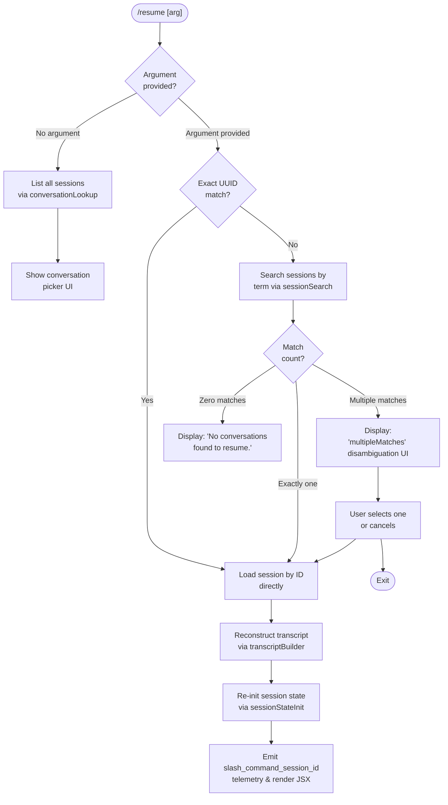

# `/resume`

> Analysis basis: CC v2.1.142 bundle.js (AST extraction + Claude interpretation)
> Minimum version: v2.1.142

---

## Overview

`/resume` (aliased as `/continue`) reopens a previous Claude Code conversation by session ID or by matching a search term against stored conversation history. It locates the target session, reconstructs the conversation state from the transcript store, and re-initialises the active session so the user can continue from where they left off.

---

## Registration

| Field | Value |
|---|---|
| type | `local-jsx` |
| name | `resume` |
| description | `Resume a previous conversation` |
| aliases | `["continue"]` |
| argumentHint | `[conversation id or search term]` |
| module_id | `Cwq` |
| load_inline | `true` |
| loc_byte | `11183893` |
| loc_byte_end | `11184090` |
| loc_line | `6664` |
| arbor_handler.name | `_E7` |
| arbor_handler.fqn | `claude-2.1.142::_E7` |
| arbor_handler.kind | `AsyncFunction` |
| arbor_handler.resolution_path | `module_id` |
| arbor_handler.n_hits | `0` |

Analysis basis: CC v2.1.142 bundle.js:+11183893

---

## Input Branching

Five distinct branches exist based on argument parsing and search results, so a Mermaid flowchart is used.



Analysis basis: CC v2.1.142 bundle.js:+11182563, +11182704, +11182936, +11180130, +11180201

---

## Behavioral Spec

### 1. Entry Point — Handler (`_E7`)

The primary handler for `/resume` is the async function `_E7`, resolved by Arbor via the `module_id` path (`Cwq`).

```
async function resumeCommandHandler(cmdArgs, appContext):
    // Step 1: filter out invalid/skip-flagged conversations
    filteredSessions = filterSessions(allSessions, "skip")
    // Analysis basis: CC v2.1.142 bundle.js:+11182704

    // Step 2: attempt to detect current worktree context
    worktreeInfo = detectWorktree(appContext)
    // Analysis basis: CC v2.1.142 bundle.js:+11182686

    // Step 3: call conversation loader (NH)
    conversationList = await loadConversations(worktreeInfo)
    // Analysis basis: CC v2.1.142 bundle.js:+11182722

    // Step 4: build git-worktree context string
    worktreeLabel = buildWorktreeLabel(worktreeInfo)
    // Analysis basis: CC v2.1.142 bundle.js:+11182751

    // Step 5: create JSX element for the resume UI
    uiElement = createElement(resumePickerComponent, {
        sessions: conversationList,
        worktree: worktreeLabel,
        timestamp: Date.now()
    })
    // Analysis basis: CC v2.1.142 bundle.js:+11182787, +11182813

    // Step 6: resolve conversation history for the selected session
    historyResult = await resolveConversationHistory(cmdArgs, conversationList)
    // Analysis basis: CC v2.1.142 bundle.js:+11182858

    // Step 7: if no match found, display empty-state message
    if historyResult is empty:
        return renderMessage("No conversations found to resume.")
        // Analysis basis: CC v2.1.142 bundle.js:+11182936

    // Step 8: apply session state from resolved history
    applySessionState(historyResult, appContext)
    // Analysis basis: CC v2.1.142 bundle.js:+11182862

    // Step 9: render conversation-picker or launch session
    renderOrLaunch(historyResult, uiElement)
    // Analysis basis: CC v2.1.142 bundle.js:+11182876

    // Step 10: emit slash_command_session_id telemetry
    emitSlashCommandSessionId(historyResult.sessionId)
    // Analysis basis: CC v2.1.142 bundle.js:+11183197

    // Step 11: emit slash_command_title telemetry
    emitSlashCommandTitle(historyResult.title)
    // Analysis basis: CC v2.1.142 bundle.js:+11183421
```

### 2. Conversation History Resolution (`hNH`)

`hNH` is the conversation-history resolver, reached from `_E7` at bundle.js:+11182858. It performs worktree detection and fuzzy-matching of stored sessions.

```
async function resolveConversationHistory(searchTerm, sessions):
    // Detect git worktrees via shell: git worktree list --porcelain
    // Analysis basis: CC v2.1.142 bundle.js:+11179486, +11179497, +11179504
    worktrees = await spawnGit(["worktree", "list", "--porcelain"])
    // Emit tengu_worktree_detection telemetry
    // Analysis basis: CC v2.1.142 bundle.js:+11179586

    // Normalise search term (NFC Unicode, strip "worktree " prefix)
    // Analysis basis: CC v2.1.142 bundle.js:+11179705, +11179749
    normalised = normaliseTerm(searchTerm)

    // Attempt exact-ID match first
    exactMatch = sessions.find(s => s.id.startsWith(normalised))
    // Analysis basis: CC v2.1.142 bundle.js:+11179863

    if exactMatch:
        return [exactMatch]

    // Fall back to fuzzy title/content filter
    candidates = sessions.filter(s => matchesTerm(s, normalised))
    // Analysis basis: CC v2.1.142 bundle.js:+11179890

    // Sort by locale-aware comparison
    candidates.sort((a, b) => a.title.localeCompare(b.title))
    // Analysis basis: CC v2.1.142 bundle.js:+11179923

    return candidates
```

### 3. Conversation Loader (`NH`)

`NH` loads stored conversations from the transcript store and handles errors.

```
async function loadConversations(worktreeInfo):
    try:
        rawData = await readTranscriptStore(worktreeInfo)   // uses k_ (store key builder)
        // Analysis basis: CC v2.1.142 bundle.js:+959637

        formatted = formatConversationList(rawData)          // uses bH (string formatter)
        // Analysis basis: CC v2.1.142 bundle.js:+959650

        metadata = extractMetadata(rawData)                  // uses $q → NMA
        // Analysis basis: CC v2.1.142 bundle.js:+959896

        updateHistoryQueue(metadata)                         // uses JvK (queue rotator)
        // Analysis basis: CC v2.1.142 bundle.js:+959979

        appendToHistory(metadata)                            // uses hRH.push
        // Analysis basis: CC v2.1.142 bundle.js:+959997

        return formatted
    catch error:
        logError("error", error)                             // uses Yc.logError
        // Analysis basis: CC v2.1.142 bundle.js:+960037
        return []
```

### 4. Session Search and Disambiguation (`BQ`)

`BQ` orchestrates the full search pipeline combining `hNH` (worktree-aware resolver), `$kq` (filesystem conversation scanner), and `iNH` (transcript builder).

```
async function sessionSearch(searchTerm, appContext):
    // Resolve conversations from disk with worktree awareness
    resolvedList = await resolveConversationHistory(searchTerm, [])
    // Analysis basis: CC v2.1.142 bundle.js:+12109535

    // Scan filesystem for conversation records
    allConversations = await scanConversations(appContext.projectDir)
    // Analysis basis: CC v2.1.142 bundle.js:+12109553

    // Build transcript objects for candidates
    transcripts = await buildTranscripts(resolvedList)
    // Analysis basis: CC v2.1.142 bundle.js:+12109575

    // Normalise to lowercase for comparison
    normalised = searchTerm.toLowerCase()
    // Analysis basis: CC v2.1.142 bundle.js:+12109595

    // Filter candidates
    candidates = transcripts.filter(t => matchesNormalised(t, normalised))
    // Analysis basis: CC v2.1.142 bundle.js:+12109620

    // Check if exact session ID is already loaded (dedup)
    if appContext.loadedSessions.includes(candidate.id):
        // skip duplicate
    // Analysis basis: CC v2.1.142 bundle.js:+12109720

    // Apply "skip" filter to exclude flagged sessions
    filtered = candidates.filter(c => c.flag !== "skip")
    // Analysis basis: CC v2.1.142 bundle.js:+12109768

    // Deduplicate by conversation ID
    unique = deduplicateById(filtered)
    // Analysis basis: CC v2.1.142 bundle.js:+12109842

    // Sort by recency
    sorted = unique.sort(byTimestampDesc)
    // Analysis basis: CC v2.1.142 bundle.js:+12109868

    // Apply result-count limit
    limited = sorted.slice(0, MAX_RESULTS)
    // Analysis basis: CC v2.1.142 bundle.js:+12109934

    return limited
```

### 5. Conversation Filesystem Scanner (`$kq`)

`$kq` walks the projects directory to find conversation JSONL files, parses their metadata, and returns structured conversation objects.

```
async function scanConversations(projectsDir):
    // Read top-level project directories
    // Analysis basis: CC v2.1.142 bundle.js:+12122723
    projectDirs = await fs.readdir(projectsDir)

    results = []

    for each projectDir in projectDirs:
        // Read conversation files within project
        files = await fs.readdir(projectDir)
        // Analysis basis: CC v2.1.142 bundle.js:+12122723

        for each file in files:
            if file is a directory:
                // recurse for nested structures (yg_)
                nested = await scanNestedConversations(file)
                results = results.concat(nested)
            else:
                // Parse conversation metadata
                meta = await parseConversationFile(file)  // uses wJH
                results.push(meta)

    // Deduplicate by real path
    realpaths = await Promise.all(results.map(r => fs.realpath(r.path)))
    // Analysis basis: CC v2.1.142 bundle.js:+12123438

    // Flatten any nested arrays
    flat = results.flat()
    // Analysis basis: CC v2.1.142 bundle.js:+12123520, +12123536

    return flat
```

### 6. Session-State Initialisation (`_J6` → `Mkq` → `jHH`)

Once a target session is identified, `_J6` is called to initialise all state maps for the resumed session.

```
async function initSessionState(selectedSession, appContext):
    // Parse conversation chain from transcript store
    chain = await parseConversationChain(selectedSession)  // uses iqH
    // Analysis basis: CC v2.1.142 bundle.js:+12120184

    // Build ordered message maps (one Map per metadata kind)
    for each messageKind in [
        "summary", "last-prompt", "custom-title", "ai-title",
        "tag", "agent-name", "agent-color", "agent-setting",
        "mode", "permission-mode", "isolation-latch", "worktree-state",
        "pr-link", "bridge-session", "file-history-snapshot",
        "attribution-snapshot", "content-replacement", "fork-context-ref",
        "marble-origami-commit", "marble-origami-snapshot"
    ]:
        stateMap.set(messageKind, extractMetadataMap(chain, messageKind))
    // Analysis basis: CC v2.1.142 bundle.js:+12115369, +12115436, +12115532,
    //   +12115610, +12115680, +12115741, +12115815, +12115891,
    //   +12115971, +12116034, +12116118, +12116192, +12116276,
    //   +12116407, +12116528, +12116590, +12116661, +12116867,
    //   +12116922, +12116973

    // Resolve object assignment for merged state (Mkq → Object.assign)
    mergedState = Object.assign({}, baseState, stateMap)
    // Analysis basis: CC v2.1.142 bundle.js:+12119233

    // Apply to appContext
    appContext.sessionState = mergedState
    return mergedState
```

### 7. Conversation Chain Parser (`iqH`)

`iqH` builds an ordered conversation chain from raw transcript records, handling parent-UUID linkage and cycle detection.

```
function parseConversationChain(rawRecords):
    visited = new Set()

    for each record in rawRecords:
        if visited.has(record.uuid):
            // Emit tengu_chain_parent_cycle telemetry and skip
            // Analysis basis: CC v2.1.142 bundle.js:+12096301
            emitTelemetry("tengu_chain_parent_cycle")
            continue

        if record.timestamp is missing or NaN:
            // Emit tengu_chain_timestamp_fallback telemetry
            // Analysis basis: CC v2.1.142 bundle.js:+12096450
            emitTelemetry("tengu_chain_timestamp_fallback")
            record.timestamp = inferTimestamp(record)

        visited.add(record.uuid)
        chain.push(record)

    // Sort and reverse for chronological order (Bx7)
    chain = sortByTimestamp(chain)

    // Build parallel tool-result recovery (Qx7)
    chain = recoverParallelToolResults(chain)
    // Analysis basis: CC v2.1.142 bundle.js:+12098316

    return chain
```

### 8. Empty-State and Disambiguation Display (`hwq`)

When no sessions are found, a bold-formatted empty-state message is rendered via `hwq` → `M6.bold`.

```
function renderEmptyState():
    // Display bold text: "No conversations found to resume."
    // Analysis basis: CC v2.1.142 bundle.js:+11182936, +11183471
    return bold("No conversations found to resume.")
```

When multiple sessions match the search term, the `multipleMatches` disambiguation UI is activated.

```
function renderDisambiguation(candidates):
    // Analysis basis: CC v2.1.142 bundle.js:+11180201
    return renderSessionPicker(candidates, onSelect = resumeSelected)
```

When exactly zero sessions match:

```
function renderSessionNotFound():
    // Analysis basis: CC v2.1.142 bundle.js:+11180130
    return renderError("sessionNotFound")
```

---

## State & Side Effects

| Item | Detail |
|---|---|
| Telemetry — `tengu_worktree_detection` | Emitted when git worktree list is parsed during session search (bundle.js:+11179586) |
| Telemetry — `tengu_chain_parent_cycle` | Emitted when a circular parent-UUID reference is detected in the conversation chain (bundle.js:+12096301) |
| Telemetry — `tengu_chain_timestamp_fallback` | Emitted when a message record has a missing or NaN timestamp (bundle.js:+12096450) |
| Telemetry — `tengu_chain_parallel_tr_recovered` | Emitted when parallel tool-result records are recovered during chain building (bundle.js:+12098316) |
| Telemetry — `tengu_transcript_phantom_parent` | Emitted when a transcript entry references a parent UUID that does not exist in the store (bundle.js:+12114215) |
| Telemetry — `tengu_transcript_parent_cycle` | Emitted when a full cycle is detected at transcript level (bundle.js:+12117772) |
| Telemetry — `tengu_relink_walk_broken` | Emitted during conversation re-link walks when a broken link is detected (bundle.js:+12095811) |
| Slash-command event — `slash_command_session_id` | Emitted as a side-effect event carrying the resumed session UUID (bundle.js:+11183197) |
| Slash-command event — `slash_command_title` | Emitted carrying the title of the resumed session (bundle.js:+11183421) |
| appState changes | Session state maps (summary, last-prompt, custom-title, ai-title, tag, agent-name, agent-color, agent-setting, mode, permission-mode, isolation-latch, worktree-state, pr-link, bridge-session, file-history-snapshot, attribution-snapshot, content-replacement, fork-context-ref, marble-origami-commit, marble-origami-snapshot) are all updated via `jHH` (bundle.js:+12115091–12116973) |
| Filesystem reads | JSONL conversation files read via `gL.readFile` and `gL.stat`; directories scanned via `gL.readdir` (bundle.js:+12117291, +12117083, +12122723) |
| Git subprocess | `git worktree list --porcelain` is spawned to determine worktree paths (bundle.js:+11179486) |
| Sound | None observed in depth-2 traversal |
| Hook registration | None observed in depth-2 traversal |

---

## Version History

| Version | Change |
|---|---|
| v2.1.142 | Initial analysis |

---

## Common Mistakes

1. **Providing an ambiguous search term** — if multiple sessions match the term, a disambiguation picker is shown and no session is immediately resumed. Use a unique UUID prefix or a distinctive title fragment to avoid this.
2. **Expecting `/resume` to work without a prior conversation** — the command displays "No conversations found to resume." when the transcript store is empty or all entries have the `skip` flag set.
3. **Using `/resume` across different worktrees without specifying an ID** — worktree filtering is applied during search; a session created in a different worktree may not appear unless its exact UUID is supplied.
4. **Confusing `/continue` and `/resume`** — both names invoke the same handler (`_E7`); they are fully equivalent aliases.
5. **Assuming instant availability after a crash** — the conversation chain parser performs cycle detection and timestamp-fallback recovery, which may reorder or skip corrupt records; the resumed conversation may not perfectly mirror the last visible state.

---

## Appendix — Identifier Mapping

> For bundle debugging only. Identifiers change across versions.

| Identifier | Role |
|---|---|
| `_E7` | Main async handler for `/resume` (arbor_handler) |
| `Rwq` | Pre-filter function that removes skip-flagged sessions before passing to handler |
| `iM` | Shared utility: marks/checks "skip" flag on session entries |
| `NH` | Conversation loader: reads transcript store, formats list, handles errors |
| `k_` | Transcript store key builder (constructs Error/String-based storage key) |
| `bH` | String formatter used by conversation loader |
| `$q` | Metadata extractor called by conversation loader |
| `NMA` | Sub-formatter used by metadata extractor |
| `JvK` | History queue rotator (shift/push on queue array) |
| `GH` | Worktree label builder (String coercion helper) |
| `hNH` | Conversation history resolver with worktree awareness and fuzzy matching |
| `O_` | Outer spawn/process orchestrator reached from `hNH` |
| `_XH` | Child-process lifecycle manager (spawn, timeout, kill, stdio) |
| `uOA` | Process argument builder (win32 / .exe / cmd handling) |
| `Fx8` | stdout pipe handler for child process |
| `gx8` | stderr pipe handler for child process |
| `dx8` | pipe-mode selector |
| `d3A` | Finite-number validator for process options |
| `ZA6` | Promise-based process result collector |
| `Bx8` | Reflect.apply / Reflect.defineProperty wrapper for process proxy |
| `GOA` | Event emitter registration for process "exit" |
| `Q3A` | Timeout-race wrapper (Promise.race + clearTimeout) |
| `c3A` | Process kill helper (SIGTERM via H.kill) |
| `F3A` | Process stdout forwarder (bound function) |
| `g3A` | Process SIGKILL escalation (bound function) |
| `XOA` | Promise.all-based multi-pipe collector |
| `NA6` | Post-process result aggregator |
| `jOA` | stdin pipe setup helper |
| `POA` | Default stdio add helper |
| `r3A` | stdout bind helper |
| `D` | Daemon session manager (top-level orchestrator for background sessions) |
| `G6` | Daemon session registry lookup |
| `$` | Daemon disposable resource manager |
| `LG6` | Low-memory daemon guard (macos / 1024 MB threshold) |
| `br_` | Background spare PTY spawner |
| `d` | Generic async utility / shared helper |
| `gkK` | String-conversion helper (max 10 items / 1 000 000 chars) |
| `A` | Shared string/array utility (toLowerCase, pipe, etc.) |
| `f` | File/stream handle (close, write, etc.) |
| `q` | Queue / stream handle |
| `L` | Promise-tracking set (add/finally/delete) |
| `__` | Internationalisation / translation helper |
| `JV` | i18n string resolver |
| `Yj8` | Conversation-picker UI renderer (delegates to `yG6`) |
| `yG6` | Conversation list formatter (join, $kq scan, iNH build) |
| `v` | API request builder / model-call helper |
| `f7K` | API fetch wrapper (EV, L7K, Zt_) |
| `RH` | JSON.stringify-based response formatter |
| `H5` | Path / string redaction helper ("[REDACTED]") |
| `BhH` | Response body parser (gHA) |
| `O7K` | HTTP multipart / buffer upload handler |
| `$kq` | Filesystem conversation scanner (projects directory walker) |
| `JF` | Projects-directory path builder (nMH.join + "projects") |
| `W` | Debounced skills-event emitter |
| `K` | Column formatter (map + padEnd + "  ") |
| `J9` | Conversation entry validator |
| `wJH` | Conversation metadata parser (TsH, cPH) |
| `yg_` | Recursive nested-conversation directory scanner |
| `GG6` | Conversation metadata get/set/values aggregator |
| `DO` | Path normaliser (replace, slice, ovK) |
| `T` | Keyboard/remote-control event handler |
| `Y` | Supervisor write / config update handler |
| `Z` | Supervisor lifecycle (stop/start/updateConfig) |
| `J` | Process roster (A.values, h.kill) |
| `P` | Stream buffer accumulator (Buffer.concat, subarray) |
| `X` | MCP SDK connection manager (hT8, yk, Zp, NH, k_) |
| `j` | Flat-array utility (j.flat → w) |
| `G` | MCP tool-list fetcher (lX6, hT8) |
| `iNH` | Transcript object builder (Buffer.alloc, Ou7, q.push) |
| `Ou7` | Transcript record renderer (Okq, v, QNq, tNq) |
| `pn` | UUID / pattern tester (V34.test) |
| `Pi` | Session-state read accessor |
| `rqH` | Full session-state hydrator (reads all metadata Maps from jHH) |
| `jHH` | Session-state store: populates all per-message-kind Maps and runs transcript parsing |
| `kx7` | Transcript record key extractor |
| `u` | Throttled write buffer (clearTimeout, $.write) |
| `tm` | Transcript mutation helper |
| `iHA` | Message-content array normaliser (Array.isArray, cHA, lHA) |
| `cHA` | Content-array validator (QHA, s4K.test) |
| `lHA` | Content-array replacer (dHA, H.replace) |
| `uP` | Shared update-propagation helper |
| `M` | MCP state manager (IvH, Peq, n_5) |
| `IvH` | MCP server connection initialiser (Object.entries, lX6, D47, yk, Zp, Kn, NH) |
| `Peq` | MCP update applier (applyMcpUpdate, SY8, cleanup, cY) |
| `n_5` | MCP client roster synchroniser (getClients, IvH, Peq, Object.fromEntries) |
| `O` | Background session state container (S8) |
| `z` | Background session lifecycle map (SH, uH, aR, Ax) |
| `SH` | "daemon_stop" telemetry emitter helper |
| `uH` | "daemon_stop_failed" telemetry emitter helper |
| `aR` | Session finaliser (Ds, LF.push, f0H, VA_, firstParty) |
| `Ax` | Exit-race orchestrator (Promise.race/all, process.exit, 500 ms) |
| `w` | Active-session dispatch manager (SIGKILL, LG6, G6, xr_, Fr_) |
| `y` | Background session writer (z.write, d) |
| `S` | retireIfSettled session helper |
| `xr_` | Daemon socket connector (BT8.connect, f.on/once/write/end, Cp) |
| `Fr_` | Session file-system cleanup (Ez.rm/unlink, NH, o1, dw, gf, ZoH, c6, OLH, uk, pp, i26, roster) |
| `O8` | Error-code classifier |
| `V` | Session handle (start) |
| `Q` | File-backed queue (Q26 read, d4q delete) |
| `Q26` | Queue file reader (Fb.readFile, zwH, $8, M1) |
| `d4q` | Queue file unlinker (Fb.unlink, zwH, $8) |
| `N` | Away-summary scheduler (Date.now, Ff8, Ns7, wcq, A18, q9q) |
| `Ff8` | Away-summary state reader (OnH.getState) |
| `Ns7` | Away-summary rate-limit checker (an_) |
| `wcq` | Away-summary cache validator |
| `A18` | Away-summary API caller (iEH, jZ, Y8, sz1) |
| `q9q` | UUID generator (BZ.randomUUID) |
| `g` | Conversation context pair (F, $) |
| `h` | Away-summary time-decay helper (XF, Date.now, Math.min, N, V, wcq) |
| `XF` | Focus/blur state tracker |
| `ex7` | Transcript JSONL file parser (Buffer ops, ck.openSync/readSync/closeSync) |
| `HH` | Voice toggle-silence timer helper |
| `fkq` | JSONL line at-position reader (A.at) |
| `zH` | Streaming data queue (BAq, SR, x.push, y.enqueue, V6) |
| `b6` | JSON.parse wrapper |
| `C` | Output stream writer (X8K, NH, J15, z.write) |
| `R` | Active-record set (C) |
| `sx7` | Buffer comparison helper (H.compare) |
| `c` | Tool-filter helper (a.filter) |
| `AH` | Voice max-duration timer helper |
| `qH` | Voice focus-silence timer helper |
| `t` | Transcript seen-set (w, zH) |
| `YH` | Transcript dedup helper (zH, w) |
| `a` | Voice session controller (z4H, fn_, lgq, Ln_) |
| `Hu7` | Conversation file direct-read helper (ck.openSync/readSync/closeSync, b6) |
| `x` | Idle-exit timer (S, clearTimeout, setTimeout, z.write, Math.round, p.unref) |
| `p` | Unref-able timer handle |
| `FNq` | Conversation index manager (Ux7, H_, O.at, H.get/set/delete) |
| `Ux7` | Conversation walk helper (_.get, q.has/add, K.push/reverse) |
| `H_` | Shared underscore helper |
| `tx7` | Transcript JSONL sequential parser (Buffer.from, H.indexOf/compare/toString, fkq, Buffer.concat) |
| `$XH` | Transcript byte-order-mark stripper (VyK, IyK, NyK, vyK) |
| `VyK` | BOM detection constant holder |
| `IyK` | UTF-8 BOM stripper |
| `NyK` | JSON record extractor (DR, JSON.parse) |
| `vyK` | JSONL line extractor (H.indexOf/toString, q.push, JSON.parse) |
| `y9` | Error-code lookup (O8) |
| `F` | Tool-permission filter (d6.filter, tH.has) |
| `d6` | Key-event dispatcher (p, pH.preventDefault, J, h, JH) |
| `tH` | Tool-permission set (Z, "orphaned-permission") |
| `l` | Allow-list store (Cd_) |
| `Cd_` | Permission allow-list implementation |
| `r` | Deny-list store (w, l) |
| `tX8` | ISO timestamp parser (_, Date.parse) |
| `iqH` | Conversation chain parser (NH, Error, gx7, Qx7, Bx7, qkq) |
| `gx7` | NaN-guard filter for message records |
| `Qx7` | Parallel tool-result recovery engine |
| `Bx7` | Chain sorter / deduplicator (L.shift, q.get, A.has/add, K.push/sort) |
| `qkq` | Parent-UUID map builder (H.values, _.get/set, q.push) |
| `ulH` | Conversation-list map flattener (H.map) |
| `pg_` | Text normaliser for conversation content (eW6, _.replaceAll, A.slice) |
| `eW6` | Token extractor / compact-boundary handler (Zq, L.replace, yb, dNq.test) |
| `Zq` | Regex-based token parser (Nx, q.exec, M.exec, $.exec) |
| `Bg_` | Block-level content validator (dx7, cx7) |
| `dx7` | Trim + Array.isArray + some validator |
| `cx7` | Array-some secondary validator |
| `eX8` | Session-entry cache (H.get, q.get/set, A.push) |
| `H28` | Session-list Array.from/values helper |
| `_J6` | Session-state initialiser (Mkq, iqH, eX8, H28, Ng_, tX8) |
| `Mkq` | State-map assembler (calls jHH, Object.assign) |
| `_u7` | Conversation path builder (NU, __, qw.join, Q$, FG, gL.stat) |
| `NU` | Path root resolver (JV) |
| `FG` | Directory reader for conversation files (gG, Fx.readdir, DO, kV) |
| `Ng_` | Metadata extraction pipeline (pg_, ulH, Bg_) |
| `VLH` | Conversation display title formatter |
| `BQ` | Session search pipeline orchestrator (hNH, __, $kq, iNH, iM, O.get/set, z.sort/slice) |
| `hwq` | Empty-state / bold message renderer (M6.bold) |

---

Note: index built via Arbor fallback; some signals (telemetry, literals) may be missing — see arbor-fallback.js.