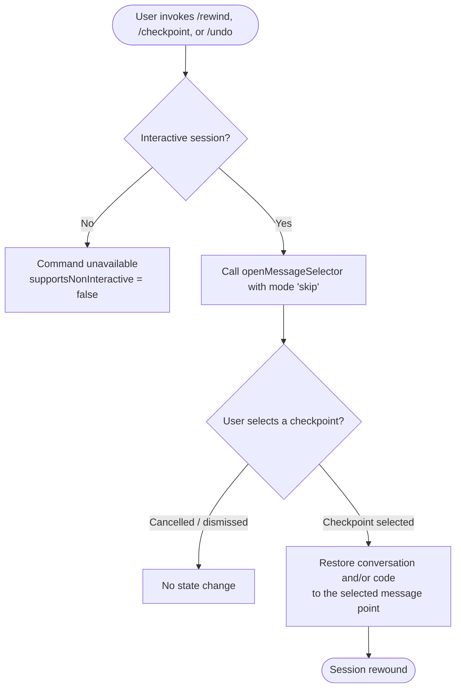

# `/rewind`

> Analysis basis: CC v2.1.132 bundle.js (AST extraction + Claude interpretation)
> Minimum version: v2.1.132

---

## Overview

The `/rewind` command allows the user to restore the code and/or conversation to a previously recorded point in the session. It opens an interactive message selector that lets the user pick a target checkpoint, after which the session state is rolled back to that point. The command is also accessible via the aliases `/checkpoint` and `/undo`.

---

## Registration

| Field | Value |
|---|---|
| type | `local` |
| name | `rewind` |
| description | `Restore the code and/or conversation to a previous point` |
| aliases | `checkpoint`, `undo` |
| argumentHint | *(empty string — no argument expected)* |
| supportsNonInteractive | `false` |
| module_id | `N3q` |
| load_inline | `true` |
| handler | `yz7` (AsyncFunction, resolved via `module_id` path) |
| `loc_byte_end` | `11257857` |
| `arbor_handler.name` | `yz7` |
| `arbor_handler.kind` | `AsyncFunction` |
| `arbor_handler.resolution_path` | `module_id` |
| `arbor_handler.fqn` | `claude-2.1.132::yz7` |
| `arbor_handler.n_hits` | `0` |

Analysis basis: CC v2.1.132 bundle.js:+11257643 – +11257857

---

## Input Branching

The command accepts no argument (the `argumentHint` is an empty string and `supportsNonInteractive` is `false`). Because the command does not support non-interactive use, it must be run from an active terminal session. The handler always proceeds directly to the message-selector flow without conditional branching on user-supplied input.



Analysis basis: CC v2.1.132 bundle.js:+11257568 (call edge `yz7` → `A.openMessageSelector`), +11257604 (literal `"skip"`)

---

## Behavioral Spec

### Handler Entry Point

The command handler is the async function `rewind-handler` (minified: `yz7`), resolved from module `N3q` via the `load_inline` mechanism.

```
async function rewindHandler(context):
    // Open the interactive message-selector UI.
    // The string literal "skip" is passed to openMessageSelector,
    // indicating the selector should skip confirmation and move
    // directly to checkpoint selection.
    selectedMessage = await messageSelector.openMessageSelector("skip")

    if selectedMessage is null or undefined:
        // User cancelled; do nothing
        return

    // Restore session state (conversation history and/or working files)
    // to the state associated with the selected message checkpoint.
    restoreSessionToCheckpoint(selectedMessage)
```

Analysis basis: CC v2.1.132 bundle.js:+11257568 (call to `openMessageSelector`), +11257604 (literal `"skip"`)

### Message Selector Invocation

`openMessageSelector` is a method on the application-state or UI object (minified: `A`). It presents the user with a list of prior messages in the conversation from which a rewind target can be chosen. The `"skip"` argument passed at invocation (bundle.js:+11257604) signals that the selector should bypass any intermediate confirmation step and go directly to the message list.

```
function openMessageSelector(mode):
    // mode = "skip" → suppress confirmation prompt
    displayMessageList(conversationHistory)
    userSelection = awaitUserPick()
    return userSelection   // null if cancelled
```

Analysis basis: CC v2.1.132 bundle.js:+11257568

### Checkpoint Restoration

Once a message is selected, the session is restored. The depth-2 traversal does not expose the internal restoration logic beyond the `openMessageSelector` call.

```
function restoreSessionToCheckpoint(targetMessage):
    // Implementation details below depth-2 traversal boundary.
    // Expected effects: conversation history truncated to targetMessage,
    // working-file state reverted to snapshot at targetMessage.
    <!-- TODO: not found in depth-2 traversal; needs --depth 4 -->
```

---

## State & Side Effects

| Item | Detail |
|---|---|
| Telemetry | None detected in depth-2 traversal |
| Hook registration | None detected in depth-2 traversal |
| appState changes | Conversation history and/or code state rolled back to the selected checkpoint; exact mutation path below depth-2 boundary <!-- TODO: not found in depth-2 traversal; needs --depth 4 --> |
| Sound | None detected |
| Non-interactive support | Not supported (`supportsNonInteractive: false`); the command will not execute in headless / pipe mode |
| Aliases | `/checkpoint` and `/undo` are fully equivalent entry points that invoke the same handler |

---

## Version History

| Version | Change |
|---|---|
| v2.1.132 | Initial analysis |

---

## Common Mistakes

1. **Running `/rewind` in non-interactive mode** — Because `supportsNonInteractive` is `false`, invoking this command in a script, pipe, or CI context will not work. It requires a live terminal session with a user present to interact with the message selector.
2. **Expecting a direct undo of only the last message** — The command opens a selector over the full conversation history, not a one-step pop. The user must actively choose the target checkpoint from the list.
3. **Confusing the aliases** — `/checkpoint` and `/undo` are aliases for `/rewind`; they are not separate commands with different semantics. All three invoke the same handler (`yz7`) with identical behavior.
4. **Assuming file-system changes are always reverted** — The description says "code and/or conversation," implying restoration scope may vary. The exact conditions under which file-system state is included versus excluded are below the depth-2 traversal boundary and cannot be confirmed from this analysis alone.

---

## Appendix — Identifier Mapping

> For bundle debugging only. Identifiers change across versions.

| Identifier | Role |
|---|---|
| `yz7` | Async handler function for the `/rewind` command (entry point resolved via `module_id: "N3q"`) |
| `A` | Application or UI context object that exposes the `openMessageSelector` method |