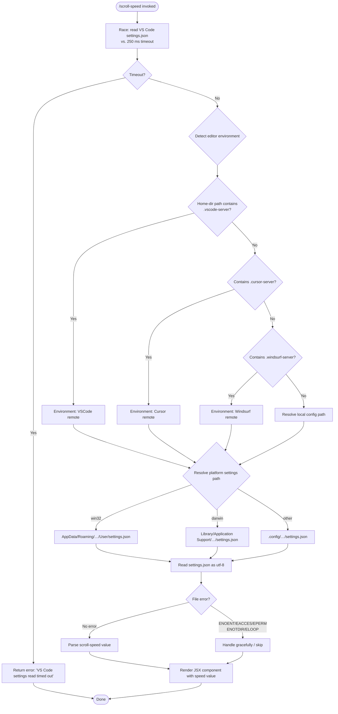

# `/scroll-speed`

> Analysis basis: CC v2.1.141 bundle.js (AST extraction + Claude interpretation)
> Minimum version: v2.1.141

---

## Overview

`/scroll-speed` is a local JSX command that adjusts the mouse wheel scroll speed within the Claude Code interface. It does so by reading the host editor's `settings.json` file (detecting VSCode, Cursor, or Windsurf environments) and applying the configured scroll multiplier. The command renders a JSX UI component and uses a timeout-guarded settings-read path to avoid hanging on slow file system access.

---

## Registration

| Field | Value |
|---|---|
| type | `local-jsx` |
| name | `scroll-speed` |
| description | Adjust mouse wheel scroll speed |
| loc_byte | `11147116` |
| loc_byte_end | `11147364` |
| loc_line | `6751` |
| module_id | `Fwq` |
| load_inline | `true` |
| arbor_handler.name | `EE7` |
| arbor_handler.fqn | `claude-2.1.141::EE7` |
| arbor_handler.kind | `AsyncFunction` |
| arbor_handler.resolution_path | `module_id` |
| arbor_handler.n_hits | `0` |

Analysis basis: CC v2.1.141 bundle.js:+11147116

---

## Input Branching

The command follows 4+ distinct branches depending on: (a) whether the settings read times out, (b) which editor environment is detected (VSCode / Cursor / Windsurf / none), (c) whether the platform is `win32`, `darwin`, or Linux, and (d) whether file errors (ENOENT, EACCES, EPERM, ENOTDIR, ELOOP) are encountered. A Mermaid flowchart is required.



Analysis basis: CC v2.1.141 bundle.js:+11146879, +11146882, +11146888, +3809009, +3813274, +3813451

---

## Behavioral Spec

### 1. Handler Entry — Async Command Executor

The primary handler (`EE7`, an `AsyncFunction`) is the entry point resolved via `module_id → Fwq`.

```
async function scrollSpeedHandler(context):
    result = await Promise.race([
        readEditorSettings(),          // may hang on slow FS
        timeoutPromise(250)            // 250 ms guard
    ])

    if result is TIMEOUT:
        return errorState("VS Code settings read timed out")

    scrollValue = parseScrollSpeed(result)
    return renderScrollSpeedUI(scrollValue)
```

Analysis basis: CC v2.1.141 bundle.js:+11146879 (call to `Uf`), +11146888 (literal `250`), +11146892 (literal `"VS Code settings read timed out"`)

---

### 2. Timeout-Guarded Promise (`Uf`)

The timeout utility races an inner promise against a `setTimeout`-based rejection. On resolution the timeout is cleared via `clearTimeout`.

```
function withTimeout(promise, milliseconds):
    return Promise.race([
        promise,
        new Promise((_, reject) =>
            timerId = setTimeout(() => reject(TIMEOUT_SENTINEL), milliseconds)
        )
    ]).finally(() =>
        clearTimeout(timerId)
    )
```

- Timeout value: **250 ms** (bundle.js:+11146888)
- Timeout message: `"VS Code settings read timed out"` (bundle.js:+11146892)

Analysis basis: CC v2.1.141 bundle.js:+2189804 (`setTimeout`), +2189867 (`Promise.race`), +2189914 (`clearTimeout`)

---

### 3. Editor Environment Detection (`X4_`)

The settings reader (`X4_`) determines which editor is active and resolves the correct `settings.json` path.

```
async function readEditorSettings():
    editorKind = detectEditorEnvironment()   // checks home/config paths
    configPath = resolveSettingsPath(editorKind)
    raw = await readFile(configPath, "utf-8")
    return parseJSON(raw)
```

**Editor detection (`D4_`)** inspects path-like strings for known server suffixes:

| Suffix checked | Editor |
|---|---|
| `.vscode-server` | VSCode (remote) |
| `.cursor-server` | Cursor (remote) |
| `.windsurf-server` | Windsurf (remote) |

Analysis basis: CC v2.1.141 bundle.js:+3809020, +3809050, +3809080

**Display names used in UI:**

| Internal key | Display name |
|---|---|
| `vscode` | `VSCode` |
| `cursor` | `Cursor` |
| `windsurf` | `Windsurf` |

Analysis basis: CC v2.1.141 bundle.js:+3813274, +3813289, +3813302, +3813317, +3813330, +3813347

---

### 4. Platform-Aware Settings Path Resolution (`W4_`)

```
function resolveSettingsPath(editorKind):
    home = os.homedir()
    platform = os.platform()

    if platform == "win32":
        base = join(home, "AppData", "Roaming")
    elif platform == "darwin":
        base = join(home, "Library", "Application Support")
    else:                          // Linux and others
        base = join(home, ".config")

    appFolder = editorFolderName(editorKind)   // e.g. "Code", "Cursor"
    return join(base, appFolder, "User", "settings.json")
```

- Windows sub-path: `AppData/Roaming` (bundle.js:+3813483, +3813493)
- macOS sub-path: `Library/Application Support` (bundle.js:+3813546, +3813556)
- Linux sub-path: `.config` (bundle.js:+3813596)
- Filename: `settings.json` (bundle.js:+3812983)
- Encoding: `utf-8` (bundle.js:+3813010)
- Base editor folder for VSCode: `Code` (bundle.js:+3813414)

Analysis basis: CC v2.1.141 bundle.js:+3813430 (`Yh.join`), +3813438 (`qt.homedir`), +3813451 (`qt.platform`), +3813467 (`"win32"`), +3813529 (`"darwin"`)

---

### 5. Settings JSON Parsing and Execution (`ER6`, `v`)

After the file is read, the raw content is passed through a command-execution layer (`ER6 → v`) that:

1. Strips a leading prefix when present (via `startsWith` / `slice`) — Analysis basis: CC v2.1.141 bundle.js:+1069178, +1069201
2. Invokes a sub-executor (`v`) which formats the value, trims whitespace, uppercases a label, and JSON-stringifies a debug payload — Analysis basis: CC v2.1.141 bundle.js:+198860, +198924, +198986, +199009
3. Errors at this stage are tagged `"error"` and surfaced to the caller — Analysis basis: CC v2.1.141 bundle.js:+1069457

```
function parseAndExecuteSettings(raw):
    cleaned = stripLeadingPrefix(raw)
    result  = executeSettingsCommand(cleaned)

    if result.type == "error":
        propagateError(result)
        return

    label = result.label.toUpperCase()
    trimmed = result.value.trim()
    debugPayload = JSON.stringify({label, trimmed})
    return {label, value: trimmed, debug: debugPayload}
```

Analysis basis: CC v2.1.141 bundle.js:+1069354, +1069358, +1069381

---

### 6. File-System Error Handling (`x9 / M8`, `kH`)

File errors from `readFile` are intercepted and classified:

| Error code | Handling |
|---|---|
| `ENOENT` | Gracefully skipped (file not found) |
| `EACCES` | Gracefully skipped (permission denied) |
| `EPERM` | Gracefully skipped (operation not permitted) |
| `ENOTDIR` | Gracefully skipped (path component not a directory) |
| `ELOOP` | Gracefully skipped (symlink loop) |

Non-classified errors are logged via the error-logger (`Oc.logError`) and pushed to an error queue (`aRH.push`).

Analysis basis: CC v2.1.141 bundle.js:+170010, +170024, +170038, +170051, +170066, +951053, +951013

---

### 7. JSX Rendering

The handler calls `Op_.createElement` to produce the final UI component displaying the resolved scroll speed value.

```
function renderScrollSpeedUI(speedValue):
    return createElement(ScrollSpeedDisplay, {value: speedValue})
```

Analysis basis: CC v2.1.141 bundle.js:+11146950

---

## State & Side Effects

| Item | Detail |
|---|---|
| Telemetry | None detected in depth-2 traversal |
| Hook registration | None detected |
| appState changes | None detected directly; scroll speed is applied via settings read |
| File system reads | Reads `settings.json` from the host editor's user-config directory (platform-dependent path) |
| Timeout side effect | A 250 ms `setTimeout` is set and cleared on every invocation |
| Error logging | File-system and parse errors are logged via `Oc.logError` (bundle.js:+951053) |
| Error queue | Errors appended to internal error queue via `aRH.push` (bundle.js:+951013) |
| Sound | None detected |

---

## Version History

| Version | Change |
|---|---|
| v2.1.141 | Initial analysis |

---

## Common Mistakes

1. **Assuming the command modifies system settings**: `/scroll-speed` _reads_ the editor's `settings.json` to pick up the user's configured value — it does not write back to it.
2. **Ignoring the 250 ms timeout**: On slow or remote file systems the settings read will be silently aborted after 250 ms and the command will surface a timeout error rather than a speed value.
3. **Expecting telemetry events**: This command emits no `tengu_*` telemetry events (as of v2.1.141); do not rely on telemetry for debugging its execution.
4. **Misidentifying the editor**: Detection is based on home/config path suffixes (`.vscode-server`, `.cursor-server`, `.windsurf-server`). Non-standard installation paths may cause the wrong editor branch to be selected.
5. **Platform path confusion**: The settings path is fully platform-specific (`AppData\Roaming` on Windows, `Library/Application Support` on macOS, `.config` on Linux). Cross-platform testing is necessary.

---

## Appendix — Identifier Mapping

> For bundle debugging only. Identifiers change across versions.

| Identifier | Role |
|---|---|
| `EE7` | Main async command handler for `/scroll-speed` (arbor_handler) |
| `Uf` | Timeout-guarded promise utility (wraps `Promise.race` + `setTimeout`/`clearTimeout`) |
| `X4_` | Editor settings reader — resolves path and reads `settings.json` |
| `ZcL` | Dependency called during settings read (role unclear at depth-2) |
| `D4_` | Editor environment detector — checks path strings for known server suffixes |
| `H` | Utility object used in environment checks and random/timer operations |
| `W4_` | Platform-aware settings path resolver (homedir + platform → full path) |
| `ER6` | Settings parse/execute entry — strips prefix, dispatches to executor |
| `DR` | Prefix-stripping utility (`startsWith` / `slice` on raw content) |
| `v` | Settings command executor — trims, uppercases, JSON-stringifies debug info |
| `J7K` | Sub-routine called within executor (role unclear at depth-2) |
| `SH` | JSON stringification helper (`JSON.stringify`) |
| `t7` | String transformation utility (replace, slice, lastIndexOf operations) |
| `MSH` | Metadata/settings helper calling `M6A` |
| `X7K` | File-content processor — computes byte length, binds callbacks, resolves promises |
| `x9` | File-error classifier entry point |
| `M8` | Error-code matching utility (ENOENT, EACCES, etc.) |
| `kH` | File-system error handler — logs and queues errors |
| `k_` | Error construction utility (`Error` / `String` wrapping) |
| `RH` | String coercion helper |
| `Vq` | Error propagation helper calling `cMA` |
| `cMA` | Inner error formatter |
| `GvK` | Error queue manager (`kS6.shift` / `kS6.push` — circular queue) |

---

Note: index built via Arbor fallback; some signals (telemetry, literals) may be missing — see arbor-fallback.js.