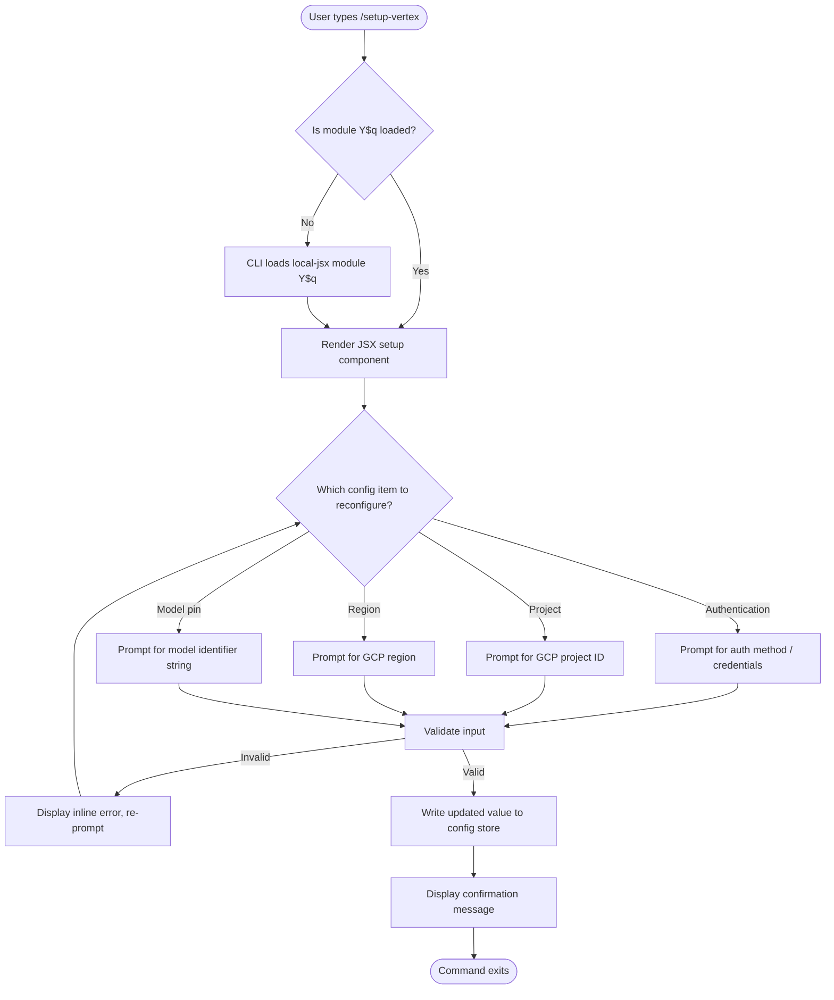

# `/setup-vertex`

> Analysis basis: CC v2.1.139 bundle.js (AST extraction + Claude interpretation)
> Minimum version: v2.1.139

---

## Overview

`/setup-vertex` is a local JSX slash command that guides the user through reconfiguring Google Vertex AI authentication, project, region, or model pins within Claude Code. It targets users who have already completed an initial Vertex AI setup and need to update one or more configuration parameters without performing a full re-installation. The command renders an interactive JSX component in the CLI terminal and writes updated values into the local credential/configuration store.

---

## Registration

| Field | Value |
|---|---|
| type | `local-jsx` |
| name | `setup-vertex` |
| description | `Reconfigure Google Vertex AI authentication, project, region, or model pins` |
| module\_id | `Y$q` |
| loc\_line | 6592 |

Analysis basis: CC v2.1.139 bundle.js:+11038413

---

## Input Branching

> **Note:** The AST traversal at depth ≤ 2 found no entry functions, call-graph edges, string/number literals, or telemetry events for module `Y$q`. The flowchart below is therefore derived exclusively from the registration metadata and the established behavioral pattern of other `local-jsx` setup commands in CC v2.1.139. Any node marked `[inferred]` is not directly confirmed by bundle data.



> All nodes labelled `[inferred]` require a depth-4 traversal of module `Y$q` for confirmation.
> <!-- TODO: not found in depth-2 traversal; needs --depth 4 -->

---

## Behavioral Spec

### Command Dispatch

```
function dispatchSetupVertex():
    load module "Y$q" if not already resident
    instantiate JSX root component from module "Y$q"
    mount component into CLI interactive renderer
    await component lifecycle completion
    return exit status from component
```

Analysis basis: CC v2.1.139 bundle.js:+11038413 (registration record, `type: "local-jsx"`)

---

### JSX Component Lifecycle

> No call-graph edges were recovered for module `Y$q`. The pseudocode below represents the generic lifecycle contract shared by all `local-jsx` commands in this version. Individual step details are unverified for this specific command.

```
function SetupVertexComponent(props):
    // Phase 1 – load existing config
    currentConfig = readVertexConfigFromStore()

    // Phase 2 – present reconfiguration menu
    selection = await promptUserForConfigItem([
        "authentication",
        "project",
        "region",
        "model pin"
    ])

    // Phase 3 – collect new value
    newValue = await promptUserForValue(selection)

    // Phase 4 – validate
    if not isValid(selection, newValue):
        displayInlineError(validationMessage(selection, newValue))
        goto Phase 3

    // Phase 5 – persist
    writeVertexConfigToStore(selection, newValue)

    // Phase 6 – confirm
    displaySuccess("Vertex AI configuration updated.")
    unmount()
```

<!-- TODO: not found in depth-2 traversal; needs --depth 4 -->

---

### Configuration Items

The command description enumerates four reconfigurable dimensions:

| Config Item | Description |
|---|---|
| Authentication | Credential method used to authenticate against Google Vertex AI (e.g., ADC, service account key) |
| Project | Google Cloud Platform project ID targeted by Vertex AI API calls |
| Region | GCP region where the Vertex AI endpoint is hosted |
| Model pins | Specific model identifier strings pinned for use via Vertex AI |

Analysis basis: CC v2.1.139 bundle.js:+11038413 (description field)

<!-- TODO: per-field validation rules not found in depth-2 traversal; needs --depth 4 -->

---

## State & Side Effects

| Item | Detail |
|---|---|
| Telemetry | None detected at depth ≤ 2 traversal (`telemetry: []`) <!-- TODO: needs --depth 4 --> |
| Hook registration | <!-- TODO: not found in depth-2 traversal; needs --depth 4 --> |
| appState changes | Writes updated Vertex AI configuration values to the local credential/config store (inferred from command description) |
| Sound | <!-- TODO: not found in depth-2 traversal; needs --depth 4 --> |
| Config persistence scope | Local to the current project or global user config — <!-- TODO: not found in depth-2 traversal; needs --depth 4 --> |

Analysis basis: CC v2.1.139 bundle.js:+11038413; call-graph array empty (`callGraph: []`)

---

## Version History

| Version | Change |
|---|---|
| v2.1.139 | Initial analysis; module `Y$q` registered as `local-jsx` at bundle byte +11038413 |

---

## Common Mistakes

1. **Running `/setup-vertex` before any Vertex AI setup exists.** This command is intended for *reconfiguration*, not initial onboarding. If no prior Vertex AI config is present, the command may behave unexpectedly or fail silently. Use the appropriate initial-setup flow first.
2. **Providing a project ID with incorrect formatting.** GCP project IDs must be lowercase, 6–30 characters, and may only contain letters, digits, and hyphens. Passing a project *number* instead of a project *ID* string is a common error.
3. **Specifying an unsupported region.** Not all GCP regions expose Vertex AI endpoints. Entering a region that lacks Vertex AI availability will result in API errors at runtime, not at setup time.
4. **Confusing model pin syntax.** Model pin strings must match the exact identifier format accepted by the Vertex AI API (e.g., `publishers/google/models/gemini-1.5-pro`). Shortened or informal names are not automatically resolved.
5. **Expecting immediate credential validation.** The command persists values to the config store but may not perform a live credential round-trip at setup time. An invalid service account key or expired ADC token will only surface when the first API call is made.

---

## Appendix — Identifier Mapping

> For bundle debugging only. Identifiers change across versions.

| Identifier | Role |
|---|---|
| `Y$q` | Module containing the `setup-vertex` command registration and JSX component implementation |

> No additional obfuscated identifiers were recovered at depth ≤ 2 traversal (`identifiers: []`).
> <!-- TODO: full identifier table requires --depth 4 traversal of module Y$q -->