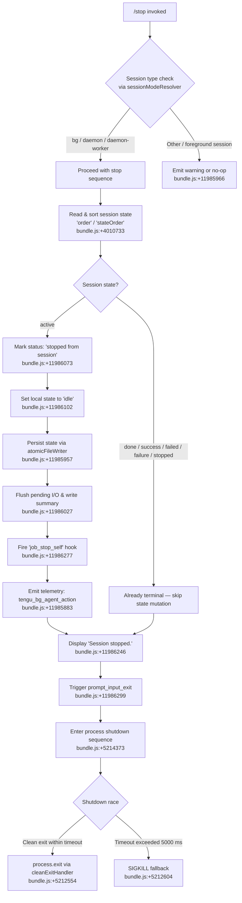

# `/stop`

> Analysis basis: CC v2.1.142 bundle.js (AST extraction + Claude interpretation)
> Minimum version: v2.1.142

---

## Overview

The `/stop` command terminates the current background session gracefully, transitioning its state to `"idle"` and emitting a `"stopped from session"` status message while preserving both the transcript and the worktree on disk. It is designed for use inside background (`bg`) and daemon-mode sessions; invocation triggers a multi-stage async teardown sequence that flushes pending I/O, fires the `job_stop_self` hook, emits telemetry, and requests a clean process exit.

---

## Registration

| Field | Value |
|---|---|
| type | `local-jsx` |
| name | `stop` |
| description | `Stop this background session; transcript and worktree are kept` |
| immediate | `true` |
| module_id | `rvq` |
| load_inline | `true` |
| loc_byte | `11986745` |
| loc_byte_end | `11986929` |
| loc_line | `7973` |
| arbor_handler.name | `Cb7` |
| arbor_handler.fqn | `claude-2.1.142::Cb7` |
| arbor_handler.kind | `AsyncFunction` |
| arbor_handler.resolution_path | `module_id` |
| arbor_handler.n_hits | `0` |

Analysis basis: CC v2.1.142 bundle.js:+11986745

---

## Input Branching

The command has 4+ distinct execution paths depending on session type, current session state, and process-exit sequencing. A Mermaid flowchart is used below.



---

## Behavioral Spec

### Handler Entry Point — `stopCommandHandler` (`Cb7`)

Analysis basis: CC v2.1.142 bundle.js:+11986464

```
async function stopCommandHandler(context):
    # Arbor resolution: module_id → rvq → Cb7
    delayWithJitter()               # H: random jitter (Math.random * 2 + 1 ms)
    await sessionStopCore(context)  # BX8: main stop logic
```

The handler calls a jitter function (`H`) before delegating to the core stop function (`BX8`). The jitter uses `Math.random` scaled by `2` with a `+1` ms floor, delivered via `setTimeout` (bundle.js:+12592943, +12592945, +12592982). This prevents thundering-herd issues when multiple background agents stop simultaneously.

---

### Session Mode Validation — `sessionModeResolver` (`v1` → `mB`)

Analysis basis: CC v2.1.142 bundle.js:+11985966

```
function sessionModeResolver(sessionConfig):
    mode = resolveSessionMode(sessionConfig)  # mB
    if mode not in ["bg", "daemon", "daemon-worker"]:
        return SKIP                           # no-op or warn path
    return PROCEED
```

The three accepted mode literals (`"bg"`, `"daemon"`, `"daemon-worker"`) are present at bundle.js:+2165871, +2165881, +2165895. Any other session type does not proceed to the teardown sequence.

---

### Session State Resolution — `sessionStateReader` (`o1`)

Analysis basis: CC v2.1.142 bundle.js:+4010706

```
async function sessionStateReader(sessionId):
    statePath = path.join(stateDir, sessionId)      # NP.join
    results   = await Promise.all([vP.stat(statePath), ...])
    sorted    = sortBy(results, "order", "stateOrder")

    for entry in sorted:
        if entry.state in ["done","success","failed","failure","stopped"]:
            return TERMINAL_STATE                   # no mutation needed
        if entry.state == "active":
            return ACTIVE_STATE                     # proceed to stop

    # cache management via a$H (get/set/delete/clear)
    # file read uses utf-8 encoding (bundle.js:+4011204)
    # JSON.parse via jsonParser (b6) at bundle.js:+4011295
    # warns on unexpected shape (bundle.js:+4011070)
```

Terminal state literals observed: `"done"` (+4017180), `"success"` (+4017193), `"failed"` (+4017210), `"failure"` (+4017225), `"stopped"` (+4017242), `"active"` (+4017361).

---

### Atomic State Persistence — `atomicStateWriter` (`Rb7` via `gf` → `sO`)

Analysis basis: CC v2.1.142 bundle.js:+11985957

```
async function atomicStateWriter(stateDir, newState):
    tmpName = crypto.randomBytes(4).toString("hex")   # Ar8.randomBytes, 4 bytes
    tmpPath = path.join(stateDir, tmpName)
    await fs.writeFile(tmpPath, serialize(newState), "utf8")
    await fs.rename(tmpPath, finalPath)               # atomic replace
    if weA.has(finalPath):
        await fs.copyFile(...)                        # mirror copy if needed
    if JeA.has(tmpPath):
        await fs.unlink(tmpPath)                      # cleanup on error
```

Atomic write uses a 4-byte hex random prefix (bundle.js:+2196946, +2196958) to generate a safe temporary filename, then renames atomically. Encoding is `"utf8"` (bundle.js:+2197004).

---

### I/O Flush and Status Write — `pendingIoFlusher` (`dw` → `lE` → `SGH`)

Analysis basis: CC v2.1.142 bundle.js:+11986027

```
async function pendingIoFlusher():
    statusLiteral = resolveTerminalStatus()  # one of: done/success/failed/failure/stopped
    lE(SGH, statusLiteral)                   # lE wraps SGH (status gate handler)
```

The flusher maps the internal result to one of the five terminal status strings before committing.

---

### State File Cleanup — `stateFileCleaner` (`gf` → `a2`)

Analysis basis: CC v2.1.142 bundle.js:+11986039

```
async function stateFileCleaner(sessionId):
    stateKey = path.join(stateDir, sessionId)   # NP.join
    sig      = RH(stateKey)                     # JSON.stringify-based hash
    await sO(stateKey)                          # atomic writer for final state
    a2.delete(stateKey)                         # remove from in-memory cache
```

---

### Hook Firing and Status Display — `hookAndDisplayStep` (`BX8` → `SH`, `$6H`)

Analysis basis: CC v2.1.142 bundle.js:+11986215

```
function hookAndDisplayStep(ctx):
    _F6(ctx)                    # internal flag reset (bundle.js:+11986215)
    displayMessage("Session stopped.", ctx)    # $6H (bundle.js:+11986242)
    SH("tengu_feature_ok", ctx)               # feature-ok telemetry wrapper
    emitHook("job_stop_self", ctx)            # SH → d (bundle.js:+11986277)
```

The display literal `"Session stopped."` is at bundle.js:+11986246.

---

### Process Exit Sequence — `processExitOrchestrator` (`R9`)

Analysis basis: CC v2.1.142 bundle.js:+11986294

This is the most complex sub-function. It races a clean exit against a hard-kill timeout.

```
async function processExitOrchestrator():
    K4()                                      # pre-exit flush (bundle.js:+5213972)
    emitScrollSummary()                       # Y_8: tengu_scroll_summary event

    # Race: clean exit vs. timeout cascade
    result = await Promise.race([
        cleanExitRace(),                      # SEH + VY_ + IY_
        new Promise(resolve => setTimeout(resolve, 5000))   # 5000 ms hard limit
    ])

    if result == CLEAN:
        process.exit()                        # IY_ → process.exit (bundle.js:+5212554)
    else:
        process.kill(pid, "SIGKILL")          # IY_ → process.kill SIGKILL (bundle.js:+5212604)

    clearTimeout(exitTimer)                   # bundle.js:+5214236
    AbortSignal.timeout(...)                  # abort any lingering I/O (bundle.js:+5214301)
    QOH.writeSync(...)                        # final stderr flush (bundle.js:+5214479)
```

Timeout constants:
- Hard-kill timeout: **5000 ms** (bundle.js:+5214039)
- Secondary timeout: **3500 ms** (bundle.js:+5214046)
- Heartbeat stop gap: **2000 ms** (bundle.js:+5214224)
- Supervisor restart delay: **500 ms** (bundle.js:+5213631)

---

### Terminal UI Cleanup — `terminalUiCleaner` (`SEH`)

Analysis basis: CC v2.1.142 bundle.js:+5211877

```
function terminalUiCleaner():
    QOH.writeSync(fd, clearSequence)     # write ANSI clear to stdout
    inkApp = E4.get(appRef)
    inkApp.unmount()                     # unmount Ink React tree
    sy()                                 # signal handler teardown
    io6()                                # restore cursor / terminal state
        # io6 uses ANSI save/restore escape sequences:
        #   ESC-7 (save cursor, bundle.js:+3655540)
        #   ESC-8 (restore cursor, bundle.js:+3655551)
        # writes via ps.writeSync
    bH(String)                           # string conversion cleanup
```

---

### Session Summary Emission — `scrollSummaryEmitter` (`Y_8`)

Analysis basis: CC v2.1.142 bundle.js:+5214350

```
function scrollSummaryEmitter(sessionCtx):
    PV()                                  # prepare view state
    BA1()                                 # banner/analytics accumulate
    d()                                   # logger
    UA1()                                 # usage aggregator:
        #   Date.now(), Math.max(), Math.round(), Object.assign()
        #   mA1 for metrics accumulation
    lA()                                  # local-agent renderer
        # emits: tengu_pewter_brook (bundle.js:+3322057)
        # detects fullscreen / tmux-CC / Windows-SSH flicker modes
        # (bundle.js:+3321576, +3321762)
    geH()                                 # tengu_cache_eviction_hint event
    # fires tengu_scroll_summary (bundle.js:+5213342)
```

---

### Daemon Config Reload — `supervisorConfigReload` (`Y` inside `R9`)

Analysis basis: CC v2.1.142 bundle.js:+14476508

```
async function supervisorConfigReload(supervisorCtx):
    $JH(supervisorCtx)      # session-completion bookkeeping
    q.write(supervisorCtx)  # write updated config
    FVq(supervisorCtx)      # format / compute column widths (Math.max, Object.keys)

    T.stop()                # stop keypress handler
        # T checks remoteControlAtStartup flag (bundle.js:+12794824)
    f.delete(sessionRef)
    Z.stop(); Z.updateConfig(newCfg); Z.start()   # heartbeat lifecycle
    J8K(heartbeatRef)       # schedule next heartbeat (bundle.js:+14474937)
    f.set(sessionRef, newEntry)
    V.start()               # re-start renderer
    d()                     # log
    # fires tengu_daemon_config_reload (bundle.js:+14476508)
```

---

### Startup Profiling Report — `startupPerfEmitter` (`X66` → `av8`, `V6A`)

Analysis basis: CC v2.1.142 bundle.js:+5214337

```
function startupPerfEmitter():
    # Prints: "Startup profiling report:" (bundle.js:+209699)
    av8():
        hx()                              # hash/key computation
        q.set / q.get                     # metric map operations
        Object.entries(perfMap)
        Z6A.has() / Z6A.add()             # dedup set
        Math.round(value)
        Math.max(a, b)
        # max buffer size: 1048576 bytes (bundle.js:+210382)
        d()                               # emit tengu_startup_perf
    V6A():
        k6A()
        path.dirname(...)                 # $v6.dirname
        x6()                              # file existence check
        c8H() / G6A() / v()              # config/value helpers
```

---

## State & Side Effects

| Item | Detail |
|---|---|
| Telemetry: `tengu_bg_agent_action` | Fired inside `sessionStopCore` (`BX8`) at bundle.js:+11985883; records the stop action for background agent analytics |
| Telemetry: `tengu_feature_ok` | Fired via feature-ok wrapper (`SH` → `d`) at bundle.js:+954550; confirms the stop feature completed without error |
| Telemetry: `tengu_daemon_config_reload` | Fired after supervisor config is rewritten at bundle.js:+14476508 |
| Telemetry: `tengu_startup_perf` | Fired by the startup profiling emitter (`av8`) at bundle.js:+210485 |
| Telemetry: `tengu_scroll_summary` | Fired by scroll summary emitter (`Y_8`) at bundle.js:+5213342 |
| Telemetry: `tengu_pewter_brook` | Fired by local-agent renderer (`lA` → `G6`) at bundle.js:+3322057 |
| Telemetry: `tengu_cache_eviction_hint` | Fired by cache-eviction advisor (`geH`) at bundle.js:+5214375 |
| Hook: `job_stop_self` | Registered/fired at bundle.js:+11986277; signals to the supervisor that this session has self-terminated |
| Hook: `prompt_input_exit` | Triggered at bundle.js:+11986299; causes the input loop to exit cleanly |
| Session state transition | `active` → `"stopped from session"` (status) + `"idle"` (local state), then terminal persistence |
| Filesystem writes | Atomic rename-based state file update (4-byte hex tmp prefix); worktree and transcript are **not** deleted |
| In-memory cache | `a$H` map updated (delete/get/set/clear) during state resolution and after write |
| Terminal UI | Ink tree unmounted; ANSI cursor save/restore sequences emitted; stdout flushed via `QOH.writeSync` |
| Process exit | `process.exit()` on clean path; `process.kill(pid, "SIGKILL")` if 5000 ms hard timeout exceeded |
| Sound | <!-- TODO: not found in depth-2 traversal; needs --depth 4 --> |
| appState changes | Session status set to `"idle"`; supervisor map entries updated via `f.set`/`f.delete`; heartbeat restarted |

---

## Version History

| Version | Change |
|---|---|
| v2.1.142 | Initial analysis |

---

## Common Mistakes

1. **Using `/stop` in a foreground session**: The command checks for `"bg"`, `"daemon"`, or `"daemon-worker"` mode (bundle.js:+2165871). Running it in a standard interactive session either silently no-ops or emits a warning — it does not terminate the foreground process.
2. **Expecting the worktree to be deleted**: The description and literals (`"stopped from session"`, `"idle"`) confirm the worktree and transcript are deliberately preserved. Use a separate cleanup command to remove them.
3. **Assuming instant termination**: The exit sequence races against a 5000 ms hard-kill timeout (bundle.js:+5214039). There is also a 3500 ms secondary and a 2000 ms heartbeat window. Scripts should not assume the PID disappears immediately.
4. **Conflating `/stop` with an abort**: `/stop` is a graceful stop targeting background sessions; it fires `job_stop_self` and transitions state through `"idle"`. It is distinct from an abort signal (`"aborted"` literal at bundle.js:+2201000), which originates from a different code path.
5. **Running `/stop` on an already-terminal session**: If the session state is already `"done"`, `"success"`, `"failed"`, `"failure"`, or `"stopped"`, the state-mutation path is skipped (bundle.js:+4017180–4017242), so the command is effectively a no-op beyond display.

---

## Appendix — Identifier Mapping

> For bundle debugging only. Identifiers change across versions.

| Identifier | Role |
|---|---|
| `Cb7` | `stopCommandHandler` — async entry point for `/stop`; Arbor-resolved handler (module_id path) |
| `H` | `jitterDelay` — random jitter timer using `Math.random * 2 + 1` ms via `setTimeout` |
| `BX8` | `sessionStopCore` — orchestrates session state mutation, persistence, hooks, and display |
| `d` | `logger` — generic structured logger; used in multiple sub-steps |
| `V6` | `sessionContextGetter` — retrieves current session context |
| `JV` | `sessionContextInner` — inner session context helper |
| `Rb7` | `atomicStateWriterEntry` — initiates atomic state file write |
| `v1` | `sessionModeResolver` — resolves session type (bg/daemon/daemon-worker) |
| `mB` | `sessionModeInner` — inner mode computation |
| `o1` | `sessionStateReader` — reads, sorts, and caches session state from disk |
| `$8` | `errorCodeChecker` — checks error `.code` field (e.g. `"ENOENT"`) |
| `O8` | `errorCodeInner` — inner error code handler |
| `v` | `fileContentProcessor` — processes raw file content with debug logging |
| `f7K` | `fileFormatHandler` — handles file format detection and encoding |
| `RH` | `jsonStringifyHasher` — produces JSON-stringified key/hash |
| `_` | `genericUtil` — generic utility (multiple uses) |
| `H5` | `pathSliceHelper` — path segment slicing via `lastIndexOf` / `slice` |
| `BhH` | `contentRedactor` — handles `[REDACTED]` substitution |
| `O7K` | `bufferSizeWriter` — writes content respecting `Buffer.byteLength` limits (1000/100 byte thresholds) |
| `b6` | `jsonParser` — `JSON.parse` wrapper |
| `dw` | `pendingIoFlusher` — flushes pending I/O and writes terminal status |
| `lE` | `statusGateWriter` — gates status string before final write |
| `SGH` | `statusGateInner` — inner status gate handler |
| `gf` | `stateFileCleaner` — cleans up state file entry and in-memory cache |
| `sO` | `atomicFileWriter` — atomic write via `randomBytes` + `rename` |
| `a2` | `cacheDeleter` — removes entry from `a$H` cache map |
| `_F6` | `internalFlagResetter` — resets internal flags before display |
| `$6H` | `sessionStoppedDisplayer` — displays `"Session stopped."` message |
| `SH` | `featureOkEmitter` — fires `tengu_feature_ok` and `job_stop_self` hook |
| `R9` | `processExitOrchestrator` — races clean exit vs. SIGKILL timeout |
| `K` | `paddingFormatter` — pads strings for display output |
| `L` | `pendingSetTracker` — tracks in-flight promises via `q.add/delete/finally` |
| `f` | `channelCloser` — closes A and q channels |
| `SEH` | `terminalUiCleaner` — unmounts Ink UI and flushes ANSI sequences |
| `sy` | `signalHandlerTeardown` — removes process signal handlers |
| `io6` | `cursorRestorer` — emits ESC-7/ESC-8 ANSI save/restore via `ps.writeSync` |
| `bH` | `stringConverter` — `String()` conversion utility |
| `VY_` | `exitSummaryPrinter` — prints exit path summary with dim formatting |
| `PV` | `viewStatePreparer` — prepares view state before summary |
| `rS` | `renderStateHelper` — assist render state computation |
| `XO6` | `worktreeStatChecker` — checks worktree via `statSync` |
| `c3` | `worktreePathResolver` — resolves worktree path with `qL` |
| `FA1` | `finalSummaryFormatter` — formats final exit summary string |
| `IY_` | `cleanExitExecutor` — calls `process.exit` or `process.kill("SIGKILL")` on timeout |
| `DhH` | `parallelPromiseAll` — runs `Promise.all(Array.from(...))` |
| `Y` | `supervisorSessionStopper` — stops supervisor session, rewrites config, restarts heartbeat |
| `$JH` | `sessionCompletionBookkeeper` — finalises session records in supervisor |
| `q` | `sessionWriterQueue` — queue/writer with `unlinkSync` on error |
| `FVq` | `columnWidthFormatter` — formats supervisor display columns using `Math.max` |
| `T` | `keypressStopHandler` — stops keypress listener, checks `remoteControlAtStartup` |
| `Z` | `heartbeatController` — `stop/updateConfig/start` lifecycle for heartbeat |
| `J8K` | `heartbeatScheduler` — schedules next heartbeat tick |
| `V` | `rendererStarter` — starts/restarts terminal renderer |
| `X66` | `startupPerfReporter` — reports startup profiling data |
| `av8` | `perfMetricsAccumulator` — accumulates perf marks with dedup set and `Math.round` |
| `V6A` | `perfConfigResolver` — resolves config paths for perf report |
| `Y_8` | `scrollSummaryEmitter` — fires `tengu_scroll_summary` event |
| `BA1` | `bannerAnalyticsAccumulator` — accumulates banner/analytics data |
| `UA1` | `usageAggregator` — aggregates usage stats via `Date.now/Math.max/Math.round/Object.assign` |
| `lA` | `localAgentRenderer` — renders local-agent UI; detects tmux/Windows flicker; fires `tengu_pewter_brook` |
| `geH` | `cacheEvictionAdvisor` — fires `tengu_cache_eviction_hint` |
| `D_8` | `shutdownRaceExecutor` — `Promise.race` between clean exit and timeout with 500 ms gap |
| `a8` | `abortTimeoutWrapper` — wraps operation with abort/timeout (`"aborted"`, `clearTimeout`) |

---

Note: index built via Arbor fallback; some signals (telemetry, literals) may be missing — see arbor-fallback.js.