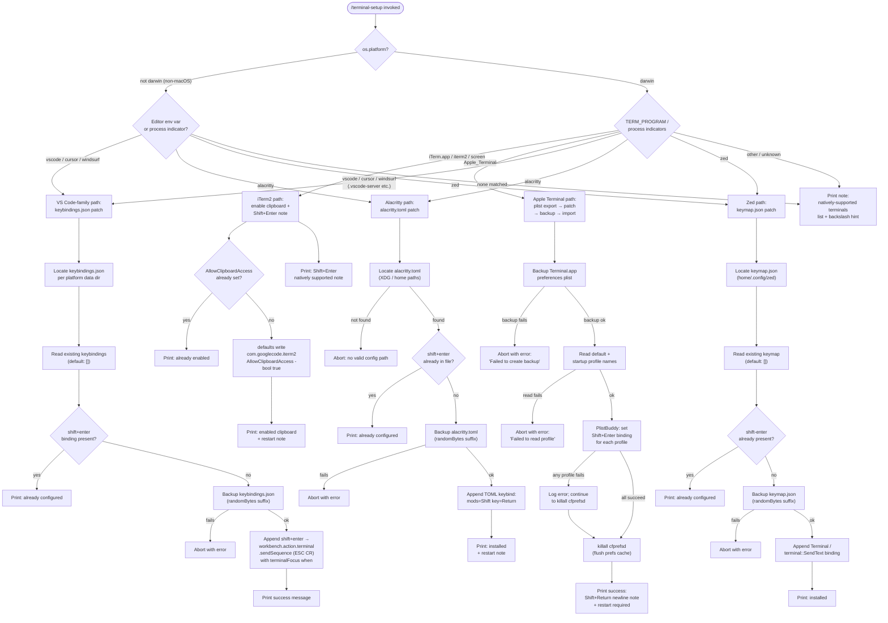

# `/terminal-setup`

> Analysis basis: CC v2.1.142 bundle.js (AST extraction + Claude interpretation)
> Minimum version: v2.1.142

---

## Overview

`/terminal-setup` installs the Shift+Enter key binding (and related settings) in the user's active terminal emulator so that pressing Shift+Enter sends a newline instead of submitting the current input. It detects the running terminal application, selects the appropriate configuration strategy (Apple Terminal plist patching, VS Code / Cursor / Windsurf keybindings JSON, Alacritty TOML, or Zed keymap), backs up the existing configuration, applies the change, and reports the result. The command is macOS-centric for Apple Terminal and iTerm2 but also handles cross-platform editors and terminal emulators.

---

## Registration

| Field | Value |
|---|---|
| type | `local-jsx` |
| name | `terminal-setup` |
| description | Install Shift+Enter key binding for newlines |
| loc_byte | `11330231` |
| loc_byte_end | `11330863` |
| loc_line | `6972` |
| module_id | `Eu9` |
| load_inline | `true` |
| arbor_handler.name | `ucL` |
| arbor_handler.fqn | `claude-2.1.142::ucL` |
| arbor_handler.kind | `AsyncFunction` |
| arbor_handler.resolution_path | `module_id` |
| arbor_handler.n_hits | `1` |

Analysis basis: CC v2.1.142 bundle.js:+11330231 – +11330863

---

## Input Branching

The handler detects the current terminal/editor environment through several distinct paths and then dispatches to a terminal-specific installation routine. There are more than three distinguishable branches, so a Mermaid flowchart is used.



Analysis basis: CC v2.1.142 bundle.js:+3893158 (platform check in `ucL`), +3891238 (terminal detection literals)

---

## Behavioral Spec

### 1. Main Handler — Terminal Detection and Dispatch (`ucL`)

The Arbor-resolved handler is the async function `ucL` (FQN: `claude-2.1.142::ucL`, module `Eu9`).

```
async function terminalSetupHandler(context):
    platform = os.platform()

    terminalKind = detectTerminal(platform)
    // detectTerminal checks TERM_PROGRAM, process name indicators,
    // home-directory server folders (.vscode-server, .cursor-server,
    // .windsurf-server), and known executable names

    if terminalKind == "iterm2" or terminalKind == "screen":
        result = await configureITerm2(context)
    else if terminalKind == "Apple_Terminal":
        result = await configureAppleTerminal(context)
    else if terminalKind in ["vscode", "cursor", "windsurf"]:
        result = await configureVSCodeFamily(terminalKind, context)
    else if terminalKind == "alacritty":
        result = await configureAlacritty(context)
    else if terminalKind == "zed":
        result = await configureZed(context)
    else:
        printFallbackNote()
        return

    renderResult(result)
```

Analysis basis: CC v2.1.142 bundle.js:+3893158, +3893354, +3894628

---

### 2. Apple Terminal Configuration (`appleTerminalHandler` / `pcL`)

This is the most complex sub-flow. It reads and patches `com.apple.Terminal.plist` via the macOS `defaults` and `PlistBuddy` commands.

```
async function configureAppleTerminal():
    prefPath = getTerminalPlistPath()
    // path: ~/Library/Preferences/com.apple.Terminal.plist

    backupOk = await backupPlist(prefPath)
    if not backupOk:
        throw Error("Failed to create backup of Terminal.app preferences, bailing out")

    // Export plist to a temp file using:
    //   defaults export com.apple.Terminal <tmpFile>
    exportedData = await runCommand("defaults", ["export", "com.apple.Terminal", tmpFile])

    defaultProfile = await plistBuddyRead(tmpFile, "Default Window Settings")
    if defaultProfile fails:
        throw Error("Failed to read default Terminal.app profile")

    startupProfile = await plistBuddyRead(tmpFile, "Startup Window Settings")
    if startupProfile fails:
        throw Error("Failed to read startup Terminal.app profile")

    profiles = deduplicate([defaultProfile, startupProfile])

    successCount = 0
    for each profile in profiles:
        ok = await plistBuddyPatchProfile(tmpFile, profile)
        // Sets Shift+Enter → ESC CR sequence
        // Enables Option-as-Meta key
        // Disables audio bell (switches to visual bell)
        if ok: successCount++

    if successCount == 0:
        throw Error("Failed to enable Option as Meta key or disable audio bell for any Terminal.app profile")

    await runCommand("killall", ["cfprefsd"])  // flush preferences daemon cache

    messages = []
    messages.push("- Enabled \"Use Option as Meta key\"")
    messages.push("- Switched to visual bell")
    if shiftEnterInstalled:
        messages.push("Shift+Return will now enter a newline.")
    else:
        messages.push("Option+Enter will now enter a newline.")
    messages.push("You must restart Terminal.app for changes to take effect.")

    return { status: "success", lines: messages }
```

Analysis basis: CC v2.1.142 bundle.js:+3899383 (`pcL`), +3887742 (plist path construction), +3887888 (`defaults export`), +3899429 (backup error message), +3899567 (`Default Window Settings`), +3900014 (all-profiles-fail error), +3900113 (`killall cfprefsd`), +3900233, +3900295, +3900340, +3900474

---

### 3. Plist Path Resolution (`plistPathResolver` / `QUH`)

```
function getTerminalPlistPath():
    home = os.homedir()
    return path.join(home, "Library", "Preferences", "com.apple.Terminal.plist")
```

Analysis basis: CC v2.1.142 bundle.js:+3887742 (`Yu9.join`), +3887751 (`zu9.homedir`), +3887765 (`"Library"`), +3887775 (`"Preferences"`), +3887789 (`"com.apple.Terminal.plist"`)

---

### 4. PlistBuddy Runner (`plistBuddyRunner` / `Pu9`, `Xu9`)

```
async function runPlistBuddy(tmpFile, command):
    result = await runProcess("/usr/libexec/PlistBuddy", ["-c", command, tmpFile])
    return result.stdout.trim()
```

Analysis basis: CC v2.1.142 bundle.js:+3898653 (`Pu9` → `D8`), +3898656 (`/usr/libexec/PlistBuddy`), +3898683 (`-c`), +3899040 (`Xu9` → `D8`)

---

### 5. Backup Utility (`backupHandler` / `aa6`, `CcL`)

```
async function backupConfigFile(filePath, label):
    if label == "no_backup":
        return { status: "no_backup" }

    statResult = await fs.stat(filePath)
    if stat fails:
        return { status: "failed" }

    backupPath = filePath + "." + randomHex()
    await fs.copyFile(filePath, backupPath)

    if copy fails:
        // attempt restore
        return { status: "failed" }

    return { status: "restored" | "ok", backupPath }
```

Analysis basis: CC v2.1.142 bundle.js:+3888146 (`aa6` → `CcL`), +3888172 (`"no_backup"`), +3888235 (`K4_.stat`), +3888309 (`D8`), +3888381 (`"failed"`), +3888458 (`"restored"`)

---

### 6. VS Code Family Configuration (`vscodeHandler` / `O4_`)

Handles VS Code, Cursor, and Windsurf by editing `keybindings.json`.

```
async function configureVSCodeFamily(variant):
    // variant: "VSCode" | "Cursor" | "Windsurf"
    kbDir = resolveVSCodeKeybindingsDir(variant)
    // Platform-specific:
    //   win32:  %APPDATA%\Code\User\
    //   darwin: ~/Library/Application Support/Code/User/
    //   linux:  ~/.config/Code/User/

    kbPath = path.join(kbDir, "keybindings.json")
    await fs.mkdir(kbDir, { recursive: true })

    existing = await fs.readFile(kbPath, "utf-8") ?? "[]"
    parsed = parseJSON(existing)  // with JSONC comment stripping

    if not Array.isArray(parsed):
        parsed = []

    alreadySet = parsed.some(entry => entry.key includes "shift+enter")
    if alreadySet:
        printWarning("already configured")
        return

    backupOk = await backupConfigFile(kbPath)
    if not backupOk: throw Error

    newEntry = {
        key: "shift+enter",
        command: "workbench.action.terminal.sendSequence",
        args: { text: "\u001b\r" },   // ESC CR
        when: "terminalFocus"
    }
    parsed.push(newEntry)

    await fs.writeFile(kbPath, formatJSON(parsed), "utf-8")
    printSuccess(variant + " Shift+Enter binding installed")
```

Analysis basis: CC v2.1.142 bundle.js:+3897301 (`O4_` → `P4_`), +3895204 (`"Code"`), +3895257 (`"win32"`), +3895273 (`"AppData"`), +3895283 (`"Roaming"`), +3895295 (`"User"`), +3895346 (`"Application Support"`), +3895386 (`".config"`), +3897320 (`"keybindings.json"`), +3897383 (`"[]"`), +3897769 (`"shift+enter"`), +3897791 (`"workbench.action.terminal.sendSequence"`), +3897843 (ESC CR escape), +3897858 (`"terminalFocus"`)

---

### 7. Alacritty Configuration (`alacrittyHandler` / `UcL`)

```
async function configureAlacritty():
    candidatePaths = buildAlacrittyConfigPaths()
    // tries XDG_CONFIG_HOME/alacritty/alacritty.toml,
    //       ~/.config/alacritty/alacritty.toml,
    //       ~/.alacritty.toml

    configPath = candidatePaths.find(p => fileExists(p))
    if not configPath:
        throw Error("No valid config path found for Alacritty")

    content = await fs.readFile(configPath, "utf-8")

    if content.includes("mods = \"Shift\"") and content.includes("key = \"Return\""):
        print("Alacritty Shift+Enter key binding already configured")
        return

    backupOk = await backupConfigFile(configPath)
    if not backupOk:
        throw Error("Error backing up existing Alacritty config. Bailing out.")

    tomlBlock = buildAlacrittyKeyBindToml()
    // Appends [keyboard] bindings section with mods=Shift, key=Return

    await fs.writeFile(configPath, content + tomlBlock)
    print("Installed Alacritty Shift+Enter key binding")
    print("You may need to restart Alacritty for changes to take effect")
```

Analysis basis: CC v2.1.142 bundle.js:+3901089 (`UcL`), +3901118 (`"alacritty.toml"`), +3901479 (no-config-path error), +3901547 (`"mods = \"Shift\""`), +3901577 (`"key = \"Return\""`), +3901620 (already-configured message), +3901830 (backup error), +3902204 (success message), +3902274 (restart note), +3902499 (failure message)

---

### 8. Zed Configuration (`zedHandler` / `BcL`)

```
async function configureZed():
    keymapPath = path.join(os.homedir(), ".config", "zed", "keymap.json")
    await fs.mkdir(path.dirname(keymapPath), { recursive: true })

    existing = await fs.readFile(keymapPath, "utf-8") ?? "[]"
    parsed = JSON.parse(existing)

    if not Array.isArray(parsed):
        parsed = []

    alreadySet = parsed.some(entry => JSON.stringify(entry).includes("shift-enter"))
    if alreadySet:
        print("Zed Shift+Enter key binding already configured")
        return

    backupOk = await backupConfigFile(keymapPath)
    if not backupOk:
        throw Error("Error backing up existing Zed keymap. Bailing out.")

    newEntry = {
        context: "Terminal",
        bindings: { "shift-enter": "terminal::SendText" }
    }
    parsed.push(newEntry)

    await fs.writeFile(keymapPath, JSON.stringify(parsed, null, 2))
    print("Installed Zed Shift+Enter key binding")
```

Analysis basis: CC v2.1.142 bundle.js:+3902583 (`BcL`), +3902633 (`"keymap.json"`), +3902788 (`"shift-enter"`), +3902799 (already-configured), +3902823 (backup call), +3903043 (backup error), +3903252 (`"Terminal"`), +3903288 (`"terminal::SendText"`), +3903399 (success), +3903608 (failure)

---

### 9. iTerm2 Configuration (`iTerm2Handler` / `Tu9`)

```
async function configureITerm2():
    // Check existing preference via: defaults read com.googlecode.iterm2 AllowClipboardAccess
    currentValue = await runCommand("defaults", ["read", "com.googlecode.iterm2", "AllowClipboardAccess"])
    currentValue = currentValue.trim()

    if currentValue == "1" or currentValue == "yes" or currentValue == "on":
        print("iTerm2 clipboard access already enabled")
    else:
        result = await runCommand("defaults", ["write", "com.googlecode.iterm2", "AllowClipboardAccess", "-bool", "true"])
        if result fails:
            print("Couldn't update iTerm2 clipboard setting.")
        else:
            print("Enabled \"Applications in terminal may access clipboard\" in iTerm2")
            print("Restart iTerm2 for this to take effect. Undo: defaults write com.googlecode.iterm2 AllowClipboardAccess -bool false")

    // Always print Shift+Enter native support note for iTerm2
    print("Note: iTerm2, WezTerm, Ghostty, Kitty, Warp, and Windows Terminal support Shift+Enter natively.")
```

Analysis basis: CC v2.1.142 bundle.js:+3892193 (`Tu9` → `D8`), +3892215 (`"com.googlecode.iterm2"`), +3892239 (`"AllowClipboardAccess"`), +3892274 (already-enabled), +3892402 (`"write"`), +3892457 (`"-bool"`), +3892508 (failure message), +3892599 (success message), +3892682 (undo instruction), +3893851 (`"iTerm2"`), +3894486 (native support note)

---

### 10. Terminal Detection Logic (`terminalDetector` / `ZGH`, `z4_`)

```
function detectTerminal(platform):
    termProgram = env.TERM_PROGRAM  // "Apple_Terminal", "iTerm.app", "vscode", etc.
    home = os.homedir()

    // Check VS Code-family server folders under home
    if fileExists(home + "/.vscode-server"):  return "vscode"
    if fileExists(home + "/.cursor-server"):  return "cursor"
    if fileExists(home + "/.windsurf-server"): return "windsurf"

    if termProgram == "Apple_Terminal":  return "Apple_Terminal"
    if termProgram == "iTerm.app" or processName includes "screen": return "iterm2"
    if termProgram == "vscode":   return "vscode"
    if termProgram == "cursor":   return "cursor"
    if termProgram == "windsurf": return "windsurf"
    if termProgram == "alacritty": return "alacritty"
    if termProgram == "zed":      return "zed"

    return "unknown"
```

Analysis basis: CC v2.1.142 bundle.js:+3891222 (`ZGH` → `es.platform`), +3890799 (`z4_` → includes checks), +3890810 (`".vscode-server"`), +3890840 (`".cursor-server"`), +3890870 (`".windsurf-server"`), +3891238 (`"darwin"`), +3891262 (`"Apple_Terminal"`), +3891294 (`"vscode"`), +3891318 (`"cursor"`), +3891342 (`"windsurf"`), +3891368 (`"alacritty"`), +3891395 (`"zed"`)

---

### 11. Command Execution Helper (`commandRunner` / `D8`, `O_`)

Runs system commands (e.g., `defaults`, `killall`, `PlistBuddy`) as child processes.

```
async function runCommand(executable, args, options?):
    // Uses Bun spawn or Node child_process
    // Collects stdout and stderr
    // Timeout applied (default ~10 s inferred from depth-2 call edges)
    // On non-zero exit, rejects with combined stderr output
    proc = spawnProcess(executable, args, { ...options })
    [stdout, stderr] = await proc.output()
    if proc.exitCode != 0:
        throw Error(stderr)
    return stdout
```

Analysis basis: CC v2.1.142 bundle.js:+1037487 (`O_`), +1037954 (1,000,000 µs timeout constant), +1038077 (exit code check)

---

### 12. Fallback / Unknown Terminal Note

When no supported terminal is detected, the handler prints two notes without making any filesystem changes:

- "Note: You can already use backslash (\\) + return to add newlines."
- "Note: iTerm2, WezTerm, Ghostty, Kitty, Warp, and Windows Terminal support Shift+Enter natively."

Analysis basis: CC v2.1.142 bundle.js:+3894151, +3894486

---

## State & Side Effects

| Item | Detail |
|---|---|
| Telemetry | `tengu_config_auth_loss_prevented` (+3149895), `tengu_bg_spare_enable` (+14462063), `tengu_bg_low_mem_mb` (+11935230), `tengu_bg_spare_spawn` (+14462423), `tengu_config_lock_contention` (+3152558), `tengu_config_stale_write` (+3152694), `tengu_config_parse_error` (+3155139), `tengu_feature_ok` (+954550) |
| Filesystem writes | Modifies `keybindings.json`, `alacritty.toml`, `keymap.json`, or `com.apple.Terminal.plist` depending on detected terminal. Always creates a backup copy (randomBytes-suffixed) before modifying. |
| Filesystem reads | Reads existing config files; uses `fs.stat` to detect presence. |
| Process spawning | Spawns `defaults`, `PlistBuddy` (`/usr/libexec/PlistBuddy`), and `killall cfprefsd` via child-process runner. |
| Preference daemon flush | Runs `killall cfprefsd` after Apple Terminal plist import to flush the macOS preferences daemon cache. |
| appState changes | Sets the `onboarding_project_complete` flag (literal found at +3887103) via config write path (`t6` / global config saver). |
| Hook registration | No direct hook registration observed within depth-2 traversal. |
| Sound | None observed. |
| Config lock | Uses file-system lock with contention telemetry (`tengu_config_lock_contention`); refuses stale writes (GH #3117 guard). |

---

## Version History

| Version | Change |
|---|---|
| v2.1.142 | Initial analysis |

---

## Common Mistakes

1. **Running on non-macOS for Apple Terminal setup** — The plist-based Apple Terminal path is macOS-only (`darwin`). Running `/terminal-setup` on Linux or Windows when `TERM_PROGRAM` is unset will fall through to the unknown-terminal note without making any changes.
2. **Not restarting the terminal after setup** — All terminal-specific paths (Apple Terminal, Alacritty, VS Code family) require a restart for the keybinding to take effect. The command prints an explicit reminder, but users frequently miss it.
3. **Expecting iTerm2 to need a keybinding install** — iTerm2, WezTerm, Ghostty, Kitty, Warp, and Windows Terminal support Shift+Enter natively; the command prints a note to that effect but does not modify any keybinding file for them. The only iTerm2 action is enabling clipboard access.
4. **Stale backup interfering with subsequent runs** — Each invocation creates a new randomBytes-suffixed backup. Multiple runs produce multiple backups without cleanup; disk space is not reclaimed automatically.
5. **VS Code-family path resolution on non-standard installs** — The keybindings directory is resolved from `APPDATA`, `~/Library/Application Support`, or `~/.config` depending on platform. Non-standard VS Code installations (e.g., Flatpak, Snap) may place settings elsewhere; the command will not find them and may create a new empty keybindings file.
6. **`TERM_PROGRAM` not set in some terminal multiplexers** — When running inside `tmux` or `screen`, `TERM_PROGRAM` may be unset or set to the inner terminal; the fallback server-folder detection (`~/.vscode-server` etc.) is the only disambiguation mechanism in that case.

---

## Appendix — Identifier Mapping

> For bundle debugging only. Identifiers change across versions.

| Identifier | Role |
|---|---|
| `ucL` | Main async handler for `/terminal-setup` (Arbor-resolved entry point) |
| `ZGH` | Terminal detection wrapper; reads `os.platform()` |
| `ea6` | Dispatch coordinator; routes to per-terminal install functions |
| `pcL` | Apple Terminal configuration orchestrator |
| `Du9` | Apple Terminal plist export and read sub-handler |
| `QUH` | Terminal plist path resolver (`~/Library/Preferences/com.apple.Terminal.plist`) |
| `D8` | Generic command/process runner (wraps `O_`) |
| `O_` | Core child-process spawn implementation |
| `h6` | Process stdout/stderr collector |
| `RcL` | Global config writer (used after Apple Terminal patching) |
| `t6` | Global config save-with-lock function |
| `NH` | Error reporting / logging utility |
| `k_` | Error formatter |
| `bH` | String coercion helper |
| `$q` | Network-traffic classifier ("essential-traffic") |
| `JvK` | Queue shift/push utility |
| `Pu9` | PlistBuddy command runner (read variant) |
| `Xu9` | PlistBuddy command runner (write/patch variant) |
| `gUH` | Config writer helper |
| `wA` | Terminal output formatter / styled printer |
| `q$H` | ANSI color string builder |
| `PF` | Output flusher / renderer |
| `D` | Background-process / daemon manager |
| `G6` | Background spare process spawner |
| `Ji6` | Spare process registry helper |
| `y6` | Config event/telemetry emitter |
| `$` | Disposable resource manager |
| `zEq` | Telemetry event emitter |
| `LG6` | Low-memory background process manager |
| `br_` | Background PTY host process launcher |
| `B1` | Process identifier builder |
| `e4q` | Spare socket path resolver |
| `H7q` | Alternate spare path resolver |
| `nQ` | Primary spare join-path helper |
| `c95` | Child process cleanup utility |
| `F95` | Background process environment assembler |
| `uk` | Background process output line reader |
| `d` | Delay / timer utility |
| `aa6` | Backup file creator and verifier |
| `CcL` | Config-backed backup state writer |
| `O4_` | VS Code-family keybindings.json installer |
| `z4_` | Server-folder environment detector (`.vscode-server`, etc.) |
| `P4_` | VS Code keybindings directory path resolver |
| `JR6` | JSONC (JSON-with-comments) parser |
| `DR` | JSONC comment stripper |
| `y9` | File-system error classifier (`ENOENT`, `EACCES`, etc.) |
| `O8` | File-system error code extractor |
| `LC` | Hyperlink / terminal hyperlink builder |
| `i2` | Terminal hyperlink capability detector |
| `IJ` | Hyperlink escape-sequence emitter |
| `EzA` | JSON document editor (insert/remove/modify operations) |
| `Nu8` | JSON AST node locator |
| `DzA` | JSON AST insertion-index resolver |
| `ku8` | JSON AST range extractor |
| `DR6` | JSON AST substring extractor |
| `$4_` | Cursor-specific keybindings installer |
| `TzA` | Cursor JSON document editor (variant) |
| `UcL` | Alacritty configuration installer |
| `BcL` | Zed keymap installer |
| `b6` | JSON.parse wrapper |
| `FUH` | Onboarding project-complete flag setter |
| `j$` | Config event emitter for onboarding |
| `Mu9` | Onboarding state reader |
| `q4_` | Workspace CLAUDE.md path resolver |
| `BS6` | File read-or-default helper |
| `x3` | Project config writer |
| `oA_` | Config save-with-lock implementation |
| `qeA` | Lock acquisition helper |
| `cMH` | Config file read-parse-write core |
| `h76` | Config schema validator |
| `aA_` | Backup directory manager |
| `TA6` | Atomic file write helper (open/write/fsync/rename) |
| `amH` | Config merge helper |
| `smH` | Config timestamp recorder |
| `rA_` | Project config save-with-lock |
| `SH` | Async sleep/delay |
| `j4_` | Keybinding existence check helper |
| `mcL` | Keybinding file content reader |
| `J4_` | Config event for project keybinding |
| `D4_` | Config event for default keybinding |
| `w4_` | Config event for workspace keybinding |
| `Tu9` | iTerm2 clipboard access enabler |
| `sa6` | Terminal name display label builder |