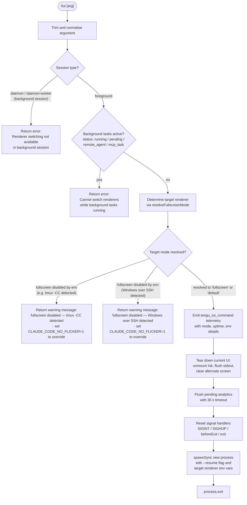

# `/tui`

> Analysis basis: CC v2.1.142 bundle.js (AST extraction + Claude interpretation)
> Minimum version: v2.1.142

---

## Overview

`/tui` switches the active terminal UI renderer between `default` and `fullscreen` modes at runtime. The command validates the current session context and background-task state before committing the switch, and will refuse to act when safety conditions are not met (background session, active background tasks, or environment-level overrides). When the switch is permitted it tears down the current renderer, resets process signal handlers, and relaunches the process under the new renderer.

---

## Registration

| Field | Value |
|---|---|
| type | `local` |
| name | `tui` |
| description | `Set the terminal UI renderer (default \| fullscreen)` |
| argumentHint | `[default\|fullscreen]` |
| supportsNonInteractive | `false` |
| module_id | `yPq` |
| load_inline | `true` |
| loc_byte | `11351878` |
| loc_byte_end | `11352082` |
| arbor_handler.name | `$V7` |
| arbor_handler.fqn | `claude-2.1.142::$V7` |
| arbor_handler.kind | `AsyncFunction` |
| arbor_handler.resolution_path | `module_id` |
| arbor_handler.n_hits | `0` |

Analysis basis: CC v2.1.142 bundle.js:+11351878

---

## Input Branching

The command has more than three distinct decision branches (background-session guard, background-task guard, argument parsing, environment-variable gate, renderer-switch execution), so a Mermaid flowchart is used.



Analysis basis: CC v2.1.142 bundle.js:+11350156 – +11351727

---

## Behavioral Spec

### 1 — Argument parsing and trim

```
async function tuiCommandHandler(rawArg, appState):
    arg = rawArg.trim()                        // +11350156
    loadSettings()                             // +11350181 (m_ → ax → km8)
    resolvedMode = resolveFullscreenMode(arg)  // +11350192 (lA)
    ...
```

The argument string is trimmed of leading/trailing whitespace before any further processing. Settings are loaded from disk before the resolver runs, ensuring policy and user preferences are considered.

Analysis basis: CC v2.1.142 bundle.js:+11350156

---

### 2 — Background-session guard

```
function backgroundSessionGuard(appState):
    sessionType = getSessionType(appState)     // v1 → mB  (+11350429)
    if sessionType in ["daemon", "daemon-worker"]:
        return ErrorResult(
            "Renderer switching isn't available in a background session " +
            "— press ← to detach and run /tui from a foreground session."
        )                                      // +11350459
    return null
```

When the current session is classified as `daemon` or `daemon-worker`, the command immediately returns an error message and performs no further action.

Analysis basis: CC v2.1.142 bundle.js:+11350429, +11350459

---

### 3 — Background-task guard

```
function backgroundTaskGuard(appState):
    activeTasks = getActiveTasks(appState)     // Object.values  +11350752
    for task in activeTasks:
        if task.status in ["running", "pending", "remote_agent", "mcp_task"]:
            // tengu_tui_refused emitted  +11350880
            return ErrorResult(
                "Cannot switch renderers while background tasks are running " +
                "— wait for them to finish (or stop them via /tasks), then run /tui again."
            )                                  // +11350938
    return null
```

If any background task has a status of `running`, `pending`, `remote_agent`, or `mcp_task`, the command emits `tengu_tui_refused` and returns the error string without modifying the renderer.

Analysis basis: CC v2.1.142 bundle.js:+11350752, +11350791, +11350813, +11350834, +11350859, +11350880, +11350938

---

### 4 — Fullscreen-mode resolver (`resolveFullscreenMode`)

```
function resolveFullscreenMode(arg):
    // Phase 1: environment-level forced overrides
    if CLAUDE_CODE_NO_FLICKER env is "no" or "off":    // +11350243 "env_off"
        return ModeResult("default", reason="env_off")
    if CLAUDE_CODE_NO_FLICKER env is "yes" or "on":    // "env_on"
        return ModeResult("fullscreen", reason="env_on")

    // Phase 2: tmux -CC (iTerm2 control-mode) auto-disable
    if tmuxControlModeDetected():    // aRL checks for "iTerm.app", "screen", "tmux" +3320608
        if CLAUDE_CODE_NO_FLICKER not explicitly set:
            return ModeResult("default", reason="tmux_cc_auto_off",
                              message="fullscreen disabled: tmux -CC ... set CLAUDE_CODE_NO_FLICKER=1")
                                                          // +3321576

    // Phase 3: Windows-over-SSH auto-disable
    if windowsOverSSHDetected():                          // platform "windows" +3321170
        if CLAUDE_CODE_NO_FLICKER not explicitly set:
            return ModeResult("default", reason="win_ssh_auto_off",
                              message="fullscreen disabled: Windows over SSH ... set CLAUDE_CODE_NO_FLICKER=1")
                                                          // +3321762

    // Phase 4: background-forced-on check (bg session context)
    // reason="bg_forced_on"  +3322535

    // Phase 5: explicit settings file value
    // reason="settings_on" / "settings_off"  +3322590 / +3322624

    // Phase 6: user-supplied argument
    if arg == "fullscreen":
        return ModeResult("fullscreen")                   // +3321966
    if arg == "default":
        return ModeResult("default")                      // +3321992

    // Phase 7: gate features / gradual-rollout signals
    // reason="downsell_on" / "gb_on" / "gb_off"  +3322697 / +3322762 / +3322770

    return ModeResult(currentDefault)
```

The resolver checks, in priority order: explicit environment variable, tmux control-mode detection, Windows-over-SSH detection, background-session forced-on, settings-file value, the argument literal, then gradual-rollout flags. The tmux detection invokes `spawnSync` with `tmux display-message -p '#{client_control_mode}'` with a 2000 ms timeout and UTF-8 output encoding.

Analysis basis: CC v2.1.142 bundle.js:+3321103, +3320663, +3320886, +3320904, +3320909, +3320945, +3320960, +3321576, +3321762, +3321966, +3321992

---

### 5 — Renderer teardown and relaunch (`relaunchWithRenderer`)

```
async function relaunchWithRenderer(targetMode, appState):
    // Emit telemetry before teardown
    emit("tengu_tui_command", {
        mode: targetMode,
        uptime: Math.round(process.uptime()),    // +11351275, +11351286
        // env flags: CLAUDE_CODE_NO_FLICKER,
        //            CLAUDE_CODE_DISABLE_ALTERNATE_SCREEN,
        //            CLAUDE_CODE_FORCE_FULLSCREEN_UPSELL
        //            +11351663, +11351688, +11351727
    })                                            // +11351214

    // 1. UI teardown
    unmountInkComponents()                        // SEH → H.unmount  +5211954
    flushStdout()                                 // QOH.writeSync    +5211877
    clearAlternateScreen()                        // io6              +3655407

    // 2. Flush analytics (race with 30 s timeout)
    await Promise.race([
        flushAnalytics(),                         // D_8              +5213484
        timeout(30000)                            // +11348879
    ])

    // 3. Signal handler reset
    process.removeAllListeners("SIGINT")          // +11349306, +11349335, +11349365
    process.removeAllListeners("SIGHUP")          // +11349325
    process.removeAllListeners("beforeExit")      // +11349481
    process.removeAllListeners("exit")            // +11349522

    // 4. Spawn replacement process
    envVars = buildRelaunchEnv(targetMode)        // sets CLAUDE_CODE_NO_FLICKER etc.
    result = spawnSync(process.execPath, ["--resume", ...originalArgs], {
        stdio: "inherit",                         // +11349427
        env: envVars
    })                                            // IPq.spawnSync  +11349392

    // 5. Write exit state, then exit
    writeExitState()                              // MX  +11349614
    if result.status != null:
        process.exit(result.status | 128)         // +11349754
    process.exit(0)                               // +11349641
```

After emitting `tengu_tui_command`, the handler tears down the current Ink UI, flushes stdout with ANSI escape sequences (`ESC 7` / `ESC 8` are used to save/restore cursor position during the alternate-screen transition), waits for analytics to flush (30 s race), resets all signal listeners, and re-executes the Claude Code binary with `--resume` and modified environment variables. The environment variable `CLAUDE_CODE_NO_FLICKER` controls whether the fullscreen alternate screen is used.

Analysis basis: CC v2.1.142 bundle.js:+11348879, +11349392, +11349427, +11349614, +11349641, +11349754, +11351214, +11351663, +11351688, +11351727

---

### 6 — Terminal-capability probe

```
function probeTerminalCapabilities():
    // Checks TERM_PROGRAM env for IDE terminals
    if termProgram includes "cursor" or "vscode":      // +3392694, +3392743
        ...
    if isJetBrainsIdeTerminal():                       // f56.isJetBrainsIdeTerminal  +3392025
        ...
    // Version gating for xterm.js-based terminals
    // Version range 1092000–1105000                   // +3392819, +3392830
    // Terminal: "xterm.js"                            // +3392863
    // Queries terminal for dimensions:
    //   nuL uses parseFloat, Number.isNaN, Math.min
    //   max columns capped at 20                      // +3393201
    ...
```

Before rendering in fullscreen mode the handler probes terminal capabilities, specifically checking for IDE-embedded terminals (Cursor, VS Code, JetBrains) and xterm.js version ranges. Column count is capped at a minimum safe width.

Analysis basis: CC v2.1.142 bundle.js:+3392025, +3392694, +3392743, +3392819, +3392830, +3392863, +3393074, +3393145, +3393166, +3393190, +3393201

---

## State & Side Effects

| Item | Detail |
|---|---|
| Telemetry — `tengu_tui_refused` | Emitted when background tasks block the switch (bundle.js:+11350880) |
| Telemetry — `tengu_tui_command` | Emitted on every permitted switch attempt; carries mode, uptime, env-flag values (bundle.js:+11351214) |
| Telemetry — `tengu_amber_creek` | Emitted inside the renderer-mode resolver (bundle.js:+3322149) |
| Telemetry — `tengu_pewter_brook` | Emitted inside the renderer-mode resolver (bundle.js:+3322057) |
| Telemetry — `tengu_scroll_summary` | Emitted during UI teardown scroll-state capture (bundle.js:+5213342) |
| Telemetry — `tengu_feature_ok` / `tengu_feature_bad` | Feature-probe pass/fail during terminal capability check (bundle.js:+954550, +954608) |
| Telemetry — `tengu_bg_*` / `tengu_daemon_*` | Daemon and background-worker lifecycle events emitted during relaunch (various) |
| Process signal handlers | All `SIGINT`, `SIGHUP`, `beforeExit`, and `exit` listeners removed before relaunch (bundle.js:+11349306–+11349522) |
| Process replacement | `spawnSync` with `--resume` flag and `stdio: "inherit"`; process exits with child's status OR'd with 128 (bundle.js:+11349392, +11349754) |
| Alternate screen | ANSI escape sequences `ESC 7` / `ESC 8` used to save/restore cursor; stdout flushed synchronously (bundle.js:+3655540, +3655551) |
| Analytics flush | 30 s race timeout before process replacement (bundle.js:+11348879) |
| Settings load | `loadSettingsFromDisk` is called (perf mark: `loadSettingsFromDisk_start` / `_end`) before resolver runs (bundle.js:+11350181, +11350156) |
| Environment variables read | `CLAUDE_CODE_NO_FLICKER`, `CLAUDE_CODE_DISABLE_ALTERNATE_SCREEN`, `CLAUDE_CODE_FORCE_FULLSCREEN_UPSELL` (bundle.js:+11351663, +11351688, +11351727) |
| supportsNonInteractive | `false` — command is not available in non-interactive / pipe mode |

---

## Version History

| Version | Change |
|---|---|
| v2.1.142 | Initial analysis |

---

## Common Mistakes

1. **Running `/tui` in a background/daemon session**: The command explicitly refuses to switch renderers when the session type is `daemon` or `daemon-worker`. Detach first (press `←`) and rerun from a foreground terminal.
2. **Running `/tui fullscreen` while tasks are active**: If any task has status `running`, `pending`, `remote_agent`, or `mcp_task`, the switch is blocked. Wait for tasks to complete or cancel them with `/tasks` first.
3. **tmux `-CC` (iTerm2 integration mode) silently downgrading to `default`**: The resolver detects tmux control mode and automatically disables fullscreen. Set `CLAUDE_CODE_NO_FLICKER=1` in the environment to force fullscreen regardless.
4. **Windows over SSH blocking fullscreen**: ConPTY re-rendering is also auto-detected and downgrades to `default`. Same override applies: `CLAUDE_CODE_NO_FLICKER=1`.
5. **Expecting `/tui` to take effect without a process restart**: The command replaces the running process via `spawnSync` + `process.exit`. Any in-memory state not persisted before teardown will not be available in the new process.

---

## Appendix — Identifier Mapping

> For bundle debugging only. Identifiers change across versions.

| Identifier | Role |
|---|---|
| `$V7` | Main async handler for `/tui` command (arbor_handler) |
| `H` | String/utility helper; also used as generic local variable in several closures |
| `m_` | Load-settings entry point (`loadSettingsFromDisk`) |
| `ax` | Settings-load orchestrator (outer) |
| `iS` | Inner settings initialiser |
| `j1` | Performance-mark helper (records `loadSettingsFromDisk_start`) |
| `hx` | `perf_hooks` require wrapper |
| `km8` | Settings-load core (reads flag/policy/user/project/local layers) |
| `G8` | File-append logger used during settings load |
| `JV6` | Settings-load intermediate helper |
| `f96` | Flag-settings merger |
| `GDA` | Object-keys settings diffuser |
| `L` | Generic set/map abstraction (overloaded in multiple scopes) |
| `K` | Generic array/map abstraction (overloaded) |
| `W5H` | Settings-path resolver (`.claude/settings.json` etc.) |
| `f` | Promise/async utility (overloaded) |
| `$B` | SDK inline-settings handler |
| `PDA` | Settings-load finaliser / analytics dispatcher |
| `OB` | Settings-object builder |
| `__` | Logger utility |
| `eeH` | Settings-field extractor |
| `wV8` | Settings-field extractor |
| `oeH` | Settings-field extractor |
| `hjH` | Settings-field extractor |
| `_H6` | Settings-field extractor |
| `J5H` | Settings-field extractor |
| `j5H` | Settings-field extractor |
| `Gm8` | Settings-field extractor |
| `HDA` | Settings-field extractor |
| `Gc` | Settings-field extractor |
| `M96` | WSL-detection helper |
| `wV6` | Settings post-processor |
| `lA` | `resolveFullscreenMode` — determines fullscreen eligibility |
| `WRH` | Fullscreen-mode cache lookup |
| `w1_` | Environment-variable reader (env_off / env_on path) |
| `Nq` | Env-var string normaliser |
| `bH` | Boolean coercer / env-var parser |
| `Vl` | tmux control-mode resolver |
| `sRL` | tmux detection (spawns `tmux display-message`) |
| `aRL` | Terminal-name prefix checker (`iTerm.app`, `screen`, `tmux`) |
| `v` | Debug-log helper (overloaded) |
| `f7K` | Log-message formatter |
| `Zt_` | Log-level gate |
| `RH` | JSON-stringify wrapper for logging |
| `_` | Utility (overloaded) |
| `H5` | Log-message redactor (`[REDACTED]`) |
| `H6A` | Log-header builder |
| `q` | Generic collection (overloaded) |
| `A` | Generic collection / string (overloaded) |
| `BhH` | Stdout write helper |
| `gHA` | Raw write-to-handle helper |
| `O7K` | File-logging subsystem |
| `YhH` | Batched write / flush scheduler |
| `i8H` | Log-entry formatter |
| `x6` | Error-code classifier |
| `Vv8` | File-open helper |
| `$6A` | Log-path builder |
| `M6A` | Log-file rotation helper |
| `$7K` | Log-file write-and-rotate core |
| `C9` | UI-state / re-render coordinator |
| `e76` | Boolean settings-value extractor |
| `tRL` | Fullscreen-mode post-resolver (gradual-rollout / downsell path) |
| `G6` | Gradual-rollout / feature-gate evaluator |
| `Z76` | Feature-gate predicate |
| `V76` | Feature-gate predicate |
| `ws` | Feature-gate context builder |
| `Ji6` | Feature-gate result cacher |
| `y6` | Feature-gate clock / telemetry emitter |
| `v1` | Session-type classifier (daemon / daemon-worker detection) |
| `mB` | Session-type constants provider |
| `d` | App-state accessor (overloaded) |
| `tMH` | Alternative fullscreen-mode resolver (second call site) |
| `p_` | Relaunch orchestrator (tears down UI, flushes, respawns) |
| `JO` | Session-path helper |
| `Nm8` | Analytics-flush orchestrator |
| `sj` | Context-file loader |
| `wc` | File-content reader with encoding detection |
| `bM` | Filesystem real-path resolver |
| `IS6` | File-read error classifier |
| `vS6` | Line-ending normaliser |
| `$8` | Async-error wrapper |
| `O8` | Promise-resolve helper |
| `hu8` | Timestamp recorder |
| `jXH` | Config-path / settings-path joiner |
| `eR6` | Settings-directory resolver |
| `TA6` | Atomic file-write helper |
| `O` | Generic object / stat (overloaded) |
| `S8` | State helper |
| `kz` | Cache-clear helper (DV6 / LZ8) |
| `$R6` | Git-ignore-aware config writer |
| `h6` | Async-storage getter |
| `VS6` | Async-local-storage context retriever |
| `Ju8` | Settings-serialiser |
| `Wu8` | Git-check-ignore runner |
| `O_` | Child-process spawn helper |
| `JyK` | Home-directory config-path builder |
| `Iy` | `.claude` directory path joiner |
| `NH` | Error-logging / notification helper |
| `k_` | Error-message formatter |
| `$q` | Network-category helper |
| `NMA` | Network-mode label resolver |
| `JvK` | Rolling error-log buffer manager |
| `$I` | Terminal-capability probe (IDE detection + xterm.js version gating) |
| `X56` | Terminal-info helper |
| `IJ` | Terminal-type classifier |
| `qq_` | IDE-terminal version gater |
| `luL` | Version-string parser |
| `f$H` | JetBrains detection helper |
| `nuL` | Column-count probe with `Math.min` cap |
| `Kq_` | Terminal-size query helper |
| `QwH` | Relaunch-with-renderer core (signal reset, spawnSync, exit) |
| `am` | Binary-path resolver |
| `E58` | Version-directory scanner |
| `J$` | Path array-check helper |
| `ezH` | XDG-data-dir path builder |
| `oe` | `~/.local/share/claude` path builder |
| `B48` | Home-directory helper |
| `Tp` | Process-state snapshot helper |
| `V6` | Logger initialiser |
| `JV` | Logger core |
| `PO6` | Interval-clear helper |
| `hY_` | `clearInterval` wrapper |
| `SEH` | Ink-unmount / stdout-flush helper |
| `sy` | Ink instance accessor |
| `io6` | Alternate-screen clear (writes `ESC 7` / `ESC 8`) |
| `c0H` | Terminal type / Ghostty version checker |
| `g0H` | ANSI escape emitter |
| `k0` | Escape-sequence builder (`ESC ESC` replacement) |
| `Y_8` | Scroll-state capture + `tengu_scroll_summary` emitter |
| `PV` | Scroll-position helper |
| `BA1` | Scroll-buffer builder |
| `UA1` | Scroll-metrics calculator |
| `mA1` | Scroll-metrics finaliser |
| `Pf` | Timed-promise wrapper |
| `gZ` | Analytics-queue drainer |
| `qL` | Analytics-batch sender |
| `DhH` | Parallel-dispose helper |
| `D_8` | Analytics-flush with 500 ms sub-timeout |
| `a8` | Abort-controller wrapper |
| `tp_` | Environment-variable builder for relaunch |
| `RK` | Logger reference |
| `ZPq` | Process-replacement via `execve` (macOS) or `spawnSync` (other) |
| `$` | Active-promise tracker (overloaded) |
| `zEq` | Telemetry-event emitter |
| `w` | Background-worker / daemon supervisor loop |
| `y` | Subprocess handle |
| `uH` | Daemon-state reader |
| `SH` | Daemon-state writer |
| `LG6` | Low-memory checker |
| `S` | Task-retirement helper |
| `xr_` | IPC socket connector |
| `Fr_` | Background-task lifecycle manager |
| `D` | Daemon-session object |
| `u` | Stdio-pipe helper |
| `M` | MCP-server manager (execve path) |
| `IvH` | MCP-connection initialiser |
| `Peq` | MCP-update applier |
| `n_5` | MCP-server reconnect orchestrator |
| `z` | Process-collection helper |
| `aR` | First-party traffic handler |
| `Ax` | Graceful-shutdown race (Promise.race + process.exit) |
| `GH` | String-coercion utility |
| `MX` | Exit-state file writer (`UhH.writeFileSync`) |

Note: index built via Arbor fallback; some signals (telemetry, literals) may be missing — see arbor-fallback.js.