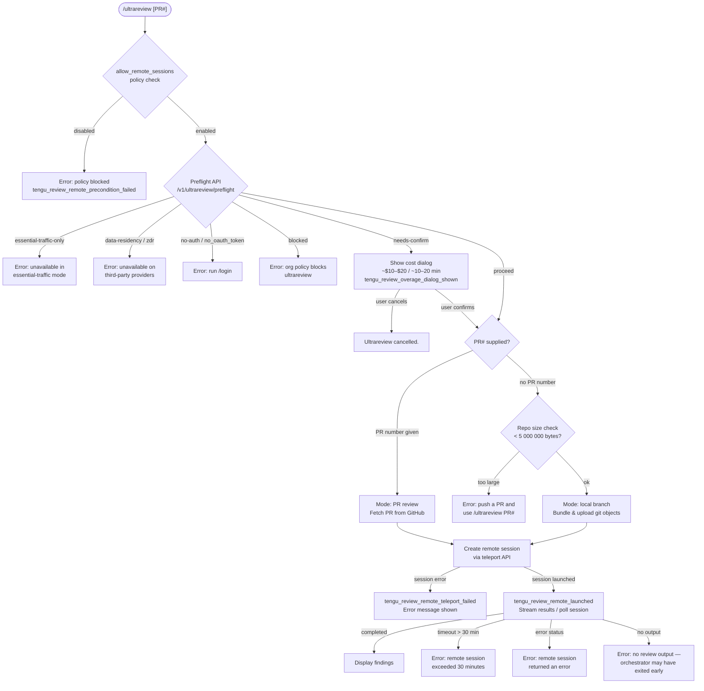

# `/ultrareview`

> Analysis basis: CC v2.1.142 bundle.js (AST extraction + Claude interpretation)
> Minimum version: v2.1.142

---

## Overview

`/ultrareview` launches a cloud-hosted bug-finding review of your current branch or a specified GitHub Pull Request. It runs as an asynchronous remote session in Claude Code on the web, performs deep analysis to find and verify bugs, and streams findings back to the local CLI. The command requires a Claude.ai account (OAuth), a GitHub remote, and organization-level permission to enable remote sessions.

---

## Registration

| Field | Value |
|---|---|
| type | `local-jsx` |
| name | `ultrareview` |
| description | `" ... · Est. cost ... USD · Finds and verifies bugs in your branch. Runs in Claude Code on the web. See ..."` |
| loc_byte | `11228303` |
| loc_byte_end | `11228562` |
| loc_line | `6780` |
| module_id | `WJq` |
| load_inline | `true` |
| arbor_handler.name | `FE7` |
| arbor_handler.fqn | `claude-2.1.142::FE7` |
| arbor_handler.kind | `AsyncFunction` |
| arbor_handler.resolution_path | `module_id` |
| arbor_handler.n_hits | `1` |

Analysis basis: CC v2.1.142 bundle.js:+11228303

---

## Input Branching

The command has more than three distinct execution paths based on precondition checks, preflight API results, and PR vs. local-branch mode. A Mermaid flowchart is used.



Analysis basis: CC v2.1.142 bundle.js:+11226090 (handler entry `FE7`), +11186828 (preflight endpoint), +11189222 (size limit message), +11190684 (proceed path), +11191064 (needs-confirm path)

---

## Behavioral Spec

### 1. Handler Entry and Policy Gate

The primary handler (`FE7`, an AsyncFunction) is loaded via module `WJq` using the inline `load` pattern.

```
async function ultrareviewHandler(context):
    if not organizationPolicy.allows("allow_remote_sessions"):
        emit telemetry("tengu_review_remote_precondition_failed")
        if policy == "blocked by org":
            show error("Remote sessions are disabled by your organization's policy. Contact your organization admin to enable them.")
        return

    waitDelay = randomDelay(0, 2)   // Math.random, setTimeout — jitter
    await delay(waitDelay)
    proceed to preflight()
```

Analysis basis: CC v2.1.142 bundle.js:+11226090, +11226093 (`allow_remote_sessions`), +11226125 (random delay), +11226127 (policy error message)

---

### 2. Preflight Check

Calls the backend endpoint `/v1/ultrareview/preflight` (with a `teleport-org` header, 5 000 ms timeout) and interprets a structured response.

```
async function preflight(context):
    response = await apiGet("/v1/ultrareview/preflight",
                            headers={"teleport-org": orgId},
                            timeout=5000)

    status = response.status   // "proceed" | "blocked" | "needs-confirm"
    reason = response.reason   // "essential-traffic-only" | "data-residency" |
                               // "zdr" | "no-auth" | "no_oauth_token" | ...

    switch reason:
        case "essential-traffic-only":
            return error("Ultrareview runs in Claude Code on the web and is unavailable when essential-traffic-only mode is active.")
        case "data-residency", "zdr":
            return error("Ultrareview runs in Claude Code on the web and is unavailable on third-party providers.")
        case "no-auth", "no_oauth_token":
            return error("Ultrareview requires a Claude.ai account. Run /login to authenticate.")
        case "blocked" (status == "blocked"):
            return error("Ultrareview is unavailable for your organization.")

    if status == "needs-confirm":
        return showCostConfirmDialog()    // see §3

    if status == "proceed":
        return launchReview()             // see §4
```

Analysis basis: CC v2.1.142 bundle.js:+11186828 (`/v1/ultrareview/preflight`), +11186862 (`teleport-org`), +11186885 (`5000` ms timeout), +11186958, +11187105, +11187238, +11186604 (`blocked`), +11190684 (`proceed`), +11191064 (`needs-confirm`)

---

### 3. Cost Confirmation Dialog

When the preflight returns `needs-confirm`, a dialog is rendered showing the estimated cost and runtime, awaiting user confirmation.

```
function showCostConfirmDialog():
    display dialog:
        estimatedCost  = "$10-$20"
        estimatedTime  = "~10–20 min"
        actions        = ["confirm", "cancel"]

    emit telemetry("tengu_review_overage_dialog_shown")

    if user selects "cancel":
        show message("Ultrareview cancelled.")
        return

    if user selects "confirm":
        proceed to launchReview()
```

Analysis basis: CC v2.1.142 bundle.js:+11186292 (`$10-$20`), +11186384 (`~10–20 min`), +11190997 (`confirm`), +11191064 (`needs-confirm`), +11226727 (`tengu_review_overage_dialog_shown`), +11227032 (`Ultrareview cancelled.`)

---

### 4. Repo Size Gate and Bundle Mode Selection

Before creating a remote session for a local-branch review, the repository byte-size is measured with `git count-objects -v`. If it exceeds the limit, the user is directed to submit a PR instead.

```
function checkRepoSize(context):
    output = git("count-objects", "-v")
    sizeKb = parseField(output, "size-pack")
    sizeBytes = sizeKb * 1024

    emit telemetry("tengu_ccr_bundle_max_bytes", {limit: 5000000, actual: sizeBytes})

    if sizeBytes > 5_000_000:
        show error("Repo is too large to bundle. Push a PR and use `/ultrareview <PR#>` instead.")
        return ABORT

    return OK
```

Analysis basis: CC v2.1.142 bundle.js:+7977665 (`count-objects`), +7977681 (`-v`), +7977880 (`1024`), +7978106 (`5000000`), +11189222 (user-facing size error)

---

### 5. Git Branch and Remote URL Resolution

The handler resolves the current branch name, the upstream default branch, and the git remote URL (stripping embedded credentials).

```
function resolveGitContext():
    currentBranch  = git("branch", "--abbrev-ref", "HEAD")        // trim whitespace
    defaultBranch  = git("symbolic-ref", "--short",
                         "refs/remotes/origin/HEAD")               // fallback: "main" | "master"
    remoteUrl      = git("config", "--get", "remote.origin.url")
    remoteUrl      = redactCredentials(remoteUrl)                  // replaces "://***@"

    if no remoteUrl:
        return error("No git remote URL found")

    host = extractHost(remoteUrl)   // expects "github.com"
    if host != "github.com":
        // GHES repositories use an optimistic mode
        bundleMode = "ghes_optimistic"

    mergeBase = git("merge-base", defaultBranch, currentBranch)
    diffStat  = git("diff", "--shortstat", mergeBase)

    return {currentBranch, defaultBranch, remoteUrl, mergeBase, diffStat}
```

Analysis basis: CC v2.1.142 bundle.js:+1058609 (`--abbrev-ref`), +1058624 (`HEAD`), +1058781 (`symbolic-ref`), +1058796 (`--short`), +1058806 (`refs/remotes/origin/HEAD`), +1058919 (`main`), +1058926 (`master`), +1050111 (`config`), +1050120 (`--get`), +1050128 (`remote.origin.url`), +1053023 (`://***@`), +1050257 (`No git remote URL found`), +11188830 (`github.com`), +11189753 (`merge-base`), +11190268 (`diff`), +11190275 (`--shortstat`)

---

### 6. Git Bundle Creation and Upload (`teleport_git_bundle_upload`)

For local-branch mode the repository's git objects are packed into a bundle file and uploaded to the remote session infrastructure.

```
async function bundleAndUpload(repoContext):
    emit telemetry("tengu_ccr_bundle_upload")

    if repo has no commits:
        return error("Repository has no commits yet")

    // Create a stash snapshot of un-committed changes
    stashRef = git("stash", "create")   // may be empty

    // Write seed refs
    git("update-ref", "refs/seed/stash", stashRef)
    git("update-ref", "refs/seed/root",  initialCommit)

    // Enumerate existing refs
    refs = git("for-each-ref", "--count=1", "refs/")

    // Pack bundle: try strategies in order
    for strategy in ["head", "fallback_head", "squashed", "fallback_squashed"]:
        bundlePath = writeTempFile("ccr-seed.bundle")
        ok = git("bundle", "create", bundlePath, ...)
        if ok:
            upload(bundlePath)
            cleanup(bundlePath, "_source_seed.bundle")
            return {strategy, success: true}

    return {strategy: "failed", success: false}
```

Analysis basis: CC v2.1.142 bundle.js:+7980664 (`teleport_git_bundle_upload`), +7980693 (`empty_repo`), +7980725 (`Not in a git repository`), +7980765 (`refs/seed/stash`), +7980783 (`refs/seed/root`), +7980816 (`update-ref`), +7980867 (`for-each-ref`), +7981071 (`Repository has no commits yet`), +7981149 (`stash`), +7981157 (`create`), +7981803 (`ccr-seed`), +7981814 (`.bundle`), +7982106 (`_source_seed.bundle`), +7982400 (`success`), +7982503 (`fallback_head`), +7982538 (`squashed`)

---

### 7. Remote Session Creation

After the bundle is uploaded (or a PR number is supplied), the handler creates a remote cloud session via the teleport API.

```
async function createRemoteSession(params):
    // Ensure a cloud environment exists
    environments = await api.get(teleport_environments_list)
    if environments is empty:
        env = await api.post(teleport_default_environment_create, {
            name: "Default",
            image: "anthropic_cloud",
            python: "3.11",
            node: "20",
            workDir: "/home/user"
        })
        if env creation fails:
            warn("Could not create a cloud environment. Set one up at https://claude.ai/code/onboarding?magic=env-setup")

    // Build session payload
    session = await api.post("/sessions", {
        task:          "ultrareview",
        bundleMode:    bundleMode,          // "bundle" | "git_repository" | "explicit_env_bundle" | etc.
        beta:          "ccr-byoc-2025-07-29",
        orgUuid:       orgUuid,
        ...gitContext
    })

    if session.status not in [200, 201]:
        emit telemetry("tengu_review_remote_teleport_failed")
        show error("Ultrareview failed to launch the remote session. Check that this is a GitHub repo and try again.")
        return null

    emit telemetry("tengu_review_remote_launched")
    emit telemetry("tengu_ccr_session_link")
    return session.id
```

Analysis basis: CC v2.1.142 bundle.js:+7997026 (`o8.post`), +7997120 (`201`), +7997181 (`401`), +7997185 (`403`), +7997189 (`429`), +7995783 (`ccr-byoc-2025-07-29`), +7995805 (`x-organization-uuid`), +7996157 (`bundle`), +7996345 (`git_repository`), +11193549 (`tengu_review_remote_teleport_failed`), +11194033 (`tengu_review_remote_launched`), +11225940 (launch failure message)

---

### 8. Session Polling and Result Streaming

After session creation, the handler polls the remote session for status transitions and streams output back to the local UI.

```
async function pollSession(sessionId):
    deadline = Date.now() + 1_800_000   // 30 minutes

    loop:
        status = fetchSessionStatus(sessionId)

        switch status:
            case "pending", "starting":
                // display spinner / progress
                sleep(pollingInterval)

            case "running":
                streamPartialOutput()

            case "completed":
                result = extractResult(session.messages, type="result")
                displayFindings(result)
                return SUCCESS

            case "archived":
                return error("remote session returned an error")

        hookEvents = pollHookEvents()   // "hook_progress" | "hook_response" | "hook_started"
        if hookEvent.type == "SessionStart":
            updateUIState("running")

        if Date.now() > deadline:
            return error("remote session exceeded 30 minutes")

    if result is empty:
        return error("no review output — orchestrator may have exited early")
```

Analysis basis: CC v2.1.142 bundle.js:+8011698 (`1800000` ms), +8012142 (`archived`), +8012217 (`completed`), +8012649 (`result`), +8012832 (`hook_progress`), +8012861 (`hook_response`), +8013352 (`hook_started`), +8013442 (`SessionStart`), +8013669 (`starting`), +8014220 (`remote session returned an error`), +8014261 (`remote session exceeded 30 minutes`), +8014298 (`no review output — orchestrator may have exited early`)

---

### 9. Overage / Billing Gate

After cost confirmation but before session launch, the handler checks whether the user's subscription tier supports the feature. Eligible tiers include `max`, `pro`, and org roles `admin`, `billing`, `owner`, `primary_owner`. Subscription types checked: `stripe_subscription`, `stripe_subscription_contracted`, `apple_subscription`, `google_play_subscription`.

```
function checkBillingEligibility(user, org):
    if user.subscriptionType not in ELIGIBLE_SUBSCRIPTION_TYPES:
        emit telemetry("tengu_review_overage_blocked")
        showAdminSettingsLink("/admin-settings/")
        return BLOCKED

    if user.role not in ["admin", "billing", "owner", "primary_owner", "max", "pro"]:
        return BLOCKED

    return ELIGIBLE
```

Analysis basis: CC v2.1.142 bundle.js:+11226392 (`tengu_review_overage_blocked`), +11226514 (`/admin-settings/`), +2020269 (`max`), +2020280 (`pro`), +2020349 (`admin`), +2020357 (`billing`), +2020367 (`owner`), +2020375 (`primary_owner`), +2923672 (`stripe_subscription`), +2923699 (`stripe_subscription_contracted`), +2923737 (`apple_subscription`), +2923763 (`google_play_subscription`)

---

### 10. Background Eligibility Pre-check (Yz1 path)

A parallel background eligibility check runs early, verifying login state, policy, git repo presence, remote URL, and GitHub App installation status.

```
async function backgroundEligibilityCheck():
    emit telemetry("tengu_ccr_bundle_seed_enabled")

    checks = await Promise.all([
        checkPolicyAllowed(),            // → "policy_blocked"
        checkOAuthLogin(),               // → "not_logged_in"
        checkByoc(),                     // → "byoc"
        checkInsideGitRepo(),            // → "not_in_git_repo"
        checkGitRemote(),                // → "no_git_remote"
        checkGithubAppInstalled(),       // → "github_app_not_installed"
    ])

    if anyFailed(checks):
        emit telemetry("bg_remote_eligibility_check", {reason: failureReason})
```

Analysis basis: CC v2.1.142 bundle.js:+6601627 (`policy_blocked`), +6601649 (`bg_remote_eligibility_check`), +6601766 (`not_logged_in`), +6601952 (`byoc`), +6602108 (`not_in_git_repo`), +6602201 (`no_git_remote`), +6602297 (`github_app_not_installed`), +6602044 (`tengu_ccr_bundle_seed_enabled`)

---

### 11. Post-launch Acknowledgement Prompt

After the remote session is launched, the handler emits a short system prompt instructing the model to briefly acknowledge the launch without repeating target, URL, or billing information. Findings arrive asynchronously via task notification.

Analysis basis: CC v2.1.142 bundle.js:+11225753 (acknowledgement instruction literal, cited by offset only — verbatim text is © Anthropic PBC), +11226246 (`system` role)

---

## State & Side Effects

| Item | Detail |
|---|---|
| Telemetry: `tengu_review_remote_precondition_failed` | Fired when `allow_remote_sessions` policy is disabled (bundle.js:+11188117) |
| Telemetry: `tengu_review_overage_blocked` | Fired when billing tier blocks launch (bundle.js:+11226392) |
| Telemetry: `tengu_review_overage_dialog_shown` | Fired when cost-confirmation dialog is presented (bundle.js:+11226727) |
| Telemetry: `tengu_review_bughunter_config` | Fired to record bughunter configuration parameters (bundle.js:+11186175) |
| Telemetry: `tengu_ccr_bundle_max_bytes` | Records repo size and 5 000 000 byte limit (bundle.js:+7977580) |
| Telemetry: `tengu_ccr_bundle_upload` | Fired on git bundle upload attempt (bundle.js:+7980957) |
| Telemetry: `tengu_teleport_bundle_mode` | Records selected bundle strategy (bundle.js:+7996193) |
| Telemetry: `tengu_ccr_session_link` | Fired after session link is obtained (bundle.js:+7990591) |
| Telemetry: `tengu_teleport_source_decision` | Records the source code delivery decision (bundle.js:+8001211) |
| Telemetry: `tengu_review_remote_teleport_failed` | Fired when session creation fails (bundle.js:+11193549) |
| Telemetry: `tengu_review_remote_launched` | Fired when remote session is successfully started (bundle.js:+11194033) |
| Telemetry: `tengu_ccr_bundle_seed_enabled` | Fired during background eligibility check (bundle.js:+6602044) |
| Telemetry: `tengu_slate_kestrel` | Fired during first-party feature check (bundle.js:+9990096) |
| Telemetry: `tengu_bg_spare_enable` | Background spare process enable event (bundle.js:+14462063) |
| Telemetry: `tengu_bg_spare_spawn` | Background spare process spawn event (bundle.js:+14462423) |
| Telemetry: `tengu_feature_ok` / `tengu_feature_bad` / `tengu_feature_sad` | Generic feature-health events (bundle.js:+954550, +954608, +954683) |
| Telemetry: `tengu_daemon_control` | Daemon lifecycle control event (bundle.js:+14497664) |
| Telemetry: `tengu_daemon_config_reload` | Daemon config reload event (bundle.js:+14476508) |
| API call | `GET /v1/ultrareview/preflight` (timeout 5 000 ms) |
| API call | `GET` teleport environments list |
| API call | `POST` teleport default environment create (if no environments exist) |
| API call | `POST` create remote session with `ccr-byoc-2025-07-29` beta header |
| File I/O | Writes temporary git bundle file (`ccr-seed.bundle`, `_source_seed.bundle`); deleted after upload |
| Daemon status | Reads `daemon.status.json` for session state |
| appState changes | Remote session state tracked (pending → starting → running → completed/archived) |
| Sound | <!-- TODO: not found in depth-2 traversal; needs --depth 4 --> |
| Hook registration | `remoteControlAtStartup` setting consulted; supervisor daemon started/stopped during session |
| Process exit | `process.exit` reachable via daemon shutdown path (`Ax` → `process.exit`, bundle.js:+14492843) |

---

## Version History

| Version | Change |
|---|---|
| v2.1.142 | Initial analysis |

---

## Common Mistakes

1. **Running without a Claude.ai OAuth account.** `/ultrareview` explicitly requires OAuth login (`/login`), not an `ANTHROPIC_API_KEY`. API key authentication is insufficient and triggers the `no_oauth_token` / `no-auth` error path.

2. **Invoking on an oversized local branch without a PR number.** Repositories whose packed git objects exceed 5 000 000 bytes will be rejected with a message to push a PR first and use `/ultrareview <PR#>` instead.

3. **Running in essential-traffic-only or data-residency mode.** Organizations with `essential-traffic-only` or ZDR (zero data retention / data-residency) configurations cannot use this command because it requires cloud connectivity outside the essential-traffic list.

4. **Missing GitHub remote.** The command requires a `github.com` remote (`remote.origin.url`). Repos without any git remote or with non-GitHub remotes in strict mode will fail the eligibility check.

5. **Expecting instant results.** The remote session runs for up to 30 minutes (`1 800 000 ms`). The command polls asynchronously; findings arrive via task notification, not inline text.

6. **Ignoring the confirmation dialog.** When the preflight returns `needs-confirm`, dismissing the dialog cancels the operation entirely. Users must actively confirm estimated cost (~$10–$20) and duration (~10–20 min) to proceed.

---

## Appendix — Identifier Mapping

> For bundle debugging only. Identifiers change across versions.

| Identifier | Role |
|---|---|
| `FE7` | Primary async handler for `/ultrareview` (arbor_handler, module `WJq`) |
| `Sq` | Feature-availability / policy check function |
| `v9q` | Inner policy resolution helper |
| `BR_` | Checks `firstParty` flag and plan tier |
| `hp` | Plan-tier comparison (enterprise, team literals) |
| `V9q` | Reads feature config file with `fs.readFileSync` (utf-8) |
| `$q` | Telemetry / network-mode formatter |
| `NMA` | Network-mode string builder |
| `bH` | String coercion / formatting utility |
| `A0H` | Secondary string helper |
| `H` | Random delay utility (Math.random + setTimeout) |
| `wp_` | Branch review orchestrator (git context + session launch coordinator) |
| `g98` | Git repo detection (`rev-parse --is-inside-work-tree`) |
| `h6` | Current working directory / context accessor |
| `VS6` | Async-local-store reader |
| `__` | Environment / JV accessor |
| `O_` | Daemon / agent spawner |
| `_XH` | Daemon configuration loader (many sub-helpers) |
| `D` | Spare background process manager (freemem, Date.now loop) |
| `gkK` | String-based key builder for daemon |
| `NH` | Error logging / notification handler |
| `A` | Lowercase normaliser |
| `f` | Connection / process close handler |
| `d` | General disposable / resource holder |
| `Ey` | Remote URL resolver (git config + credential redaction) |
| `LB` | Remote URL cache lookup |
| `Hu8` | `V_H` map getter (remoteUrl cache) |
| `K` | String pad / map utility |
| `L` | Active-task set manager (add/finally/delete) |
| `v` | Diff / debug log formatter |
| `f7K` | Diff renderer (EV, L7K, Zt_) |
| `RH` | JSON serialiser wrapper |
| `_` | String upper/lower-case helper |
| `H5` | Path/string slicer (lastIndexOf, slice, replace) |
| `BhH` | Generic hash/annotation helper |
| `O7K` | Buffer byte-length / file upload helper |
| `aRH` | Credential-stripping regex applier (`://***@`) |
| `qXH` | Remote URL parser (https/http/ssh detection) |
| `sOA` | URL split/includes checker |
| `u1` | URL fragment extractor (indexOf/slice) |
| `Gh1` | Repository size checker (count-objects -v) |
| `Wh1` | Size parser (Number coercion, KB→bytes) |
| `Xh1` | Session creation caller |
| `G6` | Workspace / session tracker (MF map, T76 set) |
| `D8` | Daemon bridge helper |
| `z` | Daemon shutdown orchestrator (daemon_stop, daemon_stop_failed) |
| `SH` | Daemon status getter |
| `uH` | Daemon config getter |
| `aR` | Daemon lifecycle controller (Ds, LF.push, f0H, VA_) |
| `Ds` | Daemon state machine / Su caller |
| `f0H` | Daemon oR caller |
| `VA_` | Session event emitter (randomUUID, WmH, hu, H.emit) |
| `Ax` | Shutdown race (Promise.race/all, process.exit) |
| `fF` | MCP server shutdown caller |
| `DF` | Timeout clearer for daemon |
| `a8` | Abort timeout builder (setTimeout / clearTimeout) |
| `hV` | Default-branch resolver (symbolic-ref) |
| `_u8` | defaultBranch cache reader |
| `xJ` | Current-branch resolver (branch --abbrev-ref HEAD) |
| `tx8` | Branch-name cache reader |
| `$` | Session-status daemon poller |
| `zEq` | Status file reader (daemon.status.json) |
| `Va` | Status JSON parser helper |
| `u7` | Async-local store getter (bcL) |
| `h06` | Path joiner for daemon.status.json |
| `Jp_` | Preflight API caller and result router |
| `rwq` | Preflight HTTP request executor |
| `b6` | JSON.parse wrapper |
| `Yp_` | Preflight error classifier |
| `j8` | Daemon `d` field accessor |
| `SNH` | Preflight response renderer |
| `jaH` | Bughunter config reader (telemetry: tengu_review_bughunter_config) |
| `Cf8` | Subscription/plan checker |
| `dV` | Plan tier field accessor |
| `CMH` | Subscription-type → plan mapper |
| `M5` | Plan object builder |
| `bw` | Billing/credential reader (ANTHROPIC_API_KEY, apiKeyHelper) |
| `y6` | Session registry accessor (x6, Z0, dA_, cMH, XhL) |
| `AA` | Workspace state builder (bw, kB, xA) |
| `kB` | Boolean coercer |
| `Mu` | Role/tier eligibility checker (max, pro, admin, billing, owner, primary_owner) |
| `qq` | Subscription-type lookup (jdA, JdA, bw, xA) |
| `jdA` | Subscription-type constant map A |
| `JdA` | Subscription-type constant map B |
| `wr` | Bughunter config accessor (jaH) |
| `BE7` | UI component renderer for ultrareview output |
| `jp_` | Remote session lifecycle manager (main orchestration loop) |
| `CVH` | Remote agent eligibility verifier (Yz1) |
| `Yz1` | Background eligibility parallel-check runner |
| `T` | Keyboard/event handler in UI (preventDefault, l2, Y, H) |
| `p` | UI event target |
| `l2` | User settings loader (p_) |
| `Y` | Supervisor daemon start/stop/updateConfig handler |
| `VYH` | Progress display helper |
| `nwq` | Cost-string formatter (jaH) |
| `aqH` | Remote session creator and teleport orchestrator |
| `DM` | z8_ session state helper |
| `ST_` | Session payload builder (xA, bH, Ja) |
| `ON` | Org UUID resolver (y6, xA, hE, wa) |
| `q9` | OAuth environment resolver (local/staging/prod) |
| `Oz` | HTTP client header setter (H9H) |
| `IT_` | Git bundle upload executor |
| `V6` | JV environment accessor |
| `Th1` | Control-request event builder (randomUUID, event/control_request/set_permission_mode) |
| `kT_` | Session link tracker (tengu_ccr_session_link) |
| `cn` | Environments list fetcher (teleport_environments_list) |
| `qdH` | Default environment creator (teleport_default_environment_create) |
| `GH` | String coercion wrapper |
| `nB4` | Task payload builder (claude/task, json_schema, teleport_generate_title) |
| `sR` | Active session tracker (Z76, V76, ws, gMH, Ji6, T76, TE9) |
| `qZH` | GitHub App installation checker |
| `h1` | Notification/result dispatcher (Ga, n1, QJ) |
| `k_` | Error-to-string normaliser |
| `Bd` | Cancel detection helper |
| `ZY` | General cleanup / abort handler |
| `UlH` | Session poller and result streamer |
| `Uh` | Random-byte nonce generator |
| `Q58` | Browser/CLI channel opener (vr.open) |
| `LW` | Polling interval calculator (Date.now, k$) |
| `_F4` | Partial-result formatter (uT_, v, String) |
| `Vh1` | Full result processor (streaming messages, hook events, timeout) |
| `xVH` | CLI output renderer (dY) |
| `dY` | Terminal display helper (s_, q, BM_) |
| `UE7` | Output map/transform for UI component |
| `Dp_` | Post-launch cleanup / acknowledgement emitter |