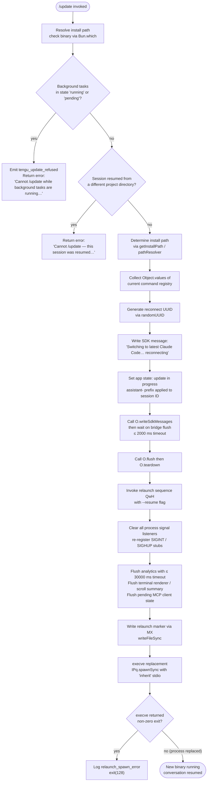

# `/update`

> Analysis basis: CC v2.1.142 bundle.js (AST extraction + Claude interpretation)
> Minimum version: v2.1.142

---

## Overview

The `/update` command performs an in-place hot-upgrade of the running Claude Code CLI binary to the latest available version without terminating the current conversation. It validates preconditions (no background tasks in-flight, no cross-directory resume mismatch), flushes all pending I/O and analytics, then uses `execve`-style process replacement — relaunching the new binary with `--resume` so the conversation context is restored seamlessly.

---

## Registration

| Field | Value |
|---|---|
| type | `local` |
| name | `update` |
| description | `Switch to the latest version (conversation continues)` |
| loc_byte | `11617772` |
| loc_byte_end | `11617974` |
| loc_line | `7223` |
| supportsNonInteractive | `false` |
| isHidden | `true` |
| module_id | `FGq` |
| load_inline | `true` |
| arbor_handler.name | `Kk7` |
| arbor_handler.fqn | `claude-2.1.142::Kk7` |
| arbor_handler.kind | `AsyncFunction` |
| arbor_handler.resolution_path | `module_id` |
| arbor_handler.n_hits | `0` |

Analysis basis: CC v2.1.142 bundle.js:+11617772

---

## Input Branching

The command executes through five or more distinct decision points; a flowchart is used.



---

## Behavioral Spec

### 1. Precondition Check — Background Tasks

Before any upgrade work begins, the handler (`Kk7`) reads the current app state and inspects all tracked background task statuses.

```
function checkBackgroundTaskGuard(appState):
    tasks = Object.values(appState.backgroundTasks)
    for each task in tasks:
        if task.status == "running" or task.status == "pending":
            emit telemetry("tengu_update_refused")
            return Error(
                "Cannot /update while background tasks are running " +
                "— wait for them to finish, then try again."
            )
    return OK
```

Analysis basis: CC v2.1.142 bundle.js:+11615890, +11615928, +11615950, +11616031

### 2. Precondition Check — Project Directory Mismatch

The handler verifies the session was not resumed from a different project directory. This guard prevents silent data loss when `execve` would re-exec in an unexpected working directory.

```
function checkProjectDirectoryGuard(sessionContext):
    if sessionContext.resumedFromDifferentProjectDir == true:
        return Error(
            "Cannot /update — this session was resumed from a different " +
            "project directory. Restart manually with --resume to continue " +
            "on the latest version."
        )
    return OK
```

Analysis basis: CC v2.1.142 bundle.js:+11616272

### 3. Install Path Resolution

The handler resolves the file-system path of the currently running binary (via `resolveInstallPath` / `Bun.which`) and locates the versioned install directory. Path components `.local`, `share`, `versions`, and `bin` are assembled using `path.join`.

```
function resolveInstallPath():
    binaryName = "claude"                     // literal at +11615570
    whichResult = Bun.which(binaryName)       // callGraph +11615567
    homeDir   = os.homedir()                  // callGraph +7563242
    basePath  = path.join(homeDir, ".local", "share", "versions")  // +7563515, +7563524, +7928664
    binDir    = path.join(basePath, "bin")    // +7563594
    return { whichResult, basePath, binDir }
```

Analysis basis: CC v2.1.142 bundle.js:+11615567, +7563242, +7563515, +7928664

### 4. Session Snapshot & UUID Generation

A fresh UUID is generated for the reconnect handshake. The current session ID is prefixed with `"assistant-"` to mark the pre-upgrade checkpoint in the conversation log.

```
function prepareReconnectHandshake(appState):
    reconnectId = crypto.randomUUID()         // callGraph +11614640
    sessionSnapshot = {
        ...appState,
        sessionId: "assistant-" + appState.sessionId   // literal +11616573
    }
    return { reconnectId, sessionSnapshot }
```

Analysis basis: CC v2.1.142 bundle.js:+11616598, +11614640, +11616573

### 5. In-Progress Notification & SDK Message

The handler writes a user-visible status message to the SDK message bus, then updates application state to reflect the upgrade is underway.

```
function notifyUpgradeStart(outputBus, appState, sessionSnapshot):
    outputBus.writeSdkMessages([{
        type: "text",                          // literal +11615713
        content: "Switching to latest Claude Code… reconnecting"   // literal +11616765
    }])
    _.setAppState({ ...sessionSnapshot, updateInProgress: true })  // callGraph +11616655
```

Analysis basis: CC v2.1.142 bundle.js:+11616741, +11616765, +11616655

### 6. Bridge Flush with Timeout

The output bridge is flushed with a hard timeout of **2000 ms** before teardown. If the flush does not resolve within that window the relaunch proceeds anyway.

```
async function flushBridgeWithTimeout(outputBus):
    FLUSH_TIMEOUT_MS = 2000                   // literal +11616845
    result = await Promise.race([
        outputBus.flush(),                    // callGraph +11616835
        delay(FLUSH_TIMEOUT_MS, label="bridge flush")  // literal +11616850
    ])
    await outputBus.teardown()                // callGraph +11616886
```

Analysis basis: CC v2.1.142 bundle.js:+11616835, +11616845, +11616850, +11616886

### 7. Relaunch Sequence (`relaunchWithResume`)

The relaunch handler (`QwH`) is the most complex sub-routine. It orchestrates terminal teardown, analytics flushing, MCP client cleanup, and finally the `execve` replacement.

```
async function relaunchWithResume(installPath, reconnectId):

    // 7a. Determine new binary path
    newBinaryPath = resolveNewBinaryPath(installPath)  // path.stat via vPq.stat +11348764

    // 7b. Terminal renderer teardown
    stopProgressIndicator()            // PO6 / clearInterval +5213220
    unmountInkRenderer()               // SEH / H.unmount +5211954
    writeScrollSummaryTelemetry()      // Y_8 / tengu_scroll_summary +5213342
    renderFinalOutput()                // lA rendering pipeline +3321413..+3322054

    // 7c. Analytics flush — timeout 30000 ms
    await Promise.race([
        analyticsFlush(),              // gZ -> qL +12092063
        delay(30000, "flush timeout (relaunch)")  // literal +11348879, +11348885
    ])

    // 7d. MCP / daemon cleanup — timeout label "cleanup timeout"
    await Promise.all([
        cleanupDaemonState(),          // DhH +11348930
        cleanupAnalyticsPipeline()     // D_8, timeout 500 ms +5213631
    ])
    // literal "cleanup timeout" +11348941

    // 7e. Change working directory to new binary's parent
    targetDir = path.dirname(newBinaryPath)   // kPq.dirname +11349874
    if not path.isAbsolute(targetDir):        // EPq.isAbsolute +11347851
        targetDir = path.join(process.cwd(), targetDir)
    process.chdir(targetDir)                  // callGraph +11347907

    // 7f. Load native FFI (execve binding) for the target platform
    if platform == "macos":                   // literal +11347974
        lib = require("bun:ffi").dlopen(      // +11347938
            "/usr/lib/libSystem.B.dylib",     // literal +11347982
            { execve: { args: ["ptr","ptr","ptr"], returns: "int" } }  // +11348038,+11348065
        )
    else:
        lib = require("bun:ffi").dlopen(
            "libc.so.6",                      // literal +11348011
            { execve: { args: ["ptr","ptr","ptr"], returns: "int" } }
        )

    // 7g. Build argv: [newBinaryPath, "--resume", reconnectId, ...passthrough]
    argv = [newBinaryPath, "--resume", reconnectId]   // literal +11348817
    envBlock = buildEnvBlock(Object.entries(process.env))  // +11348242
    argvBuffer  = Buffer.from(encodeArgv(argv), "utf8")    // +11348093, +11348114

    // 7h. Reset signal handlers and register minimal stubs
    process.removeAllListeners()       // +11349335
    process.on("SIGINT",  noopStub)    // +11349365; literals SIGINT +11349306, SIGHUP +11349325
    process.on("SIGHUP",  noopStub)

    // 7i. Write relaunch marker
    writeRelaunchMarker(reconnectId)   // MX / writeFileSync +188176

    // 7j. Invoke execve — replaces current process image
    exitCode = lib.execve(newBinaryPath, argvBuffer, envBlock)

    // 7k. execve returned — something went wrong
    if exitCode != 0:
        logError("relaunch_spawn_error", exitCode)   // literal +11349617
        process.exit(128)                             // literal +11349754
```

Analysis basis: CC v2.1.142 bundle.js:+11348688..+11349706, +11347827..+11348462

### 8. Object.keys Inspection & Dim Rendering

After the SDK message is sent, the handler uses `Object.keys` over a state structure and applies terminal dim styling via `M6.dim` for the in-progress visual indicator.

```
function renderUpdateProgressIndicator(state):
    keys = Object.keys(state)         // callGraph +11617128
    dimText = M6.dim(keys.join(", ")) // callGraph +11617195
    return dimText
```

Analysis basis: CC v2.1.142 bundle.js:+11617128, +11617195

---

## State & Side Effects

| Item | Detail |
|---|---|
| Telemetry — `tengu_update_refused` | Fired when the update is blocked because background tasks are running or pending (bundle.js:+11615667) |
| Telemetry — `tengu_scroll_summary` | Fired during terminal renderer teardown to record scroll position statistics (bundle.js:+5213342) |
| Telemetry — `tengu_amber_creek` | Fired inside fullscreen/rendering pipeline (`lA` path) (bundle.js:+3322149) |
| Telemetry — `tengu_pewter_brook` | Fired inside fullscreen/rendering pipeline (`lA` path) (bundle.js:+3322057) |
| Telemetry — `tengu_bg_dispatch_sigkill_escalate` | Fires if background worker requires SIGKILL escalation during teardown (bundle.js:+14462646) |
| Telemetry — `tengu_daemon_yield` | Fires when daemon yields to foreground session (bundle.js:+14480594) |
| Telemetry — `tengu_feature_bad` / `tengu_feature_ok` | Feature-gate probes reached during shutdown path (bundle.js:+954608, +954550) |
| Telemetry — `tengu_bg_low_mem_mb` / `tengu_bg_dispatch_low_mem` | Low-memory guard events in background worker teardown (bundle.js:+11935230, +14463225) |
| Telemetry — `tengu_bg_spare_*` | Spare-worker lifecycle events during process replacement (bundle.js:+14463840, +14463961, +14462423, +14464224) |
| Telemetry — `tengu_bg_sendclaim_failed` | Failed IPC claim during spare-worker handoff (bundle.js:+14444612) |
| Telemetry — `tengu_daemon_control` | Daemon control-plane event during teardown (bundle.js:+14497664) |
| appState changes | `setAppState` called with update-in-progress flag and `"assistant-"` prefixed session ID (bundle.js:+11616655, +11616573) |
| SDK message bus | `O.writeSdkMessages` called with reconnect notice; `O.flush` then `O.teardown` called before exec (bundle.js:+11616741, +11616835, +11616886) |
| Process signal handlers | `process.removeAllListeners()` called; `SIGINT` and `SIGHUP` stubs re-registered (bundle.js:+11349335, +11349365) |
| File system | Relaunch marker written via `writeFileSync` (bundle.js:+188176); analytics temp files unlinked via `g6K.unlinkSync` (bundle.js:+14442182); `Ez.rm` / `Ez.unlink` on worker sockets (bundle.js:+14467289, +14468257) |
| Process replacement | `execve` via `bun:ffi` / `IPq.spawnSync` with `inherit` stdio (bundle.js:+11347961, +11349392, +11349427) |
| Working directory | `process.chdir` to new binary's parent directory before exec (bundle.js:+11347907) |
| Native FFI | `bun:ffi` loaded for `libSystem.B.dylib` (macOS) or `libc.so.6` (Linux) to call execve (bundle.js:+11347938, +11347974, +11347982, +11348011) |
| Hook registration | `_.appendEntry` called via `YB_` to persist the "last-prompt" entry in the conversation log (bundle.js:+12090544) |
| MCP clients | `_.getClients()` iterated; `H.applyMcpUpdate` applied; `A.cleanup` and `Ov` called (bundle.js:+14197365, +14196944, +14197073) |
| Sound | None detected in depth-2 traversal |

---

## Version History

| Version | Change |
|---|---|
| v2.1.142 | Initial analysis |

---

## Common Mistakes

1. **Invoking `/update` while background tasks are running.** The command immediately refuses with a human-readable error and fires `tengu_update_refused`. Wait for all background tasks to reach a terminal status before retrying.

2. **Calling `/update` in a session resumed from a different project directory.** The directory-mismatch guard fires before any upgrade work begins. Use `claude --resume` from the correct project directory instead.

3. **Assuming the command is visible in the menu.** `isHidden: true` means `/update` does not appear in the slash-command picker — it must be typed explicitly.

4. **Expecting non-interactive support.** `supportsNonInteractive: false` means the command cannot be driven by `--print` / `--input-file` pipelines; it requires an active terminal session.

5. **Interrupting the flush window.** The bridge flush has a hard cap of **2000 ms** (bundle.js:+11616845) and the analytics flush has a cap of **30 000 ms** (bundle.js:+11348879). Sending SIGKILL during these windows may leave the relaunch marker in an inconsistent state.

6. **Expecting the PID to remain stable.** `/update` uses `execve`-style process replacement; the process image is replaced entirely. Any external tooling that tracks the Claude Code PID will see the connection drop.

---

## Appendix — Identifier Mapping

> For bundle debugging only. Identifiers change across versions.

| Identifier | Role |
|---|---|
| `Kk7` | Main async handler for `/update` (arbor_handler; AsyncFunction, module_id resolution) |
| `TP8` | Install-path resolver entry point; calls `Bun.which` via `Y$` |
| `Y$` | Wrapper that delegates to `aOA` for `Bun.which` lookup |
| `aOA` | `Bun.which` caller — locates the `claude` binary on PATH |
| `am` | Versioned install directory builder; constructs `.local/share/versions/…` paths |
| `E58` | Path join helper using `gw6.join`; resolves `versions` subdirectory |
| `J$` | Array.isArray guard used in path-component normalisation |
| `ezH` | Home-directory path fragment builder (calls `B48` for `os.homedir`) |
| `B48` | Wraps `wZ1.homedir` (Node `os.homedir`) |
| `oe` | Additional path segment assembler using `gD6.join` |
| `v1` | Mode/context reader; checks `"bg"` / `"daemon"` / `"daemon-worker"` run modes |
| `mB` | Run-mode registry (provides `"bg"`, `"daemon"`, `"daemon-worker"` string constants) |
| `d` | General logger / debug sink used throughout the handler |
| `R0` | Binary basename resolver; uses `NP.basename` and version string trimmer `V6` |
| `V6` | Version string formatter/trimmer (calls `JV`; trim length 8) |
| `JV` | Core string utility (trim / pad) |
| `Tp` | Current process path accessor |
| `tp_` | Install-path locator for relaunch; uses `kPq.dirname` and `Q$` |
| `__` | Path existence checker calling `JV` |
| `RK` | Fallback path resolver calling `JV` |
| `y6H` | Session-state accessor used just before app state mutation |
| `Gr` | Hook-set membership check; uses `sX8` and `qu7.has` |
| `sX8` | Hook registry lookup helper |
| `YB_` | Conversation log entry appender; calls `_.appendEntry` with `"last-prompt"` |
| `qL` | Analytics/progress event emitter (emits `"progress"` events) |
| `C9` | State-update helper using `Object.assign` with `fI8` add/delete |
| `fKK` | Undefined-value sentinel accessor for state fields |
| `NH` | Structured error logger; uses `k_`, `bH`, `$q`, `JvK`, `hRH`, `Yc.logError` |
| `k_` | Error constructor wrapper |
| `bH` | String coercion utility |
| `$q` | Error message formatter delegating to `NMA` |
| `NMA` | Error message assembly helper (wraps `bH`) |
| `JvK` | Ring-buffer manager (`XS6.shift` / `XS6.push`) for error history |
| `bZ` | Message-list filter; strips assistant-prefixed entries before exec |
| `O` | Output bridge object (provides `writeSdkMessages`, `flush`, `teardown`) |
| `S8` | Underlying stream writer backing `O` |
| `UGq` | UUID generator wrapper around `WP8.randomUUID` |
| `Pf` | Promise-with-timeout utility using `setTimeout`, `Promise.race`, `clearTimeout` |
| `QwH` | Relaunch orchestrator — the main "relaunch with resume" function |
| `PO6` | Progress indicator stopper; calls `hY_` / `clearInterval` |
| `hY_` | Interval-clearing helper |
| `SEH` | Ink/terminal renderer teardown; calls `H.unmount`, `QOH.writeSync`, `sy`, `io6`, `bH` |
| `H` | Ink renderer instance (also `Math.random` / `setTimeout` for animation) |
| `sy` | Terminal state serialiser used during teardown |
| `io6` | Raw terminal output writer; handles escape sequences and `c0H` coercion |
| `c0H` | Terminal output coercion/formatter; uses `IJ`, `kk9.coerce`, `gE` |
| `g0H` | Supplementary terminal helper used inside `io6` |
| `k0` | tmux/screen multiplexer escape-sequence handler (`\ESC\ESC` double-escape) |
| `Y_8` | Scroll-summary recorder; fires `tengu_scroll_summary`; delegates to `UA1`, `lA` |
| `PV` | Scroll position data accessor |
| `BA1` | Scroll metric accumulator |
| `UA1` | Scroll timing calculator using `Date.now`, `Math.max`, `Math.round`, `Object.assign` |
| `mA1` | Scroll-stat finaliser |
| `lA` | Full rendering / fullscreen pipeline entry point |
| `WRH` | Local-agent environment checker (`_IK.has`) |
| `w1_` | Fullscreen mode resolver using `Nq` and `bH` |
| `Vl` | Terminal capability tester using `sRL` |
| `v` | Fullscreen suppression evaluator (checks tmux/screen/Windows SSH; fires flicker warnings) |
| `e76` | Boolean coercion helper used in rendering |
| `m_` | Rendering sub-routine delegating to `ax` |
| `tRL` | Terminal-resize listener calling `G6` |
| `G6` | Ink render dispatcher; uses `Z76`, `V76`, `ws`, `gMH`, `Ji6`, `T76`, `MF`, `y6` |
| `gZ` | Analytics flush wrapper calling `qL` |
| `DhH` | Daemon/state cleanup helper: `Promise.all`, `Array.from`, `H` iteration |
| `D_8` | Analytics pipeline flush with 500 ms timeout; uses `Promise.race`, `kN`, `wF`, `a8` |
| `a8` | Process-lifecycle helper: handles abort, `setTimeout`, `clearTimeout`, `L.unref` |
| `K` | Active-request tracker: `L.map`, `f.padEnd` |
| `q` | Temp-file cleanup: `g6K.unlinkSync` |
| `L` | Request-set manager: `q.add`, `f.finally`, `q.delete` |
| `ZPq` | Core relaunch executor: `process.chdir`, `require`, `bun:ffi` dlopen, `execve`, `M.execve` |
| `f` | FFI library handle: provides `dlopen`, `ptr`, `on`, `once`, `write`, `end` |
| `A` | Worker/client registry map (get/set/values/close operations) |
| `$` | Pending-event queue with `zEq` push entries |
| `zEq` | Event-queue entry constructor: `Date.now`, `Va`, `u7`, `h06`, `RH` |
| `w` | Background worker manager: spawn, SIGKILL escalation, memory checks, spare-worker logic |
| `y` | Individual worker instance: `z.write`, `d` |
| `uH` | Worker unhealthy state handler calling `d` (fires `tengu_feature_bad`) |
| `SH` | Worker healthy state handler calling `d` (fires `tengu_feature_ok`) |
| `LG6` | Low-memory guard: checks against 1024 MB threshold, fires `tengu_bg_low_mem_mb` |
| `S` | Worker-slot manager: `retireIfSettled` |
| `xr_` | IPC claim + connect handler: `HU.claim`, `BT8.connect`, socket `on`/`once`/`write`/`end` |
| `Fr_` | Worker lifecycle FSM: done/killed/failed/crashed/blocked/working/active/idle states |
| `D` | Worker eviction/disposal loop: `$.dispose`, `Date.now`, `NH`, SIGKILL escalation |
| `O8` | Output buffer object used within worker managers |
| `u` | Worker I/O handle: `clearTimeout`, `$.write` |
| `M` | MCP manager entry: `IvH` (connect all), `Peq` (apply update), `n_5` (retry recovery) |
| `IvH` | MCP connect-all: iterates server configs (stdio/sse/http/sse-ide/ws-ide types), `Promise.all` |
| `Peq` | MCP update applier: `H.applyMcpUpdate`, `SY8`, `A.cleanup`, `Ov`, `cY` |
| `n_5` | MCP retry-recovery: `_.getClients`, `a8`, `BrH`, `IvH`, `Peq`, `Object.fromEntries` |
| `z` | Daemon stop/start helper: `SH`, `uH`, `aR`, `Ax` (fires `tengu_daemon_control`) |
| `aR` | Daemon registration helper: `Ds`, `LF.push`, `f0H`, `VA_` |
| `Ax` | Daemon lifecycle orchestrator: `Promise.race`, `Promise.all`, `fF`, `DF`, `a8`, `process.exit` |
| `GH` | String coercion utility used in FFI argument encoding |
| `MX` | Relaunch-marker writer: `UhH.writeFileSync`, `Cv8.join` (writes marker file before exec) |