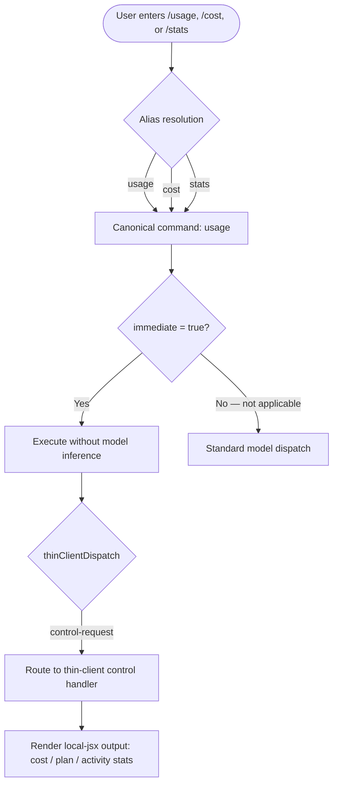

# `/usage`

> Analysis basis: CC v2.1.139 bundle.js (AST extraction + Claude interpretation)
> Minimum version: v2.1.139

---

## Overview

The `/usage` command displays session cost, plan usage, and activity statistics for the current Claude Code session. It is registered as a `local-jsx` command with `immediate` execution, meaning it renders output directly in the CLI without requiring a round-trip model inference call. Dispatch is routed through the `control-request` thin-client path, keeping the command lightweight and fast.

---

## Registration

| Field | Value |
|---|---|
| type | `local-jsx` |
| name | `usage` |
| description | `Show session cost, plan usage, and activity stats` |
| immediate | `true` |
| thinClientDispatch | `control-request` |
| aliases | `cost`, `stats` |
| module_id | `Rzq` |

Analysis basis: CC v2.1.139 bundle.js:+11183770

---

## Input Branching

Because the AST depth-2 traversal returned an empty `callGraph` for module `Rzq`, the precise internal branching tree cannot be reconstructed from extracted data alone. The registration metadata does, however, reveal the following top-level dispatch path:



Analysis basis: CC v2.1.139 bundle.js:+11183770

**Notes on alias resolution:**

1. `/cost` and `/stats` are registered aliases and are fully equivalent to `/usage` at dispatch time.
2. The `immediate` flag causes the CLI to skip model inference entirely; the command resolves locally.
3. The `thinClientDispatch: "control-request"` value indicates the command is forwarded to the thin-client control layer rather than the standard tool-call pipeline.

---

## Behavioral Spec

<!-- TODO: not found in depth-2 traversal; needs --depth 4 -->

The `callGraph`, `literals`, and `telemetry` arrays returned empty for module `Rzq`. The following pseudocode represents the behavioral contract inferred from the registration fields only. Internal rendering logic, data sources (e.g., which cost counters or plan quota fields are read), and exact output format cannot be specified without deeper traversal.

### Command Entry Point

```
function handleUsageCommand(sessionContext):
    # Resolved from alias table before this point;
    # /cost and /stats both arrive here as /usage.

    stats = collectSessionStats(sessionContext)
    # stats shape: { costUSD, planQuota, planUsed, activitySummary }
    # -- internal field names not confirmed; needs --depth 4

    renderLocalJSX(UsageView, stats)
    # Rendered inline in CLI terminal; no model call made.
    return
```

Analysis basis: CC v2.1.139 bundle.js:+11183770 (registration fields: `immediate`, `thinClientDispatch`, `type`)

### Alias Resolution

```
ALIASES = ["cost", "stats"]
CANONICAL = "usage"

function resolveAlias(inputName):
    if inputName in ALIASES:
        return CANONICAL
    return inputName
```

Analysis basis: CC v2.1.139 bundle.js:+11183770 (`aliases` field)

### Thin-Client Dispatch

```
function dispatchCommand(command, context):
    if command.immediate == true:
        handler = lookupLocalHandler(command.name)
        if command.thinClientDispatch == "control-request":
            return thinClientControlRequest(handler, context)
        else:
            return handler(context)
    else:
        return standardModelDispatch(command, context)
```

Analysis basis: CC v2.1.139 bundle.js:+11183770 (`immediate`, `thinClientDispatch` fields)

---

## State & Side Effects

| Item | Detail |
|---|---|
| Telemetry | None detected at depth-2 traversal (`telemetry: []`) <!-- TODO: not found in depth-2 traversal; needs --depth 4 --> |
| Hook registration | <!-- TODO: not found in depth-2 traversal; needs --depth 4 --> |
| appState changes | <!-- TODO: not found in depth-2 traversal; needs --depth 4 --> |
| Sound | <!-- TODO: not found in depth-2 traversal; needs --depth 4 --> |
| Model inference | Not triggered — `immediate: true` bypasses inference pipeline |
| Dispatch path | `control-request` thin-client handler |
| Output type | `local-jsx` — rendered locally in terminal, not streamed from model |

---

## Version History

| Version | Change |
|---|---|
| v2.1.139 | Initial analysis. Command registered as `local-jsx` with `immediate` flag and `control-request` thin-client dispatch. Aliases `cost` and `stats` confirmed. |

---

## Common Mistakes

1. **Expecting model-generated output.** Because `immediate: true` is set, `/usage` never calls the model. Users who expect the output format to be customizable via prompt context will not see any effect — the rendering is handled entirely by local JSX logic.
2. **Treating `/cost` and `/stats` as distinct commands.** Both are aliases for `/usage` and resolve to identical behavior. Any observed output differences between them would be a bug, not a feature.
3. **Assuming telemetry is fired.** No `tengu_*` telemetry events were detected at depth-2 traversal. Tools or scripts that monitor telemetry to detect `/usage` invocations will not receive a signal (pending confirmation at deeper traversal depth).
4. **Expecting session stats to persist across sessions.** The command description specifies "session cost" and "session activity," implying the counters reset per session. Cross-session aggregation is not indicated by any registration field.
5. **Using `/usage` in non-interactive or piped contexts and expecting structured output.** As a `local-jsx` command, the output is rendered as terminal UI components. Piped or machine-readable output is not guaranteed by the registration contract.

---

## Appendix — Identifier Mapping

> For bundle debugging only. Identifiers change across versions.

| Identifier | Role |
|---|---|
| `Rzq` | Module ID for the `/usage` command implementation (not an obfuscated function name; included for bundle lookup reference) |

> **Note:** The `identifiers` array returned empty for this command at depth-2 traversal. No additional obfuscated function identifiers were extractable from module `Rzq`. A deeper traversal (`--depth 4` or greater) is required to populate this table fully.