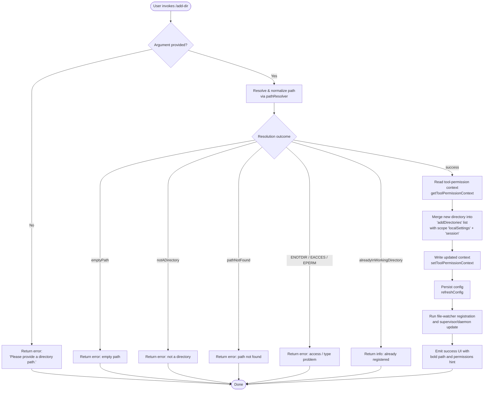

# `/add-dir`

> Analysis basis: CC v2.1.143 bundle.js (AST extraction + Claude interpretation)
> Minimum version: v2.1.143

---

## Overview

The `/add-dir` command adds a new working directory to the active Claude Code session. It accepts a filesystem path as its argument, validates and resolves that path, updates the tool-permission context to include the new directory, and refreshes the daemon configuration so that subsequent tool calls can access it. If the path is absent, invalid, or already registered, the command returns a descriptive error and makes no state change.

---

## Registration

| Field | Value |
|---|---|
| type | `local-jsx` |
| name | `add-dir` |
| description | `Add a new working directory` |
| argumentHint | `<path>` |
| module_id | `vQ9` |

Analysis basis: CC v2.1.143 bundle.js:+4439929

---

## Input Branching

The command entry-point (the **command handler**) runs the following high-level branches:



Analysis basis: CC v2.1.143 bundle.js:+4438698 – +4439515

---

## Behavioral Spec

### 1. Argument Guard

If the user provides no path argument, the command immediately returns a static error string without touching any state.

```
function argumentGuard(rawInput):
    trimmed = rawInput.trim()
    if trimmed is empty:
        return errorResult("Please provide a directory path.")
    return trimmed
```

Literal: `"Please provide a directory path."` — Analysis basis: CC v2.1.143 bundle.js:+3723282
Literal: `"Did not add a working directory."` — Analysis basis: CC v2.1.143 bundle.js:+4439420

---

### 2. Path Resolution (`pathResolver`)

Path resolution normalizes the raw string into an absolute, canonical filesystem path and validates it against the OS.

```
function pathResolver(rawPath):
    // Guard: reject strings containing null bytes
    if rawPath contains null byte:
        raise TypeError("Path contains null bytes")

    // Expand tilde
    if rawPath starts with "~/":
        rawPath = homedir() + rawPath.slice(2)

    // Windows drive-letter normalization (platform == "windows")
    if platform is windows:
        rawPath = applyWindowsDriveNormalization(rawPath)

    // Normalize and make absolute
    normalized = path.normalize(rawPath)
    if not path.isAbsolute(normalized):
        normalized = path.resolve(normalized)

    // Resolve symlinks
    real = fs.realpath(normalized)          // async

    // stat the resolved path
    info = fs.stat(real)
    if stat fails with ENOTDIR, EACCES, or EPERM:
        return { outcome: "notADirectory" | "accessDenied" }
    if stat fails with ENOENT or path not found:
        return { outcome: "pathNotFound" }
    if info is not a directory:
        return { outcome: "notADirectory" }

    // Check for macOS /var/ → /private/var symlink
    real = real.replace("/var/", "/private/var/")
    real = real.replace(/\/tmp(\/.*)/, "/private/tmp$1")

    return { outcome: "success", resolvedPath: real }
```

Literal: `"Path contains null bytes"` — Analysis basis: CC v2.1.143 bundle.js:+996499
Literal: `"~/"` — Analysis basis: CC v2.1.143 bundle.js:+996653
Literal: `"windows"` — Analysis basis: CC v2.1.143 bundle.js:+996735
Literal: `"emptyPath"` — Analysis basis: CC v2.1.143 bundle.js:+3722767
Literal: `"notADirectory"` — Analysis basis: CC v2.1.143 bundle.js:+3722865
Literal: `"ENOTDIR"` — Analysis basis: CC v2.1.143 bundle.js:+3722955
Literal: `"EACCES"` — Analysis basis: CC v2.1.143 bundle.js:+3722970
Literal: `"EPERM"` — Analysis basis: CC v2.1.143 bundle.js:+3722984
Literal: `"pathNotFound"` — Analysis basis: CC v2.1.143 bundle.js:+3723010
Literal: `"/var/"` replacement — Analysis basis: CC v2.1.143 bundle.js:+12181735
Literal: `"/tmp$1"` replacement — Analysis basis: CC v2.1.143 bundle.js:+12181776
Analysis basis: CC v2.1.143 bundle.js:+3722786 – +3723095

---

### 3. Duplicate-Directory Check

After successful resolution, the command checks whether the resolved path is already present in the current working-directory list.

```
function duplicateCheck(resolvedPath, currentDirectories):
    if currentDirectories.includes(resolvedPath):
        return { outcome: "alreadyInWorkingDirectory" }
    return { outcome: "proceed" }
```

Literal: `"alreadyInWorkingDirectory"` — Analysis basis: CC v2.1.143 bundle.js:+3723121

---

### 4. Permission-Context Mutation

The command reads the current tool-permission context, splices in the new directory, then writes it back. The mutation targets the `addDirectories` key within the `localSettings` scope, further qualified by the `session` sub-scope.

```
function mutatePermissionContext(resolvedPath):
    ctx = getToolPermissionContext()           // read current state

    // Locate or create the addDirectories list
    // under localSettings > session
    targetList = ctx["localSettings"]["session"]["addDirectories"] ?? []
    targetList.append(resolvedPath)

    ctx["localSettings"]["session"]["addDirectories"] = targetList

    setToolPermissionContext(ctx)             // write back
```

Literal: `"addDirectories"` — Analysis basis: CC v2.1.143 bundle.js:+4438757
Literal: `"localSettings"` — Analysis basis: CC v2.1.143 bundle.js:+4438804
Literal: `"session"` — Analysis basis: CC v2.1.143 bundle.js:+4438820
Analysis basis: CC v2.1.143 bundle.js:+4438698 (getToolPermissionContext)
Analysis basis: CC v2.1.143 bundle.js:+4438831 (setToolPermissionContext)

---

### 5. Config Persistence and Daemon Refresh

After the in-memory context is updated, the command triggers a config refresh and updates the daemon/supervisor.

```
function persistAndRefresh():
    c_.refreshConfig()                        // persist settings to disk

    // Supervisor / file-watcher lifecycle:
    //   stop current watcher → update config → restart watcher
    watcher.stop()
    watcher.updateConfig(newConfig)
    watcher.start()

    // Daemon heartbeat / supervisor registration also updated
    supervisorHeartbeat.restart()
```

Analysis basis: CC v2.1.143 bundle.js:+4438915 (refreshConfig call)
Analysis basis: CC v2.1.143 bundle.js:+14516721 (updateConfig)
Analysis basis: CC v2.1.143 bundle.js:+14516739 (start)
Analysis basis: CC v2.1.143 bundle.js:+14516712 (stop)
Literal: `"supervisor"` — Analysis basis: CC v2.1.143 bundle.js:+14516324
Literal: `"heartbeat"` — Analysis basis: CC v2.1.143 bundle.js:+14515546

---

### 6. File-Indexing / Background Worker Registration (`fileIndexer`)

The `--add-dir` flag is also passed to the background file-indexing subsystem, which updates its internal maps for the new directory.

```
function registerDirectoryWithFileIndexer(resolvedPath):
    // Remove stale cache entry if present
    indexCache.delete(resolvedPath)

    // Stat the path; build index entry
    statResult = fs.stat(resolvedPath)
    entry = {
        path:      resolvedPath,
        basename:  path.basename(resolvedPath),
        order:     statResult.order,
        stateOrder: statResult.stateOrder,
    }

    // Read existing index file (utf-8), merge, set cache
    existing = fs.readFile(indexFilePath, encoding="utf-8")
    merged = mergeIndexEntries(existing, entry)
    indexCache.set(resolvedPath, merged)

    // Evict oldest entries when cache exceeds 1000 items
    if indexCache.size > 1000:
        indexCache.clear()
```

Literal: `"--add-dir"` — Analysis basis: CC v2.1.143 bundle.js:+4438945
Literal: `"order"` — Analysis basis: CC v2.1.143 bundle.js:+4022763
Literal: `"stateOrder"` — Analysis basis: CC v2.1.143 bundle.js:+4022784
Literal: `"utf-8"` — Analysis basis: CC v2.1.143 bundle.js:+4023234
Cache eviction limit 1000 — Analysis basis: CC v2.1.143 bundle.js:+4023698
Literal: `"warn"` log level on cache miss — Analysis basis: CC v2.1.143 bundle.js:+4023100
Analysis basis: CC v2.1.143 bundle.js:+4026064 – +4026358

---

### 7. Permission-Rule Sync (`permissionRuleSync`)

The permission management subsystem updates its rule sets to include the new directory. It handles `alwaysAllowRules`, `alwaysDenyRules`, and `alwaysAskRules`, keyed under `userSettings` and `projectSettings` scopes.

```
function syncPermissionRules(resolvedPath):
    for scope in ["userSettings", "projectSettings"]:
        ruleSet = permissionStore.get(scope)

        // addRules / replaceRules / removeRules operations
        // are applied in this order when pending
        applyAddRules(ruleSet, resolvedPath)
        applyReplaceRules(ruleSet, resolvedPath)
        applyRemoveRules(ruleSet)

        // removeDirectories cleans up stale entries
        removeDirectories(ruleSet)

        permissionStore.set(scope, ruleSet)
```

Literal: `"addRules"` — Analysis basis: CC v2.1.143 bundle.js:+4033928
Literal: `"replaceRules"` — Analysis basis: CC v2.1.143 bundle.js:+4034276
Literal: `"removeRules"` — Analysis basis: CC v2.1.143 bundle.js:+4034933
Literal: `"removeDirectories"` — Analysis basis: CC v2.1.143 bundle.js:+4035317
Literal: `"alwaysAllowRules"` — Analysis basis: CC v2.1.143 bundle.js:+4034121
Literal: `"alwaysDenyRules"` — Analysis basis: CC v2.1.143 bundle.js:+4034160
Literal: `"alwaysAskRules"` — Analysis basis: CC v2.1.143 bundle.js:+4034178
Literal: `"userSettings"` — Analysis basis: CC v2.1.143 bundle.js:+4035726
Literal: `"projectSettings"` — Analysis basis: CC v2.1.143 bundle.js:+4035746
Literal: `"policySettings"` — Analysis basis: CC v2.1.143 bundle.js:+1206298
Literal: `"flagSettings"` — Analysis basis: CC v2.1.143 bundle.js:+1206320
Analysis basis: CC v2.1.143 bundle.js:+4034085 – +4035545

---

### 8. `bypassPermissions` Mode Guard

Before applying any permission-context mutations, the command checks whether `bypassPermissions` mode is active. If the session was not launched in that mode, attempts to set it are silently rejected with a debug log.

```
function bypassPermissionsGuard(ctx, requestedMode):
    if requestedMode == "bypassPermissions":
        if not ctx.bypassPermissionsAvailable:
            log.debug(
                "Ignoring permission update: setMode 'bypassPermissions' " +
                "rejected — mode is not available " +
                "(disableBypassPermissionsMode set, or session not launched " +
                "in bypassPermissions mode)"
            )
            return  // no-op
    applyMode(ctx, requestedMode)
```

Literal: `"bypassPermissions"` — Analysis basis: CC v2.1.143 bundle.js:+4033586
Literal (full log message) — Analysis basis: CC v2.1.143 bundle.js:+4033652
Literal: `"setMode"` — Analysis basis: CC v2.1.143 bundle.js:+4033564
Literal: `"debug"` log level — Analysis basis: CC v2.1.143 bundle.js:+201193

---

### 9. Success / Error UI Rendering

On success the command renders a bold display of the resolved path and a dimmed permissions hint. On any failure it renders the error reason.

```
function renderResult(outcome, resolvedPath):
    match outcome:
        "success":
            print bold(resolvedPath)
            print dim("· /permissions to manage")
        "alreadyInWorkingDirectory":
            print info("Directory already in working set.")
        "Unknown error" | any other error:
            print error("Unknown error")
            print "Did not add a working directory."
        _:
            print errorReason(outcome)
```

Literal: `"· /permissions to manage"` — Analysis basis: CC v2.1.143 bundle.js:+4439285
Literal: `"Unknown error"` — Analysis basis: CC v2.1.143 bundle.js:+4439177
Literal: `"Did not add a working directory."` — Analysis basis: CC v2.1.143 bundle.js:+4439420
Literal: `"success"` — Analysis basis: CC v2.1.143 bundle.js:+3723197
Analysis basis: CC v2.1.143 bundle.js:+4438992 (bold), +4439278 (dim)

---

### 10. CLAUDE.md Auto-Discovery (`claudeMdLoader`)

When the new directory is registered, the command triggers discovery and loading of any `CLAUDE.md` file within that directory tree. Files are read as UTF-8, normalized to NFC, and appended to the instruction context. Directory creation (mode `448` = octal `0700`) and file appending use async `fs` operations.

```
function discoverClaudeMd(resolvedPath):
    configPath = path.join(resolvedPath, "CLAUDE.md")    // or nested variant
    normalizedPath = normalize(configPath, form="NFC")

    content = fs.readFile(normalizedPath, encoding="utf8")
    if read fails:
        log.error(...)
        return

    // Ensure parent directory exists (mode 448 = 0o700)
    fs.mkdir(path.dirname(normalizedPath), { recursive: true, mode: 448 })

    // Append discovered content
    fs.appendFile(normalizedPath, content, { mode: 384 })  // 384 = 0o600
```

Literal: `"NFC"` — Analysis basis: CC v2.1.143 bundle.js:+12114598
Literal: `"utf8"` — Analysis basis: CC v2.1.143 bundle.js:+12114790
Literal: `"error"` log level — Analysis basis: CC v2.1.143 bundle.js:+12114686
Literal: `"test"` environment guard — Analysis basis: CC v2.1.143 bundle.js:+12114334
Directory mode `448` (0o700) — Analysis basis: CC v2.1.143 bundle.js:+12114914
File mode `384` (0o600) — Analysis basis: CC v2.1.143 bundle.js:+12114981
Literal: `"ENOENT"` — Analysis basis: CC v2.1.143 bundle.js:+11890216
Analysis basis: CC v2.1.143 bundle.js:+12114538 – +12114953

---

## State & Side Effects

| Item | Detail |
|---|---|
| Telemetry | `tengu_daemon_config_reload` fired after daemon config is reloaded (Analysis basis: CC v2.1.143 bundle.js:+14517117) |
| Permission context | `addDirectories` list under `localSettings > session` updated in-memory via `setToolPermissionContext` |
| Config persistence | `c_.refreshConfig()` writes updated config to disk (Analysis basis: CC v2.1.143 bundle.js:+4438915) |
| File watcher | Watcher is stopped, reconfigured with new directory, and restarted (Analysis basis: CC v2.1.143 bundle.js:+14516712, +14516721, +14516739) |
| Supervisor / daemon | Supervisor registration and heartbeat updated; `tengu_daemon_config_reload` emitted |
| File index cache | New directory added to background file-index cache; cache cleared if size exceeds 1000 entries (Analysis basis: CC v2.1.143 bundle.js:+4023698) |
| CLAUDE.md context | Any `CLAUDE.md` found under the new directory is read (utf8/NFC) and appended to the instruction context |
| Permission rules | `alwaysAllowRules`, `alwaysDenyRules`, `alwaysAskRules` in `userSettings` and `projectSettings` updated via add/replace/remove rule operations |
| Sound | <!-- TODO: not found in depth-2 traversal; needs --depth 4 --> |
| appState changes | Working-directory list extended; permission-context map updated |

---

## Version History

| Version | Change |
|---|---|
| v2.1.143 | Initial analysis |

---

## Common Mistakes

1. **Omitting the path argument** — Running `/add-dir` with no argument triggers the static error `"Please provide a directory path."` and exits immediately. Always supply a path.

2. **Supplying a file path instead of a directory** — The path is validated with `fs.stat`. If the target is a regular file, the command returns outcome `"notADirectory"` and makes no state change.

3. **Expecting immediate tool access without a reload** — The config persistence and daemon refresh are asynchronous. Tools that rely on the new directory may not see it until the `tengu_daemon_config_reload` cycle completes.

4. **Re-adding an already registered directory** — The duplicate check returns `"alreadyInWorkingDirectory"` without error; no second entry is appended. This is silent on the permission-context side but visible in the UI.

5. **Using relative paths expecting CWD resolution** — The command normalizes relative paths to absolute using `path.resolve()`, but the resolved base is the process working directory at invocation time, which may differ from the user's expectation. Prefer absolute paths.

6. **Assuming `bypassPermissions` is always settable** — If the session was not launched in `bypassPermissions` mode, any attempt to apply that mode during `/add-dir` is silently ignored (debug-logged only).

7. **Providing paths with null bytes** — Such paths are rejected immediately with a `TypeError` before any filesystem access occurs.

---

## Appendix — Identifier Mapping

> For bundle debugging only. Identifiers change across versions.

| Identifier | Role |
|---|---|
| `UeL` | Command handler — top-level `/add-dir` implementation function |
| `Ff` | Permission-context mutation helper (read / modify / write tool-permission context) |
| `v` | Permission-mode guard (`bypassPermissions` check and mode setter) |
| `Yf` | Rule serialization / deserialization helper |
| `hH` | JSON serialization utility (wraps `JSON.stringify`) |
| `A` | Permission-rule store map (keyed by lowercase scope name) |
| `K` | Rule-list formatter / padder (formats rules with `padEnd` width 40) |
| `L` | Async-operation queue / pending-set manager |
| `gv` | Working-directory list accessor |
| `Y` | Daemon / supervisor manager (start, stop, updateConfig, heartbeat) |
| `XJH` | Supervisor config writer (handles `ENOENT`, `Object.keys` enumeration) |
| `q` | File-write / unlink worker queue |
| `cIq` | Config-diff / max-computation helper (`Math.max`, `Object.keys`) |
| `f` | Connection / channel manager (open, close, get, set) |
| `T` | Remote-control / event-stop handler (`preventDefault`, `remoteControlAtStartup`) |
| `Z` | File watcher instance (stop / updateConfig / start surface) |
| `G_K` | Heartbeat emitter (calls `Zs`) |
| `V` | Secondary watcher or supervisor start handle |
| `d` | Daemon reload callback (fires `tengu_daemon_config_reload`) |
| `DH6` | Directory-already-registered check / notifier |
| `Pf_` | CLAUDE.md discovery and loading function |
| `EJH` | Test-environment guard for config loading |
| `$8` | Error-code extractor (reads `.code` property from error objects) |
| `CU` | Path normalization helper (calls `GV`) |
| `__` | Secondary path normalization helper (calls `GV`) |
| `NH` | Instruction / context entry builder and appender |
| `up9` | Background file-index registration orchestrator |
| `o2` | Index cache delete helper |
| `s1` | Index entry builder (stat, basename, readFile, cache set/get/clear) |
| `Bf` | Index entry serializer (JSON, path join, depth 2) |
| `ft` | Permission-rule sync function (userSettings / projectSettings) |
| `v7_` | Settings-layer loader helper |
| `Qp9` | Rule-list builder and filter (maps, filters, deduplicates) |
| `I8` | Rule-item constructor |
| `p_` | Policy / flag settings resolver and emitter |
| `DO` | Rule-string formatter (substring, padding) |
| `H` | Jitter / random-delay utility (uses `Math.random` + `setTimeout`) |
| `ZUH` | Path validation and stat orchestrator (resolves, stats, classifies outcome) |
| `H9` | Path resolver and expander (tilde, Windows, null-byte, normalize, isAbsolute) |
| `L8` | Error-code comparison utility |
| `al` | macOS symlink path rewrite helper (calls `__`) |
| `fS` | Full path display formatter (tilde collapse, `/var/` rewrite, `vW`/`yQ_` helpers) |
| `VUH` | Success UI renderer (bold path, dirname, permissions hint) |