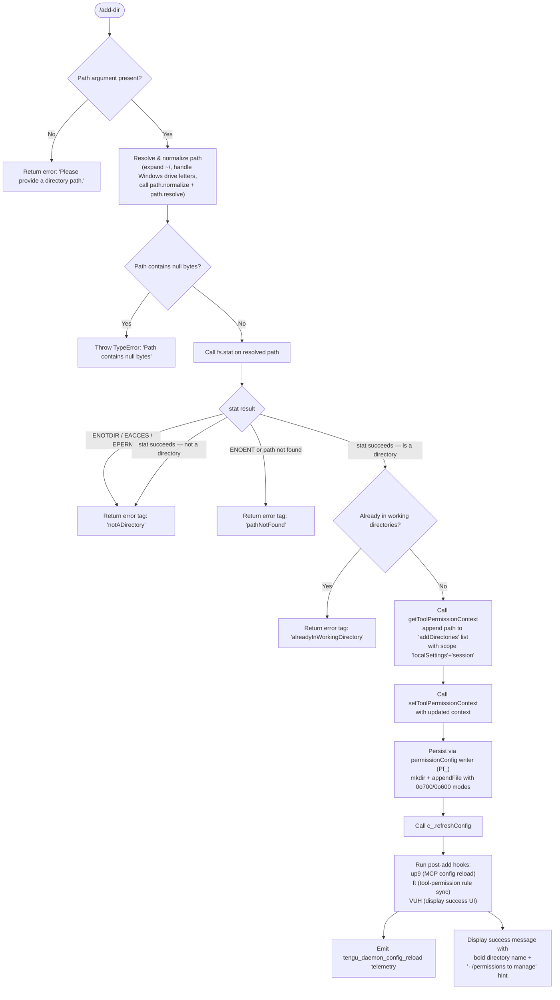

# `/add-dir`

> Analysis basis: CC v2.1.143 bundle.js (AST extraction + Claude interpretation)
> Minimum version: v2.1.143

---

## Overview

`/add-dir` adds a new working directory to the current Claude Code session, expanding the set of filesystem paths the agent is permitted to read and operate within. The command accepts a single path argument, resolves and validates it, then registers it in the session's tool-permission context before refreshing the configuration. It is also exposed as the `--add-dir` CLI flag for non-interactive use.

---

## Registration

| Field | Value |
|---|---|
| type | `local-jsx` |
| name | `add-dir` |
| description | `Add a new working directory` |
| argumentHint | `<path>` |
| module_id | `vQ9` |
| load_inline | `true` |
| loc_byte | `4439929` |
| loc_byte_end | `4440077` |
| loc_line | `788` |
| arbor_handler.name | `UeL` |
| arbor_handler.fqn | `claude-2.1.143::UeL` |
| arbor_handler.kind | `AsyncFunction` |
| arbor_handler.resolution_path | `module_id` |
| arbor_handler.n_hits | `0` |

Analysis basis: CC v2.1.143 bundle.js:+4439929

---

## Input Branching

Six or more distinct outcome branches are identifiable from the literals and call graph, so a Mermaid flowchart is used.



---

## Behavioral Spec

### Top-level handler (`UeL`)

```
async function addDirHandler(input, appState):
    toolCtx = getToolPermissionContext(appState)

    // Merge the new path into the "addDirectories" list
    // scoped to "localSettings" and "session"
    updatedCtx = setToolPermissionContext(toolCtx, {
        addDirectories: [...toolCtx.addDirectories, input.path],
        scope: ["localSettings", "session"]   // literals at +4438757, +4438804, +4438820
    })

    // Persist rules & sync permission flags
    persistPermissionConfig(updatedCtx)   // permissionConfigWriter

    // Refresh runtime configuration
    appState.refreshConfig()

    // Post-add side-effects
    postAddMcpReload(updatedCtx)          // up9
    syncToolPermissionRules(updatedCtx)   // ft
    renderAddDirResult(result)            // VUH / ZUH branching
```

Analysis basis: CC v2.1.143 bundle.js:+4438698

---

### Path resolution and validation (`ZUH` → `H9`)

```
async function resolveAndValidatePath(rawInput):
    if rawInput is empty or whitespace:
        return { tag: "emptyPath", message: "Please provide a directory path." }
                                           // literal at +3723282

    normalized = path.normalize(rawInput)  // path.normalize call at +996555

    // Expand home directory shorthand
    if normalized.startsWith("~/"):        // literal at +996653
        normalized = path.join(os.homedir(), normalized.slice(2))

    // Handle Windows-style drive letters                // literal at +996735
    if platform is "windows":
        apply Windows path normalisation

    if normalized contains null bytes:
        throw TypeError("Path contains null bytes")      // literal at +996499

    if not path.isAbsolute(normalized):
        normalized = path.resolve(normalized)

    try:
        stat = await fs.stat(normalized)                 // kC9.stat at +3722820
    catch err:
        if err.code in ["ENOTDIR", "EACCES", "EPERM"]:  // literals at +3722955/70/84
            return { tag: "notADirectory" }              // literal at +3722865
        if err.code == "ENOENT":
            return { tag: "pathNotFound" }               // literal at +3723010
        throw err

    if not stat.isDirectory():
        return { tag: "notADirectory" }

    if currentWorkingDirectories.includes(normalized):
        return { tag: "alreadyInWorkingDirectory" }      // literal at +3723121

    return { tag: "success", resolvedPath: normalized }  // literal at +3723197
```

Analysis basis: CC v2.1.143 bundle.js:+3722786

---

### Permission context update (`Ff`)

```
function applyPermissionContextUpdate(toolCtx, newPath):
    // Process "setMode" operations from tool context
    if toolCtx contains setMode == "bypassPermissions":
        if bypassPermissions mode is unavailable or disabled:
            log warning: "Ignoring permission update: setMode 'bypassPermissions' rejected …"
                         // literal at +4033652
            skip setMode application

    // Merge allow/deny/ask rules
    for operation in [addRules, replaceRules, removeRules]:   // literals at +4033928/34276/34933
        apply operation to:
            alwaysAllowRules   // literal at +4034121
            alwaysDenyRules    // literal at +4034160
            alwaysAskRules     // literal at +4034178

    // Append new directory to addDirectories list
    // Remove from removeDirectories list if present  // literal at +4035317
    updatedCtx = mergeDirectories(toolCtx, newPath)

    return updatedCtx
```

Analysis basis: CC v2.1.143 bundle.js:+4033963

---

### Permission config persistence (`Pf_`)

```
async function persistPermissionConfig(configData):
    // Normalise unicode to NFC form              // literal at +12114598
    // Resolve real path via fs.realpath          // xL.realpath at +12114572

    // Determine config file layer priority:
    //   policySettings > flagSettings > userSettings > projectSettings
    //   literals at +1206298, +1206320, +1206856, +1206971

    configDir = path.dirname(configFilePath)
    await fs.mkdir(configDir, { recursive: true, mode: 0o700 })   // mode 448 at +12114914

    await fs.appendFile(configFilePath, serialisedData, {
        encoding: "utf8",                         // literal at +12114790
        mode: 0o600                               // mode 384 at +12114981
    })

    // Log errors via NH (error logger) if write fails
    // Push error records to in-memory ring buffer (kNK)
```

Analysis basis: CC v2.1.143 bundle.js:+12114538

---

### MCP config reload (`up9`)

```
async function postAddMcpReload(context):
    // Clear stale MCP file-state cache (o2 / f3H.delete)
    invalidateMcpFileCache()

    // Re-read MCP config files (s1):
    //   stat each registered MCP config path
    //   readFile → JSON.parse (R6)
    //   update cache entries (f3H.set/get/clear)
    //   handle warn-level parse failures

    // Atomic write-back via eO:
    //   Vr8.randomBytes → tmp file → rename
    //   honour FeA (binary extensions) and geA (ignored extensions) sets

    // Log via NH on error
```

Analysis basis: CC v2.1.143 bundle.js:+4438941

---

### Tool-permission rule synchronisation (`ft`)

```
async function syncToolPermissionRules(context):
    // Gather all registered tool definitions (v7_, gf6)
    // For each tool, build canonical tool-path string (oiL → uM):
    //   lstat, follow symlinks via realpathSync
    //   skip FIFO / socket / character-device / block-device paths
    // Apply allow-list filter (Qp9):
    //   escape special shell characters in path (khK / yhK: replaceAll \, (, ))
    //   match against alwaysAllowRules
    //   skip tools already in bypassPermissions set (M.has check)
    // Sync resulting rule sets back to permission store
    // Run post-sync hooks (p_)
```

Analysis basis: CC v2.1.143 bundle.js:+4035783

---

### Result rendering (`ZUH` / `VUH`)

```
function renderAddDirResult(result, resolvedPath):
    switch result.tag:
        case "emptyPath":
            display "Please provide a directory path."        // +3723282
        case "notADirectory":
            display error for not-a-directory outcome         // +3722865
        case "pathNotFound":
            display error for path-not-found outcome          // +3723010
        case "alreadyInWorkingDirectory":
            display "Did not add a working directory."        // +4439420
            // (path is already registered; silent no-op)
        case "success":
            display bold(resolvedPath)                        // M6.bold at +4438992
            display dim("· /permissions to manage")          // M6.dim at +4439278
                                                             // literal at +4439285
        default:
            display "Unknown error"                          // +4439177
```

Analysis basis: CC v2.1.143 bundle.js:+4439471

---

## State & Side Effects

| Item | Detail |
|---|---|
| Telemetry | `tengu_daemon_config_reload` (bundle.js:+14517117) — fired after MCP config reload triggered by directory addition |
| Tool-permission context | `addDirectories` list extended; scoped to `localSettings` and `session` (literals at +4438757, +4438804, +4438820) |
| Config persistence | Permission config appended/written to disk via `xL.appendFile` / `xL.mkdir`; file mode `0o600`, directory mode `0o700` (literals at +12114914, +12114981) |
| MCP file-state cache | Stale cache entries invalidated and rebuilt (`f3H.delete` / `f3H.set`) |
| `refreshConfig` | `c_.refreshConfig()` called after context update (call at +4438915) |
| CLI alias | The string `"--add-dir"` (literal at +4438945) exposes the same operation as a startup flag |
| Hook registration | `at_.register` call via `h9` (call graph at +56977) registers cleanup/timer hooks for the log-writer subsystem |
| Sound | None detected in depth-2 traversal |

---

## Version History

| Version | Change |
|---|---|
| v2.1.143 | Initial analysis |

---

## Common Mistakes

1. **Omitting the path argument** — `/add-dir` with no argument returns "Please provide a directory path." immediately; the `<path>` argument is mandatory (literal at +3723282).
2. **Providing a file path instead of a directory** — If the resolved path exists but is not a directory, the command silently fails with the `notADirectory` error tag rather than raising an exception; verify the target is a directory first.
3. **Supplying a path already registered** — If the directory is already in the working set, the command returns "Did not add a working directory." (literal at +4439420) with no state change; this is not an error but may be unexpected.
4. **Using a relative path in non-interactive scripts** — Relative paths are resolved against the process working directory at invocation time via `path.resolve`; ensure the CWD is correct when calling `--add-dir` from automation.
5. **Expecting immediate MCP tool visibility** — The MCP config reload (`up9`) and tool-rule synchronisation (`ft`) happen asynchronously after the directory is registered; tools scoped to the new directory may not be available in the very next turn.

---

## Appendix — Identifier Mapping

> For bundle debugging only. Identifiers change across versions.

| Identifier | Role |
|---|---|
| `UeL` | Top-level async handler for `/add-dir` (arbor_handler) |
| `Ff` | Permission context update / rule merging function |
| `v` | Log-writer / debug output helper |
| `G5K` | Log transport layer |
| `tt_` | Log-level routing (TLK / ELK dispatch) |
| `hH` | JSON serialisation helper (JSON.stringify wrapper) |
| `P7` | Path redaction / credential masking utility |
| `h6A` | Redacted-value map builder |
| `cSH` | Stream write wrapper |
| `X6A` | Low-level handle write |
| `Z5K` | Async log-file write scheduler |
| `PSH` | Batched write timer (setTimeout / setImmediate orchestration) |
| `i8H` | Log-line formatter / joiner |
| `gv8` | Log-file metadata helper |
| `U6A` | Log-file path joiner |
| `p6A` | Log-file rotation handler (stat / rename / unlink) |
| `E5K` | Log-file append worker (mkdir + appendFile) |
| `h9` | Hook registration helper (at_.register) |
| `Yf` | Shell-escape helper |
| `khK` | Backslash/paren escape (replaceAll `\\`) |
| `K` | Tool list / rule set container |
| `L` | Async task queue / promise list |
| `f` | File handle / queue entry |
| `gv` | Working-directory list accessor |
| `Y` | Terminal / supervisor I/O manager |
| `XJH` | Terminal write helper |
| `d1` | Async-store getter (znL.getStore) |
| `L8` | Error constructor wrapper |
| `eF_` | Terminal flag helper |
| `XH` | String coercion utility |
| `cIq` | Column-width calculator (Math.max / Object.keys) |
| `T` | Supervisor event handler |
| `m` | Input event object |
| `c2` | Supervisor command dispatcher |
| `p_` | Post-sync config writer / persistence coordinator |
| `Z` | Supervisor process controller (stop / start / updateConfig) |
| `G_K` | Heartbeat scheduler |
| `Zs` | Heartbeat tick handler |
| `V` | Secondary process controller |
| `d` | Deferred-value resolver |
| `DH6` | Config dirty-flag setter |
| `Pf_` | Permission config persistence function |
| `EJH` | Environment / build-mode detector (production / test) |
| `xH` | String normalisation helper |
| `_yq` | Config path resolver |
| `sh` | Config schema validator |
| `$8` | Unified error formatter |
| `CU` | Boolean string matcher ("yes" / "on") |
| `GV` | Boolean string constants |
| `__` | Shared utility / fallback function |
| `NH` | Error logger with ring buffer |
| `v_` | Error/String type discriminator |
| `zq` | Log error record builder |
| `A$A` | Log record formatter |
| `kNK` | Ring-buffer shift/push helper |
| `up9` | MCP config reload orchestrator |
| `o2` | MCP file-state cache invalidator |
| `s1` | MCP config file reader / cache updater |
| `R6` | JSON.parse wrapper |
| `Bf` | Atomic MCP config writer coordinator |
| `eO` | Atomic file write (randomBytes + writeFile + rename) |
| `ft` | Tool-permission rule synchronisation function |
| `v7_` | Tool definition enumerator |
| `Qp9` | Allow-list filter / rule applicator |
| `gf6` | Tool registration collector |
| `I8` | Tool-path builder |
| `oiL` | Filesystem path canonicaliser for tools |
| `wO` | Working-directory resolver |
| `uM` | Symlink / special-file checker (lstatSync / realpathSync) |
| `AP` | Permission rule matcher |
| `tiL` | Tool metadata transformer |
| `DO` | Shell-escape / substring processor |
| `ShK` | Escape sequence helper |
| `EE` | Object.hasOwn wrapper |
| `hhK` | Parenthesis escape helper |
| `yhK` | Additional replaceAll escape helper |
| `M` | MCP server registry / tool-has lookup |
| `SvH` | MCP server connection state machine |
| `THK` | MCP update applier |
| `$` | MCP connection map accessor |
| `B95` | MCP tool list builder |
| `ZUH` | Path resolution + validation entry point |
| `H9` | Core path normalisation / home-dir expansion function |
| `S6` | Context store accessor |
| `Uh6` | AsyncLocalStorage store reader (ph6.getStore) |
| `al` | Shared utility alias (→ `__`) |
| `fS` | macOS `/var` → `/tmp` path rewrite helper |
| `vW` | Case-normalisation helper (toLowerCase) |
| `yQ_` | Platform-specific path transform |
| `io` | Final path output formatter |
| `VUH` | Success / result UI renderer |

---

Note: index built via Arbor fallback; some signals (telemetry, literals) may be missing — see arbor-fallback.js.