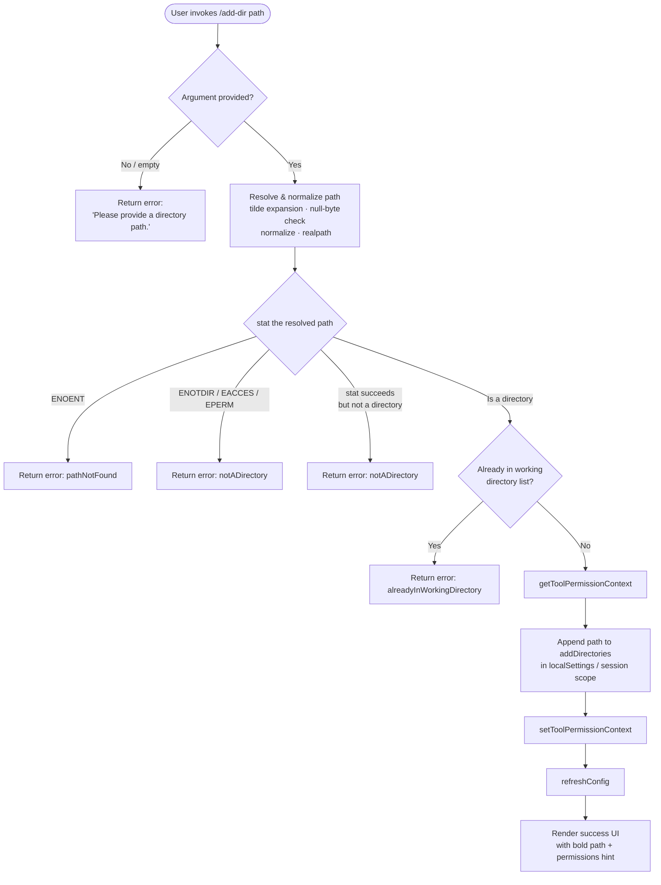

# `/add-dir`

> Analysis basis: CC v2.1.143 bundle.js (AST extraction + Claude interpretation)
> Minimum version: v2.1.143

---

## Overview

The `/add-dir` command adds a new working directory to the active Claude Code session, expanding the set of filesystem paths the agent is permitted to access. It resolves and validates the supplied path (handling `~` expansion, symlinks, and stat checks), then writes the new directory into the session's permission context and refreshes the configuration. If the path argument is absent or invalid, the command reports a descriptive error and makes no state change.

---

## Registration

| Field | Value |
|---|---|
| type | `local-jsx` |
| name | `add-dir` |
| description | `Add a new working directory` |
| argumentHint | `<path>` |
| module_id | `vQ9` |

Analysis basis: CC v2.1.143 bundle.js:+4439929

---

## Input Branching

The command entry point (`commandHandler`) branches on path validity before any mutation occurs.



Analysis basis: CC v2.1.143 bundle.js:+4438698, +4438831, +3722767, +3722865, +3723010, +3723121, +3723197, +3723282, +4439420

---

## Behavioral Spec

### Path Resolution

```
function resolvePath(rawInput):
    trimmed = rawInput.trim()
    if trimmed contains null bytes:
        raise TypeError("Path contains null bytes")

    normalized = path.normalize(trimmed)

    if normalized starts with "~/":
        normalized = os.homedir() + normalized.slice(1)

    if platform is "windows":
        # apply Windows-specific drive-letter normalization
        normalized = applyWindowsNormalization(normalized)

    if not path.isAbsolute(normalized):
        normalized = path.resolve(normalized)

    return normalized
```

Analysis basis: CC v2.1.143 bundle.js:+996499, +996533, +996555, +996606, +996640, +996653, +996688, +996735, +996795, +996859

---

### Directory Validation

```
function validateDirectory(resolvedPath):
    try:
        statResult = fs.stat(resolvedPath)        # async
    catch error:
        code = error.code
        if code == "ENOENT":
            return { result: "pathNotFound" }
        if code in ["ENOTDIR", "EACCES", "EPERM"]:
            return { result: "notADirectory" }
        return { result: "error", message: error.message or "Unknown error" }

    if not statResult.isDirectory():
        return { result: "notADirectory" }

    return { result: "ok", resolvedPath: resolvedPath }
```

Analysis basis: CC v2.1.143 bundle.js:+3722820, +3722865, +3722955, +3722970, +3722984, +3723010, +4439177

---

### Duplicate-Directory Guard

```
function checkAlreadyAdded(resolvedPath, currentWorkingDirs):
    # currentWorkingDirs is the list already held in the session
    if currentWorkingDirs.includes(resolvedPath):
        return true
    return false
```

If the guard returns `true`, the command exits with the `"alreadyInWorkingDirectory"` error token and displays no success UI.

Analysis basis: CC v2.1.143 bundle.js:+3723121, +4438887

---

### Permission-Context Mutation

```
function addDirectoryToSession(resolvedPath, appState):
    ctx = appState.getToolPermissionContext()        # read current context

    # Append to the addDirectories list under the session-scoped localSettings
    ctx.localSettings.session.addDirectories.push(resolvedPath)

    appState.setToolPermissionContext(ctx)          # persist back
    appState.refreshConfig()                        # reload derived config
```

The string keys `"addDirectories"`, `"localSettings"`, and `"session"` are literal field names used when updating the permission context.

Analysis basis: CC v2.1.143 bundle.js:+4438698, +4438831, +4438757, +4438804, +4438820, +4438915

---

### CLI Flag Alias

The flag `--add-dir` is registered as a programmatic alias for this command, allowing the directory to be supplied at process launch without entering the interactive REPL.

Analysis basis: CC v2.1.143 bundle.js:+4438945

---

### Success UI Rendering

```
function renderSuccess(resolvedPath):
    line1 = bold(resolvedPath)
    line2 = dim("· /permissions to manage")
    return JSX layout combining line1 and line2
```

On failure the command renders the string `"Did not add a working directory."` followed by the specific error token.

Analysis basis: CC v2.1.143 bundle.js:+4438992, +4439278, +4439285, +4439420, +4439515

---

### macOS `/var` → `/tmp` Symlink Normalization

During path resolution on macOS, the implementation replaces the prefix `/var/` with `/tmp` (via the literal substitution pattern `/tmp$1`) to account for the macOS symlink where `/var` → `/private/var` and `/tmp` → `/private/tmp`, ensuring that realpath-resolved and user-supplied paths compare equal.

Analysis basis: CC v2.1.143 bundle.js:+12181735, +12181776

---

### Bypass-Permissions Guard

If the session was not started in `bypassPermissions` mode (or that mode is explicitly disabled), any attempt to set the permission mode to `bypassPermissions` is silently rejected with an internal log message. This guard is evaluated inside the permission-context setter and does not surface to the user.

Analysis basis: CC v2.1.143 bundle.js:+4033586, +4033652

---

## State & Side Effects

| Item | Detail |
|---|---|
| Telemetry | `tengu_daemon_config_reload` (emitted after config refresh, bundle.js:+14517117) |
| Permission context write | `setToolPermissionContext` called with updated `addDirectories` list (bundle.js:+4438831) |
| Config refresh | `c_.refreshConfig()` called after mutation (bundle.js:+4438915) |
| appState changes | `addDirectories` array under `localSettings.session` gains one entry |
| Hook registration | `at_.register` called during session write-log initialization (bundle.js:+56977) |
| Sound | <!-- TODO: not found in depth-2 traversal; needs --depth 4 --> |
| Filesystem side effects | None directly; path resolution uses read-only `stat` / `realpath` calls only |

---

## Version History

| Version | Change |
|---|---|
| v2.1.143 | Initial analysis |

---

## Common Mistakes

1. **Passing a relative path without context** — The command resolves relative paths against the process working directory, not the current Claude Code project root. Always supply an absolute path or a `~/`-prefixed home-relative path for predictable behavior.
2. **Supplying a file path instead of a directory** — The command performs a `stat` check and rejects anything that is not a directory (`notADirectory`), including regular files and special devices. The error message is intentionally distinct from a missing-path error.
3. **Adding a directory already in scope** — If the resolved path is already present in the session's working-directory list, the command returns `alreadyInWorkingDirectory` and performs no mutation. This is not an error in the traditional sense but can confuse scripts that test for success by absence of output.
4. **Expecting persistence across sessions** — Directories added via `/add-dir` are stored under the `session` scope of `localSettings`. They do not persist to project-level or user-level configuration files unless an explicit `/permissions` workflow is used afterward.
5. **Forgetting the `--add-dir` CLI flag** — When scripting Claude Code non-interactively, use the `--add-dir <path>` flag at startup rather than attempting to inject the slash command via stdin; the flag goes through the same validation pipeline.

---

## Appendix — Identifier Mapping

> For bundle debugging only. Identifiers change across versions.

| Identifier | Role |
|---|---|
| `UeL` | Command handler (main entry point for `/add-dir`) |
| `Ff` | Permission-context update function (applies rule/directory mutations) |
| `v` | Session write-log wrapper |
| `G5K` | Log-entry formatter |
| `tt_` | Log transport dispatcher |
| `hH` | JSON serializer utility |
| `P7` | Path sanitizer / redactor (replaces sensitive segments with `[REDACTED]`) |
| `h6A` | Path-segment mapper |
| `cSH` | Stream write helper |
| `X6A` | Low-level stream write executor |
| `Z5K` | Append-file pipeline orchestrator |
| `PSH` | Batched write scheduler |
| `i8H` | File-path join helper for log files |
| `gv8` | Log metadata builder |
| `U6A` | Log file path resolver |
| `p6A` | Atomic file-rename helper (`.txt` suffix, 4-byte slice logic) |
| `E5K` | Directory-create + append-file handler |
| `h9` | Hook/signal registrar |
| `Yf` | Shell-escape helper (backslash, parenthesis escaping) |
| `khK` | String `replaceAll` wrapper for shell escaping |
| `K` | Rule-set filter utility |
| `L` | Watcher / file-handle lifecycle manager |
| `f` | File-handle close coordinator |
| `gv` | Getter for current working-directory list |
| `Y` | Supervisor / watcher process controller |
| `XJH` | Config-file reader and merger |
| `d1` | AsyncLocalStorage store accessor |
| `L8` | Error-code extractor |
| `eF_` | Config field transformer |
| `XH` | String coercion utility |
| `cIq` | Key-width calculator for display formatting |
| `T` | Input event stop-propagation handler |
| `m` | Event / keypress object |
| `c2` | Remote-control startup handler |
| `p_` | Full config loader (policy + flag + user + project settings) |
| `Z` | Watcher lifecycle object (stop / updateConfig / start) |
| `G_K` | Heartbeat scheduler |
| `Zs` | Heartbeat emitter |
| `V` | Secondary watcher / process object |
| `d` | Watcher teardown finalizer |
| `DH6` | Display formatter for added-directory confirmation |
| `Pf_` | Config-file append writer (mkdir + appendFile with NFC normalization) |
| `EJH` | Environment detector (production / test) |
| `xH` | String normalizer |
| `_yq` | Config schema validator |
| `sh` | Config sanitizer |
| `$8` | Error-code extractor (duplicate role, different call site) |
| `CU` | `GV`-based utility wrapper |
| `GV` | Generic value getter |
| `__` | Shared utility / guard function |
| `NH` | History log appender with LRU eviction |
| `v_` | Error / String dual-type handler |
| `zq` | History-entry normalizer |
| `A$A` | String normalizer for history entries |
| `kNK` | LRU shift/push manager for history buffer |
| `up9` | Background-task launcher for config persistence |
| `o2` | Cache-entry deleter |
| `s1` | Config-state loader (reads file, parses JSON, manages cache) |
| `R6` | JSON parse wrapper |
| `Bf` | Atomic config-file writer |
| `eO` | Atomic write using random bytes + rename (hex temp file) |
| `ft` | Tool-context renderer (builds JSX display for permission context) |
| `v7_` | Context-header builder |
| `Qp9` | Rule-list renderer |
| `gf6` | Individual rule renderer |
| `I8` | Working-directory entry renderer |
| `oiL` | Path display normalizer (lstat + realpathSync) |
| `wO` | Path abbreviation helper |
| `uM` | Filesystem special-file detector (FIFO / socket / char / block device) |
| `AP` | Tilde-collapse formatter |
| `tiL` | Rule section title renderer |
| `DO` | Rule pattern formatter (substring + replaceAll escaping) |
| `ShK` | Rule pattern prefix builder |
| `EE` | `Object.hasOwn` wrapper |
| `hhK` | Rule suffix builder |
| `yhK` | Pattern `replaceAll` escape helper |
| `M` | MCP server manager (has / get / values) |
| `SvH` | MCP server connection orchestrator |
| `THK` | MCP server update/cleanup handler |
| `$` | MCP client set accessor |
| `B95` | MCP client reconciler (filter + reconnect logic) |
| `ZUH` | Path-validation entry point (stat + error-token mapper) |
| `H9` | Path-normalization engine (tilde, null-byte, absolute resolution) |
| `S6` | AsyncLocalStorage context reader |
| `Uh6` | Store getter with fallback |
| `al` | Guard / assertion utility |
| `fS` | macOS `/var`→`/tmp` symlink normalizer |
| `vW` | String `toLowerCase` wrapper |
| `yQ_` | Windows-path detector |
| `io` | Final path-canonicalization step |
| `VUH` | Success-UI renderer (bold path + dirname hint) |