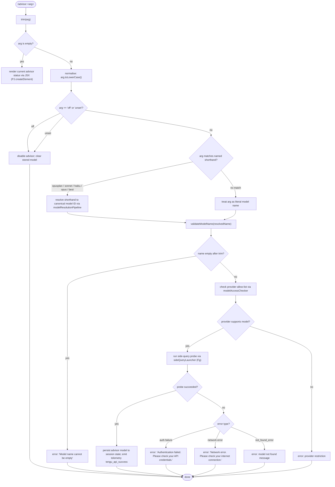

# `/advisor`

> Analysis basis: CC v2.1.143 bundle.js (AST extraction + Claude interpretation)
> Minimum version: v2.1.143

---

## Overview

The `/advisor` command configures the Advisor Tool, a feature that consults a stronger model for guidance at key decision points during a task. The command accepts a model name (or a named shorthand) as its argument, validates that the named model is reachable via the current API provider, and writes the result into session state. When invoked without a valid argument it can also disable or reset the advisor configuration entirely.

---

## Registration

| Field | Value |
|---|---|
| type | `local-jsx` |
| name | `advisor` |
| description | `Configure the Advisor Tool to consult a stronger model for guidance at key moments during a task` |
| argumentHint | *(none)* |
| module_id | `PTq` |

Analysis basis: CC v2.1.143 bundle.js:+11630977

---

## Input Branching

The top-level command handler (`commandEntryPoint`, identifier `vy7`) trims the raw argument string, then dispatches through several sub-routines based on the normalised value.



Analysis basis: CC v2.1.143 bundle.js:+11630435, +11630511, +11630522, +11622935

---

## Behavioral Spec

### 1. Argument Normalisation

```
function normaliseArgument(rawArg):
    trimmed = rawArg.trim()                  // call edge vy7 -> A.trim
    if trimmed is empty:
        return { action: "status" }
    lower = trimmed.toLowerCase()            // call edge A -> f.toLowerCase
    if lower in ["off", "unset"]:
        return { action: "disable", token: lower }
    return { action: "configure", token: trimmed }
```

Analysis basis: CC v2.1.143 bundle.js:+11630435, +14528099

---

### 2. Named Shorthand Resolution

The resolver (`modelShorthandResolver`, identifier `r1`) maps friendly shorthand tokens to canonical model identifiers. The mapping is evaluated after `toLowerCase()` is applied to the argument.

```
function modelShorthandResolver(lowerToken):
    replace any "[1m]" annotation from token          // literal +2162129
    switch lowerToken:
        case "opusplan":  return resolveOpusPlan()    // literal +2162103
        case "sonnet":    return resolveSonnet()      // literal +2162144
        case "haiku":     return resolveHaiku()       // literal +2162183
        case "opus":      return resolveOpus()        // literal +2162222
        case "best":      return resolveBest()        // literal +2162259
        default:          return lowerToken           // pass through as-is
```

The per-shorthand resolution calls (`resolveOpusPlan`, `resolveSonnet`, etc.) are implemented via the model ID registry (`oV`, `BM`, `zM`, `UU6`, `N7L`) which in turn reads from the provider-aware model list.

Analysis basis: CC v2.1.143 bundle.js:+2162082, +2162103, +2162121, +2162144, +2162183, +2162222, +2162259

---

### 3. Model Name Validation

The validator (`modelNameValidator`, identifier `hP8`) performs several checks before the probe is issued.

```
function modelNameValidator(modelName):
    trimmed = modelName.trim()                         // +11622898
    if trimmed is empty:
        return error("Model name cannot be empty")     // +11622935
    lower = trimmed.toLowerCase()                      // +11623058
    if lower is in disallowedModelSet (OAH):           // +11623077
        return error("model not permitted")
    if YTq cache already has this model name:          // +11623179
        return cached result (skip re-probe)
    // proceed to live probe (sideQueryLauncher)
    emit telemetry event "model_validation"            // literal +11623274
    issue minimal probe request with:
        content = "Hi"                                 // literal +11623343
        cache_type = "ephemeral"                       // literal +11623368
    on success:
        store result in YTq cache (YTq.set)            // +11623387
        return { valid: true, modelId: trimmed }
    on auth error (HTTP 401 / auth-type):
        return error("Authentication failed. Please check your API credentials.")  // +11623634
    on network error:
        return error("Network error. Please check your internet connection.")      // +11623736
    on not_found_error (error.type == "not_found_error"):                         // +11623855
        return error("model: " + trimmed + " not found")                          // literal +11623937
```

Analysis basis: CC v2.1.143 bundle.js:+11622898, +11622935, +11623058, +11623077, +11623179, +11623274

---

### 4. Provider Allow-list Check

Before issuing any live probe, the implementation checks the resolved model against the active API provider via `modelAccessChecker` (identifier `BB`). Known provider tokens are:

| Token | Value | loc_byte |
|---|---|---|
| `bedrock` | Amazon Bedrock | +2020544 |
| `foundry` | Azure AI Foundry | +2020594 |
| `anthropicAws` | Anthropic-hosted AWS | +2020650 |
| `mantle` | Mantle | +2020704 |
| `vertex` | Google Vertex AI | +2020752 |
| `firstParty` | Anthropic first-party API | +2020761 |
| `gateway` | API gateway | +2021233 |

The check uses `K.startsWith("anthropic.")` (literal `"anthropic."` at +2156262) and `q.includes` (+2156277) to filter models that are valid under the current provider. If the model string does not pass the provider check, configuration is rejected before a network round-trip is attempted.

Analysis basis: CC v2.1.143 bundle.js:+2156249, +2156262, +2156277, +2156306

---

### 5. Side-Query Probe (Live Model Validation)

The live probe (`sideQueryLauncher`, identifier `Fg`) issues a minimal API request to confirm the model is reachable.

```
function sideQueryLauncher(modelId, providerConfig):
    mark request kind as "side_query"                   // literal +12392808
    build minimal message: role="user", content=[{type:"text",text:"Hi"}]
                                                        // literals +12392380, +12392478
    issue fetch to Anthropic API (globalThis.fetch)     // +12392861
    apply SHA-256 deduplication hash ($d_)              // +12392969
    enforce max tokens = 1024                           // literal +12392624
    set cache_control.type = "ephemeral"                // literal +11623368
    on HTTP success:
        emit telemetry "tengu_api_success"              // +12394232
        return { ok: true }
    on failure:
        return { ok: false, errorDetail: ... }
```

The probe re-uses the standard API client (`xu`) with the existing OAuth/Bearer token, session headers (`X-Claude-Code-Session-Id`, `x-app`, `User-Agent`, etc.), and AbortSignal timeout of 10 000 ms.

Analysis basis: CC v2.1.143 bundle.js:+12392776, +12392808, +12392861, +12394232, +2206687, +2885099

---

### 6. Disable / Unset Path

When the argument resolves to `"off"` or `"unset"`, the command bypasses all validation and directly closes any open advisor-model handles:

```
function disableAdvisor():
    call f.close()     // close primary handle  +14513628
    call q.close()     // close secondary handle +14513638
    if temp file exists:
        call n8K.unlinkSync(tempFilePath)        // +14482768
    clear advisor model entry from appState
    return status message
```

Analysis basis: CC v2.1.143 bundle.js:+11630511, +11630522, +14513628, +14513638, +14482768

---

### 7. JSX Status Render (No-Argument Path)

When invoked with no argument (or only whitespace), `commandEntryPoint` (`vy7`) calls `PJ.createElement` (+11630471) to build and return a React element that displays the current advisor configuration (model name, enabled/disabled state) inline in the REPL output. No network call is made.

Analysis basis: CC v2.1.143 bundle.js:+11630471, +11630629

---

### 8. Model Name String Transformations

Several string-normalisation helpers operate on the raw input before or after shorthand resolution:

```
function modelNameStringPipeline(raw):
    lower   = raw.replace(pattern, "")          // strip provider prefix  +2162046
    checked = zAH(lower)                         // OAH allow-list check   +2155411
    if needsPrefix(lower):                       // "_$L" path
        if lower.startsWith("claude-"):          // literal +2155883
            pass through unchanged
        else:
            prepend "claude-" prefix
    // YF6 path: check q$L list inclusion        +2162545
    // SxH path: final String() coercion         +2162583
    return result
```

Analysis basis: CC v2.1.143 bundle.js:+2162046, +2155411, +2155883, +2162545, +2162583

---

## State & Side Effects

| Item | Detail |
|---|---|
| Telemetry — `tengu_api_success` | Emitted on successful live model probe (bundle.js:+12394232) |
| Telemetry — `tengu_bg_dispatch_sigkill_escalate` | Emitted if background daemon requires SIGKILL during probe teardown (bundle.js:+14503217) |
| Telemetry — `tengu_bg_dispatch_low_mem` | Emitted if low-memory condition detected in background dispatcher (bundle.js:+14503796) |
| Telemetry — `tengu_bg_spare_enable` | Emitted when a spare background session is enabled (bundle.js:+14504411) |
| Telemetry — `tengu_bg_spare_claim` | Emitted when a spare session is successfully claimed (bundle.js:+14504532) |
| Telemetry — `tengu_bg_spare_claim_fail` | Emitted when spare-session claim fails (bundle.js:+14504795) |
| Telemetry — `tengu_bg_proto_mismatch` | Emitted on background-protocol version mismatch (bundle.js:+14492438) |
| Telemetry — `tengu_bg_dispatch_stale_drop` | Emitted when a stale dispatch is dropped (bundle.js:+14493677) |
| Telemetry — `tengu_bg_attach_legacy_autorespawn` | Emitted on legacy session auto-respawn during attach (bundle.js:+14495561) |
| Telemetry — `tengu_bg_attach` | Emitted at attach start (bundle.js:+14495971) |
| Telemetry — `tengu_bg_attach_stall_gave_up` | Emitted when attach stall recovery gives up (bundle.js:+14496853) |
| Telemetry — `tengu_bg_attach_stall_respawn` | Emitted when attach stall triggers a respawn (bundle.js:+14497122) |
| Telemetry — `tengu_bg_attach_kick` | Emitted when an existing session is kicked to allow re-attach (bundle.js:+14498039) |
| Telemetry — `tengu_prompt_cache_1h_config` | Emitted when 1-hour prompt cache config path is taken (bundle.js:+12353959) |
| Telemetry — `tengu_feature_bad` | Emitted on feature flag check failure (bundle.js:+955126) |
| Telemetry — `tengu_feature_ok` | Emitted on feature flag check success (bundle.js:+955068) |
| Model probe result cache | Stored in `YTq` (a Map-like structure); keyed by model name; set via `YTq.set` (+11623387), read via `YTq.has` (+11623179). Prevents redundant network probes within a session. |
| Temp file cleanup | `n8K.unlinkSync` called on the disable path to remove any advisor-related temp file (+14482768). |
| appState changes | Advisor model identifier written to session/app state on success; cleared on disable. |
| Sound | <!-- TODO: not found in depth-2 traversal; needs --depth 4 --> |
| Hook registration | <!-- TODO: not found in depth-2 traversal; needs --depth 4 --> |

---

## Version History

| Version | Change |
|---|---|
| v2.1.143 | Initial analysis |

---

## Common Mistakes

1. **Passing a bare shorthand without checking provider support.** Shorthands like `best` or `opus` resolve to canonical model IDs only after the provider allow-list is applied; if the active provider does not support the resolved model the command will reject it even though the shorthand appears valid.
2. **Expecting instant re-validation after a network error.** The probe result cache (`YTq`) is keyed by model name. A model that returned a success result earlier in the session will not be re-probed even if credentials have changed; use `/advisor off` then re-configure to force a fresh probe.
3. **Using `unset` and `off` interchangeably with a model name.** Both `off` and `unset` are reserved tokens (literals at +11630511 and +11630522). A model whose name happens to be `"off"` cannot be set via this command.
4. **Omitting the `claude-` prefix when the provider requires it.** The string-normalisation pipeline will prepend `"claude-"` automatically only when the input does not already start with that prefix. Passing a fully-qualified model ID that already contains the prefix will not be double-prefixed, but passing an ambiguous short name may produce an unexpected canonical string.
5. **Assuming the command is free of network latency.** The validation path issues a real `fetch` call with a 10 000 ms abort timeout. In offline or rate-limited environments the command will block for up to 10 seconds before reporting an error.

---

## Appendix — Identifier Mapping

> For bundle debugging only. Identifiers change across versions.

| Identifier | Role |
|---|---|
| `vy7` | Command entry point (top-level handler for `/advisor`) |
| `hP8` | Model name validator (trims, checks allow-list, runs probe, caches result) |
| `r1` | Model shorthand resolver (maps friendly names to canonical model IDs) |
| `BB` | Provider allow-list / model access checker |
| `Fg` | Side-query launcher (issues minimal live probe to API) |
| `xu` | Core API client (builds request, attaches session headers, handles auth) |
| `mF6` | Credential / WIF token resolver used within the API client |
| `QxH` | Provider-type dispatcher inside the API client |
| `pWH` | Provider-specific request builder |
| `G1` | Provider inclusion check helper |
| `Fy` | Provider delegation helper |
| `oV` | Model resolution orchestrator (coordinates BM and zM) |
| `BM` | Model ID builder (constructs canonical ID from parts) |
| `zM` | Model registry lookup (finds model record by token) |
| `N7L` | Model record accessor (reads fields from a registry entry) |
| `UU6` | Model list searcher (finds matching entry in Sl8 list) |
| `pdA` | Model entry property extractor (Object.entries iteration) |
| `yxH` | Alternate model resolution path (delegates to zM) |
| `rV` | Fallback resolution path (uses BM and zM) |
| `UtA` | Resolution chain helper (wraps rV) |
| `YF6` | Model name inclusion checker against q$L list |
| `SxH` | Final string coercion step for model name |
| `zAH` | Allow-list membership checker (consults OAH array) |
| `H$L` | Combined includes + allow-list + shorthand check helper |
| `_$L` | Prefix-normalisation helper (ensures "claude-" prefix) |
| `mtA` | startsWith helper used within prefix normalisation |
| `kxH` | Secondary allow-list check against eML set |
| `ptA` | indexOf-based model position resolver |
| `BU6` | Canonical model string builder (R_ + Object.entries) |
| `R_` | Base model string builder |
| `nG` | Shorthand token pre-processor (delegates to wAH) |
| `wAH` | Token transformation step (delegates to xH) |
| `xH` | Low-level string constructor wrapper |
| `Jy7` | Named shorthand inner resolver (BM + toLowerCase + includes + zM) |
| `wy7` | Named shorthand outer resolver (wraps Jy7, calls String()) |
| `EO6` | Argument variant checker (toLowerCase + includes) used in entry point |
| `SvH` | MCP server connection manager (Object.entries, status tracking) |
| `THK` | MCP update applicator (applyMcpUpdate, cleanup, wv, HJ) |
| `B95` | MCP server batch processor (filter, getClients, SvH, THK) |
| `M` | MCP session state container (get, values, SvH, THK, L) |
| `v` | API response normaliser / version formatter |
| `$` | JZq-based helper in MCP pipeline |
| `K` | padEnd / map helper (column formatter) |
| `f` | File-handle / stream wrapper (close, finally) |
| `q` | Secondary handle / set (close, add, delete, unlinkSync) |
| `L` | Async operation tracker (q.add, f.finally, q.delete) |
| `A` | Generic argument / string carrier |
| `H` | Random-delay helper (Math.random, setTimeout) |
| `_` | Alternate string carrier |
| `CD` | AsyncLocalStorage store reader (FtA.getStore) |
| `oVL` | Request path parser (split, trim, indexOf, slice) |
| `T1` | Background context builder (cB) |
| `wl` | Error-reporting helper (bl6) |
| `V6` | Version/environment resolver (GV) |
| `YM` | Rate-limit response handler (R8_) |
| `HA` | Auth-header assembler (Uw, SR, xA) |
| `OO` | Generic state object |
| `iVL` | Diagnostic/metrics helper (DmH) |
| `E_` | Error classifier |
| `xu6` | Proxy-auth helper (dXH, NhA, WbH.trustAccepted, Date.now, baK) |
| `tVL` | Streaming response processor (randomUUID, content-type, cf-ray handling) |
| `hw` | Token / credential fetcher (pU6, I7L, DA, mU6) |
| `tO` | OAuth token refresher (xH, NR, uc, TC6, khA) |
| `rVL` | Retry / back-off handler (Pl6, ZV, TSH, FjH, K9) |
| `ofH` | Rate-limit / delay handler (OO, Date.now, Promise.resolve, UV8) |
| `pV8` | Timestamp helper (Date.now) |
| `p46` | Header normaliser (Object.entries, toLowerCase) |
| `UMH` | SDK error logger (console.error) |
| `Pl6` | Request dispatcher (XP, R1, G1, ZV) |
| `S` | Focus/blur session monitor (NF, Date.now, Math.min, jlq) |
| `V` | Generic value carrier |
| `Z` | Regex-match carrier |
| `W` | Debounced-emit helper (z.add/clear, clearTimeout, setTimeout, IBH, LY8) |
| `FjH` | Model prefix finder (ZLK.find, H.startsWith, YI6) |
| `YP` | Judgment/plan helper (j3) |
| `SN` | Streaming normaliser (nU6, TK, eAH, gc, fI, xH) |
| `QxH` | Provider-mode dispatcher for API requests |
| `G` | Token store accessor (f26, iT8) |
| `P` | IPC/stdio protocol handler (Buffer.concat, j.indexOf, w.off, Vf, cq5, XH) |
| `j` | Message-framing helper (w) |
| `w` | Worker/daemon process manager (spawn, kill, freemem, A.get/set) |
| `Vf` | Stream-end helper (H.end, hH) |
| `cq5` | Daemon protocol command dispatcher (reply, kill, resize, attach, snapshot, etc.) |
| `XH` | String-coercion wrapper |
| `pWH` | Provider header builder |
| `PB7` | Model entry finder (H.find, A.find) |
| `$d_` | SHA-256 deduplication hash builder (USq.createHash) |
| `oi6` | Cache-control header builder (Sq, DA, bl6, v) |
| `Sq` | String-coercion step in cache-control path |
| `bl6` | AsyncLocalStorage store reader (MD9.getStore) |
| `ri6` | Prompt-format helper (DA) |
| `iVH` | Prompt cache / memory-dir configurator (xH, DA, HA, JI8, G6) |
| `JI8` | Prompt cache flag applicator |
| `G6` | Telemetry feature-flag gate (m76, p76, Ts, sMH, Ci6, x76, PF, N6) |
| `jI8` | Model suffix checker |
| `RE` | Error-wrapper builder (W8_, xH) |
| `W8_` | Error payload assembler (DA) |
| `N` | Away-summary turn builder (v, Date.now, KM8, Te7, jlq, V, W18, mH, K1q, g, SH) |
| `KM8` | Global state reader (YnH.getState) |
| `Te7` | Away-summary config reader (Ni_) |
| `jlq` | Summary formatter |
| `W18` | Away-summary gate (oEH, v, H.addEventListener, A.abort, XZ, w8, q.find, kY1) |
| `mH` | Depth helper (d) |
| `K1q` | UUID generator wrapper (gZ.randomUUID) |
| `g` | Message history accessor (F, $) |
| `SH` | Model depth accessor (d) |
| `jhq` | Summary serialiser |
| `PP` | Content replace helper (H.replace) |
| `Vl6` | Temperature-controlled model selector (Ls, G1, A.includes) |
| `VX` | Content-block mapper (H.map) |
| `C3H` | Cache-context builder (A1, Array.isArray, v, hH, pu, L5, V6) |
| `hH` | JSON.stringify wrapper |
| `pu` | Random-bytes ID generator (N6, YZ9.randomBytes, a6, v) |
| `L5` | Session ID builder (Uw, N6) |
| `e4H` | Extra-header builder |
| `d` | Low-level string/byte primitive |
| `QTH` | Agent-ID router (G14, NH) |
| `G14` | Builtin-agent registry checker (gTH, V68.has) |
| `NH` | Error normaliser / logger (v_, xH, zq, kNK, xRH.push, Wc.logError) |
| `Tg` | Custom-agent prefix handler (W14, NH) |
| `W14` | Agent-prefix parser (H.startsWith, H.slice, Z68, O$_, G1H) |
| `reH` | Response-end cleaner |
| `wy7` | Named shorthand outer resolver |
| `Jy7` | Named shorthand inner resolver |
| `EO6` | Argument variant dispatcher |