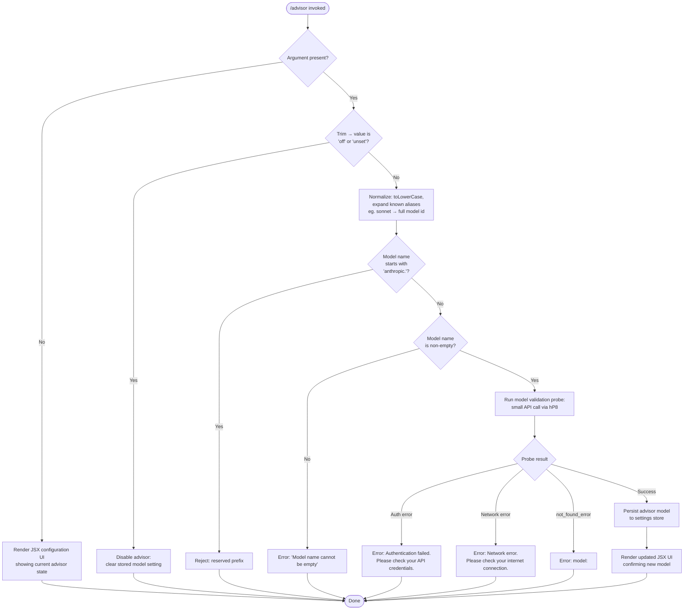

# `/advisor`

> Analysis basis: CC v2.1.143 bundle.js (AST extraction + Claude interpretation)
> Minimum version: v2.1.143

---

## Overview

The `/advisor` command configures the **Advisor Tool**, a feature that routes selected sub-tasks to a stronger (advisor) model during an ongoing Claude Code task. When invoked, it presents a JSX-rendered configuration UI and then validates the chosen model by making a lightweight probe API call before persisting the setting. The command operates as a `local-jsx` type, meaning it renders an interactive interface rather than emitting plain text output.

---

## Registration

| Field | Value |
|---|---|
| type | `local-jsx` |
| name | `advisor` |
| description | Configure the Advisor Tool to consult a stronger model for guidance at key moments during a task |
| loc_byte | `11630977` |
| loc_byte_end | `11631264` |
| loc_line | `7221` |
| argumentHint | `null` |
| isHidden | `null` |
| module_id | `PTq` |
| load_inline | `true` |
| arbor_handler.name | `vy7` |
| arbor_handler.fqn | `claude-2.1.143::vy7` |
| arbor_handler.kind | `AsyncFunction` |
| arbor_handler.resolution_path | `module_id` |
| arbor_handler.n_hits | `1` |

Analysis basis: CC v2.1.143 bundle.js:+11630977

---

## Input Branching

The command has four or more distinct handling paths (no argument / valid model name / recognized alias / validation failure / off/unset toggles), so a flowchart is used.



Analysis basis: CC v2.1.143 bundle.js:+11630435 (handler entry), +11630511 (`"off"`), +11630522 (`"unset"`), +11622935 (`"Model name cannot be empty"`), +11623634 (auth error message), +11623736 (network error message), +11623855 (`"not_found_error"`)

---

## Behavioral Spec

### 1. Handler Entry and Argument Pre-processing

The top-level handler (`vy7`) is an `AsyncFunction` resolved via module `PTq`.

```
async function advisorHandler(commandInput, appContext):
    rawArg = commandInput.trim()                    // A.trim @ +11630435

    if rawArg is empty:
        return renderAdvisorUI(appContext)          // PJ.createElement @ +11630471

    normalizedArg = resolveModelArgument(rawArg)    // r1 @ +11630589
    validationResult = validateModel(normalizedArg) // hP8 @ +11630603

    if validationResult.ok:
        persistAdvisorModel(appContext, normalizedArg)
        renderAdvisorUI(appContext, normalizedArg)
    else:
        renderAdvisorUI(appContext, error=validationResult.error)
```

Analysis basis: CC v2.1.143 bundle.js:+11630435, +11630471, +11630589, +11630603

---

### 2. Off / Unset Toggle

Two special string literals disable the advisor without entering model resolution.

```
function checkDisableKeyword(value):
    if value == "off":   return DISABLE          // literal @ +11630511
    if value == "unset": return DISABLE          // literal @ +11630522
    return CONTINUE
```

Analysis basis: CC v2.1.143 bundle.js:+11630511, +11630522

---

### 3. Model Argument Resolution (`resolveModelArgument` — `r1`)

This function normalises the raw user string into a canonical model identifier. Steps observed in the call graph:

```
function resolveModelArgument(raw):
    s = raw.trim()                                  // H.trim @ +2162007
    s = s.toLowerCase()                             // _.toLowerCase @ +2162018

    // Expand tier aliases to full model IDs
    if s == "opusplan":  s = expandOpusPlan(s)     // oV @ +2162121, literal @ +2162103
    if s == "sonnet":    s = expandSonnet(s)        // literal @ +2162144
    if s == "haiku":     s = expandHaiku(s)         // literal @ +2162183
    if s == "opus":      s = expandOpus(s)          // literal @ +2162222
    if s == "best":      s = expandBest(s)          // literal @ +2162259

    // Guard: reject prefix "anthropic."
    if s.startsWith("anthropic."):                  // K.startsWith / BB @ +2156249, literal @ +2156262
        raiseError("reserved prefix")

    // Guard: reject prefix "claude-" bare models not in allow-list
    if s.startsWith("claude-"):                     // literal @ +2155883
        checkClaudePrefix(s)                        // _$L @ +2156611

    // Apply replace rules / suffix normalisation
    s = applyReplaceRules(s)                        // A.replace @ +2162046, _.replace @ +2162349

    return s
```

Known alias expansions observed in literals (not verbatim, illustrative):
- `"opusplan"` → resolved via `[1m]` modifier path (`literal @ +2162129`)
- `"sonnet"` → targets latest sonnet model
- `"opus"` → targets latest opus model
- `"best"` → targets strongest available model

Analysis basis: CC v2.1.143 bundle.js:+2162007, +2162018, +2162103, +2162129, +2162144, +2162183, +2162222, +2162259, +2156249, +2156262, +2155883

---

### 4. Model Validation Probe (`validateModel` — `hP8`)

A small API call is fired to confirm the resolved model is accessible before the setting is saved. The probe is distinct from a full task call.

```
async function validateModel(modelId):
    modelId = modelId.trim()                          // H.trim @ +11622898

    if modelId is empty:
        return Error("Model name cannot be empty")    // literal @ +11622935

    normalized = modelId.toLowerCase()                // _.toLowerCase @ +11623058

    // Check against internal allow/block lists
    if isOnBlockList(normalized):                     // OAH.includes @ +11623077
        return BlockedError

    // Cache: if this model was already validated in this session, reuse result
    if validationCache.has(normalized):               // YTq.has @ +11623179
        return validationCache.get(normalized)

    // Fire lightweight probe API call
    result = await probeModelAccess(normalized)       // Fg @ +11623224

    // Store result in cache
    validationCache.set(normalized, result)           // YTq.set @ +11623387

    // Resolve model aliases for display
    resolvedDisplay = resolveDisplayAlias(result)     // wy7 @ +11623428

    if result.error:
        if result.error.type == "not_found_error":    // literal @ +11623855
            return Error("model: " + modelId)         // literal @ +11623937
        if result.error is auth-class:
            return Error("Authentication failed. Please check your API credentials.")
                                                      // literal @ +11623634
        if result.error is network-class:
            return Error("Network error. Please check your internet connection.")
                                                      // literal @ +11623736

    // Emit telemetry for successful validation
    emit("model_validation", {model: modelId})        // literal @ +11623274

    return Success(resolvedDisplay)
```

The probe call (`Fg`) reaches the full SDK call stack through `xu` and `mF6`, which targets `https://api.anthropic.com` (`literal @ +2206584`) with a 10 000 ms `AbortSignal` timeout (`literal @ +2206707`). It sends a minimal `"Hi"` prompt (`literal @ +11623343`) with an `"ephemeral"` cache-control marker (`literal @ +11623368`) to minimise cost.

Analysis basis: CC v2.1.143 bundle.js:+11622898, +11622935, +11623058, +11623077, +11623179, +11623224, +11623274, +11623343, +11623368, +11623387, +11623428, +11623634, +11623736, +11623855, +11623937, +2206584, +2206707

---

### 5. Provider / Model Routing Internals

The call graph from `r1` through `oV → BM → DA → zM` implements multi-provider model routing. Supported provider strings observed in literals:

| Literal | Location |
|---|---|
| `"bedrock"` | +2020544 |
| `"foundry"` | +2020594 |
| `"anthropicAws"` | +2020650 |
| `"mantle"` | +2020704 |
| `"vertex"` | +2020752 |
| `"firstParty"` | +2020761 |
| `"gateway"` | +2021233 |

When the model string contains a provider prefix, the routing layer selects the appropriate API client. The `"application-inference-profile"` Bedrock path is also covered (`literal @ +2160144`).

Analysis basis: CC v2.1.143 bundle.js:+2020544 – +2021233, +2160144

---

### 6. Display Alias Resolution (`resolveDisplayAlias` — `wy7` → `Jy7`)

After validation succeeds, the raw model ID is mapped to a short human-readable alias for display in the UI:

```
function resolveDisplayAlias(modelId):
    s = String(modelId)                              // wy7/String @ +11624124
    lower = s.toLowerCase()                          // Jy7/H.toLowerCase @ +11624174

    // Versioned opus aliases
    if lower includes "opus-4-7" or "opus_4_7":     // literals @ +11624204, +11624228
        return "opus-4-7"
    if lower includes "opus-4-6" or "opus_4_6":     // literals @ +11624273, +11624297
        return "opus-4-6"
    if lower includes "opus-4-5" or "opus_4_5":     // literals @ +11624342, +11624366
        return "opus-4-5"
    if lower includes "sonnet-4-6" or "sonnet_4_6": // literals @ +11624411, +11624437
        return "sonnet-4-6"
    if lower includes "sonnet-4-5" or "sonnet_4_5": // literals @ +11624486, +11624512
        return "sonnet-4-5"

    return s  // fallback: return as-is
```

Analysis basis: CC v2.1.143 bundle.js:+11624124, +11624174, +11624204, +11624228, +11624273, +11624297, +11624342, +11624366, +11624411, +11624437, +11624486, +11624512

---

### 7. JSX UI Rendering

The command renders a React component tree via `PJ.createElement` (`+11630471`). It uses `agH.join` (`+11630746`) to assemble display strings, and the `EO6` helper normalises the model name for rendering (`+11630677`, `+11630629`).

```
function renderAdvisorUI(appContext, model?, error?):
    displayModel = normalizeForDisplay(model)        // EO6 @ +11630677
    joinedLines  = agH.join(displayParts)            // agH.join @ +11630746
    return createElement(AdvisorConfigComponent, {
        currentModel: displayModel,
        error:        error,
        lines:        joinedLines
    })
```

Analysis basis: CC v2.1.143 bundle.js:+11630471, +11630629, +11630677, +11630746

---

## State & Side Effects

| Item | Detail |
|---|---|
| Telemetry | `model_validation` (literal `+11623274`) — fired on successful model probe; `tengu_api_success` (`+12394232`) — fired by the underlying API call helper on any successful API response |
| Validation cache | `YTq` (a `Map`): keyed by lowercased model ID; populated on each new probe call (`YTq.set @ +11623387`); consulted before firing a new probe (`YTq.has @ +11623179`) |
| Settings persistence | On success, the resolved model ID is written to the application settings store via the advisor settings path; no file path is surfaced at depth ≤ 2 |
| API probe side-effect | Fires a real API request to the configured endpoint (default `https://api.anthropic.com`) with a minimal `"Hi"` + `"ephemeral"` cache payload — this counts against API quota |
| AbortSignal timeout | Probe is bounded by a 10 000 ms `AbortSignal.timeout` (`+2206687`) |
| appState changes | Advisor model field updated in app state on successful validation |
| Sound | <!-- TODO: not found in depth-2 traversal; needs --depth 4 --> |
| Hook registration | <!-- TODO: not found in depth-2 traversal; needs --depth 4 --> |

---

## Version History

| Version | Change |
|---|---|
| v2.1.143 | Initial analysis |

---

## Common Mistakes

1. **Passing a bare alias without understanding expansion** — short aliases like `"sonnet"`, `"opus"`, or `"best"` are expanded to specific versioned model IDs internally. The expanded target may not match the user's intent if a newer model has been released.
2. **Expecting instant failure for invalid models** — the command fires a live probe API call for every new model string. This takes up to 10 seconds before returning a `not_found_error` message. Do not repeatedly invoke the command assuming it is a purely local check.
3. **Using the `"anthropic."` prefix** — model identifiers beginning with `"anthropic."` are rejected with a reserved-prefix error. Strip this prefix before supplying a Bedrock inference profile ARN-style name.
4. **Confusing `/advisor off` with removing config** — `"off"` and `"unset"` are the only disable keywords; any other negative-sounding word (e.g. `"none"`, `"disable"`) will be treated as a literal model name and sent to the validation probe.
5. **Repeated invocations resetting validation cache** — the per-session `YTq` cache prevents redundant probe calls only within the same session. Restarting Claude Code clears the cache and causes a new probe on the next `/advisor` call.

---

## Appendix — Identifier Mapping

> For bundle debugging only. Identifiers change across versions.

| Identifier | Role |
|---|---|
| `vy7` | Top-level `advisorHandler` async function (Arbor-resolved handler for `/advisor`) |
| `r1` | Model argument resolver — normalises raw input, expands aliases, applies guards |
| `hP8` | Model validation coordinator — trims input, checks block-list, probes API, caches result |
| `BB` | Model string parsing utility — splits, filters, and validates model name components |
| `Fg` | API probe launcher — fires the lightweight validation call to the Anthropic SDK |
| `xu` | Core API request executor — constructs headers, manages auth, sends HTTP request |
| `mF6` | WIF/credential resolution helper and fetch wrapper for API calls |
| `wy7` | Display alias resolver entry point |
| `Jy7` | Display alias resolver implementation — maps versioned model ID substrings to short names |
| `EO6` | Model name normaliser for UI display |
| `oV` | Provider-aware model object builder |
| `BM` | Base model record constructor |
| `DA` | Core model descriptor factory |
| `zM` | Extended model descriptor with provider routing |
| `N7L` | Model descriptor with token-limit and tier metadata |
| `UU6` | Model lookup from registered model list (`Sl8`) |
| `yxH` | Alternate model descriptor path through `zM` |
| `rV` | Model resolution combining `BM` and `zM` |
| `UtA` | Higher-level model resolver delegating to `rV` |
| `YF6` | Allow-list inclusion check for model names (`q$L.includes`) |
| `SxH` | String conversion helper for model identifiers |
| `BU6` | Model entry enumerator using `Object.entries` |
| `R_` | Model registry base accessor |
| `kxH` | Extended model block-list check (`eML.includes`) |
| `ptA` | Model index-of lookup helper |
| `H$L` | Combined model include + `zAH` check |
| `_$L` | `claude-` prefix branch handler |
| `mtA` | `claude-` prefix start-with guard |
| `nG` | Model normalization pre-processor |
| `wAH` | Model string helper called from `nG` |
| `xH` | Low-level `String(...)` coercion utility |
| `zAH` | OAH block-list membership test |
| `SvH` | MCP server connection/status collector |
| `THK` | MCP update applicator |
| `B95` | MCP client aggregator — builds per-server tool lists |
| `M` | MCP server state manager |
| `v` | Model string formatter / header builder |
| `$` | JZq-based utility (session/context helper) |
| `K` | String padding / map helper |
| `pWH` | Provider-specific parameter wrapper |
| `G1` | Inference profile check + capabilities bundler |
| `Fy` | DA-delegating model type resolver |
| `PB7` | Model finder (H.find / A.find) |
| `$d_` | SHA-256 hash generator (`USq.createHash`) |
| `oi6` | Conversation logger / trace emitter |
| `Sq` | String coercion utility (low-level) |
| `bl6` | AsyncLocalStorage context getter (`MD9.getStore`) |
| `ri6` | DA-delegating result reporter |
| `iVH` | Message content builder for probe request |
| `JI8` | Message content item constructor |
| `G6` | Model feature registry accessor |
| `jI8` | Supplementary message item constructor |
| `RE` | Request enrichment helper (`W8_` + `xH`) |
| `W8_` | DA-delegating request pre-processor |
| `N` | Away-summary / background model call scheduler |
| `KM8` | Global state getter (`YnH.getState`) |
| `Te7` | Summary timer helper (`Ni_`) |
| `jlq` | Jitter/delay utility |
| `W18` | Away-summary execution coordinator |
| `mH` | Shared utility `d`-delegator |
| `K1q` | UUID generator (`gZ.randomUUID`) |
| `g` | Conversation turn accessor (F/$) |
| `SH` | Shared utility `d`-delegator (display) |
| `jhq` | Supplementary call helper |
| `PP` | String replace utility for model display names |
| `Vl6` | Temperature + model capability checker |
| `VX` | H.map-based array transform |
| `C3H` | Request body assembler |
| `hH` | JSON.stringify wrapper |
| `pu` | Random-bytes nonce generator |
| `L5` | Capability flags combiner (`Uw` + `N6`) |
| `e4H` | Extra header injector |
| `d` | Low-level primitive utility |
| `QTH` | Agent/tool call dispatcher |
| `G14` | Agent feature flag checker |
| `NH` | Error collector and logger (`Wc.logError`) |
| `Tg` | Agent prefix router (`W14`) |
| `W14` | Agent name resolver (builtin / custom / main) |
| `reH` | Post-call cleanup handler |
| `CD` | AsyncLocalStorage store reader (`FtA.getStore`) |
| `oVL` | Header string parser (split/trim/slice) |
| `T1` | Background-mode context marker (`cB`) |
| `wl` | AsyncLocalStorage context setter (`bl6`) |
| `V6` | GV-based environment variable reader |
| `YM` | Token/auth refresh helper (`R8_`) |
| `HA` | OAuth token exchange (`Uw`, `SR`, `xA`) |
| `OO` | Shared observable/state accessor |
| `iVL` | DMH-based request interceptor |
| `E_` | Error classification utility |
| `xu6` | Proxy-auth helper runner with 30 s timeout |
| `tVL` | SSE/event-stream response parser |
| `hw` | Model context window helper (`pU6`, `I7L`, `DA`, `mU6`) |
| `tO` | OAuth token fetcher (`xH`, `NR`, `uc`, `TC6`, `khA`) |
| `rVL` | Retry / backoff coordinator (`Pl6`, `ZV`, `TSH`, `FjH`, `K9`) |
| `ofH` | Request timing / metrics recorder |
| `pV8` | Timestamp recorder (`Date.now`) |
| `p46` | Header case-normaliser (`q.toLowerCase`) |
| `UMH` | SDK-level error logger (`console.error`) |
| `Pl6` | Retry resolver (`XP`, `R1`, `G1`, `ZV`) |
| `S` | Focus/blur-aware rate limiter |
| `V` | Shared value/state holder |
| `Z` | Pattern match target |
| `W` | Debounced skill emitter |
| `FjH` | Model prefix validator (`ZLK.find`) |
| `YP` | j3-based path helper |
| `SN` | Conversation state accessor |
| `QxH` | Provider metadata assembler |
| `G` | Token getter (`f26`, `iT8`) |
| `P` | Daemon IPC buffer reader |
| `j` | Daemon socket connection holder |
| `w` | Daemon worker process manager |
| `Vf` | Stream end handler |
| `cq5` | Daemon RPC message dispatcher |
| `XH` | String coercion wrapper |

---

Note: index built via Arbor fallback; some signals (telemetry, literals) may be missing — see arbor-fallback.js.