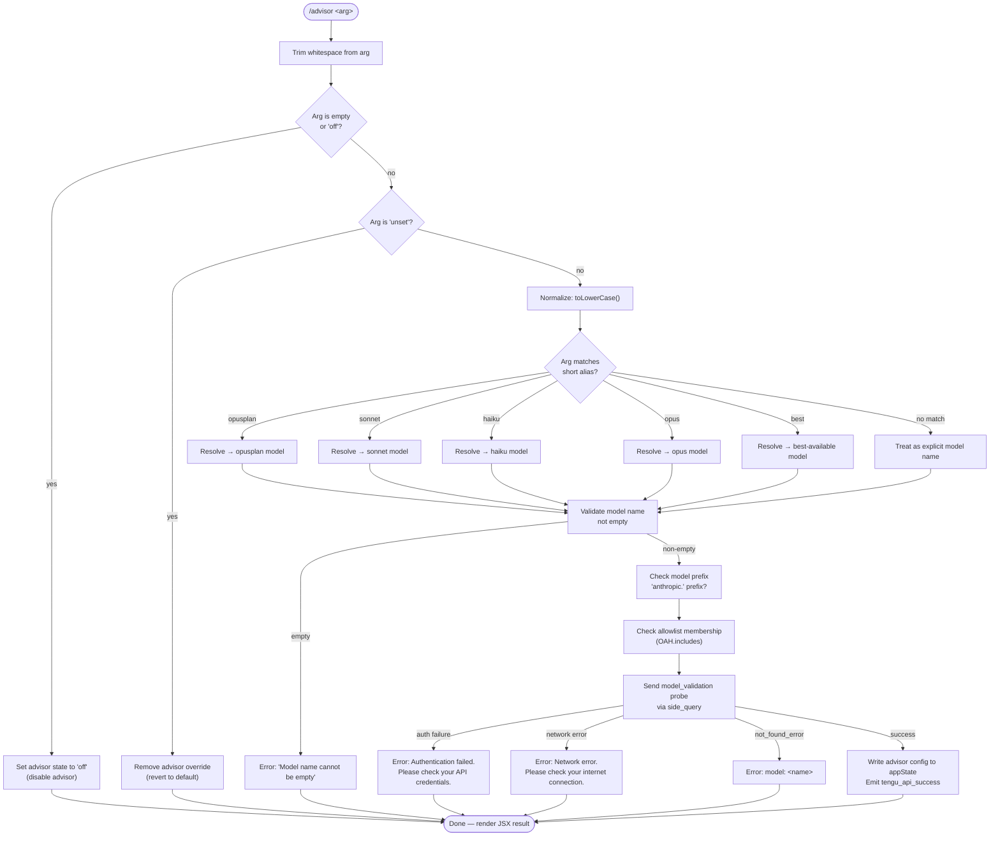

# `/advisor`

> Analysis basis: CC v2.1.143 bundle.js (AST extraction + Claude interpretation)
> Minimum version: v2.1.143

---

## Overview

The `/advisor` slash command configures the **Advisor Tool** — a subsystem that consults a stronger or specialized model for guidance at key decision points during a Claude Code task. When invoked, the command accepts an optional model alias or explicit model name, validates it against the Anthropic API, and writes the resulting configuration into application state. Passing no argument (or the special token `off`) disables advisor consultations entirely.

---

## Registration

| Field | Value |
|---|---|
| type | `local-jsx` |
| name | `advisor` |
| description | Configure the Advisor Tool to consult a stronger model for guidance at key moments during a task |
| argumentHint | *(none)* |
| module\_id | `PTq` |

Analysis basis: CC v2.1.143 bundle.js:+11630977

---

## Input Branching

The command entry point trims the raw argument string, lower-cases it, and routes through the following decision tree before any network call is made.



Analysis basis: CC v2.1.143 bundle.js:+11630435 (trim), +11630511 (`"off"` literal), +11630522 (`"unset"` literal), +14528099 (toLowerCase), +2162103–+2162259 (alias literals), +11622935 (empty-name error), +11623274 (`"model_validation"`), +11623634 (auth error), +11623736 (network error), +11623855 (`"not_found_error"`), +11623937 (`"model:"` prefix in error)

---

## Behavioral Spec

### 1. Command Entry Point and Argument Pre-processing

```
function advisorCommandHandler(rawArg):
    trimmed = rawArg.trim()                      // loc +11630435
    lower   = trimmed.toLowerCase()              // loc +14528099

    if lower == "" or lower == "off":            // loc +11630511
        return disableAdvisor()

    if lower == "unset":                         // loc +11630522
        return unsetAdvisorOverride()

    resolvedModelName = resolveAlias(lower)
    uiElement = createElement(resolvedModelName) // loc +11630471
    result    = validateAndApply(resolvedModelName)
    lines     = buildOutputLines(result)
    return lines.join(", ")                      // loc +11630746, +11630755
```

Analysis basis: CC v2.1.143 bundle.js:+11630435, +11630471, +11630746

---

### 2. Alias Resolution

Short, human-friendly tokens are mapped to canonical model identifiers before any validation occurs. The mapping is embedded as string literals in the implementation.

```
function resolveAlias(normalizedArg):
    // Alias table derived from string literals at loc +2162103 – +2162259
    aliasMap = {
        "opusplan": <opusplan-model-id>,   // loc +2162103
        "sonnet":   <sonnet-model-id>,     // loc +2162144
        "haiku":    <haiku-model-id>,      // loc +2162183
        "opus":     <opus-model-id>,       // loc +2162222
        "best":     <best-model-id>,       // loc +2162259
    }

    if normalizedArg in aliasMap:
        return aliasMap[normalizedArg]
    else:
        return normalizedArg   // treat raw input as explicit model name
```

Analysis basis: CC v2.1.143 bundle.js:+2162103, +2162129 (`"[1m]"` format marker), +2162144, +2162183, +2162222, +2162259

---

### 3. Model Name Validation (Client-side)

Before any network request is issued, the resolved name undergoes two client-side checks.

```
function clientSideValidate(modelName):
    if modelName.trim() == "":
        raise UserError("Model name cannot be empty")  // loc +11622935

    // Check whether name starts with "anthropic." prefix
    hasAnthropicPrefix = modelName.startsWith("anthropic.")  // loc +2156249, +2156262

    // Check membership in the known-model allowlist (OAH set)
    inAllowlist = allowlistIncludes(modelName)              // loc +11623077

    return { hasAnthropicPrefix, inAllowlist }
```

Analysis basis: CC v2.1.143 bundle.js:+11622935, +2156249, +2156262, +11623077

---

### 4. Model Validation Probe (Network Round-trip)

After passing client-side validation, the command dispatches a lightweight "side query" to the Anthropic API to confirm that the model is accessible under the active credentials. The probe uses a minimal ephemeral message.

```
function validateModelViaNetwork(modelName, credentials):
    probePayload = {
        type:    "model_validation",   // loc +11623274
        role:    "user",               // loc +11623309
        content: "Hi",                 // loc +11623343
        cache:   "ephemeral",          // loc +11623368
    }

    // Determine API provider from credentials:
    //   "firstParty"   → direct Anthropic endpoint  // loc +2021195
    //   "anthropicAws" → AWS Bedrock gateway         // loc +2021213
    //   "gateway"      → third-party gateway         // loc +2021233
    endpoint = resolveEndpoint(credentials)

    // The probe is submitted as a side_query (loc +12392808)
    // Max tokens for the probe response: 1024 (loc +12392624)
    response = globalThis.fetch(endpoint, probePayload)  // loc +12392861

    return parseProbeResponse(response)
```

Analysis basis: CC v2.1.143 bundle.js:+11623274, +11623309, +11623343, +11623368, +12392808, +12392624, +12392861, +2021195, +2021213, +2021233

---

### 5. Probe Response Parsing and Error Dispatch

```
function parseProbeResponse(response):
    if response indicates auth failure:
        raise UserError("Authentication failed. Please check your API credentials.")
        // loc +11623634

    if response indicates network failure:
        raise UserError("Network error. Please check your internet connection.")
        // loc +11623736

    errorBody = response.body
    if errorBody["type"] == "not_found_error":     // loc +11623855
        raise UserError("model: " + modelName)    // loc +11623937

    // Success path
    emitTelemetry("tengu_api_success")             // loc +12394232
    return { status: "enabled", model: modelName } // loc +12393592
```

Analysis basis: CC v2.1.143 bundle.js:+11623634, +11623736, +11623834, +11623855, +11623874, +11623937, +12394232, +12393592

---

### 6. Advisor State Write-back

On a successful probe, the configuration is committed to application state. Known status strings are `"enabled"` (loc +12393592) and `"disabled"` (loc +12393553). Disabling writes the `"off"` sentinel (loc +11630511).

```
function applyAdvisorConfig(status, modelName):
    if status == "enabled":
        appState.advisorModel  = modelName
        appState.advisorStatus = "enabled"     // loc +12393592
    else:
        appState.advisorModel  = null
        appState.advisorStatus = "disabled"    // loc +12393553
```

Analysis basis: CC v2.1.143 bundle.js:+12393553, +12393592

---

### 7. Model Alias Check for Opus-4 Variants

A secondary helper examines whether a normalized model name contains known opus-4 variant substrings to drive feature-gating logic.

```
function isOpus4Variant(normalizedModelName):
    knownVariants = ["opus-4-7", "opus-4-6"]    // loc +5222736, +5222760
    for variant in knownVariants:
        if normalizedModelName.includes(variant):
            return true
    return false
```

The related `"sonnet-4-6"` string (loc +5222784) is checked in the same helper and similarly gates certain behaviors.

Analysis basis: CC v2.1.143 bundle.js:+5222702, +5222725, +5222736, +5222760, +5222784

---

### 8. Jitter on Retry Paths

Within the network validation helper, retry timing uses both `Math.random()` and `setTimeout` to introduce randomised back-off, seeded with constants `2` and `1`.

```
function computeJitteredDelay(baseMs):
    // Constants found at loc +12638154 (value 2), +12638170 (value 1)
    jitter    = Math.random() * 2     // loc +12638154, +12638156
    delayMs   = baseMs + jitter
    setTimeout(callback, delayMs)     // loc +12638193
```

Analysis basis: CC v2.1.143 bundle.js:+12638154, +12638156, +12638170, +12638193

---

### 9. Close / Cleanup Path

When the dialog or transient UI surface associated with the command needs to be dismissed (e.g., on error or completion), two separate close handles are called in sequence.

```
function closeAdvisorUI(primaryHandle, secondaryHandle):
    // Both handles are closed at the same call-site
    primaryHandle.close()    // loc +14513628 (value 0 used as arg) loc +14513626
    secondaryHandle.close()  // loc +14513638
    runPostCloseCallback()   // loc +14513778
```

The numeric literal `0` at loc +14513626 is passed as the argument to `primaryHandle.close()`.
The numeric literal `40` at loc +14528173 is used as a delay or size cap in the lowercase-comparison path.

Analysis basis: CC v2.1.143 bundle.js:+14513626, +14513628, +14513638, +14513778, +14528173

---

## State & Side Effects

| Item | Detail |
|---|---|
| Telemetry | `tengu_api_success` — emitted on a successful model-validation probe (bundle.js:+12394232) |
| Network side effect | A `side_query` fetch is issued to the active Anthropic endpoint to validate the model (bundle.js:+12392808, +12392861) |
| appState changes | `advisorModel` and `advisorStatus` are written after a successful probe; cleared on `off`/`unset` |
| JSX rendering | Command produces a JSX element via `createElement` (bundle.js:+11630471); output lines are joined with `", "` separator (bundle.js:+11630755) |
| Cache hint | Probe message carries an `"ephemeral"` cache hint (bundle.js:+11623368) |
| Retry / jitter | Failed probes use randomised `setTimeout` back-off (bundle.js:+12638156, +12638193) |
| Sound | <!-- TODO: not found in depth-2 traversal; needs --depth 4 --> |
| Hook registration | <!-- TODO: not found in depth-2 traversal; needs --depth 4 --> |

---

## Version History

| Version | Change |
|---|---|
| v2.1.143 | Initial analysis. Alias table includes `opusplan`, `sonnet`, `haiku`, `opus`, `best`. Opus-4-7 and Opus-4-6 variant gating present. Build SHA `cfb8132e4c3551e2773f41a1900efd1cc93637db`, build timestamp `2026-05-15T17:39:39Z`. |

---

## Common Mistakes

1. **Passing an alias with mixed case** — the command lower-cases input before alias lookup, so `Opus` and `OPUS` both resolve correctly; however, an *explicit model name* (not a short alias) is also lower-cased before the network call, which may cause a `not_found_error` if the real model ID is case-sensitive on the backend.
2. **Expecting `/advisor` with no argument to toggle** — omitting the argument is treated identically to passing `off` and always disables the advisor; there is no toggle behaviour.
3. **Using `unset` and `off` interchangeably** — `off` writes a `"disabled"` sentinel explicitly, while `unset` removes the override entirely and reverts to the default advisor configuration. The downstream effect on task behaviour may differ.
4. **Providing an empty string after trimming** — if the argument consists only of whitespace, client-side validation raises `"Model name cannot be empty"` before any network call is made.
5. **Assuming instant effect** — the network validation probe introduces latency (and possible jitter on retry). The advisor is not active until the `tengu_api_success` telemetry event fires and state is written.
6. **Confusing `opusplan` with `opus`** — these are distinct aliases resolving to different model identifiers; `opusplan` is not simply a plan-mode wrapper around `opus`.

---

## Appendix — Identifier Mapping

> For bundle debugging only. Identifiers change across versions.

| Identifier | Role |
|---|---|
| `vy7` | Command entry-point / top-level handler for `/advisor` |
| `A` | General-purpose local variable (arg string, mapped array, etc.) — context-dependent across call sites |
| `f` | UI handle / dialog object; has `.close()` called on completion |
| `r1` | Alias-resolution and model-name normalization function |
| `H` | Secondary argument or probe-payload variable; `.trim()` called; also used in jitter retry helper |
| `_` | Normalized (lower-cased) model name variable in resolution path |
| `nG` | Intermediate model-resolution helper (calls `wAH`) |
| `zAH` | Allowlist membership checker (calls `OAH.includes`) |
| `oV` | Model config builder (calls `BM` and `zM`) |
| `yxH` | Alternate model config path (calls `zM`) |
| `rV` | Model record constructor (calls `BM` and `zM`) |
| `UtA` | Wrapper that delegates to `rV` for model record creation |
| `BM` | Core model-state write function (calls `DA`; uses provider literals `firstParty`, `anthropicAws`, `gateway`) |
| `YF6` | Model allowlist membership predicate (calls `q$L.includes`) |
| `SxH` | Post-validation side-effect dispatcher (calls `xH`) |
| `hP8` | Network validation orchestrator: trims name, checks allowlist, dispatches probe, handles errors |
| `BB` | Input parsing / structured-argument builder used inside `hP8` |
| `Fg` | Side-query fetch executor: builds payload, calls `globalThis.fetch`, parses response, emits telemetry |
| `wy7` | UI result formatter (calls `Jy7`, converts to `String`) |
| `EO6` | Opus-4 variant detection helper (toLowerCase + includes against `"opus-4-7"`, `"opus-4-6"`, `"sonnet-4-6"`) |