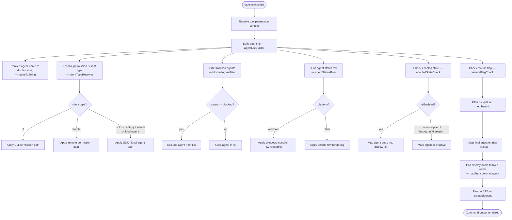

# `/agents`

> Analysis basis: CC v2.1.143 bundle.js (AST extraction + Claude interpretation)
> Minimum version: v2.1.143

---

## Overview

The `/agents` slash command provides an interactive interface for managing agent configurations within Claude Code. It resolves tool permission context, enumerates known agent entries (filtering and mapping them based on feature-flag and session-state conditions), and renders a JSX component that presents agent status and controls to the user.

---

## Registration

| Field | Value |
|---|---|
| type | `local-jsx` |
| name | `agents` |
| description | `Manage agent configurations` |
| module_id | `g0q` |
| loc_line | 7188 |

Analysis basis: CC v2.1.143 bundle.js:+11568815

---

## Input Branching

The command entry point (`commandHandler`) performs two top-level calls before delegating to the JSX renderer: it resolves tool-permission context and invokes the agent-list builder. The agent-list builder itself fans out into several parallel sub-routines whose results are combined before rendering.



Analysis basis: CC v2.1.143 bundle.js:+11568631 (permission context), +11568662 (agent list builder), +9074386–+9074869 (agent list builder internals), +11568675 (JSX render call)

---

## Behavioral Spec

### 1. Command Handler

```
function commandHandler(context):
    permissionContext = resolveToolPermissionContext(context)
    agentList        = agentListBuilder(permissionContext)
    return createElement(AgentManagerComponent, {
        permissionContext,
        agentList,
        ...context
    })
```

Analysis basis: CC v2.1.143 bundle.js:+11568631, +11568662, +11568675

---

### 2. Agent Name Conversion (`nameToString`)

```
function nameToString(rawName):
    return String(rawName)          // always coerces to primitive string
```

Analysis basis: CC v2.1.143 bundle.js:+26373

---

### 3. Client-Type / Permission Resolver (`clientTypeResolver`)

```
function clientTypeResolver(permissionContext):
    clientType = permissionContext.clientType   // one of: "cli", "remote",
                                                //   "sdk-ts", "sdk-py",
                                                //   "sdk-cli", "local-agent"
    emit telemetry event "tengu_slate_harbor"

    if clientType == "cli":
        return buildCliPermissions(permissionContext)

    if clientType == "remote":
        return buildRemotePermissions(permissionContext)

    if clientType in ["sdk-ts", "sdk-py", "sdk-cli", "local-agent"]:
        return buildSdkPermissions(permissionContext)

    // fallback — index 0 used as default/sentinel
    return defaultPermissions(index=0)
```

Known client-type string constants (Analysis basis: CC v2.1.143 bundle.js):

| Constant | loc_byte |
|---|---|
| `"cli"` | +3192692 |
| `"remote"` | +3192703 |
| `"sdk-ts"` | +3192949 |
| `"sdk-py"` | +3192963 |
| `"sdk-cli"` | +3192977 |
| `"local-agent"` | +3192992 |

Default/sentinel index: `0` (Analysis basis: CC v2.1.143 bundle.js:+3192642)

Telemetry event fired here: `tengu_slate_harbor` (Analysis basis: CC v2.1.143 bundle.js:+3192722)

---

### 4. Blocked-Agent Filter (`blockedAgentFilter`)

```
function blockedAgentFilter(agentCollection):
    return agentCollection.filter(agent ->
        agent.status != "blocked"
    )
```

Status sentinel string `"blocked"` (Analysis basis: CC v2.1.143 bundle.js:+9073799)

---

### 5. Platform-Aware Status Row Builder (`agentStatusRow`)

```
function agentStatusRow(agent, platform):
    if platform == "windows":
        return buildWindowsRow(agent)     // Windows-specific rendering path
    else:
        return buildDefaultRow(agent)
```

Platform string `"windows"` (Analysis basis: CC v2.1.143 bundle.js:+3194165)

---

### 6. Enabled-State Check (`enabledStateCheck`)

```
function enabledStateCheck(agent):
    if agent.isEnabled():
        return mapAgentToDisplayEntry(agent)
    else:
        // agent is in "stopped" state or belongs to a "background session"
        return markAgentInactive(agent, reason=agent.sessionType)
```

Status sentinels:

| Sentinel | Meaning | loc_byte |
|---|---|---|
| `"stopped"` | Agent process has halted | +14538107 |
| `"background session"` | Agent running in detached/background mode | +14538150 |

Analysis basis: CC v2.1.143 bundle.js:+14538107, +14538150, +9074782

---

### 7. Feature-Flag Gate (`featureFlagCheck`)

```
function featureFlagCheck(agentList):
    if Wq.isEnabled():
        return agentList          // full list passes through
    else:
        return []                 // feature disabled — suppress all agents
```

Analysis basis: CC v2.1.143 bundle.js:+9074652

---

### 8. Set-Membership Filter (`setMembershipFilter`)

```
function setMembershipFilter(agentList, allowSet):
    // allowSet is the YpH set; only agents whose key appears in the set are kept
    return agentList.filter(agent -> allowSet.has(agent.key))
```

Analysis basis: CC v2.1.143 bundle.js:+9074743

---

### 9. Display-Name Formatter (`displayNameFormatter`)

```
COLUMN_WIDTH = 40        // fixed pad target

function displayNameFormatter(agentList):
    return agentList.map(agent ->
        name = agent.name.toLowerCase()       // normalize casing
        paddedName = name.padEnd(COLUMN_WIDTH, " ")   // pad to 40 chars with spaces
        return { ...agent, displayName: paddedName }
    )
```

Column width constant: `40` (Analysis basis: CC v2.1.143 bundle.js:+14528173)
Padding fill character: `"  "` two-space literal used as separator (Analysis basis: CC v2.1.143 bundle.js:+14526202)
Lowercase normalization (Analysis basis: CC v2.1.143 bundle.js:+14528099)
Name pad operation (Analysis basis: CC v2.1.143 bundle.js:+14526181)

---

### 10. Boolean Coercion for String Flags (`booleanStringCoercion`)

```
function booleanStringCoercion(value):
    // Treats the string literals "yes" and "on" as truthy boolean values
    // Used when parsing agent config fields that may be string-encoded booleans
    if value == "yes" or value == "on":
        return true
    if value == 1:
        return true
    return false
```

String truthy literals: `"yes"` (Analysis basis: CC v2.1.143 bundle.js:+26422), `"on"` (Analysis basis: CC v2.1.143 bundle.js:+26428)
Numeric truthy literal: `1` (Analysis basis: CC v2.1.143 bundle.js:+26332)

---

### 11. Subcommand / Argument Inclusion Check (`argumentInclusionCheck`)

```
function argumentInclusionCheck(inputArgs, knownSubcommandSet):
    // Delegates to JZq to resolve the canonical subcommand list,
    // then checks whether the user-supplied argument string is present
    subcommands = resolveKnownSubcommands(knownSubcommandSet)   // via JZq
    return subcommands.includes(inputArgs)
```

Analysis basis: CC v2.1.143 bundle.js:+9074869, +14515820

---

## State & Side Effects

| Item | Detail |
|---|---|
| Telemetry | `tengu_slate_harbor` — fired during client-type / permission resolution (bundle.js:+3192722) |
| Hook registration | <!-- TODO: not found in depth-2 traversal; needs --depth 4 --> |
| appState changes | <!-- TODO: not found in depth-2 traversal; needs --depth 4 --> |
| Sound | <!-- TODO: not found in depth-2 traversal; needs --depth 4 --> |
| Feature-flag dependency | `Wq.isEnabled()` gates the full agent list; when disabled the rendered list is empty (bundle.js:+9074652) |
| Set-membership gate | `YpH` set controls per-agent visibility; agents absent from the set are silently filtered (bundle.js:+9074743) |
| Platform branch | `"windows"` string triggers an alternate row-rendering path (bundle.js:+3194165) |

---

## Version History

| Version | Change |
|---|---|
| v2.1.143 | Initial analysis — command registered as `local-jsx`, module `g0q` |

---

## Common Mistakes

1. **Assuming all agents are always listed.** Two independent gates exist: the `Wq` feature flag (suppresses the entire list when disabled) and the `YpH` set-membership filter (suppresses individual agents). Both must pass for an agent to appear.
2. **Treating `"blocked"` status as a soft warning.** Agents with `status == "blocked"` are hard-filtered out before any display logic runs; they will never appear in the rendered output.
3. **Ignoring string-encoded booleans in agent configs.** Configuration fields may carry `"yes"` or `"on"` instead of `true`, and `1` instead of `true`. Code that compares directly to `true` will silently misread these fields.
4. **Overlooking the Windows rendering path.** On Windows hosts the status-row builder follows a separate code path. Assuming the default rendering applies universally will produce incorrect UI on Windows.
5. **Expecting case-sensitive name matching.** Agent names are lower-cased before display and comparison; submitting a mixed-case agent name for lookup will still match after normalization, but external comparisons against the raw name will fail.
6. **Hardcoding column width.** The display-name column is padded to exactly 40 characters. Any downstream parsing that relies on whitespace alignment must account for this fixed width.

---

## Appendix — Identifier Mapping

> For bundle debugging only. Identifiers change across versions.

| Identifier | Role |
|---|---|
| `$k7` | Command handler — top-level entry point for `/agents` |
| `_` | Namespace/module providing `getToolPermissionContext` |
| `pZ` | Agent list builder — orchestrates all sub-routines |
| `xH` | Name-to-string converter (delegates to `String()`) |
| `ZP` | Client-type / permission resolver; fires `tengu_slate_harbor` telemetry |
| `UHH` | Blocked-agent filter (uses `H.filter` + `pP6` predicate) |
| `_k_` | Agent status row builder (delegates to `Qu`, `piH`, `s_`) |
| `YK` | Platform-aware row renderer (branches on `"windows"` via `d6`, `T_H`) |
| `FHH` | Feature-flag–gated agent renderer (orchestrates `YK`, `nz`, `oY`, `xH`, `CiH`, `B87`, `q1`, `p87`, `U87`, `_k_`, `er1`, `tS`) |
| `A` | Agent-name normalizer set (uses `f.toLowerCase`; pad width 40) |
| `K` | Display-name column formatter (uses `L.map`, `f.padEnd`) |
| `XL` | Auxiliary agent-list utility <!-- TODO: not found in depth-2 traversal; needs --depth 4 --> |
| `O` | Enabled-state checker (uses `N8`; references `"stopped"` / `"background session"`) |
| `nz` | String-rendering helper (delegates to `xH`) |
| `$` | Argument inclusion checker (delegates to `JZq` for subcommand resolution) |