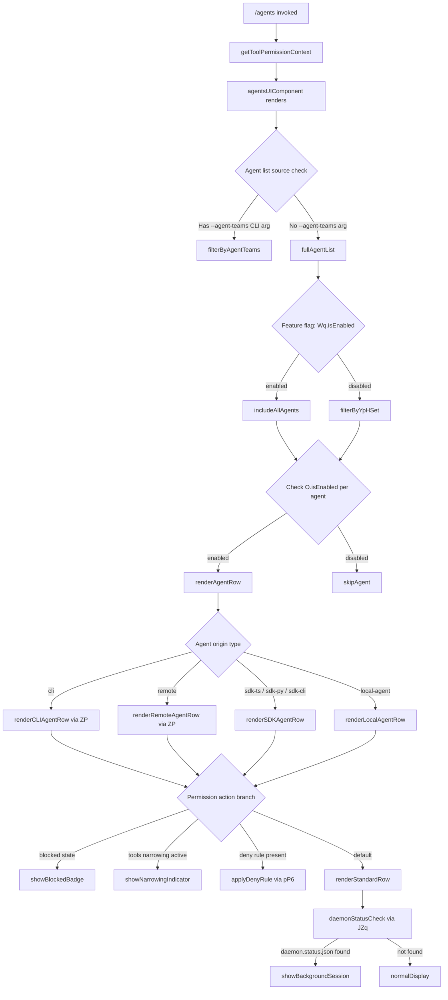

# `/agents`

> Analysis basis: CC v2.1.143 bundle.js (AST extraction + Claude interpretation)
> Minimum version: v2.1.143

---

## Overview

The `/agents` command provides a management interface for agent configurations within Claude Code. It resolves tool-permission context for the current session and renders a JSX-based UI component that displays, filters, and interacts with available agent entries. The command supports multiple agent-origin categories (`cli`, `remote`, `sdk-ts`, `sdk-py`, `sdk-cli`, `local-agent`) and exposes sub-operations for blocking, enabling, and narrowing agent tool permissions.

---

## Registration

| Field | Value |
|---|---|
| type | `local-jsx` |
| name | `agents` |
| description | `Manage agent configurations` |
| module_id | `g0q` |
| loc_line | 7188 |

Analysis basis: CC v2.1.143 bundle.js:+11568815

---

## Input Branching

The top-level command handler (`commandEntryPoint`) first retrieves the tool-permission context, then delegates rendering to the main agents UI component (`agentsUIComponent`). Inside `agentsUIComponent`, several conditional branches determine which sub-view or sub-action is active.



Analysis basis: CC v2.1.143 bundle.js:+11568631, +11568662, +9074386, +9074425, +9074457, +9074601, +9074629, +9074641, +9074652, +9074728, +9074743, +9074771, +9074782, +9074824, +9074869

---

## Behavioral Spec

### Entry Point: Command Handler

```
function commandEntryPoint(sessionContext):
    permCtx = getToolPermissionContext(sessionContext)
    element = createElement(agentsUIComponent, permCtx)
    return element
```

Analysis basis: CC v2.1.143 bundle.js:+11568631, +11568662, +11568675

---

### Sub-feature: Tool Permission Context Resolution

The permission context resolver (`getToolPermissionContext`) is called before any rendering occurs. It gathers the set of tools that are currently permitted, blocked, or narrowed for the session, providing this context downstream to all agent row renderers.

```
function getToolPermissionContext(sessionContext):
    ctx = _.getToolPermissionContext(sessionContext)
    return ctx
```

Analysis basis: CC v2.1.143 bundle.js:+11568631

---

### Sub-feature: Agent List Construction (`agentsUIComponent` / `pZ`)

The main UI component constructs the agent list according to the following logic:

```
function agentsUIComponent(permCtx):
    rawList = buildRawAgentList()

    // Feature-flag gating
    if Wq.isEnabled():
        candidateList = rawList
    else:
        candidateList = rawList.filter(a => YpHSet.has(a.id))

    // --agent-teams CLI argument filtering
    if hasAgentTeamsArg():
        candidateList = filterByAgentTeams(candidateList)

    // Per-agent enable check
    visibleList = candidateList.filter(a => O.isEnabled(a))

    // Render rows
    rows = visibleList.map(a => renderAgentRow(a, permCtx))
    return layoutRows(rows)
```

Analysis basis: CC v2.1.143 bundle.js:+9074601, +9074629, +9074641, +9074652, +9074728, +9074743, +9074771, +9074782

---

### Sub-feature: Agent Row Renderer (`renderAgentRow` / `ZP`)

Each agent entry is rendered with origin-type discrimination and permission-state decoration:

```
function renderAgentRow(agent, permCtx):
    originType = resolveOriginType(agent)   // "cli" | "remote" | "sdk-ts" | "sdk-py" | "sdk-cli" | "local-agent"
    permState  = resolvePermissionState(agent, permCtx)

    baseRow = buildBaseRow(agent, originType)   // calls stringCoerce, formatLabel

    if permState == "blocked":
        attachBadge(baseRow, "blocked")
    else if permState == "toolsNarrowing":
        attachNarrowingIndicator(baseRow)
    else if permState == "deny":
        attachDenyDecoration(baseRow)

    return baseRow
```

Origin-type constants observed:
- `"cli"` — Analysis basis: CC v2.1.143 bundle.js:+3192692
- `"remote"` — Analysis basis: CC v2.1.143 bundle.js:+3192703
- `"sdk-ts"` — Analysis basis: CC v2.1.143 bundle.js:+3192949
- `"sdk-py"` — Analysis basis: CC v2.1.143 bundle.js:+3192963
- `"sdk-cli"` — Analysis basis: CC v2.1.143 bundle.js:+3192977
- `"local-agent"` — Analysis basis: CC v2.1.143 bundle.js:+3192992

Permission state constants:
- `"blocked"` — Analysis basis: CC v2.1.143 bundle.js:+9073799
- `"deny"` — Analysis basis: CC v2.1.143 bundle.js:+9891032
- `"toolsNarrowing"` — Analysis basis: CC v2.1.143 bundle.js:+9891639
- `"cliArg"` — Analysis basis: CC v2.1.143 bundle.js:+9891618

---

### Sub-feature: Telemetry Event Emission (`G6` / `Qu` / `q1`)

Three telemetry events are emitted at distinct points in the agents workflow:

```
function emitAgentRegistrationTelemetry(agent):
    // Fired when an agent entry is registered/constructed (ZP context)
    emit("tengu_slate_harbor", {origin: agent.originType})

function emitAgentInteractionTelemetry(agent, permCtx):
    // Fired when an agent row interaction occurs (Qu context)
    emit("tengu_cobalt_ridge", {agentId: agent.id})

function emitAgentTeamsTelemetry(agent):
    // Fired when --agent-teams argument is processed (q1 context)
    emit("tengu_amber_flint", {teamArg: "--agent-teams"})
```

Analysis basis: CC v2.1.143 bundle.js:+3192722 (`tengu_slate_harbor`), +3194116 (`tengu_cobalt_ridge`), +5298220 (`tengu_amber_flint`)

---

### Sub-feature: Agent Teams Argument Handling (`q1`)

When the `--agent-teams` CLI argument is present, the agent list is narrowed to only include agents belonging to the specified teams:

```
function filterByAgentTeams(agentList):
    // "--agent-teams" argument constant
    teamArg = "--agent-teams"
    filtered = agentList.filter(a => agentMatchesTeamArg(a, teamArg))
    emit("tengu_amber_flint", ...)
    return filtered
```

Analysis basis: CC v2.1.143 bundle.js:+5298108, +5298220

---

### Sub-feature: Permission Filter Pipeline (`pP6` / `HLH` / `yR_`)

The permission filter pipeline resolves which tools each agent is allowed to use, applying `deny` rules and `cliArg`/`toolsNarrowing` overrides:

```
function resolveAgentPermissions(agent, permCtx):
    // Flatten tool list across all registered agents
    allTools = JD8.flatMap(toolEntry => expandTool(toolEntry))

    // Apply deny rules
    denyFiltered = allTools.filter(t => t.rule != "deny")

    // Apply cliArg narrowing
    if permCtx.source == "cliArg":
        result = applyCliArgNarrowing(denyFiltered)
    else if permCtx.source == "toolsNarrowing":
        result = applyToolsNarrowing(denyFiltered)
    else:
        result = denyFiltered

    return result
```

Analysis basis: CC v2.1.143 bundle.js:+9890955, +9891032, +9891618, +9891639, +9891681, +9891698

---

### Sub-feature: Daemon / Background Session Status (`JZq` / `r06`)

Each agent row checks whether a background daemon session is active by looking up a status file:

```
function checkDaemonStatus(agent):
    statusPath = joinPath(wZqParts, "daemon.status.json")
    statusData = readDaemonStatusFile(statusPath)

    if statusData exists:
        sessionLabel = "background session"
        displayState = statusData.state   // e.g., "stopped"
        renderBackgroundSessionBadge(agent, sessionLabel, displayState)
    else:
        renderNormalAgentRow(agent)
```

Status file name: `"daemon.status.json"` — Analysis basis: CC v2.1.143 bundle.js:+11707334
Session label constant: `"background session"` — Analysis basis: CC v2.1.143 bundle.js:+14538150
Stopped-state constant: `"stopped"` — Analysis basis: CC v2.1.143 bundle.js:+14538107

---

### Sub-feature: String Formatting Utilities (`xH` / `Sq`)

Label strings are coerced and formatted at multiple points in the rendering pipeline:

```
function coerceToString(value):
    return String(value)   // native String coercion

function formatLabel(value):
    return String(value)   // applied to agent names, origin tags
```

Both utilities ultimately call the native `String` constructor.
Analysis basis: CC v2.1.143 bundle.js:+26373 (`xH → String`), +26523 (`Sq → String`)

---

### Sub-feature: Boolean Literal Normalization (`xH` / `Sq` context)

Several configuration values are normalized from string representations to booleans:

```
function normalizeBooleanConfig(value):
    if value in ["yes", "on"]:
        return true
    if value in ["no", "off"]:
        return false
    return value
```

String constants:
- `"yes"` — Analysis basis: CC v2.1.143 bundle.js:+26422
- `"on"` — Analysis basis: CC v2.1.143 bundle.js:+26428
- `"no"` — Analysis basis: CC v2.1.143 bundle.js:+26573
- `"off"` — Analysis basis: CC v2.1.143 bundle.js:+26578

---

### Sub-feature: Cloud Provider Detection (`DA`)

Agent rows rendered for remote/SDK origins perform a cloud provider check to customize display:

```
function detectCloudProvider(apiBase):
    if apiBase contains "bedrock":        return "bedrock"
    if apiBase contains "foundry":        return "foundry"
    if apiBase contains "anthropicAws":   return "anthropicAws"
    if apiBase contains "mantle":         return "mantle"
    if apiBase contains "vertex":         return "vertex"
    if apiBase == "api.anthropic.com":    return "firstParty"
    return "unknown"
```

Constants:
- `"bedrock"` — Analysis basis: CC v2.1.143 bundle.js:+2020544
- `"foundry"` — Analysis basis: CC v2.1.143 bundle.js:+2020594
- `"anthropicAws"` — Analysis basis: CC v2.1.143 bundle.js:+2020650
- `"mantle"` — Analysis basis: CC v2.1.143 bundle.js:+2020704
- `"vertex"` — Analysis basis: CC v2.1.143 bundle.js:+2020752
- `"firstParty"` — Analysis basis: CC v2.1.143 bundle.js:+2020761
- `"api.anthropic.com"` — Analysis basis: CC v2.1.143 bundle.js:+2021450

> Note: When the provider is `"vertex"`, tool-search beta is disabled unless `ENABLE_TOOL_SEARCH=true` is set explicitly. The log message is: `"[ToolSearch:optimistic] disabled: Vertex AI does not accept the tool-search beta header. Set ENABLE_TOOL_SEARCH=true to override."` — Analysis basis: CC v2.1.143 bundle.js:+9595991

---

### Sub-feature: TST (Test) Sampling Mode (`iS_` / `tS`)

A test/sampling mode is detectable from the agent configuration:

```
function resolveSamplingMode(agent):
    mode = agent.samplingMode

    if mode == "standard":
        return standardSampling()
    if mode == "tst":
        sampleCount = 100   // maximum TST sample count
        return tstSampling(sampleCount)
    if mode == "tst-auto":
        return tstAutoSampling()

    return defaultSampling()
```

Constants:
- `"standard"` — Analysis basis: CC v2.1.143 bundle.js:+9594977
- `"tst"` — Analysis basis: CC v2.1.143 bundle.js:+9595056
- Maximum TST sample count: `100` — Analysis basis: CC v2.1.143 bundle.js:+9595069
- `"tst-auto"` — Analysis basis: CC v2.1.143 bundle.js:+9595106

---

### Sub-feature: Agent Row Padding / Display Width (`K` / `f.padEnd`)

Agent names are padded to a fixed display width when rendering the agents list in a columnar format:

```
function formatAgentColumn(agentName, allNames):
    maxLen = 40   // column width cap
    padded = agentName.padEnd(maxLen, "  ")
    return padded
```

Column width constant: `40` — Analysis basis: CC v2.1.143 bundle.js:+14528173
Padding string: `"  "` (two spaces) — Analysis basis: CC v2.1.143 bundle.js:+14526202

---

### Sub-feature: Deduplication Registry (`Ci6` / `G6`)

To prevent duplicate agent entries from appearing in the list, a visited-set pattern is used:

```
function deduplicateAgentEntry(agent, visitedSet, agentMap):
    if visitedSet.has(agent.id):
        cached = agentMap.get(agent.id)
        return cached   // return already-processed entry
    else:
        visitedSet.add(agent.id)
        processed = processNewAgent(agent)
        registerAgent(processed)
        return processed
```

Analysis basis: CC v2.1.143 bundle.js:+3139736, +3139760, +3139776, +3139787, +3142184, +3142195, +3142207, +3142221, +3142238

---

### Sub-feature: Agent Timestamp and Session Tracking (`N6`)

New agent sessions record a creation timestamp and initialize session-tracking state:

```
function initAgentSession(agent):
    sessionId   = generateSessionId()        // x6
    sessionName = resolveSessionName()       // N0
    storeRef    = lookupStoreReference()     // z9_
    hookRef     = resolveHook()              // H$H
    createdAt   = Date.now()
    notifyListener(nhL, createdAt)
    return {sessionId, sessionName, storeRef, hookRef, createdAt}
```

Analysis basis: CC v2.1.143 bundle.js:+3161125, +3161139, +3161158, +3161162, +3161214, +3161267

---

### Sub-feature: Sub-command Action Handlers (`B87` / `p87` / `U87`)

Three action handlers are registered for agent management operations. Each handler resolves a command constant and then delegates to the session-state writer (`s_`):

```
function actionHandlerCreate(context):    // B87
    cmd = Cr1
    writeSessionState(s_, cmd, context)

function actionHandlerDelete(context):    // p87
    cmd = Dr1
    writeSessionState(s_, cmd, context)

function actionHandlerUpdate(context):    // U87
    cmd = Wr1
    writeSessionState(s_, cmd, context)
```

Analysis basis: CC v2.1.143 bundle.js:+9074148, +9074154, +9074070, +9074076, +9074109, +9074115

---

### Sub-feature: Session State Writer (`s_`)

The session-state writer handles module-export setup and registers async callbacks:

```
function writeSessionState(moduleExports, commandRef, context):
    defineProperty(moduleExports, "__esModule", {value: true})
    initBase(aE8)
    callBase(QZ6, context)
    bindHandler(dZ6, context)
    applyExtra(xAK)
    storeMap.set(context.key, commandRef)
```

`"__esModule"` constant — Analysis basis: CC v2.1.143 bundle.js:+1507
Analysis basis: CC v2.1.143 bundle.js:+1500, +1592, +1603, +1630, +1659, +1692

---

### Sub-feature: Debug Mode (`v`)

A debug rendering path is active when the agent's mode is `"debug"`:

```
function applyDebugMode(agent, modeStr):
    if modeStr == "debug":
        prefix = G66
        tag    = G5K
        if H.includes(agent.id):
            renderDebugHeader(hH)
            label = _.toUpperCase(modeStr)
            trimmed = H.trim()
            applyNv(nv)
            applyCsh(cSH)
            applyZ5K(Z5K)
        return renderWithTag(tag, prefix, label)
```

`"debug"` constant — Analysis basis: CC v2.1.143 bundle.js:+201193
Analysis basis: CC v2.1.143 bundle.js:+201217, +201235, +201257, +201275, +201319, +201339, +201342, +201358, +201364, +201378

---

### Sub-feature: Log Serialization (`hH`)

Agent event payloads are serialized to JSON before emission or writing:

```
function serializePayload(payload):
    return JSON.stringify(payload)
```

Analysis basis: CC v2.1.143 bundle.js:+181316

---

### Sub-feature: Random Jitter / Retry Delay (`H`)

A retry/jitter helper introduces random delays when re-attempting agent operations:

```
function jitterDelay():
    factor = 2
    delay  = Math.random() * factor
    setTimeout(retryCallback, delay)
```

Factor constant: `2` — Analysis basis: CC v2.1.143 bundle.js:+12638154
Analysis basis: CC v2.1.143 bundle.js:+12638156, +12638193

---

## State & Side Effects

| Item | Detail |
|---|---|
| Telemetry: `tengu_slate_harbor` | Emitted during agent registration/construction in the row-building pipeline (Analysis basis: CC v2.1.143 bundle.js:+3192722) |
| Telemetry: `tengu_cobalt_ridge` | Emitted on agent row interaction / permission lookup (Analysis basis: CC v2.1.143 bundle.js:+3194116) |
| Telemetry: `tengu_amber_flint` | Emitted when `--agent-teams` argument is processed (Analysis basis: CC v2.1.143 bundle.js:+5298220) |
| Visited-set deduplication | `nA_` (visited set) and `sMH` (agent map) are mutated during list construction (Analysis basis: CC v2.1.143 bundle.js:+3139736, +3139776) |
| Pending-set registration | `x76` accumulates newly seen agent IDs (Analysis basis: CC v2.1.143 bundle.js:+3142207) |
| `PF` cache reads | `PF.has` / `PF.get` are called per-agent for permission cache lookup (Analysis basis: CC v2.1.143 bundle.js:+3142221, +3142238) |
| `no_` map writes | Session-state map `no_` is updated by the session-state writer for each action (Analysis basis: CC v2.1.143 bundle.js:+1692) |
| `znL` async store | `znL.getStore()` is called to retrieve the current async-local store context (Analysis basis: CC v2.1.143 bundle.js:+3899956) |
| File system | `daemon.status.json` is read to check background session state (Analysis basis: CC v2.1.143 bundle.js:+11707334) |
| File unlinking | `n8K.unlinkSync` is called in the file-handle cleanup path (Analysis basis: CC v2.1.143 bundle.js:+14482768) |
| `Date.now` calls | Two separate `Date.now()` calls: one for session timestamp init, one for event timestamp in `JZq` (Analysis basis: CC v2.1.143 bundle.js:+3161214, +11707446) |
| Sound | <!-- TODO: not found in depth-2 traversal; needs --depth 4 --> |
| Hook registration | Hook reference resolved via `H$H` during session init (Analysis basis: CC v2.1.143 bundle.js:+3161162) |
| appState changes | <!-- TODO: not found in depth-2 traversal; needs --depth 4 --> |

---

## Version History

| Version | Change |
|---|---|
| v2.1.143 | Initial analysis — `local-jsx` command registered in module `g0q`; three telemetry events; six agent origin types; daemon-status file check; `--agent-teams` arg support |

---

## Common Mistakes

1. **Assuming `/agents` is a plain text command**: it is registered as `local-jsx`, meaning it renders a JSX component rather than emitting plain text output. Programmatic consumers should not expect raw string output.
2. **Ignoring the `Wq.isEnabled` feature flag**: when the flag is disabled, only agents whose IDs are present in the `YpHSet` allowlist are shown. Agents missing from this set are silently excluded without an error.
3. **Overlooking `--agent-teams` filtering**: passing `--agent-teams` narrows the visible agent list. If the expected agent does not appear, verify it belongs to the specified team.
4. **Expecting all six origin types to behave identically**: `cli`, `remote`, `sdk-ts`, `sdk-py`, `sdk-cli`, and `local-agent` each go through distinct rendering and permission-state branches.
5. **Assuming `daemon.status.json` absence is an error**: the file is checked opportunistically; its absence simply means no background session badge is shown, not that the command has failed.
6. **Missing the Vertex AI tool-search restriction**: agents backed by a Vertex AI provider will have tool-search silently disabled unless `ENABLE_TOOL_SEARCH=true` is set in the environment (Analysis basis: CC v2.1.143 bundle.js:+9595991).
7. **Treating `tst` and `tst-auto` sampling modes as equivalent**: `tst` uses a fixed cap of 100 samples (Analysis basis: CC v2.1.143 bundle.js:+9595069), while `tst-auto` adjusts sample count automatically.

---

## Appendix — Identifier Mapping

> For bundle debugging only. Identifiers change across versions.

| Identifier | Role |
|---|---|
| `$k7` | Command entry-point handler (top-level `/agents` implementation) |
| `_` | Session/tool context object passed to `getToolPermissionContext` |
| `pZ` | Main agents UI component (renders the full agents list) |
| `xH` | String coercion utility (wraps native `String()`) |
| `ZP` | Agent row builder (constructs individual agent display entries) |
| `$F` | Row field formatter used inside `ZP` |
| `Sq` | Secondary string coercion / label formatter |
| `G6` | Agent registration and deduplication coordinator |
| `m76` | First helper called by `G6` during agent setup |
| `p76` | Second helper called by `G6` during agent setup |
| `Ts` | String/hook resolver sub-utility inside `G6` |
| `Ci6` | Deduplication check-and-insert function (visited-set logic) |
| `N6` | Agent session initializer (sets timestamp, session ID, hook ref) |
| `UHH` | Agent list filter wrapper (applies list-level filtering) |
| `H` | Retry/jitter delay utility (`Math.random` + `setTimeout`) |
| `pP6` | Permission filter pipeline entry point |
| `HLH` | Tool flattener (`JD8.flatMap` over tool entries) |
| `yR_` | Deny-rule and narrowing applicator |
| `H9q` | Final permission result assembler after `pP6` pipeline |
| `_k_` | Agent interaction sub-handler (wraps `Qu`, `piH`, `s_`) |
| `Qu` | Agent interaction renderer (calls `d6`, `xH`, `Sq`, `T_H`, `G6`) |
| `s_` | Session-state writer (module-export setup + async callback registration) |
| `dZ6` | Bound async callback handler registered in `s_` |
| `YK` | Secondary display field resolver (calls `d6`, `T_H`) |
| `FHH` | Full agent management panel renderer (orchestrates all sub-views) |
| `nz` | Normalization utility called inside `FHH` and `pZ` |
| `oY` | Output formatter used inside `FHH` |
| `CiH` | Conditional rendering helper inside `FHH` |
| `B87` | Create-action handler (uses `Cr1` command ref + `s_`) |
| `q1` | Agent-teams argument processor (handles `--agent-teams`) |
| `$$4` | Argument value extractor used by `q1` |
| `p87` | Delete-action handler (uses `Dr1` command ref + `s_`) |
| `U87` | Update-action handler (uses `Wr1` command ref + `s_`) |
| `tS` | Sampling-mode resolver (dispatches to `iS_`, `v`, `DA`, `bf`) |
| `iS_` | TST/standard sampling mode handler |
| `v` | Debug-mode renderer (handles `"debug"` mode string) |
| `DA` | Cloud-provider detector (resolves bedrock/foundry/vertex/etc.) |
| `bf` | Fallback/default display handler in `tS` |
| `A` | Case-normalization wrapper (`f.toLowerCase`) |
| `f` | File-handle manager (open/close, tracks active handles) |
| `q` | File unlink utility (`n8K.unlinkSync`) |
| `L` | Async file-operation tracker (`q.add` / `q.delete` / `f.finally`) |
| `K` | Column formatter (maps names, applies `f.padEnd`) |
| `XL` | Extra list utility called in `pZ` branching |
| `O` | Per-agent enable-state checker (`O.isEnabled`) |
| `N8` | Background session state resolver used by `O` |
| `$` | Active-session set (checked via `$.includes`) |
| `JZq` | Daemon status file reader (reads `daemon.status.json`) |
| `ha` | Helper called by `JZq` to resolve file paths |
| `d1` | Async-local store accessor (`znL.getStore`) |
| `r06` | Status file path builder (`wZqParts.join` + `x8`) |
| `hH` | JSON serializer (`JSON.stringify` wrapper) |