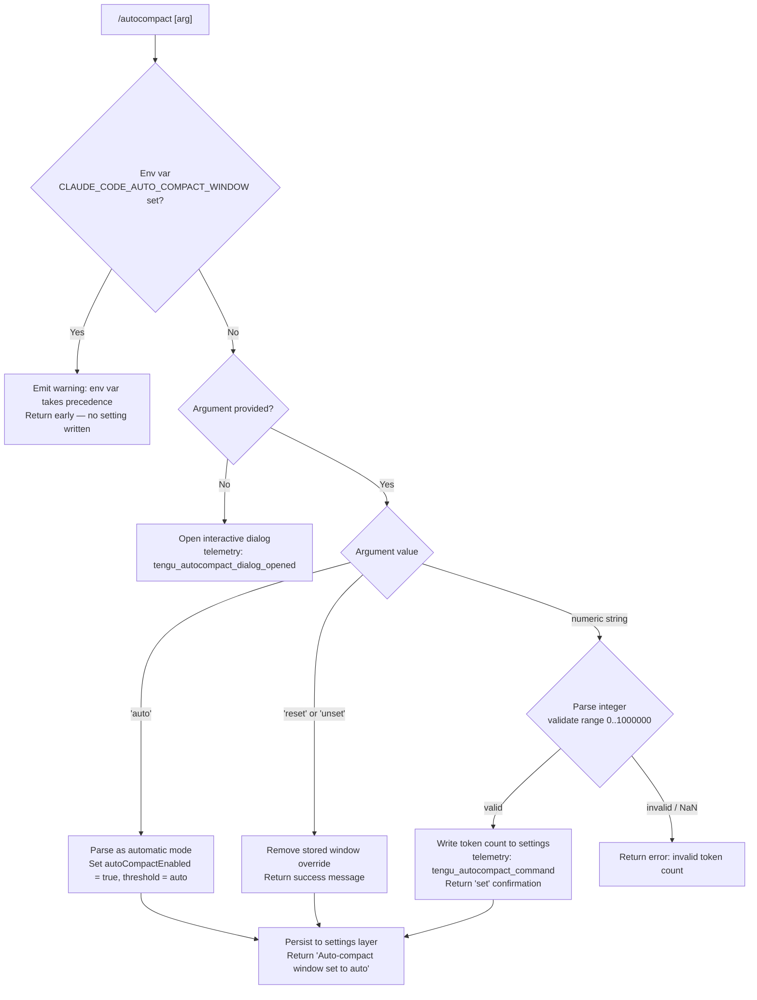

# `/autocompact`

> Analysis basis: CC v2.1.142 bundle.js (AST extraction + Claude interpretation)
> Minimum version: v2.1.142

---

## Overview

`/autocompact` configures the auto-compact context window size for Claude Code sessions. It accepts a token count, the special keyword `auto`, or a reset/unset directive, and persists the chosen value to user settings. When invoked without arguments it opens an interactive dialog for the user to configure the setting.

---

## Registration

| Field | Value |
|---|---|
| type | `local-jsx` |
| name | `autocompact` |
| description | Configure the auto-compact window size |
| argumentHint | `[auto\|<tokens>]` |
| isHidden | `false` |
| module_id | `lqq` |
| load_inline | `true` |
| loc_byte | `10105845` |
| loc_byte_end | `10106094` |
| loc_line | `5723` |
| arbor_handler.name | `g37` |
| arbor_handler.fqn | `claude-2.1.142::g37` |
| arbor_handler.kind | `AsyncFunction` |
| arbor_handler.resolution_path | `module_id` |
| arbor_handler.n_hits | `1` |

Analysis basis: CC v2.1.142 bundle.js:+10105845

---

## Input Branching

Five distinct branches are identified from the literals and call graph: no argument (dialog), `auto`, `reset`/`unset`, a numeric token count, and the environment-variable-locked case.



Analysis basis: CC v2.1.142 bundle.js:+10100340, +10100374, +10100476, +10100505, +10100548, +10100812, +10100893, +10100942, +10101142, +10101158, +10105565

---

## Behavioral Spec

### Top-level Handler (`g37` — `autocompactCommandHandler`)

The Arbor-resolved handler is the async function `g37`. It receives the user's raw argument string and the application context object.

```
async function autocompactCommandHandler(rawArg, appContext):
    if rawArg is absent or empty:
        emit telemetry("tengu_autocompact_dialog_opened")   // +10105565
        render JSX dialog via sM.createElement               // +10105618
        return dialog element                                // +10105607

    delegate to parseAndApplyAutoCompact(rawArg, appContext)
```

Analysis basis: CC v2.1.142 bundle.js:+10105530, +10105546, +10105563, +10105607, +10105618

---

### Argument Parser and Applier (`R26` — `parseAndApplyAutoCompact`)

```
async function parseAndApplyAutoCompact(rawArg, appContext):

    // Check environment variable lock
    if env CLAUDE_CODE_AUTO_COMPACT_WINDOW is set:
        return warning message:
            "CLAUDE_CODE_AUTO_COMPACT_WINDOW is set and takes precedence. Unset it to change this setting."
        // +10100374

    trimmedArg = rawArg.trim()                      // +10100476

    // Reset / unset path
    if trimmedArg == "reset" or trimmedArg == "unset":  // +10100505, +10100518
        remove autoCompact window override from settings
        persist settings via settingsPersist(appContext)
        return success

    // Parse the argument as a window specification
    windowSpec = parseWindowSpec(trimmedArg)         // Wh_ — +10100548

    // Apply feature-flag overrides
    applyFlagSettings(appContext)                    // +10100893

    // Write the resolved value
    emit telemetry("tengu_autocompact_command")      // +10100944

    result = writeAutoCompactSetting(windowSpec, appContext)  // rK — +10101142

    if windowSpec == AUTO_MODE:
        return "Auto-compact window set to auto"     // +10101158

    emit DCH event                                   // +10104129
    persist application state                        // m_ — +10100812

    return result
```

Analysis basis: CC v2.1.142 bundle.js:+10100340, +10100374, +10100476, +10100505, +10100518, +10100548, +10100716, +10100812, +10100893, +10100942, +10101142, +10101158

---

### Window Spec Parser (`Wh_` — `parseWindowSpec`)

Converts a raw argument string into a canonical window specification.

```
function parseWindowSpec(input):
    trimmed = input.trim()                           // +9558446

    if trimmed ends with "%":                        // +9558505
        // Percentage form: convert to token fraction
        floatVal = parseFloat(trimmed)               // +9558523
        if not Number.isFinite(floatVal):
            return INVALID
        rounded = Math.round(floatVal * factor)      // +9558690
        return { kind: "percentage", value: rounded }

    if trimmed == "auto":                            // +9558476
        return { kind: "auto" }

    // Plain integer form
    multiplier = 1000 if trimmed ends with "k" else 1   // +9558581
    divisor   = 100  if percentage scaling else 1        // +9558617
    intVal = parseInt(trimmed)                        // +9558597
    if not Number.isFinite(intVal):
        return INVALID
    return { kind: "tokens", value: intVal * multiplier }
```

Analysis basis: CC v2.1.142 bundle.js:+9558446, +9558476, +9558505, +9558523, +9558581, +9558597, +9558617, +9558643, +9558690

---

### Context-Window Resolution (`ii` — `resolveAutoCompactWindow`)

Reads the effective window size, merging all configuration layers in priority order.

```
function resolveAutoCompactWindow():

    // 1. Environment variable — highest priority
    envVal = process.env["CLAUDE_CODE_AUTO_COMPACT_WINDOW"]   // +9559050
    if envVal is set:
        record source as "env"                                 // +9559242
        return parseWindowSpec(envVal)

    // 2. Settings file (user / project / local)
    settingsVal = getSettingFromLayer("autoCompactWindow")     // +9559312
    if settingsVal is set:
        record source as "settings"
        return parseWindowSpec(settingsVal)

    // 3. Compute bounds from current model context
    rawLimit = getModelContextLimit()                          // I1 — +9558974
    parsedLimit = parseModelLimit(rawLimit)                    // iJ — +9558982

    // 4. Evaluate validity token via Bt
    validity = evaluateTokenValidity(parsedLimit)              // Bt — +9559047
    // validity ∈ { "valid", "invalid", "capped" }           // +4826884, +4826959, +4827089

    bounded = Math.max(lowerBound, Math.min(upperBound, parsedLimit))  // +9559168, +9559208

    // 5. Write resolved value & autoCompactEnabled flag
    persist({ autoCompactEnabled: resolvedEnabled,            // +9560534
              windowTokens: bounded,
              source: "default" })                            // +3310255

    return bounded
```

Analysis basis: CC v2.1.142 bundle.js:+9558974, +9558982, +9558987, +9559047, +9559050, +9559168, +9559208, +9559242, +9559312, +9559330, +9559351, +9560434, +9560531, +9560534

---

### Model Limit Lookup (`I1` — `getModelContextLimit`)

Resolves the context-window limit for the currently configured model by iterating the known model table.

```
function getModelContextLimit(modelId):
    // Enumerate model → limit mapping via IU6
    entries = Object.entries(modelLimitTable)    // +2019383
    for [model, limit] in entries:
        if modelId matches model:
            return limit

    // Normalise model name for fuzzy matching
    normalised = normaliseModelId(modelId)       // Nw — +2156948
    // Known prefixes checked: "claude-3-"       // +2892703
    // Known model IDs include:
    //   claude-opus-4-7  (+2156000)
    //   claude-opus-4-6  (+2156057)  claude-opus-4-5  (+2156114)
    //   claude-opus-4-1  (+2156171)  claude-opus-4-0  (+2156260)
    //   claude-sonnet-4-6 (+2156292) claude-sonnet-4-5 (+2156353)
    //   claude-sonnet-4-0 (+2156448) claude-haiku-4-5 (+2156482)
    //   claude-3-7-sonnet (+2156541) claude-3-5-sonnet (+2156602)
    //   claude-3-5-haiku  (+2156663) claude-3-opus    (+2156722)
    //   claude-3-sonnet   (+2156775) claude-3-haiku   (+2156832)
    //   application-inference-profile (+2156968)
    if normalised includes "application-inference-profile":  // +2156957
        return specialProfileLimit(normalised)   // eV8 — +2157008
    return fallbackLimit(normalised)             // wP  — +2157012
```

Analysis basis: CC v2.1.142 bundle.js:+2156000–2156968, +2019318, +2019383, +2156948, +2156957, +2157008, +2157012

---

### Token Limit Validation (`iJ` — `parseAndValidateTokenLimit`)

```
function parseAndValidateTokenLimit(rawLimit):
    stringified = toString(rawLimit)             // bH — +2892987
    parsed = parseInt(stringified, 10)           // +2893070, base 10 (+2893122)

    if isNaN(parsed):                            // +2893130
        return INVALID_SENTINEL                  // 0 sentinel (+2893142)

    // Hard upper bound: 1 000 000 tokens        // +2893169
    if parsed > 1000000:
        return applyMaxCapPolicy(parsed)         // mc — +2893200

    if parsed < MINIMUM_THRESHOLD:
        return applyMinCapPolicy(parsed)         // sG — +2893156

    // Attempt to derive compact-capable limit    // DAH — +2893220
    compactLimit = deriveCompactLimit(parsed)

    // Produce final spec with auto-enable check  // ql6 — +2893244
    return buildFinalSpec(compactLimit)
```

Maximum token limit: 1,000,000 tokens (bundle.js:+2893169)
Radix used for `parseInt`: 10 (bundle.js:+2893122)
Lower sentinel value: 0 (bundle.js:+2893142)

Analysis basis: CC v2.1.142 bundle.js:+2892987, +2893070, +2893122, +2893130, +2893142, +2893156, +2893169, +2893200, +2893220, +2893244

---

### Settings Persistence (`p_` — `persistSettings`)

Saves the mutated settings object through multiple layers (policy → flag → user → project → local).

```
async function persistSettings(context):
    load settings chain:
        policySettings    // +1203213
        flagSettings      // +1203235
        userSettings      // +1194271  (path: ~/.claude/settings.json)  +1194525, +1194535
        projectSettings   // +1194322  (path: .claude/settings.json)
        localSettings     // +1194344  (path: .claude/settings.local.json) +1194597

    validate merged result via schemaValidator(v)   // +1203551
    if Array.isArray(errors):                        // +1203702
        throw Error                                  // +1203466

    write atomically via atomicWriteFile(TA6)        // +1203790
        // uses randomBytes(6).toString("hex") temp name  // +1000200, +1000228
        // fchmodSync to preserve original permissions    // +1000694
        // fsyncSync then renameSync                       // +1000760, +1000888
    record timestamp via recordTimestamp(hu8)        // +1203737
    flush caches via clearCaches(kz)                 // +1203932
        // clears DV6 and LZ8                             // +26086, +26098
    emit DCH event                                   // +1204129
```

Analysis basis: CC v2.1.142 bundle.js:+1203213, +1203235, +1203275, +1203310, +1203325, +1203347, +1203353, +1203383, +1203402, +1203435, +1203466, +1203551, +1203618, +1203702, +1203737, +1203790, +1203932, +1203957, +1203961, +1203981, +1204105, +1204119, +1204129

---

## State & Side Effects

| Item | Detail |
|---|---|
| Telemetry | `tengu_amber_redwood2` (bundle.js:+9558862) |
| Telemetry | `tengu_autocompact_command` (bundle.js:+10100944) — fired on every non-dialog invocation |
| Telemetry | `tengu_autocompact_dialog_opened` (bundle.js:+10105565) — fired when no argument is provided and the dialog is rendered |
| Settings written | `autoCompactEnabled` boolean flag (bundle.js:+9560534) |
| Settings written | `autoCompactWindow` token count or `"auto"` string |
| Settings files | `~/.claude/settings.json` (user), `.claude/settings.json` (project), `.claude/settings.local.json` (local) |
| Cache flush | `DV6` and `LZ8` caches cleared after each successful write (bundle.js:+26086, +26098) |
| Timestamp record | `PR6` map updated with `Date.now()` on write (bundle.js:+1085724, +1085734) |
| Atomic write | Temporary file created with 6-byte hex random suffix; `fchmodSync` + `fsyncSync` + `renameSync` before final placement (bundle.js:+1000200, +1000694, +1000760, +1000888) |
| Event emission | `DCH.emit` fired after settings persist (bundle.js:+1204129) |
| Dialog | JSX element rendered via `sM.createElement` when no arg supplied (bundle.js:+10105618); element type tagged `"dialog"` (bundle.js:+10105607) |
| Env var lock | `CLAUDE_CODE_AUTO_COMPACT_WINDOW` env var blocks any write and surfaces a warning (bundle.js:+9559050, +10100374) |

---

## Version History

| Version | Change |
|---|---|
| v2.1.142 | Initial analysis |

---

## Common Mistakes

1. **Setting the value while `CLAUDE_CODE_AUTO_COMPACT_WINDOW` is exported** — the command will silently skip the write and print a precedence warning. Unset the env var first.
2. **Providing a token count above 1,000,000** — values exceeding the hard cap (bundle.js:+2893169) are capped internally; the user sees a `"capped"` status rather than an error, which may be unexpected.
3. **Confusing `reset` / `unset` semantics** — both keywords remove the stored override and revert to the auto-derived default; they are equivalent and do not disable auto-compaction entirely.
4. **Passing a floating-point string** — `parseInt` is used (not `parseFloat`) for the plain numeric path; `"3.5"` parses as `3`, not `3.5`. Append `%` to use the percentage parsing branch.
5. **Expecting instant effect across all open sessions** — settings are persisted to disk and `DV6`/`LZ8` caches are flushed in the current process, but other running Claude Code instances will not reload until their own cache invalidation cycle.

---

## Appendix — Identifier Mapping

> For bundle debugging only. Identifiers change across versions.

| Identifier | Role |
|---|---|
| `g37` | `autocompactCommandHandler` — top-level async handler for `/autocompact` (Arbor-resolved entry point) |
| `R26` | `parseAndApplyAutoCompact` — parses the argument, checks env lock, dispatches to write or reset |
| `ii` | `resolveAutoCompactWindow` — merges env / settings / model-derived window size |
| `I1` | `getModelContextLimit` — looks up context-window limit for the active model |
| `IU6` | `buildModelLimitTable` — constructs the model-ID → token-limit mapping |
| `Nw` | `normaliseModelId` — lowercases and strips suffixes from a model ID string |
| `H` | `delayedRandom` — utility producing a jittered async delay (Math.random + setTimeout) |
| `eV8` | `inferenceProfileLimitResolver` — special limit path for `application-inference-profile` models |
| `wP` | `fallbackLimitResolver` — limit resolver for unrecognised model IDs |
| `iJ` | `parseAndValidateTokenLimit` — parseInt + range check + cap policy |
| `bH` | `coerceToString` — wraps `String()` coercion |
| `sG` | `applyMinCapPolicy` — enforces minimum token floor via `wAH` |
| `mc` | `applyMaxCapPolicy` — enforces 1,000,000 token ceiling; checks model series with `_.includes` |
| `DAH` | `deriveCompactLimit` — derives compact-capable sub-limit from a raw token count |
| `ql6` | `buildFinalSpec` — assembles the final window spec object; calls `parseInt`, `Number.isFinite`, `y6` |
| `EY` | `getEnvAutoCompactWindow` — reads `CLAUDE_CODE_AUTO_COMPACT_WINDOW` from environment |
| `Bt` | `evaluateTokenValidity` — classifies result as `"valid"`, `"invalid"`, or `"capped"` |
| `v` | `formatTokenDisplay` — formats a token count for display (locale `"en-US"`, style `"compact"`) |
| `l0` | `buildWindowSettingsObject` — assembles the settings payload including `autoCompactEnabled` |
| `L7` | `readSettingFromLayer` — reads a named key from a specific settings layer |
| `H98` | `computeDefaultWindow` — orchestrates `l0`, `E_`, `G6`, `Wh_` to produce the default window |
| `E_` | `getDefaultWindowFallback` — fallback value producer |
| `G6` | `resolveSettingWithCache` — checks `gMH` / `MF` caches before computing; adds to `T76` dedup set |
| `Wh_` | `parseWindowSpec` — parses `"auto"`, percentage, and integer token forms |
| `p_` | `persistSettings` — full settings persistence pipeline |
| `JO` | `loadSettingsObject` — loads merged settings from all layers |
| `W5H` | `buildSettingsPaths` — joins `.claude/settings.json` etc. path components |
| `OB` | `mergeSettingsLayers` — merges policy / flag / user / project / local layers |
| `x6` | `getCwd` — returns current working directory |
| `Nm8` | `loadSettingsFromFile` — reads and parses a settings JSON file from disk |
| `GDA` | `parseSettingsJson` — JSON parse + key enumeration + `Dc` validation |
| `$B` | `buildUserSettingsPath` — constructs user-scoped settings file path |
| `PDA` | `buildSdkInlineSettings` — constructs the `"SDK inline settings"` layer object |
| `sj` | `readProjectSettings` — reads project-level `.claude/settings.json` |
| `wc` | `readFileWithFallback` — reads a file via `readFileSync`, slices up to 4096 bytes (+965210), handles ENOENT |
| `$8` | `parseJsonSafe` — safe JSON parser delegating to `O8` |
| `O8` | `jsonParseInternal` — raw `JSON.parse` wrapper |
| `hu8` | `recordSettingsTimestamp` — writes `Date.now()` into `PR6` map |
| `jXH` | `resolveSettingsPath` — resolves a settings file path via `eR6` and `OB` |
| `eR6` | `resolveRelativePath` — resolves a path relative to `uV` (path module) base |
| `TA6` | `atomicWriteFile` — atomic file write: random temp name, fchmod, fsync, rename, unlink on failure |
| `q` | `fsModule` — Node.js `fs` bindings |
| `O` | `fsStatModule` — `fs.Stats` helper |
| `f` | `fileHandleModule` — file handle close/read/write utilities |
| `RH` | `jsonStringify` — `JSON.stringify` wrapper |
| `kz` | `clearSettingsCaches` — clears `DV6` and `LZ8` caches |
| `$R6` | `writeSettingsFile` — high-level write: mkdir, readFile, appendFile/writeFile, git check-ignore |
| `h6` | `checkGitIgnore` — runs `git check-ignore --` on a path |
| `Ju8` | `getGitRoot` — locates git repository root via `SL` |
| `Wu8` | `resolveGitIgnorePath` — resolves the `.config/ignore` path for git |
| `JyK` | `buildDotConfigPath` — joins `MzA.homedir()` + `".config"` + `"ignore"` |
| `Iy` | `joinClaudePath` — joins `uV` base with `".claude"` directory component |
| `__` | `logDebug` — debug-level logger delegating to `JV` |
| `JV` | `loggerCore` — core structured logging function |
| `ax` | `loadSettingsFromDisk` — orchestrates disk load with `iS`, `j1`, `km8`, `OB`, `wV6` |
| `iS` | `initSettingsLoadContext` — initialises the load-context object |
| `j1` | `recordMemoryUsage` — pushes `process.memoryUsage()` into `N6A`; deduplicates via `W6A` |
| `km8` | `loadAllSettingsFiles` — loads all settings files (`$B`, `PDA`, etc.) and emits telemetry `settings_load_started` / `settings_load_completed` |
| `wV6` | `finaliseSettingsLoad` — post-load finalisation step |
| `NH` | `handleSettingsError` — catches errors, logs via `Yc.logError`, buffers in `hRH`, rotates `XS6` queue |
| `k_` | `wrapError` — coerces any thrown value to an `Error` with `String()` |
| `$q` | `sendEssentialTraffic` — sends `"essential-traffic"` telemetry via `NMA` |
| `JvK` | `rotateErrorQueue` — shift/push on `XS6` bounded error ring-buffer |
| `m_` | `applyAppStateChanges` — applies accumulated app-state mutations; calls `ax` |
| `_` | `lodashOrUtil` — utility library reference (includes, toUpperCase, endsWith, readFileSync, applyFlagSettings) |
| `d` | `getAppContext` — retrieves the current application context object |
| `rK` | `writeAutoCompactSetting` — writes the resolved window spec into the settings layer; delegates to `pq` |
| `pq` | `formatSettingValue` — formats value for storage, appending `".0"` suffix (+206171) when needed |
| `D7K` | `getSettingKey` — returns the storage key string for a given setting |

---

Note: index built via Arbor fallback; some signals (telemetry, literals) may be missing — see arbor-fallback.js.