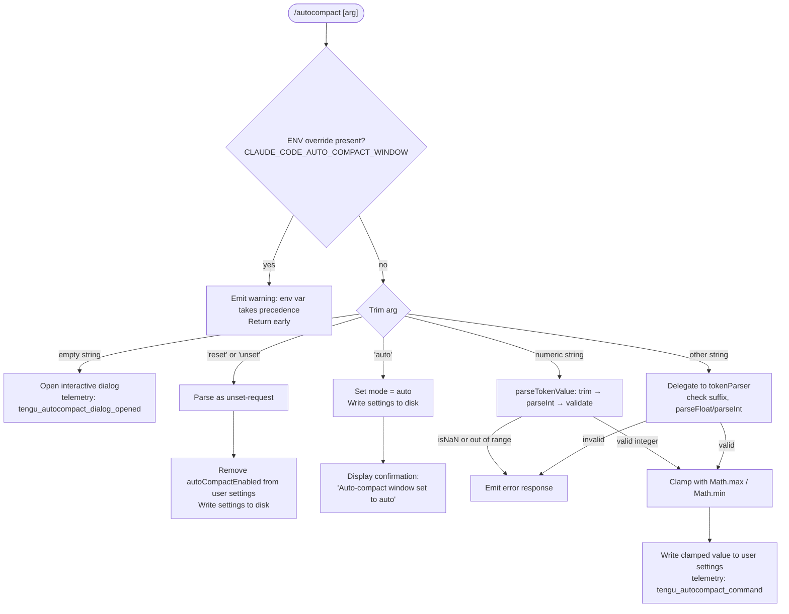

# `/autocompact`

> Analysis basis: CC v2.1.143 bundle.js (AST extraction + Claude interpretation)
> Minimum version: v2.1.143

---

## Overview

The `/autocompact` command configures the context-window auto-compact threshold — the token count at which Claude Code automatically summarises and compacts the conversation history. It accepts either the literal keyword `auto` (to restore automatic sizing) or an explicit integer token count, and it persists the chosen value to user settings while respecting both environment-variable and policy overrides.

---

## Registration

| Field | Value |
|---|---|
| type | `local-jsx` |
| name | `autocompact` |
| description | Configure the auto-compact window size |
| argumentHint | `[auto\|<tokens>]` |
| isHidden | `false` |
| module\_id | `gKq` |

Analysis basis: CC v2.1.143 bundle.js:+10139002

---

## Input Branching

The command entry-point (render function `Cz7`) delegates all parsing and state mutation to the handler `r26`, then optionally opens a JSX dialog. The handler itself follows several distinct paths depending on the raw argument string.



Analysis basis: CC v2.1.143 bundle.js:+10133497, +10133631, +10133662, +10133705, +9577215, +9577333, +9577373

---

## Behavioral Spec

### 1. Environment-Variable Guard

Before any argument processing, the handler checks whether the environment variable `CLAUDE_CODE_AUTO_COMPACT_WINDOW` is set.

```
function checkEnvOverride(env):
    if env["CLAUDE_CODE_AUTO_COMPACT_WINDOW"] is not empty:
        return warningMessage(
            "CLAUDE_CODE_AUTO_COMPACT_WINDOW is set and takes precedence. " +
            "Unset it to change this setting."
        )
    return null
```

If the variable is present the function returns the warning string immediately and skips all further processing.

Analysis basis: CC v2.1.143 bundle.js:+10133531, +9577215

---

### 2. Argument Tokenizer (`US_`)

The tokenizer is shared across multiple commands. It normalises a raw string into a structured token value object.

```
function parseTokenArgument(rawArg):
    trimmed = rawArg.trim()

    if trimmed == "auto":
        return { kind: "auto" }

    if trimmed.endsWith("%"):
        pct = parseFloat(trimmed)
        if not Number.isFinite(pct):
            return { kind: "invalid" }
        rounded = Math.round(pct)
        if rounded < 100 or rounded > 1000:      // range inferred from literals
            return { kind: "invalid" }
        return { kind: "percent", value: rounded }

    parsed = parseInt(trimmed, 10)
    if not Number.isFinite(parsed):
        return { kind: "invalid" }
    return { kind: "absolute", value: parsed }
```

Analysis basis: CC v2.1.143 bundle.js:+9576611, +9576641, +9576670, +9576688, +9576762, +9576808, +9576855

---

### 3. Token-Value Validator (`gt`)

A separate validator classifies the parsed value as `"valid"`, `"invalid"`, or `"capped"`.

```
function validateTokenValue(parsed):
    n = parseInt(parsed, 10)
    if isNaN(n):
        return "invalid"
    // further model-specific ceiling check via v()
    status = checkModelCeiling(n)   // returns "valid" | "capped"
    return status
```

Possible return values: `"valid"`, `"invalid"`, `"capped"`.

Analysis basis: CC v2.1.143 bundle.js:+4840912, +4840930, +4840897, +4840972, +4841102

---

### 4. Range Clamping

After validation, the resolved integer is clamped to a safe range using standard `Math.max` / `Math.min`.

```
function clampWindowSize(value, lowerBound, upperBound):
    return Math.min(upperBound, Math.max(lowerBound, value))
```

Analysis basis: CC v2.1.143 bundle.js:+9577333, +9577373

---

### 5. Context-Window Size Resolver (`r0` / `f7`)

Reads the effective auto-compact window size from the layered settings stack in priority order.

```
function resolveAutoCompactWindow(appState):
    // Check sources in priority order
    envValue = readEnv("CLAUDE_CODE_AUTO_COMPACT_WINDOW")
    if envValue is set:
        return { value: parseTokenArgument(envValue), source: "env" }

    settingsValue = readLayeredSetting("autoCompactEnabled", appState.settings)
    if settingsValue is set:
        return { value: settingsValue, source: "settings" }

    // Fall through to legacy config, then compiled default
    legacyValue = readLegacyConfig("legacyGlobalConfig")
    if legacyValue is set:
        return { value: legacyValue, source: "legacyGlobalConfig" }

    return { value: DEFAULT_WINDOW, source: "default" }
```

Priority: `env` → `settings` → `legacyGlobalConfig` → `default`.

Analysis basis: CC v2.1.143 bundle.js:+9577407, +9577477, +9577495, +9578699, +3319950, +3319994

---

### 6. Settings Persistence (`p_` / settings-write chain)

When a new value is accepted the command writes it atomically through the settings subsystem.

```
function persistAutoCompactSetting(value):
    currentSettings = loadSettingsFromDisk()     // reads userSettings layer
    if value == "unset" or value == "reset":
        delete currentSettings["autoCompactEnabled"]
    else:
        currentSettings["autoCompactEnabled"] = value
    writeSettingsAtomically(currentSettings)     // temp-file rename pattern
    invalidateSettingsCache()                    // clear in-memory caches
    emitEvent("WCH")                             // notify subscribers
```

The atomic write uses a temporary file with random hex suffix (6 bytes → 12 hex chars), applies original file permissions via `fchmodSync`, calls `fsyncSync`, then performs a rename.

Analysis basis: CC v2.1.143 bundle.js:+1206487, +1206551, +1206703, +1207017, +1207042, +1207214, +1000940, +1000968, +1001376, +1001434, +1001500, +1001628

---

### 7. Auto mode

When the argument is exactly `"auto"`, the command stores the sentinel string `"auto"` (not a numeric value) and displays a confirmation message.

```
function handleAutoMode(appState):
    persistAutoCompactSetting("auto")
    return successMessage("Auto-compact window set to auto")
```

Analysis basis: CC v2.1.143 bundle.js:+9576641, +10134315

---

### 8. Interactive Dialog (no-argument path)

When the user invokes `/autocompact` with no argument, a JSX dialog component is rendered.

```
function renderAutoCompactDialog(props):
    // Cz7 calls sM.createElement with kind = "dialog"
    return DialogComponent(props)
```

Telemetry event `tengu_autocompact_dialog_opened` is fired when this path executes.

Analysis basis: CC v2.1.143 bundle.js:+10138687, +10138703, +10138720, +10138722, +10138764, +10138775

---

### 9. Model-Family String Matching (`G1` / `Cw`)

The call graph shows the handler reaches a model-name resolution utility that normalises model identifiers. The following model-family prefixes are matched during context-window ceiling computation:

| Model family string | Location |
|---|---|
| `claude-opus-4-7` | bundle.js:+2159176 |
| `claude-opus-4-6` | bundle.js:+2159233 |
| `claude-opus-4-5` | bundle.js:+2159290 |
| `claude-opus-4-1` | bundle.js:+2159347 |
| `claude-opus-4-0` | bundle.js:+2159436 |
| `claude-sonnet-4-6` | bundle.js:+2159468 |
| `claude-sonnet-4-5` | bundle.js:+2159529 |
| `claude-sonnet-4-0` | bundle.js:+2159624 |
| `claude-haiku-4-5` | bundle.js:+2159658 |
| `claude-3-7-sonnet` | bundle.js:+2159717 |
| `claude-3-5-sonnet` | bundle.js:+2159778 |
| `claude-3-5-haiku` | bundle.js:+2159839 |
| `claude-3-opus` | bundle.js:+2159898 |
| `claude-3-sonnet` | bundle.js:+2159951 |
| `claude-3-haiku` | bundle.js:+2160008 |
| `application-inference-profile` | bundle.js:+2160144 |

String matching uses `toLowerCase()` followed by `includes()`, with a `replace()` normalisation step.

Analysis basis: CC v2.1.143 bundle.js:+2159149, +2159165, +2160056, +2160124, +2160133

---

### 10. Context-Token Validation Limits

The following numeric bounds appear in the implementation:

| Constant | Value | Role | Location |
|---|---|---|---|
| Radix for `parseInt` | `10` | Decimal parsing | bundle.js:+2896904 |
| Minimum valid token count | `0` | Lower bound check | bundle.js:+2896924 |
| Maximum valid token count | `1,000,000` | Upper bound check | bundle.js:+2896951 |
| Percent lower bound | `100` | Minimum percentage | bundle.js:+9576782 |
| Percent upper bound | `1000` | Maximum percentage | bundle.js:+9576746 |

Analysis basis: CC v2.1.143 bundle.js:+2896904, +2896924, +2896951, +9576746, +9576782

---

## State & Side Effects

| Item | Detail |
|---|---|
| Telemetry — dialog opened | `tengu_autocompact_dialog_opened` (bundle.js:+10138722) — fires when no argument is given and the dialog is rendered |
| Telemetry — command executed | `tengu_autocompact_command` (bundle.js:+10134101) — fires when a value is successfully set |
| Telemetry — internal routing | `tengu_amber_redwood2` (bundle.js:+9577027) — fires inside the window-size resolver `j98`/`G6` path |
| Settings key written | `autoCompactEnabled` in the user settings layer (`userSettings`) |
| Settings file path | `~/.claude/settings.json` (bundle.js:+1197610, +1197620) |
| Local settings path | `.claude/settings.local.json` (bundle.js:+1197682) |
| Cache invalidation | In-memory settings caches `kV6` and `EZ8` are cleared after write (bundle.js:+26086, +26098) |
| Event bus notification | `WCH.emit` fires to notify all settings subscribers (bundle.js:+1207214) |
| Atomic write mechanism | Temp file with random 6-byte hex suffix → `fchmodSync` → `fsyncSync` → `renameSync` (bundle.js:+1000940, +1001434, +1001500, +1001628) |
| Sound | <!-- TODO: not found in depth-2 traversal; needs --depth 4 --> |
| appState changes | `autoCompactEnabled` field updated; settings-load telemetry events `settings_load_started` / `settings_load_completed` emitted (bundle.js:+1201720, +1202397) |

---

## Version History

| Version | Change |
|---|---|
| v2.1.143 | Initial analysis — command registered as `local-jsx`, supports `auto`, numeric token count, `reset`/`unset`, and no-arg dialog |

---

## Common Mistakes

1. **Setting a value while `CLAUDE_CODE_AUTO_COMPACT_WINDOW` is exported** — the command will print a warning and make no change. Unset the environment variable first.
2. **Passing a token count outside 0–1,000,000** — the value will fail validation and be rejected; use a value within that range or use `auto`.
3. **Confusing `reset` / `unset` with `auto`** — `reset`/`unset` removes the key entirely (falling back to the compiled default), whereas `auto` explicitly stores the string sentinel `"auto"`.
4. **Expecting immediate effect in an in-flight conversation** — the settings write triggers a cache flush and an event-bus notification, but a currently running inference turn reads the value at turn start; the new setting takes effect on the next turn.
5. **Editing `settings.local.json` manually for a global change** — `/autocompact` writes to the user-level `settings.json`, not the project-local file; a local file entry will shadow the global one.
6. **Passing a percentage value without the `%` suffix** — a bare number is always interpreted as an absolute token count; include the `%` character to use the percentage form.

---

## Appendix — Identifier Mapping

> For bundle debugging only. Identifiers change across versions.

| Identifier | Role |
|---|---|
| `Cz7` | Command render / entry-point component |
| `r26` | Main command handler (argument dispatch) |
| `qr` | Auto-compact window size resolver (orchestrator) |
| `G1` | Model-name normalisation utility |
| `BU6` | Model-list builder (calls `Object.entries`) |
| `Cw` | Model-string matcher (toLowerCase / includes / replace) |
| `WI8` | Inference-profile type checker |
| `PP` | Model-string replace helper |
| `yX` | Token-value parser (parseInt / isNaN / range check) |
| `xH` | String coercion helper |
| `nG` | Token validation sub-routine (lower bound) |
| `dc` | Token validation sub-routine (full range + model check) |
| `DAH` | Token validation sub-routine (model-specific ceiling) |
| `Gl6` | Token validation sub-routine (numeric + finite check) |
| `Pw` | Settings-read helper used by resolver |
| `gt` | Token-value classifier (returns valid / invalid / capped) |
| `v` | Model-context-ceiling lookup table |
| `r0` | Effective window-size reader (env → settings → legacy → default) |
| `f7` | Settings-source selector (legacyGlobalConfig / default) |
| `j98` | Resolver dispatcher (calls `r0`, `E_`, `G6`) |
| `E_` | <!-- TODO: not found in depth-2 traversal; needs --depth 4 --> |
| `G6` | Telemetry-tagged resolver path (`tengu_amber_redwood2`) |
| `US_` | Raw-argument tokenizer (auto / percent / absolute) |
| `p_` | Settings write orchestrator (atomic file write + cache flush + event emit) |
| `wO` | Settings loader entry point |
| `k5H` | Settings layer merger (userSettings / projectSettings / localSettings) |
| `WB` | Settings object builder |
| `x6` | File-system existence check |
| `lm8` | Multi-layer settings loader |
| `oDA` | Settings object deserialiser |
| `XB` | Project-settings loader |
| `nDA` | SDK inline settings loader |
| `AP` | Policy/flag settings loader |
| `Tc` | File reader with 4096-byte buffer |
| `$8` | JSON parse helper |
| `L8` | Error code normaliser (ENOENT etc.) |
| `nu8` | Settings timestamp recorder (`Date.now`) |
| `XXH` | Settings path resolver |
| `JC6` | Path resolution utility (`pV.resolve` / `pV.dirname`) |
| `yA6` | Atomic file-write helper (random hex temp file) |
| `q` | Node `fs` module reference (unlinkSync / renameSync / statSync etc.) |
| `O` | `fs.Stats` wrapper (isSymbolicLink) |
| `f` | File-handle wrapper (close / toString) |
| `hH` | JSON serialiser wrapper (`JSON.stringify`) |
| `hz` | Cache-clear helper (clears `kV6` and `EZ8`) |
| `VR6` | Settings file write helper (mkdir / readFile / writeFile / appendFile) |
| `S6` | Settings path provider |
| `Ru8` | Settings migration helper |
| `uu8` | Git-ignore checker (`git check-ignore`) |
| `ySK` | Home-directory config path builder |
| `hy` | `.claude` directory path builder (`pV.join`) |
| `__` | Global-state accessor |
| `GV` | Root global state object |
| `Lu` | Settings load coordinator (calls `nm8`, `WB`, `yV6`) |
| `ah` | Settings load pre-hook |
| `P1` | Memory-usage recorder (`process.memoryUsage`) |
| `nm8` | Settings load implementation (disk read + telemetry) |
| `yV6` | Settings load post-hook / subscriber notification |
| `NH` | Error-queue / log-error handler |
| `v_` | Error wrapping utility |
| `zq` | Essential-traffic queue processor |
| `kNK` | Circular buffer manager (shift / push) |
| `R_` | Effective-settings loader shortcut |
| `_` | Utility namespace (various string / fs methods) |
| `d` | React / JSX renderer reference |
| `oK` | Number formatter (en-US compact locale) |
| `dq` | Locale number formatting helper |
| `v5K` | Decimal `.0` suffix stripper |