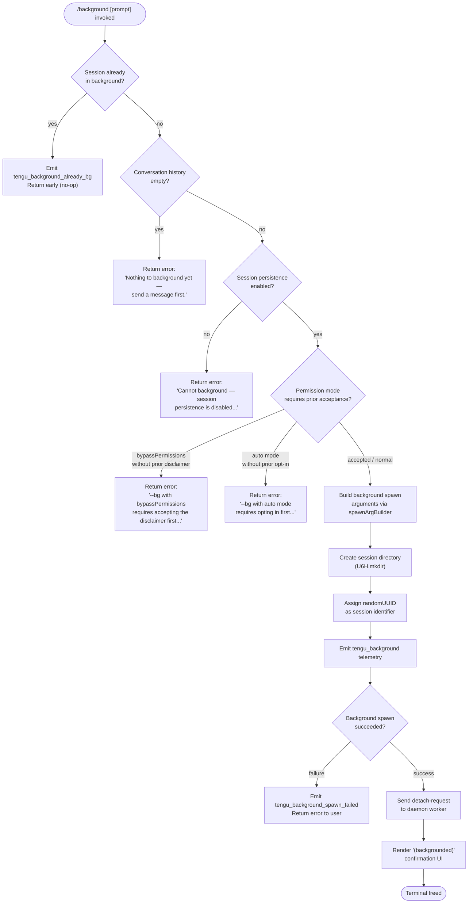

# `/background`

> Analysis basis: CC v2.1.143 bundle.js (AST extraction + Claude interpretation)
> Minimum version: v2.1.143

---

## Overview

The `/background` command (alias `/bg`) detaches the current interactive Claude Code session from the terminal, spawning it as a background daemon process so the user can reclaim their shell. An optional prompt argument is forwarded to the backgrounded session before it is detached. The command validates several preconditions—session history, persistence configuration, and permission-mode acceptance—before performing the handoff.

---

## Registration

| Field | Value |
|---|---|
| type | `local-jsx` |
| name | `background` |
| description | `Send this session to the background and free the terminal` |
| argumentHint | `[prompt]` |
| aliases | `["bg"]` |
| immediate | `null` |
| module\_id | `oNq` |

Analysis basis: CC v2.1.143 bundle.js:+12023050

---

## Input Branching

The command handler (`A28`) evaluates a chain of guards before dispatching the background operation. The flowchart below reflects the branching logic derived from the call graph and string literals.



Analysis basis: CC v2.1.143 bundle.js:+12019280, +12022430, +12022464, +12022497, +12022673, +12016804, +12016973, +12017135, +12019779, +12019848

---

## Behavioral Spec

### Guard: Already-Backgrounded Detection

```
function alreadyBackgroundedGuard(sessionState):
    if sessionState.isBackground == true:
        emitTelemetry("tengu_background_already_bg")
        return EARLY_EXIT   // no error surfaced to user
    return CONTINUE
```

Analysis basis: CC v2.1.143 bundle.js:+12022430, +12022428

---

### Guard: Empty History Check

```
function emptyHistoryGuard(conversationMessages):
    if conversationMessages is empty or length == 0:
        return userError("Nothing to background yet — send a message first.")
    return CONTINUE
```

Analysis basis: CC v2.1.143 bundle.js:+12022673

---

### Guard: Session Persistence Check

```
function persistenceGuard(sessionConfig):
    if sessionConfig.persistenceEnabled == false:
        return userError(
            "Cannot background — session persistence is disabled, " +
            "so the forked job would have nothing to resume."
        )
    return CONTINUE
```

Analysis basis: CC v2.1.143 bundle.js:+12022497

---

### Guard: Permission-Mode Acceptance

```
function permissionModeGuard(args, userAcceptanceState):
    // Check for bypassPermissions flag
    if args contains "--dangerously-skip-permissions"
       OR args contains "--allow-dangerously-skip-permissions":
        if userAcceptanceState.bypassPermissions != true:
            return userError(
                "--bg with bypassPermissions requires accepting the disclaimer first. " +
                "Run `claude --dangerously-skip-permissions` once interactively."
            )

    // Check for auto permission mode
    if args contains "--permission-mode" with value "auto"
       OR effectivePermissionMode == "auto":
        if userAcceptanceState.autoModeOptedIn != true:
            return userError(
                "--bg with auto mode requires opting in first. " +
                "Run `claude --permission-mode auto` once interactively."
            )

    return CONTINUE
```

Analysis basis: CC v2.1.143 bundle.js:+12016773, +12016804, +12016836, +12016882, +12016973, +12017115, +12017135

---

### Background Spawn Argument Builder

The function `spawnArgBuilder` (obfuscated: `$u7`) constructs the CLI argument array that will be passed to the new background process. It parses the existing argument vector, strips or rewrites certain flags, and appends session-routing flags.

```
function spawnArgBuilder(currentArgVector, sessionId, promptText):
    args = currentArgVector

    // Locate and strip the "--" argument separator if present
    separatorIndex = args.indexOf("--")
    if separatorIndex >= 0:
        args = args.slice(0, separatorIndex)

    // Forward permission-mode flags verbatim
    if args includes "--permission-mode":
        retain "--permission-mode" and its value

    // Append session continuation flags
    args.append("--session-id", sessionId)

    // If user supplied a prompt to /background, append it
    if promptText is not empty:
        args.append(promptText)

    return args
```

Analysis basis: CC v2.1.143 bundle.js:+12001086, +12016729, +12016752, +12016769, +12016825, +12001966

---

### Background Process Launcher

The function `backgroundLauncher` (obfuscated: `m6H`) orchestrates directory creation, UUID generation, argument assembly, and the actual process spawn.

```
function backgroundLauncher(sessionContext, spawnArgs):
    // Validate gate (returns "gate_blocked" string on refusal)
    gateResult = evaluateSpawnGate(sessionContext)
    if gateResult == "gate_blocked":
        return BLOCKED

    // Generate a unique session identifier
    sessionId = crypto.randomUUID()

    // Truncate argument list to at most 8 elements before appending session flags
    trimmedArgs = spawnArgs.slice(0, 8)

    // Resolve and create the working directory for the new session
    sessionDir = pathJoin(baseDir, sessionId)
    filesystem.mkdir(sessionDir, { recursive: true })

    // Delegate to the daemon session spawner
    result = daemonSessionSpawner(sessionId, sessionDir, trimmedArgs, sessionContext)

    // On failure, clean up the created directory
    if result is error:
        filesystem.rm(sessionDir, { recursive: true })
        recordUnknownStatus(sessionId)
        return ERROR(result)

    return SUCCESS(sessionId)
```

Analysis basis: CC v2.1.143 bundle.js:+12001086, +12001109, +12001126, +12001151, +12001173, +12001183, +12001211, +12001354, +12001458, +12001489, +12001496

---

### Daemon Session Spawner

The function `daemonSessionSpawner` (obfuscated: `tx7`) performs the full lifecycle of launching, connecting to, and verifying the background daemon process.

```
function daemonSessionSpawner(sessionId, sessionDir, args, context):
    // Determine session type: "fleet", "spare", or "bg"
    sessionType = resolveSessionType(context)   // literals: "fleet", "spare", "bg"

    // Build final argument list including "--agent" and optional "--name"/"-n" flags
    fullArgs = buildFinalArgs(args, sessionId)
    // "--agent" appended at loc_byte 12001635
    // "--name" / "-n" at loc_bytes 12001663, 12001680

    // Respect "--continue" / "-c" and "--resume" / "-r" carry-through
    carryFlags = extractCarryFlags(args)
    // flags checked: "-c", "--continue", "-r", "--resume", "--resume=", "-r=", "--fork-session"

    // Launch subprocess of type "shell" targeting the daemon
    process = spawn("shell", fullArgs, { cwd: sessionDir })

    // Poll for acknowledgement with timeouts
    // Dispatch wait: 5000 ms, extended wait: 6000 ms
    ackResult = waitForAck(process, dispatchTimeout=5000, extendedTimeout=6000)

    if ackResult == "ack-timeout":
        handleTimeout(sessionId)
    else if ackResult == "enoconn":
        handleNoConnection(sessionId)
    else if ackResult == "estarting":
        handleStarting(sessionId)

    // Record session start timestamp via Date.now()
    session.startedAt = Date.now()

    // Attempt to list existing daemon sessions for deduplication
    existingSessions = daemonListSessions()   // operation: "list"

    // Dispatch the prompt/task to the background session
    dispatchResult = daemonDispatch(sessionId, context.prompt)
    // operation literal: "dispatch"

    // If a rescued dispatch occurs, emit telemetry
    if dispatchResult.wasRescued:
        emitTelemetry("tengu_bg_dispatch_rescued")

    // Handle short-alive or stale-short conditions
    if session lifetime < threshold:
        recordStatus("short-alive" / "short_alive")
        if isStale:
            recordStatus("stale-short" / "stale_short")
            return userError("Previous session is still shutting down — try again in a moment")

    // Report final daemon status
    finalStatus = queryDaemonStatus(sessionId)   // operation: "status"
    if finalStatus == "daemon-unreachable":
        recordMetric("daemon_unavailable")

    return finalStatus
```

Analysis basis: CC v2.1.143 bundle.js:+12001591, +12001614, +12001631, +12001635, +12001663, +12001680, +12001690, +12001727, +12001738, +12001754, +12001764, +12001782, +12001792, +12001804, +12001817, +12001844, +12001854, +12001865, +12002188, +12002194, +12002435, +12002448, +12002532, +12002682, +12002795, +12002802, +12003085, +12003288, +12003480, +12003508, +12003824, +12003840, +12003858, +12003930, +12003956, +12003978, +12004003, +12004197, +12004507, +12004551, +12004568, +12004853, +12004915, +12005047, +12005076, +12005109, +12005187, +12005243, +12005252, +12005269, +12005303, +12005324

---

### Detach Request and Terminal Release

Once the background process is confirmed running, the UI component (obfuscated: `Du7`) sends a `"detach-request"` message to the daemon worker and renders the confirmation.

```
function sendDetachAndRender(sessionId, daemonWorkerRef):
    // Pre-flight: verify daemon transport type is "daemon" or "daemon-worker"
    if daemonWorkerRef.type not in ["daemon", "daemon-worker"]:
        return userError("Cannot background — session persistence is disabled...")

    // Write detach-request message to the IPC channel
    ipcChannel.write({ type: "detach-request", sessionId: sessionId })

    // Render JSX confirmation element with text "(backgrounded)"
    return renderElement("(backgrounded)")
```

Analysis basis: CC v2.1.143 bundle.js:+12022482, +10118421, +10118440, +10118446, +10118455, +10118501, +12020499, +2169293, +2169307, +12022743

---

### Abort Signal and Spawn Timeout

The top-level handler (`A28`) wraps the spawn operation with an `AbortSignal.timeout`, ensuring the overall backgrounding attempt does not hang indefinitely.

```
function backgroundCommandHandler(input, appState):
    signal = AbortSignal.timeout(/* timeout value derived from context */)

    // Pass "--model" and "--effort" flags from current session to spawn args
    // Default effort: "default"
    spawnArgs = buildSpawnArgs(
        model  = appState.model,
        effort = appState.effort ?? "default",
        signal = signal
    )

    result = backgroundLauncher(appState.session, spawnArgs)
    if result is FAILURE:
        emitTelemetry("tengu_background_spawn_failed")
        return renderError(result.message)

    emitTelemetry("tengu_background")
    sendDetachAndRender(result.sessionId, appState.daemonWorker)
```

Analysis basis: CC v2.1.143 bundle.js:+12019280, +12019314, +12019318, +12019325, +12019358, +12019372, +12019427, +12019439, +12019461, +12019485, +12019566, +12019750, +12019777, +12019840, +12019848, +12019890, +12019900, +12019959, +12019963, +12019974, +12020012, +12020067, +12019779

---

### Session Name Generation

The function `sessionNameGenerator` (obfuscated: `OaH`) generates a human-readable name for the new background session by calling an AI rename tool with schema `"rename_generate_name"`, then trims and formats the result.

```
function sessionNameGenerator(conversationHistory, modelRef):
    // Build a prompt from the assistant/human message history
    // Message roles included: "assistant", "human"
    // Meta messages (isMeta == true) are filtered out
    // Tool-result messages are also filtered (type == "tool_result")
    filteredMessages = conversationHistory
        .filter(m => not m.isMeta)
        .filter(m => m.type != "tool_result")

    // Construct JSON-schema tool call for name generation
    toolCall = {
        type: "json_schema",
        name: "rename_generate_name"
    }

    // Invoke model with "disabled" tool_choice to allow free generation
    rawName = callModel(modelRef, filteredMessages, toolCall)

    // Post-process: trim whitespace, normalize case
    name = rawName.trim().toUpperCase_or_format()

    return name
```

Analysis basis: CC v2.1.143 bundle.js:+11057555, +11057596, +11057613, +11058321, +11058345, +11058348, +11058461, +11058494, +11055163, +11055187, +11055222, +11055262, +11055326, +11055344, +11055380, +11055401, +11055442, +11055474, +11058075, +11058155, +11058219, +12390920

---

### File-Based Session State Cache

The function `fileStateCache` (obfuscated: `s1`) reads and writes session state to disk, maintaining an in-memory `Map` as a cache with a maximum of 1000 entries.

```
function fileStateCache(sessionDir, operation, data):
    filePath = path.join(sessionDir, sessionId)

    if operation == "get":
        if inMemoryCache.has(filePath):
            return inMemoryCache.get(filePath)
        raw = fs.readFile(filePath, encoding="utf-8")
        parsed = parseJson(raw)
        inMemoryCache.set(filePath, parsed)
        return parsed

    if operation == "set":
        // Evict if cache exceeds 1000 entries
        if inMemoryCache.size >= 1000:
            inMemoryCache.clear()
        inMemoryCache.set(filePath, data)
        writeFile(filePath, serialize(data))

    if operation == "delete":
        inMemoryCache.delete(filePath)
        fs.rm(filePath)

    // Stat all known paths for ordering
    stats = Promise.all(knownPaths.map(p => fs.stat(p)))
    // Order by "order" / "stateOrder" fields
```

Analysis basis: CC v2.1.143 bundle.js:+4022736, +4022763, +4022784, +4022821, +4022834, +4022976, +4022982, +4023003, +4023081, +4023116, +4023141, +4023220, +4023234, +4023325, +4023341, +4023486, +4023541, +4023598, +4023698, +4023703

---

### Hook Registration

The hook registration function (obfuscated: `h9`) registers the background session with the global `at_` registry, making it discoverable by other CLI subsystems.

```
function registerSessionHook(sessionId, sessionMeta):
    at_.register(sessionId, sessionMeta)
```

Analysis basis: CC v2.1.143 bundle.js:+12020067, +56977

---

### Error-Log Writer

The function `errorLogWriter` (obfuscated: `NH`) appends structured error records to a shared error log array and emits them via `Wc.logError`.

```
function errorLogWriter(errorRecord):
    formattedEntry = formatError(errorRecord)   // uses xH → String coercion
    errorLog.push(formattedEntry)
    Wc.logError(formattedEntry)
```

Analysis basis: CC v2.1.143 bundle.js:+960155, +960168, +960414, +960497, +960515, +960555

---

## State & Side Effects

| Item | Detail |
|---|---|
| Telemetry: `tengu_background` | Emitted on every successful background dispatch (bundle.js:+12019848) |
| Telemetry: `tengu_background_spawn_failed` | Emitted when the background process spawn fails (bundle.js:+12019779) |
| Telemetry: `tengu_background_already_bg` | Emitted when `/background` is invoked on a session already running in the background (bundle.js:+12022430) |
| Telemetry: `tengu_bg_dispatch_rescued` | Emitted when a background dispatch recovers from a transient failure (bundle.js:+12004200) |
| Telemetry: `tengu_config_auth_loss_prevented` | Emitted by the global-config save guard when it detects an auth field would be silently dropped (bundle.js:+3159634) |
| Hook registration | Background session is registered into the `at_` global registry via `at_.register` (bundle.js:+56977) |
| File system | Creates a per-session directory under the configured base directory; removed on spawn failure via `U6H.rm` (bundle.js:+12001211, +12001354, +12004853) |
| Session state cache | Maintains an in-memory `Map` of up to 1000 entries backed by UTF-8 JSON files on disk (bundle.js:+4023698) |
| IPC channel write | Sends a `"detach-request"` frame to the daemon worker over the active IPC channel (bundle.js:+10118455) |
| AbortSignal | An `AbortSignal.timeout` wraps the entire spawn operation (bundle.js:+12019974) |
| Dispatch timeouts | Dispatch acknowledgement wait: 5000 ms; extended wait: 6000 ms (bundle.js:+12004551, +12004568) |
| Sound | <!-- TODO: not found in depth-2 traversal; needs --depth 4 --> |
| appState changes | Session is transitioned to background state; terminal is released after detach-request is confirmed |

---

## Version History

| Version | Change |
|---|---|
| v2.1.143 | Initial analysis |

---

## Common Mistakes

1. **Invoking `/background` before sending any message.** The command will reject with `"Nothing to background yet — send a message first."` if the conversation history is empty. Send at least one prompt before using `/background`. Analysis basis: CC v2.1.143 bundle.js:+12022673

2. **Using `--dangerously-skip-permissions` without prior interactive acceptance.** The permission-mode guard requires that the user has previously run `claude --dangerously-skip-permissions` interactively at least once. The background spawn is blocked until that disclaimer is accepted. Analysis basis: CC v2.1.143 bundle.js:+12016973

3. **Using `--permission-mode auto` without prior opt-in.** Similarly, `auto` permission mode requires the user to have run `claude --permission-mode auto` interactively first. Analysis basis: CC v2.1.143 bundle.js:+12017135

4. **Invoking `/background` when persistence is disabled.** If session persistence is turned off in the configuration, the command exits with an error because there would be no session to resume. Analysis basis: CC v2.1.143 bundle.js:+12022497

5. **Retrying immediately after a short-alive session.** If the previous daemon session is still in the process of shutting down, `/background` returns `"Previous session is still shutting down — try again in a moment"`. Waiting a few seconds before retrying resolves this. Analysis basis: CC v2.1.143 bundle.js:+12005109

6. **Expecting the alias `/bg` to behave differently.** `/bg` is a registered alias for `/background` and is entirely identical in behavior. Analysis basis: CC v2.1.143 bundle.js:+12023050

---

## Appendix — Identifier Mapping

> For bundle debugging only. Identifiers change across versions.

| Identifier | Role |
|---|---|
| `A28` | Top-level background command handler |
| `TV` | Session-state accessor / current session reader |
| `rf` | Argument vector resolver |
| `ig_` | Spawn gate evaluator |
| `KL` | Gate condition checker |
| `m6H` | Background process launcher (directory + UUID + spawn orchestrator) |
| `$u7` | Spawn argument builder (flag parsing and rewriting) |
| `IK` | Path join utility wrapper |
| `tx7` | Daemon session spawner (full lifecycle: launch, ack, dispatch) |
| `XH` | String/value formatter |
| `L8` | Unknown-status recorder |
| `AV8` | Model/effort flag extractor |
| `__` | React or UI context accessor |
| `GV` | Global application context / React context value |
| `d` | Render helper / JSX factory |
| `$LH` | Global config save function |
| `N6` | Config writer with auth-loss guard |
| `a6` | Config re-read and merge function |
| `kO6` | Abort signal creator wrapper |
| `SEH` | Session metadata builder |
| `OaH` | Session name generator (AI rename) |
| `nJ8` | Conversation message formatter for rename prompt |
| `aN` | Model invocation wrapper for name generation |
| `HK` | Model response parser |
| `DK` | Message filter (filters by type) |
| `_u` | String trim utility |
| `v` | Locale / environment string formatter |
| `T3` | Truncation helper for display strings |
| `t$7` | String slice utility |
| `H` | Generic utility / Math.random + setTimeout holder |
| `M3H` | File-based session registry / watcher |
| `V6` | Logger / debug emitter |
| `x0` | Path basename resolver |
| `s1` | File-state cache (read/write/delete with in-memory Map) |
| `o2` | Cache entry deleter |
| `Bf` | Cache write-through helper |
| `$8` | Low-level file writer |
| `NH` | Error log writer (pushes to shared error array, calls Wc.logError) |
| `h9` | Hook registration function (`at_.register` wrapper) |
| `q28` | UI result renderer for background confirmation |
| `rS` | Array normalizer |
| `O` | Stopped-session descriptor object |
| `N8` | Session-descriptor type tag |
| `WD8` | Tool-result message detector |
| `_` | Generic array accumulator |
| `vb` | Conversation array filter |
| `kQ` | Array-type guard with filter |
| `foH` | String prefix checker (`startsWith`) |
| `g3` | Foreground session handle |
| `pp` | Background confirmation renderer (JSX) |
| `Du7` | Detach UI component (renders detach-request + "(backgrounded)") |
| `T1` | Daemon transport type checker |
| `cB` | Daemon connection object |
| `fLH` | Detach-request IPC sender |
| `XF6` | IPC message constructor |
| `PKq` | IPC payload builder |
| `ri` | IPC channel write executor |
| `z6H` | Post-detach cleanup handler |
| `EJH` | Environment/mode checker (production vs test) |
| `xH` | String coercion helper |
| `_yq` | Test-mode short-circuit |
| `sh` | Environment label reader |