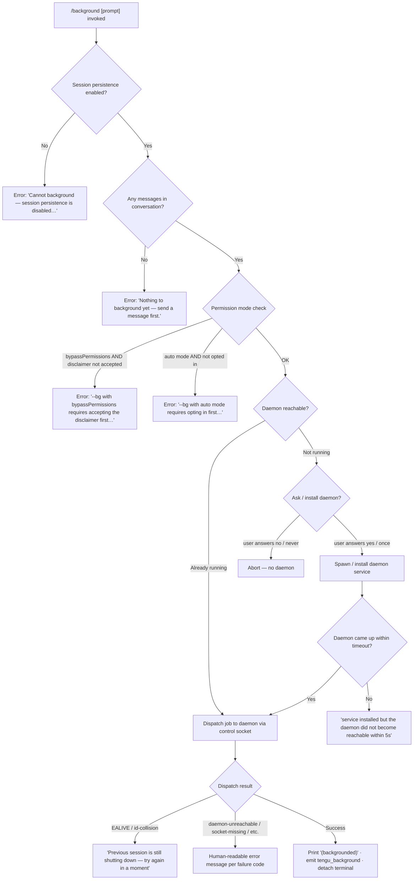

# `/background`

> Analysis basis: CC v2.1.143 bundle.js (AST extraction + Claude interpretation)
> Minimum version: v2.1.143

---

## Overview

`/background` (alias: `/bg`) sends the current interactive Claude Code session to a background daemon process, freeing the terminal for other work while the job continues running. It works by dispatching the current conversation to a resident background daemon via a Unix socket and then detaching the foreground terminal. If no daemon is running, the command will attempt to start one (or prompt the user to install it as a persistent service).

---

## Registration

| Field | Value |
|---|---|
| type | `local-jsx` |
| name | `background` |
| description | `Send this session to the background and free the terminal` |
| argumentHint | `[prompt]` |
| aliases | `["bg"]` |
| immediate | `null` |
| module_id | `oNq` |
| load_inline | `true` |
| loc_byte | `12023050` |
| loc_byte_end | `12023290` |
| loc_line | `7977` |
| arbor_handler.name | `Du7` |
| arbor_handler.fqn | `claude-2.1.143::Du7` |
| arbor_handler.kind | `AsyncFunction` |
| arbor_handler.resolution_path | `module_id` |
| arbor_handler.n_hits | `0` |

Analysis basis: CC v2.1.143 bundle.js:+12023050

---

## Input Branching

The command has 5+ distinct decision branches (permission gating, daemon state, session persistence check, prior message guard, and dispatch outcome), so a Mermaid flowchart is used.



Analysis basis: CC v2.1.143 bundle.js:+12019280 (handler entry), +12022416 (Du7 top), +12005109 (short-alive guard), +12006540 (error-string map)

---

## Behavioral Spec

### 1. Handler Entry — `backgroundCommandHandler` (`Du7`)

The Arbor-resolved handler is `Du7` (AsyncFunction, resolved via `module_id → oNq`).

```
async function backgroundCommandHandler(input, appState):
    // Guard: session persistence must be enabled
    if not sessionPersistenceEnabled(appState):
        return errorMessage("Cannot background — session persistence is disabled…")

    // Guard: at least one message must exist
    if conversationIsEmpty(appState):
        return errorMessage("Nothing to background yet — send a message first.")

    // Render JSX output via tLH.createElement
    result = renderBackgroundUI(input, appState)
    return result
```

Analysis basis: CC v2.1.143 bundle.js:+12022416, +12022497, +12022673, +12022743

---

### 2. Pre-flight Permission Checks — `permissionGateCheck` (`A28`)

Before dispatch the handler runs a series of security gates.

```
function permissionGateCheck(flags, settings):
    mode = resolvePermissionMode(flags, settings)   // calls rf / Boolean / ig_

    if mode == "bypassPermissions":
        if not disclaimerAccepted(settings):
            return error("--bg with bypassPermissions requires accepting the disclaimer first. "
                         "Run `claude --dangerously-skip-permissions` once interactively.")

    if mode == "auto":
        if not autoModeOptIn(settings):
            return error("--bg with auto mode requires opting in first. "
                         "Run `claude --permission-mode auto` once interactively.")

    return OK
```

Relevant literals:
- `"--dangerously-skip-permissions"` (bundle.js:+12016836)
- `"--allow-dangerously-skip-permissions"` (bundle.js:+12016882)
- `"bypassPermissions"` (bundle.js:+12016804)
- `"auto"` (bundle.js:+12017115)
- `"--permission-mode"` (bundle.js:+12016773)

Analysis basis: CC v2.1.143 bundle.js:+12019280, +12016804, +12016973, +12017135

---

### 3. Job Preparation — `prepareBackgroundJob` (`m6H`)

Assembles the dispatch payload that will be sent to the daemon.

```
async function prepareBackgroundJob(sessionState, flags):
    jobId = generateUUID().slice(0, 8)         // gNq.randomUUID, length 8
    statusPath = joinPath(configDir, "daemon.status.json")
    jobsDir = joinPath(configDir, "jobs")

    await mkdir(jobsDir, { recursive: true })

    // Build argument list forwarded to the daemon worker
    args = buildDaemonArgs(sessionState, flags)  // tx7

    // Write dispatch file
    dispatchPayload = serializeJob(jobId, args, sessionState)
    await writeDispatchFile(jobsDir, jobId, dispatchPayload)  // eO / Bf

    return { jobId, statusPath, jobsDir }
```

Relevant literals:
- UUID slice length: `8` (bundle.js:+12001183)
- `"jobs"` directory name (bundle.js:+4021960)
- `"daemon.status.json"` (bundle.js:+11707334)
- `"gate_blocked"` sentinel (bundle.js:+12001126)
- `"shell"` session type (bundle.js:+12001063)

Analysis basis: CC v2.1.143 bundle.js:+12001086, +12001151, +12001188, +12001211

---

### 4. Argument Builder — `buildDaemonArgs` (`tx7`)

Constructs the CLI argument array that the daemon worker will use to resume / continue the session.

```
function buildDaemonArgs(sessionState, flags):
    args = []

    // Resolve resume/session identifiers
    sessionId = extractSessionId(flags)          // lNq: --resume=, -r=, --resume, -r
    if sessionId:
        args.push("--session-id=" + sessionId)  // fu7 / nNq

    // Agent name
    if flags["--agent"]: args.push("--agent", agentName)
    if flags["--name"] or flags["-n"]: args.push("--name", value)

    // Fork / continue flags
    if flags["--fork-session"]: args.push("--fork-session")
    if flags["-c"] or flags["--continue"]: args.push("--continue")

    // Permission forwarding
    if permMode == "bypassPermissions":
        args.push("--dangerously-skip-permissions")

    // MCP / fleet / spare filtering (zu7, nNq)
    args = filterMcpArgs(args)      // removes mcp__ prefixed args not in allow-list

    // Classify session type for telemetry
    sessionType = classifySessionType(sessionState)  // one of: "repl","slash","resume","prompt","worktree","built-in","none"

    // Env vars forwarded to daemon worker
    envForward = [
        "CLAUDE_CONFIG_DIR", "CLAUDE_INTERNAL_FC_OVERRIDES",
        "AWS_REGION", "AWS_DEFAULT_REGION", "AWS_PROFILE",
        "GOOGLE_APPLICATION_CREDENTIALS", "GOOGLE_CLOUD_PROJECT", "GCLOUD_PROJECT"
    ]

    return args
```

Relevant literals:
- `"--agent"` (bundle.js:+12001635)
- `"--name"` / `"-n"` (bundle.js:+12001663, +12001680)
- `"--resume="` (bundle.js:+12015956) — prefix length 9 (bundle.js:+12015984)
- `"-r="` (bundle.js:+12016011) — prefix length 3 (bundle.js:+12016033)
- `"--fork-session"` (bundle.js:+12001865)
- `"-c"` / `"--continue"` (bundle.js:+12001754, +12001764)
- `"fleet"` / `"spare"` (bundle.js:+12002435, +12002448)
- `"bg"` label (bundle.js:+12002532)
- Session types: `"repl"`, `"slash"`, `"resume"`, `"prompt"`, `"worktree"`, `"built-in"`, `"none"` (bundle.js:+12003310–12003666)
- Environment variable names (bundle.js:+12017751–12017906)

Analysis basis: CC v2.1.143 bundle.js:+12001591, +12001690, +12001727, +12001804, +12002188, +12002754

---

### 5. Daemon Lifecycle — `ensureDaemonRunning` (`AU`)

Ensures the background daemon is up before dispatch is attempted.

```
async function ensureDaemonRunning(config):
    status = checkDaemonStatus()   // reads daemon.status.json

    if status == "up":
        // Verify exec path is still valid (not a stale binary)
        if execPathStale():
            log("daemon service exec path is stale — falling back to transient spawn")
            emit("tengu_bg_daemon_service_stale_exec")
            spawnTransient()
            return

        return   // already running

    // Platform-specific install flow
    platform = detectPlatform()   // "macos" | "linux" | "windows"

    answer = promptUser("Install as a service now? [y/N/never, or 'once' just for now] ")
    emit("tengu_bg_daemon_cold_start_ask")

    match answer:
        "yes" | "y":
            installDaemonService()
            emit("tengu_bg_daemon_install")
            waitForDaemon(timeout=5000ms)
            if not reachable:
                throw "service installed but the daemon did not become reachable within 5s — check 'claude daemon status'"
        "once":
            spawnTransient()
        "never":
            persistNeverAnswer()
        "no" | default:
            throw "No background daemon is running. Run 'claude daemon install' to set it up as a persistent service."

    emit("tengu_bg_daemon_cold_start_ask_answer")
```

Relevant literals:
- Prompt text: `"Install as a service now? [y/N/never, or 'once' just for now] "` (bundle.js:+11970847)
- 5 000 ms install timeout (bundle.js:+11971378)
- `"yes"` / `"once"` / `"never"` / `"no"` (bundle.js:+11970978, +11971000, +11971024, +11971713)
- `"up"` status string (bundle.js:+11966348)
- `"macos"` / `"linux"` / `"windows"` (bundle.js:+11966941, +11966971, +11967003)
- Transient spawn args: `"run"`, `"--origin"`, `"transient"`, `"--spawned-by"` (bundle.js:+11967758–11967787)
- 30 000 ms / 60 000 ms reachability timeouts (bundle.js:+11968028, +11968050)

Analysis basis: CC v2.1.143 bundle.js:+11966320, +11966363, +11966481, +11967386, +11970847

---

### 6. Dispatch Loop — `dispatchJobToDaemon` (`Ug_`)

Sends the prepared job payload to the daemon via a Unix socket with ACK waiting.

```
async function dispatchJobToDaemon(jobId, socketPath, payload):
    randomBytes = UNq.randomBytes(...)
    dispatchFile = writeDispatchFile(jobId, payload)   // eO

    // Connect control socket
    socket = openControlSocket(socketPath)   // v3 / Rw8
    sendMessage(socket, { type: "cli-bg-dispatch", ...payload })

    // Wait for ACK with timeout
    ack = await waitForAck(socket, timeout=6000ms)
    if not ack:
        throw { code: "no ack" }

    // Interpret ACK code
    match ack.code:
        "EALIVE":
            // stale short: prior job still shutting down
            raise "Previous session is still shutting down — try again in a moment"
        "ESTALE":
            // stale-long: reschedule / retry
            emit("tengu_bg_dispatch_rescued")
        "ESTARTING":
            // daemon still starting
            await sleepAndRetry(200ms)
        default:
            // success path
            emit("tengu_bg_dispatch")

    cleanup(dispatchFile)
```

Relevant literals:
- `"cli-bg-dispatch"` message type (bundle.js:+11997211)
- `"dispatch"` event name (bundle.js:+10560836)
- `"no ack"` sentinel (bundle.js:+11997296)
- 6 000 ms ACK timeout (bundle.js:+11997452)
- `"EALIVE"` (bundle.js:+11997554)
- `"ESTALE"` (bundle.js:+11997684)
- `"ESTARTING"` (bundle.js:+11998203)
- 200 ms retry sleep (bundle.js:+11998234)
- Socket file permissions: `384` (0o600) / `448` (0o700) (bundle.js:+11997934, +11998011)
- `"await-ack"` phase label (bundle.js:+11998107)

Analysis basis: CC v2.1.143 bundle.js:+11996991, +11997051, +11997207, +11997381, +11997493, +11997927, +11998877

---

### 7. Error Code → Human Message Map

After dispatch returns an error code, the handler maps it to a user-visible string:

| Code / State | Human message |
|---|---|
| `daemon-unreachable` | `"not running"` |
| `ack-timeout` | `"timed out"` |
| `dispatch-write` | `"couldn't write dispatch file"` |
| `enoconn` | `"socket missing"` |
| `estarting` | `"service still starting"` |
| `short_alive` | `"Previous session is still shutting down — try again in a moment"` |
| `stale_short` | internal: same short-alive message |
| `daemon_unavailable` | `"status"` diagnostic path |

Analysis basis: CC v2.1.143 bundle.js:+12006540, +12006578, +12006617, +12006668, +12006707, +12005109, +12005187, +12005273, +12005324

---

### 8. Post-Dispatch UI — `renderBackgroundStatus` (`q28` / JSX layer)

After a successful dispatch the command:

1. Prints `"(backgrounded)"` to the terminal (bundle.js:+12020499).
2. Appends a `"command"` type message to the conversation log (bundle.js:+12020057).
3. Sets a 120-second timeout before the foreground process fully exits (bundle.js:+12020306).
4. Emits `tengu_background` telemetry (bundle.js:+12019848).
5. Marks the session label as `"background session"` in app state (bundle.js:+14538150).

Analysis basis: CC v2.1.143 bundle.js:+12019963, +12020012, +12020256, +12020343, +12020499

---

### 9. Worker-Side Detach — `daemonWorkerEntry` (`T1` / `cB`)

The daemon worker receives the job and writes a `"detach-request"` frame to the control channel (bundle.js:+10118455), then begins processing the task (bundle.js:+10113123). The worker type is `"daemon-worker"` (bundle.js:+2169307).

Analysis basis: CC v2.1.143 bundle.js:+12022416, +2169307, +10118421, +10118455

---

## State & Side Effects

| Item | Detail |
|---|---|
| Telemetry: `tengu_background` | Emitted on every successful `/background` invocation (bundle.js:+12019848) |
| Telemetry: `tengu_background_already_bg` | Emitted if the session is already backgrounded (bundle.js:+12022430) |
| Telemetry: `tengu_background_spawn_failed` | Emitted when the daemon spawn fails (bundle.js:+12019779) |
| Telemetry: `tengu_bg_daemon_cold_start_ask` | Emitted when the user is prompted to install the daemon (bundle.js:+11967386) |
| Telemetry: `tengu_bg_daemon_cold_start_ask_answer` | Emitted after the user responds to the install prompt (bundle.js:+11970922) |
| Telemetry: `tengu_bg_daemon_install` | Emitted when the daemon service is installed (bundle.js:+11966821) |
| Telemetry: `tengu_bg_daemon_service_stale_exec` | Emitted when the registered daemon binary path is stale (bundle.js:+11966438) |
| Telemetry: `tengu_bg_daemon_spawn_failed` | Emitted on transient spawn failure (bundle.js:+11967820) |
| Telemetry: `tengu_bg_daemon_service_poll_fallthrough` | Emitted on poll fallthrough during service start (bundle.js:+11967062) |
| Telemetry: `tengu_bg_dispatch` | Emitted on successful daemon dispatch (bundle.js:+11999065) |
| Telemetry: `tengu_bg_dispatch_fallback` | Emitted when dispatch falls back to alternative path (bundle.js:+11999591) |
| Telemetry: `tengu_bg_dispatch_rescued` | Emitted when a stale job is successfully retried (bundle.js:+12004200) |
| Telemetry: `tengu_amber_anchor` | Emitted from background service module (bundle.js:+3155929) |
| Telemetry: `tengu_daemon_config_reload` | Emitted when daemon reloads config (bundle.js:+14517117) |
| Telemetry: `tengu_config_parse_error` | Emitted on config file parse failure (bundle.js:+3164878) |
| Telemetry: `tengu_config_lock_contention` | Emitted when config lock is slow (bundle.js:+3162297) |
| Telemetry: `tengu_config_stale_write` | Emitted on stale config write attempt (bundle.js:+3162433) |
| Telemetry: `tengu_config_auth_loss_prevented` | Emitted when auth-loss guard blocks write (bundle.js:+3162776) |
| Dispatch file | Written to `~/.claude/jobs/<jobId>` (bundle.js:+4021960) |
| Daemon socket | Unix domain socket; connected by `v3` / `Rw8` helpers (bundle.js:+10562612, +10563388) |
| Session state change | Session label updated to `"background session"` (bundle.js:+14538150); foreground terminal detached after 120 s timeout (bundle.js:+12020306) |
| Config lock | Acquired during job-file write via `saveConfigWithLock`; contention logged (bundle.js:+3162208) |
| Hook registration | `at_.register` called via `h9` during daemon setup (bundle.js:+56977) |
| Sound | None observed in traversal |

---

## Version History

| Version | Change |
|---|---|
| v2.1.143 | Initial analysis |

---

## Common Mistakes

1. **Running `/background` before sending any message.** The command explicitly guards against an empty conversation and returns `"Nothing to background yet — send a message first."` — there must be at least one exchange in the session.
2. **Using `bypassPermissions` without first accepting the disclaimer interactively.** The flag is forwarded to the daemon, but the permission gate blocks dispatch until `claude --dangerously-skip-permissions` has been run once interactively.
3. **Using `auto` permission mode without prior opt-in.** Similarly, `claude --permission-mode auto` must be run once interactively before `/background` can dispatch in auto mode.
4. **Expecting instant termination of the foreground.** The terminal detach is deferred by up to 120 seconds (bundle.js:+12020306); the foreground process waits for the daemon ACK before fully exiting.
5. **Invoking `/background` when session persistence is disabled.** If the Claude Code instance was started with persistence disabled (e.g. ephemeral SDK mode), the command immediately errors: `"Cannot background — session persistence is disabled…"`.
6. **No daemon installed and answering "never" to the install prompt.** Choosing "never" persists the preference and will suppress future prompts; `claude daemon install` must then be run manually.

---

## Appendix — Identifier Mapping

> For bundle debugging only. Identifiers change across versions.

| Identifier | Role |
|---|---|
| `Du7` | Main handler for `/background` (AsyncFunction, arbor-resolved via module_id `oNq`) |
| `A28` | Permission gate and pre-flight validation function |
| `m6H` | Job preparation: UUID generation, dispatch-file assembly, mkdir |
| `tx7` | Daemon argument builder: parses session flags into CLI arg array |
| `Ug_` | Dispatch loop: sends job to daemon via control socket, awaits ACK |
| `AU` | Ensure-daemon-running: checks status, installs or spawns daemon |
| `VG6` | Daemon install / service registration helper |
| `Rw8` | Low-level socket connection (reconnect/lease variant) |
| `v3` | Low-level socket connection (write/response variant) |
| `pNq` | Dispatch error classifier and timing tracker |
| `mg_` | Dispatch fallback path handler |
| `ig_` | Permission mode resolver helper |
| `KL` | Permission settings loader |
| `h9` | Hook registration wrapper (`at_.register`) |
| `$u7` | `bypassPermissions` / `auto` mode gate logic |
| `p6H` | Permission-mode argument parser (slices `--permission-mode` value) |
| `fu` | Settings layer reader (userSettings, localSettings, flagSettings, policySettings) |
| `I8` | Settings store accessor |
| `N6` | Config read/write with lock (saveConfigWithLock) |
| `H$H` | Low-level config file reader with backup rotation |
| `nhL` | Config file watcher / live-reload |
| `TR` | Auto-mode consent check |
| `lNq` | `--resume=` / `-r=` argument extractor |
| `zu7` | MCP arg allow-list filter |
| `fu7` | `--session-id` argument extractor |
| `nNq` | Session-id and MCP flag normalizer |
| `S6` | Async-local-storage store accessor |
| `Uh6` | Store getter with fallback (ph6.getStore / Fd) |
| `__` | GV-based utility (logger or env helper) |
| `s1` | Conversation file reader / cache manager |
| `Bf` | Dispatch-file writer (calls `eO`) |
| `eO` | Atomic file write: randomBytes → writeFile → rename |
| `o2` | Cache-delete helper (f3H.delete) |
| `_1H` | Working-directory path builder (P7) |
| `P7` | Path normalizer with `[REDACTED]` masking |
| `uNq` | Message list formatter (`", "` join) |
| `XH` | String coercion wrapper |
| `Mu7` | Message slice helper (push/slice/startsWith) |
| `Yu7` | <!-- TODO: not found in depth-2 traversal; needs --depth 4 --> |
| `UU` | <!-- TODO: not found in depth-2 traversal; needs --depth 4 --> |
| `Bw` | Background-service label emitter (`tMH` / `tengu_amber_anchor`) |
| `tMH` | `G6` wrapper for amber-anchor telemetry |
| `Hu7` | <!-- TODO: not found in depth-2 traversal; needs --depth 4 --> |
| `smH` | `D9H` wrapper (TF caller) |
| `D9H` | TF dispatch helper |
| `AV8` | `--model` / `--effort` argument forwarder |
| `$LH` | Conversation-state persistence helper (N6 / a6) |
| `a6` | Global config writer with auth-loss guard |
| `P9_` | Config-file save with lock and backup rotation |
| `yA6` | Atomic symlink-safe file write |
| `X9_` | Backup path builder (lz.join / x8) |
| `heA` | File write with Object.assign merge |
| `d76` | <!-- TODO: not found in depth-2 traversal; needs --depth 4 --> |
| `emH` | <!-- TODO: not found in depth-2 traversal; needs --depth 4 --> |
| `OZ9` | Object.entries iterator helper |
| `HpH` | Timestamp helper (Date.now wrapper) |
| `j9_` | Directory-safe file write helper |
| `kO6` | <!-- TODO: not found in depth-2 traversal; needs --depth 4 --> |
| `SEH` | <!-- TODO: not found in depth-2 traversal; needs --depth 4 --> |
| `OaH` | Rename / context normalization helper |
| `nJ8` | Message array builder (push / Array.isArray / join / slice) |
| `aN` | Agent-runner orchestrator (HK / VY8 / w8 / BNH / XP / y0) |
| `HK` | <!-- TODO: not found in depth-2 traversal; needs --depth 4 --> |
| `VY8` | Conversation serializer / hash writer |
| `ZY8` | <!-- TODO: not found in depth-2 traversal; needs --depth 4 --> |
| `i0` | Message normalization engine (large fan-out) |
| `Z47` | Message content-block mapper |
| `X6q` | I47 content index builder |
| `xH` | String constructor wrapper |
| `w8` | Session UUID generator (gZ.randomUUID / J) |
| `j` | Process/window registry (w) |
| `J` | Active process map (A.values / y.kill) |
| `BNH` | Background-job runner (aS_ / Jhq) |
| `aS_` | Session hydration (ZY8 / VY8 / A.push) |
| `Jhq` | Core query/agent loop — the main agentic execution engine |
| `XP` | API client factory (DA / bf / R1 / yxH) |
| `DA` | Base client constructor (xH) |
| `bf` | <!-- TODO: not found in depth-2 traversal; needs --depth 4 --> |
| `R1` | Request builder (Na / r1 / rJ) |
| `yxH` | Auth header builder (zM) |
| `y0` | <!-- TODO: not found in depth-2 traversal; needs --depth 4 --> |
| `DK` | Message filter (H.filter) |
| `_u` | Input trimmer (H.trim) |
| `T3` | Compact-boundary handler (t$7 / H.slice) |
| `t$7` | UP caller for compact |
| `UP` | <!-- TODO: not found in depth-2 traversal; needs --depth 4 --> |
| `M3H` | Config-path resolver (V6 / IK / x0 / s1 / o2 / Bf / $8 / NH) |
| `V6` | GV-based config directory resolver |
| `GV` | Base config directory constant |
| `x0` | Basename + V6 path builder |
| `NH` | Logger with rolling buffer (v_ / xH / zq / kNK / xRH.push / Wc.logError) |
| `v_` | Error / string union type |
| `zq` | A$A-based log formatter |
| `A$A` | xH-based string formatter |
| `kNK` | Rolling log-buffer shift/push |
| `q28` | Post-dispatch UI renderer (rS / WD8 / vb / foH / g3 / V6 / pp) |
| `rS` | Array.isArray guard |
| `WD8` | `_.some` predicate helper |
| `vb` | kQ-based validator |
| `kQ` | Array.isArray + DK filter |
| `foH` | H.startsWith prefix tester |
| `g3` | V6 + KL resolution helper |
| `pp` | V6 + KL alternate resolution helper |
| `T1` | Daemon-worker entry (cB) |
| `cB` | Worker bootstrap |
| `fLH` | Detach-request writer (XF6 / PKq / ri / z6H) |
| `XF6` | <!-- TODO: not found in depth-2 traversal; needs --depth 4 --> |
| `PKq` | bDH / N8 task dispatcher |
| `bDH` | <!-- TODO: not found in depth-2 traversal; needs --depth 4 --> |
| `ri` | ii.write + hH log writer |
| `z6H` | <!-- TODO: not found in depth-2 traversal; needs --depth 4 --> |
| `EJH` | Environment classifier (xH / _yq / sh): `"production"` vs `"test"` |
| `_yq` | <!-- TODO: not found in depth-2 traversal; needs --depth 4 --> |
| `sh` | <!-- TODO: not found in depth-2 traversal; needs --depth 4 --> |
| `YNH` | Socket path builder (p$.join / zNH) |
| `IK` | Jobs-dir path builder (SP.join / b0) |
| `b0` | SP.join + x8 base path builder |
| `hH` | JSON.stringify wrapper |
| `JZq` | Daemon-status file writer (ha / Date.now / d1 / r06 / hH) |
| `ha` | lfH status helper |
| `d1` | znL.getStore async-local-storage accessor |
| `r06` | wZq.join + x8 path builder |
| `L8` | <!-- TODO: not found in depth-2 traversal; needs --depth 4 --> |
| `R6` | JSON.parse wrapper |
| `TV` | <!-- TODO: not found in depth-2 traversal; needs --depth 4 --> |
| `rf` | <!-- TODO: not found in depth-2 traversal; needs --depth 4 --> |
| `x6` | <!-- TODO: not found in depth-2 traversal; needs --depth 4 --> |
| `z9_` | <!-- TODO: not found in depth-2 traversal; needs --depth 4 --> |
| `N0` | <!-- TODO: not found in depth-2 traversal; needs --depth 4 --> |
| `v` | Logging / debug utility (G66 / G5K / hH / P7 / nv / cSH / Z5K) |
| `d` | <!-- TODO: not found in depth-2 traversal; needs --depth 4 --> |
| `H` | Random-delay helper (Math.random / setTimeout) |
| `q` | File I/O module (unlinkSync, write, etc.) |
| `A` | Lowercase / close helper (f.toLowerCase) |
| `f` | Stream/socket close helper (A.close / q.close / L) |
| `K` | Map/pad formatter (L.map / f.padEnd) |
| `Y` | Supervisor / process manager (XJH / q.write / cIq / T.stop / etc.) |
| `Z` | Orphaned-permission / config store |
| `G_K` | Zs heartbeat helper |
| `V` | V.start / V.startsWith — config or process manager |
| `F` | c6.filter + P6.has MCP tool filter |
| `c6` | Key-event handler (m / RH.preventDefault / J / S / wH) |
| `P6` | Z-based permission set (orphaned-permission) |
| `$8` | L8 wrapper |
| `r8` | Abort/timeout socket helper (K / Error / q / setTimeout / clearTimeout / L.unref) |

---

Note: index built via Arbor fallback; some signals (telemetry, literals) may be missing — see arbor-fallback.js.