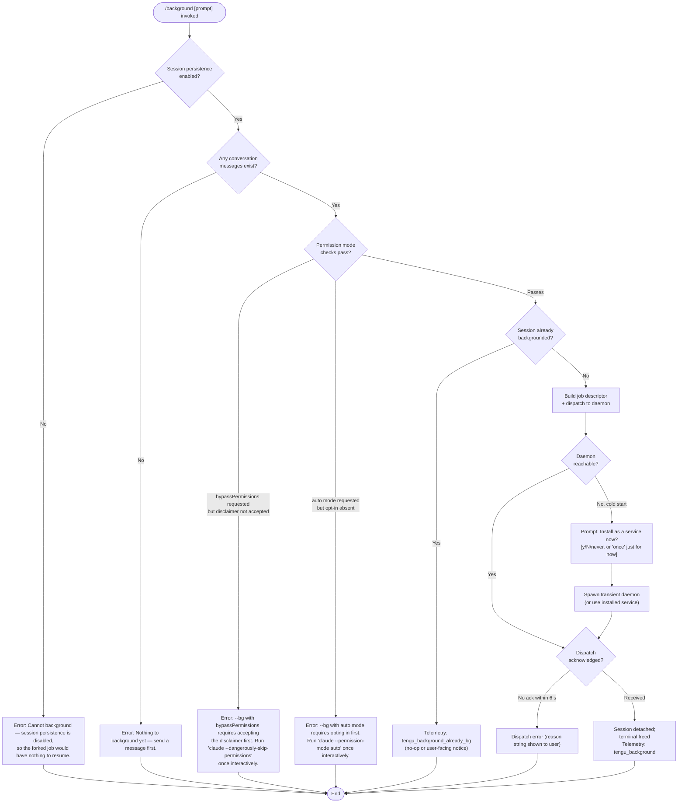

# `/background`

> Analysis basis: CC v2.1.143 bundle.js (AST extraction + Claude interpretation)
> Minimum version: v2.1.143

---

## Overview

The `/background` command (alias: `/bg`) detaches the current interactive Claude Code session from the terminal and hands it off to a background daemon process, freeing the terminal for other use. It serializes the session state, dispatches a job to the background daemon (starting a transient daemon if none is running), and optionally accepts a follow-up prompt to send along with the backgrounded job. Any unmet permission or daemon prerequisites cause the command to abort with a clear error message before any state is mutated.

---

## Registration

| Field | Value |
|---|---|
| type | `local-jsx` |
| name | `background` |
| description | `Send this session to the background and free the terminal` |
| argumentHint | `[prompt]` |
| aliases | `["bg"]` |
| immediate | `null` |
| module\_id | `oNq` |

Analysis basis: CC v2.1.143 bundle.js:+12023050

---

## Input Branching

The command handler performs a sequence of **guard checks** before dispatching. Each failed guard aborts and returns an error message to the user; no background work is done until all guards pass.



Analysis basis: CC v2.1.143 bundle.js:+12019280 (entry point), +12022497 (persistence guard), +12022673 (message guard), +12016973 (bypassPermissions guard), +12017135 (auto-mode guard), +12022430 (already-backgrounded telemetry)

---

## Behavioral Spec

### Guard: Session Persistence Check

```
function checkPersistenceEnabled(sessionState):
    if sessionState.persistenceDisabled:
        return Error("Cannot background — session persistence is disabled, " +
                     "so the forked job would have nothing to resume.")
    return OK
```

Analysis basis: CC v2.1.143 bundle.js:+12022497

---

### Guard: Conversation Non-Empty Check

```
function checkHasMessages(conversationHistory):
    if conversationHistory.length == 0:
        return Error("Nothing to background yet — send a message first.")
    return OK
```

Analysis basis: CC v2.1.143 bundle.js:+12022673

---

### Guard: Permission Mode Compatibility

```
function checkPermissionMode(currentArgs, userSettings):
    permMode = resolvePermissionMode(currentArgs)   // reads --permission-mode flag

    if permMode == "bypassPermissions":
        accepted = userSettings.dangerouslySkipPermissionsAccepted
        if not accepted:
            return Error("--bg with bypassPermissions requires accepting the disclaimer first. " +
                         "Run 'claude --dangerously-skip-permissions' once interactively.")

    if permMode == "auto":
        optedIn = userSettings.autoModeOptIn
        if not optedIn:
            return Error("--bg with auto mode requires opting in first. " +
                         "Run 'claude --permission-mode auto' once interactively.")

    return OK
```

Relevant permission-mode string constants (from literals):
- `"--permission-mode"` — flag name (bundle.js:+12016773)
- `"bypassPermissions"` — mode value (bundle.js:+12016804)
- `"--dangerously-skip-permissions"` — required interactive flag for bypass acceptance (bundle.js:+12016836)
- `"--allow-dangerously-skip-permissions"` — alternate form (bundle.js:+12016882)
- `"auto"` — auto-mode value (bundle.js:+12017115)

Analysis basis: CC v2.1.143 bundle.js:+12016973, +12017135

---

### Job Descriptor Construction

```
function buildJobDescriptor(session, extraPrompt, currentArgs):
    jobId = generateUUID().slice(0, 8)   // 8-character prefix of a random UUID

    descriptor = {
        jobId:       jobId,
        sessionId:   session.id,
        origin:      "bg",              // literal "bg"
        mode:        resolveInputMode(currentArgs),  // "repl" | "slash" | "resume" | "prompt"
        prompt:      extraPrompt,       // may be empty string
        model:       currentArgs.model,   // --model value or "default"
        effort:      currentArgs.effort,  // --effort value
        worktree:    session.worktree,
        toolSource:  resolveToolSource(session),  // "built-in" | "worktree" | "none"
        env: {
            CLAUDE_CONFIG_DIR:              process.env.CLAUDE_CONFIG_DIR,
            CLAUDE_INTERNAL_FC_OVERRIDES:   process.env.CLAUDE_INTERNAL_FC_OVERRIDES,
            AWS_REGION:                     process.env.AWS_REGION,
            AWS_DEFAULT_REGION:             process.env.AWS_DEFAULT_REGION,
            AWS_PROFILE:                    process.env.AWS_PROFILE,
            GOOGLE_APPLICATION_CREDENTIALS: process.env.GOOGLE_APPLICATION_CREDENTIALS,
            GOOGLE_CLOUD_PROJECT:           process.env.GOOGLE_CLOUD_PROJECT,
            GCLOUD_PROJECT:                 process.env.GCLOUD_PROJECT,
        }
    }
    return descriptor
```

- UUID generation uses `gNq.randomUUID()` (analysis basis: CC v2.1.143 bundle.js:+12001151)
- Slice length: **8 characters** (bundle.js:+12001183)
- `"--model"` flag: bundle.js:+12019439; `"--effort"` flag: bundle.js:+12019461; default literal: bundle.js:+12019485
- Input-origin literals: `"repl"` (bundle.js:+12003310), `"slash"` (bundle.js:+12003317), `"resume"` (bundle.js:+12003366), `"prompt"` (bundle.js:+12003457)
- Environment variable names: bundle.js:+12017751 through +12017906
- Tool-source literals: `"worktree"` (bundle.js:+12003621), `"built-in"` (bundle.js:+12003644), `"none"` (bundle.js:+12003666)

---

### Argument Forwarding to Background Worker

The daemon worker receives a reconstructed CLI argument vector. The following flags are forwarded or synthesized:

| Flag | Condition |
|---|---|
| `--agent` | Always passed (bundle.js:+12001635) |
| `--name` / `-n` | Session name, if set (bundle.js:+12001663, +12001680) |
| `--resume=<id>` / `-r=<id>` / `--resume` / `-r` | Resume-mode variants (bundle.js:+12015956, +12016011, +12016051, +12016067) |
| `--session-id=<id>` / `--session-id` | Session ID forwarding (bundle.js:+12016310, +12016369) |
| `--fork-session` | Fork mode flag (bundle.js:+12001865) |
| `-c` / `--continue` | Continue-mode flags (bundle.js:+12001754, +12001764) |
| `--permission-mode` | Permission mode (bundle.js:+12016773) |
| `--dangerously-skip-permissions` | Bypass flag if applicable (bundle.js:+12016836) |
| `--` | Argument terminator (bundle.js:+12016739) |

The separator `"--"` is detected in the argument list to distinguish the prompt boundary. Analysis basis: CC v2.1.143 bundle.js:+12016739

---

### Daemon Lifecycle Management

```
function ensureDaemonRunning(userSettings):
    status = checkDaemonStatus()

    if status == "up":
        return daemonConnection

    if userSettings.daemonInstallPolicy == "ask":
        emit telemetry "tengu_bg_daemon_cold_start_ask"
        answer = promptUser("Install as a service now? [y/N/never, or 'once' just for now] ")
        emit telemetry "tengu_bg_daemon_cold_start_ask_answer"

        if answer in ["yes", "y"]:
            installService()
            emit telemetry "tengu_bg_daemon_install"
            waitForDaemon(timeoutMs=5000)   // 5 s poll
            if not reachable:
                raise Error("service installed but the daemon did not become reachable " +
                            "within 5s — check 'claude daemon status'")
        elif answer == "once":
            spawnTransient()
        elif answer == "never":
            persistNeverInstall()
        else:  // "no" or Enter
            spawnTransient()
    else:
        spawnTransient()

    return daemonConnection
```

- Service install timeout: **5000 ms** (bundle.js:+11971378)
- Prompt literal: `"Install as a service now? [y/N/never, or 'once' just for now] "` (bundle.js:+11970847)
- Answer literals: `"yes"` (bundle.js:+11970978), `"once"` (bundle.js:+11971000), `"never"` (bundle.js:+11971024), `"no"` (bundle.js:+11971713)

For transient spawns, the daemon is invoked with `--origin transient --spawned-by <pid>` flags (bundle.js:+11967764, +11967775, +11967787).

Analysis basis: CC v2.1.143 bundle.js:+11967386, +11970847, +11966363

---

### Transient Daemon Start Timeouts

| Phase | Timeout |
|---|---|
| Initial connection attempt | 30 000 ms (bundle.js:+11968028) |
| Extended wait if daemon is starting | 60 000 ms (bundle.js:+11968050) |

If the transient daemon is unreachable after both windows, telemetry `tengu_bg_daemon_spawn_failed` is emitted and the command fails. Analysis basis: CC v2.1.143 bundle.js:+11967820, +11968380

---

### Stale Daemon Service Detection

```
function checkServiceExecPath():
    installedPath = readServiceExecPath()
    if not fileExists(installedPath):
        emit telemetry "tengu_bg_daemon_service_stale_exec"
        log("daemon service exec path is stale (binary deleted) — " +
            "falling back to transient spawn. " +
            "Run 'claude daemon install' to repair.")
        return FALLBACK_TRANSIENT
    return OK
```

Analysis basis: CC v2.1.143 bundle.js:+11966438, +11966481

---

### Job Dispatch

```
function dispatchJob(descriptor, daemonSocket):
    writeDispatchFile(descriptor)     // atomic write via randomBytes temp + rename
    sendDispatchMessage(daemonSocket, type="cli-bg-dispatch")

    // Wait for daemon acknowledgment
    ack = waitForAck(timeoutMs=6000)  // 6 s window
    if not ack:
        emit telemetry "tengu_bg_dispatch" with reason="no ack"
        raise DispatchError("no ack")

    emit telemetry "tengu_bg_dispatch"
    return ack.jobId
```

- Dispatch type string: `"cli-bg-dispatch"` (bundle.js:+11997211)
- Dispatch file name: `"daemon.status.json"` (bundle.js:+11707334)
- Acknowledgment timeout: **6000 ms** (bundle.js:+11997452)
- No-ack literal: `"no ack"` (bundle.js:+11997296)

Atomic write uses `Vr8.randomBytes(4)` for the temp-file suffix (bundle.js:+12001183 for slice length), then `ba.rename` to atomically replace. Analysis basis: CC v2.1.143 bundle.js:+11997207, +11997381, +11997927

---

### Dispatch Error Reason Mapping

The user-facing error message for a failed dispatch is chosen from the following set:

| Internal reason | User-visible string |
|---|---|
| `"daemon-unreachable"` | `"not running"` (bundle.js:+12006540) |
| `"ack-timeout"` | `"timed out"` (bundle.js:+12006578) |
| `"dispatch-write"` | `"couldn't write dispatch file"` (bundle.js:+12006617) |
| `"enoconn"` | `"socket missing"` (bundle.js:+12006668) |
| `"estarting"` | `"service still starting"` (bundle.js:+12006707) |
| `"stale-short"` / `"short-alive"` | `"id collision with a prior job"` (bundle.js:+12006756) |

Analysis basis: CC v2.1.143 bundle.js:+12005324, +12006540 – +12006756

---

### Dispatch Rescue / Retry Logic

```
function dispatchWithRescue(descriptor, daemon):
    try:
        return dispatchJob(descriptor, daemon)
    except DispatchError as e:
        if e.reason == "short_alive":
            raise Error("Previous session is still shutting down — try again in a moment")
        if e.reason == "stale_short":
            // job ID collided with a prior job; already handled above
            raise
        emit telemetry "tengu_bg_dispatch_rescued"
        // attempt connection via alternate socket path
        altSocket = resolveAlternateDaemonSocket()
        return dispatchJob(descriptor, altSocket)
```

Analysis basis: CC v2.1.143 bundle.js:+12004200, +12005047 (`"short_alive"`), +12005109, +12005187 (`"stale_short"`)

---

### Session Detachment and Terminal Release

```
function detachSession(sessionState, appState):
    appState.setTitle("(backgrounded)")     // shown in process list / title bar
    sessionState.markBackgrounded()
    stopInputLoop()
    releaseTerminal()
    emit telemetry "tengu_background"
```

- Title literal: `"(backgrounded)"` (bundle.js:+12020499)
- AbortSignal timeout for the overall handshake: **120 s** (bundle.js:+12020306)

Analysis basis: CC v2.1.143 bundle.js:+12019848, +12020499, +12020306

---

### Daemon Worker Startup (Background Side)

Once the daemon receives the dispatch message, it launches an internal worker identified by the string `"daemon-worker"` (bundle.js:+2169307). The worker process type is `"task"` (bundle.js:+10113123) and the detach channel is labeled `"detach-request"` (bundle.js:+10118455). The worker writes progress updates back through its control socket using the `"supervisor"` channel (bundle.js:+14516324).

Analysis basis: CC v2.1.143 bundle.js:+2169307, +10113123, +10118455

---

### Gate-Blocked Early Exit

If a feature-gate check prevents the job from being accepted, the result code `"gate_blocked"` is returned and the session is **not** detached. Analysis basis: CC v2.1.143 bundle.js:+12001126

---

## State & Side Effects

| Item | Detail |
|---|---|
| **Telemetry — background command** | `tengu_background` (bundle.js:+12019848) — successful dispatch |
| **Telemetry — already backgrounded** | `tengu_background_already_bg` (bundle.js:+12022430) — command invoked on an already-detached session |
| **Telemetry — spawn failed** | `tengu_background_spawn_failed` (bundle.js:+12019779) — daemon could not be started |
| **Telemetry — dispatch** | `tengu_bg_dispatch` (bundle.js:+11999065) — job sent to daemon |
| **Telemetry — dispatch fallback** | `tengu_bg_dispatch_fallback` (bundle.js:+11999591) — dispatch used alternate path |
| **Telemetry — dispatch rescued** | `tengu_bg_dispatch_rescued` (bundle.js:+12004200) — retry on alternate socket succeeded |
| **Telemetry — daemon install** | `tengu_bg_daemon_install` (bundle.js:+11966821) — user confirmed service installation |
| **Telemetry — cold start ask** | `tengu_bg_daemon_cold_start_ask` (bundle.js:+11967386) — user prompted to install daemon |
| **Telemetry — cold start answer** | `tengu_bg_daemon_cold_start_ask_answer` (bundle.js:+11970922) — user answer recorded |
| **Telemetry — stale exec** | `tengu_bg_daemon_service_stale_exec` (bundle.js:+11966438) — installed service binary missing |
| **Telemetry — spawn failed** | `tengu_bg_daemon_spawn_failed` (bundle.js:+11967820) — transient daemon did not start |
| **Telemetry — daemon poll fallthrough** | `tengu_bg_daemon_service_poll_fallthrough` (bundle.js:+11967062) — platform poll path not matched |
| **Telemetry — daemon config reload** | `tengu_daemon_config_reload` (bundle.js:+14517117) — daemon reloaded config on reconnect |
| **Telemetry — config errors** | `tengu_config_parse_error`, `tengu_config_lock_contention`, `tengu_config_stale_write`, `tengu_config_auth_loss_prevented` — config I/O side effects during session serialization |
| **appState changes** | Session title set to `"(backgrounded)"` (bundle.js:+12020499); input loop stopped; terminal stdin released |
| **File system** | Dispatch file `daemon.status.json` written atomically to the jobs directory (bundle.js:+11707334, +4021960); job directory created under the daemon data path (bundle.js:+12001211) |
| **Hook registration** | `at_.register` called during daemon socket lifecycle setup (bundle.js:+56977) — registers an exit/cleanup hook for the daemon connection |
| **Sound** | None found in depth-2 traversal |

---

## Version History

| Version | Change |
|---|---|
| v2.1.143 | Initial analysis — `/background` (alias `/bg`) introduced with daemon dispatch, permission guards, and transient daemon support |

---

## Common Mistakes

1. **Invoking `/background` before sending any message.** The command aborts with `"Nothing to background yet — send a message first."` The session must have at least one human message in its history before it can be backgrounded.

2. **Using `--permission-mode bypassPermissions` without prior interactive acceptance.** The disclaimer must have been accepted once by running `claude --dangerously-skip-permissions` interactively. The background path cannot prompt for this acceptance and will fail fast.

3. **Using `--permission-mode auto` without prior opt-in.** Similarly, auto mode requires a one-time interactive `claude --permission-mode auto` run to record the opt-in. Background dispatch will error without it.

4. **Running `/background` when session persistence is disabled.** If the project or user configuration disables session persistence, there is no persisted state to resume from the daemon side and the command refuses with an explicit error.

5. **Assuming the terminal is freed immediately.** The command waits up to **120 seconds** (bundle.js:+12020306) for the full handshake including daemon acknowledgment. If the daemon acknowledges within the **6-second** window (bundle.js:+11997452) the terminal is released promptly; if not, an error is shown and the session remains attached.

6. **Expecting the command to install the daemon silently.** When no daemon is running, the command interactively prompts the user. Answering `"never"` persists that preference and subsequent `/background` calls will always use a transient spawn, not a persistent service.

7. **Stale service binary.** If the Claude binary that installed the daemon service has been replaced (e.g., by an upgrade), the service exec path is stale. The command falls back to a transient spawn and logs a repair instruction, but the job still proceeds. Run `claude daemon install` to repair.

---

## Appendix — Identifier Mapping

> For bundle debugging only. Identifiers change across versions.

| Identifier | Role |
|---|---|
| `A28` | Background command handler (main entry-point function) |
| `TV` | Get-arguments helper (reads parsed CLI arguments for the current session) |
| `rf` | Conversation-history accessor |
| `ig_` | Hook-registration dispatcher |
| `KL` | Hook registry lookup |
| `h9` | Event-emitter / hook registration target (`at_.register`) |
| `m6H` | Job-descriptor builder and dispatch orchestrator |
| `$u7` | Permission-mode resolver and guard evaluator |
| `H` | Random-element / weighted-pick utility (uses `Math.random` + `setTimeout`) |
| `p6H` | Argument-slice helper (parses permission-mode flags from argv) |
| `q` | Filesystem module wrapper (sync I/O: `unlinkSync`, `readFileSync`, etc.) |
| `A` | String-array includes helper (lowercases tool names) |
| `f` | Stream/connection pair object (`A.close`, `q.close`) |
| `fu` | Settings-reader facade |
| `I8` | Multi-source settings loader (`userSettings`, `localSettings`, etc.) |
| `N6` | Config read-with-lock function |
| `x6` | Config-file path resolver |
| `z9_` | Config schema validator |
| `H$H` | Config file reader (reads, parses, backs up config JSON) |
| `nhL` | File-watch setup for config hot-reload |
| `TR` | Auto-mode consent checker |
| `v` | Logger / debug emitter |
| `$` | Active-session registry |
| `JZq` | Daemon status file writer |
| `ha` | Log-file path helper |
| `d1` | Async-local-storage accessor (`znL.getStore`) |
| `r06` | Daemon status file path builder |
| `hH` | JSON serializer wrapper (`JSON.stringify`) |
| `IK` | Jobs-directory path builder |
| `b0` | Base data-directory path builder |
| `tx7` | Full background-dispatch pipeline function |
| `lNq` | Resume-flag argument parser (`--resume=`, `-r=`, `--resume`, `-r`) |
| `zu7` | Permission-set membership checker |
| `K` | Column/pad formatter for display |
| `Y` | Background-job writer and supervisor manager |
| `XJH` | Job metadata record builder |
| `cIq` | Token-budget calculator for jobs |
| `T` | Input-event interceptor (`preventDefault` + session queue) |
| `Z` | Supervisor/heartbeat controller |
| `G_K` | Heartbeat emitter |
| `V` | Supervisor start/stop controller |
| `d` | Error reporter / structured-error emitter |
| `F` | MCP-tool-name filter (checks `mcp__` prefix) |
| `c6` | Key-input handler |
| `P6` | Permission-set map (contains `"orphaned-permission"`) |
| `fu7` | Session-ID flag parser (`--session-id=`, `--session-id`) |
| `_` | Generic accumulator / array builder |
| `nNq` | Fork-session and continue-flag parser |
| `S6` | Settings-store accessor (`Uh6` + `__`) |
| `Uh6` | Settings async-local-storage reader |
| `__` | Global-variable accessor (maps to `GV`) |
| `s1` | Job-state file reader/writer (order, stateOrder, stat, readFile, etc.) |
| `$8` | Warning logger (level `"warn"`) |
| `R6` | JSON parser wrapper (`JSON.parse`) |
| `Bf` | Atomic file writer (randomBytes temp + rename) |
| `eO` | Low-level atomic-write implementation |
| `o2` | Job-cache invalidator (`f3H.delete`) |
| `_1H` | Working/active path resolver |
| `P7` | Path display formatter (redacts sensitive segments with `"[REDACTED]"`) |
| `uNq` | Message summary mapper |
| `XH` | String coercer (wraps `String()`) |
| `Mu7` | Message-slice preparer |
| `Yu7` | Yield helper for backgrounded output |
| `Ug_` | Background dispatch executor (connects to daemon, handles ack, manages socket lifecycle) |
| `VG6` | Daemon installation prompt handler |
| `AU` | Daemon ensure-running orchestrator |
| `mg_` | Dispatch-path scrubber (redacts path segments in error messages) |
| `Rw8` | Daemon control-socket lease handler |
| `YNH` | Daemon dispatch-file path builder |
| `v3` | Daemon IPC socket client (connect, write, read, handle ENOCONN/ETIMEOUT) |
| `pNq` | Dispatch-attempt error categorizer |
| `r8` | Abort-signal-aware timer (setTimeout + clearTimeout + unref) |
| `UU` | Job-list fetcher |
| `Bw` | Background-service label emitter (emits `"background service"` / amber-anchor telemetry) |
| `tMH` | Amber-anchor helper (wraps `G6`) |
| `Hu7` | Job-status field accessor |
| `smH` | Daemon platform-status poller |
| `D9H` | Platform-specific status resolver (wraps `TF`) |
| `L8` | Structured error factory |
| `AV8` | Model-flag passthrough builder |
| `$LH` | Session-context bootstrapper for background worker |
| `a6` | Global-config writer (save with fallback) |
| `P9_` | Config-file writer with lock and backup rotation (up to 5 backups, bundle.js:+3163227) |
| `L` | Pending-write set manager (`q.add`, `q.delete`) |
| `heA` | Atomic config writer helper |
| `d76` | Config-diff checker |
| `X9_` | Config backup path builder |
| `X` | MCP-server connection orchestrator |
| `yA6` | Atomic file writer with permission preservation (`fchmodSync`, `fsyncSync`) |
| `emH` | Config-change event emitter |
| `OZ9` | Config-entry iterator (`Object.entries`) |
| `HpH` | Config-lock timestamp recorder |
| `j9_` | Per-file config writer |
| `kO6` | Effort-flag passthrough builder |
| `SEH` | Session-origin tagger |
| `OaH` | JSX render function for background-command UI component |
| `nJ8` | Message-history normalizer (joins arrays, slices) |
| `aN` | Background-session React component renderer |
| `HK` | UI component: heading/title renderer |
| `VY8` | Context-window snapshot builder (hashes, UUIDs, file reads) |
| `ZY8` | Context-window schema validator |
| `i0` | Conversation-message compiler (tool schemas, normalization, compaction) |
| `Z47` | Message-block flattener |
| `X6q` | Image-block encoder |
| `xH` | String-to-buffer coercer |
| `w8` | Session-instance factory (UUID + kill map) |
| `j` | Active-session weak reference |
| `J` | Session-map iterator (signals SIGTERM to active jobs) |
| `BNH` | Background-session runner (wraps `Jhq` + `aS_`) |
| `aS_` | Context snapshot assembler |
| `Jhq` | Core query-execution engine (API calls, streaming, tool dispatch) |
| `XP` | API client factory |
| `DA` | Provider-type resolver |
| `bf` | Bedrock/Vertex credential builder |
| `R1` | Retry-policy builder |
| `yxH` | Auth-header injector |
| `y0` | Stream-result finalizer |
| `DK` | Tool-schema filter |
| `_u` | Whitespace trimmer |
| `T3` | Compact-boundary message builder |
| `t$7` | Compact-boundary sentinel creator |
| `UP` | Compact-boundary token |
| `M3H` | Job-file read/write coordinator |
| `V6` | Data-directory path resolver (uses `GV`) |
| `GV` | Platform data-directory base (XDG / macOS / Windows aware) |
| `x0` | Job-file basename resolver |
| `NH` | Structured notification emitter (queues to `xRH`, logs errors via `Wc.logError`) |
| `v_` | Error/string coercion utility |
| `zq` | Notification queue accessor |
| `A$A` | Notification formatter |
| `kNK` | Ring-buffer manager for notifications (`Ch6.shift` / `Ch6.push`) |
| `q28` | Background-command JSX sub-renderer |
| `rS` | Array-type assertion helper |
| `O` | Output stream / N8 wrapper |
| `N8` | Terminal output writer |
| `WD8` | "Some" predicate over tool list |
| `vb` | Permission-gate evaluator |
| `kQ` | Tool-permission checker |
| `foH` | Slash-command prefix detector (`H.startsWith`) |
| `g3` | Environment-tag builder (uses `V6` + `KL`) |
| `pp` | Process-tag builder (uses `V6` + `KL`) |
| `Du7` | Background-command top-level JSX component |
| `T1` | Daemon-worker bootstrap (`cB`) |
| `cB` | Worker entry point |
| `fLH` | Detach-request dispatcher (writes task/detach-request to daemon) |
| `XF6` | Worker channel multiplexer |
| `PKq` | Task-channel handler (`bDH`, `N8`) |
| `bDH` | Task message decoder |
| `ri` | IPC write helper (`ii.write`) |
| `z6H` | Worker heartbeat sender |
| `EJH` | Environment-mode detector (`"production"` / `"test"`) |
| `_yq` | Test-mode flag reader |
| `sh` | Production-mode sentinel |