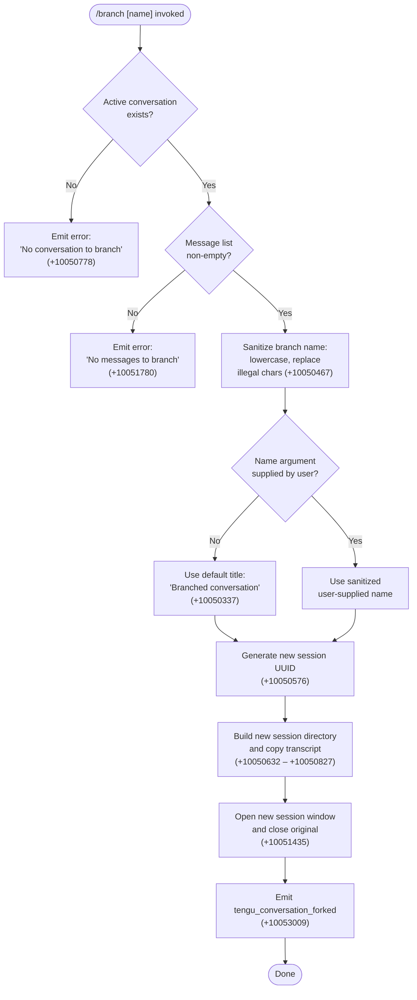

# `/branch`

> Analysis basis: CC v2.1.143 bundle.js (AST extraction + Claude interpretation)
> Minimum version: v2.1.143

---

## Overview

The `/branch` command (also invocable as `/fork`) creates a divergent copy of the current conversation at the point it is issued, preserving all messages up to that point and initializing a fresh session that carries those messages forward as its initial history. Internally it clones the conversation transcript into a new on-disk session file, opens a new session against that file, and emits the `tengu_conversation_forked` telemetry event upon success.

---

## Registration

| Field | Value |
|---|---|
| type | `local-jsx` |
| name | `branch` |
| description | Create a branch of the current conversation at this point |
| argumentHint | `[name]` |
| aliases | `["fork"]` |
| module\_id | `VC_` |

Analysis basis: CC v2.1.143 bundle.js:+11482531

---

## Input Branching

The command entry point inspects the current conversation state and user-supplied name argument before deciding which execution path to follow.



---

## Behavioral Spec

### Name Sanitization

When the user provides an optional `[name]` argument the implementation lower-cases the raw string before passing it through a character-replacement step that substitutes any characters not suitable for a file-system path segment.

```
function sanitizeBranchName(rawInput):
    lower = rawInput.toLowerCase()          // +14528099
    safe  = lower.replace(ILLEGAL_CHARS, REPLACEMENT)  // +10050467
    return safe
```

If no argument is given, the branch title defaults to the string `"Branched conversation"`.

Analysis basis: CC v2.1.143 bundle.js:+10050337, +10050467, +14528099

---

### Conversation Existence Guard

Before any file I/O is performed the command verifies that a conversation is active and that it contains at least one message. Two distinct error strings are used for each failure mode.

```
function assertBranchable(conversation):
    if conversation is null or undefined:
        raise UserFacingError("No conversation to branch")   // +10050778
    if conversation.messages is empty:
        raise UserFacingError("No messages to branch")       // +10051780
```

Analysis basis: CC v2.1.143 bundle.js:+10050778, +10051780

---

### Session UUID Generation

A fresh universally-unique identifier is generated via the platform's built-in `randomUUID` API. This identifier becomes the canonical session identifier for the new branch.

```
function generateBranchSessionId():
    return crypto.randomUUID()    // +10050576
```

Analysis basis: CC v2.1.143 bundle.js:+10050576

---

### Transcript Copy Pipeline

The existing conversation transcript is read from its on-disk representation and written to a new path derived from the branch session identifier. The pipeline uses streaming I/O.

```
function copyTranscriptToBranch(sourcePath, destDir, sessionId):
    mkdir(destDir, { recursive: true })          // +10050632
    readStream  = createReadStream(sourcePath,   // +10050681
                      encoding="utf8",           // +10050714
                      flags="open")              // +10050740
    writeStream = createWriteStream(destPath)    // +10050827

    readStream.once("error", handler)            // +10050729
    readStream.pipe(writeStream)

    await streamFinished(writeStream)            // +10052190

    if error during copy:
        unlink(destPath)                         // +10051041
        raise error
```

The read buffer size observed in the implementation is 448 bytes per chunk.

Maximum read chunk size: 448 bytes (Analysis basis: CC v2.1.143 bundle.js:+10050663)

Analysis basis: CC v2.1.143 bundle.js:+10050632, +10050681, +10050714, +10050729, +10050827, +10051041, +10052190

---

### Message List Processing

After the transcript file is established, the implementation maps over the copied message list to build the initial history for the new session. Each message entry is classified by role, and the content type `"text"` is used when constructing plain-text entries.

```
function buildInitialHistory(messages):
    result = []
    for each message in messages:
        entry = {
            role:    message.role,        // one of "user","assistant","system","attachment"
            content: message.content,
            type:    "text"              // +10050410
        }
        result.push(entry)
    return result
```

Role values recognised: `"user"` (+12112147), `"assistant"` (+12112164), `"attachment"` (+12112186), `"system"` (+12112209).

Analysis basis: CC v2.1.143 bundle.js:+10050410, +12112147, +12112164, +12112186, +12112209

---

### Session Title Metadata

The branch session is tagged with a `"custom-title"` metadata key when a user-supplied name is provided, matching the pattern used by the conversation rename pathway.

```
function applyBranchMetadata(session, resolvedName):
    if resolvedName != default:
        session.metadata["custom-title"] = resolvedName   // +12141026
    session.metadata["fork"] = true                       // +10053530
```

Analysis basis: CC v2.1.143 bundle.js:+12141026, +10053530

---

### Error Handling — ENOENT

When the source transcript file is missing (error code `"ENOENT"`), the error is caught and re-raised as a user-facing message rather than a raw OS error.

```
function handleCopyError(err):
    if err.code == "ENOENT":        // +171902
        raise UserFacingError("No conversation to branch")
    else:
        raise err
```

Analysis basis: CC v2.1.143 bundle.js:+171902, +10050778

---

### New Session Activation and Old Session Closure

Once the branch transcript has been fully written and the new session object is ready, the implementation closes the current session window and opens the branched session. An `"auto"` disposition value is passed when opening to allow the runtime to choose the preferred display mode.

```
function activateBranchSession(currentSession, branchSession):
    currentSession.close()         // +10051435
    branchSession.open(mode="auto") // +10052963
```

Analysis basis: CC v2.1.143 bundle.js:+10051435, +10052963

---

### Content-Replacement Marker

During the copy pipeline a `"content-replacement"` marker string is emitted into the write stream at the splice boundary, allowing downstream consumers to identify where the fork point was inserted in the serialized transcript.

Analysis basis: CC v2.1.143 bundle.js:+10051258

---

### Progress Reporting

The command emits incremental `"progress"` status updates to the UI layer during the file-copy phase, allowing the user to see that work is underway.

Analysis basis: CC v2.1.143 bundle.js:+10051698

---

### Unknown Error Fallback

If any uncaught error propagates out of the copy or session-open pipeline, the command surfaces the string `"Unknown error occurred"` as the terminal user-facing message.

Analysis basis: CC v2.1.143 bundle.js:+10053678

---

## State & Side Effects

| Item | Detail |
|---|---|
| Telemetry | `tengu_conversation_forked` (+10053009) emitted on successful branch; `tengu_session_renamed` (+12141118) emitted if a custom title is applied; `tengu_agent_name_set` (+12144147) emitted if an agent name is propagated to the new session |
| Disk writes | New session directory created under the CC sessions store; transcript file written via streaming pipeline |
| Disk reads | Source conversation transcript read as a stream |
| Disk cleanup | Partial destination file unlinked on copy failure (+10051041) |
| Session state | Current session closed; new branch session opened in its place |
| Fork marker | `"content-replacement"` token written at the branch splice point (+10051258) |
| Session metadata | `"fork"` flag and optional `"custom-title"` written to the new session's metadata |
| Background daemon | Background session infrastructure (`tengu_bg_*` events) is active during the command but those events originate from the daemon subsystem, not from the branch operation itself |
| Sound | <!-- TODO: not found in depth-2 traversal; needs --depth 4 --> |
| Hook registration | <!-- TODO: not found in depth-2 traversal; needs --depth 4 --> |
| appState changes | Session map updated: new branch session entry added; prior session entry removed or closed |

---

## Version History

| Version | Change |
|---|---|
| v2.1.143 | Initial analysis |

---

## Common Mistakes

1. **Invoking `/branch` with no active conversation** — the command immediately exits with `"No conversation to branch"` and performs no file I/O. Start at least one exchange before branching.
2. **Invoking `/branch` on an empty conversation** — if the conversation exists but contains zero messages the command exits with `"No messages to branch"`. Send at least one message first.
3. **Expecting the original session to remain open** — `/branch` closes the originating session window and opens the branch in its place. The original session is not preserved as a second open window.
4. **Supplying a name with upper-case letters or special characters** — the name is automatically lower-cased and sanitized, so the displayed branch name may differ from what was typed.
5. **Assuming `/fork` and `/branch` are separate commands** — `fork` is a registered alias for `branch` and produces identical behavior.
6. **Interrupting the command mid-copy** — if the process is terminated while the transcript copy is in progress the partial destination file is cleaned up, but the branch session entry may be left in an inconsistent state. Reissue `/branch` from the original session if this occurs.

---

## Appendix — Identifier Mapping

> For bundle debugging only. Identifiers change across versions.

| Identifier | Role |
|---|---|
| `s1q` | Branch name sanitization function |
| `t1q` | Transcript copy and session initialization pipeline (core branch executor) |
| `e1q` | Top-level branch command handler (orchestrator called by `LO7`) |
| `LO7` | Command dispatch entry point for `/branch` |
| `KO7` | Session slot lookup and message-index tracker |
| `v_` | Generic error constructor / error code classifier |
| `xH` | String coercion utility |
| `zq` | Essential-traffic queue manager |
| `kNK` | Shift-push queue rotation helper |
| `NH` | Background session spawn controller |
| `GV` | Persistent state writer |
| `__` | State patch / merge utility |
| `QZ` | Conversation serializer (builds on-disk representation) |
| `Ip` | Message role validator |
| `g5` | Role-keyed message list builder |
| `V6` | Session store accessor |
| `l$` | Message list accessor |
| `R6` | JSON parse wrapper |
| `hH` | JSON stringify wrapper |
| `m1` | String slice utility (index-based) |
| `Ub` | Custom-title metadata writer |
| `bKH` | Agent-name metadata writer |
| `g3` | Session config builder |
| `$8` | ENOENT error handler |
| `L8` | Error logging sink |
| `W` | Conversation event emitter / update dispatcher |
| `I3H` | Config-change event handler |
| `IBH` | Background session health checker |
| `rHH` | Policy settings reloader |
| `LY8` | Skills registry updater |
| `JrH` | Pending-operation queue cleaner |
| `v` | Debug-level log formatter |
| `P` | IPC socket message framer / reader |
| `Vf` | IPC socket message finalizer |
| `cq5` | Background daemon protocol handler (attach / kill / resize / respawn) |
| `XH` | Buffer-to-string converter |
| `XJH` | Session persistence writer |
| `cIq` | Session config diff calculator |
| `G_K` | Daemon heartbeat scheduler |
| `Y` | Session close and config-reload orchestrator |
| `q` | Unix socket unlink helper |
| `T` | Remote-control startup interceptor |
| `Z` | Daemon lifecycle manager (start / stop / updateConfig) |
| `J` | Process registry / kill-all helper |
| `y` | Background worker write-and-signal helper |
| `D` | Background process spawn and lifecycle manager |
| `G6` | Background job registry lookup |
| `IG6` | Platform-aware process inspector (macOS / generic) |
| `$o_` | Bun-based background PTY spawner |
| `d` | Deferred promise / async resolver |
| `O` | Writable stream wrapper for IPC pipe |
| `N8` | Stream drain handler |
| `H` | Random-jitter retry scheduler |
| `j` | Foreground session process manager |
| `w` | Active session map manager |
| `Ap` | Session activation helper |
| `$` | Session object (dispose / destroy methods) |
| `KL` | Session key formatter |