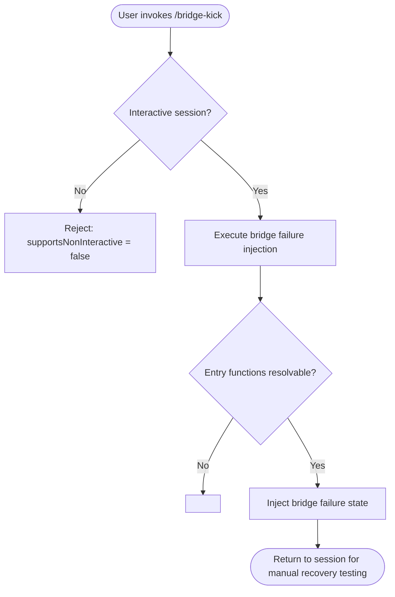

# `/bridge-kick`

> Analysis basis: CC v2.1.132 bundle.js (AST extraction + Claude interpretation)
> Minimum version: v2.1.132

---

## Overview

`/bridge-kick` is a local slash command that injects bridge failure states into the running Claude Code session for the purpose of manual recovery testing. It is intended as a developer/debug tool, allowing operators to simulate bridge disruption scenarios without waiting for naturally occurring failures. Because it targets interactive recovery workflows, it does not support non-interactive execution.

---

## Registration

| Field | Value |
|---|---|
| type | `local` |
| name | `bridge-kick` |
| description | `Inject bridge failure states for manual recovery testing` |
| supportsNonInteractive | `false` |

Analysis basis: CC v2.1.132 bundle.js:+11273104

---

## Input Branching

The AST traversal at depth ≤ 2 returned an empty call graph and no extracted literals for this command's entry module. The note recorded during extraction states: `no entry functions found for module 'undefined'`. As a result, no branching logic could be verified from the bundle.

<!-- TODO: not found in depth-2 traversal; needs --depth 4 -->

The following flowchart reflects the only structural facts that are confirmed: the command is registered as `local` and rejects non-interactive invocation.



---

## Behavioral Spec

### Command Dispatch

```
function dispatchBridgeKick(session):
    if not session.isInteractive:
        raise UnsupportedError("bridge-kick requires an interactive session")

    injectBridgeFailureState(session)
```

Analysis basis: CC v2.1.132 bundle.js:+11273104

### Bridge Failure Injection

```
function injectBridgeFailureState(session):
    # Implementation details not recoverable from depth-2 traversal.
    # Expected behavior based on description: set one or more bridge
    # subsystem flags to a failure or degraded state so that the
    # operator can exercise manual recovery paths.
    pass
```

<!-- TODO: not found in depth-2 traversal; needs --depth 4 -->

---

## State & Side Effects

| Item | Detail |
|---|---|
| Telemetry | None detected at depth ≤ 2 <!-- TODO: not found in depth-2 traversal; needs --depth 4 --> |
| Hook registration | <!-- TODO: not found in depth-2 traversal; needs --depth 4 --> |
| appState changes | <!-- TODO: not found in depth-2 traversal; needs --depth 4 --> |
| Sound | <!-- TODO: not found in depth-2 traversal; needs --depth 4 --> |
| Non-interactive support | Explicitly disabled (`supportsNonInteractive: false`) |

Analysis basis: CC v2.1.132 bundle.js:+11273104

---

## Version History

| Version | Change |
|---|---|
| v2.1.132 | Initial analysis — registration confirmed; implementation body not resolved at depth ≤ 2 |

---

## Common Mistakes

1. **Running in non-interactive mode** — `/bridge-kick` will be rejected if invoked from a pipeline or any context where `supportsNonInteractive` would need to be `true`. Always invoke it from an active interactive terminal session.
2. **Expecting automated recovery** — The description explicitly states this command is for *manual* recovery testing. It injects a failure state but does not perform any automated remediation; the operator must take recovery action themselves.
3. **Assuming idempotency without verification** — Because the implementation body was not resolved in this analysis pass, it is unknown whether invoking `/bridge-kick` multiple times in the same session accumulates failure states or resets to a canonical failure state each time. <!-- TODO: not found in depth-2 traversal; needs --depth 4 -->
4. **Using in production sessions** — This command is a fault-injection tool. Invoking it in a session performing real work will disrupt the bridge subsystem by design.

---

## Appendix — Identifier Mapping

> For bundle debugging only. Identifiers change across versions.

| Identifier | Role |
|---|---|
| *(none)* | No obfuscated identifiers were returned by the depth-2 AST traversal for this command. <!-- TODO: not found in depth-2 traversal; needs --depth 4 --> |