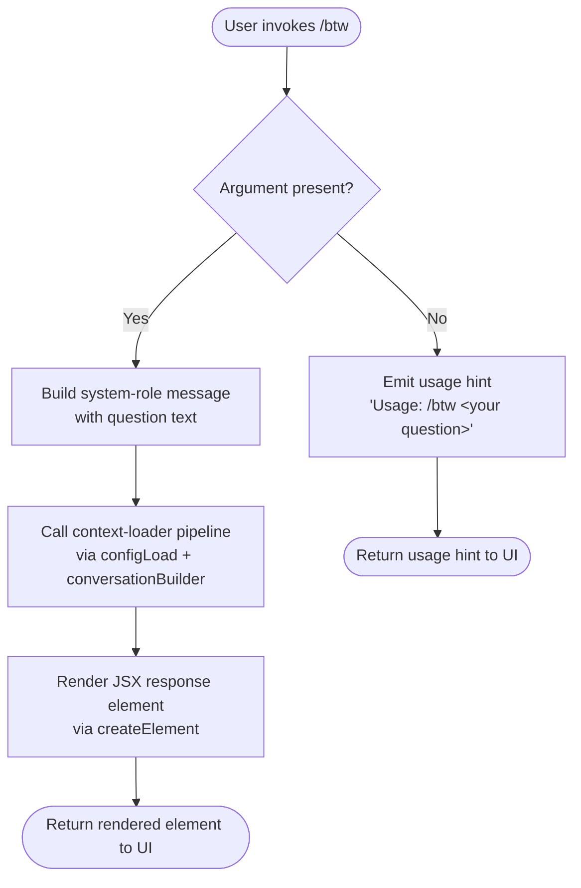

```
---
type: feature-spec
feature: "btw"
cc_version: "2.1.143"
updated: "2026-06-01"
tags: ["btw", "commands", "slash-commands"]
source: "bundle-analysis"
bundle_verified: true
analysis_basis: "CC v2.1.143 bundle.js (AST extraction + Claude interpretation)"
author: "ryujaeuk <ryujaeuk@gmail.com>"
repository: "https://github.com/MyLittleLuckyDog/cc-gnothi"
license: "AGPL-3.0-only"
---

# `/btw`

> Analysis basis: CC v2.1.143 bundle.js (AST extraction + Claude interpretation)
> Minimum version: v2.1.143

---

## Overview

The `/btw` ("by the way") command allows users to pose a quick side question to the agent without interrupting or derailing the main conversation flow. It is a `local-jsx` command that dispatches as a `control-request` to the thin client and executes immediately upon invocation. The handler is an async function that injects the question as a `system`-role message and renders a JSX element in response.

---

## Registration

| Field | Value |
|---|---|
| type | `local-jsx` |
| name | `btw` |
| description | Ask a quick side question without interrupting the main conversation |
| argumentHint | `<question>` |
| immediate | `true` |
| thinClientDispatch | `control-request` |
| module_id | `Aqq` |
| load_inline | `true` |
| loc_byte | `10059586` |
| loc_byte_end | `10059825` |
| loc_line | `5577` |
| arbor_handler.name | `JO7` |
| arbor_handler.fqn | `claude-2.1.143::JO7` |
| arbor_handler.kind | `AsyncFunction` |
| arbor_handler.resolution_path | `module_id` |
| arbor_handler.n_hits | `0` |

Analysis basis: CC v2.1.143 bundle.js:+10059586

---

## Input Branching

The command has two distinct input branches: the user provides no argument (bare `/btw`), or the user supplies a question string. Two paths suffice for a pseudocode representation.

1. **No argument supplied** — handler detects an empty or absent `<question>` token and emits the usage hint string `"Usage: /btw <your question>"` (bundle.js:+10059184) without forwarding any message.
2. **Argument supplied** — handler wraps the question in a `system`-role message object (bundle.js:+10059223), delegates to the context-loading pipeline, and returns a rendered JSX element via `lK.createElement` (bundle.js:+10059292).



---

## Behavioral Spec

### Entry Point — Async Command Handler (`JO7`)

> Arbor-resolved handler; `resolution_path: module_id` via module `Aqq`.

```
async function btwCommandHandler(commandContext):
    question = commandContext.args.trim()

    if question is empty:
        return renderUsageHint("Usage: /btw <your question>")
        // literal source: bundle.js:+10059184

    systemMessage = buildMessage(role="system", content=question)
        // role literal "system": bundle.js:+10059223

    jitterDelay = randomDelay(base=1, multiplier=2)
        // Math.random * 2 + 1 jitter: bundle.js:+12638154, +12638170
    await sleep(jitterDelay)
        // setTimeout call: bundle.js:+12638193

    conversationContext = await loadConversationContext(commandContext)
        // delegates to configAndConversationLoader (a6): bundle.js:+10059246

    return createElement(responseComponent, { message: systemMessage, context: conversationContext })
        // lK.createElement: bundle.js:+10059292
```

Analysis basis: CC v2.1.143 bundle.js:+10059182

---

### Jitter Utility (`H`)

The handler calls a small utility (identified as `H` in the bundle) that produces a randomised delay before proceeding, preventing thundering-herd collisions when multiple `/btw` invocations occur in rapid succession.

```
function computeJitteredDelay():
    raw = Math.random()          // bundle.js:+12638156
    delay = raw * 2 + 1          // constants 2, 1: bundle.js:+12638154, +12638170
    setTimeout(callback, delay)  // bundle.js:+12638193
    return delay
```

Analysis basis: CC v2.1.143 bundle.js:+12638154

---

### Context & Configuration Loader (`a6` → `P9_`)

After the jitter pause, the handler loads all necessary conversation and configuration context. This involves:

1. Calling the conversation-context assembler (`a6`, bundle.js:+10059246), which itself calls the persistent-config accessor (`P9_`, bundle.js:+3159299).
2. `P9_` acquires a filesystem lock on the config directory, creates missing directories (`L.mkdirSync`, bundle.js:+3162024), and timestamps the access with `Date.now` (bundle.js:+3162069).
3. Config is read from disk via `q.readFileSync` with encoding `"utf-8"` (bundle.js:+3164297, +3164324), parsed through `JSON.parse` (bundle.js:+3164324 area, `R6` call at +3164344).
4. Up to 5 rolling config backups are maintained (constant `5`, bundle.js:+3163227; backup directory name `"backups"`, bundle.js:+3163809).
5. A lock-contention guard emits `tengu_config_lock_contention` telemetry if acquisition takes unexpectedly long, logging the message `"Lock acquisition took longer than expected - another Claude instance may be running"` (bundle.js:+3162208).
6. An auth-loss guard prevents writing a config that is missing authentication data the in-memory cache already holds, referencing GH issue #3117 (bundle.js:+3162624); this emits `tengu_config_auth_loss_prevented` (bundle.js:+3162776).

```
async function loadConfig(configPath):
    acquireLock(configPath)
        on timeout:
            emit telemetry("tengu_config_lock_contention")
            log("Lock acquisition took longer than expected ...")

    ensureDirectory(dirname(configPath))   // lz.dirname + L.mkdirSync
    timestamp = Date.now()

    if not exists(configPath):             // ENOENT: bundle.js:+3162563
        return defaultConfig()

    raw = readFile(configPath, encoding="utf-8")
    parsed = JSON.parse(raw)

    if cacheHasAuth AND parsed lacks auth:
        emit telemetry("tengu_config_auth_loss_prevented")
        abort("refusing to write to avoid wiping ~/.claude.json")

    maintainBackups(configPath, maxCount=5)
    return parsed
```

Analysis basis: CC v2.1.143 bundle.js:+3159299

---

### Conversation Message Builder (`v`)

Formats the question text into the message structure expected by the agent. Handles role coercion (`.toUpperCase()`, bundle.js:+201319), content trimming (`.trim()`, bundle.js:+201342), and sensitive-value redaction (literal `"[REDACTED]"`, bundle.js:+193318).

```
function buildConversationMessage(role, content):
    normalizedRole = role.toUpperCase()          // bundle.js:+201319
    trimmedContent = content.trim()              // bundle.js:+201342

    if isDebugMode():                            // "debug" literal: bundle.js:+201193
        log(JSON.stringify({role, content}))     // hH → JSON.stringify: bundle.js:+181316

    if containsSensitivePattern(trimmedContent):
        trimmedContent = "[REDACTED]"            // bundle.js:+193318

    return { role: normalizedRole, content: trimmedContent }
```

Analysis basis: CC v2.1.143 bundle.js:+201217

---

### Atomic Config Write with Backup (`yA6`)

When configuration must be persisted after the side-question context is resolved, writes are performed atomically:

1. Resolve any symlinks (`q.readlinkSync`, bundle.js:+1000315).
2. Generate a 6-byte random hex temp filename (`Ix8.randomBytes`, length 6, encoding `"hex"`, bundle.js:+1000940, +1000956, +1000968).
3. Write to temp file, `fsync`, apply original permissions (`fchmodSync`, bundle.js:+1001434), then atomically rename (bundle.js:+1001628).
4. On failure, unlink the temp file (bundle.js:+1001785).
5. Errors with codes `ELOOP` (bundle.js:+1000601) or `ENOTDIR` (bundle.js:+1000614) are surfaced directly.

```
async function atomicConfigWrite(targetPath, data):
    resolvedPath = resolveSymlinks(targetPath)
    tempName    = randomBytes(6).toString("hex")   // bundle.js:+1000940, +1000968
    tempPath    = join(dirname(resolvedPath), tempName)

    writeFile(tempPath, data)
    fsync(tempPath)
    applyPermissions(tempPath, originalMode)       // bundle.js:+1001434

    rename(tempPath, resolvedPath)                 // bundle.js:+1001628
    on error:
        unlink(tempPath)                           // bundle.js:+1001785
        raise
```

Analysis basis: CC v2.1.143 bundle.js:+1000228

---

### Background Session Management (reachable via call graph — `w`)

Although not directly user-visible, the `/btw` dispatch path reaches background-session management code when operating in daemon or thin-client mode. Key behaviours observed:

- Low-memory detection: free memory checked via `fE8.freemem` (bundle.js:+14503626), compared against threshold 1024 KB (bundle.js:+14503690), emitting `tengu_bg_dispatch_low_mem` (bundle.js:+14503796).
- Unresponsive-session escalation: sends `SIGKILL` (bundle.js:+14503265) after 30 s / 15 s timeouts (bundle.js:+14503172, +14503183), emitting `tengu_bg_dispatch_sigkill_escalate` (bundle.js:+14503217).
- Spare-session pool: a pre-warmed `"spare"` session (bundle.js:+14503931) may be claimed (`tengu_bg_spare_claim`, bundle.js:+14504532) or fail to be claimed (`tengu_bg_spare_claim_fail`, bundle.js:+14504795).

Analysis basis: CC v2.1.143 bundle.js:+14503099

---

## State & Side Effects

| Item | Detail |
|---|---|
| Telemetry: `tengu_config_lock_contention` | Emitted when config-file lock acquisition stalls unexpectedly (bundle.js:+3162297) |
| Telemetry: `tengu_config_stale_write` | Emitted when a stale config write is detected (bundle.js:+3162433) |
| Telemetry: `tengu_config_parse_error` | Emitted when JSON parsing of the config file fails (bundle.js:+3164878) |
| Telemetry: `tengu_config_auth_loss_prevented` | Emitted when a write is blocked to avoid wiping auth credentials (bundle.js:+3162776) |
| Telemetry: `tengu_bg_dispatch_sigkill_escalate` | Emitted when a background session is forcibly killed (bundle.js:+14503217) |
| Telemetry: `tengu_bg_dispatch_low_mem` | Emitted when available memory drops below threshold during dispatch (bundle.js:+14503796) |
| Telemetry: `tengu_bg_spare_enable` | Emitted when a spare background session is provisioned (bundle.js:+14504411) |
| Telemetry: `tengu_bg_spare_claim` | Emitted when a spare session is successfully claimed (bundle.js:+14504532) |
| Telemetry: `tengu_bg_spare_claim_fail` | Emitted when spare-session claim fails (bundle.js:+14504795) |
| Config file lock | Filesystem lock acquired on `~/.claude.json` directory during context load |
| Config backups | Up to 5 rolling backups maintained under `backups/` subdirectory (bundle.js:+3163809, +3163227) |
| Atomic config write | Written via temp-file + rename to prevent partial writes (bundle.js:+1001628) |
| thinClientDispatch | Sends a `control-request` to the thin client; does not go through the normal agent turn queue |
| immediate | `true` — command executes without waiting for any pending agent turn to complete |
| JSX render | Returns a `lK.createElement` component to the UI layer (bundle.js:+10059292) |
| Sound | <!-- TODO: not found in depth-2 traversal; needs --depth 4 --> |

---

## Version History

| Version | Change |
|---|---|
| v2.1.143 | Initial analysis |

---

## Common Mistakes

1. **Omitting the argument** — invoking `/btw` with no text simply displays `"Usage: /btw <your question>"` and sends nothing to the agent. Always include a question after the command.
2. **Expecting turn-based sequencing** — because `immediate: true` is set and dispatch is `control-request`, the side question may be processed concurrently with or ahead of a pending main-conversation response. Do not rely on strict ordering.
3. **Assuming the question replaces the conversation context** — the question is injected as a `system`-role message; it does not reset or replace any prior conversation turns.
4. **Using `/btw` for long multi-part queries** — the command is optimised for a single quick question. Complex, multi-step queries are better served by a normal conversational turn so that the full tool and permission pipeline is engaged.
5. **Confusing thin-client dispatch semantics** — the `control-request` path bypasses some middleware that applies to regular agent messages; features that depend on normal message routing (certain hooks, streaming indicators) may behave differently.

---

## Appendix — Identifier Mapping

> For bundle debugging only. Identifiers change across versions.

| Identifier | Role |
|---|---|
| `JO7` | Main async command handler for `/btw` (arbor-resolved entry point) |
| `H` | Jitter-delay utility (Math.random + setTimeout) |
| `a6` | Conversation-context assembler; orchestrates config load and message building |
| `P9_` | Persistent config accessor; handles lock, directory creation, backup rotation |
| `_` | Filesystem abstraction (readdirStringSync, statSync, etc.) |
| `x6` | Filesystem existence / access check helper |
| `L` | Primary filesystem module (mkdirSync, statSync, readdirStringSync, etc.) |
| `q` | Secondary filesystem module (readFileSync, mkdirSync, copyFileSync, unlinkSync, etc.) |
| `f` | Promise / stream handle (used for close/finally semantics) |
| `heA` | Config-object factory; merges defaults via Object.assign |
| `Tr8` | Config schema builder / validator |
| `v` | Conversation message builder; handles role normalisation, trimming, redaction |
| `G5K` | Message-content processor helper |
| `hH` | JSON serialisation wrapper (JSON.stringify) |
| `P7` | Message text formatter (replacement, slicing, indexing) |
| `cSH` | Sensitive-content detection helper |
| `Z5K` | File-content loader with byte-length accounting and promise chaining |
| `d` | General-purpose small utility / debug helper |
| `L8` | Error-classification / error-code utility |
| `H$H` | Config-file reader with backup and parse logic |
| `R6` | JSON.parse wrapper with error handling |
| `jR` | String-prefix stripper (startsWith + slice) |
| `zZ9` | Backup-directory enumerator (readdirStringSync + path helpers) |
| `NH` | Error logger / hook emitter (logError, push to error list) |
| `X9_` | Path-join helper with extension handling |
| `w` | Background session manager (spawn, kill, memory check, spare pool) |
| `d76` | Config-cache accessor / validator |
| `A` | MCP server / process registry map |
| `V` | Config-version or path-prefix checker |
| `X` | MCP transport connector (SDK, HTTP, SSE, dynamic) |
| `iT8` | Transport initialiser helper |
| `v_` | Error wrapper / re-thrower |
| `Z` | Slice-buffer / rolling-window helper |
| `yA6` | Atomic file-write utility (temp-file + rename + fsync) |
| `O` | Process / child-process state wrapper |
| `$8` | Small error-type utility |
| `emH` | Context-metadata builder |
| `OZ9` | Object-entries iterator for config map |
| `HpH` | Timestamp recorder (Date.now) |
| `j9_` | Directory-level config file locator (dirname + join + atomicWrite) |
```