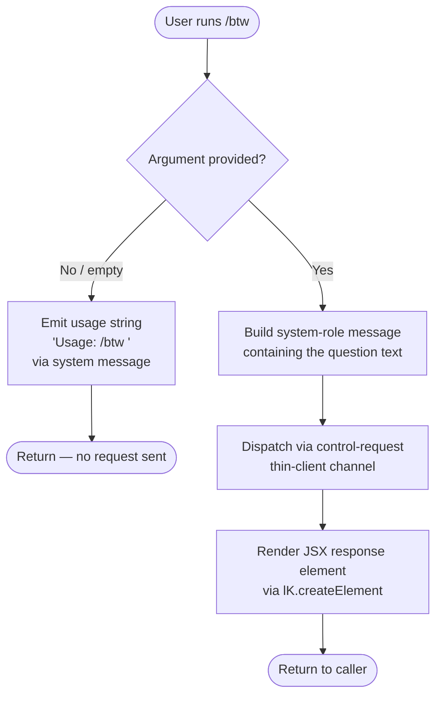

# `/btw`

> Analysis basis: CC v2.1.143 bundle.js (AST extraction + Claude interpretation)
> Minimum version: v2.1.143

---

## Overview

The `/btw` command allows the user to ask a quick side question without disrupting the current primary conversation context. It is classified as a `local-jsx` command that dispatches immediately via the `control-request` thin-client channel, injecting the question as a `system`-role message. When no argument is supplied the command emits a usage hint and returns without sending any request.

---

## Registration

| Field | Value |
|---|---|
| type | `local-jsx` |
| name | `btw` |
| description | Ask a quick side question without interrupting the main conversation |
| argumentHint | `<question>` |
| immediate | `true` |
| thinClientDispatch | `control-request` |
| module\_id | `Aqq` |

Analysis basis: CC v2.1.143 bundle.js:+10059586

---

## Input Branching



Analysis basis: CC v2.1.143 bundle.js:+10059182, +10059184, +10059223, +10059292

---

## Behavioral Spec

### 1. Argument Validation and Usage Guard

When the command handler (`commandHandler`) is invoked it immediately checks whether the user supplied a non-empty argument string.

```
function commandHandler(userInput):
    question = userInput.trim()

    if question is empty:
        emit systemMessage("Usage: /btw <your question>")
        return early   // no side-effects beyond the hint
```

Analysis basis: CC v2.1.143 bundle.js:+10059182, +10059184

---

### 2. Side-Question Dispatch

When a non-empty question is present the handler constructs a message envelope with role `"system"` and forwards it through the `control-request` thin-client dispatch path. Because `immediate: true` is set in the registration the dispatch occurs synchronously in the same event-loop turn rather than being queued.

```
function dispatchSideQuestion(question):
    envelope = {
        role: "system",
        content: question
    }
    sendViaControlRequest(envelope)
```

Analysis basis: CC v2.1.143 bundle.js:+10059223, +10059246

---

### 3. JSX Render

After dispatch the handler constructs and returns a React element (via `lK.createElement`) that surfaces the response inline in the terminal UI without replacing the primary conversation view.

```
function renderResponse(responsePayload):
    return createElement(InlineResponseComponent, { payload: responsePayload })
```

Analysis basis: CC v2.1.143 bundle.js:+10059292

---

### 4. Jitter Helper (Internal Utility — `randomJitterDelay`)

The call-graph reaches a utility used elsewhere in the config subsystem that introduces random jitter before retrying a locked resource. It is not specific to `/btw` user-visible behavior but is reachable through the shared config-persistence layer invoked on dispatch.

```
function randomJitterDelay():
    base       = 1          // lower bound multiplier
    ceiling    = 2          // upper bound multiplier
    jitter     = Math.random() * ceiling + base
    setTimeout(retryCallback, jitter)
```

Analysis basis: CC v2.1.143 bundle.js:+12638154, +12638156, +12638170, +12638193

---

### 5. Config Persistence Layer (`saveConfigWithLock`)

The dispatch path calls into the shared config-persistence subsystem to durably record any session state change. Key behavioral invariants observed in this subsystem are documented below because they affect whether `/btw` dispatch succeeds or is refused.

```
function saveConfigWithLock(configDelta):

    // Attempt file-system lock
    acquired = acquireLock()

    if not acquired within timeout (60000 ms):
        emitTelemetry("tengu_config_lock_contention")
        logWarning("Lock acquisition took longer than expected - another Claude instance may be running")
        // continues with degraded path after warning

    // Re-read config from disk before writing
    diskConfig = readFileSync(configPath, encoding="utf-8")

    if diskConfig is missing auth AND cachedConfig has auth:
        emitTelemetry("tengu_config_auth_loss_prevented")
        refuse()   // abort write; log GH #3117 reference
        return

    if diskConfig is stale:
        emitTelemetry("tengu_config_stale_write")

    // Rotate backup files; keep at most 5 backups
    backups = listFiles(configDir).filter(name startsWith ".backup.")
    if backups.length > 5:
        removeOldestBackup()

    // Write with mode 384 (octal 0o600 — owner read/write only)
    writeFileSync(configPath, serialized, { mode: 384, encoding: "utf-8" })

    releaseLock()
```

Limits and constants:
- Lock-wait timeout: **60 000 ms** (bundle.js:+3162978)
- Maximum backup files retained: **5** (bundle.js:+3163227)
- Config file write mode: **384** (0o600, owner read/write) (bundle.js:+3163509)
- Encoding: **`"utf-8"`** (bundle.js:+3163496)
- Lock-contention threshold log level: **`"error"`** (bundle.js:+3162165)
- Lock-contention poll count before warning: **100** attempts (bundle.js:+3162202)
- Backup filename prefix: **`".backup."`** (bundle.js:+3163094)

Analysis basis: CC v2.1.143 bundle.js:+3162082, +3162165, +3162202, +3162208, +3162297, +3162433, +3162555, +3162624, +3162776, +3162978, +3163094, +3163227, +3163509

---

### 6. Global Config Fallback (`saveGlobalConfigFallback`)

A secondary fallback path mirrors the auth-loss guard for the global config file.

```
function saveGlobalConfigFallback(configDelta):
    diskConfig = readGlobalConfig()

    if diskConfig is missing auth AND cachedConfig has auth:
        // Refuse write — see GH #3117
        log("saveGlobalConfig fallback: re-read config is missing auth that cache has; refusing to write. See GH #3117.")
        return

    writeGlobalConfig(configDelta)
```

Analysis basis: CC v2.1.143 bundle.js:+3159506

---

### 7. Config Access Guard

Reading the config before the session is fully initialized raises a hard error.

```
function readConfig():
    if sessionNotYetAllowed:
        throw Error("Config accessed before allowed.")
```

Analysis basis: CC v2.1.143 bundle.js:+3164235, +3164241

---

## State & Side Effects

| Item | Detail |
|---|---|
| Telemetry — `tengu_config_lock_contention` | Emitted when the config-file lock cannot be acquired within the expected window (bundle.js:+3162297) |
| Telemetry — `tengu_config_stale_write` | Emitted when a write is attempted against a config that appears stale relative to the in-memory cache (bundle.js:+3162433) |
| Telemetry — `tengu_config_auth_loss_prevented` | Emitted when a write is refused because it would erase authentication credentials present in the cache (bundle.js:+3162776) |
| Telemetry — `tengu_config_parse_error` | Emitted when the on-disk config file cannot be parsed (bundle.js:+3164878) |
| Hook registration | <!-- TODO: not found in depth-2 traversal; needs --depth 4 --> |
| appState changes | <!-- TODO: not found in depth-2 traversal; needs --depth 4 --> |
| Sound | <!-- TODO: not found in depth-2 traversal; needs --depth 4 --> |
| Control-request dispatch | Sends the side question as a `"system"`-role message through the `control-request` thin-client channel immediately (bundle.js:+10059223, +10059246) |
| Config file write | May write `~/.claude.json` at mode 0o600 as a side effect of session state persistence; up to 5 `.backup.*` rotations are maintained (bundle.js:+3163509, +3163227) |

---

## Version History

| Version | Change |
|---|---|
| v2.1.143 | Initial analysis |

---

## Common Mistakes

1. **Omitting the question argument** — Running `/btw` with no argument produces only the usage hint (`Usage: /btw <your question>`) and sends nothing to the model. Always include the question text directly after the command.
2. **Expecting the side question to appear in the primary transcript** — `/btw` dispatches via `control-request` and renders inline; it does not inject a user-turn message into the main conversation history visible to subsequent prompts.
3. **Assuming `/btw` tolerates concurrent Claude instances** — The shared config-persistence layer serializes writes with a file lock. A second Claude process running simultaneously can trigger `tengu_config_lock_contention` warnings and slow down or block the dispatch path.
4. **Confusing `immediate: true` with non-blocking** — `immediate` means the command fires in the same event-loop tick without waiting for a queue slot; it does not mean the underlying HTTP/IPC call completes synchronously.
5. **Tampering with `.backup.*` files** — The config subsystem reads directory listings to count and prune backup files. Manually placing extra `.backup.*`-prefixed files in the config directory may cause legitimate backups to be deleted prematurely (the system retains at most 5).

---

## Appendix — Identifier Mapping

> For bundle debugging only. Identifiers change across versions.

| Identifier | Role |
|---|---|
| `JO7` | Top-level `/btw` command handler (entry point) |
| `H` | Random jitter delay utility |
| `a6` | Config save orchestrator (coordinates lock, read, write) |
| `P9_` | Config-with-lock writer (primary config path, backup rotation) |
| `emH` | <!-- TODO: not found in depth-2 traversal; needs --depth 4 --> |
| `OZ9` | Object-entries iterator helper (config delta enumeration) |
| `HpH` | Timestamp / Date.now wrapper for config change tracking |
| `v` | Config read / access helper with debug logging |
| `H$H` | Global config file reader with parse-error guard |
| `d76` | Config serializer / diff utility |
| `d` | Low-level file-write helper |
| `j9_` | Atomic temp-file writer (dirname + write + rename pattern) |