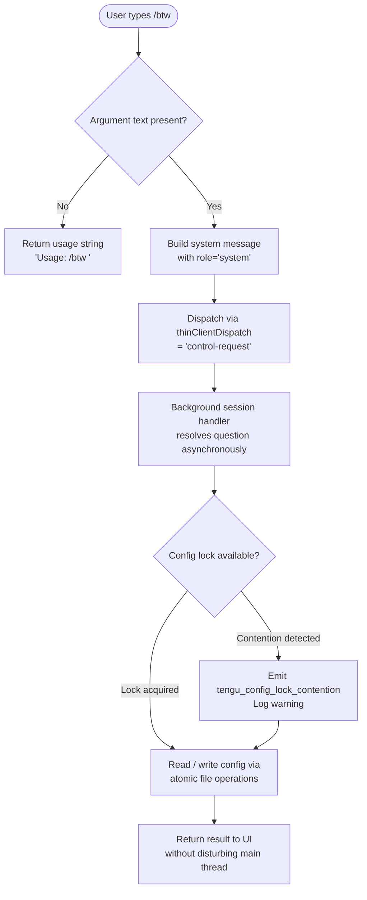

# `/btw`

> Analysis basis: CC v2.1.143 bundle.js (AST extraction + Claude interpretation)
> Minimum version: v2.1.143

---

## Overview

`/btw` is a local JSX slash command that lets a user inject a quick side question into Claude Code without breaking the current conversational thread. When invoked, it immediately dispatches the question as a `control-request` to a background session, routing around the primary conversation queue. If no question text is provided, the command returns a usage hint instead of dispatching.

---

## Registration

| Field | Value |
|---|---|
| type | `local-jsx` |
| name | `btw` |
| description | Ask a quick side question without interrupting the main conversation |
| argumentHint | `<question>` |
| immediate | `true` |
| thinClientDispatch | `control-request` |
| module_id | `Aqq` |

Analysis basis: CC v2.1.143 bundle.js:+10059586

---

## Input Branching

The command entry point (render function of the JSX component) evaluates the user-supplied argument immediately and branches on whether text was provided.



Analysis basis: CC v2.1.143 bundle.js:+10059182 (entry point), +10059184 (usage literal), +10059223 (system role literal), +10059292 (JSX render)

---

## Behavioral Spec

### 1. Argument Validation and Usage Guard

When the command component renders, it immediately inspects the argument string passed by the CLI input layer. If the trimmed argument is empty or absent, the component returns a static usage string to the UI and halts further processing.

```
function renderBtwCommand(argumentText):
    if argumentText is null or trim(argumentText) == "":
        return StaticMessage("Usage: /btw <your question>")
    else:
        return dispatchSideQuestion(argumentText)
```

Analysis basis: CC v2.1.143 bundle.js:+10059184 (usage string literal), +10059182 (validation branch)

---

### 2. Side-Question Dispatch

A non-empty argument is wrapped in a message object with role `"system"` and forwarded through the `thinClientDispatch` channel tagged `"control-request"`. Because `immediate: true` is set on the registration, the CLI invokes this render path synchronously without queuing it behind pending assistant turns.

```
function dispatchSideQuestion(questionText):
    message = {
        role: "system",
        content: questionText
    }
    send via thinClientDispatch("control-request", message)
```

Analysis basis: CC v2.1.143 bundle.js:+10059223 (role literal), +10059246 (dispatch call edge `JO7` → `a6`), +10059586 (registration `thinClientDispatch` field)

---

### 3. Background Session Routing

The dispatch reaches the background session manager (`a6` → `P9_` call chain). The session manager resolves a target background worker, acquires a file-system config lock, and forwards the question as a lightweight control message. The main conversation thread is not paused during this operation.

```
function routeToBackgroundSession(controlMessage):
    lock = acquireConfigLock()           // may emit lock-contention telemetry
    if lock.contentionDetected:
        emitTelemetry("tengu_config_lock_contention")
        logWarning("Lock acquisition took longer than expected - another Claude instance may be running")
    session = resolveOrSpawnBackgroundSession()
    session.send(controlMessage)
    releaseConfigLock(lock)
```

Analysis basis: CC v2.1.143 bundle.js:+10059246 (`JO7`→`a6`), +3159299 (`a6`→`P9_`), +3162208 (lock-contention warning literal), +3162297 (`tengu_config_lock_contention` event)

---

### 4. Config Access and Atomic Write Path

Whenever the background session must persist state, the config subsystem (`P9_` / `H$H`) performs atomic file writes: it reads the current config, validates that auth fields are still present, writes to a temp file, and renames atomically. If auth data would be lost, the write is aborted and telemetry is emitted.

```
function saveConfigAtomically(newConfig, cachedConfig):
    current = readConfigFromDisk()          // utf-8, bundle.js:+3164324
    if cachedConfig has auth AND current lacks auth:
        emitTelemetry("tengu_config_auth_loss_prevented")
        logWarning("saveConfigWithLock: re-read config is missing auth …")
        return ERROR
    if staleness detected:
        emitTelemetry("tengu_config_stale_write")
    tempPath = buildTempPath(Date.now())
    writeFileSync(tempPath, serialize(newConfig))
    fchmodSync(tempPath, 0o600)             // mode 384 decimal, bundle.js:+3163509
    fsyncSync(tempPath)
    renameSync(tempPath, configPath)        // atomic replace
    backupOldConfig(configPath)             // keeps up to 5 backups, bundle.js:+3163227
```

Analysis basis: CC v2.1.143 bundle.js:+3162624 (auth-loss warning literal), +3162776 (`tengu_config_auth_loss_prevented`), +3162433 (`tengu_config_stale_write`), +3163509 (mode 384), +3163227 (backup count 5), +3164324 (utf-8 literal)

---

### 5. Background Spare Session Pool

When no existing background session is available, the session manager may spawn a fresh worker and optionally maintain a "spare" warm session for low-latency future `/btw` calls. Memory pressure triggers a protective teardown path.

```
function resolveOrSpawnBackgroundSession():
    existing = sessionPool.get(key)
    if existing is alive:
        return existing
    if memoryFree < threshold:                   // threshold uses os.freemem()
        emitTelemetry("tengu_bg_dispatch_low_mem")
        return ERROR
    spare = sessionPool.findSpare("spare")       // literal "spare", bundle.js:+14503931
    if spare exists:
        emitTelemetry("tengu_bg_spare_claim")
        spare.promote()
        return spare
    worker = spawnWorker()
    emitTelemetry("tengu_bg_spare_enable")
    sessionPool.set(key, worker)
    return worker
```

Analysis basis: CC v2.1.143 bundle.js:+14503796 (`tengu_bg_dispatch_low_mem`), +14503931 ("spare" literal), +14504411 (`tengu_bg_spare_enable`), +14504532 (`tengu_bg_spare_claim`), +14504795 (`tengu_bg_spare_claim_fail`), +14504854 (`fU.spawn`)

---

### 6. Jitter Utility

A small random-jitter helper (`H`) is called from the command entry point. It generates a floating-point random value using `Math.random`, scales it between 1 and 2, and schedules a deferred callback with `setTimeout`. This is consistent with retry back-off or anti-thundering-herd logic when multiple `/btw` calls occur simultaneously.

```
function jitteredDelay(callback):
    factor = 1 + Math.random() * (2 - 1)    // range [1, 2), literals bundle.js:+12638154, +12638170
    delay  = baseDelay * factor
    setTimeout(callback, delay)
```

Analysis basis: CC v2.1.143 bundle.js:+10059182 (`JO7`→`H`), +12638156 (`Math.random`), +12638193 (`setTimeout`), +12638154 (literal 2), +12638170 (literal 1)

---

### 7. SIGKILL Escalation for Stuck Background Workers

If a background session worker does not respond within the grace period, the session manager escalates from a soft termination signal to SIGKILL. Grace periods are 30 seconds for soft kill and 15 seconds for the escalation window.

```
function terminateWorkerForcibly(worker):
    worker.kill(softSignal)
    wait(30 seconds)                           // bundle.js:+14503172
    if worker still alive:
        setTimeout(() => worker.kill("SIGKILL"), 15_000)   // bundle.js:+14503183, +14503265
        emitTelemetry("tengu_bg_dispatch_sigkill_escalate")
```

Analysis basis: CC v2.1.143 bundle.js:+14503217 (`tengu_bg_dispatch_sigkill_escalate`), +14503172 (literal 30), +14503183 (literal 15), +14503265 ("SIGKILL" literal)

---

## State & Side Effects

| Item | Detail |
|---|---|
| Telemetry — `tengu_config_lock_contention` | Emitted when config file lock takes longer than expected; suggests another Claude instance is running. bundle.js:+3162297 |
| Telemetry — `tengu_config_stale_write` | Emitted when a config write is detected as potentially stale. bundle.js:+3162433 |
| Telemetry — `tengu_config_parse_error` | Emitted when the config file cannot be parsed. bundle.js:+3164878 |
| Telemetry — `tengu_bg_dispatch_sigkill_escalate` | Emitted when a background worker is force-killed with SIGKILL. bundle.js:+14503217 |
| Telemetry — `tengu_bg_dispatch_low_mem` | Emitted when free memory is below threshold, preventing new worker spawn. bundle.js:+14503796 |
| Telemetry — `tengu_bg_spare_enable` | Emitted when a spare warm session is created for future reuse. bundle.js:+14504411 |
| Telemetry — `tengu_bg_spare_claim` | Emitted when an existing spare session is successfully claimed. bundle.js:+14504532 |
| Telemetry — `tengu_bg_spare_claim_fail` | Emitted when spare session claim fails (e.g., memory pressure). bundle.js:+14504795 |
| Telemetry — `tengu_config_auth_loss_prevented` | Emitted when a config write is blocked because it would erase auth credentials. bundle.js:+3162776 |
| Hook registration | `immediate: true` — CLI invokes the render function synchronously; no queuing behind pending assistant turns. bundle.js:+10059586 |
| thinClientDispatch | Routes the question as `"control-request"` to the background session layer, bypassing the main conversation channel. bundle.js:+10059586 |
| appState changes | The main conversation `appState` is **not** modified directly; side-question state is managed within the background session pool. |
| Config file mutations | Atomic rename-based writes to `~/.claude.json`; up to 5 rotating backups kept in a `backups/` subdirectory. bundle.js:+3163227, +3163809 |
| Worker lifecycle | Spawns background worker via `fU.spawn`; manages spare pool; escalates to SIGKILL after 30 s + 15 s grace. bundle.js:+14504854, +14503172, +14503183 |
| Sound | <!-- TODO: not found in depth-2 traversal; needs --depth 4 --> |

---

## Version History

| Version | Change |
|---|---|
| v2.1.143 | Initial analysis — `local-jsx` registration confirmed; `thinClientDispatch: "control-request"` routing; spare session pool; atomic config writes with auth-loss guard. |

---

## Common Mistakes

1. **Omitting the question text** — Typing `/btw` with no argument produces only the usage hint `"Usage: /btw <your question>"` and dispatches nothing. Always supply the question inline: `/btw <your question>`. Analysis basis: CC v2.1.143 bundle.js:+10059184

2. **Expecting a synchronous main-thread response** — Because the command routes through `thinClientDispatch: "control-request"`, the answer arrives asynchronously through the background session layer. The primary conversation is not paused, so the reply may appear slightly after the next main-thread turn.

3. **Triggering lock contention with multiple simultaneous instances** — Running more than one Claude Code instance against the same working directory can cause `tengu_config_lock_contention` and delayed config writes. The warning literal `"Lock acquisition took longer than expected - another Claude instance may be running"` confirms this scenario. Analysis basis: CC v2.1.143 bundle.js:+3162208

4. **Assuming the spare session pool is always available under memory pressure** — If free memory falls below the internal threshold, the background worker spawn is refused and `tengu_bg_dispatch_low_mem` is emitted. In this state, `/btw` will fail silently at the dispatch layer. Analysis basis: CC v2.1.143 bundle.js:+14503796

5. **Misreading the `immediate` flag as "instant response"** — `immediate: true` means the CLI renders the command component without waiting for prior assistant turns to finish, not that the AI reply is instantaneous.

---

## Appendix — Identifier Mapping

> For bundle debugging only. Identifiers change across versions.

| Identifier | Role |
|---|---|
| `JO7` | `/btw` command component — top-level render / entry-point function |
| `H` | Jitter delay utility — computes random back-off and calls `setTimeout` |
| `a6` | Background session dispatch coordinator — routes control-request messages |
| `P9_` | Config lock and atomic save orchestrator |
| `_` | Filesystem abstraction layer (low-level sync operations) |
| `x6` | Path existence / accessibility checker |
| `L` | Primary filesystem wrapper with lock tracking (`statSync`, `mkdirSync`, etc.) |
| `q` | Secondary filesystem handle (used for `readFileSync`, `unlinkSync`, etc.) |
| `f` | Promise/async resource finalizer (`.finally` cleanup handler) |
| `heA` | Message object builder / envelope constructor |
| `Tr8` | Serialization helper called by message builder |
| `v` | HTTP / API request dispatcher |
| `G5K` | HTTP connection manager |
| `hH` | JSON serializer wrapper (`JSON.stringify`) |
| `P7` | Request header builder and redactor |
| `cSH` | Request signing / credential injection helper |
| `Z5K` | Streaming response reader and byte-length tracker |
| `d` | Logger / debug sink |
| `L8` | Structured error constructor |
| `H$H` | Config file reader with parse, backup, and access-guard logic |
| `R6` | JSON parse wrapper (`JSON.parse`) |
| `jR` | Config key prefix stripper (`startsWith` / `slice`) |
| `zZ9` | Backup directory enumerator and rotator |
| `NH` | Error reporter / `logError` dispatcher |
| `X9_` | Backup file path builder (`lz.join` + timestamp) |
| `w` | Background worker / child-process lifecycle manager |
| `d76` | Diff / change-set utility |
| `A` | Process registry map (worker PID → handle) |
| `V` | Config field validator |
| `X` | SDK client connection factory |
| `iT8` | Transport type selector (`http` / `sse` / `dynamic`) |
| `v_` | Error coercion utility (`Error` + `String`) |
| `Z` | Sliding-window slice helper for backup rotation |
| `yA6` | Atomic file writer (temp-write → fchmod → fsync → rename) |
| `O` | Symbolic-link stat inspector |
| `$8` | ENOENT / ELOOP guard wrapper |
| `emH` | Session event emitter |
| `OZ9` | Session options enumerator (`Object.entries`) |
| `HpH` | Session heartbeat / timestamp tracker (`Date.now`) |
| `j9_` | Config directory initializer (dirname + mkdirSync) |