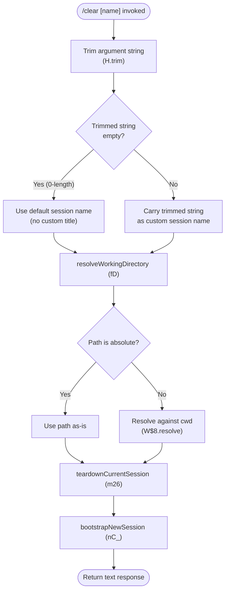

# `/clear`

> Analysis basis: CC v2.1.143 bundle.js (AST extraction + Claude interpretation)
> Minimum version: v2.1.143

---

## Overview

The `/clear` command ends the current conversation session and initialises a fresh one with an empty context window. The previous session is written to disk and remains fully resumable via `/resume`. Under the hood, the command trims optional input, resolves a working-directory path, tears down all active sub-processes, flushes pending telemetry, emits a `SessionEnd` lifecycle event, and then bootstraps a new session with a fresh UUID and a `SessionStart` event.

---

## Registration

| Field | Value |
|---|---|
| type | `local` |
| name | `clear` |
| description | `Start a new session with empty context; previous session stays on disk (resumable with /resume)` |
| argumentHint | `[name]` |
| aliases | `reset`, `new` |
| supportsNonInteractive | `true` |
| thinClientDispatch | `post-text` |
| module\_id | `dqq` |

Analysis basis: CC v2.1.143 bundle.js:+10100616

---

## Input Branching

The command entry-point (`commandHandler`) trims whitespace from the raw argument string, then branches on whether the result is empty.



Analysis basis: CC v2.1.143 bundle.js:+10100442 (trim), +10100457 (empty check), +8556836 (path resolution)

---

## Behavioral Spec

### 1. Argument Normalisation

```
function normaliseArgument(rawInput):
    trimmed = rawInput.trim()          // H.trim  +10100442
    if length(trimmed) == 0:           // literal 0  +10100457
        return null                    // no custom name
    return trimmed
```

Analysis basis: CC v2.1.143 bundle.js:+10100442, +10100457

---

### 2. Working-Directory Resolution

```
function resolveWorkingDirectory(pathArg):
    if pathArg is null:
        return currentWorkingDirectory()
    if W$8.isAbsolute(pathArg):        // +8556836
        resolved = pathArg
    else:
        resolved = W$8.resolve(cwd, pathArg)  // +8556856
    validate accessible(resolved)      // x6  +8556871
    if not valid:
        raise Error                    // +8556938
    emit telemetry tengu_shell_set_cwd // +8556995
    return resolved
```

Analysis basis: CC v2.1.143 bundle.js:+8556836, +8556856, +8556871, +8556938, +8556995

---

### 3. Session Teardown

This is the central procedure of the command. It performs an ordered shutdown of the current session before the new one is created.

```
function teardownCurrentSession(sessionContext):

    // 3-a. Emit cache eviction hint to model infrastructure
    emitTelemetry("tengu_cache_eviction_hint")       // +10098749
    log("conversation_clear")                        // +10098784

    // 3-b. Mark session as backgrounded
    appState.set("isBackgrounded", true)             // +10098852

    // 3-c. Resolve token/turn limits via numeric parsing
    //      parseInt with radix 10  (+12235008)
    //      Number.isFinite guard    (+12235019)
    //      Math.max / Math.min clamping (+12235215, +12235228)
    //      upper bound constant: 1000  (+12235184)
    limits = resolveSessionLimits(config)

    // 3-d. Emit SessionEnd lifecycle event
    emitLifecycleEvent("SessionEnd")                 // literal +12226761

    // 3-e. Collect all running sub-agent processes
    activeAgents = Object.values(agentRegistry)      // +10098915

    // 3-f. Terminate each background dispatch worker
    for worker in backgroundWorkers:
        worker.kill("SIGKILL")                       // literal +14503265
        // Grace window: 30 s normal, 15 s fallback  (+14503172, +14503183)
        // SIGKILL escalation telemetry if needed
        emitTelemetry("tengu_bg_dispatch_sigkill_escalate")  // +14503217
        // Low-memory guard
        if freeMemory() < threshold:                 // fE8.freemem +14503626
            emitTelemetry("tengu_bg_dispatch_low_mem")       // +14503796

    // 3-g. Kill in-process sub-agent children (SIGTERM first)
    for agent in agentProcesses:
        agent.kill("SIGTERM")                        // +14505030

    // 3-h. Clear the in-memory abort-controller map
    clearAbortControllers()                          // key "abortController" +10099389

    // 3-i. Cancel pending timeouts
    clearTimeout(pendingTimers)                      // +10099353

    // 3-j. Flush and delete session-scoped caches
    flushSessionCache()    // zz → _.flush +12195523, S28.delete +12195533

    // 3-k. Flush disk-backed store
    flushDiskStore()       // SdH → OD1 +6735619

    // 3-l. Dispose shell / worktree state
    disposeWorktreeState()   // pb → "worktree-state" +12145321
    disposeIsolationLatch()  // $6H → "isolation-latch" +12144808

    // 3-m. Flush plugin-hook queue
    flushPluginHooks()     // Qqq → _7H +12174752

    // 3-n. Clear in-memory conversation store
    conversationStore.clear()   // _.clear +10099065
```

Analysis basis: CC v2.1.143 bundle.js:+10098784, +10098852, +10098915, +10099065, +10099353, +10099389, +12195523, +12226761

---

### 4. New Session Bootstrap

```
function bootstrapNewSession(options):

    // 4-a. Load plugin hooks for the new session
    loadPluginHooks(options)     // nC_ → "load_plugin_hooks" +5394518
    // Guard: if allowManagedHooksOnly and no managed plugins, skip
    // literal: "Skipping plugin hooks..." +5394416

    // 4-b. Generate a fresh session UUID
    newSessionId = crypto.randomUUID()   // Fqq.randomUUID +10099880

    // 4-c. Emit new-session event on the event bus
    emitNewSession(newSessionId)         // NZ8 → xV6.emit +39803

    // 4-d. Write optional custom title
    if customTitle is not null:
        setSessionTitle(customTitle, "custom-title")  // +12141026
        emitTelemetry("tengu_session_renamed")        // +12141118

    // 4-e. Emit SessionStart lifecycle event
    emitLifecycleEvent("SessionStart")   // literal +5395773

    // 4-f. Emit conversation_reset telemetry
    log("conversation_reset")            // literal +10099841

    // 4-g. Re-initialise subagent directory
    initSubagentDirectory()              // g5 → "subagents" +3193278

    // 4-h. Update symlink to latest session
    updateLatestSessionSymlink(newSessionId)   // rIH → xr.symlink +12196285
    // Handle EEXIST gracefully (+12196321), unlink stale link (+12196344)

    // 4-i. Initialise new running-state marker
    appState.set("running", false)        // literal +10099261

    // 4-j. Spawn spare background session (pre-warm)
    //      Telemetry if claim succeeds or fails
    emitTelemetry("tengu_bg_spare_enable")      // +14504411
    claimSpareSession()
    // on success: tengu_bg_spare_claim  +14504532
    // on failure: tengu_bg_spare_claim_fail  +14504795

    // 4-k. Return result as text content type
    return { type: "text", content: confirmationMessage }  // "text" +10100544
```

Analysis basis: CC v2.1.143 bundle.js:+10099841, +10099880, +5395773, +12196285, +10100544

---

### 5. Background Spare-Session Management

The spare-session subsystem is active during teardown/bootstrap. Its behaviour when memory is low:

```
function manageSpareSessions():
    freeMem = os.freemem()                    // fE8.freemem +14503626
    memMB   = Math.round(freeMem / 1024)      // 1024 constant +14503690
    if memMB below threshold:
        emitTelemetry("tengu_bg_dispatch_low_mem")  // +14503796
        skipSpawnSpare()
        return
    if spareSlotAvailable():
        emitTelemetry("tengu_bg_spare_enable")   // +14504411
        spawnSpareProcess()                      // fU.spawn +14504854
        // Record start time: Date.now()  +14504563
        // Version tag embedded: "2.1.143"  +14504235
```

Analysis basis: CC v2.1.143 bundle.js:+14503626, +14503690, +14503796, +14504411, +14504532, +14504795, +14504854

---

### 6. Numeric Limit Resolution

```
function resolveSessionLimits(rawConfig):
    parsed = parseInt(rawConfig.turns, 10)      // radix 10  +12235008
    if not Number.isFinite(parsed):             // +12235019
        parsed = defaultLimit
    clamped = Math.max(0, Math.min(parsed, 1000))  // +12235215, +12235228, +12235184
    return clamped
```

Constant: upper-bound turn limit is **1000** (bundle.js:+12235184).

---

## State & Side Effects

| Item | Detail |
|---|---|
| Telemetry — `tengu_cache_eviction_hint` | Fired immediately at teardown start (bundle.js:+10098749) |
| Telemetry — `tengu_bg_dispatch_sigkill_escalate` | Fired when a background worker requires SIGKILL escalation (bundle.js:+14503217) |
| Telemetry — `tengu_bg_dispatch_low_mem` | Fired when free memory falls below threshold during worker management (bundle.js:+14503796) |
| Telemetry — `tengu_bg_spare_enable` | Fired when a spare background session slot is offered (bundle.js:+14504411) |
| Telemetry — `tengu_bg_spare_claim` | Fired when a spare session is successfully claimed for the new session (bundle.js:+14504532) |
| Telemetry — `tengu_bg_spare_claim_fail` | Fired when no spare session is available (bundle.js:+14504795) |
| Telemetry — `tengu_shell_set_cwd` | Fired when the working directory is resolved/updated (bundle.js:+8556995) |
| Telemetry — `tengu_session_renamed` | Fired when a custom title argument is provided (bundle.js:+12141118) |
| Lifecycle event — `SessionEnd` | Emitted on the internal event bus before teardown of processes (bundle.js:+12226761) |
| Lifecycle event — `SessionStart` | Emitted on the internal event bus after new session UUID is assigned (bundle.js:+5395773) |
| Log key — `conversation_clear` | Written to structured log at teardown entry (bundle.js:+10098784) |
| Log key — `conversation_reset` | Written to structured log after new session is established (bundle.js:+10099841) |
| appState — `isBackgrounded` | Set to `true` during teardown to suppress incoming prompts (bundle.js:+10098852) |
| appState — `running` | Initialised to `false` for the new session (bundle.js:+10099261) |
| Session UUID | New UUID generated via `crypto.randomUUID()` (bundle.js:+10099880) |
| Conversation store | Cleared in-memory via `conversationStore.clear()` (bundle.js:+10099065) |
| Session cache | Flushed and deleted (bundle.js:+12195523, +12195533) |
| Disk store | Flushed synchronously (bundle.js:+6735619) |
| Symlink — latest session | Updated to point to the new session directory; `EEXIST` handled gracefully (bundle.js:+12196285, +12196321, +12196344) |
| Worktree state | Disposed during teardown (bundle.js:+12145321) |
| Isolation latch | Disposed during teardown (bundle.js:+12144808) |
| Plugin hooks | Flushed from old session; reloaded for new session (bundle.js:+12174752, +5394518) |
| Sub-agent processes | Collected via `Object.values`; terminated with SIGTERM/SIGKILL (bundle.js:+10098915, +14503265, +14505030) |
| Abort controllers | Cleared from the abort-controller registry (bundle.js:+10099389) |
| Pending timeouts | Cancelled via `clearTimeout` (bundle.js:+10099353) |
| Spare background session | Spawned proactively to pre-warm the next interaction (bundle.js:+14504854) |
| Sound | <!-- TODO: not found in depth-2 traversal; needs --depth 4 --> |

---

## Version History

| Version | Change |
|---|---|
| v2.1.143 | Initial analysis |

---

## Common Mistakes

1. **Expecting context to be destroyed**: The previous session is persisted to disk and can be fully restored with `/resume`. Only the in-process conversation store is cleared.
2. **Using `/clear` to change directory**: The optional `[name]` argument sets a *session name / custom title*, not the working directory. Working-directory changes require a separate mechanism.
3. **Assuming instant teardown**: Sub-process termination includes a grace window (30 s normal, 15 s fallback per bundle.js:+14503172, +14503183) before SIGKILL escalation; in-flight requests may still complete briefly after the command is issued.
4. **Ignoring alias equivalence**: `/reset` and `/new` are registered as full aliases for `/clear` (bundle.js:+10100616). They invoke identical logic — there is no behavioural difference between them.
5. **Invoking in a low-memory environment and expecting a spare session**: When free memory is insufficient, the spare-session pre-warm is skipped and `tengu_bg_spare_claim_fail` is emitted (bundle.js:+14504795). The new session still starts but without the latency benefit of a pre-warmed process.
6. **Passing an argument expecting a path**: The `[name]` argument is treated as a session title string, not a filesystem path. The path resolution visible in the call graph applies to the *working directory context*, not the argument itself.

---

## Appendix — Identifier Mapping

> For bundle debugging only. Identifiers change across versions.

| Identifier | Role |
|---|---|
| `oO7` | Command handler entry-point (top-level `/clear` executor) |
| `m26` | Session teardown orchestrator (core clear procedure) |
| `U26` | Session-limit numeric resolver (parseInt + clamp logic) |
| `nvH` | Lifecycle event emitter (fires `SessionEnd` / `SessionStart` events) |
| `ieH` | Internal dependency injected into teardown context |
| `d` | Shared low-level utility (used across teardown and path resolution) |
| `M` | Agent-registry accessor (reads active agent map) |
| `j` | Background-worker accessor helper |
| `Rj` | Abort-signal registration helper |
| `w` | Background dispatch / spare-session manager |
| `J` | Sub-agent process kill helper (iterates agent process list) |
| `iD` | Internal session-state dependency |
| `nC_` | New-session bootstrap orchestrator |
| `fD` | Working-directory resolver (path absoluteness check + validation) |
| `__` | Global/shared state accessor (wraps `GV`) |
| `_` | Session cache store (exposes `.clear()` and `.flush()`) |
| `UTH` | Post-teardown state update helper |
| `$` | Event-bus / notification dispatcher |
| `QI` | Running-state flag setter |
| `NH` | Error logger / log-push utility |
| `zz` | Session cache flush-and-delete routine |
| `SdH` | Disk-backed store flusher |
| `Qqq` | Plugin-hook queue flusher |
| `g3` | Internal initialisation helper (uses `V6` / `KL`) |
| `V6` | Core configuration / context value accessor (wraps `GV`) |
| `Ip` | Post-bootstrap state finaliser |
| `g5` | Subagent directory initialiser |
| `p26` | KL-backed configuration loader for new session |
| `NZ8` | New-session UUID emitter (randomUUID + event-bus emit) |
| `rQ` | KL-backed session record writer |
| `Ub` | Session-title setter (writes `custom-title`, emits rename telemetry) |
| `rIH` | Latest-session symlink updater |
| `_T` | Subagent path builder (joins paths via `A$H.join`) |
| `Wf` | Miscellaneous post-session wiring step |
| `rf` | Miscellaneous post-session wiring step (secondary) |
| `pb` | Worktree-state disposer |
| `$6H` | Isolation-latch disposer |
| `um` | Plugin-hook loader (handles network/permission/parse errors) |
| `H` | Random jitter / setTimeout scheduler (used in spare-session timing) |