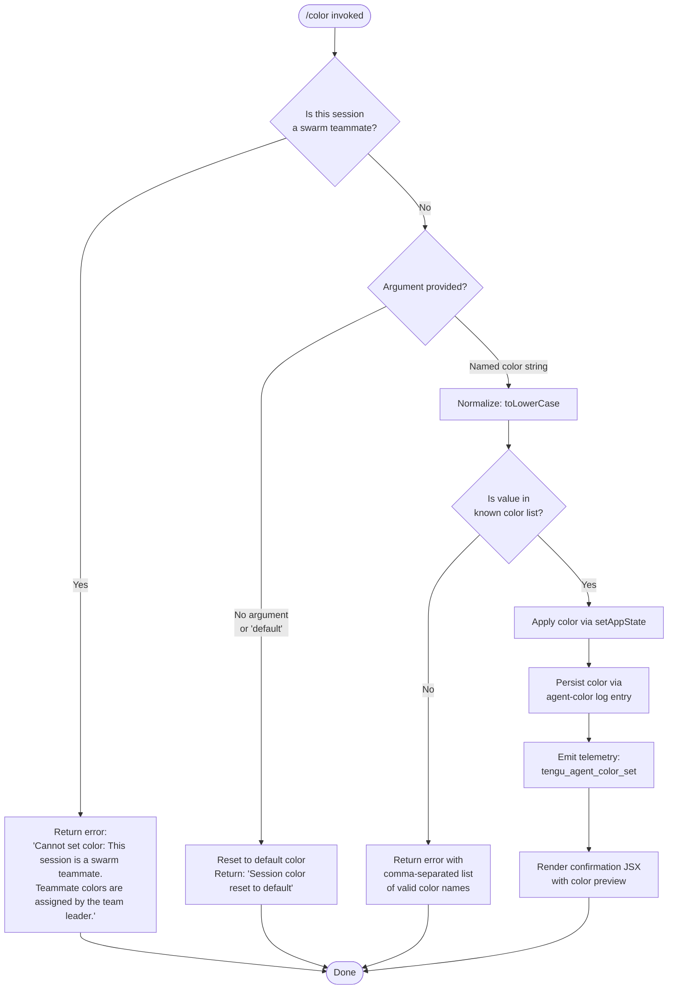

# `/color`

> Analysis basis: CC v2.1.143 bundle.js (AST extraction + Claude interpretation)
> Minimum version: v2.1.143

---

## Overview

The `/color` command sets the prompt bar color for the current Claude Code session. When invoked with a named color argument, it applies that color to the session state immediately; when invoked with no argument (or the keyword `default`), it resets the prompt bar to the default color. The command is blocked in swarm teammate sessions, where colors are controlled exclusively by the team leader.

---

## Registration

| Field | Value |
|---|---|
| type | `local-jsx` |
| name | `color` |
| description | Set the prompt bar color for this session |
| argumentHint | *(none)* |
| immediate | `true` |
| module_id | `iqq` |

Analysis basis: CC v2.1.143 bundle.js:+10102359

---

## Input Branching



---

## Behavioral Spec

### Guard: Swarm Teammate Check

Before any color processing, the command implementation queries the current session store to determine whether this session is operating as a swarm teammate.

```
function checkSwarmGuard(sessionStore):
    session = sessionStore.getStore()
    if session.isSwarmTeammate:
        return errorResult(
            "Cannot set color: This session is a swarm teammate. " +
            "Teammate colors are assigned by the team leader."
        )
    return null  // guard passed
```

Analysis basis: CC v2.1.143 bundle.js:+10101347 (error string), +10101336 (store query call), +2166818 (getStore call)

---

### Input Normalization

The raw argument string is converted to lowercase before any lookup. If no argument is supplied, the string `"default"` is used as the effective value.

```
function normalizeColorInput(rawArgument):
    if rawArgument is null or rawArgument is empty:
        return "default"
    return rawArgument.toLowerCase()
```

Analysis basis: CC v2.1.143 bundle.js:+10101519 (toLowerCase call)

---

### Random Color Selection (No Argument Path)

When no argument is provided, the implementation uses `Math.random` and `Math.floor` to select a color index. This suggests that omitting the argument may pick a random color from the available palette rather than unconditionally resetting — the reset-to-default path is triggered specifically by the literal `"default"`.

```
function pickRandomColorIndex(colorList):
    index = Math.floor(Math.random() * colorList.length)
    return colorList[index]
```

Analysis basis: CC v2.1.143 bundle.js:+10101482 (`Math.floor`), +10101493 (`Math.random`)

---

### Color Validation

The normalized input is checked against two sets: a set of disallowed values (`sO7`) and a set of valid color names (`y$`). If the input is not found in the valid set, an error message is returned that lists all valid color names joined by `", "`.

```
function validateColor(normalizedInput, disallowedSet, validColorSet):
    if disallowedSet.includes(normalizedInput):
        return errorResult("not a valid color name")
    if not validColorSet.includes(normalizedInput):
        validList = validColorSet.join(", ")
        return errorResult("Unknown color. Valid colors: " + validList)
    return null  // valid
```

Analysis basis: CC v2.1.143 bundle.js:+10101537 (`sO7.includes`), +10101561 (`y$.includes`), +10101583 (`y$.join`), +10101591 (separator literal `", "`)

---

### Default / Reset Path

When the effective value is `"default"`, the command resets the prompt bar color in application state and returns a fixed confirmation string.

```
function applyDefaultColor(appState):
    appState.setAppState({ promptBarColor: "default" })
    return systemMessage("Session color reset to default")
```

Analysis basis: CC v2.1.143 bundle.js:+10101681 (`"default"` literal), +10101787 (`"Session color reset to default"` literal), +10101730 (`setAppState` call)

---

### Color Application

When a valid named color is provided, the command updates application state with the new color value, then persists it via a structured log entry tagged `"agent-color"`.

```
function applyNamedColor(normalizedColor, appState, persistenceLogger):
    appState.setAppState({ promptBarColor: normalizedColor })
    persistenceLogger.writeEntry(
        tag: "agent-color",
        value: normalizedColor
    )
    emitTelemetry("tengu_agent_color_set")
```

Analysis basis: CC v2.1.143 bundle.js:+10101730 (`setAppState`), +12144238 (`"agent-color"` literal), +12144322 (`tengu_agent_color_set` telemetry), +10101719 (persistence call site)

---

### Persistence Layer (agent-color log)

The persistence helper appends a structured record to a log file. If the target directory does not exist, it creates it before writing. The log entry uses fixed file-mode flags corresponding to the numeric constants `384` and `448`.

```
function writeAgentColorEntry(filePath, colorValue, fsModule, pathModule):
    directory = pathModule.dirname(filePath)
    fsModule.mkdirSync(directory, { recursive: true, mode: 448 })
    fsModule.appendFileSync(filePath, serializeEntry(colorValue), { mode: 384 })
```

File mode `384` = octal `0600` (owner read/write only).
File mode `448` = octal `0700` (owner read/write/execute only).

Analysis basis: CC v2.1.143 bundle.js:+12140100 (`384` literal), +12140144 (`448` literal), +12140073 (`appendFileSync`), +12140112 (`mkdirSync`), +12140124 (`dirname`), +12144217 (persistence function call site)

---

### Confirmation Rendering

The command renders a JSX result. When a color is successfully applied or reset, the output is tagged as a `"system"` message type. The output formatter pads entries using two-space indentation and maps color swatches for display.

```
function renderColorConfirmation(color, messageType):
    return {
        type: messageType,   // "system"
        content: buildColorPreview(color)
    }

function buildColorPreview(colorEntries):
    return colorEntries.map(entry =>
        entry.padEnd(40, " ")   // pad to width 40
    ).join("  ")                // two-space separator
```

Analysis basis: CC v2.1.143 bundle.js:+10101293 (`"system"` literal), +14526168 (`L.map`), +14526181 (`f.padEnd`), +14528173 (`40` numeric literal), +14526202 (`"  "` separator literal)

---

### Available Color Palette Enumeration

The valid color list is exposed through the helper that enumerates known color keys via `Object.keys`. This list is the source for both validation and the error message listing valid options.

```
function getAvailableColors(colorRegistry):
    return Object.keys(colorRegistry)
```

Analysis basis: CC v2.1.143 bundle.js:+10101040 (`Object.keys` in color key enumerator), +10101749 (call site)

---

## State & Side Effects

| Item | Detail |
|---|---|
| Telemetry | `tengu_agent_color_set` — emitted once per successful named-color application (bundle.js:+12144322) |
| appState changes | `promptBarColor` field updated via `_.setAppState` (bundle.js:+10101730) |
| File I/O | Appends a structured `"agent-color"` entry to a session log file; creates parent directory if absent (bundle.js:+12144238, +12140073, +12140112) |
| File permissions | Log file written with mode `0600`; directory created with mode `0700` (bundle.js:+12140100, +12140144) |
| Hook registration | <!-- TODO: not found in depth-2 traversal; needs --depth 4 --> |
| Sound | <!-- TODO: not found in depth-2 traversal; needs --depth 4 --> |
| Swarm guard | Command is a no-op (returns error) when session is a swarm teammate (bundle.js:+10101347) |

---

## Version History

| Version | Change |
|---|---|
| v2.1.143 | Initial analysis |

---

## Common Mistakes

1. **Using `/color` in a swarm teammate session** — The command immediately returns an error. Color assignment for swarm teammates is handled by the team leader; issuing `/color` directly in a teammate session has no effect.

2. **Supplying an unrecognized color name** — The argument is validated against a fixed internal list. Misspelled or unsupported color names produce an error listing all valid options. Check the comma-separated list in the error message for correct names.

3. **Expecting persistence across CLI restarts without verifying the log** — Color state is persisted via an append-only log file. If the file or its directory is not writable, the color may be applied to the current session's in-memory state but may not survive a restart.

4. **Assuming omitting the argument always resets to default** — The no-argument path invokes `Math.random` / `Math.floor`, which indicates a random color may be selected rather than unconditionally resetting. Use `/color default` explicitly to guarantee a reset to the default prompt bar color.

5. **Case sensitivity** — The implementation normalizes the argument via `toLowerCase` before validation. However, relying on mixed-case input is discouraged; always supply color names in lowercase to avoid ambiguity.

---

## Appendix — Identifier Mapping

> For bundle debugging only. Identifiers change across versions.

| Identifier | Role |
|---|---|
| `tO7` | Top-level command entry point / handler dispatcher |
| `dD8` | Primary color command implementation function |
| `eO7` | Confirmation JSX renderer for color result |
| `gD8` | Available color key enumerator (wraps `Object.keys`) |
| `q5` | Session store accessor |
| `p2` | Store retrieval helper (calls `ti8.getStore`) |
| `V6` | General-purpose React/JSX element factory |
| `GV` | Low-level JSX primitive constructor |
| `g5` | System message builder |
| `CU` | Message content wrapper |
| `__` | Message type classifier |
| `B26` | Persistence coordinator (agent-color log writer) |
| `QZ` | Log entry serializer |
| `H4H` | File-system write helper (appendFileSync + mkdirSync) |
| `KL` | Log path resolver |
| `_t6` | Context/environment accessor bundle |
| `IK` | Path join helper |
| `x0` | Path basename helper |
| `H` | Randomization / timing utility |
| `s1` | File read/cache helper |
| `o2` | Cache invalidation helper |
| `Bf` | File existence / stat helper |
| `$8` | ENOENT / error-code classifier |
| `NH` | Error logging / push notification helper |
| `Qi` | Color palette constant set (valid colors) |
| `K` | Color swatch display formatter |
| `pHH` | Final JSX response assembler |
| `_` | App state accessor object (exposes `setAppState`) |
| `d` | Telemetry emission helper |