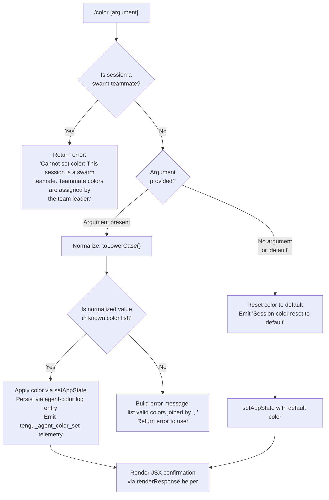

# `/color`

> Analysis basis: CC v2.1.143 bundle.js (AST extraction + Claude interpretation)
> Minimum version: v2.1.143

---

## Overview

The `/color` command sets the prompt bar color for the current Claude Code session. It accepts an optional color name or hex value, validates it against a known color list, persists the choice via `appState`, and emits a telemetry event. When invoked with no argument (or the literal `"default"`), it resets the prompt bar to its default color.

---

## Registration

| Field | Value |
|---|---|
| type | `local-jsx` |
| name | `color` |
| description | Set the prompt bar color for this session |
| argumentHint | *(none)* |
| immediate | `true` |
| module_id | `iqq` |

Analysis basis: CC v2.1.143 bundle.js:+10102359

---

## Input Branching



Analysis basis: CC v2.1.143 bundle.js:+10101336, +10101347, +10101519, +10101537, +10101561, +10101583, +10101665, +10101730, +10101787

---

## Behavioral Spec

### Swarm-Teammate Guard

When the command handler is invoked, it first checks whether the current session is operating as a swarm teammate (i.e., a subordinate agent whose color is managed externally by the team leader). If so, it immediately returns without modifying state.

```
function swarmTeammateGuard(sessionContext):
    store = getGlobalStore()
    if store indicates current session is swarm teammate:
        return errorResult(
            "Cannot set color: This session is a swarm teammate. " +
            "Teammate colors are assigned by the team leader."
        )
    return null  // no error; continue
```

Analysis basis: CC v2.1.143 bundle.js:+10101336, +10101347, +2167959, +2166818

---

### Color Argument Normalization and Validation

The raw argument string is normalized to lowercase before comparison. The implementation maintains a static list of valid color names (`knownColorList`). If the normalized value is found in that list, processing continues. Otherwise, the list is joined with `", "` and returned as part of a human-readable error.

```
function normalizeAndValidate(rawArgument, knownColorList):
    normalized = rawArgument.toLowerCase()
    if knownColorList.includes(normalized):
        return { valid: true, value: normalized }
    else:
        validOptions = knownColorList.join(", ")
        return { valid: false, message: "Invalid color. Valid options: " + validOptions }
```

Analysis basis: CC v2.1.143 bundle.js:+10101519, +10101537, +10101561, +10101583, +10101591

---

### Random Color Selection

When no argument is supplied and the command is not performing a reset, the implementation can select a color at random using `Math.floor(Math.random() * listLength)` to pick an index into the color list.

```
function pickRandomColor(knownColorList):
    index = Math.floor(Math.random() * knownColorList.length)
    return knownColorList[index]
```

Analysis basis: CC v2.1.143 bundle.js:+10101482, +10101493

---

### Default / Reset Path

When the resolved color value equals the string `"default"`, the command resets the prompt bar color to the application default and produces the confirmation message `"Session color reset to default"`.

```
function applyColorOrReset(resolvedColor, appStateWriter):
    if resolvedColor == "default":
        appStateWriter.setAppState({ promptBarColor: "default" })
        return successResult("Session color reset to default")
    else:
        appStateWriter.setAppState({ promptBarColor: resolvedColor })
        persistColorEntry(resolvedColor)   // writes "agent-color" log entry
        emitTelemetry("tengu_agent_color_set")
        return successResult(resolvedColor)
```

Analysis basis: CC v2.1.143 bundle.js:+10101681, +10101730, +10101787

---

### Color Persistence (agent-color log entry)

On a successful non-default color selection, the implementation appends a structured log entry tagged `"agent-color"` to the session's append-only log file. This uses `appendFileSync` after optionally creating the containing directory with `mkdirSync`. The log entry body is serialized with `JSON.stringify`. Internal file-size thresholds of `384` and `448` bytes are observed during this operation.

```
function persistColorEntry(colorValue, logFilePath):
    entryPayload = jsonSerialize({ type: "agent-color", color: colorValue })
    ensureDirectoryExists(dirname(logFilePath))   // mkdirSync
    appendToFile(logFilePath, entryPayload)        // appendFileSync
    emitTelemetry("tengu_agent_color_set")
```

Analysis basis: CC v2.1.143 bundle.js:+12144217, +12144238, +12144322, +12140052, +12140073, +12140100, +12140112, +12140124, +12140144

---

### Known Color List Enumeration

The implementation populates the valid color name list by calling `Object.keys` on a color-map object (`colorMapObject`). This means valid color names are the keys of that map, which are resolved at runtime.

```
function buildKnownColorList(colorMapObject):
    return Object.keys(colorMapObject)   // runtime-derived list of valid names
```

Analysis basis: CC v2.1.143 bundle.js:+10101040

---

### Response Rendering

The command's JSX render function (`renderResponse`) uses a `padEnd` operation (pad width: `40` characters) when formatting color names in its output display, and maps over color entries to produce formatted rows.

```
function renderColorResponse(colorEntries):
    rows = colorEntries.map(entry =>
        entry.name.padEnd(40) + "  " + entry.swatch
    )
    return renderJSX(rows)
```

Analysis basis: CC v2.1.143 bundle.js:+10101928, +10101963, +10102015, +10102033, +14526168, +14526181, +14528099, +40 (literal value at +14528173)

---

### App State Write

After validation, the color value is committed to the live session state via `setAppState`. This is a synchronous in-memory write that causes the prompt bar UI to re-render immediately (consistent with `immediate: true` in registration).

```
function commitToAppState(colorValue, appStateRef):
    appStateRef.setAppState({ promptBarColor: colorValue })
```

Analysis basis: CC v2.1.143 bundle.js:+10101730

---

## State & Side Effects

| Item | Detail |
|---|---|
| Telemetry | `tengu_agent_color_set` emitted on every successful non-default color application (bundle.js:+12144322) |
| Hook registration | Registers a hook via `at_.register` through the `h9` → `KL` call chain (bundle.js:+56977, +12115214) |
| appState changes | `promptBarColor` field updated synchronously via `_.setAppState` (bundle.js:+10101730) |
| Persistent log entry | Appends a JSON record tagged `"agent-color"` to the session log file via `appendFileSync` (bundle.js:+12140073) |
| Directory creation | `mkdirSync` called to ensure log directory exists before append (bundle.js:+12140112) |
| Sound | <!-- TODO: not found in depth-2 traversal; needs --depth 4 --> |
| Swarm guard | Blocks execution and returns an error string if session is a swarm teammate (bundle.js:+10101347) |
| Reset confirmation | Returns the literal string `"Session color reset to default"` when color is reset (bundle.js:+10101787) |

---

## Version History

| Version | Change |
|---|---|
| v2.1.143 | Initial analysis |

---

## Common Mistakes

1. **Passing a color name with mixed or upper case**: The command normalizes input via `.toLowerCase()` before validation. However, users may be surprised that `"Red"` or `"RED"` are treated identically to `"red"`. Always pass lowercase values to be explicit.

2. **Attempting to set color in a swarm teammate session**: The command will immediately return the error `"Cannot set color: This session is a swarm teammate. Teammate colors are assigned by the team leader."` Color cannot be overridden from within the teammate agent itself.

3. **Expecting persistence across unrelated sessions**: The `agent-color` log entry and `appState` write are scoped to the current session. A fresh session will not automatically inherit a previously set color unless the session-startup logic replays the log.

4. **Passing an unrecognized color name**: The valid color list is derived from `Object.keys` of a runtime color map. If a color name is not in that map, the command returns an error listing all valid options separated by `", "`. Use `/color` with no argument first to see the full list if unsure.

5. **Assuming `/color` is asynchronous**: The registration field `immediate: true` means the command executes synchronously before any pending input is processed. Side effects (appState write, file append) happen before the prompt returns.

---

## Appendix — Identifier Mapping

> For bundle debugging only. Identifiers change across versions.

| Identifier | Role |
|---|---|
| `tO7` | Top-level command module / entry point (exports registration and handler) |
| `dD8` | Main command handler function (core `/color` logic) |
| `eO7` | JSX render function for the color command response |
| `gD8` | Known color list builder (calls `Object.keys` on color map) |
| `q5` | Swarm-teammate session guard helper |
| `p2` | Global store accessor (calls `ti8.getStore`) |
| `V6` | React/JSX element factory (UI rendering primitive) |
| `GV` | JSX fragment or base component |
| `g5` | Inline text / styled-text JSX component builder |
| `CU` | Text styling helper (calls `GV`) |
| `__` | Additional text/style helper (calls `GV`) |
| `B26` | Color persistence / log-entry writer |
| `QZ` | Log-entry formatter (builds structured log record) |
| `Ip` | Log-entry type discriminator or sub-formatter |
| `H4H` | File append helper (calls `appendFileSync`, `mkdirSync`) |
| `x6` | File-existence / stat check utility |
| `hH` | JSON serializer wrapper (calls `JSON.stringify`) |
| `KL` | Hook registration dispatcher |
| `h9` | Low-level hook registrar (calls `at_.register`) |
| `d` | Telemetry emitter (emits `tengu_agent_color_set`) |
| `_` | App-state writer reference (exposes `setAppState`) |
| `_t6` | File-system context / job-queue manager |
| `IK` | Job path resolver |
| `b0` | Job sub-path builder |
| `x0` | Basename resolver for job files |
| `H` | Random / timer utility (calls `Math.random`, `setTimeout`) |
| `s1` | File read/cache manager (reads, parses, and caches files) |
| `$8` | Internal async utility / micro-task helper |
| `L8` | Low-level async primitive |
| `v` | Content normalization / token-processing helper |
| `G5K` | Token stream processor |
| `P7` | String redaction / sanitization helper |
| `cSH` | Content-safety handler |
| `Z5K` | Streaming file writer with byte-length tracking |
| `R6` | JSON parse wrapper |
| `o2` | Cache-entry deletion helper |
| `Bf` | Atomic file-write orchestrator |
| `eO` | Atomic write primitive (random bytes + rename) |
| `NH` | Error logging / error queue manager |
| `v_` | Error normalization helper |
| `xH` | String coercion wrapper |
| `zq` | Error formatting helper |
| `A$A` | Error context builder |
| `kNK` | Bounded error queue (shift/push circular buffer) |
| `Qi` | Color swatch / preview renderer |
| `K` | Row formatter for color list display (calls `padEnd`) |
| `pHH` | Final response wrapper / JSX container |