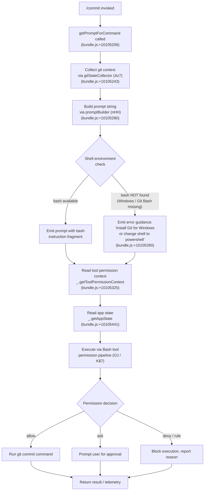

# `/commit`

> Analysis basis: CC v2.1.143 bundle.js (AST extraction + Claude interpretation)
> Minimum version: v2.1.143

---

## Overview

The `/commit` command instructs the Claude Code agent to create a git commit on behalf of the user. It is a `prompt`-type command whose handler (`getPromptForCommand`) assembles a prompt at invocation time by gathering the current git diff state, permission context, and app state, then delegates actual execution to the Bash tool pipeline through the standard tool-permission subsystem.

---

## Registration

| Field | Value |
|---|---|
| type | `prompt` |
| name | `commit` |
| description | `Create a git commit` |
| loc_byte | `10105059` |
| loc_byte_end | `10105612` |
| loc_line | `5640` |
| handler_method | `getPromptForCommand` |
| handler_method_start | `10105206` |
| handler_method_end | `10105611` |
| prompt_body.length | `203` |
| prompt_body.trace | `call→nHH(...) (1 literals)` |
| arbor_handler.name | `getPromptForCommand` |
| arbor_handler.fqn | `claude-2.1.143::getPromptForCommand` |
| arbor_handler.kind | `Method` |
| arbor_handler.resolution_path | `direct` |
| arbor_handler.n_hits | `3` |

Analysis basis: CC v2.1.143 bundle.js:+10105059

The registration block spans bytes `(10105059, 10105612)`. The handler is an inline `ObjectMethod` named `getPromptForCommand` resolved by the Arbor symbol graph via the `direct` path (the symbol falls inside the registration byte range). The Arbor resolver found 3 hits for this symbol, confirming unambiguous attribution.

---

## Input Branching

The handler exhibits more than three distinct branches based on the call graph and literals extracted: shell availability check (bash vs. powershell), permission context evaluation (allow / ask / deny / rule), and git-state collection. A Mermaid flowchart is used.



Analysis basis: CC v2.1.143 bundle.js:+10105206, +10105243, +10105280, +10105325, +10105441

---

## Behavioral Spec

### 1. Handler Entry — `getPromptForCommand`

The `getPromptForCommand` method is the sole entry point for `/commit`. Per the Arbor resolution (`direct`, n_hits=3), it is an `ObjectMethod` defined inline inside the registration object at bytes `10105206–10105611`.

```
function getPromptForCommand(context):
    gitContext   = collectGitState(context)          // gitStateCollector (Az7)
    promptText   = buildCommitPrompt(gitContext)     // promptBuilder (nHH)
    permCtx      = context.getToolPermissionContext()
    appState     = context.getAppState()
    return { type: "text", content: promptText,
             permissionContext: permCtx,
             appState: appState }
```

Analysis basis: CC v2.1.143 bundle.js:+10105206, +10105262 (literal `"text"`), +10105325, +10105441

---

### 2. Git State Collection — `gitStateCollector` (Az7)

`Az7` is called immediately after handler entry. It delegates to the environment resolver (`environmentResolver`, `mvH`) which classifies the connection mode as `"remote"` or local, then calls into the platform-resolver chain (`rY`, `L$_`, `R1`).

```
function gitStateCollector(context):
    envInfo = environmentResolver(context)      // mvH — checks "remote" literal
    model   = resolveModelName(envInfo)         // R1  → r1, rJ
    shell   = detectShellCapability(envInfo)    // dfH → G1
    return { envInfo, model, shell }
```

Key literals observed in `mvH`'s scope:
- `"remote"` — environment classification tag (bundle.js:+9817813)
- `"Claude Opus 4.7"` — model display name resolved at this layer (bundle.js:+9818024)

Analysis basis: CC v2.1.143 bundle.js:+10105243, +9817805, +9817919, +9817935, +9817996, +9818003

---

### 3. Prompt Construction — `promptBuilder` (nHH)

`nHH` is the core prompt-assembly function. It receives the git context and produces the final string sent to the agent. The prompt body is 203 characters long and is assembled via a single literal call traced as `call→nHH(...) (1 literals)`.

```
function promptBuilder(gitContext, appState, toolPermCtx):
    shellType = detectShell(gitContext)          // checks "bash" / "powershell" literals
    if shellType == "bash" and not bashAvailable():
        // Windows fallback path
        return errorGuidancePrompt(             // references Git-for-Windows URL
            "install Git Bash or switch to powershell"
        )
    commitLines = assembleCommitLines(gitContext)  // ZHq — trims, joins, pushes
    commitLines = sanitizeSpecialChars(commitLines) // j68 — replaces "!`" sequences
    toolResult  = executeToolCall(commitLines,      // OJ → K$7 pipeline
                                  toolPermCtx,
                                  appState)
    return buildFinalPrompt(toolResult)             // XL7 → ZHq, XH
```

Key literals:
- `"bash"` (bundle.js:+9524739)
- `"powershell"` (bundle.js:+9524985)
- `"!`"` — special-character sequence sanitized from commit input (bundle.js:+9525055)
- `"Permission denied"` — returned if permission check fails (bundle.js:+9525419)
- `"/commit"` — self-reference literal present in handler scope (bundle.js:+10105598)

Analysis basis: CC v2.1.143 bundle.js:+10105280, +9524739, +9524985, +9525055, +9525196, +9525419, +9525498, +9525556

---

### 4. Shell Detection — `shellDetector` (dfH) / `shellCapabilityChecker` (G1)

`dfH` checks whether the current shell identifier ends with a known suffix (`H.endsWith`, bundle.js:+2161280), then calls `G1` which further inspects the shell descriptor string for `"application-inference-profile"` (bundle.js:+2160144) and applies inclusion logic.

```
function shellDetector(shellDescriptor):
    if shellDescriptor.endsWith(knownSuffix):
        return shellCapabilityChecker(shellDescriptor)  // G1
    return null

function shellCapabilityChecker(descriptor):
    if descriptor.includes("application-inference-profile"):
        // Inference-profile path
        return resolveInferenceProfile(descriptor)   // WI8, PP
    return descriptor
```

Analysis basis: CC v2.1.143 bundle.js:+2161280, +2161325, +2160133, +2160144

---

### 5. Permission Pipeline — `toolExecutor` (OJ) / `permissionChecker` (K$7)

After the prompt is built, the command enters the standard Bash-tool permission pipeline. `OJ` coordinates app state mutations and permission resolution; `K$7` performs the actual permission decision.

```
function toolExecutor(toolInput, permCtx, appState):
    updatedPermCtx = permCtx with appState merged    // _oH — Object.assign + setAppState
    decision = permissionChecker(toolInput,           // K$7
                                 updatedPermCtx)
    switch decision.outcome:
        case "allow":
            result = runBashCommand(toolInput)
        case "ask":
            result = awaitUserApproval(toolInput)    // NH → interactive prompt
        case "deny":
            result = { error: "Permission denied" }
        case "rule":
            result = applyDenyRule(toolInput)        // jD8 (recursive)
    postProcess(result)                               // NJ6 — auto-mode classifier
    return result

function permissionChecker(toolInput, permCtx):
    // Check deny rules first
    if hasDenyRule(toolInput):           // pP6 — "deny" literal (+9896109)
        return { outcome: "deny" }
    // Check sandbox status
    if sandboxEnabled and autoAllowBash:  // c_.isSandboxingEnabled (+9896274)
        return { outcome: "allow" }
    // Evaluate safety via classifier (S7)
    safetyResult = safetyClassifier(toolInput)
    if safetyResult == "ask":            // literal +9896363
        return { outcome: "ask" }
    return { outcome: safetyResult }
```

Key literals in this sub-graph:
- `"deny"` (bundle.js:+9896109), `"rule"` (+9896137), `"ask"` (+9896363), `"allow"` (+9897315)
- `"bypassPermissions"` (+9896935), `"plan"` (+9896965)
- `"Dangerous rm operation"` (+9897078), `"Dangerous rmdir operation"` (+9897125)
- `"Action requires interactive approval and permission prompts are not available in this context"` (+9900021)

Analysis basis: CC v2.1.143 bundle.js:+9899229, +9896052, +9896109, +9896274, +9896300, +9896340, +9896363, +9897315, +9899271, +9899337, +9899414

---

### 6. Auto-Mode Classifier Pipeline — `autoModeOrchestrator` (NJ6)

When auto-mode is active, `NJ6` runs a multi-stage XML classifier to decide whether to allow or block the Bash command. This sub-pipeline is reached from both `OJ` (bundle.js:+9901894) and internal tool dispatch.

```
function autoModeOrchestrator(toolInput, transcript):
    // Stage 1: fast XML classifier
    stage1Result = runFastClassifier(toolInput)   // uQ4 → xml_fast path
    if stage1Result == "allow":
        emit("Allowed by fast classifier")        // literal +8104373
        return { outcome: "allow" }
    if stage1Result == "block":
        emit("Blocked by fast classifier")        // literal +8104994
        return { outcome: "deny" }

    // Stage 2: thinking classifier (if configured)
    stage2Result = runThinkingClassifier(toolInput)  // uQ4 → xml_2stage / xml_thinking
    switch stage2Result:
        case "refusal":     return { outcome: "deny",  reason: "policy_refusal" }
        case "max_tokens":  return { outcome: "deny",  reason: "max_tokens" }
        case "unparseable": return { outcome: "deny",  reason: "parse_failure" }
        case "interrupted": emit("aborted by user"); return { outcome: "deny" }
        case "transcript_too_long":
            if headlessMode:
                abortAgent("context window exceeded")  // +9904252
            else:
                fallbackToManualApproval()             // +9904585
        case "unavailable":
            if failClosed:
                return { outcome: "deny",
                         reason: "Classifier unavailable" }   // +9904968
            else:
                fallbackToNormalPermissions()                 // +9905032
    return stage2Result
```

Stage constants: `"xml_2stage"` (+8103460), `"xml_fast"` (+8103484), `"xml_thinking"` (+8103495), `"both"` (+8103453). Token budget limits: `256` (+8103819), `64` (+8103823), `4096` (+8105186).

Analysis basis: CC v2.1.143 bundle.js:+9901894, +8103460, +8103484, +8103495, +8104373, +8104994, +8104580, +8105186, +9904252, +9904585, +9904793, +9905032

---

### 7. Commit Prompt Text Assembly — `commitLineAssembler` (ZHq)

`ZHq` is called from `promptBuilder` (nHH) and is responsible for concatenating the individual diff lines or staging summary into the final commit message context.

```
function commitLineAssembler(lines):
    result = []
    for line in lines:
        trimmed = line.trim()          // H.trim  +9525692
        result.push(trimmed)           // q.push  +9525701
    extra = extraContext.trim()        // _.trim  +9525721
    result.push(extra)
    return result.join("\n")           // q.join  +9525810
```

Analysis basis: CC v2.1.143 bundle.js:+9525692, +9525701, +9525721, +9525810

---

### 8. Tool Result Persistence — `toolResultPersister` (BFH / Ur9)

After the Bash tool completes, `BFH` maps the raw tool result to a `ToolResultBlockParam` and delegates to `Ur9` for size-aware persistence.

```
function toolResultPersister(rawResult):
    block = mapToolResultToBlockParam(rawResult)   // H.mapToolResultToToolResultBlockParam
    if isEmptyResult(block):                        // t94 — checks trim + Array.isArray
        emit(tengu_tool_empty_result)
        return { persisted: false }
    if containsNonTextContent(block):               // gr9 — checks image/document types
        throw "Cannot persist tool results containing non-text content"  // +4848029
    size = calculateSize(block)                     // mr9 — Math.min, Number.isFinite
    persist(block, size)
    emit(tengu_tool_result_persisted)
    return { persisted: true }
```

Non-text content type literals: `"image"` (+4850290), `"document"` (+4850308).

Analysis basis: CC v2.1.143 bundle.js:+4848694, +4848744, +4849185, +4849201, +4849441, +4848029, +4850290, +4850308

---

## State & Side Effects

| Item | Detail |
|---|---|
| Telemetry — `tengu_cobalt_ridge` | Fired during model/platform resolution (`G6`, bundle.js:+3194116) |
| Telemetry — `tengu_auto_mode_fallback_to_ask` | Fired when auto-mode falls back to interactive ask (`OJ`, bundle.js:+9900142) |
| Telemetry — `tengu_auto_mode_decision` | Fired with the final allow/deny outcome of the auto-mode classifier (`OJ`, bundle.js:+9900934) |
| Telemetry — `tengu_auto_mode_config` | Fired when the auto-mode classifier configuration is read (`_R1`, bundle.js:+8113136) |
| Telemetry — `tengu_auto_mode_malformed_tool_input` | Fired when the classifier receives malformed tool input (`DR1`, bundle.js:+8098720) |
| Telemetry — `tengu_auto_mode_outcome` | Fired with the final classifier outcome object (`VQ`, bundle.js:+8113996) |
| Telemetry — `tengu_bash_allowlist_strip_all` | Fired when the entire Bash allowlist is stripped during permission evaluation (`OJ`, bundle.js:+9902247) |
| Telemetry — `tengu_iron_gate_closed` | Fired when the headless iron-gate safety check blocks execution (`OJ`, bundle.js:+9904751) |
| Telemetry — `tengu_auto_mode_denial_limit_exceeded` | Fired when the consecutive or total denial limit is exceeded in headless mode (`q$7`, bundle.js:+9894233) |
| Telemetry — `tengu_tool_empty_result` | Fired when the Bash tool returns an empty result (`Ur9`, bundle.js:+4849201) |
| Telemetry — `tengu_tool_result_persisted` | Fired when a tool result is successfully persisted (`Ur9`, bundle.js:+4849441) |
| appState changes | `_oH` merges permission context into app state via `Object.assign` + `setAppState` (bundle.js:+9893732, +9893776). `hK1` adds to active tool set (bundle.js:+5450885). `jzH` removes from active tool set on completion (bundle.js:+5451004). |
| Hook registration | `WI` calls `Ff` to register commit-related hooks (bundle.js:+4035661). `DC` calls `ft` for hook teardown (bundle.js:+4037499). |
| File I/O | `OR1` creates directories (`lVH.mkdir`) and writes files (`lVH.writeFile`) for classifier transcript persistence (bundle.js:+8096938, +8097483). Encoding: `"utf-8"` (+8097501). |
| Temp file cleanup | `q` calls `n8K.unlinkSync` to remove temporary files after tool execution (bundle.js:+14482768). |
| Settings load | `Lu` emits `"loadSettingsFromDisk_start"` (+1204991) and `"loadSettingsFromDisk_end"` (+1205047) events during environment resolution. |
| Sound | <!-- TODO: not found in depth-2 traversal; needs --depth 4 --> |

---

## Version History

| Version | Change |
|---|---|
| v2.1.143 | Initial analysis |

---

## Common Mistakes

1. **Running `/commit` without a staged diff** — The command relies on the Bash tool to execute `git commit`. If nothing is staged (`git add` not run first), the commit will fail with a standard git error. `/commit` does not automatically stage files.
2. **Missing Git Bash on Windows** — When Claude Code detects that the shell is configured as `bash` but Git Bash is not installed, the handler emits an error guidance prompt directing the user to install Git for Windows (`https://git-scm.com/downloads/win`) or switch the skill's frontmatter shell to `powershell`. Analysis basis: CC v2.1.143 bundle.js:+9524739, +9524985.
3. **Blocked by permission rules** — If a `deny` rule matches the generated `git commit` Bash invocation, the command will be blocked silently. Use `/config` to review deny rules before running `/commit` in restricted environments.
4. **Auto-mode classifier denial limits** — In headless mode, exceeding the consecutive or total denial threshold triggers `tengu_auto_mode_denial_limit_exceeded` and aborts the agent (bundle.js:+9894424). `/commit` shares this limit with all other Bash-tool invocations in the session.
5. **Context window overflow in auto-mode** — If the conversation transcript is very large, the auto-mode classifier may hit the context window limit. In interactive mode this falls back to manual approval; in headless mode the agent is aborted. Run `/compact` to reduce transcript size before invoking `/commit` in long sessions (bundle.js:+9904585).
6. **Special shell characters in commit messages** — The `"!`"` sequence is explicitly sanitized by `sanitizeSpecialChars` (j68, bundle.js:+9525055). Commit messages containing backtick-bang sequences may be silently modified.

---

## Appendix — Identifier Mapping

> For bundle debugging only. Identifiers change across versions.

| Identifier | Role |
|---|---|
| `__handler_commit` | Synthetic BFS entry point for the `/commit` handler (bookkeeping, not a real bundle symbol) |
| `Az7` | `gitStateCollector` — top-level git context and environment collector called from handler |
| `mvH` | `environmentResolver` — classifies connection mode (remote/local), resolves model and shell |
| `fSH` | Sub-function called from `environmentResolver`; likely fetches remote connection info |
| `z$6` | Shared utility called from both `environmentResolver` and `urlResolver` |
| `rY` | `platformContextBuilder` — assembles platform context from environment info |
| `s_` | `moduleInitializer` — ES-module init helper; sets up `__esModule`, binds `QZ6`, `dZ6`, `xAK`, `no_` |
| `q` | `tempFileCleaner` — calls `n8K.unlinkSync` to remove temporary files |
| `L$_` | `urlResolver` — maps environment to base URL (`http://localhost:4000`, staging, production) |
| `R1` | `modelResolver` — resolves model name and normalization |
| `Na` | Sub-resolver called from `modelResolver`; invokes `TV`, `h8H`, `_A`, `BB` |
| `r1` | `modelNameNormalizer` — trims, lowercases, replaces model alias strings |
| `rJ` | `modelChainResolver` — calls `r1` and `nJ` in sequence |
| `dfH` | `shellDetector` — checks shell descriptor suffix via `endsWith` |
| `H` | Ambient utility / string-target variable; also hosts `Math.random`/`setTimeout` in one scope |
| `G1` | `shellCapabilityChecker` — inspects `"application-inference-profile"` in shell descriptor |
| `oi8` | Wrapper that calls `shellDetector` (dfH); likely `shellDetectorWrapper` |
| `R_` | `settingsLoader` — calls `Lu` to load settings from disk |
| `Lu` | `diskSettingsReader` — emits `loadSettingsFromDisk_start/end` telemetry, reads config |
| `YK` | `platformDetector` — detects `"windows"` platform; used by both `Az7` and `nHH` |
| `nHH` | `promptBuilder` — builds the final prompt string sent to the agent; main logic of `/commit` |
| `Qu` | `contextStringFormatter` — formats context strings using `d6`, `xH`, `Sq`, `T_H`, `G6` |
| `xH` | `stringCoercer` — wraps `String()` constructor |
| `Sq` | Secondary `stringCoercer` — also wraps `String()` constructor |
| `G6` | `telemetryEmitter` — fires `tengu_cobalt_ridge`; manages `sMH`, `nA_`, `x76`, `PF` sets |
| `m76` | Sub-function of `telemetryEmitter`; likely constructs event payload |
| `p76` | Sub-function of `telemetryEmitter`; likely sends event payload |
| `Ts` | `stringFormatter` — calls `xH` and `jF` |
| `Ci6` | `telemetryCacheManager` — manages `nA_` and `sMH` caches for dedup |
| `N6` | `telemetryEventRecorder` — records event with `Date.now` timestamp, calls `nhL` |
| `j68` | `specialCharSanitizer` — replaces `"!`"` sequences via `H.replace` |
| `OJ` | `toolExecutor` — orchestrates tool execution, permission checks, and app state updates |
| `K$7` | `permissionChecker` — core permission decision function for Bash tool |
| `pP6` | `denyRuleEvaluator` — evaluates deny rules (`"deny"` literal); calls `HLH`, `yR_`, `H9q` |
| `A` | Ambient context/tool object; provides `getToolPermissionContext`, `getAppState` |
| `SR_` | Secondary deny/rule evaluator called from `permissionChecker` |
| `mZ` | `sandboxPermissionResolver` — checks sandboxing flags and `areUnsandboxedCommandsAllowed` |
| `S7` | `safetyClassifier` — evaluates safety via `"classifier"` / `"hook"` / `"passthrough"` modes |
| `NH` | `errorLogger` — logs errors via `Wc.logError`, pushes to `xRH` |
| `jD8` | `denyRuleApplier` — recursive; applies matching deny rules |
| `gQ` | `permissionQueryHandler` — recursive self-caller; evaluates `"updatedInput"` etc. |
| `_9q` | `permissionStateUpdater` — updates permission state after decision |
| `sAq` | Sub-function in permission pipeline |
| `eAq` | `ruleEvaluator` — calls `FvH`, `yR_` |
| `v` | `modelStringFormatter` — formats model identifier strings with uppercase, trim, etc. |
| `hH` | `jsonStringifier` — wraps `JSON.stringify` |
| `Gz6` | Sub-function called in `toolExecutor` around app state read |
| `_oH` | `appStateMerger` — merges permission context into app state via `Object.assign` + `setAppState` |
| `L9q` | Sub-function in `toolExecutor` pipeline |
| `d` | Utility called from multiple sites; likely `objectSpread` or `assign` helper |
| `a1` | `keyChecker` — checks `Object.hasOwn` and `startsWith` for `"mcp__"` prefix |
| `rA8` | Sub-function in `toolExecutor`; likely result-routing helper |
| `hx` | Sub-function in `toolExecutor` |
| `yE_` | Sub-function before `hK1` in `toolExecutor` |
| `hK1` | `activeToolAdder` — adds tool to active set via `q.add` |
| `NJ6` | `autoModeOrchestrator` — runs multi-stage XML auto-mode classifier |
| `YR1` | `mapSetter` — calls `_.set` on classifier result map |
| `wR1` | Calls `DR1`; likely `classifierResultWriter` |
| `_R1` | `autoModeConfigReader` — fires `tengu_auto_mode_config`; calls `G6`, `R1` |
| `yQ4` | `permissionsTemplateBuilder` — builds `<permissions_template>` XML block |
| `DK` | `toolFilterer` — filters tool list via `H.filter` |
| `zR1` | `classifierInputAssembler` — assembles classifier input array with dedup via `ZQ4` |
| `VQ4` | `settingsDenyRulesBuilder` — builds `<settings_deny_rules>` XML block |
| `DR1` | `classifierRequestBuilder` — builds classifier API request; fires `tengu_auto_mode_malformed_tool_input` |
| `J` | Process/child-process manager; calls `A.values`, `y.kill` (SIGTERM) |
| `Gj` | `sliceFormatter` — slices and formats strings via `H.slice`, `KZ`, `c$6` |
| `f` | Connection/socket manager; calls `A.close`, `q.close` |
| `yi` | Sub-function used in multiple classifier steps |
| `NE_` | `autoModeMarker` — marks entries with `"auto_mode"` / `"1h"` identifiers |
| `pQ4` | Calls `XR1`; likely `fastClassifierRunner` |
| `uQ4` | `classifierStageRunner` — runs XML classifier stages (`xml_fast`, `xml_2stage`, `xml_thinking`) |
| `UQ4` | Secondary caller of `XR1`; likely `thinkingClassifierRunner` |
| `HR1` | Sub-function in `autoModeOrchestrator` |
| `PR1` | `timestampRecorder` — records timestamps; called with `Date.now` |
| `KKH` | `cacheKeyBuilder` — builds cache keys; checks `"ephemeral"` / `"global"` |
| `IE_` | `stage1ClassifierHandler` — handles stage-1 XML classifier results |
| `ZE_` | `stage2ClassifierHandler` — handles stage-2 results |
| `LH6` | Sub-function in classifier stage handling |
| `VE_` | Classifier result validator |
| `ih1` | `toolUseBlockFinder` — finds tool-use block via `H.find` |
| `VQ` | `classifierOutcomeRecorder` — fires `tengu_auto_mode_outcome`, `tengu_permission_auto_mode_classifier` |
| `If8` | Sub-function in classifier pipeline |
| `rh1` | `schemaParser` — calls `_.safeParse` for classifier response validation |
| `GR1` | Calls `Cf_`; likely `classifierResultFinalizer` |
| `XH` | `stringConverter` — wraps `String()` constructor |
| `OR1` | `transcriptPersister` — creates dirs and writes classifier transcript to file system |
| `WR1` | `timeoutHandler` — handles `wall_clock_timeout`, `connection_timeout`, `connection_error` |
| `jzH` | `activeToolRemover` — removes tool from active set via `q.delete` |
| `OF6` | `tokenCountEmitter` — calls `QfH` to emit token usage counts |
| `QfH` | `tokenUsageHandler` — processes `inputTokens`, `outputTokens`, cache token counts |
| `ceH` | `inputTokenCounter` — reads `"inputTokens"` via `Object.values` |
| `tj` | `outputTokenCounter` — reads `"outputTokens"` via `Object.values` |
| `leH` | `cacheReadTokenCounter` — reads `"cacheReadInputTokens"` |
| `neH` | `cacheCreationTokenCounter` — reads `"cacheCreationInputTokens"` |
| `xE` | Calls `G6`; likely `telemetryForwarder` |
| `M9q` | Sub-function in `toolExecutor` post-processing |
| `XK1` | Sub-function in `toolExecutor` |
| `q$7` | `denialLimitChecker` — checks total/consecutive denial counts; fires `tengu_auto_mode_denial_limit_exceeded` |
| `WK1` | Sub-function called from `denialLimitChecker` |
| `L` | Connection/lifecycle manager; manages `q.add`, `f.finally`, `q.delete` |
| `f9q` | Sub-function in `toolExecutor` |
| `A$7` | `toolPermissionContextSetter` — orchestrates `pKH`, `eiH`, `VDH`, `DC`, `WI`, `v_` |
| `pKH` | `permissionRequestBuilder` — builds `"PermissionRequest"` objects |
| `eiH` | Sub-function in permission context setting; calls `v` |
| `VDH` | `secondaryPermissionChecker` — mirrors `K$7` logic for context updates |
| `DC` | `hookTeardown` — calls `ft` |
| `WI` | `hookRegistrar` — calls `Ff` to register hooks |
| `v_` | `errorWrapper` — wraps `Error` and `String` |
| `K9q` | Final sub-function in `toolExecutor` |
| `Sj` | `agentLoopRunner` — calls `B9q` to drive the Bash agent loop |
| `B9q` | `bashAgentLoop` — main agent loop; processes `stop_sequence` / `message` results |
| `$` | `jzqCaller` — calls `JZq` |
| `M` | `activeSessionManager` — manages session map via `L.get`, `L.values`, `B95` |
| `BFH` | `toolResultProcessor` — maps raw tool result to `ToolResultBlockParam`, calls `Ur9`, `mr9` |
| `Ur9` | `toolResultPersistenceHandler` — checks content type, fires `tengu_tool_empty_result` / `tengu_tool_result_persisted` |
| `t94` | `emptyResultChecker` — checks `trim()` and `Array.isArray` |
| `gr9` | `nonTextContentDetector` — detects `"image"` / `"document"` type blocks |
| `Qr9` | `textBlockReducer` — reduces text blocks via `H.reduce` |
| `wOH` | `contentPersistenceRouter` — routes content for persistence; throws on non-text |
| `jOH` | Sub-function in persistence routing |
| `JOH` | `inlineContentHandler` — calls `i1` |
| `mr9` | `resultSizeCalculator` — computes size using `Number.isFinite`, `Math.min`, `G6` |
| `ZHq` | `commitLineAssembler` — trims and joins commit message lines |
| `_` | Ambient variable / schema object; hosts `toLowerCase`, `safeParse`, `replace` |
| `K` | Ambient string variable; hosts `replace`, and `L.map` / `f.padEnd` |
| `XL7` | `finalPromptWrapper` — calls `ZHq` and `XH` to wrap the final prompt |

---

Note: index built via Arbor fallback; some signals (telemetry, literals) may be missing — see arbor-fallback.js.