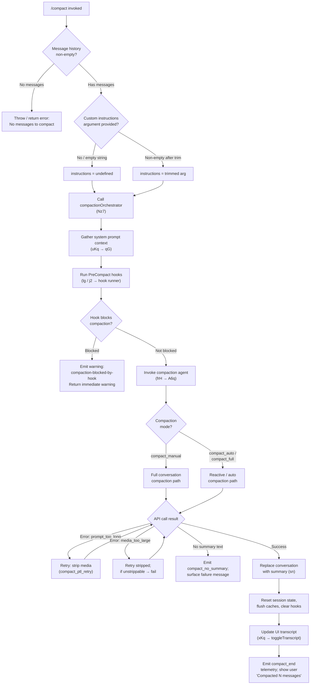

# `/compact`

> Analysis basis: CC v2.1.143 bundle.js (AST extraction + Claude interpretation)
> Minimum version: v2.1.143

---

## Overview

`/compact` frees up context window space by requesting a summarization of the current conversation and replacing the conversation history with that summary. The command accepts optional custom instructions to guide the summarization, and supports both manual (explicit user invocation) and automatic (reactive, triggered by context pressure) operating modes. After compaction the session state, hooks, and UI are updated to reflect the newly condensed context.

---

## Registration

| Field | Value |
|---|---|
| type | `local` |
| name | `compact` |
| description | `Free up context by summarizing the conversation so far` |
| argumentHint | `<optional custom summarization instructions>` |
| supportsNonInteractive | `true` |
| thinClientDispatch | `post-text` |
| module_id | `mKq` |
| load_inline | `true` |
| loc_byte | `10132282` |
| loc_byte_end | `10132595` |
| loc_line | `5726` |
| arbor_handler.name | `vz7` |
| arbor_handler.fqn | `claude-2.1.143::vz7` |
| arbor_handler.kind | `AsyncFunction` |
| arbor_handler.resolution_path | `module_id` |
| arbor_handler.n_hits | `0` |

Analysis basis: CC v2.1.143 bundle.js:+10132282

---

## Input Branching

The handler has 4+ distinct branches: no-messages guard, custom-instructions trim, manual compaction path, and two reactive compaction sub-paths. A Mermaid flowchart is used.



Analysis basis: CC v2.1.143 bundle.js:+10131366, +10131391, +10131429, +10131495, +10131559, +10131622, +10131694, +10131860

---

## Behavioral Spec

### 1. Entry Guard — Empty History Check

```
async function compactCommandHandler(args, context):
    messages = getMessageHistory(context)  // T3 → t$7
    if messages is empty:
        throw Error("No messages to compact")
    customInstructions = args.trim()       // H.trim at +10131429
    if customInstructions == "":
        customInstructions = undefined
    return compactionOrchestrator(context, customInstructions)
```

Analysis basis: CC v2.1.143 bundle.js:+10131391 (Error), +10131397 (literal "No messages to compact"), +10131429 (H.trim)

---

### 2. Compaction Orchestrator (compactionOrchestrator / `Nz7`)

This is the top-level async coordinator, which begins with a `performance.now` timestamp, spawns parallel initialization, and then delegates to the compaction agent runner.

```
async function compactionOrchestrator(context, customInstructions):
    startTime = performance.now()           // +10128970
    progressStatus = "compact_progress"     // +10128833

    // Run PreCompact hook set
    [systemPromptParts, hookResult] = await Promise.all([
        buildSystemPromptContext(context),  // uKq
        runPreCompactHooks(context)         // lg/j2
    ])

    if hookResult.blocksCompaction:
        return { type: "warning",
                 reason: "compaction-blocked-by-hook" }  // +9558570

    // Emit sdk_status = "compacting"  // +10128949
    setStreamMode("requesting")         // +10129208

    result = await runCompactionAgent(
        context, systemPromptParts, customInstructions
    )                                   // frH + A6q

    if result.error == "prompt_too_long":
        // tengu_compact_ptl_retry at +9560397
        result = await retryStrippingMedia(...)

    if result.success:
        applyCompactedState(context, result.summary)  // sn
        updateTranscriptUI(context)                    // xKq
        emitCompactEnd(startTime)                      // +10130357
        return buildSuccessMessage(result)
    else:
        return buildFailureMessage(result.errorKind)
```

Analysis basis: CC v2.1.143 bundle.js:+10128970 (performance.now), +10129019 (Promise.all), +10129107 (uKq), +10129133 (xS_), +10129336 (ow_), +10129438 (Error), +10129894 (sn)

---

### 3. System-Prompt Context Builder (`uKq`)

Assembles the current agent system prompt, app state, and tool permission context to pass as context to the summarization agent.

```
async function buildSystemPromptContext(context):
    appState      = context.getAppState()             // H.getAppState +10130830
    toolPerms     = context.getToolPermissionContext() // +10130908
    fullPrompt    = buildSystemPrompt(appState, toolPerms)  // Tb
    [promptParts, kzResult, ewResult] = await Promise.all([...])
    // +10131163
    return { appState, toolPerms, fullPrompt, ... }
```

Analysis basis: CC v2.1.143 bundle.js:+10130830, +10130854 (qG), +10130897, +10130908, +10131163

---

### 4. Pre-Compact Hook Runner (`lg` → `j2`)

Executes all registered `PreCompact` hooks (literal `"PreCompact"` at +12222308) before compaction proceeds, collects their results, and checks for a block signal.

```
async function runPreCompactHooks(context):
    hookDefs = collectHooksOfType("PreCompact")   // +12222308 "PreCompact"
    results  = await executeHooks(hookDefs, context)  // j2
    blocked  = results.some(r => r.decision == "block")
    return { blocked, results }
```

Analysis basis: CC v2.1.143 bundle.js:+12222308 (literal "PreCompact"), +12222389 (j2 call), +12222480 (K.filter)

---

### 5. Compaction Agent Invocation (`frH` → `A6q`)

`frH` is the compaction session runner. It sets up an ephemeral sub-agent with a restricted permission context (tool use denied during compaction), sends the message history as its prompt, and streams back a text-only summary.

```
async function runCompactionAgent(context, systemParts, customInstructions):
    // Classify compaction mode
    mode = context.isAutoCompact ? "compact_auto" : "compact_manual"
    // Literal "compact_auto" at +9559209, "compact_manual" at +9559224

    // Build summarizer system prompt
    // "You are a helpful AI assistant tasked with summarizing conversations."
    // literal at +9571334

    // Block tool use during compaction
    // "Tool use is not allowed during compaction" literal at +9569352

    // Determine messages to summarize via eHq
    messagesToSummarize = sliceMessageWindow(history)  // eHq

    // Emit tengu_compact telemetry (+9562230)

    // Call API via Jhq (the main query loop)
    response = await queryAPI(summarizationMessages)

    if response has no text content:
        // "compact_no_summary" event at +9560666
        return { success: false, errorKind: "no_summary",
                 message: "Failed to generate conversation summary..." }

    summaryText = extractText(response)
    return { success: true, summary: summaryText, mode }
```

Analysis basis: CC v2.1.143 bundle.js:+9559209, +9559224, +9559249 (performance.now), +9559354 (_.getToolPermissionContext), +9559582 (lg/hooks), +9559944 (tengu_compact_cache_prefix), +9560207 (eHq), +9560666 (compact_no_summary), +9561378 (compact_full), +9562230 (tengu_compact)

---

### 6. Message Window Slicing (`eHq`)

Determines which messages from the conversation history to include in the summarization prompt, trimming to fit context limits. Uses `Math.max`, `Math.floor`, `Math.min` to compute offsets and a 20% headroom factor (literal `0.2` at +9558248).

```
function sliceMessageWindow(history):
    n       = history.length
    start   = Math.max(0, Math.floor(n * headroomFactor))
    end     = n
    sliced  = history.slice(start, end)     // q.slice at +9558304
    // Strip attachments not needed for summary (FBH / KTH)
    return filterAttachmentsForSummary(sliced)
```

Analysis basis: CC v2.1.143 bundle.js:+9558078 (H.slice), +9558189 (KZ), +9558217 (Math.max), +9558228 (Math.floor), +9558248 (0.2), +9558259 (Math.min), +9558304 (q.slice)

---

### 7. Post-Compact State Reset (`sn`)

After the summary is obtained, `sn` performs a comprehensive cleanup: resets the conversation message store, flushes caches, clears hook registrations, and signals sub-systems to refresh.

```
function applyCompactedState(context, summaryText):
    // Insert summary as new conversation seed
    replaceConversationWithSummary(context, summaryText)  // T1H
    // Clear precomputed compact cache
    // tengu_precomputed_compact_discarded → K98

    // Reset state stores
    clearLaqCache()          // $98 → lAq.clear  +9876532
    clearXz6Cache()          // rq1 → Xz6.clear  +5398693
    clearPwCache()           // rq1 → Pw_.clear  +5398705
    resetAutonomousLoop()    // bz4.resetAutonomousLoopDelivered +5472860
    clearHookRegistry()      // tj

    // Emit post_compact_cleanup (+5472751)
    // Mark session as compacted (post_compact at +5477646)
```

Analysis basis: CC v2.1.143 bundle.js:+10131622, +5472735 (T1H), +5472745 (K98), +5472798 (F$6), +5472813 (Pn), +5472823 ($98), +5472829 (rq1), +5472835 (CK1), +5472841 (an), +5472860 (bz4.resetAutonomousLoopDelivered), +5472910 (tj)

---

### 8. UI Update after Compact (`xKq`)

Registers a keybinding (`ctrl+o` / `app:toggleTranscript`), displays a dim-formatted count of compacted messages, and joins message summaries for display.

```
function updateTranscriptUI(context):
    // Toggle transcript action registered
    // "app:toggleTranscript" at +10130635
    // "ctrl+o" keybinding at +10130667
    // "Global" scope at +10130658

    summaryLine = "Compacted " + messageCount  // +10130774
    displayLine = M6.dim(summaryLine)          // M6.dim at +10130767
    K.join(", ")                               // +10130787
```

Analysis basis: CC v2.1.143 bundle.js:+10130619 (AnH/Zd4), +10130632 (Lj), +10130635, +10130658, +10130667, +10130767, +10130774, +10130787

---

### 9. Reactive / Auto-Compact Path (`ow_` → `aK1`)

When context pressure triggers automatic compaction, `ow_` orchestrates a reactive compact attempt distinct from the manual path. It checks that there are at least 2 message groups (literal `"Reactive compact: fewer than 2 groups, nothing to compact"` at +5448092), computes `compact_reactive` metrics, calls the core compaction routine, and on success emits `tengu_reactive_compact_succeeded`.

```
async function reactiveCompactOrchestrator(context):
    // tengu_reactive_compact_attempt at +5448815
    groups = groupMessages(context.history)   // H98

    if groups.length < 2:
        // "too_few_groups" at +5448182; return early
        return { skipped: true, reason: "too_few_groups" }

    result = await performCompaction(groups)  // jz4 → reactive-compact

    if result.failed:
        // tengu_reactive_compact_failed at +5476293
        emitFailure(result)
        return

    // tengu_reactive_compact_succeeded at +5478255
    applyReactiveCompactedState(context, result)
    emitPostCompact()   // post_compact at +5477646
```

Analysis basis: CC v2.1.143 bundle.js:+5476014 (Gj), +5476044 (performance.now), +5476108 (H98), +5476211 (m0), +5476291 (d), +5476361 (cD), +5476524 (J8), +5476583 (mH), +5476690 (aK1), +5448092, +5448182, +5448815

---

### 10. Auto-Compact Configuration Check (`T3` → `US_`)

`T3` → `US_` reads the `autoCompactEnabled` configuration key (literal at +9578699) and converts the string representation (`"auto"`, integers, percentages) to a numeric threshold or boolean.

```
function readAutoCompactConfig(config):
    raw = config.autoCompactEnabled    // +9578699
    if raw == "auto":                  // +9576641
        return AUTO_THRESHOLD
    if raw.endsWith("%"):              // +9576670
        pct = parseFloat(raw)          // +9576688
        return Math.round(pct * 1000 / 100)  // +9576855
    parsed = parseInt(raw, 10)         // +9576762
    if Number.isFinite(parsed):        // +9576808
        return parsed
    return DEFAULT
```

Analysis basis: CC v2.1.143 bundle.js:+9993474 (t$7), +9578699 (literal "autoCompactEnabled"), +9576611 (H.trim), +9576641 ("auto"), +9576670 (_.endsWith), +9576688 (parseFloat), +9576762 (parseInt), +9576808 (Number.isFinite), +9576855 (Math.round)

---

### 11. Compact Boundary Marker (`T3` / `t$7`)

A special message type `"compact_boundary"` (literal at +9993344) with role `"system"` (literal at +9993322) is inserted at index 1 or 0 of the message array to mark where old history was truncated. The values `1` and `0` appear at +9993398 and +9993403.

```
function insertCompactBoundaryMarker(messages):
    marker = { role: "system",           // "system" at +9993322
               type: "compact_boundary", // "compact_boundary" at +9993344
               content: summaryText }
    messages.splice(1, 0, marker)        // index 1 at +9993398, 0 at +9993403
    return messages
```

Analysis basis: CC v2.1.143 bundle.js:+9993322, +9993344, +9993398, +9993403, +9993474, +9993497

---

## State & Side Effects

| Item | Detail |
|---|---|
| Telemetry — compact core | `tengu_compact` (+9562230), `tengu_compact_cache_prefix` (+9559944), `tengu_compact_cache_sharing_success` (+9570142), `tengu_compact_cache_sharing_fallback` (+9570727), `tengu_compact_failed` (+9572553), `tengu_compact_ptl_retry` (+9560397), `tengu_compact_no_summary` (emitted via `compact_no_summary` literal at +9560666) |
| Telemetry — reactive compact | `tengu_reactive_compact_attempt` (+5448815), `tengu_reactive_compact_failed` (+5476293), `tengu_reactive_compact_succeeded` (+5478255), `tengu_precomputed_compact_discarded` (+5456309) |
| Telemetry — OTEL compaction span | `"compaction"` attribute on OTEL span (+4868914), `compact_end` event (+10130357) |
| Telemetry — other | `tengu_compact_full` literal `compact_full` at +9561378, `compact_reactive` at +5476527, `compact_start` at +10129305, `compact_progress` at +10128833 |
| Hook registration | `PreCompact` hooks run before compaction via `lg/j2`; `PostCompact` hook type registered (literal `"PostCompact"` at +12252453) runs after successful compaction |
| appState changes | `getAppState` / `setAppState` called via `Sw_`; conversation message store replaced with summary; `compactMetadata` field written (+10129841); session marked `post_compact` |
| Context cache resets | `lAq.clear` (+9876532), `Xz6.clear` (+5398693), `Pw_.clear` (+5398705) |
| Autonomous loop reset | `bz4.resetAutonomousLoopDelivered` (+5472860) |
| UI keybinding | `ctrl+o` → `app:toggleTranscript` registered in `Global` scope (+10130635, +10130658, +10130667) |
| Sound | None detected in depth-2 traversal |
| Stream status | `sdk_status` set to `"compacting"` (+10128949), `stream_mode` set to `"requesting"` (+10129189), `"manual"` mode literal at +10129044 |

---

## Version History

| Version | Change |
|---|---|
| v2.1.143 | Initial analysis |

---

## Common Mistakes

1. **Invoking `/compact` on a fresh session** — The handler guards against an empty message history and immediately errors with "No messages to compact" (bundle.js:+10131397). The command requires at least one prior exchange.
2. **Expecting tool calls during compaction** — The summarization sub-agent runs with tool use explicitly denied ("Tool use is not allowed during compaction", bundle.js:+9569352). Any hook or agent that expects tool availability will be blocked.
3. **Assuming `autoCompactEnabled: true` uses a boolean** — The config value is parsed as a threshold percentage or the special string `"auto"` (bundle.js:+9578699, +9576641). Passing a bare `true` is coerced via `parseInt`, which yields `NaN` and falls back to the default threshold.
4. **Canceling mid-compact and expecting a clean state** — If the user cancels, the message "Compaction canceled." (literal at +10131902) is shown, but the partial state reset in `sn` may not complete; a subsequent manual `/compact` is advisable.
5. **Providing custom instructions that are only whitespace** — The handler trims the argument (bundle.js:+10131429); a blank or whitespace-only argument is treated identically to providing no instructions.

---

## Appendix — Identifier Mapping

> For bundle debugging only. Identifiers change across versions.

| Identifier | Role |
|---|---|
| `vz7` | Main `/compact` command handler (AsyncFunction; Arbor handler) |
| `T3` | Message history accessor / compact-boundary inserter |
| `t$7` | Inner message array helper called by T3 |
| `UP` | Helper called by t$7 |
| `MqH` | Auto-compact configuration reader (wraps vz6, yX, Pw, G1, j98) |
| `vz6` | Inner config read helper (calls E_, G6) |
| `G6` | Tool permission / session cache helper |
| `Ts` | Context utility called by G6 |
| `Ci6` | Cache membership check helper |
| `N6` | Session/message state node builder |
| `yX` | Config value parser (parseInt, isNaN, nG, dc, DAH, Gl6) |
| `nG` | Config token normalizer |
| `wAH` | String-to-config helper |
| `dc` | Model config discriminator |
| `G1` | Model string classifier |
| `Fy` | Provider type classifier |
| `hw` | API provider helper |
| `DAH` | Default config accessor |
| `Gl6` | Numeric config resolver |
| `Pw` | Configuration reader |
| `j98` | Session config aggregator (calls r0, E_, G6, US_) |
| `r0` | Raw config reader |
| `f7` | Config field extractor |
| `US_` | Auto-compact threshold string parser (trim, endsWith, parseFloat, parseInt, Number.isFinite, Math.round) |
| `Nz7` | Compaction orchestrator (top-level async coordinator) |
| `KZ` | Token counter / context-size helper |
| `k47` | Context measurement helper (calls WFH, Hh_) |
| `WFH` | Context window size calculator |
| `Hh_` | Message normalizer for token counting |
| `lg` | PreCompact hook runner + result collector |
| `L4` | Hook type loader |
| `j2` | Hook executor / main hook dispatch loop |
| `bm` | Hook policy accessor |
| `v` | Message role normalizer |
| `_4H` | Hook context builder |
| `cQ_` | Hook definition collector |
| `dQ_` | Hook filter helper |
| `gQ_` | HTTP hook executor |
| `WSq` | Hook output parser (prefix-style) |
| `c28` | Hook JSON output parser |
| `QQ_` | MCP hook executor |
| `l28` | Shell hook executor |
| `SZ` | Abort controller helper for hooks |
| `g28` | Hook cleanup helper |
| `mLH` | Hook metadata logger |
| `NH` | Error logger |
| `mH` | App state message writer |
| `cPH` | Completion push helper |
| `hh` | Hook event emitter |
| `d6H` | Hook duration recorder |
| `SH` | Session state accessor |
| `SvH` | MCP server update helper |
| `THK` | MCP client update applier |
| `B95` | MCP connection manager |
| `uKq` | System-prompt context builder (getAppState, getToolPermissionContext, Tb) |
| `qG` | Full system prompt assembler |
| `Ad_` | System prompt header builder |
| `yz8` | Object-value prompt serializer |
| `R_` | Prompt section renderer |
| `_U7` | Style prompt section builder |
| `AU7` | Agent prompt section builder |
| `fd_` | Environment prompt section builder |
| `CU7` | CWD-change prompt builder |
| `QO6` | Context-window auto-compact prompt builder |
| `qU7` | Auto-compact prompt injector |
| `jU7` | Memory/context scheduling prompt builder |
| `K56` | Memory file loader and prompt builder |
| `ZU7` | Environment info (simple) builder |
| `EU7` | Environment info (full) builder |
| `fU7` | Language section builder |
| `MU7` | Output style section builder |
| `IU7` | Background session section builder |
| `vU7` | Worktree isolation section builder |
| `NU7` | Scratchpad section builder |
| `yU7` | Brief mode section builder |
| `RU7` | Focus/compact mode section builder |
| `WU7` | Session-level system prompt builder |
| `NK1` | CLAUDE.md / memory file loader |
| `VV9` | Memory prompt combiner |
| `FMH` | Flags/feature helper |
| `Tb` | Agent system-prompt builder (getSystemPrompt) |
| `HK` | System prompt cache |
| `_J` | System prompt template builder |
| `wY8` | Message content normalizer |
| `xS_` | Stream state initializer |
| `ow_` | Reactive compact orchestrator |
| `Gj` | Cache context helper |
| `zOH` | Cache membership checker |
| `Pr9` | Cache prefix builder |
| `c$6` | Cache slot helper |
| `H98` | Message group splitter for reactive compact |
| `hQH` | Message group push helper |
| `vK1` | Group size calculator (Math.max, Math.floor) |
| `jz4` | Core reactive compaction executor |
| `Pz4` | Group size recalculator |
| `m0` | Effort + context parameter builder |
| `cD` | Compaction diagnostics helper |
| `J8` | Session state writer |
| `aK1` | Post-compaction state applier (main reactive compact finisher) |
| `T1H` | Conversation replace helper |
| `U$6` | Object-from-entries helper |
| `UTH` | UUID token tracker |
| `Xg` | Attachment reference builder |
| `Z$6` | Cache map helper |
| `ASH` | Async state helper |
| `FQH` | Context-limit helper |
| `Nz6` | UUID generator wrapper |
| `Xe` | Tool deferred-set helper |
| `mz4` | Multi-part compact result aggregator |
| `XzH` | Prompt assembly helper (L4, j2) |
| `aw_` | Away-summary helper |
| `SA8` | Token rounding helper |
| `yA8` | Message metrics reporter |
| `sn` | Post-compact state reset and cleanup |
| `K98` | Precomputed compact cache invalidator |
| `mK1` | Cache entry reaper |
| `F$6` | XT cleanup helper |
| `XT` | Cache store cleanser |
| `Pn` | Sub-state purge helper |
| `Pe` | Permission entry cleaner |
| `DI8` | DI store cleaner |
| `EI8` | EI store cleaner |
| `$98` | lAq cache clearer |
| `rq1` | Xz6+Pw_ cache clearer |
| `CK1` | Conversation message store clearer |
| `an` | Message array flusher |
| `tj` | Output-token counter reset |
| `iw_` | Post-cleanup callback runner |
| `CTH` | V$6 setState caller (state update finalizer) |
| `xKq` | UI transcript toggle + compact summary display |
| `AnH` | Keyboard shortcut registrar |
| `Zd4` | Action-registry updater |
| `Lj` | Keybinding registry adder |
| `XOH` | OTEL metrics emitter for compaction span |
| `OL` | OTEL event emitter |
| `dFH` | OTEL attribute builder |
| `pt` | Yi9 state setter caller |
| `Yi9` | V$6.setState caller for post-compact display |
| `frH` | Compaction session runner (manual + auto) |
| `kQH` | Compact cache-hit checker |
| `tA8` | Message text trimmer |
| `w8` | Session UUID + message builder |
| `A6q` | Compaction agent query loop |
| `$o1` | Cache-lookup helper |
| `UiH` | Cache get/set wrapper |
| `Mo1` | Cache miss handler |
| `XZ` | Agent turn executor |
| `Sw_` | App-state reader/writer for agent turns |
| `pm` | Random bytes generator |
| `je` | Context-limit loader |
| `iC` | Turn completion handler |
| `nA8` | Abort-check helper |
| `JzH` | Turn metadata writer |
| `sA8` | Turn state setter |
| `Dz4` | Turn data aggregator |
| `bw_` | Backoff / wait helper |
| `fqH` | Output token cap reader (BMH + gt) |
| `BMH` | Max-token model table lookup |
| `gt` | Token parse/validate helper |
| `ZT` | Last-message finder |
| `rS` | Array-type check helper |
| `pX6` | Tool search mode decision |
| `H_` | Identity/env helper |
| `qZH` | Model name lowercaser |
| `sIH` | Tool search enablement check |
| `iS_` | Tool search index helper |
| `G47` | Tool search group builder |
| `Cw_` | Message content flattener |
| `eA8` | Effort accessor |
| `dL7` | Deferred-tool filter |
| `cL7` | Content block mapper |
| `bS_` | Block serializer |
| `sHq` | Surrogate-pair aware char helper |
| `viH` | Compaction query builder (aS_ + Jhq) |
| `aS_` | Summarization request assembler |
| `Jhq` | Main API query driver (the full streaming query loop) |
| `i0` | Message normalization pipeline |
| `E$7` | Message expansion helper |
| `k$7` | Message kind discriminator |
| `N$7` | Null/empty content normalizer |
| `y$7` | Thinking-block detector |
| `WD8` | Orphan-thinking filter |
| `p$7` | UUID stamper for messages |
| `NW` | Text content extractor |
| `GD8` | TD8/s9q tool-use normalizer |
| `tS` | Tool-search content transformer |
| `sR_` | Recursive message serializer |
| `Z$7` | Tool-result content serializer |
| `V$7` | Content-block array checker |
| `D1q` | Delta message builder |
| `h$7` | Media-type filter |
| `o9q` | Content push helper |
| `U$7` | Text chunk joiner |
| `S$7` | Tool-use summary writer |
| `wJ6` | Thinking-block orphan filter |
| `H37` | Message head/tail splitter |
| `DJ6` | Tool-use dedup filter |
| `_37` | Array slice helper |
| `R$7` | Message re-sequencer |
| `r9q` | Message role partitioner |
| `a9q` | Message push helper |
| `v$7` | Full-content slice helper |
| `eHq` | Summarization window slicer |
| `FBH` | Attachment type checker |
| `KTH` | Array-some helper for attachment types |
| `Cf_` | Attachment token-size parser |
| `$m` | Content-block prefix checker |
| `z98` | File-attachment context builder |
| `lL7` | File permission collector |
| `qr6` | Permission prefix checker |
| `H9` | Path normalizer (home-dir expand, normalize) |
| `iL7` | At-mention attachment builder |
| `mT` | Path-relative formatter |
| `J0H` | CLAUDE.md entry builder |
| `ky_` | File-read attachment builder |
| `DrH` | Read-result wrapper |
| `_R6` | Path validator |
| `OpH` | Path operator checker |
| `Z17` | File content slicer with token cap |
| `hI` | File render helper |
| `qXH` | Token count floorer |
| `H7` | String index helper |
| `L9` | Request UUID generator |
| `V5` | Token round helper |
| `J98` | Local-agent attachment builder |
| `S$` | Task attachment builder |
| `AiH` | Task row formatter |
| `Y98` | Plan-file attachment builder |
| `uT` | Plan entry formatter |
| `w98` | Tool-permission attachment builder |
| `D98` | Deferred-tool attachment builder |
| `MI8` | Deferred-tool map setter |
| `nL7` | Tool slice helper |
| `PzH` | Tool permission context serializer |
| `Sy_` | Tool permission set builder |
| `UQH` | Tool permission list builder |
| `OD_` | Permission entry formatter |
| `Sq` | String coercer |
| `ZnH` | Tool filter helper |
| `HLH` | JD8 flat-map helper |
| `zO6` | Tool name filter |
| `O_8` | Case-insensitive tool name matcher |
| `$D_` | lM4 permission formatter |
| `lM4` | Permission join builder |
| `fq` | Hook permission context builder |
| `Uw` | Hook context assembler |
| `BQH` | Permission-boundary tool push helper |
| `l91` | Permission delta tracker |
| `um` | Plugin hook loader |
| `aY` | I8/_A hook type loader |
| `I8` | jC6/WB hook resolver |
| `nFH` | Plugin hook entry builder |
| `sRH` | Hook timing logger |
| `T8` | File append logger |
| `Jz6` | Sub-agent conversation runner (L4, L2) |
| `L2` | Sub-agent main loop |
| `g5` | Context efficiency formatter |
| `CU` | Efficiency helper (GV) |
| `__` | Efficiency join helper |
| `ZP` | $F/Sq/xH/G6 context assembler |
| `$F` | Prompt prefix builder |
| `a76` | REPL context accessor |
| `Ez6` | Expression expander (Jz4) |
| `Jz4` | Expression normalizer (replace/match/trim) |
| `Wn` | Cache slot writer |
| `_6q` | Final result formatter |
| `XH` | String coercion wrapper |
| `tN` | Result cache (E_, uc9) |
| `uc9` | LRU cache get/set |
| `FS_` | xH-based formatting helper |
| `hH` | JSON.stringify wrapper |
| `id` | Identity function |

---

Note: index built via Arbor fallback; some signals (telemetry, literals) may be missing — see arbor-fallback.js.