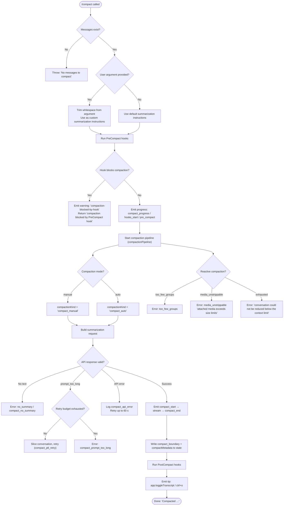

# `/compact`

> Analysis basis: CC v2.1.143 bundle.js (AST extraction + Claude interpretation)
> Minimum version: v2.1.143

---

## Overview

The `/compact` command frees up context window space by replacing the current conversation history with an AI-generated summary. It invokes a dedicated summarization API call (using a system prompt that identifies the model as a summarization assistant), stores the result as a compact boundary in the conversation state, and optionally runs `PreCompact` and `PostCompact` lifecycle hooks around the operation.

---

## Registration

| Field | Value |
|---|---|
| type | `local` |
| name | `compact` |
| description | `Free up context by summarizing the conversation so far` |
| argumentHint | `<optional custom summarization instructions>` |
| supportsNonInteractive | `true` |
| thinClientDispatch | `post-text` |
| module_id | `mKq` |

Analysis basis: CC v2.1.143 bundle.js:+10132282

---

## Input Branching

The top-level command handler (`commandHandler`) evaluates the state of the conversation and the user-supplied argument before dispatching to either an immediate abort path or the full compaction pipeline.



Analysis basis: CC v2.1.143 bundle.js:+10131366, +10131391, +10131397, +10131429, +10131495, +10129305, +10129415, +10129597, +10129632, +10129483

---

## Behavioral Spec

### Guard: Empty Conversation Check

```
function guardEmptyConversation(messages):
    if messages is empty or messages.length == 0:
        throw Error("No messages to compact")
    return messages
```

Analysis basis: CC v2.1.143 bundle.js:+10131391, +10131397

---

### Argument Normalization

```
function normalizeCompactArgument(rawArg):
    if rawArg is null or undefined:
        return null
    trimmed = rawArg.trim()
    if trimmed == "":
        return null
    return trimmed   // used verbatim as custom summarization instructions
```

Analysis basis: CC v2.1.143 bundle.js:+10131429

---

### PreCompact Hook Execution

The hook runner (`hookRunner`) fires the `PreCompact` lifecycle event before any API call is made.

```
function runPreCompactHooks(conversationContext):
    emit progress stage "hooks_start"       // loc +10128864
    emit progress stage "pre_compact"       // loc +10128887

    results = executeHooks(hookType="PreCompact", context=conversationContext)

    for each result in results:
        if result.blocks == true:
            log warning "compaction-blocked-by-hook"  // loc +9558570
            return BlockedResult("compaction blocked by PreCompact hook")  // loc +9558604

    return OkResult()
```

Analysis basis: CC v2.1.143 bundle.js:+10128864, +10128887, +9558570, +9558604, +9558511

Hook type string used: `"PreCompact"` (Analysis basis: CC v2.1.143 bundle.js:+12222308)

---

### Compaction Kind Classification

```
function classifyCompactionKind(trigger):
    if trigger == "manual":
        return "compact_manual"   // loc +9559224
    else:
        return "compact_auto"     // loc +9559209
```

Trigger value `"manual"` is always set when the user invokes `/compact` directly.
Analysis basis: CC v2.1.143 bundle.js:+10129044, +9559209, +9559224

---

### Conversation Slice Selection

The slice selector (`messageSliceSelector`) computes which portion of the conversation history to include in the summarization prompt, applying the following constraints:

```
function selectConversationSlice(messages, tokenBudget):
    // Apply a 20 % head margin
    headFraction   = 0.2                        // loc +9558248
    sliceStart     = Math.floor(messages.length * headFraction)
    sliceStart     = Math.max(0, sliceStart)

    candidate = messages.slice(sliceStart)

    // Ensure token count fits within budget
    candidate = trimToTokenBudget(candidate, tokenBudget)

    // Never include fewer messages than a minimum viable window
    if candidate.length < minimumGroupCount:
        raise CompactionError("too_few_groups")

    return candidate
```

Analysis basis: CC v2.1.143 bundle.js:+9558078, +9558217, +9558228, +9558248, +9558259, +9558304, +10129415

---

### Summarization API Call

The summarization requester (`summarizationRequester`) sends the selected conversation slice to the API using a fixed system prompt.

```
function requestSummary(slice, customInstructions, compactionKind):
    systemPrompt = "You are a helpful AI assistant tasked with summarizing conversations."
    // loc +9571334

    if customInstructions is not null:
        append customInstructions to systemPrompt

    messageId = generateUUID()              // via randomUUID
    role      = "user"                      // loc +9939297

    emit progress stage "stream_mode" / "requesting"  // loc +10129189, +10129208

    stream = callAPI(
        model         = "claude-opus-4-7",  // loc +9576993
        system        = systemPrompt,
        messages      = buildApiMessages(slice),
        tools_enabled = false,              // "disabled" loc +9571429
        effort        = currentEffortValue,
        timeout_ms    = 30000               // loc +9569746
    )

    summaryText = ""
    for each event in stream:
        if event.type == "content_block_start" and event.content.type == "text":
            // loc +9572081, +9572133
            emit progress stage "responding"  // loc +9572189
        if event.type == "content_block_delta" and event.delta.type == "text_delta":
            // loc +9572247, +9572291
            summaryText += event.delta.text

    if summaryText == "":
        emit telemetry "tengu_compact_failed"   // loc +9572553
        raise CompactionError("no_text_response")  // loc +9570774

    return summaryText
```

Analysis basis: CC v2.1.143 bundle.js:+9571334, +9576993, +9571429, +9569746, +9572081, +9572133, +9572189, +9572247, +9572291, +9572553, +9570774

---

### Prompt-Too-Long Retry

```
function handlePromptTooLong(messages, retryState):
    emit telemetry "tengu_compact_ptl_retry"   // loc +9560397

    if retryState.attempts >= retryState.maxAttempts:
        raise CompactionError("compact_prompt_too_long")  // loc +9560357

    // Shrink the slice and try again
    shorterSlice = selectConversationSlice(messages, reducedBudget)
    return shorterSlice
```

Analysis basis: CC v2.1.143 bundle.js:+9560267, +9560357, +9560397

---

### API Error Retry

The API error handler retries the summarization request for up to 60 seconds before giving up.

```
function handleApiError(error, elapsedMs):
    maxRetryMs = 60 * 1000   // 60 000 ms, loc +9560941

    if elapsedMs >= maxRetryMs:
        emit telemetry "tengu_compact_failed"
        raise CompactionError("compact_api_error")  // loc +9561003

    wait(backoffDelay)
    return RetrySignal()
```

Analysis basis: CC v2.1.143 bundle.js:+9560941, +9561003

---

### No-Summary Guard

```
function guardSummaryPresent(summaryText):
    if summaryText is null or summaryText == "":
        log "no_summary"                       // loc +9560666
        emit telemetry "tengu_compact_failed"
        raise CompactionError(
            "compact_no_summary",
            "Failed to generate conversation summary - response did not contain valid text content"
        )
        // loc +9560737, +9560765
```

Analysis basis: CC v2.1.143 bundle.js:+9560666, +9560737, +9560765

---

### Compact Boundary Commit

After a successful summary, the pipeline writes a boundary record into conversation state.

```
function commitCompactBoundary(summary, originalMessages, metrics):
    boundaryRecord = {
        type:            "compact_boundary",   // loc +10129821
        compactMetadata: {                     // loc +10129841
            summary:     summary,
            kind:        compactionKind,
            timestamp:   Date.now(),
            tokensSaved: metrics.tokensSaved
        }
    }

    replaceConversationHistory(
        keepMessages = [],          // history replaced by summary
        insertRecord = boundaryRecord
    )

    setState("compactMetadata", boundaryRecord.compactMetadata)
    emit progress "compact_end"               // loc +10130357
```

Analysis basis: CC v2.1.143 bundle.js:+10129821, +10129841, +10130357

---

### PostCompact Hook Execution and Cleanup

```
function runPostCompactAndCleanup(compactionResult):
    emit progress stage "post_compact_cleanup"   // loc +5472751

    executeHooks(hookType="PostCompact", context=compactionResult)
    // Hook type string: "PostCompact"            // loc +12223234

    resetAutonomousLoopState()                   // bz4.resetAutonomousLoopDelivered loc +5472860

    if compactionResult.status == "success":
        emit notification tip:
            action  = "app:toggleTranscript"     // loc +10130635
            binding = "ctrl+o"                   // loc +10130667
            scope   = "Global"                   // loc +10130658
        display message "Compacted " + tokenDelta  // loc +10130774

    else:
        log error "compaction failed"            // loc +9563747
        display notification "error-compacting-conversation"  // loc +9569038
```

Analysis basis: CC v2.1.143 bundle.js:+5472751, +12223234, +5472860, +10130635, +10130667, +10130658, +10130774, +9563747, +9569038

---

### Reactive (Auto) Compaction Path

When compaction is triggered automatically (reactive), additional failure modes are handled.

```
function handleReactiveCompactionFailure(failureKind):
    emit telemetry "tengu_reactive_compact_failed"   // loc +5476293

    switch failureKind:
        case "too_few_groups":
            abort silently
        case "media_unstrippable":
            display error "Compaction failed · attached media exceeds size limits"
            // loc +10129632
        case "exhausted":
            display error "Compaction failed · conversation could not be reduced below the context limit"
            // loc +10129509
        default:
            display error "unknown error"            // loc +10129757
```

Analysis basis: CC v2.1.143 bundle.js:+5476293, +10129415, +10129597, +10129632, +10129483, +10129509, +10129757

---

### State Update (setState Calls)

```
function updateAppState(phase, payload):
    // Phase: "sdk_status" = "compacting"
    //   loc +10128929, +10128949
    setState("sdk_status", "compacting")

    // Phase: compact boundary written
    setState("compactMetadata", payload)

    // Phase: progress event
    emitProgress("compact_progress", phase)  // loc +10128833
```

Analysis basis: CC v2.1.143 bundle.js:+10128833, +10128929, +10128949

---

### Non-Interactive Cancellation

When the user cancels during a non-interactive run, a distinct message is displayed.

```
function handleCancellation():
    display "Compaction canceled."   // loc +10131902
    return CancelledResult()
```

Analysis basis: CC v2.1.143 bundle.js:+10131902

---

### Conversation-Too-Short Guard (reactive path)

```
function guardMinimumMessageCount(messages):
    if messages is empty:
        emit "compact_not_enough_messages"  // loc +9559298
        return SkipResult()
```

Analysis basis: CC v2.1.143 bundle.js:+9559298

---

### Away-Summary Suppression Logic

The away-summary subsystem (triggered outside of direct `/compact` invocation) applies several skip guards before generating a background summary.

```
function maybeTriggerAwaySummary(cacheInfo, rateLimit, draftInput):
    if cacheInfo.age is unknown:
        log "[awaySummary] skipped: cache age unknown"    // loc +13331919
        return

    if cacheInfo.staleness >= 0.9:                       // loc +13331988
        log "[awaySummary] skipped: cache stale"         // loc +13331995
        return

    if rateLimit.status != "allowed":
        log "[awaySummary] skipped: at or near rate limit"  // loc +13332083
        return

    if draftInput is present:
        log "[awaySummary] skipped: draft input present"  // loc +13332166
        return

    result = generateAwaySummary()

    if result.status == "ok":
        emit "away_summary_generate"                     // loc +13332397
    else:
        emit "generate_failed"                           // loc +13332421
        // Retry up to 3 times                           // loc +13332472
```

Analysis basis: CC v2.1.143 bundle.js:+13331919, +13331988, +13331995, +13332083, +13332166, +13332397, +13332421, +13332472

---

## State & Side Effects

| Item | Detail |
|---|---|
| Telemetry — `tengu_compact` | Emitted on every manual compact invocation (Analysis basis: +9562230) |
| Telemetry — `tengu_compact_failed` | Emitted when API returns no text, API error exhausted, or streaming produces no response (Analysis basis: +9572553) |
| Telemetry — `tengu_compact_ptl_retry` | Emitted each time a prompt-too-long retry is attempted (Analysis basis: +9560397) |
| Telemetry — `tengu_compact_cache_prefix` | Emitted when cache prefix is computed for the summarization call (Analysis basis: +9559944) |
| Telemetry — `tengu_compact_cache_sharing_success` | Emitted when cache sharing succeeds (Analysis basis: +9570142) |
| Telemetry — `tengu_compact_cache_sharing_fallback` | Emitted when cache sharing falls back (Analysis basis: +9570727) |
| Telemetry — `tengu_reactive_compact_failed` | Emitted when automatic compaction fails (Analysis basis: +5476293) |
| Telemetry — `tengu_post_compact_file_restore_success` | Emitted when post-compact file state restore succeeds (Analysis basis: +9573035) |
| Telemetry — `tengu_post_compact_file_restore_error` | Emitted when post-compact file state restore fails (Analysis basis: +9573077) |
| Telemetry — `tengu_cobalt_raccoon` | Internal model-selection event (Analysis basis: +5473157) |
| Telemetry — `tengu_amber_redwood2` | Internal model-selection event (Analysis basis: +9577027) |
| Telemetry — `tengu_feature_ok` | Generic feature-success marker (Analysis basis: +955068) |
| Telemetry — `tengu_feature_bad` | Generic feature-failure marker (Analysis basis: +955126) |
| Telemetry — `tengu_slate_harbor` | Internal transport/environment event (Analysis basis: +3192722) |
| Hook registration — PreCompact | Fired before any API call; a blocking result halts compaction entirely (Analysis basis: +12222308, +9558570) |
| Hook registration — PostCompact | Fired after the compact boundary is committed (Analysis basis: +12223234) |
| appState changes | `sdk_status` → `"compacting"` during operation; `compactMetadata` written on success; `compact_boundary` record inserted into conversation history (Analysis basis: +10128929, +10129841, +10129821) |
| Autonomous-loop state | `resetAutonomousLoopDelivered()` called after compaction completes (Analysis basis: +5472860) |
| UUID generation | New UUID generated per message object and per compact-boundary record via `crypto.randomUUID` (Analysis basis: +9939443, +9992929) |
| Sound | <!-- TODO: not found in depth-2 traversal; needs --depth 4 --> |
| Performance timing | `performance.now()` sampled at pipeline start and end to compute elapsed duration (Analysis basis: +10128970, +5476044) |
| setInterval / clearInterval | Used internally by the streaming API poller during the summarization call (Analysis basis: +9569676, +9572702) |

---

## Version History

| Version | Change |
|---|---|
| v2.1.143 | Initial analysis |

---

## Common Mistakes

1. **Invoking `/compact` on an empty conversation.** The command raises an error immediately ("No messages to compact") if there are no messages in the current session. Start a conversation before compacting. Analysis basis: CC v2.1.143 bundle.js:+10131397

2. **Expecting a custom model to be used for summarization.** The summarization sub-call always targets `"claude-opus-4-7"` regardless of the model selected for the main conversation. Analysis basis: CC v2.1.143 bundle.js:+9576993

3. **Assuming a PreCompact hook failure is recoverable inline.** If any registered hook returns a blocking result, the entire compaction is aborted with a warning and no summary is generated; there is no fallback retry for hook-blocked compaction. Analysis basis: CC v2.1.143 bundle.js:+9558570, +9558604

4. **Running `/compact` when attached media is too large.** If the conversation contains media that cannot be stripped during reactive compaction, the operation fails with "attached media exceeds size limits" and cannot be retried without removing the media. Analysis basis: CC v2.1.143 bundle.js:+10129597, +10129632

5. **Expecting the full conversation to remain visible after compaction.** The compact boundary replaces the historical message list in state; existing messages before the boundary are no longer individually accessible. The `app:toggleTranscript` action (`ctrl+o`) provides read-only access to the prior transcript. Analysis basis: CC v2.1.143 bundle.js:+10130635, +10130667

6. **Supplying a custom instruction argument that is all whitespace.** The argument is trimmed before use; an all-whitespace argument is treated identically to no argument, and the default summarization system prompt is used. Analysis basis: CC v2.1.143 bundle.js:+10131429

---

## Appendix — Identifier Mapping

> For bundle debugging only. Identifiers change across versions.

| Identifier | Role |
|---|---|
| `vz7` | Top-level command handler for `/compact` |
| `T3` | Message-list accessor / conversation turn builder |
| `t$7` | Turn formatter helper (called from message-list accessor) |
| `MqH` | Model selector / inference-profile resolver |
| `vz6` | Model capability checker (called from model selector) |
| `yX` | Token-count / context-limit calculator |
| `Pw` | Permission-context fetcher (called from model selector) |
| `G1` | Application-inference-profile resolver |
| `j98` | Fallback model string resolver (`claude-opus-4-7`) |
| `Nz7` | Main compaction pipeline orchestrator |
| `KZ` | Conversation-state reader helper |
| `lg` | Prompt / system-message builder (PreCompact) |
| `uKq` | App-state snapshot + tool-permission context bundler |
| `wY8` | Cache-control header builder |
| `xS_` | Stream-mode selector |
| `ow_` | Reactive compaction runner |
| `sn` | Post-compact state cleanup executor |
| `CTH` | State setter dispatcher (`V$6.setState` wrapper) |
| `xKq` | Success-tip notification emitter |
| `XOH` | Compaction duration / token-delta formatter |
| `pt` | Pre-pipeline state setter (sdk_status = compacting) |
| `Yi9` | State-setter wrapper (used by pre-pipeline setter) |
| `frH` | Full manual/auto compaction runner (main summarization flow) |
| `mH` | Structured log emitter |
| `Gj` | Conversation slice builder |
| `kQH` | Tool-permission context resolver (used in compaction runner) |
| `G6` | API transport selector (cli / remote) |
| `tA8` | Argument trimmer |
| `w8` | User-turn message factory (with UUID) |
| `A6q` | Streaming API call executor with interval poller |
| `rS` | Response type discriminator (Array.isArray gate) |
| `eHq` | Message slice selector with budget math |
| `d` | Debug / structured logger |
| `v` | Log-level router (debug / info / warn / error) |
| `hH` | JSON serialiser wrapper |
| `$m` | String prefix checker (`startsWith`) |
| `N` | Away-summary generator |
| `U$6` | Object entry remapper (`Object.fromEntries`) |
| `UTH` | Tool-list serialiser |
| `z98` | Post-compact file-restore executor |
| `J98` | Local-agent task status checker |
| `Y98` | Plan-file-reference handler |
| `w98` | Plan-mode tool context builder |
| `D98` | Invoked-skills collector |
| `PzH` | Deferred-tools delta builder |
| `L9` | Attachment UUID generator |
| `UQH` | Agent-listing delta builder |
| `BQH` | MCP-instructions delta builder |
| `um` | Plugin hook loader |
| `Nz6` | Compact-notification UUID generator |
| `Xe` | Post-compact state accumulator |
| `g5` | System-prompt assembler |
| `ZP` | CLI/remote transport resolver |
| `a76` | REPL-context fetcher |
| `Ez6` | REPL-context serialiser |
| `Wn` | Conversation usage record builder |
| `zOH` | Cache-type membership checker |
| `cD` | Effort-value to API parameter converter |
| `m0` | Queue / scheduler wrapper |
| `SA8` | Token percentage calculator |
| `yA8` | Hook output parser (humanMessages / assistantMessages) |
| `NH` | Error notification dispatcher |
| `Xg` | Agent-identifier validator |
| `Z$6` | App-state map accessor |
| `T1H` | Custom-agent type resolver |
| `ASH` | Session-start hook emitter |
| `FQH` | KV-store logger |
| `XzH` | Prompt builder for PostCompact hooks |
| `SH` | Synchronous structured logger |
| `_6q` | Error display and notification handler |
| `FS_` | String coercer for identifiers |
| `xH` | Generic string coercer (`String()`) |
| `id` | Identifier / UUID accessor |