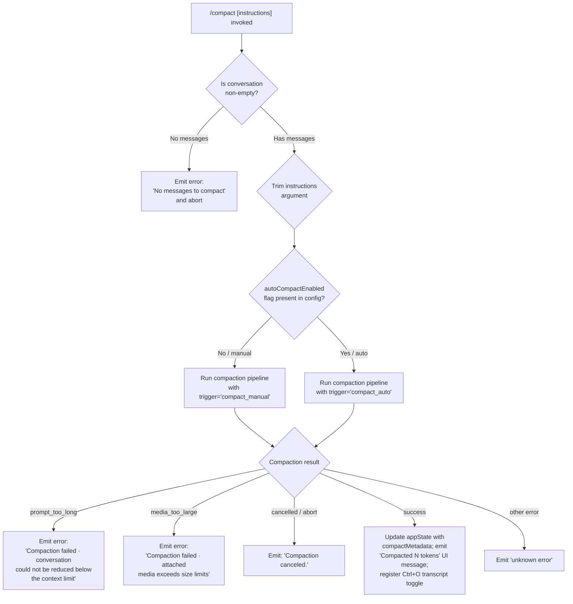

# `/compact`

> Analysis basis: CC v2.1.143 bundle.js (AST extraction + Claude interpretation)
> Minimum version: v2.1.143

---

## Overview

The `/compact` command reduces context window usage by replacing the current conversation history with a concise AI-generated summary. When invoked, it calls the compaction pipeline (with an optional custom instruction string), then replaces the message history with a `compact_boundary` marker and a synthesized summary, freeing up context for continued work. The command supports both interactive and non-interactive (SDK/CLI pipe) execution modes.

---

## Registration

| Field | Value |
|---|---|
| type | `local` |
| name | `compact` |
| description | `Free up context by summarizing the conversation so far` |
| argumentHint | `<optional custom summarization instructions>` |
| supportsNonInteractive | `true` |
| thinClientDispatch | `post-text` |
| module_id | `mKq` |

Analysis basis: CC v2.1.143 bundle.js:+10132282

---

## Input Branching

The top-level handler (function `commandHandler`, mangled `vz7`) performs the following decision tree before dispatching the compaction pipeline:



Analysis basis: CC v2.1.143 bundle.js:+10131366 (entry), +10131391 (empty-check), +10131397 (no-messages literal), +10131429 (trim), +10131495 (pipeline dispatch), +10131559 (state update), +10129509 (prompt_too_long message), +10129632 (media_too_large message), +10131902 (cancellation message)

---

## Behavioral Spec

### 1. Entry Point: Command Handler

```
function commandHandler(userArgs, context):
    // Validate there is something to compact
    messageList = context.getMessages()
    if messageList is empty:
        throw Error("No messages to compact")   // loc +10131397

    instructions = userArgs.trim()              // loc +10131429

    // Determine trigger type
    trigger = "compact_manual"                  // loc +9559224
    if context.config.autoCompactEnabled:       // loc +9578699
        trigger = "compact_auto"                // loc +9559209

    // Execute the compaction pipeline
    result = await runCompactionPipeline(instructions, trigger, context)

    // Handle pipeline outcome
    handleCompactionResult(result, context)
```

Analysis basis: CC v2.1.143 bundle.js:+10131366

---

### 2. Compact Boundary Insertion

Before the summary is built, the message-list helper (function `insertCompactBoundary`, mangled `T3`) slices the conversation and inserts a synthetic boundary marker.

```
function insertCompactBoundary(messages):
    // Insert role:"system", type:"compact_boundary" sentinel   // loc +9993344
    // at index 1 (after the first message)                     // loc +9993398, +9993403
    boundary = { role: "system", type: "compact_boundary" }
    return [messages[0], boundary, ...messages.slice(1)]        // loc +9993497
```

Analysis basis: CC v2.1.143 bundle.js:+9993322, +9993344, +9993398, +9993403, +9993497

---

### 3. Compaction Pipeline Orchestration

The pipeline function (function `compactionOrchestrator`, mangled `Nz7`) drives the full lifecycle:

```
async function compactionOrchestrator(instructions, trigger, context):
    startTime = performance.now()               // loc +10128970

    // Stage 1: Report progress
    emit progress("compact_progress")           // loc +10128833

    // Stage 2: Fire PreCompact hooks
    emit progress("hooks_start")                // loc +10128864
    hookResult = await runPreCompactHooks(context)  // loc +10128887
    if hookResult.blocked:
        return { status: "compaction-blocked-by-hook" }   // loc +9558570

    // Stage 3: Signal SDK status
    emit sdkStatus("compacting")               // loc +10128949

    // Stage 4: Gather prompt inputs in parallel
    [agentContext, toolPermCtx] = await Promise.all([
        buildAgentContext(context),            // loc +10129032
        buildToolPermissionContext(context),   // loc +10129107
    ])

    // Stage 5: Stream mode determination
    emit streamMode("requesting")              // loc +10129189, +10129208

    // Stage 6: Run summarization (main API call)
    emit compactStart("compact_start")         // loc +10129305
    summary = await runSummarizationAgent(
        instructions, agentContext, toolPermCtx, trigger
    )

    // Stage 7: On error, classify and surface
    if summary.error:
        classifyAndEmitError(summary.error)    // loc +10129438

    // Stage 8: Post-compact cleanup and state update
    await runPostCompactCleanup(context)       // loc +10129894
    updateAppState("compactMetadata", summary) // loc +10129841

    // Stage 9: Emit final UI notification
    emit compactEnd("compact_end")             // loc +10130357

    return { status: "success" }               // loc +10130558
```

Analysis basis: CC v2.1.143 bundle.js:+10128970, +10128833, +10128864, +10128887, +10128949, +10129019, +10129107, +10129189, +10129305, +10129438, +10129894, +10129841, +10130357, +10130558

---

### 4. Summarization Agent

The summarization function (function `runSummarizationAgent`, mangled `frH`) constructs the API request and handles the summarization response:

```
async function runSummarizationAgent(instructions, agentCtx, toolPermCtx, trigger):
    startTime = performance.now()          // loc +9559249

    // Tool-use is blocked during compaction
    // Any tool call returns: { decision: "deny",
    //   reason: "Tool use is not allowed during compaction" }  // loc +9569337, +9569352

    // The compaction agent system prompt
    systemPrompt = "You are a helpful AI assistant tasked with summarizing conversations."
                                           // loc +9571334

    // Build message set: pre-compact sliced messages
    messages = buildCompactionMessages(agentCtx)  // loc +9560207

    // Emit telemetry for cache prefix
    emit("tengu_compact_cache_prefix")     // loc +9559944

    // Issue the API call
    response = await issueApiCall(
        systemPrompt, messages, instructions, trigger
    )

    // Handle response
    if response has no text content:
        // emit compact_no_summary
        emit("tengu_compact_failed")       // loc +9572553
        return { error: "no_summary",
                 message: "Failed to generate conversation summary - response did not contain valid text content" }
                                           // loc +9560765

    if response is prompt_too_long:
        // Retry once with media stripped          // loc +9560357
        emit("tengu_compact_ptl_retry")
        response = retryWithoutMedia(messages, instructions)
        if still fails:
            return { error: "compact_prompt_too_long" }  // loc +9560357

    if response is api_error:
        // Log up to 60 chars of error            // loc +9560941
        emit("tengu_compact_failed")
        return { error: "compact_api_error" }     // loc +9561003

    summaryText = extractText(response)

    // Restore file references into summary
    await restoreFileReferences(summaryText)      // loc +9561402

    // Emit telemetry for full compact
    emit("tengu_compact",
         { trigger: trigger, type: "compact_full" })   // loc +9562230, +9561378

    return { status: "success", summary: summaryText }
```

Analysis basis: CC v2.1.143 bundle.js:+9559249, +9559334, +9559354, +9560207, +9560357, +9560665, +9560765, +9561003, +9561378, +9562230

---

### 5. Reactive (Auto) Compaction

When `autoCompactEnabled` is set, a separate reactive path (function `reactiveCompactionHandler`, mangled `ow_`) runs automatically as the context window fills:

```
async function reactiveCompactionHandler(context):
    startTime = performance.now()          // loc +5476044

    // Guard: require at least 2 message groups
    groups = groupMessages(context.messages)
    if groups.length < 2:
        log("Reactive compact: fewer than 2 groups, nothing to compact")
                                           // loc +5448092
        emit status: "too_few_groups"      // loc +5448182
        return

    // Guard: require at least one assistant message
    if no assistant message in group:
        log("Reactive compact: no assistant messages in summarize set, bailing")
                                           // loc +5448654
        emit status: "exhausted"           // loc +5448756
        return

    emit("tengu_reactive_compact_attempt") // loc +5448815

    // Run summarization (reuses summarization agent)
    result = await runReactiveSummarization(context)  // loc +5476108

    if result.error == "media_too_large":
        log("Reactive compact: summarize hit media-size error, retrying stripped")
                                           // loc +5449446
        result = retryWithoutMedia(context)
        if result.error:
            emit status: "media_unstrippable"  // loc +5449561

    if result.error:
        emit("tengu_reactive_compact_failed")  // loc +5476293
        emit("compact_reactive", { status: result.error })  // loc +5476527
        return

    // On success
    emit("tengu_reactive_compact_succeeded")   // loc +5478255
    emit("compact_reactive", { status: "success" })

    // Fire PostCompact hook
    await runPostCompactHook(context)          // loc +5477646

    return result
```

Analysis basis: CC v2.1.143 bundle.js:+5476044, +5448092, +5448182, +5448654, +5448815, +5476108, +5449446, +5449561, +5476293, +5476527, +5478255, +5477646

---

### 6. Post-Compact Cleanup

After a successful compaction (function `postCompactCleanup`, mangled `sn`), several state resets occur:

```
function postCompactCleanup(context):
    emit("post_compact_cleanup")           // loc +5472751

    // Reset precomputed compact if stale
    discardPrecomputedCompact()            // loc +5456309 (tengu_precomputed_compact_discarded)

    // Clear caches
    clearLaqCache()                        // loc +9876532
    clearXz6Cache()                        // loc +5398693
    clearPwCache()                         // loc +5398705

    // Reset autonomous loop state
    resetAutonomousLoopDelivered()         // loc +5472860

    // Clear all MCP/tool state
    clearToolPermissionState()             // loc +5472841, +5472835

    // Signal post-compact to context manager
    resetContextManager(context)           // loc +5472915
```

Analysis basis: CC v2.1.143 bundle.js:+5472751, +5472745, +5472798, +5472823, +5472829, +5472835, +5472841, +5472860, +5472915

---

### 7. UI Notification and State Update

After successful compaction (function `emitCompactionUI`, mangled `xKq`), the UI is updated:

```
function emitCompactionUI(summary, context):
    // Dim the transcript view
    M6.dim(...)                            // loc +10130767

    // Display "Compacted N tokens" message
    message = "Compacted " + formatTokenCount(summary.tokens)  // loc +10130774

    // Register keyboard shortcut
    registerAction({
        id:    "app:toggleTranscript",     // loc +10130635
        scope: "Global",                   // loc +10130658
        key:   "ctrl+o",                   // loc +10130667
    })

    // Join lines for display
    output = lines.join(...)               // loc +10130787
```

Analysis basis: CC v2.1.143 bundle.js:+10130635, +10130658, +10130667, +10130767, +10130774, +10130787

---

### 8. PreCompact Hook Integration

The compaction pipeline fires a `PreCompact` hook before summarizing:

```
function runPreCompactHook(context):
    // Hook type: "PreCompact"              // loc +12222308
    hookResult = await executeHook("PreCompact", {
        conversation: context.messages,
        instructions: context.instructions,
    })
    if hookResult.decision == "block":
        return {
            blocked: true,
            reason: "compaction blocked by PreCompact hook",  // loc +9558604
            type:   "compaction-blocked-by-hook",            // loc +9558570
        }
    return { blocked: false }
```

The companion `PostCompact` hook type (`"PostCompact"`) is also registered and fires after the summary is applied.
Analysis basis: CC v2.1.143 bundle.js:+12222308, +12252453, +9558570, +9558604

---

## State & Side Effects

| Item | Detail |
|---|---|
| Telemetry — compact events | `tengu_compact` (+9562230), `tengu_compact_cache_prefix` (+9559944), `tengu_compact_cache_sharing_success` (+9570142), `tengu_compact_cache_sharing_fallback` (+9570727), `tengu_compact_failed` (+9572553), `tengu_compact_ptl_retry` (+9560397) |
| Telemetry — reactive compact | `tengu_reactive_compact_attempt` (+5448815), `tengu_reactive_compact_succeeded` (+5478255), `tengu_reactive_compact_failed` (+5476293), `tengu_precomputed_compact_discarded` (+5456309) |
| Telemetry — post-compact file restore | `tengu_post_compact_file_restore_success` (+9573035), `tengu_post_compact_file_restore_error` (+9573077) |
| Hook registration | `PreCompact` hook fires before summarization (+12222308); `PostCompact` hook fires after summary is applied (+12252453) |
| appState changes | `compactMetadata` key updated with summary result (+10129841); context manager and tool-permission state are reset during post-compact cleanup |
| Keyboard shortcut registered | `app:toggleTranscript` → `ctrl+o` registered in Global scope after successful compaction (+10130635, +10130667) |
| Cache clears | Internal LRU caches `lAq`, `Xz6`, `Pw_` are cleared (+9876532, +5398693, +5398705) |
| Sound | <!-- TODO: not found in depth-2 traversal; needs --depth 4 --> |
| Autonomous loop state | `resetAutonomousLoopDelivered` called after compaction (+5472860) |
| compact_boundary marker | Synthetic `{ role: "system", type: "compact_boundary" }` message inserted at index 1 of the new history (+9993344) |

---

## Version History

| Version | Change |
|---|---|
| v2.1.143 | Initial analysis |

---

## Common Mistakes

1. **Running `/compact` on an empty session** — The command immediately throws `"No messages to compact"` and exits. There must be at least one existing message before invoking it. Analysis basis: CC v2.1.143 bundle.js:+10131397

2. **Expecting tool calls during compaction** — Any tool-use request issued by the summarization agent is automatically denied with `"Tool use is not allowed during compaction"`. Custom instructions must not rely on tool results. Analysis basis: CC v2.1.143 bundle.js:+9569337, +9569352

3. **Assuming `/compact` preserves the full transcript** — After compaction the conversation history is replaced by the `compact_boundary` marker plus a single summary message. All prior turns are dropped from context. Analysis basis: CC v2.1.143 bundle.js:+9993344

4. **Ignoring the `PreCompact` hook block path** — If a configured `PreCompact` hook returns a block decision, compaction is silently abandoned. The caller receives no summary and the history is unchanged. Analysis basis: CC v2.1.143 bundle.js:+9558570, +9558604

5. **Confusing manual `/compact` with reactive auto-compact** — The reactive path (triggered automatically near the context limit) goes through a separate code route (`ow_` / `reactiveCompactionHandler`) with additional guards on message-group count. Manually invoking `/compact` skips those guards. Analysis basis: CC v2.1.143 bundle.js:+5448092, +5476044

6. **Expecting instant completion in non-interactive mode** — Because `supportsNonInteractive` is `true` and `thinClientDispatch` is `"post-text"`, SDK/pipe callers receive the result only after the full summarization stream completes. Analysis basis: CC v2.1.143 bundle.js:+10132282

---

## Appendix — Identifier Mapping

> For bundle debugging only. Identifiers change across versions.

| Identifier | Role |
|---|---|
| `vz7` | Top-level `/compact` command handler |
| `T3` | Compact-boundary insertion helper |
| `t$7` | Message-list slicer used by boundary insertion |
| `UP` | Boundary marker constructor |
| `MqH` | Compaction config reader / dispatcher |
| `vz6` | Configuration validation helper |
| `E_` | General error constructor / emitter |
| `G6` | Telemetry event emitter |
| `Ts` | SDK-status broadcaster |
| `Ci6` | Telemetry deduplication cache helper |
| `N6` | Structured telemetry payload builder |
| `yX` | `autoCompactEnabled` config parser |
| `xH` | String coercion utility |
| `nG` | Config key normalizer |
| `wAH` | Config value accessor |
| `dc` | Model-string classifier |
| `G1` | Model family resolver |
| `Fy` | First-party API route selector |
| `hw` | AWS / Bedrock API route selector |
| `DAH` | Model token-limit lookup |
| `Gl6` | Model output-token cap resolver |
| `Pw` | Compact progress event emitter |
| `j98` | Compact mode flag reader (`autoCompactEnabled`) |
| `r0` | Config object accessor |
| `f7` | Legacy/default config reader |
| `US_` | Context-percentage parser (`auto` → float) |
| `Nz7` | Compaction pipeline orchestrator |
| `KZ` | Message-to-API-format converter |
| `k47` | Role/type filter for compaction messages |
| `WFH` | Message role normalizer (`assistant`/`user`) |
| `Hh_` | Full message serializer (all content types) |
| `lg` | System-prompt and tool-definition builder |
| `L4` | System-prompt assembler |
| `V6` | System-prompt template joiner |
| `Yy` | System-prompt segment appender |
| `QX` | Effort-value injector |
| `sE` | Effort string (`"high"`) mapper |
| `A` | Effort-value calculator |
| `QZ` | System-prompt formatter |
| `S6` | Environment context injector |
| `j2` | Agent query executor (main API loop) |
| `bm` | Policy-settings extractor |
| `v` | Debug-mode flag reader |
| `_4H` | Error-flag injector |
| `cQ_` | Hook-type resolver for tool hooks |
| `GSq` | MCP server list reader |
| `dQ_` | Hook filter for blocking hooks |
| `TSq` | Hook execution scheduler |
| `hH` | JSON serialization helper |
| `NH` | Structured error logger |
| `mH` | App-state mutation helper |
| `cPH` | Cache-prefix hash writer |
| `SZ` | Request abort/timeout controller |
| `d6H` | Delta-state updater |
| `hh` | Hook progress reporter |
| `g28` | Hook metadata assembler |
| `QQ_` | MCP tool-result handler |
| `c28` | JSON-vs-plain-text output detector |
| `gQ_` | HTTP hook executor |
| `WSq` | Hook output parser |
| `mLH` | Multi-line log helper |
| `l28` | Subprocess hook spawner |
| `SH` | App-state reader |
| `M` | MCP server manager |
| `SvH` | MCP server connection runner |
| `THK` | MCP server update applier |
| `B95` | MCP client pool manager |
| `uKq` | Pre-compaction context collector |
| `qG` | System-prompt construction dispatcher |
| `Ad_` | Locale-string formatter |
| `yz8` | Object-value system-prompt mapper |
| `R_` | Memory-prompt loader |
| `fd_` | Environment-info builder |
| `CU7` | Environment-info dispatcher |
| `QO6` | Output-style system-prompt injector |
| `qU7` | Output-style resolver |
| `jU7` | Context-management prompt builder |
| `K56` | Memory-file loader (`CLAUDE.md` etc.) |
| `ZU7` | Working-directory context builder |
| `EU7` | Additional-workspace context builder |
| `IU7` | Scratchpad context builder |
| `vU7` | Fast-mode context builder |
| `yU7` | Brief-mode flag reader |
| `RU7` | Context-management mode resolver |
| `WU7` | Raw environment-variable injector |
| `NK1` | GrowthBook feature-flag loader |
| `OU7` | Context-hint builder |
| `zU7` | Worktree-isolation context builder |
| `YU7` | Worktree environment-info helper |
| `DU7` | Deferred-tool context builder |
| `PU7` | MCP-instruction context builder |
| `VV9` | Auto-memory context builder |
| `FMH` | Provider-route context injector |
| `Tb` | System-prompt getter / main-thread guard |
| `HK` | Main-thread system-prompt accessor |
| `_J` | Subagent system-prompt accessor |
| `wY8` | Message normalizer for wire format |
| `xS_` | Model-context-window validator |
| `ow_` | Reactive-compaction entry point |
| `Gj` | Context-usage snapshot reader |
| `zOH` | Token-usage cache accessor |
| `Pr9` | Context-capacity evaluator |
| `c$6` | Compact-trigger threshold reader |
| `H98` | Reactive-summarization batch runner |
| `hQH` | Message batch assembler |
| `vK1` | Token-count estimator (math) |
| `jz4` | Single reactive-compact API caller |
| `Pz4` | Per-group token estimator |
| `m0` | Model + effort resolver for compact |
| `cD` | API-error classifier |
| `J8` | App-state delta applicator |
| `aK1` | Full reactive-compact lifecycle manager |
| `T1H` | Post-compact session-start emitter |
| `U$6` | Header-entry builder |
| `UTH` | Cache-control header builder |
| `Xg` | Compact-request header assembler |
| `Z$6` | Cache-checkpoint header accessor |
| `ASH` | Anti-caching header stripper |
| `FQH` | Context-cache key builder |
| `Nz6` | UUID generator wrapper |
| `Xe` | Telemetry event batcher |
| `mz4` | Parallel summarization runner |
| `XzH` | Prompt + messages assembler for API |
| `aw_` | Latest-cache-entry accessor |
| `SA8` | Round-duration metric helper |
| `yA8` | Token-count by-message-type tabulator |
| `sn` | Post-compact cleanup orchestrator |
| `K98` | Precomputed-compact state reader |
| `q98` | Precomputed-compact slot getter |
| `mK1` | Precomputed-compact metrics emitter |
| `F$6` | Compact-transcript formatter |
| `XT` | Transcript segment builder |
| `Pn` | Post-compact plugin-hook runner |
| `Pe` | Hook-type dispatcher (DI8/EI8) |
| `EI8` | Hook event type validator |
| `rq1` | Tool-whitelist cache resetter |
| `CK1` | Tool-permission set resetter |
| `an` | Permission-context resetter |
| `tj` | Output-token counter resetter |
| `iw_` | In-progress cleanup helper |
| `CTH` | App-state `setState` caller |
| `xKq` | UI-notification emitter (compact complete) |
| `AnH` | Agent-model configuration reader |
| `Zd4` | Model alias resolver |
| `Lj` | Keyboard-shortcut registrar |
| `ma6` | Action registry getter |
| `pa6` | Key-binding helper |
| `XOH` | OTEL metric emitter |
| `OL` | OTEL event builder |
| `dFH` | OTEL resource attribute builder |
| `pt` | Progress-state updater |
| `Yi9` | `setState` helper for progress |
| `frH` | Summarization-agent driver (manual compact) |
| `kQH` | Compact-mode flag reader |
| `tA8` | Input-text trimmer |
| `w8` | New UUID + abort-controller factory |
| `A6q` | Core agent query runner (streaming) |
| `XZ` | Agent-turn loop |
| `Sw_` | Tool-permission context builder for agent |
| `pm` | Random-bytes session-ID generator |
| `iC` | Turn-result classifier |
| `Dz4` | Turn-result payload builder |
| `fqH` | Max-output-tokens calculator |
| `BMH` | Per-model output-token limit table |
| `gt` | Token-cap validator |
| `ZT` | Last-assistant-message finder |
| `rS` | Content-block array normalizer |
| `pX6` | Tool-selection and tool-search runner |
| `qZH` | Tool-name lowercaser / classifier |
| `sIH` | Built-in-tool presence checker |
| `iS_` | Tool-type router |
| `G47` | Deferred-tool resolver |
| `Cw_` | Content-block flattener |
| `eA8` | Attachment normalizer |
| `dL7` | File-reference filter |
| `cL7` | Message content serializer |
| `bS_` | Recursive content serializer |
| `sHq` | Surrogate-pair splitter |
| `viH` | Full agent-query pipeline |
| `aS_` | Query setup helper |
| `Jhq` | Streaming API call handler |
| `i0` | Message-history builder |
| `E$7` | Thinking-block injector |
| `iR_` | Image reference remover |
| `k$7` | Loading-state message builder |
| `N$7` | Content-type serializer |
| `y$7` | Tool-result presence checker |
| `N` | Away-summary generator |
| `WD8` | Orphaned-thinking detector |
| `p$7` | Request-ID generator |
| `NW` | Network-error classifier |
| `rZ_` | Rate-limit back-off helper |
| `GD8` | Tool-deferred payload builder |
| `tS` | Tool-name formatter for search |
| `sR_` | Tool-result array builder |
| `Z$7` | Tool-result has-content checker |
| `T` | Remote-control state reader |
| `V$7` | Thinking-block has-signature checker |
| `XL` | Tool-list filter (allowed/denied) |
| `D1q` | Deferred-tool list splitter |
| `h$7` | Tool-input validator |
| `Y` | Output writer (supervisor) |
| `o9q` | Token push helper |
| `U$7` | MCP tool-schema builder |
| `W` | Streaming event batcher |
| `S$7` | Deferred-tool payload builder |
| `wJ6` | Orphaned-thinking filter |
| `H37` | First-message-content extractor |
| `DJ6` | Duplicate-message deduplicator |
| `_37` | Message slice helper |
| `R$7` | Trailing-whitespace-only message remover |
| `r9q` | Message history finalizer |
| `a9q` | Tool-result appender |
| `v$7` | Image block validator |
| `eHq` | Context-slice builder for compact |
| `FBH` | Media-size error detector |
| `KTH` | Token-overage detector |
| `Cf_` | Token-count parser from error text |
| `$m` | File-path prefix detector |
| `z98` | File-reference attachment normalizer |
| `lL7` | At-mention file loader |
| `qr6` | `@`-prefix detector |
| `H9` | File-path validator and resolver |
| `iL7` | At-mention attachment builder |
| `mT` | File read and encoding helper |
| `J0H` | `CLAUDE.md` memory-file reader |
| `ky_` | Tool-call runner (read/execute) |
| `DrH` | Tool permission validator |
| `OpH` | Tool-name prefix stripper |
| `x6` | Path join helper |
| `Z17` | File read with token estimate |
| `hI` | OTEL at-mention metric emitter |
| `qXH` | Line-count estimator |
| `H7` | Index-of helper |
| `L9` | UUID v4 generator |
| `V5` | Math.round wrapper |
| `J98` | Local-agent task context builder |
| `S$` | Task-list formatter |
| `AiH` | Task-join helper |
| `Y98` | Plan-file reference builder |
| `uT` | File content type tagger |
| `w98` | Tool-permission context for compact |
| `D98` | Permission-set snapshot builder |
| `nL7` | Token-slice helper |
| `PzH` | Tool-search pool builder |
| `Sy_` | Tool-pool diff tracker |
| `UQH` | Tool-list builder with permission context |
| `OD_` | Tool-schema builder |
| `Sq` | String cast helper |
| `ZnH` | Tool-allowance cache manager |
| `HLH` | JD8 flatMap tool helper |
| `zO6` | Disallowed-tool filter |
| `O_8` | Case-insensitive tool-name matcher |
| `$D_` | Formatted tool-list renderer |
| `lM4` | Tool-list join helper |
| `fq` | Hook-runner (command/MCP) |
| `Cl8` | Shell hook executor |
| `Rl8` | Shell hook result parser |
| `Uw` | Hook environment builder |
| `BQH` | MCP tool-call hook runner |
| `l91` | MCP permission tracker |
| `um` | Plugin hook loader and runner |
| `TK` | String table lookup |
| `aY` | Policy-type classifier |
| `I8` | Permission policy resolver |
| `nFH` | Plugin permission injector |
| `sRH` | Structured log appender |
| `T8` | File log writer |
| `Jz6` | Full agent-loop entry (with hooks) |
| `L2` | Agent main loop (with hook callbacks) |
| `g5` | System-prompt renderer |
| `CU` | Prompt-section builder |
| `GV` | Template literal helper |
| `__` | Markdown separator renderer |
| `ZP` | CLI/remote context switch |
| `$F` | CLI context builder |
| `a76` | REPL context accessor |
| `Ez6` | REPL expansion preprocessor |
| `Jz4` | REPL expansion parser |
| `Wn` | Token-usage snapshot updater |
| `_6q` | Compact-failure renderer |
| `XH` | String coercion (String cast) |
| `tN` | Error-history circular buffer |
| `uc9` | Error-cache getter/setter |
| `FS_` | Compact-mode string constant accessor |