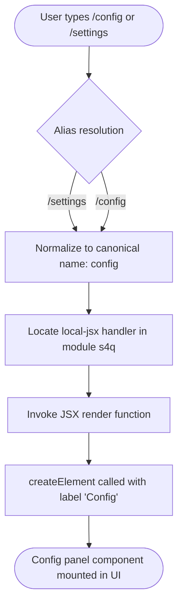

# `/config`

> Analysis basis: CC v2.1.143 bundle.js (AST extraction + Claude interpretation)
> Minimum version: v2.1.143

---

## Overview

The `/config` command (also accessible via `/settings`) opens the configuration panel as an inline JSX component rendered directly within the Claude Code CLI interface. It is a purely presentational, local command — it produces no text output and emits no telemetry events; its sole effect is mounting the configuration UI component for the user to interact with.

---

## Registration

| Field | Value |
|---|---|
| type | `local-jsx` |
| name | `config` |
| description | `Open config panel` |
| aliases | `["settings"]` |
| module\_id | `s4q` |

Analysis basis: CC v2.1.143 bundle.js:+10511070

---

## Input Branching

Because the command registration declares type `local-jsx` and the depth-2 call graph contains a single edge — from the command renderer to `createElement` — there is no argument-parsing branch tree. The command accepts no sub-commands, flags, or positional arguments at this traversal depth.



Analysis basis: CC v2.1.143 bundle.js:+10510936 (createElement call edge), +10511070 (registration, alias list)

---

## Behavioral Spec

### Alias Resolution

```
function resolveCommandAlias(inputToken):
    canonicalAliasMap = {
        "settings": "config"
    }
    if inputToken in canonicalAliasMap:
        return canonicalAliasMap[inputToken]
    return inputToken
```

Both `/config` and `/settings` resolve to the same handler. No distinction in behavior exists between the two entry points after resolution.

Analysis basis: CC v2.1.143 bundle.js:+10511070

---

### JSX Panel Rendering

The command is registered with type `local-jsx`, meaning its output is not a plain text string written to the REPL stream but a React-compatible element tree rendered inline by the CLI's UI layer.

```
function renderConfigPanel():
    rootElement = createElement(ConfigPanelComponent, props={})
    return rootElement
```

The string literal `"Config"` found at the render site is used as a display label (for example, as a panel title or accessible name for the mounted component).

Analysis basis: CC v2.1.143 bundle.js:+10510936 (createElement invocation), +10510990 ("Config" string literal)

---

### Argument Handling

<!-- TODO: not found in depth-2 traversal; needs --depth 4 -->

The depth-2 call graph contains no argument-parsing edges and the literals array contains no flag strings or sub-command tokens. The command appears to accept no CLI arguments, but deeper traversal would be required to confirm definitively whether the config panel itself performs any argument-driven pre-selection of a settings section.

---

## State & Side Effects

| Item | Detail |
|---|---|
| Telemetry | None — the `telemetry` array is empty; no `tengu_*` events are emitted by this command |
| Hook registration | <!-- TODO: not found in depth-2 traversal; needs --depth 4 --> |
| appState changes | <!-- TODO: not found in depth-2 traversal; needs --depth 4 --> |
| Sound | <!-- TODO: not found in depth-2 traversal; needs --depth 4 --> |
| Persistence | <!-- TODO: not found in depth-2 traversal; needs --depth 4 --> |
| Network I/O | None observed at traversal depth ≤ 2 |

---

## Version History

| Version | Change |
|---|---|
| v2.1.143 | Initial analysis — command registered as `local-jsx`, alias `settings` confirmed, no telemetry emitted |

---

## Common Mistakes

1. **Expecting text output**: Because the command type is `local-jsx`, `/config` does not print any text to the REPL stream. Automation or scripting that waits for stdout output after invoking `/config` will hang or time out.
2. **Using `/settings` and assuming a different handler**: `/settings` is a registered alias and routes to exactly the same component as `/config`. There is no behavioral difference between the two tokens.
3. **Passing arguments**: No argument-parsing logic was found at traversal depth ≤ 2. Appending flags or sub-command strings (e.g., `/config --theme`) may be silently ignored or cause an unhandled input error; verify against a live instance before relying on argument passing.
4. **Assuming telemetry is captured**: This command emits zero telemetry events. Any analytics pipeline that relies on a `tengu_*` event to detect config-panel opens will not receive a signal from this command.

---

## Appendix — Identifier Mapping

> For bundle debugging only. Identifiers change across versions.

| Identifier | Role |
|---|---|
| `Bw7` | Config panel JSX render function — top-level command handler that calls `createElement` to mount the configuration UI component |