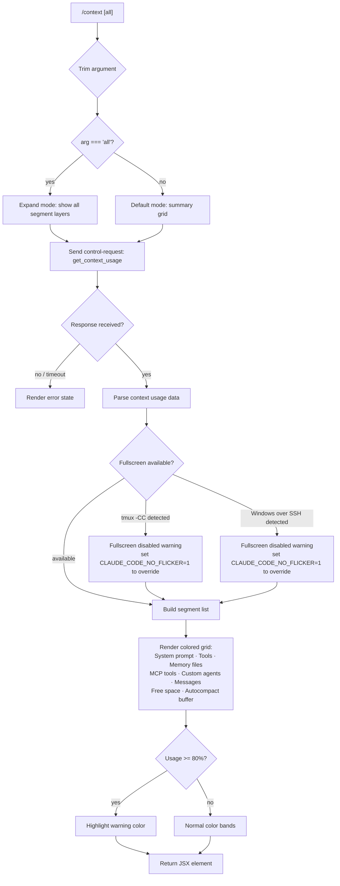

# `/context`

> Analysis basis: CC v2.1.143 bundle.js (AST extraction + Claude interpretation)
> Minimum version: v2.1.143

---

## Overview

`/context` visualizes the current context window usage as a colored grid rendered in the terminal. It sends a `get_context_usage` control request to the running agent session and then renders a JSX component that breaks down how context slots are consumed by segment type (system prompt, tools, memory files, messages, and free space). An optional `all` argument expands the view to show additional detail layers.

---

## Registration

| Field | Value |
|---|---|
| type | `local-jsx` |
| name | `context` |
| description | `Visualize current context usage as a colored grid` |
| argumentHint | `[all]` |
| thinClientDispatch | `control-request` |
| module_id | `z7q` |
| load_inline | `true` |
| loc_byte | `10529288` |
| loc_byte_end | `10529514` |
| loc_line | `5778` |
| arbor_handler.name | `VJ7` |
| arbor_handler.fqn | `claude-2.1.143::VJ7` |
| arbor_handler.kind | `AsyncFunction` |
| arbor_handler.resolution_path | `module_id` |
| arbor_handler.n_hits | `0` |

Analysis basis: CC v2.1.143 bundle.js:+10529288

---

## Input Branching

The handler has 4+ distinct branches based on argument value, fullscreen mode availability, and context segment type, so a flowchart is used.



---

## Behavioral Spec

### Handler entry — `contextCommandHandler` (bundle identifier: `VJ7`)

The Arbor-resolved handler is `VJ7`, an `AsyncFunction` reached via `module_id` → `z7q`.

```
async function contextCommandHandler(args, appContext):
    trimmedArg = args.trim()                          // loc_byte:10527928
    showAll    = trimmedArg === "all"                 // literal "all" loc_byte:10527953

    // Issue control request to the agent process
    response = await sendControlRequest(             // loc_byte:10527988
                   type = "get_context_usage"        // literal loc_byte:10528018
               )

    // Subscribe to the response event stream
    listenForDataEvents(response)                    // loc_byte:10528048

    // Build the visual grid component
    gridElement = buildContextGrid(                  // loc_byte:10528052 (qW6.createElement)
                      usageData = response,
                      showAll   = showAll,
                      systemKey = "system"           // literal loc_byte:10528135
                  )
    return gridElement
```

Analysis basis: CC v2.1.143 bundle.js:+10527922

---

### Control-request dispatch — `sendControlRequest`

```
function sendControlRequest(type):
    // Sends a typed message to the in-process agent via the
    // thinClientDispatch = "control-request" channel.
    // Returns a promise that resolves with the usage payload.
    message = { type: type }
    return agentChannel.sendControlRequest(message)   // loc_byte:10527988
```

Analysis basis: CC v2.1.143 bundle.js:+10527988

---

### Response listener — `responseEventListener` (bundle identifier: `dcH`)

```
function responseEventListener(stream):
    stream.on("data", handler)                        // loc_byte:7549288
    // Converts raw buffer chunks to string             loc_byte:7549325
    // Passes parsed payload to the JSX render tree     loc_byte:7549352
    // Creates a React element for each event chunk     loc_byte:7549355
```

Analysis basis: CC v2.1.143 bundle.js:+7549288

---

### Grid component builder — `buildContextGrid` (bundle identifier: `AW6`)

This function is the primary rendering logic. It receives the raw usage payload and produces a colored block grid.

```
function buildContextGrid(usageData, showAll, systemKey):
    // 1. Filter segments relevant to the current mode
    segments = usageData.filter(relevantForMode)      // loc_byte:10526026

    // 2. Identify special segments
    systemSegment = segments.find(isSystemPrompt)     // loc_byte:10526344

    // 3. Build labeled segment entries (names below are from string literals):
    //    "Free space"           loc_byte:10526061
    //    "Autocompact buffer"   loc_byte:10526084
    //    "Project"              loc_byte:10527030  (key: "projectSettings")
    //    "User"                 loc_byte:10527067  (key: "userSettings")
    //    "Local"                loc_byte:10527102  (key: "localSettings")
    //    "Flag"                 loc_byte:10527137
    //    "Policy"               loc_byte:10527173
    //    "Plugin"               loc_byte:10527203  (key: "plugin")
    //    "Built-in"             loc_byte:10527235  (key: "built-in")
    //    "MCP"                  loc_byte:1084865   (key: "mcp")
    //    "Managed"              loc_byte:1084779

    labeledSegments = buildLabeledEntries(segments)

    // 4. Compute percentage values for each band
    //    Uses Intl.NumberFormat("en-US", { style:"compact" })
    //    loc_byte:208680 / loc_byte:208698
    percentages = segments.map(computePercent)

    // 5. Apply threshold colouring
    //    Warning threshold: 80 (bundle literal loc_byte:10528389)
    for each segment in labeledSegments:
        if segment.usagePercent >= 80:
            apply warning colour band
        else:
            apply normal colour band

    // 6. Render percentage badges
    //    Rounds to nearest integer via Math.round    loc_byte:206762
    //    Appends ".0" suffix when applicable         loc_byte:206704
    //    Uses "< 20" label for bands below 20%       loc_byte:206742
    //    Threshold for "< 20" label:  20             loc_byte:206733
    //    Minimum bar width:           10             loc_byte:206775

    return coloredGridJSXElement
```

Analysis basis: CC v2.1.143 bundle.js:+10525985

---

### Fullscreen / flicker guard — `fullscreenGuard` (bundle identifiers: `rA`, `kbL`, `NbL`, `x1_`)

Before entering any fullscreen rendering path the runtime checks terminal capabilities:

```
function fullscreenGuard(env):
    terminal = detectTerminal(env)                    // loc_byte:3331836

    if terminal.startsWith("iTerm.app"):              // loc_byte:3331031, 3331086
        if tmuxControlMode():                         // spawnSync tmux display-message loc_byte:3331287
                                                      // args: ["-p", "#{client_control_mode}"] loc_byte:3331309/3331332
            return DISABLED,
              reason = "fullscreen disabled: tmux -CC (iTerm2 integration mode) detected " +
                       "· set CLAUDE_CODE_NO_FLICKER=1 to override"  // loc_byte:3331999

    if platform === "windows":                        // literal loc_byte:3331593
        return DISABLED,
          reason = "fullscreen disabled: Windows over SSH (ConPTY re-rendering) detected " +
                   "· set CLAUDE_CODE_NO_FLICKER=1 to override"      // loc_byte:3332185

    return ENABLED, mode = "fullscreen"              // literal loc_byte:3332389
```

tmux detection uses `spawnSync` with a 2000 ms timeout (literal: `2000`, loc_byte:3331383) and `utf8` encoding (loc_byte:3331368).

Analysis basis: CC v2.1.143 bundle.js:+3331086

---

### Context percentage formatter — `formatContextPercent` (bundle identifiers: `oK`, `ko`, `dq`)

```
function formatContextPercent(rawValue, total):
    ratio = rawValue / total
    pct   = Math.round(ratio * 100)                  // loc_byte:206762
    if pct < 20:
        return "< 20"                                // literal loc_byte:206742
    formatted = numberFormatter.format(pct)          // Intl en-US compact loc_byte:208698
    if not formatted.endsWith(".0"):
        formatted += ".0"                            // literal loc_byte:206704
    return formatted
```

Analysis basis: CC v2.1.143 bundle.js:+206690

---

### Compact-boundary marker — `compactBoundaryMarker` (bundle identifiers: `ZJ7`, `T3`, `t$7`)

```
function compactBoundaryMarker(messages):
    // Finds the position of "compact_boundary" in the message list
    // Used to determine where the autocompact buffer starts.
    boundary = findCompactBoundary(messages)          // literal "compact_boundary" loc_byte:9993344
    return messages.slice(0, boundary)               // loc_byte:9993497
```

Analysis basis: CC v2.1.143 bundle.js:+9993474

---

### Settings load (called during context calculation) — `loadSettingsFromDisk` (bundle identifiers: `Lu`, `nm8`, `WB`)

Settings are loaded as part of calculating the live context breakdown:

```
function loadSettingsFromDisk():
    log("loadSettingsFromDisk_start")                // literal loc_byte:1204991
    emit("settings_load_started")                    // literal loc_byte:1201720
    policySettings = loadPolicySettings()            // literal "policySettings" loc_byte:1201848
    flagSettings   = loadFlagSettings()              // literal "flagSettings" loc_byte:1202224
    emit("settings_load_completed")                  // literal loc_byte:1202397
    log("loadSettingsFromDisk_end")                  // literal loc_byte:1205047
    return { policySettings, flagSettings }
```

Analysis basis: CC v2.1.143 bundle.js:+1204962

---

### System-prompt token collector — `collectSystemPromptTokens` (bundle identifier: `jY8` and sub-calls)

This is the deepest sub-graph. It aggregates all token sources that will be shown in the grid.

```
async function collectSystemPromptTokens(sessionState):
    // Resolve model context window size
    maxTokens = resolveModelContextLimit()           // loc_byte:9590603 Math.max / Math.min

    // Collect system-prompt segments
    corePrompt   = buildCoreSystemPrompt()           // loc_byte:9589526 (_47)
    mcpSegments  = await collectMcpTokens()          // loc_byte:9589532 (A47)
    memFiles     = await loadMemoryFiles()           // loc_byte:9589547 (L47)
    builtinTools = await enumerateBuiltinTools()     // loc_byte:9589562 (f47)
    mcpTools     = await enumerateMcpTools()         // loc_byte:9589569 (q47)
    contextMgmt  = buildContextMgmtSegment()         // loc_byte:9589580 (z47)
    tokenBudgets = accumulateTokenBudgets()          // loc_byte:9589598 (K47)

    // Aggregate voice / recording segments
    voiceSegments = collectVoiceSegments()           // loc_byte:9589706 (lHH)

    // Build the grid rows pushed to K6
    allSegments = [
        { label: "System prompt",           color: "promptBorder" },  // loc_byte:9589753/9589784
        { label: "System tools",            color: "inactive" },      // loc_byte:9589832/9589862
        { label: "MCP tools",               color: "cyan_FOR_SUBAGENTS_ONLY" }, // loc_byte:9589896/9589923
        { label: "MCP tools (deferred)",    ...  },                   // loc_byte:9589972
        { label: "System tools (deferred)", ...  },                   // loc_byte:9590058
        { label: "Custom agents",           color: "permission" },    // loc_byte:9590147/9590178
        { label: "Memory files",            color: "claude" },        // loc_byte:9590214/9590244
        { label: "Skills",                  color: "warning" },       // loc_byte:9590276/9590300
        { label: "Messages",                color: "purple_FOR_SUBAGENTS_ONLY" }, // loc_byte:9590778/9590804
    ]

    totalUsed  = sumTokens(allSegments)
    freeSpace  = maxTokens - totalUsed

    segments.push({ label: "Free space",           tokens: freeSpace })
    segments.push({ label: "Autocompact buffer",   tokens: autocompactBuffer })

    return { segments, maxTokens, totalUsed }
```

The `Messages` row is capped at index 5 (literal `5`, loc_byte:9591071). Math operations use `Math.round` (loc_byte:9591198), `Math.floor` (loc_byte:9591360).

Analysis basis: CC v2.1.143 bundle.js:+9588793

---

### Auto-compact window resolution — `resolveAutoCompactWindow` (bundle identifiers: `qr`, `gt`, `US_`)

```
function resolveAutoCompactWindow(config):
    // Priority: env var > settings value
    envValue = process.env["CLAUDE_CODE_AUTO_COMPACT_WINDOW"]  // literal loc_byte:9577215

    if envValue is set:
        source = "env"                               // literal loc_byte:9577407
        parsed = parseInt(envValue)
        if isNaN(parsed): use fallback
    else:
        source = "settings"                          // literal loc_byte:9577477
        parsed = config.autoCompactWindow

    // Clamp to valid range
    result = Math.max(min, Math.min(max, parsed))    // loc_byte:9577333 / 9577373
    return { value: result, source }
```

Analysis basis: CC v2.1.143 bundle.js:+9577139

---

## State & Side Effects

| Item | Detail |
|---|---|
| Telemetry | `tengu_amber_creek` (loc_byte:3332572), `tengu_pewter_brook` (loc_byte:3332480), `tengu_marlin_porch` (loc_byte:3691890), `tengu_amber_redwood2` (loc_byte:9577027), `tengu_slate_harrier` (loc_byte:12335989), `tengu_sparrow_ledger` (loc_byte:12326374), `tengu_verified_vs_assumed` (loc_byte:12315145), `tengu_memdir_loaded` (loc_byte:3252664), `tengu_memdir_disabled` (loc_byte:3258533), `tengu_team_memdir_disabled` (loc_byte:3258757), `tengu_moth_copse` (loc_byte:3257576), `tengu_coral_fern` (loc_byte:3256733), `tengu_herring_clock` (loc_byte:3258729), `tengu_agent_memory_loaded` (loc_byte:8033474), `tengu_chair_sermon` (loc_byte:9955054) |
| Control request | Sends `{ type: "get_context_usage" }` over `thinClientDispatch = "control-request"` channel |
| Hook registration | `at_.register` is called within the stream-write path (loc_byte:56977, identifier `h9`) |
| File I/O | Memory directory reads via `lv.stat`, `lv.rename`, `lv.unlink`, `lv.appendFile`, `lv.mkdir` during settings + memory-file collection |
| appState changes | Pushes computed segment rows to `K6` (loc_byte:9591449); updates `V$6.setState` via `Yi9` (loc_byte:4754461) |
| Sound | None observed in depth-2 traversal |
| Fullscreen guard | Writes `CLAUDE_CODE_NO_FLICKER` advisory to UI when tmux-CC or ConPTY is detected |

---

## Version History

| Version | Change |
|---|---|
| v2.1.143 | Initial analysis |

---

## Common Mistakes

1. **Omitting the `all` argument when you need full detail.** Without `all`, only the summary grid is rendered; sub-segment breakdowns (flag, policy, plugin, built-in layers) remain collapsed.
2. **Expecting the grid while the agent is not running.** `/context` dispatches a `control-request` to a live agent session; running it outside an active session produces no usage data.
3. **Ignoring the 80% warning color.** The colored grid highlights any segment band at or above 80% capacity (literal loc_byte:10528389). Treat this as an early signal to trigger `/compact`.
4. **Misreading "< 20" as zero.** A band labelled "< 20" means the segment occupies less than 20% of the context window, not that it is empty.
5. **Setting `CLAUDE_CODE_NO_FLICKER=1` blindly.** The flag overrides the fullscreen safety guards for tmux-CC and ConPTY; only set it if you have verified your terminal handles alternate-screen redraws cleanly.

---

## Appendix — Identifier Mapping

> For bundle debugging only. Identifiers change across versions.

| Identifier | Role |
|---|---|
| `VJ7` | Main async handler for `/context` (Arbor-resolved entry point) |
| `rA` | Fullscreen / terminal capability orchestrator |
| `VRH` | Terminal-set membership check |
| `u1_` | Color capability resolver |
| `Sq` | String-to-boolean config converter |
| `xH` | Generic string helper / sanitizer |
| `hl` | Fullscreen mode selector |
| `kbL` | tmux control-mode detector |
| `NbL` | Terminal prefix matcher (`iTerm.app`, `screen`, `tmux`) |
| `v` | Environment/config value resolver |
| `G5K` | Model context-window size lookup |
| `tt_` | Token limit selector (`TLK`/`ELK` branches) |
| `hH` | JSON serializer wrapper |
| `P7` | Path manipulator / segment extractor |
| `h6A` | Segment-map helper |
| `cSH` | Write helper (`X6A`) |
| `Z5K` | File-append / log-rotation orchestrator |
| `PSH` | Buffered writer with `setTimeout`/`setImmediate` flush |
| `i8H` | Path-join + write coordinator |
| `gv8` | Log-level gatekeeper |
| `U6A` | Versioned file path builder |
| `p6A` | File-stat / rename / unlink helper |
| `E5K` | Append-file worker (mkdir + appendFile) |
| `h9` | Hook registrar (`at_.register`) |
| `x1_` | Boolean-cast config field reader |
| `R_` | Settings loader dispatcher |
| `Lu` | Disk-settings load coordinator |
| `nm8` | Settings-load inner worker (emits telemetry) |
| `WB` | Settings-load sub-component aggregator |
| `ybL` | Fullscreen mode dispatcher |
| `G6` | Agent-event subscriber / broadcaster |
| `Ci6` | Deduplication guard for agent events |
| `N6` | Notification-with-timestamp emitter |
| `Z$` | Argument preprocessor (checks `"all"`) |
| `BjH` | Argument-token parser |
| `dcH` | Data-event listener for control-response stream |
| `tu` | JSX write-event bridge |
| `yL_` | React element factory wrapper |
| `U9H` | Context-window usage data adapter |
| `YUH` | Usage-data → segment-list transformer |
| `AW6` | Grid component builder (renders colored blocks) |
| `oK` | Percentage computation entry |
| `dq` | Raw division and rounding helper |
| `ko` | Badge label formatter |
| `XH` | String coercion helper |
| `ZJ7` | Compact-boundary display wrapper |
| `T3` | Compact-boundary slice helper |
| `t$7` | `UP` caller for compact boundary detection |
| `pt` | App-state setter dispatcher |
| `Yi9` | `V$6.setState` caller |
| `jY8` | System-prompt token collection orchestrator |
| `iG` | Model / provider resolver |
| `Na` | Model metadata fetcher |
| `BB` | Token-budget segment builder |
| `rV` | Provider-type branch (`BM`/`zM`) |
| `BM` | First-party / Bedrock provider handler |
| `zM` | Gateway / Vertex provider handler |
| `oV` | Dual-provider fallback router |
| `r0` | Core prompt assembler |
| `f7` | Auto-compact enabled flag reader |
| `Au` | Tracking-set manager for prompt deduplication |
| `I8` | Telemetry batcher (`jC6`/`WB`) |
| `qr` | Auto-compact window and token-limit resolver |
| `G1` | Model-string normalizer |
| `BU6` | Settings-entry accumulator |
| `Cw` | Model-string lower-case matcher |
| `PP` | Model-string replacement helper |
| `yX` | Context-limit integer parser |
| `nG` | Context-limit floor helper |
| `dc` | Context-limit branch dispatcher |
| `DAH` | Context-limit with Bedrock guard |
| `Gl6` | Context-limit with env-cap resolution |
| `gt` | Token-budget status tagger (`valid`/`invalid`/`capped`) |
| `US_` | Auto-compact window string parser (float/int/round) |
| `qG` | Full system-prompt assembly pipeline |
| `Ad_` | Prompt-text sanitizer |
| `S6` | Async-store context fetcher |
| `Uh6` | AsyncLocalStorage `.getStore()` wrapper |
| `yz8` | Prompt-segment value mapper |
| `_U7` | Coding-style guidance injector |
| `AU7` | Model override segment builder |
| `fd_` | Segment formatter (label + model + tokens) |
| `CU7` | Formatted-segment compositor |
| `QO6` | Output-style segment builder |
| `qU7` | Output-style wrapper |
| `jU7` | Tool-list segment builder |
| `nz` | Tool-name formatter |
| `wU7` | Permission-check helper |
| `PT` | Prompt-type gate (`Cn9`) |
| `yLH` | Hook-response aggregator |
| `Cp` | Content-block flattener |
| `K56` | Memory-file loader (main) |
| `bK` | Memory-directory locator |
| `E9H` | Memory-directory mkdir helper |
| `Vl` | Memory-file stat checker |
| `SH` | Feature-flag checker |
| `cz` | Memory context string builder |
| `JV9` | Memory search-path builder |
| `V0H` | Memory entry formatter |
| `wV9` | Auto-memory prompt builder |
| `DV9` | Memory-file section assembler |
| `o9_` | Memory-entry collector |
| `LU7` | Language segment builder |
| `ZU7` | Environment info builder |
| `IX` | OS/platform classifier |
| `qd_` | Working-directory describer |
| `EU7` | Full environment section assembler |
| `Ld_` | OS version reader |
| `Kd_` | Shell-type detector |
| `fU7` | Scratchpad segment builder |
| `MU7` | Output-style field extractor |
| `IU7` | Worktree isolation segment builder |
| `SV_` | Worktree isolation mode reader |
| `vU7` | Background-session segment builder |
| `Q6H` | Background-session telemetry emitter |
| `IJH` | Background-session path builder |
| `NU7` | Focus-mode segment builder |
| `yU7` | Brief-mode flag reader |
| `RU7` | Reproduce-verify workflow segment builder |
| `WU7` | GrowthBook feature segment builder |
| `NK1` | Context-management plugin runner |
| `XU7` | FRC segment builder |
| `OU7` | Tool-injection segment builder |
| `KU7` | Tool-injection helper |
| `zU7` | Verified-vs-assumed segment |
| `YU7` | Additive segment builder |
| `DU7` | Permission-segment builder |
| `ZP` | SDK-type classifier |
| `PU7` | Inline content-block builder |
| `VV9` | Memory-state wrapper |
| `ZV9` | Memory-disabled state builder |
| `FMH` | Model-provider header builder |
| `RE` | API-endpoint resolver |
| `DA` | Provider-string classifier |
| `Tb` | System-prompt main-thread loader |
| `H47` | Per-file token counter |
| `eL7` | Source-attribution parser |
| `XY8` | Per-file segment assembler |
| `VU7` | Environment info (simple) builder |
| `IV9` | Memory-file content extractor |
| `RSq` | Section-header stripper |
| `CrH` | Token-count request dispatcher |
| `NvH` | Built-in token counter |
| `NH` | Token-count error logger |
| `D6q` | MCP token counter |
| `_47` | Core system-prompt segment builder |
| `g$6` | AutoMem filter |
| `A47` | MCP-tool segment builder |
| `SvH` | MCP-server connection map builder |
| `THK` | MCP update applier |
| `B95` | MCP client aggregator |
| `sDH` | Deferred-tool segment builder |
| `WY8` | Tool-definition formatter |
| `mH` | Background-session stopper |
| `xN` | Daemon control-request builder |
| `Ox` | Process exit / race-promise helper |
| `L47` | Memory-file segment builder |
| `V5` | Math round alias |
| `D` | Session-pool manager |
| `IG6` | macOS low-memory logger |
| `$o_` | Spare-session spawner |
| `f47` | MCP-tool entry collector |
| `q47` | Tool-list query builder |
| `XY_` | Tool permission check |
| `o1H` | MCP filter matcher |
| `Y6q` | Tool-list cache reader |
| `eq` | Cached-value resolver |
| `z47` | Context-management segment builder |
| `M47` | Token-value formatter (hH + V5) |
| `$47` | Context-efficiency segment builder |
| `O47` | Deferred-tools-delta segment builder |
| `i0` | Request-to-API payload builder (full) |
| `E$7` | Content-block array builder |
| `k$7` | Ld9 lookup helper |
| `N$7` | Content-block type dispatcher |
| `y$7` | Has-tool-use checker |
| `WD8` | Orphaned-thinking filter |
| `p$7` | UUID generator for messages |
| `w8` | Message-ID stamper |
| `NW` | Message normalizer |
| `GD8` | Message-dedup helper |
| `tS` | Standard-mode API-payload builder |
| `sR_` | Tool-result content mapper |
| `Z$7` | Tool-use reference stripper |
| `V$7` | Has-tool-result checker |
| `h$7` | Thinking-block extractor |
| `o9q` | Content-push helper |
| `Hh_` | Full system-injection assembler |
| `U$7` | Post-process text joiner |
| `S$7` | Dedup/deferred-tools builder |
| `wJ6` | Orphaned-thinking-block filter |
| `H37` | Message slice helper |
| `DJ6` | Message-dedup with GD8 |
| `_37` | Array slice helper |
| `R$7` | Retry-message builder |
| `r9q` | Message-list partitioner |
| `a9q` | Append-to-last helper |
| `v$7` | All-tool-result checker |
| `K47` | Token-budget segment builder |
| `WY_` | Permission check for budgets |
| `rG` | Model-aware prompt-type router |
| `r1` | Prompt-text normalizer |
| `xX6` | Token-estimate formatter |
| `ES_` | Estimate suffix builder |
| `v_` | Error-string coercer |
| `lHH` | Voice/recording segment builder |
| `fqH` | Max-output-tokens resolver |
| `BMH` | Token-limit with VY9 branch |
| `HH` | Voice recording state tracker |
| `Q` | File read/unlink scheduler |
| `LW6` | File reader for voice data |
| `B7q` | File unlinker for voice data |
| `MqH` | Away-summary segment builder |
| `vz6` | Away-summary gate |
| `K6` | Segment-row accumulator (pushed to grid) |
| `KHH` | MCP-tool schema merger |
| `cqH` | Per-server tool-list builder |
| `qHH` | Tool-property extractor |
| `ww6` | Tool-schema cache manager |
| `rH` | Plugin/MCP reconciler |
| `DH` | Plugin-map iterator |
| `P8K` | MCP policy filter |
| `ZH` | Plugin-stack manager |
| `CH` | MCP-tool change reporter |
| `Ku` | aL-based capability check |
| `gH` | MCP retry scheduler |
| `LH` | Headless plugin-install orchestrator |
| `c6` | Keyboard event handler (context render) |
| `u6` | Secondary keyboard handler |
| `F8q` | MCP SDK connect/probe helper |
| `Gc9` | VSCode review upsell trigger |
| `c6K` | CCD-session gate |
| `wH` | Render-done signal watcher |
| `GH` | Segment-push finalizer |
| `vH` | Viewport-layer accumulator |
| `q6` | Session-start orchestrator |
| `sRH` | Logging with Date.now timestamp |
| `T8` | Log-file appender |
| `r6K` | Headless-managed-settings pipeline |
| `Cg` | xH-based string helper |
| `Uz8` | MCP marketplace reconciler |
| `gDH` | MCP cache clearer |
| `GT` | GrowthBook feature evaluator |
| `s81` | Plugin-zip-cache error builder |
| `t81` | Plugin-marketplace error builder |
| `Bb` | MCP-server state builder |
| `WT8` | Plugin install/update runner |
| `n6K` | Plugin diff builder |
| `YW8` | Marketplace reconcile helper |
| `OJH` | Round-milliseconds formatter |
| `EH` | AbortController map for in-flight requests |

---

Note: index built via Arbor fallback; some signals (telemetry, literals) may be missing — see arbor-fallback.js.