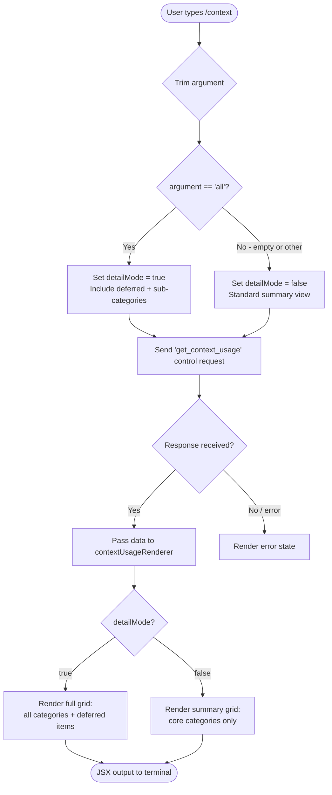

# `/context`

> Analysis basis: CC v2.1.143 bundle.js (AST extraction + Claude interpretation)
> Minimum version: v2.1.143

---

## Overview

The `/context` command visualizes the current conversation's context window usage as a colored grid, breaking down token consumption by category (system prompt, tools, messages, memory files, skills, agents, and free space). It dispatches a `get_context_usage` control request to the runtime, collects categorized usage data, and renders a JSX component in the terminal using color-coded cells. When the optional `all` argument is supplied, additional detail about sub-categories and deferred items is included in the output.

---

## Registration

| Field | Value |
|---|---|
| type | `local-jsx` |
| name | `context` |
| description | `Visualize current context usage as a colored grid` |
| argumentHint | `[all]` |
| thinClientDispatch | `control-request` |
| module\_id | `z7q` |

Analysis basis: CC v2.1.143 bundle.js:+10529288

---

## Input Branching

The command entry point (`commandHandler`) trims the raw argument string, then branches on its value:



Analysis basis: CC v2.1.143 bundle.js:+10527922, +10527928, +10527953, +10527988

---

## Behavioral Spec

### 1. Command Dispatch

When invoked, the command handler trims the argument string and compares it against the literal `"all"`. It then sends a `sendControlRequest` call with the method name `"get_context_usage"` to retrieve live context statistics from the running agent process.

```
function commandHandler(rawArgument):
    arg = trim(rawArgument)
    detailMode = (arg == "all")
    response = sendControlRequest("get_context_usage")
    return renderContextGrid(response, detailMode)
```

Analysis basis: CC v2.1.143 bundle.js:+10527928, +10527961, +10527988, +10528018

### 2. Fullscreen / Render Mode Detection

Before constructing the JSX output, the renderer checks the display environment. The function `renderModeResolver` queries the platform type and environment variables to determine whether to use a fullscreen overlay or inline rendering. Two known disabling conditions exist:

- **tmux -CC (iTerm2 integration mode)** detected → fullscreen disabled; message: `"fullscreen disabled: tmux -CC (iTerm2 integration mode) detected · set CLAUDE_CODE_NO_FLICKER=1 to override"` (Analysis basis: CC v2.1.143 bundle.js:+3331999)
- **Windows over SSH (ConPTY re-rendering)** detected → fullscreen disabled; message: `"fullscreen disabled: Windows over SSH (ConPTY re-rendering) detected · set CLAUDE_CODE_NO_FLICKER=1 to override"` (Analysis basis: CC v2.1.143 bundle.js:+3332185)

The render mode resolves to one of three values: `"bg"`, `"fullscreen"`, or `"default"`.

```
function renderModeResolver(platform, envVars):
    if platform == "windows" and isSSH(envVars):
        emitWarning("fullscreen disabled: Windows over SSH ...")
        return "default"
    if isTmuxCC(envVars):
        emitWarning("fullscreen disabled: tmux -CC ...")
        return "default"
    if envVars["CLAUDE_CODE_NO_FLICKER"] == "1":
        return "bg"
    return "fullscreen"
```

Analysis basis: CC v2.1.143 bundle.js:+3331593, +3331844, +3332354, +3332389, +3332415

### 3. Context Usage Data Collection (`contextDataAggregator`)

This is the primary data-gathering pipeline. It fans out into multiple parallel async collectors, each responsible for a specific category of context token usage. The collectors run concurrently via `Promise.all` and their results are merged into a single usage map.

```
async function contextDataAggregator(sessionState):
    results = await Promise.all([
        collectSystemPrompt(sessionState),        // "System prompt" category
        collectSystemTools(sessionState),         // "System tools" category
        collectMcpTools(sessionState),            // "MCP tools" category
        collectMcpToolsDeferred(sessionState),    // "MCP tools (deferred)" category
        collectSystemToolsDeferred(sessionState), // "System tools (deferred)" category
        collectCustomAgents(sessionState),        // "Custom agents" category
        collectMemoryFiles(sessionState),         // "Memory files" category
        collectSkills(sessionState),              // "Skills" category
        collectMessages(sessionState),            // "Messages" category
    ])
    return mergeUsageMap(results)
```

Analysis basis: CC v2.1.143 bundle.js:+9589464, +9589526, +9589532, +9589547, +9589562, +9589569, +9589580, +9589598, +9589706, +9589739

### 4. Category Label and Color Mapping

Each category in the usage map is assigned a display label string and a terminal color. The complete set of category labels found in the implementation:

| Category Key | Display Label | Color / Style |
|---|---|---|
| System prompt | `"System prompt"` | `promptBorder` |
| System tools | `"System tools"` | `inactive` |
| MCP tools | `"MCP tools"` | `cyan_FOR_SUBAGENTS_ONLY` |
| MCP tools (deferred) | `"MCP tools (deferred)"` | `cyan_FOR_SUBAGENTS_ONLY` |
| System tools (deferred) | `"System tools (deferred)"` | `inactive` |
| Custom agents | `"Custom agents"` | `permission` |
| Memory files | `"Memory files"` | `claude` |
| Skills | `"Skills"` | `warning` |
| Messages | `"Messages"` | `purple_FOR_SUBAGENTS_ONLY` |
| Free space | `"Free space"` | (uncolored / background) |
| Autocompact buffer | `"Autocompact buffer"` | (reserved zone) |

Analysis basis: CC v2.1.143 bundle.js:+9589753, +9589784, +9589832, +9589862, +9589896, +9589923, +9589972, +9590058, +9590147, +9590178, +9590214, +9590244, +9590276, +9590300, +10526061, +10526084, +9590778, +9590804

### 5. Grid Cell Computation (`gridCellCalculator`)

Token counts for each category are converted to a proportional cell count for the colored grid display. The grid uses a base width and applies `Math.round` / `Math.floor` to allocate integer cell counts. A percentage value is also computed per category (base 100).

```
function gridCellCalculator(categoryTokens, totalTokens, gridWidth):
    ratio = categoryTokens / totalTokens
    cells = Math.floor(ratio * gridWidth)
    percentageStr = String(Math.round(ratio * 100)) + ".0"
    return { cells, percentageStr }
```

Percentage values below 20 are displayed as the string `"< 20"` rather than a numeric value.
Rounding uses `Math.round` with a multiplier of 10 and then divides by 10 to produce one decimal place.

Analysis basis: CC v2.1.143 bundle.js:+206690, +206704, +206733, +206742, +206762, +206775, +10526276, +9591198, +9591360

### 6. System Prompt Collection (`systemPromptCollector`)

Retrieves the active system prompt text via `getSystemPrompt()`, determines thread context (`"main-thread"`), and checks whether the session is running in `Array.isArray` mode for multi-part prompts. The collected token count is tagged with the label `"System prompt"`.

```
async function systemPromptCollector(session):
    threadType = "main-thread"
    rawPrompt = await session.getSystemPrompt()
    if Array.isArray(rawPrompt):
        parts = rawPrompt
    else:
        parts = [rawPrompt]
    tokens = countTokens(parts)
    emitTelemetry("tengu_agent_memory_loaded")
    return { label: "System prompt", tokens, threadType }
```

Analysis basis: CC v2.1.143 bundle.js:+8033354, +8033370, +8033376, +8033472, +8033531, +8033613

### 7. Tool Category Collectors

#### Built-in / System Tool Collector (`builtinToolCollector`)

Filters the active tool list to those with source types `"prompt"`, `"builtin"`, or `"bundled"`. Applies `sDH` (token-counting helper) per tool and accumulates totals. Source type keys used internally: `"analyzeBuiltIn"`.

Analysis basis: CC v2.1.143 bundle.js:+9585363, +9585396, +9585411, +9585809, +9585845, +9585860, +9584055

#### MCP Tool Collector (`mcpToolCollector`)

Filters tools to MCP-sourced entries. Internally uses source key `"analyzeMcp"`. Deduplicates by tool `id`. Separates active vs. deferred tools. Transport types recognized: `"stdio"`, `"sse"`, `"http"`, `"sdk"`.

Analysis basis: CC v2.1.143 bundle.js:+9586303, +9586615, +9586625, +14323217, +14323231, +14323243, +14323256

### 8. Message Collection and Auto-Compact Detection (`messageCollector`)

Iterates conversation history, counting tokens by role (`"user"`, `"assistant"`). Detects `tool_use` typed blocks and counts them separately. Checks for the `autoCompactEnabled` setting and, when enabled, reserves a portion of the grid for the `"Autocompact buffer"` label.

The auto-compact window can be configured via the environment variable `CLAUDE_CODE_AUTO_COMPACT_WINDOW`. The resolution priority is: `"invalid"` → `"env"` → `"settings"` → `"auto"`.

```
async function messageCollector(session, settings):
    messages = session.getMessages()
    userTokens = 0
    assistantTokens = 0
    toolUseTokens = 0

    for msg in messages:
        if msg.role == "user":
            userTokens += countTokens(msg)
        elif msg.role == "assistant":
            for block in msg.content:
                if block.type == "tool_use":
                    toolUseTokens += countTokens(block)
                else:
                    assistantTokens += countTokens(block)

    autoCompact = resolveAutoCompactWindow(
        envVar("CLAUDE_CODE_AUTO_COMPACT_WINDOW"),
        settings.autoCompactEnabled
    )
    return { userTokens, assistantTokens, toolUseTokens, autoCompact }
```

Analysis basis: CC v2.1.143 bundle.js:+9578599, +9578699, +9577139, +9577147, +9577152, +9577215, +9577316, +9577407, +9577477, +9577577, +9582908, +9584269, +9584316, +9584337

### 9. Memory Files and Skills Collection

**Memory files** (`memoryFileCollector`): Reads CLAUDE.md-style memory files associated with the session. Tags each with the `"claude"` label. Aggregates token counts per file entry.

**Skills** (`skillsCollector`): Reads skill definitions loaded into the session. Tags entries with `"warning"` color for display. Filtered via `G.has` / `j.add` deduplication sets to avoid double-counting.

Analysis basis: CC v2.1.143 bundle.js:+9590214, +9590244, +9590276, +9590300, +9586515, +9586529, +9586559, +9586571

### 10. Custom Agents Collection (`customAgentCollector`)

Enumerates sub-agent definitions registered with the session. Associates each with the `"permission"` color category. Uses `Promise.all` over agent entries to count tokens concurrently.

Analysis basis: CC v2.1.143 bundle.js:+9590147, +9590178

### 11. Context Window Size Normalization

The total context window size is normalized to token units. The implementation uses a reference value of **1,000,000** tokens as a known large-model context window ceiling for percentage calculations.

Maximum percentage base: **100** (Analysis basis: CC v2.1.143 bundle.js:+10526276)
Large-model ceiling reference: **1,000,000 tokens** (Analysis basis: CC v2.1.143 bundle.js:+5473235)

### 12. JSX Grid Rendering (`contextGridRenderer`)

Constructs the terminal JSX output. Each category becomes a contiguous run of colored cells. Cells are rendered as two-space blocks (`"  "`) padded to the calculated cell count using `padEnd`. A legend row below the grid lists category name, token count, and percentage string.

```
function contextGridRenderer(usageMap, detailMode, gridWidth):
    gridCells = []
    legendRows = []

    for category in orderedCategories(usageMap, detailMode):
        cellCount = category.cells
        color = category.color
        label = category.label
        pct = category.percentageStr

        gridCells.append(coloredBlock(color, "  ".repeat(cellCount)))
        legendRows.append(formatLegendRow(label, category.tokens, pct))

    return createElement("Box", { direction: "column" },
        createElement("Grid", {}, ...gridCells),
        createElement("Legend", {}, ...legendRows)
    )
```

The grid column width is padded to **40** characters maximum per entry in certain legend layouts.
Analysis basis: CC v2.1.143 bundle.js:+14526181, +14526202, +14528173, +10528052

### 13. Random Seed / Animation

A random seed is generated via `Math.random()` with a range multiplier of **2**, passed into a `setTimeout` callback for optional animation timing in the JSX render pass.

Analysis basis: CC v2.1.143 bundle.js:+12638154, +12638156, +12638193

### 14. State Update on Render (`appStateUpdater`)

After the grid is computed, the renderer calls a state setter (`setState`) to push the new context usage snapshot into the application view state, making the display reactive to subsequent token changes within the same session.

Analysis basis: CC v2.1.143 bundle.js:+4754461, +4755725

### 15. Settings Source Categories for System Prompt

The system prompt section of the grid distinguishes content contributed from different settings scopes. The labels and their internal keys:

| Display Label | Internal Key |
|---|---|
| `"Project"` | `"projectSettings"` |
| `"User"` | `"userSettings"` |
| `"Local"` | `"localSettings"` |
| `"Flag"` | `"flagSettings"` |
| `"Policy"` | `"policySettings"` |
| `"Plugin"` | `"plugin"` |
| `"Built-in"` | `"built-in"` |
| `"Managed"` | (managed settings) |
| `"MCP"` | `"mcp"` |

Analysis basis: CC v2.1.143 bundle.js:+10527010, +10527030, +10527050, +10527067, +10527084, +10527102, +10527120, +10527137, +10527154, +10527173, +10527192, +10527203, +10527222, +10527235, +1084779, +1084853, +1084865

### 16. Debug Mode

If the environment variable or flag `"debug"` is active, additional internal token-count breakdown fields are included in the rendered legend. The literal `"debug"` is checked as a string key.

Analysis basis: CC v2.1.143 bundle.js:+201193

### 17. Sub-Agent Color Annotations

Two color constants in the implementation carry explicit naming conventions indicating they are reserved for sub-agent display contexts only:

- `"cyan_FOR_SUBAGENTS_ONLY"` — used for MCP tool categories
- `"purple_FOR_SUBAGENTS_ONLY"` — used for the Messages category in sub-agent views

Analysis basis: CC v2.1.143 bundle.js:+9589923, +9590804

---

## State & Side Effects

| Item | Detail |
|---|---|
| Telemetry: `tengu_amber_creek` | Fired during render mode resolution / fullscreen mode branch (Analysis basis: CC v2.1.143 bundle.js:+3332572) |
| Telemetry: `tengu_pewter_brook` | Fired during render mode resolution / alternate display branch (Analysis basis: CC v2.1.143 bundle.js:+3332480) |
| Telemetry: `tengu_agent_memory_loaded` | Fired after system prompt / memory is loaded in the system prompt collector (Analysis basis: CC v2.1.143 bundle.js:+8033474) |
| Control request | Sends `"get_context_usage"` control request to the agent process |
| `appState` changes | Calls `setState` to update the active context usage snapshot in view state (Analysis basis: CC v2.1.143 bundle.js:+4754461) |
| Hook registration | Registers a `"data"` event listener on the control channel via `K.on` (Analysis basis: CC v2.1.143 bundle.js:+7549288, +7549293) |
| Write hook | Registers a `"write"` mode hook via the terminal output layer (Analysis basis: CC v2.1.143 bundle.js:+3720443) |
| AbortController tracking | Tracks in-flight sub-requests per session in a `Map` (`EH`); aborts stale requests on re-invoke (Analysis basis: CC v2.1.143 bundle.js:+9592239, +9592281, +11880655) |
| Sound | <!-- TODO: not found in depth-2 traversal; needs --depth 4 --> |

---

## Version History

| Version | Change |
|---|---|
| v2.1.143 | Initial analysis — `local-jsx` command rendering colored context grid with `get_context_usage` control dispatch, multi-category breakdown, `all` argument for deferred items, and three telemetry events |

---

## Common Mistakes

1. **Omitting the `all` argument when investigating deferred tool tokens**: Without `all`, deferred MCP tools (`"MCP tools (deferred)"`) and deferred system tools (`"System tools (deferred)"`) are not shown in the grid. Pass `/context all` to see the complete breakdown.

2. **Interpreting percentages below 1% as zero**: The renderer substitutes `"< 20"` for any percentage below 20 tenths (i.e., below 2.0%). A blank or missing bar in the grid does not necessarily mean zero tokens; it may represent a sub-threshold category.

3. **Expecting real-time updates**: `/context` is a snapshot command. It captures token usage at the moment of invocation. It does not subscribe to live updates after the initial render; re-running the command is required to see changes.

4. **Running in environments that suppress fullscreen**: On Windows over SSH (ConPTY) or in iTerm2 tmux -CC integration mode, the command falls back to inline rendering automatically. Setting `CLAUDE_CODE_NO_FLICKER=1` forces the `"bg"` render mode instead and suppresses the warning message.

5. **Confusing `"Autocompact buffer"` with free space**: The autocompact buffer is a reserved zone subtracted from apparent free space. It is only visible in the grid when `autoCompactEnabled` is active. Users should not treat the `"Free space"` figure as fully available if auto-compact is on.

6. **Assuming MCP tool token counts are static**: MCP tool token counts depend on the tool schema payloads loaded at session start. If MCP servers are added or reconnected during a session, the `/context` grid reflects the state at the time of the last `/context` invocation, not the current live server state.

---

## Appendix — Identifier Mapping

> For bundle debugging only. Identifiers change across versions.

| Identifier | Role |
|---|---|
| `VJ7` | Command handler / entry point for `/context` |
| `rA` | Render mode resolver (fullscreen vs. bg vs. default) |
| `VRH` | Environment capability checker (used by render mode resolver) |
| `u1_` | Platform detection helper (Windows / Unix check) |
| `xH` | String coercion / toString utility |
| `hl` | Fullscreen mode initializer |
| `v` | Debug flag / environment variable resolver |
| `x1_` | Boolean flag coercion helper |
| `R_` | Settings loader helper |
| `ybL` | Telemetry emitter (fires `tengu_pewter_brook` / `tengu_amber_creek`) |
| `G6` | Render mode state machine / mode selector |
| `Z$` | JSX utility / element factory wrapper |
| `BjH` | JSX child normalization helper |
| `K` | Control request sender (`sendControlRequest`) |
| `L` | Async task queue / in-flight request tracker |
| `dcH` | Data event listener registrar |
| `tu` | Terminal write hook registrar |
| `H` | Random seed / animation timer helper |
| `AW6` | Context grid renderer (main JSX compositor) |
| `oK` | Percentage string formatter |
| `ko` | Cell count calculator (rounds token ratio to grid width) |
| `$CH` | Legend row formatter |
| `XH` | String padding utility |
| `ZJ7` | Grid slice / truncation helper |
| `T3` | Grid row builder (slices cell array) |
| `pt` | App state setter (wraps `setState`) |
| `Yi9` | View state updater (calls `V$6.setState`) |
| `jY8` | Context data aggregator (main async fan-out) |
| `iG` | Model tier resolver (opusplan / plan / haiku) |
| `r0` | Token counter core |
| `qr` | Auto-compact window resolver |
| `qG` | System prompt feature-flag loader |
| `Tb` | System prompt collector |
| `H47` | User/assistant message collector |
| `_47` | Memory file collector |
| `A47` | Built-in system tool collector |
| `L47` | MCP tool collector |
| `f47` | Custom agent collector |
| `q47` | System tools (deferred) collector |
| `z47` | Context usage map merger / final assembler |
| `K47` | MCP tools (deferred) collector |
| `lHH` | Token count clamp / min helper |
| `HH` | Voice/recording toggle side-effect handler |
| `z68` | Session shutdown / cleanup helper |
| `MqH` | Context window size normalizer |
| `K6` | MCP server entry builder |
| `wH` | Tool list filter/find helper |
| `GH` | Sub-agent category grouper |
| `vH` | Skills collector accumulator |
| `q6` | Headless managed settings reconciler |
| `EH` | AbortController map (per-session in-flight request tracker) |