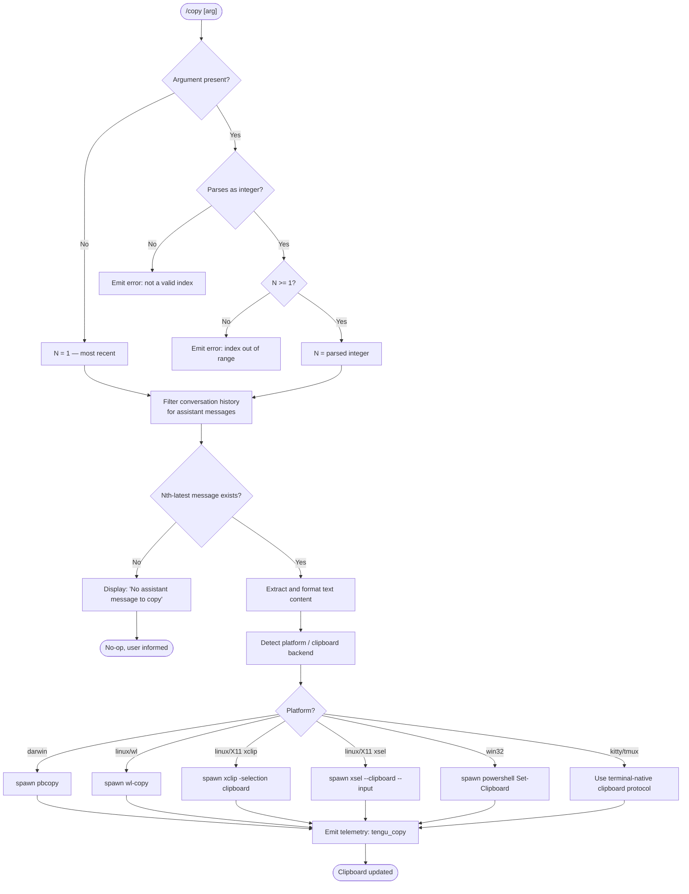

# `/copy`

> Analysis basis: CC v2.1.143 bundle.js (AST extraction + Claude interpretation)
> Minimum version: v2.1.143

---

## Overview

The `/copy` command copies Claude's most recent assistant response to the system clipboard. An optional positive integer argument `N` selects the Nth-latest assistant message instead of the most recent one. The command resolves the target message from the conversation history, formats it, and dispatches it to the OS clipboard mechanism appropriate for the current platform.

---

## Registration

| Field | Value |
|---|---|
| type | `local-jsx` |
| name | `copy` |
| description | `Copy Claude's last response to clipboard (or /copy N for the Nth-latest)` |
| module_id | `OKq` |

Analysis basis: CC v2.1.143 bundle.js:+10111789

---

## Input Branching

The command entry point (`commandHandler`) parses the raw argument string, validates it, selects the target message from history, formats it, and writes it to the clipboard.



Analysis basis: CC v2.1.143 bundle.js:+10111013, +10111084, +10111098, +10111015, +10111328

---

## Behavioral Spec

### Argument Parsing

```
function parseIndexArgument(rawArg):
    if rawArg is absent or empty:
        return 1                          // default: most recent

    n = Number(rawArg)
    if not Number.isInteger(n) or n < 1:
        display error to user
        return null

    return n                              // 1-based, latest-first index
```

Analysis basis: CC v2.1.143 bundle.js:+10111084, +10111098

---

### Message Selection

```
function selectAssistantMessage(conversationMessages, n):
    assistantMessages = []
    for each msg in conversationMessages:
        if msg.role == "assistant":
            assistantMessages.prepend(msg)   // reverse-chronological

    if assistantMessages.length < n:
        return null                           // triggers "No assistant message" notice

    return assistantMessages[n - 1]
```

Analysis basis: CC v2.1.143 bundle.js:+10106922, +10111015, +10111279, +10111269

---

### Text Extraction and Formatting

The selected assistant message may contain multiple content blocks. The formatter iterates over all blocks, retains those with `type == "text"`, and joins them. A table-rendering path converts any structured table blocks into plain pipe-separated text; a plaintext path passes text through with whitespace normalisation (trim). The column separator literal `" | "` and alignment keywords `"center"`, `"right"`, `"left"` are applied during table rendering.

```
function extractPlainText(message):
    textBlocks = filterContentBlocks(message, type="text")
    segments = map(textBlocks, block => block.text)
    joined = join(segments, "\n")
    return trim(joined)

function renderTable(tableBlock):
    rows = []
    for each row in tableBlock.rows:
        cells = map(row.cells, cell => padCell(cell, columnWidth, alignment))
        rows.push(join(cells, " | "))
    return join(rows, "\n")

function buildClipboardPayload(message):
    parts = []
    for each block in message.content:
        if block.type == "table":
            parts.push(renderTable(block))
        elif block.type == "text" or block.type == "plaintext":
            parts.push(extractPlainText(block))
    return join(parts, "\n")
```

Analysis basis: CC v2.1.143 bundle.js:+10106686, +10107127, +10106262, +10106297, +10106339, +10106379, +9962903, +2165554

---

### Column Width Calculation

During table rendering, each column width is computed as the maximum display width across all cells in that column. Display width is measured using `Bun.stringWidth` (handles multi-byte / CJK characters). A minimum column width of 3 characters is enforced via `Math.max(..., 3)`.

```
function computeColumnWidths(tableRows):
    widths = []
    for colIndex in range(maxColumns):
        maxWidth = 3                           // minimum
        for row in tableRows:
            cell = row[colIndex] ?? ""
            w = measureDisplayWidth(cell)      // Bun.stringWidth
            maxWidth = Math.max(maxWidth, w)
        widths[colIndex] = maxWidth
    return widths
```

Analysis basis: CC v2.1.143 bundle.js:+10106153, +10106162, +203980

---

### Clipboard Write — Platform Dispatch

The clipboard writer selects a backend based on the current platform identifier. On macOS it pipes text to `pbcopy`. On Linux it tries `wl-copy` (Wayland), then falls back to `xclip -selection clipboard` or `xsel --clipboard --input`. On Windows it invokes `powershell -NoProfile -NonInteractive -Command Set-Clipboard`. In Kitty terminal environments a terminal-native protocol is used. When inside a tmux session, `tmux load-buffer -w` with a temporary file is used.

```
function writeToClipboard(text):
    platform = detectPlatform()     // darwin | linux | win32
    terminal = detectTerminal()     // kitty | tmux | other

    if terminal == "kitty":
        writeViaKittyProtocol(text)
        return

    if terminal == "tmux":
        tmpFile = writeTempFile(text)
        spawn("tmux", ["load-buffer", "-w", tmpFile])
        return

    if platform == "darwin":
        spawnWithStdin("pbcopy", [], text)

    elif platform == "linux":
        if commandAvailable("wl-copy"):
            spawnWithStdin("wl-copy", [], text)
        elif commandAvailable("xclip"):
            spawnWithStdin("xclip", ["-selection", "clipboard"], text)
        elif commandAvailable("xsel"):
            spawnWithStdin("xsel", ["--clipboard", "--input"], text)

    elif platform == "win32":
        spawnWithStdin("powershell",
            ["-NoProfile", "-NonInteractive", "-Command", "Set-Clipboard"],
            text)
```

Analysis basis: CC v2.1.143 bundle.js:+3325010, +3325075, +3325121, +3325142, +3325155, +3325187, +3325206, +3325220, +3325499, +3325513, +3325526, +3325544, +3324599, +3324609, +3324643, +3324671, +3324984, +3325036, +3325487

---

### No-Message Error Path

When the conversation contains fewer assistant messages than the requested index `N`, the command renders the literal string `"No assistant message to copy"` to the user and performs no clipboard operation.

Analysis basis: CC v2.1.143 bundle.js:+10111015

---

## State & Side Effects

| Item | Detail |
|---|---|
| Telemetry | `tengu_copy` fired after a successful clipboard write (bundle.js:+10111393) |
| Hook registration | None observed at depth ≤ 2 |
| appState changes | No persistent state mutation; read-only access to conversation message history |
| Sound | None observed at depth ≤ 2 |
| Clipboard | OS clipboard contents are overwritten with the extracted assistant text |
| Subprocess | A short-lived OS subprocess (`pbcopy`, `wl-copy`, `xclip`, `xsel`, or `powershell`) is spawned and fed text via stdin |
| Temporary file | A temporary file may be created when the tmux backend is used; it is removed after `tmux load-buffer` completes |

---

## Version History

| Version | Change |
|---|---|
| v2.1.143 | Initial analysis |

---

## Common Mistakes

1. **Passing a non-integer argument** — `/copy 1.5` or `/copy last` are not valid. The argument must be a positive integer; anything else is rejected before message lookup occurs.
2. **Using 0 or a negative index** — Indexing is 1-based (`/copy 1` = most recent). Passing `0` or a negative number is treated as invalid and will not copy anything.
3. **Requesting an index larger than the history depth** — If only two assistant messages exist, `/copy 3` produces the "No assistant message to copy" notice rather than silently copying an unintended message.
4. **Expecting rich formatting in the clipboard** — The command outputs plain text. Markdown is not converted to HTML; tables are rendered as pipe-separated ASCII rows, not styled cells.
5. **Clipboard unavailable in headless / SSH environments** — If no clipboard backend (`pbcopy`, `wl-copy`, `xclip`, `xsel`, `powershell`) is accessible, the write silently fails. In remote SSH sessions consider using the tmux backend or configuring a clipboard forwarding tool before relying on `/copy`.

---

## Appendix — Identifier Mapping

> For bundle debugging only. Identifiers change across versions.

| Identifier | Role |
|---|---|
| `KKq` | Table-row renderer / cell formatter |
| `fz7` | Column-separator map helper |
| `LKq` | Markdown lexer / message-block extractor |
| `MKq` | Plaintext block text replacer |
| `fKq` | Content-block type filter (array check + push) |
| `DK` | Text-type block filter |
| `Yz7` | Command handler (entry point for `/copy`) |
| `Lz7` | Lexer-based token collector |
| `nYH` | Token text replacement helper |
| `aC_` | Post-parse action dispatcher |
| `qT` | Clipboard write orchestrator |
| `cw` | Kitty-protocol clipboard writer |
| `wbL` | Kitty base64 chunk encoder |
| `GbL` | Darwin (`pbcopy`) clipboard backend |
| `PbL` | Linux clipboard backend selector |
| `jbL` | Text replaceAll sanitiser before clipboard write |
| `Y8` | Subprocess spawn-with-stdin helper |
| `H7` | String indexOf utility |
| `$Kq` | Temporary-file writer (tmux path) |
| `kP` | Temp-directory resolver |
| `_n` | Temp path join helper |
| `AnL` | Directory permission / existence checker |
| `M8` | Display-width measurer (wraps `Bun.stringWidth`) |
| `hH` | JSON serialiser wrapper |
| `lfH` | Text trim + slice helper |
| `ha` | Assistant-message text extractor |
| `JZq` | Daemon status reader |
| `r06` | Status file path joiner |
| `d1` | AsyncLocalStorage store getter |
| `SvH` | MCP server connection manager |
| `KHH` | MCP config merger |
| `cqH` | MCP config loader (enterprise/user/project/local) |
| `qHH` | SDK-type server collector |
| `ww6` | SSE/HTTP server map builder |
| `rI` | MCP client resolver |
| `X$` | Client constructor helper |
| `RG_` | Client registry updater |
| `_57` | MCP connection state recorder |
| `bh_` | Needs-auth cache reader |
| `v78` | Server tool hash builder |
| `kj` | SHA-256 hash helper |
| `I78` | Tool definition key extractor |
| `dK` | Tool property mapper |
| `A8` | MCP debug log emitter |
| `Yh_` | MCP server connect orchestrator |
| `tHH` | OAuth / step-up auth flow handler |
| `mrH` | Pending-auth cache manager |
| `BY8` | Needs-auth cache writer |
| `UQ` | MCP reconnect handler |
| `Ku` | Auth-state accessor |
| `Y` | Supervisor config reloader |
| `_7` | MCP error log emitter |
| `XH` | String coercer |
| `D77` | SSH environment detector |
| `Dh_` | MCP tool-call dispatcher |
| `urH` | RY8 registry getter |
| `prH` | CY8 pending-auth getter |
| `x8q` | MCP reconnect initiator |
| `tY8` | Needs-auth cache path builder |
| `Oh_` | MCP tool schema validator |
| `NG_` | MCP server name-inclusion checker |
| `a6` | Global config writer |
| `S8q` | Integer validation wrapper |
| `Yn` | Safe-integer / mapper validator |
| `M26` | radix-10 parseInt wrapper |
| `xh_` | Alternative parseInt wrapper |
| `THK` | MCP update applier |
| `eY8` | MCP state serialiser |
| `wv` | MCP cleanup orchestrator |
| `drH` | MCP connection cleanup |
| `v` | Terminal/log-level formatter |
| `G5K` | Log-level comparator |
| `tt_` | Log-level token resolver |
| `P7` | REDACTED-field replacer |
| `h6A` | Field-map renderer |
| `cSH` | Terminal write dispatcher |
| `X6A` | Raw terminal write |
| `Z5K` | Log rotation / append-file writer |
| `PSH` | Buffered log flusher |
| `i8H` | Log-line builder |
| `gv8` | Log directory initialiser |
| `U6A` | Log file path builder |
| `p6A` | Log file rotator |
| `E5K` | Append-and-rotate writer |
| `h9` | `at_` hook registrar |
| `B95` | MCP server-set diffuser |
| `k78` | Disabled-server set checker |
| `r8` | Timeout-guarded async helper |
| `LKq` | Markdown-token to message-block converter |
| `lf` | Markdown lexer wrapper |
| `N6` | Config file watcher initialiser |
| `H$H` | Config file reader/parser |
| `R6` | JSON.parse wrapper |
| `jR` | UTF-8 BOM stripper |
| `zZ9` | Config file directory scanner |
| `X9_` | Config backup path builder |
| `NH` | Error logger with ring-buffer |
| `v_` | Error-to-string converter |
| `xH` | Value-to-string converter |
| `zq` | Error ring-buffer accessor |
| `kNK` | Ring-buffer shift/push manager |
| `nhL` | Config file watcher |
| `Tl` | Config-change event emitter |
| `w` | Background session manager |
| `C` | Background worker subprocess |
| `mH` | Feature-bad telemetry emitter |
| `SH` | Feature-ok telemetry emitter |
| `IG6` | Low-memory checker |
| `G6` | Config-file-based feature-flag reader |
| `Oo_` | Unix-socket claim connector |
| `jo_` | Background session lifecycle manager |
| `H_` | Utility wrapper (single-arg passthrough) |
| `f26` | MCP filter predicate |
| `J77` | Auth-timeout error type |
| `D` | Spare-process lifecycle poller |