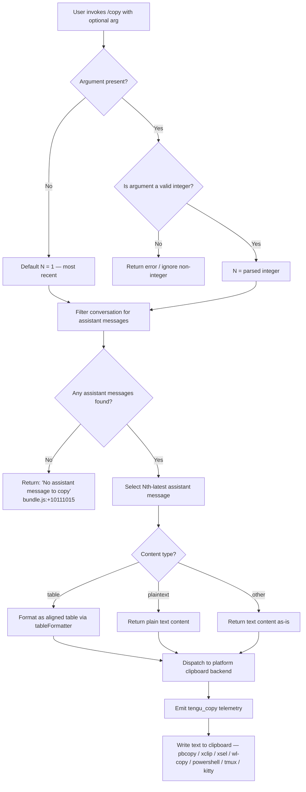

# `/copy`

> Analysis basis: CC v2.1.143 bundle.js (AST extraction + Claude interpretation)
> Minimum version: v2.1.143

---

## Overview

`/copy` copies Claude's most recent assistant response to the system clipboard. An optional numeric argument `N` selects the Nth-latest assistant response instead of the most recent one. The command formats the content (handling plain text, table, and other representations) before dispatching it to the platform-appropriate clipboard backend.

---

## Registration

| Field | Value |
|---|---|
| type | `local-jsx` |
| name | `copy` |
| description | `Copy Claude's last response to clipboard (or /copy N for the Nth-latest)` |
| module_id | `OKq` |
| load_inline | `true` |
| loc_byte | `10111789` |
| loc_byte_end | `10111975` |
| loc_line | `5648` |
| arbor_handler.name | `Yz7` |
| arbor_handler.fqn | `claude-2.1.143::Yz7` |
| arbor_handler.kind | `AsyncFunction` |
| arbor_handler.resolution_path | `module_id` |
| arbor_handler.n_hits | `0` |

Analysis basis: CC v2.1.143 bundle.js:+10111789

---

## Input Branching

The command has four distinct logical branches depending on whether an index argument was provided, whether it is a valid integer, whether any assistant messages exist, and whether the resolved message is in `table` or `plaintext` format.



Analysis basis: CC v2.1.143 bundle.js:+10111013, +10111084, +10111098, +10111015, +10106686, +10107127

---

## Behavioral Spec

### Top-level handler — `copyCommandHandler` (arbor: `Yz7`)

The handler is an `AsyncFunction` resolved via `module_id` path (`OKq → Yz7`).

```
async function copyCommandHandler(args, context):
    rawArg = extractArgumentString(args)         // fKq — parses argument tokens
    messages = getConversationMessages(context)  // H — conversation message array

    if rawArg is present:
        n = Number(rawArg)
        if not Number.isInteger(n):
            // non-integer argument; fall back to N=1 or surface error
            n = 1
    else:
        n = 1

    assistantMessages = filterToAssistantRole(messages)  // literal "assistant" bundle.js:+10106922

    if assistantMessages is empty:
        return error("No assistant message to copy")     // bundle.js:+10111015

    target = selectNthLatest(assistantMessages, n)       // via LKq — bundle.js:+10111328

    formatted = formatMessageContent(target)             // Lz7 — bundle.js:+10111340

    writeToClipboard(formatted)                          // aC_ → qT → GbL/PbL

    emitTelemetry("tengu_copy")                          // bundle.js:+10111393
    return success
```

Analysis basis: CC v2.1.143 bundle.js:+10110974, +10111013, +10111084, +10111098, +10111328, +10111340, +10111391

---

### Argument parser — `argumentExtractor` (`fKq`)

```
function argumentExtractor(rawInput):
    if Array.isArray(rawInput):
        tokens = filterToTextType(rawInput)   // DK — bundle.js:+10107024; literal "text" +9962903
        push extracted tokens
    return joined token string
```

Analysis basis: CC v2.1.143 bundle.js:+10106992, +10107024, +10107040

---

### Message selector — `nthLatestSelector` (`LKq`)

```
function nthLatestSelector(messages, n):
    lexed = lexer.parse(messages)             // lf.lexer — bundle.js:+10106573
    idx = messages.indexOf(target)            // H.indexOf — bundle.js:+10106619
    selected = messages.slice(...)            // A.slice — bundle.js:+10106751
    return selected[n - 1]                   // 1-based index
```

Analysis basis: CC v2.1.143 bundle.js:+10106573, +10106619, +10106740, +10106751

---

### Content formatter — `tableRowFormatter` (`KKq`)

Handles table-formatted assistant messages. Recognises the pipe-delimited table syntax used by Claude.

```
function tableRowFormatter(messageContent):
    rows = messageContent.map(lexRowContent)          // fz7 — bundle.js:+10106060
    rows = rows.map(...)                              // $.map — bundle.js:+10106076
    // Strip escaped pipe characters
    rows = rows.replace(/\|/, ...)                    // literal "\\|" — bundle.js:+10106103
    maxCols = Math.max(columnCounts)                  // bundle.js:+10106153
    widths = rows.map(measureStringWidth)             // M8 → Bun.stringWidth — bundle.js:+10106178
    // Pad each cell to computed width (min 3 columns — bundle.js:+10106162)
    padded = rows.map(padCellWidth)                   // K — bundle.js:+10106451, +10106464
    // Join with " | " separator (bundle.js:+10106262)
    joined = padded.join(" | ")
    // Apply alignment: center / right / left (bundle.js:+10106297, +10106339, +10106379)
    return joined
```

Analysis basis: CC v2.1.143 bundle.js:+10106060, +10106076, +10106103, +10106153, +10106162, +10106178, +10106262, +10106297, +10106339, +10106379, +10106451, +10106464

---

### Plain-text formatter — `plaintextFormatter` (`MKq`)

```
function plaintextFormatter(content):
    return content.replace(escapeSequences, "")   // H.replace — bundle.js:+10107087
    // literal "plaintext" — bundle.js:+10107127
```

Analysis basis: CC v2.1.143 bundle.js:+10107087, +10107127

---

### Markdown lexer helper — `markdownLexer` (`Lz7`)

Used by the handler to parse assistant message content before formatting.

```
function markdownLexer(text):
    tokens = lexer.lex(text)             // lf.lexer — bundle.js:+10105800
    tokens = normalizeWhitespace(tokens) // nYH → H.replace — bundle.js:+10105809
    result.push(tokens)                  // A.push — bundle.js:+10105865
    return result
```

Analysis basis: CC v2.1.143 bundle.js:+10105800, +10105809, +10105865

---

### Clipboard writer — `clipboardWriter` (`qT` via `aC_`)

Dispatches formatted text to the operating-system clipboard.

```
async function clipboardWriter(text):
    platform = detectPlatform()

    if terminal == "kitty":                       // literal "kitty" — bundle.js:+3324106
        writeKittyClipboard(text)                 // cw → wbL — bundle.js:+3324801

    else if platform == "darwin":                 // literal "darwin" — bundle.js:+3324984
        spawn("pbcopy", text)                     // literal "pbcopy" — bundle.js:+3325010

    else if platform == "linux":                  // literal "linux" — bundle.js:+3325036
        try wl-copy:                              // literal "wl-copy" — bundle.js:+3325075
            spawn("wl-copy", text)
        catch:
            try xclip:                            // literal "xclip" — bundle.js:+3325121
                spawn("xclip", "-selection", "clipboard", text)
                                                  // literals bundle.js:+3325142, +3325155
            catch:
                spawn("xsel", "--clipboard", "--input", text)
                                                  // literals bundle.js:+3325187, +3325206, +3325220

    else if platform == "win32":                  // literal "win32" — bundle.js:+3325487
        spawn("powershell", ["-NoProfile",        // literals bundle.js:+3325499, +3325513
              "-NonInteractive", "-Command", ...])// literals bundle.js:+3325526, +3325544

    // tmux fallback (load-buffer -w)             // literals bundle.js:+3324609, +3324643
    if insideTmux:
        spawn("tmux", "load-buffer", "-w", ...)

    // iTerm2 fallback                            // literal "iTerm2" — bundle.js:+3324599
    if insideITerm2:
        writeITerm2Clipboard(text)
```

Analysis basis: CC v2.1.143 bundle.js:+3324801, +3324855, +3324871, +3324885, +3324984, +3325010, +3325036, +3325075, +3325121, +3325142, +3325155, +3325187, +3325206, +3325220, +3325487, +3325499, +3325513, +3325526, +3325544, +3324609, +3324643, +3324671, +3324599

---

### Daemon status / background session helpers (depth-2 reachable, not directly invoked by `/copy`)

Several identifiers reachable at depth 2 (`JZq`, `r06`, daemon status file `"daemon.status.json"` at bundle.js:+11707334) are part of the shared conversation-state infrastructure used to read message history. They are not specific to `/copy`.

---

## State & Side Effects

| Item | Detail |
|---|---|
| Telemetry | `tengu_copy` (bundle.js:+10111393) — emitted on every successful invocation. Depth-2 reachable events (`tengu_mcp_oauth_flow_*`, `tengu_bg_*`, `tengu_daemon_*`, `tengu_config_*`, `tengu_feature_*`) belong to shared infrastructure, not to `/copy` directly. |
| Clipboard write | Writes formatted assistant message text to the OS clipboard via platform subprocess or terminal escape sequences. |
| Hook registration | None specific to `/copy`. |
| appState changes | None — read-only access to conversation message history. |
| Sound | None. |
| File I/O | Clipboard backends may spawn child processes (`pbcopy`, `xclip`, `xsel`, `wl-copy`, `powershell`). tmux backend uses `tmux load-buffer`. No file writes to disk by `/copy` itself. |

---

## Version History

| Version | Change |
|---|---|
| v2.1.143 | Initial analysis |

---

## Common Mistakes

1. **Passing a non-integer argument** — `/copy foo` will not select a message; the argument must be a positive integer (`/copy 2`). Non-integer values cause the handler to fall back to index 1 or surface an error.
2. **Expecting `/copy` to work when no assistant turn exists** — If the session has no assistant message yet, the command returns `"No assistant message to copy"` (bundle.js:+10111015) and writes nothing to the clipboard.
3. **Clipboard failure on headless / SSH environments** — On remote sessions without a display server, `xclip`/`xsel`/`wl-copy` may all fail silently. Use tmux or kitty terminal support, or ensure a clipboard forwarder (e.g. `lemonade`, OSC-52) is configured.
4. **Index off-by-one** — `/copy 1` is the *most recent* assistant message; `/copy 2` is the second-most-recent. There is no `/copy 0`.
5. **Table alignment depends on terminal width** — The table formatter uses `Bun.stringWidth` (bundle.js:+10106178) for Unicode-aware cell widths. Copying a table and pasting into a non-monospace context may produce misaligned columns.

---

## Appendix — Identifier Mapping

> For bundle debugging only. Identifiers change across versions.

| Identifier | Role |
|---|---|
| `Yz7` | Top-level `/copy` async handler (arbor canonical name) |
| `KKq` | Table row formatter — formats pipe-delimited table content |
| `fz7` | Row content lexer helper — maps over table rows |
| `LKq` | Nth-latest message selector — resolves which assistant message to copy |
| `MKq` | Plaintext formatter — strips escape sequences from plain content |
| `fKq` | Argument extractor — parses slash-command argument tokens |
| `DK` | Text-type filter — filters message content blocks to `"text"` type |
| `Lz7` | Markdown lexer wrapper — tokenises assistant message text |
| `nYH` | Whitespace normaliser — applies regex replacement to lexer tokens |
| `aC_` | Clipboard dispatch coordinator — routes to platform writer |
| `qT` | Platform clipboard writer — detects OS and invokes appropriate backend |
| `cw` | Kitty terminal clipboard writer |
| `wbL` | Kitty escape-sequence helper |
| `GbL` | macOS `pbcopy` clipboard backend |
| `PbL` | Linux `wl-copy` / `xclip` / `xsel` clipboard backend |
| `jbL` | String sanitiser for clipboard payload (`H.replaceAll`) |
| `Y8` | Low-level clipboard write executor |
| `H7` | Index-of helper for content scanning |
| `$Kq` | Temporary directory / file helper for clipboard staging |
| `kP` | Temp-dir creation and chmod helper |
| `AnL` | Temp-dir lstat / validation helper |
| `M8` | String-width measurer via `Bun.stringWidth` |
| `JZq` | Conversation message reader / state accessor |
| `ha` | Message content text extractor |
| `lfH` | Text trimmer with 1000ms/0-offset params |
| `r06` | Daemon status file reader (`daemon.status.json`) |
| `hH` | JSON serialiser wrapper (`JSON.stringify`) |
| `N8` | Session-state label resolver (e.g. `"stopped"`, `"background session"`) |
| `NH` | Error logger with ring-buffer (`xRH`) push |
| `xH` | String coercer |
| `v_` | Error/String dual-path formatter |
| `zq` | Log accumulator helper |
| `kNK` | Ring-buffer shift/push for log history |
| `d1` | AsyncLocalStorage store accessor (`znL.getStore`) |
| `SvH` | MCP server manager (depth-2; not directly used by `/copy`) |
| `KHH` | MCP config loader (depth-2) |
| `cqH` | MCP source resolver (depth-2) |
| `Yh_` | MCP server connector (depth-2) |
| `tHH` | MCP OAuth flow handler (depth-2) |
| `mrH` | MCP pending-request cache manager (depth-2) |
| `UQ` | MCP reconnect orchestrator (depth-2) |
| `THK` | MCP update applicator (depth-2) |
| `B95` | MCP full refresh coordinator (depth-2) |
| `Z5K` | Append-log / rotation writer (depth-2) |
| `PSH` | Buffered write scheduler (depth-2) |
| `h9` | Signal handler registrar (`at_.register`) |
| `G6` | Config reader with watch support (depth-2) |
| `N6` | Config file loader with backup and watch (depth-2) |
| `H$H` | Config file parser / migrator (depth-2) |
| `zZ9` | Config backup directory scanner (depth-2) |
| `X9_` | Config path joiner helper |
| `nhL` | File-watch registration helper (depth-2) |
| `a6` | Global config save with auth-loss guard (depth-2) |
| `v78` | MCP server hash / key generator (depth-2) |
| `kj` | SHA-256 hash helper (`eV1.createHash`) |
| `I78` | MCP server identity key builder (depth-2) |
| `dK` | Storage key constructor |
| `Oh_` | MCP server reader with hash check (depth-2) |
| `NG_` | MCP notification gateway (depth-2) |
| `Dh_` | MCP pending-tool handler (depth-2) |
| `x8q` | MCP needs-auth cache accessor (depth-2) |
| `tY8` | Auth-cache path builder (`mcp-needs-auth-cache.json`) |
| `bh_` | Auth-cache read helper (depth-2) |
| `_57` | MCP server status snapshot helper (depth-2) |
| `S8q` | Safe-integer mapper wrapper (`Yn`) |
| `Yn` | Async iterable mapper (validates integer, uses `addEventListener`) |
| `M26` | Integer parser (radix 10) |
| `xh_` | Secondary integer parser (radix 20) |
| `BY8` | Auth-cache write helper (depth-2) |
| `wv` | MCP cleanup orchestrator (depth-2) |
| `drH` | MCP connection teardown helper (depth-2) |
| `eY8` | MCP state serialiser (`hH` wrapper) |
| `D77` | SSH-aware clipboard/display detector |
| `_7` | MCP error logger (`Wc.logMCPError`) |
| `A8` | MCP debug logger (`Wc.logMCPDebug`) |
| `XH` | String-cast utility |
| `Ku` | Shared utility accessor (`aL`) |
| `PB` | Platform/process bootstrap helper |
| `rI` | MCP result transformer (`X$`, `RG_`) |
| `X$` | Result wrapper (`ApH`, `N6`, `A1`) |
| `H_` | Identity pass-through helper |
| `f26` | Filter predicate helper |
| `Oo_` | Unix-socket connect / claim helper (depth-2) |
| `jo_` | Subprocess lifecycle manager (depth-2) |
| `w` | Daemon worker session manager (depth-2) |
| `C` | Child-process wrapper (depth-2) |
| `mH` | Feature-bad metric emitter |
| `SH` | Feature-ok metric emitter |
| `IG6` | Memory pressure reporter (`d6`, `G6`) |
| `G5K` | Output renderer (`IV`, `W5K`, `tt_`) |
| `tt_` | Terminal line kit (`TLK`, `ELK`) |
| `P7` | ANSI/escape sequence stripper with redaction |
| `h6A` | Width-map builder (`w5K.map`) |
| `cSH` | Raw terminal writer (`X6A → H.write`) |
| `i8H` | Log path builder (`HPH.join`, `x8`, `V6`) |
| `gv8` | Log size reader (`L8`) |
| `U6A` | Log path resolver (`HPH.join`, `V6`) |
| `p6A` | Log rotation helper (`lv.stat`, `lv.rename`, `lv.unlink`) |
| `E5K` | Log append-and-rotate executor |
| `v` | Output formatter with debug/ANSI handling |
| `Ei` | Terminal capability probe (`xH`) |
| `k78` | MCP capability set checker (`mm4.has`, `pm4.has`) |
| `r8` | Timeout-guarded async helper |
| `lf` | Markdown lexer module (`uTH.parse`) |
| `_n` | Temp directory path builder |
| `H$H` | (also listed above) Config parser/migrator |
| `R6` | JSON.parse wrapper |
| `jR` | BOM / prefix stripper for config text |
| `L8` | File size reader |
| `zZ9` | (also listed above) Backup scanner |
| `Tl` | File-watch debounce helper |