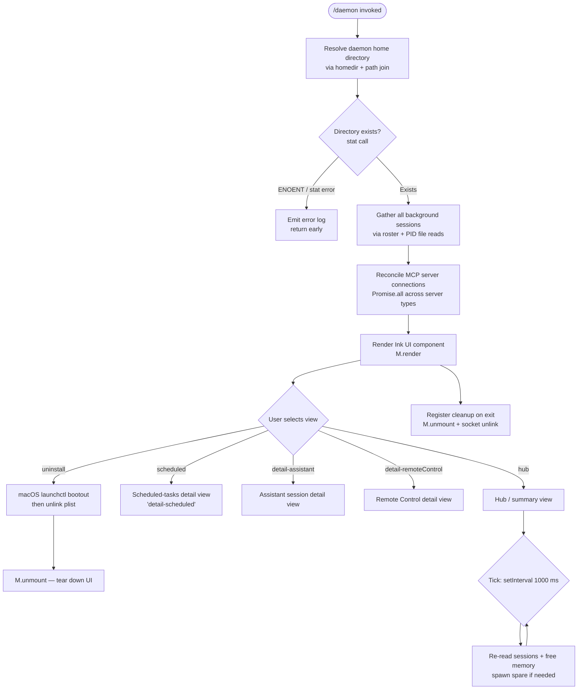

# `/daemon`

> Analysis basis: CC v2.1.143 bundle.js (AST extraction + Claude interpretation)
> Minimum version: v2.1.143

---

## Overview

The `/daemon` command manages Claude Code's background service layer, providing a unified interface for controlling assistant sessions, scheduled tasks, and remote-control connections. It renders a live React/Ink UI that reflects real-time daemon state, spawns or terminates background worker processes, reconciles MCP server connections, and coordinates supervisor heartbeats — all within the same terminal session.

---

## Registration

| Field | Value |
|---|---|
| type | `local-jsx` |
| name | `daemon` |
| description | `Manage background services: assistants, scheduled tasks, and remote control` |
| immediate | `true` |
| module\_id | `Kg_` |

Analysis basis: CC v2.1.143 bundle.js:+11919149

---

## Input Branching

The command entry point (identified as the **command executor** function) dispatches to several sub-systems immediately on invocation. The high-level flow is:



Analysis basis: CC v2.1.143 bundle.js:+11918106 (Promise.all entry), +11918523 (render), +11908374 (setInterval), +11908446 (clearInterval), +11918737 (unmount)

---

## Behavioral Spec

### 1. Daemon Home Directory Resolution

```
function resolveDaemonHomeDir():
    base = os.homedir()
    daemonDir = path.join(base, "Library", "LaunchAgents")
    try:
        stat(daemonDir)
        return daemonDir
    catch error:
        if error.code == "ENOENT":
            logDebug("ENOENT", error)
            return null
        logError("error", error)
        return null
```

Analysis basis: CC v2.1.143 bundle.js:+11891799 (homedir), +11891843 (stat), +11891867 (error branch), +10555207 ("Library"), +10555217 ("LaunchAgents")

---

### 2. Roster Parsing — Background Session Discovery

The roster-parsing subsystem reads PID files and parses session metadata from the filesystem.

```
function parseRoster(daemonDir):
    entries = []
    try:
        files = readdir(daemonDir)
        pidFiles = files.filter(f => f matches PID pattern)
        for each pidFile in pidFiles:
            raw = fs.readFile(pidFile, "utf8")
            parsed = JSON.parse(raw)
            entries.push(parsed)
    catch error:
        emit telemetry("tengu_bg_roster_parse_failed")
        return []
    return entries
```

Analysis basis: CC v2.1.143 bundle.js:+10564375 (readFile), +10564456 (roster parse failed telemetry), +11796527 (readFile utf8), +11895815 ("same-dir" path variant)

---

### 3. Background Session Lifecycle — Supervisor Dispatch Loop

The dispatcher runs on a 1000 ms interval tick. It checks free memory, decides whether to spawn a spare session, retires settled sessions, and emits relevant telemetry.

```
function dispatcherTick(state):
    freeMem = os.freemem()
    memMB   = Math.round(freeMem / 1024)

    if memMB is critically low:
        emit telemetry("tengu_bg_dispatch_low_mem")
        logPlatform("macos", memMB)          // platform tag
        emit telemetry("tengu_bg_low_mem_mb")
        skip spare spawn

    for each session in state.sessions.values():
        session.retireIfSettled()            // supervisor helper

    if spareEnabled and no spare session exists:
        emit telemetry("tengu_bg_spare_enable")
        spawnSpare(state)

    state.lastTick = Date.now()
```

Spare spawn attempt:

```
function spawnSpare(state):
    emit telemetry("tengu_bg_spare_spawn")
    proc = fU.spawn(...)
    state.sessions.set(proc.id, proc)
    scheduleSpareCleanup(proc)
```

Analysis basis: CC v2.1.143 bundle.js:+11908374 (setInterval), +11908426 (1000 ms literal), +14503626 (freemem), +14503677 (Math.round), +14503796 (low-mem telemetry), +14502994 (spare spawn telemetry), +14504411 (spare enable telemetry), +14504854 (fU.spawn)

---

### 4. Background Session States

Each background session tracks a lifecycle status string:

| Status string | Meaning |
|---|---|
| `starting` | Process spawned, not yet adopted |
| `adopted` | Supervisor has confirmed process identity |
| `active` | Session is processing a task |
| `working` | Actively running tool calls |
| `blocked` | Awaiting permission grant |
| `idle` | Waiting for input |
| `spare` | Pre-warmed, not yet assigned |
| `bg` | Backgrounded / detached |
| `resuming` | Returning from background |
| `done` | Task completed normally |
| `killed` | Terminated by user or signal |
| `stopped` | Halted |
| `crashed` | Non-zero exit / unexpected termination |

Analysis basis: CC v2.1.143 bundle.js:+14496455 ("starting"), +14496487 ("adopted"), +14508123 ("active"), +14508097 ("working"), +14508023 ("blocked"), +14508657 ("idle"), +14503931 ("spare"), +14508222 ("bg"), +14509348 ("resuming"), +14507808 ("done"), +14507826 ("killed"), +14507835 ("stopped"), +14507983 ("crashed")

---

### 5. Session Attachment Protocol (IPC Socket)

Client attachment uses a line-delimited JSON protocol over a Unix socket. The protocol supports the following message types:

| Direction | Message type | Purpose |
|---|---|---|
| Client → Daemon | `ping` | Keepalive check |
| Client → Daemon | `nudge` | Wake idle session |
| Client → Daemon | `yield` | Surrender control |
| Client → Daemon | `lease` / `leases` | Request resource lease |
| Client → Daemon | `shutdown` | Graceful stop |
| Client → Daemon | `reply` | Send permission answer |
| Client → Daemon | `kill` | Force-terminate session |
| Client → Daemon | `resize` | Terminal resize event |
| Client → Daemon | `attach` | Begin session attach |
| Client → Daemon | `dispatch` | Submit new task |
| Client → Daemon | `list` | Enumerate sessions |
| Client → Daemon | `has` | Query session existence |
| Client → Daemon | `subscribe` | Subscribe to state updates |
| Client → Daemon | `ensure-spare` | Request spare pre-warm |
| Client → Daemon | `permission-response` | Respond to tool permission prompt |
| Daemon → Client | `snapshot` | Full terminal state snapshot |
| Daemon → Client | `stream` | Incremental output chunk |
| Daemon → Client | `state` | Session status update |
| Daemon → Client | `settled` | Session task complete |
| Daemon → Client | `heartbeat` | Supervisor alive signal |

Error codes used within the protocol:

| Code | Meaning |
|---|---|
| `ESTARTING` | Session not yet ready |
| `EPROTO` | Protocol version mismatch |
| `ENOJOB` | Session not found (may have exited) |
| `ENOREPLY` | Session not in interactive state |
| `EUNVERIFIED` | Supervisor cannot verify worker identity |
| `ERESPAWNING` | Worker stalled and is restarting |
| `ETOOLARGE` | Message exceeds size limit |
| `EUNKNOWN` | Unclassified error |
| `EKICKED` | Session opened in another window |

Analysis basis: CC v2.1.143 bundle.js:+14491483 ("ping"), +14491908 ("nudge"), +14491976 ("yield"), +14492036 ("lease"), +14492175 ("shutdown"), +14492343 ("ESTARTING"), +14492644 ("EPROTO"), +14493332 ("list"), +14493491 ("has"), +14493741 ("dispatch"), +14493950 ("ENOJOB"), +14494091 ("ENOREPLY"), +14494521 ("respawn-stale"), +14495171 ("EUNVERIFIED"), +14495265 ("ERESPAWNING"), +14489739 ("ETOOLARGE"), +14491365 ("EUNKNOWN"), +14498179 ("EKICKED"), +14498858 ("ensure-spare"), +14498923 ("permission-response"), +14499107 ("snapshot"), +14499294 ("stream"), +14499350 ("state"), +14499197 ("settled"), +14515546 ("heartbeat")

---

### 6. SIGKILL Escalation

If a session fails to terminate after a SIGTERM, the dispatcher escalates:

```
function escalateToSigkill(session):
    send SIGTERM to session.pid
    wait 100 ms
    if session still alive:
        emit telemetry("tengu_bg_dispatch_sigkill_escalate")
        process.kill(session.pid, "SIGKILL")
```

Analysis basis: CC v2.1.143 bundle.js:+14503217 (SIGKILL telemetry), +14503265 ("SIGKILL"), +14503289 (100 ms delay)

---

### 7. MCP Server Reconciliation

On each invocation the command reconciles configured MCP servers against live connections:

```
function reconcileMcpServers(configuredServers, liveClients):
    results = []
    for each [name, config] in Object.entries(configuredServers):
        if config.disabled:
            skip
        transport = config.transport   // "stdio" | "sse" | "http" | "sse-ide" | "ws-ide"
        existingClient = liveClients.get(name)
        if existingClient and existingClient.status == "connected":
            results.push({ name, status: "connected" })
            continue
        if existingClient and existingClient.status == "needs-auth":
            logDebug("Skipping connection (cached needs-auth)")
            results.push({ name, status: "needs-auth" })
            continue
        newClient = connectMcpClient(name, config)
        results.push(newClient)
    if all previously-failed remotes are now recovered:
        logDebug("[MCP] Retry: all remote servers recovered, stopping")
        stopRetryScheduler()
    return Promise.all(results)
```

Analysis basis: CC v2.1.143 bundle.js:+9694671 (MCP reconcile core), +9694745 ("disabled"), +9694847 ("stdio"), +9694881 ("sse"), +9694913 ("http"), +9694946 ("sse-ide"), +9694982 ("ws-ide"), +9695386 ("Skipping connection"), +9695452 ("needs-auth"), +9695554 ("connected"), +9696127 ("failed"), +14234339 (applyMcpUpdate), +14234909 ("[MCP] Retry" log)

---

### 8. macOS launchctl Service Management

On macOS (`darwin`), the daemon can be installed and managed as a Launch Agent:

```
function launchctlQuery(serviceLabel):
    run: launchctl print <serviceLabel>
    wait up to 5000 ms for output
    return parsed status

function installService():
    write plist to ~/Library/LaunchAgents/<label>.plist
    run: launchctl kickstart <domainTarget>/<label>

function uninstallService():
    run: launchctl bootout <domainTarget>/<label>
    unlink plist file
    // Note: "service uninstall not available on darwin" guard exists

function restartService():
    send SIGTERM to daemon PID
    poll every 200 ms, up to 50 attempts
    if daemon did not exit within ~10 s:
        abort restart, log:
        "daemon did not exit within 10s of SIGTERM; restart aborted before kickstart"
    else:
        run: launchctl kickstart <domainTarget>/<label>
```

Analysis basis: CC v2.1.143 bundle.js:+10558422 ("launchctl"), +10558435 ("print"), +10558469 (5000 ms timeout), +10556980 ("bootout"), +10557112 ("service uninstall not available on darwin"), +10557332 ("start"), +10557343 ("kickstart"), +10557368 ("stop"), +10557408 ("restart"), +10557497 (200 ms poll interval), +10557636 (50 max attempts), +10557665 (timeout message), +10557991 ("darwin"), +10555184 (path join), +10555207 ("Library"), +10555217 ("LaunchAgents")

---

### 9. Away Summary Generation

The daemon periodically generates an "away summary" when the user is inactive:

```
function attemptAwaySummary(state):
    cacheAge = getCacheAge(state)
    if cacheAge is unknown:
        log("[awaySummary] skipped: cache age unknown")
        return

    if cacheAge stale (random threshold ~0.9):
        log("[awaySummary] skipped: cache stale")
        return

    rateLimitStatus = checkRateLimit()
    if rateLimitStatus != "allowed":
        log("[awaySummary] skipped: at or near rate limit")
        return

    if draftInputPresent(state):
        log("[awaySummary] skipped: draft input present")
        return

    params = loadCacheSafeParams(state)
    if params is null:
        log("[awaySummary] no CacheSafeParams saved, skipping")
        return

    result = generateSummary(params)
    if result.status == "ok":
        emit telemetry("away_summary_generate")
    else:
        emit telemetry("generate_failed")
        // retry up to 3 times
```

Analysis basis: CC v2.1.143 bundle.js:+13331919 (cache age unknown), +13331988 (0.9 threshold), +13331995 (stale), +13332070 ("allowed"), +13332083 (rate limit), +13332166 (draft input), +6655202 (no CacheSafeParams), +13332397 ("away_summary_generate"), +13332421 ("generate_failed"), +13332472 (3 retries)

---

### 10. Remote Control Management

The `/daemon` UI exposes a "Remote Control" panel (view key `detail-remoteControl`) that tracks remote-control sessions. Model resolution for remote-control sessions handles special aliases:

| Alias | Resolved model |
|---|---|
| `opusplan` | Opus plan variant |
| `opus` | Standard opus |
| `opus[1m]` | Opus with 1 M context |
| `claude-opus-4-6` | Explicit model ID |
| `claude-opus-4-6[1m]` | Explicit model ID with extended context |
| `Custom model` | User-supplied string |

Connections are validated against the `anthropic.` prefix; non-Anthropic model strings are tagged as `Custom model`.

Analysis basis: CC v2.1.143 bundle.js:+10176782 ("anthropic."), +10176867 ("Custom model"), +10177023 ("opusplan"), +10177071 ("opus"), +10177197 ("opus[1m]"), +10177253 ("claude-opus-4-6"), +10177318 ("claude-opus-4-6[1m]"), +11909309 ("remoteControl"), +11909981 ("Remote Control"), +11909012 ("detail-remoteControl")

---

### 11. Idle Exit — Supervisor Self-Termination

The supervisor process tracks its own idle window. When no active sessions or pending work remain and the idle threshold is exceeded, the supervisor exits:

```
function supervisorIdleCheck(supervisor):
    elapsed = Date.now() - supervisor.lastActivity
    if elapsed >= idleThreshold:
        emit telemetry("tengu_daemon_idle_exit")
        supervisor.unref()   // allow Node event loop to drain
        exitGracefully()
```

Analysis basis: CC v2.1.143 bundle.js:+14522118 (idle exit telemetry), +14522181 (m.unref), +14521792 ("transient" tag)

---

### 12. UI View Structure

The Ink component renders different panels based on the active view key:

| View key | Label shown | Content |
|---|---|---|
| `hub` | Claude Daemon | Summary of all service categories |
| `scheduled` | Scheduled | Scheduled task list |
| `detail-scheduled` | Scheduled | Detail for one scheduled task |
| `detail-assistant` | (session name) | Assistant background session detail |
| `detail-remoteControl` | Remote Control | Remote-control connection detail |

The UI title string "Claude Daemon" is used as the top-level heading.
Analysis basis: CC v2.1.143 bundle.js:+11908194 ("hub"), +11908220 ("scheduled"), +11908733 ("detail-scheduled"), +11908891 ("detail-assistant"), +11909012 ("detail-remoteControl"), +11910266 ("Claude Daemon"), +11909660 ("Scheduled"), +11909981 ("Remote Control")

---

### 13. New Background Session Creation

```
function createBackgroundSession(sessionType):
    id = crypto.randomUUID()
    session = {
        id,
        type: sessionType,   // "assistant" | "scheduled" | "daemon"
        status: "starting",
        pid: null,
        startedAt: Date.now()
    }
    emit telemetry("daemon_bg_session_create")
    registerSession(session)
    return session
```

If the duplicate-retry limit is exhausted: `dup_retry_exhausted` is recorded internally.
Analysis basis: CC v2.1.143 bundle.js:+14503527 ("daemon_bg_session_create"), +14503554 ("dup_retry_exhausted"), +9992328 (randomUUID)

---

## State & Side Effects

| Item | Detail |
|---|---|
| Telemetry | See table below |
| setInterval | 1000 ms tick for session reconciliation and dispatcher loop (Analysis basis: +11908374, +11908426) |
| clearInterval | Called on component unmount / cleanup (Analysis basis: +11908446) |
| Ink render / unmount | `M.render(...)` mounts UI; `M.unmount()` tears it down on exit (Analysis basis: +11918523, +11918737) |
| Socket file | Unix socket created per session; unlinked on shutdown via `n8K.unlinkSync` / `Iz.unlink` (Analysis basis: +14482768, +14507898) |
| PID file | Written on session start; removed via `Iz.rm` on session stop (Analysis basis: +14507898) |
| `process.kill` | Used for SIGTERM and SIGKILL escalation (Analysis basis: +11707817, +11796726, +10554428) |
| macOS plist | Written to `~/Library/LaunchAgents/` on install; removed on uninstall (Analysis basis: +10555207, +10555217) |
| appState changes | Session roster updated on each tick; MCP client map updated via `applyMcpUpdate` (Analysis basis: +14234339) |
| Config reload | `tengu_daemon_config_reload` fired when config changes are detected live (Analysis basis: +14517117) |
| Sound | <!-- TODO: not found in depth-2 traversal; needs --depth 4 --> |

### Telemetry Events

| Event | Trigger |
|---|---|
| `tengu_bg_roster_parse_failed` | Roster file parse error |
| `tengu_feature_bad` | Feature flag check failure |
| `tengu_feature_ok` | Feature flag check success |
| `tengu_bg_dispatch_sigkill_escalate` | SIGTERM not sufficient; SIGKILL sent |
| `tengu_bg_low_mem_mb` | Free memory below threshold (macOS) |
| `tengu_bg_dispatch_low_mem` | Dispatcher skipped spawn due to low memory |
| `tengu_daemon_idle_exit` | Supervisor exiting due to inactivity |
| `tengu_bg_spare_enable` | Spare session feature toggled on |
| `tengu_bg_sendclaim_failed` | Claim message to spare session failed |
| `tengu_bg_spare_claim` | Spare session successfully claimed |
| `tengu_bg_spare_spawn` | New spare session spawned |
| `tengu_bg_spare_claim_fail` | Spare claim attempt failed |
| `tengu_bg_proto_mismatch` | Client/daemon protocol version mismatch |
| `tengu_bg_dispatch_stale_drop` | Stale dispatch message dropped |
| `tengu_bg_attach_legacy_autorespawn` | Legacy job triggered auto-respawn on attach |
| `tengu_bg_attach` | Client attached to session |
| `tengu_bg_attach_stall_gave_up` | Attach stalled; gave up waiting |
| `tengu_bg_attach_stall_respawn` | Attach stalled; triggered respawn |
| `tengu_bg_attach_kick` | Existing attacher kicked by new client |
| `tengu_daemon_control` | Daemon control command executed |
| `tengu_daemon_config_reload` | Live config reload detected |

Analysis basis: CC v2.1.143 bundle.js — individual event `loc_byte` values listed in source telemetry array.

---

## Version History

| Version | Change |
|---|---|
| v2.1.143 | Initial analysis. Command type `local-jsx`, `immediate: true`. Supports hub / scheduled / assistant / remoteControl views. macOS launchctl integration. Spare session pre-warming. Away-summary generation. IPC socket protocol with 19 message types and 9 error codes. |

---

## Common Mistakes

1. **Invoking `/daemon` on non-macOS without a supervisor running.** The command resolves `~/Library/LaunchAgents` unconditionally before checking the platform; on Linux/Windows the stat call will return ENOENT and the command exits early without any visible error message to the user.

2. **Expecting the UI to persist after the parent terminal exits.** The Ink component is mounted in the foreground process; when that process exits `M.unmount()` is called and all socket files are cleaned up. Background *worker* processes survive, but the management UI does not.

3. **Confusing session status strings.** `"idle"` means the session is alive and waiting; `"spare"` means the session is pre-warmed but not yet assigned. Sending a `shutdown` message to a `"spare"` session will terminate it before it can be claimed.

4. **Triggering `ERESPAWNING` by attaching too quickly.** If you attach immediately after a task completes, the supervisor may be in the middle of respawning the worker. The correct behaviour is to retry the attach after receiving `ERESPAWNING`.

5. **Assuming launchctl `uninstall` works on macOS.** The bundle contains a guard string `"service uninstall not available on darwin"` (Analysis basis: CC v2.1.143 bundle.js:+10557112); uninstallation on macOS goes through `bootout`, not a generic uninstall path.

6. **Protocol version mismatches after upgrading.** If the daemon supervisor binary version differs from the CLI binary version, `tengu_bg_proto_mismatch` is emitted and the connection is refused. Restart the supervisor after upgrading to clear this condition.

---

## Appendix — Identifier Mapping

> For bundle debugging only. Identifiers change across versions.

| Identifier | Role |
|---|---|
| `Kb7` | Command executor — top-level `/daemon` handler |
| `Ag_` | Session aggregator — collects all background session data |
| `IwH` | Session initializer helper called by aggregator |
| `qvq` | Session list fetcher — parallel fetch of session records |
| `oIq` | Same-directory session scanner |
| `kW` | Process kill helper — sends signals to PIDs |
| `PZq` | PID-file-based session stopper |
| `dVq` | File-based session data reader (utf8 readFile) |
| `Qp` | Roster file parser — reads and validates session roster |
| `tQ` | launchctl query runner (macOS) |
| `Hg_` | Daemon home directory resolver |
| `__` | Generic utility / logging helper |
| `HR6` | Error formatter / code classifier |
| `$8` | Async error boundary / try-catch wrapper |
| `v` | Log-level dispatcher (debug / error routing) |
| `XH` | String converter utility |
| `K` | Task queue / padded label renderer |
| `L` | Pending-set tracker (add / delete / finally) |
| `f` | Socket / stream handle (close, on, once, write) |
| `H` | Random-delay utility (Math.random + setTimeout) |
| `_` | General iteration helper |
| `M` | Ink render root (render / unmount) |
| `SvH` | MCP server reconciler — connects / updates MCP clients |
| `THK` | MCP update applier (applyMcpUpdate, cleanup, retry) |
| `$` | MCP client registry (JZq wrapper) |
| `B95` | MCP client-map builder (Object.entries, filter, getClients) |
| `zvq` | Model/alias resolver for remote-control sessions |
| `PoH` | Model string parser and alias expander |
| `aC7` | Full daemon state refresh (aggregator + home resolver + model resolver) |
| `qg_` | React/Ink root component for `/daemon` UI |
| `V` | State setter / React useState dispatch |
| `N` | Away-summary generator tick function |
| `KM8` | App state accessor (YnH.getState) |
| `Te7` | Away-summary eligibility checker |
| `jlq` | Rate-limit status checker |
| `W18` | CacheSafeParams loader and away-summary request builder |
| `mH` | Message dispatcher (sends to conversation) |
| `K1q` | UUID generator (crypto.randomUUID) |
| `g` | Conversation history accessor (at / slice) |
| `SH` | System message builder |
| `w` | Background session dispatcher / manager (main loop) |
| `A` | Session map (get / set / values, toLowerCase key) |
| `d` | Logging sink |
| `C` | Supervisor process handle (kill, write) |
| `IG6` | Platform memory reporter (macOS freemem → MB) |
| `x` | Idle-exit / retire-if-settled handler |
| `NH` | Error normalizer / logger (logError) |
| `G6` | Telemetry event emitter |
| `Oo_` | Spare session claim sender (fU.claim + socket connect) |
| `jo_` | Session lifecycle manager (spawn, roster entry, cleanup) |
| `D` | Spare session spawner / disposer |
| `L8` | Promise utility / deferred resolver |
| `h` | Timer handle (clearTimeout / setTimeout) |
| `j` | Dispatcher entry point wrapper (calls `w`) |
| `voH` | macOS service uninstall handler (bootout + unlink) |
| `jx_` | LaunchAgent plist path builder |
| `Y8` | launchctl command runner |
| `Iw8` | launchctl output parser |
| `OW6` | macOS service restart orchestrator |
| `Px_` | macOS service start/stop/restart sub-handler |
| `P` | IPC socket protocol framer (Buffer, readline, timeout) |
| `Vf` | Socket response finalizer |
| `cq5` | IPC message router — dispatches all protocol message types |
| `O` | Background session UI panel renderer |
| `N8` | "background session" label constant holder |
| `q` | Socket file cleanup handler (unlinkSync) |
| `G` | UI section renderer (uses f26 / iT8) |
| `f26` | UI component — feature/section display |
| `iT8` | UI component — item/row display |
| `X` | MCP connection attempt handler (Promise.all, NH, v_) |
| `v_` | Error wrapper (Error + String) |
| `W` | Debounced state-push handler (setTimeout + I3H + IBH) |
| `z` | Pending-session set (add / clear, SH/mH) |
| `I3H` | Config-change batch processor (L4, j2, K.map) |
| `IBH` | Config-change guard (H.some) |
| `LY8` | Policy settings change handler |
| `rHH` | Config reload dispatcher (PqH, Cz8, Ft1) |
| `JrH` | Cache clear on reload (vz8.clear) |
| `Y` | Scheduled-task reconciler (XJH, cIq, Z.start/stop/updateConfig) |
| `XJH` | Scheduled-task config reader (d1, L8, eF_, A1, tF_) |
| `cIq` | Scheduled-task display formatter (Math.max, D3) |
| `T` | Remote-control startup toggle handler |
| `Z` | Scheduled-task runner object (start / stop / updateConfig) |
| `G_K` | Heartbeat sender (Zs) |