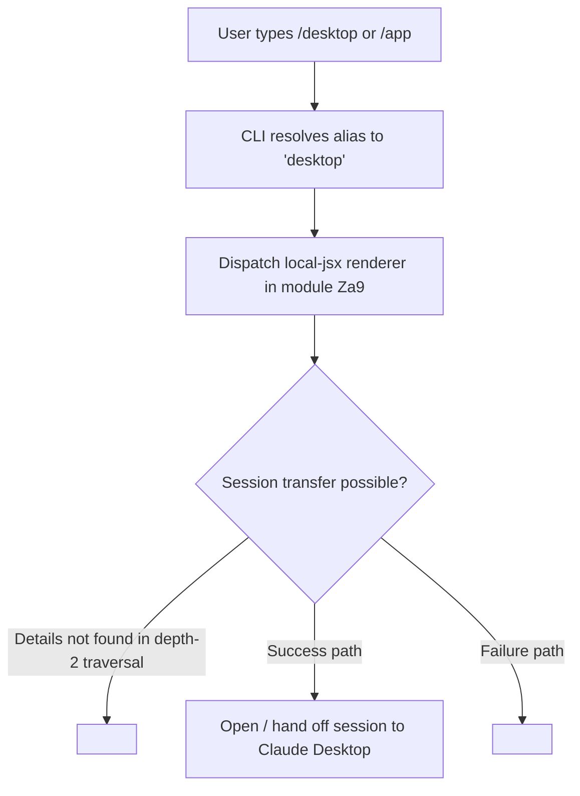

# `/desktop`

> Analysis basis: CC v2.1.133 bundle.js (AST extraction + Claude interpretation)
> Minimum version: v2.1.133

---

## Overview

The `/desktop` command (alias: `/app`) transfers the current Claude Code CLI session into the Claude Desktop application. It is a `local-jsx` command, meaning it renders a JSX component locally in the terminal rather than dispatching a request to the model. No input arguments, call-graph edges, or telemetry events were detected within a depth-2 traversal of its implementation.

---

## Registration

| Field | Value |
|---|---|
| type | `local-jsx` |
| name | `desktop` |
| description | `Continue the current session in Claude Desktop` |
| aliases | `["app"]` |
| module\_id | `Za9` |

Analysis basis: CC v2.1.133 bundle.js:+9865329

---

## Input Branching

Because the depth-2 call-graph traversal returned no call edges and no literals, the command's branching logic cannot be reconstructed from the extracted data alone.



---

## Behavioral Spec

### Command Dispatch

```
function handleDesktopCommand(cliContext):
    # Alias normalisation: "app" is resolved to "desktop" before reaching here
    command = resolveAlias(cliContext.rawInput)   # "app" → "desktop"

    # Render a JSX component locally; no model round-trip is performed
    component = loadLocalJsxModule("Za9")
    renderInTerminal(component, cliContext)

    # Session hand-off logic
    # (internal details not found in depth-2 traversal; needs --depth 4)
    transferSessionToDesktopApp(cliContext.session)
```

Analysis basis: CC v2.1.133 bundle.js:+9865329

### Alias Resolution

```
ALIASES = ["app"]   # registered alongside primary name "desktop"

function resolveAlias(rawName):
    if rawName in ALIASES:
        return "desktop"
    return rawName
```

Analysis basis: CC v2.1.133 bundle.js:+9865329

---

## State & Side Effects

| Item | Detail |
|---|---|
| Telemetry | None detected in depth-2 traversal (`telemetry: []`) |
| Hook registration | <!-- TODO: not found in depth-2 traversal; needs --depth 4 --> |
| appState changes | <!-- TODO: not found in depth-2 traversal; needs --depth 4 --> |
| Sound | <!-- TODO: not found in depth-2 traversal; needs --depth 4 --> |
| Render type | `local-jsx` — component rendered in-terminal without a model request |
| Module | `Za9` (resolved at dispatch time) |

---

## Version History

| Version | Change |
|---|---|
| v2.1.133 | Initial analysis — command registered as `local-jsx`, alias `app` confirmed |

---

## Common Mistakes

1. **Using `/app` and expecting a different command**: `/app` is a registered alias for `/desktop`; both invoke exactly the same handler and produce identical behaviour.
2. **Expecting model output**: Because `type` is `local-jsx`, the command renders a local JSX component and does **not** send a prompt to the Claude model. No assistant response will appear in the conversation thread.
3. **Assuming additional arguments are accepted**: No argument literals or input-parsing edges were found in the depth-2 traversal. Passing extra tokens after `/desktop` may be silently ignored; confirmed behaviour requires a deeper traversal (`--depth 4`).
4. **Running the command outside an active session**: The description states the command continues "the current session" in Claude Desktop; invoking it before a session is established may produce undefined behaviour that is not captured in the current traversal data.

---

## Appendix — Identifier Mapping

> For bundle debugging only. Identifiers change across versions.

| Identifier | Role |
|---|---|
| `F67` | Top-level implementation function for the `/desktop` command (local-jsx renderer entry point, module `Za9`) |