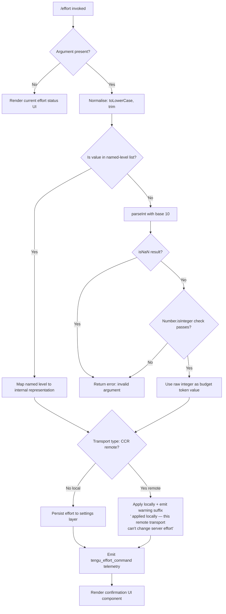

# `/effort`

> Analysis basis: CC v2.1.143 bundle.js (AST extraction + Claude interpretation)
> Minimum version: v2.1.143

---

## Overview

The `/effort` command sets the reasoning effort level that Claude Code uses when invoking the underlying model. It accepts one of six named levels (`low`, `medium`, `high`, `xhigh`, `max`, `auto`) or a raw integer budget token value, validates the input against a set of allowed named levels plus a numeric range, then persists the choice to settings and reflects it in the UI. In thin-client (remote) mode the change is applied locally only and a warning is displayed to the user.

---

## Registration

| Field | Value |
|---|---|
| type | `local-jsx` |
| name | `effort` |
| description | Set effort level for model usage |
| argumentHint | `[low\|medium\|high\|xhigh\|max\|auto]` |
| thinClientDispatch | `control-request` |
| module_id | `UEq` |

Analysis basis: CC v2.1.143 bundle.js:+11691417

---

## Input Branching

The command entry point reads the raw argument string, normalises it, then routes through one of three major paths: no argument (query current state), a recognised named level, or a raw integer token budget.



Analysis basis: CC v2.1.143 bundle.js:+11682018, +11682030, +4448146, +4448165, +4449586, +11680978

---

## Behavioral Spec

### Argument Parsing and Validation

```
NAMED_LEVELS = ["low", "medium", "high", "xhigh", "max", "auto", "unset"]

function parseEffortArgument(rawInput):
    if rawInput is absent or empty:
        return { action: "query" }

    normalised = String(rawInput).toLowerCase().trim()

    if isInNamedLevelList(normalised, NAMED_LEVELS):
        return { action: "set", kind: "named", value: normalised }

    parsed = parseInt(normalised, 10)   // radix 10
    if isNaN(parsed):
        return { action: "error", reason: "invalid_argument" }
    if not Number.isInteger(parsed):
        return { action: "error", reason: "not_integer" }

    return { action: "set", kind: "numeric", value: parsed }
```

Analysis basis: CC v2.1.143 bundle.js:+4448097, +4448124, +4448146, +4448165, +4449586, +4448425, +4448453

Named levels recognised (from literals):

| Token | Internal meaning |
|---|---|
| `low` | Quick, straightforward implementation with minimal overhead |
| `medium` | Balanced approach with standard implementation and testing |
| `high` | Comprehensive implementation with extensive testing and documentation |
| `xhigh` | Extended high effort (maps to `xhigh_effort` profile) |
| `max` | Maximum capability with deepest reasoning |
| `auto` | Delegates effort selection to the model |
| `unset` | Removes any previously set effort override |

Analysis basis: CC v2.1.143 bundle.js:+4449711, +4449723, +4449789, +4449804, +4449882, +4450046, +4448425, +4448453, +4448682, +4450385, +4450399

### Named-Level to Model Profile Resolution

The resolver maps named effort levels to concrete model identifiers. The set of eligible models is checked via an `includes` membership test against a curated list of model ID strings. The list of known models referenced in the implementation is:

- `claude-3-*` family (prefix match)
- `claude-opus-4-0`, `claude-opus-4-1`, `claude-opus-4-5`, `claude-opus-4-6`, `claude-opus-4-7`
- `claude-sonnet-4-0`, `claude-sonnet-4-5`, `claude-sonnet-4-6`
- `claude-haiku-4-5`

Additionally, `opus-4-7` appears as a short-form alias.

Analysis basis: CC v2.1.143 bundle.js:+4447008, +4447026, +4447049, +4447072, +4447097, +4447122, +4447157, +4447180, +4447203, +4448509, +4447403

The resolver also checks whether the model is served through an `application-inference-profile` (AWS Bedrock cross-region inference profile), and branches on the API provider type:

```
PROVIDER_TYPES = ["firstParty", "anthropicAws", "foundry", "mantle", "gateway"]

function resolveEffortProfile(namedLevel, modelId, providerType):
    if modelIsEligibleForEffort(modelId):
        if namedLevel == "max" or namedLevel == "xhigh":
            profile = selectHighCapabilityProfile(modelId, providerType)
        else:
            profile = buildStandardEffortProfile(namedLevel, modelId)
    else:
        profile = { effortLevel: namedLevel, budgetTokens: null }
    return profile
```

Analysis basis: CC v2.1.143 bundle.js:+2160101, +2160124, +2160133, +2160144, +2021257, +2021274, +2021292, +2021312, +2021327, +2021341, +4447276, +4447630

### CCR (Remote Transport) Detection and Local-Only Warning

When the active session transport is identified as `ccr` (the Claude Code Remote thin-client), the effort change cannot be propagated to the server. The command still applies the setting locally and appends the literal warning string to its output message.

```
REMOTE_TRANSPORT_ID = "ccr"
REMOTE_WARNING_SUFFIX = " (applied locally — this remote transport can't change server effort)"
LOCAL_ONLY_SUFFIX    = " (this session only)"

function applyEffortWithTransportCheck(effortValue, transportType):
    if transportType == REMOTE_TRANSPORT_ID:
        applyEffortLocalOnly(effortValue)
        return buildMessage(effortValue) + REMOTE_WARNING_SUFFIX
    else:
        persistEffortToSettings(effortValue)
        return buildMessage(effortValue) + LOCAL_ONLY_SUFFIX
```

Analysis basis: CC v2.1.143 bundle.js:+4446448, +11680978, +11681931

### Settings Persistence

Effort is written via the layered settings system. The call graph shows the command passes through the settings orchestrator, which reads and writes `settings.json` and `settings.local.json` inside the `.claude` directory. Config writes use a file-level lock to prevent concurrent corruption.

```
SETTINGS_DIR         = ".claude"
SHARED_SETTINGS_FILE = "settings.json"
LOCAL_SETTINGS_FILE  = "settings.local.json"
LOCK_TIMEOUT_MS      = 60000

function persistEffortToSettings(effortValue):
    acquireFileLock(LOCK_TIMEOUT_MS)          // warns if contention detected
    currentConfig = readConfigFromDisk()
    if currentConfig is missing auth that cache has:
        emitTelemetry("tengu_config_auth_loss_prevented")
        releaseLock()
        return error("refusing to write to avoid wiping config")
    mergedConfig = merge(currentConfig, { effort: effortValue })
    writeConfigAtomically(mergedConfig)       // write to temp, rename
    releaseLock()
```

Analysis basis: CC v2.1.143 bundle.js:+1197610, +1197620, +1197682, +3162978, +3162624, +3159506

### UI Rendering (JSX Component)

The command type is `local-jsx`, meaning it returns a React element. The rendered component displays two fields:

- **current** — the effort level presently active before this command ran
- **status** — the result of applying the new level (confirmation text or error)

```
function renderEffortCommandResult(currentLevel, newLevel, warningText):
    element = createElement(EffortStatusComponent, {
        fields: [
            { label: "current", value: currentLevel },
            { label: "status",  value: buildStatusText(newLevel, warningText) }
        ]
    })
    return element
```

Analysis basis: CC v2.1.143 bundle.js:+11689807, +11689824, +11689845, +11689860, +11689876

### `apply_flag_settings` Integration

The implementation calls an internal function labelled `apply_flag_settings` after writing the effort value. This reconciles any flag-based overrides (policy settings, flag settings, user settings, project settings, local settings) with the newly written value so that the resolved effective effort is consistent across all settings layers.

```
SETTINGS_LAYERS = [
    "policySettings",
    "flagSettings",
    "userSettings",
    "projectSettings",
    "localSettings"
]

function applyFlagSettings(layers):
    for each layer in SETTINGS_LAYERS (priority order):
        mergeInto(effectiveSettings, layers[layer])
    return effectiveSettings
```

Analysis basis: CC v2.1.143 bundle.js:+11681101, +1206298, +1206320, +1206856, +1206971, +1206994

---

## State & Side Effects

| Item | Detail |
|---|---|
| Telemetry — primary | `tengu_effort_command` emitted on every set action (bundle.js:+11682311) |
| Telemetry — config lock contention | `tengu_config_lock_contention` emitted when file lock is slower than expected (bundle.js:+3162297) |
| Telemetry — stale write | `tengu_config_stale_write` emitted when a stale config write is detected (bundle.js:+3162433) |
| Telemetry — auth loss prevented | `tengu_config_auth_loss_prevented` emitted when write is blocked to protect credentials (bundle.js:+3162776) |
| Telemetry — config parse error | `tengu_config_parse_error` emitted when config file cannot be parsed from disk (bundle.js:+3164878) |
| Telemetry — model profile | `tengu_slate_finch` emitted during model/profile resolution (bundle.js:+4450169) |
| Settings written | `effort` key written to `.claude/settings.json` or `.claude/settings.local.json` depending on scope |
| File lock | A file-level lock with a 60 000 ms timeout is acquired before writing config (bundle.js:+3162978) |
| Config backup | Up to 5 rolling backup files with `.backup.` prefix are maintained; max backup file size 384 bytes (bundle.js:+3163227, +3163509) |
| Event emitter | `Gl.emit` is called with `growthbook_experiment` / `GrowthbookExperimentEvent` during profile resolution, indicating GrowthBook experiment tracking (bundle.js:+3136119, +3135738, +3136165) |
| Session scope | The `(this session only)` suffix is appended to confirmation when the setting is session-scoped rather than persisted globally (bundle.js:+11681931) |
| Sound | <!-- TODO: not found in depth-2 traversal; needs --depth 4 --> |
| appState changes | Effort level reflected in the active model configuration; resolved through the multi-layer settings merge described above |

---

## Version History

| Version | Change |
|---|---|
| v2.1.143 | Initial analysis |

---

## Common Mistakes

1. **Passing a float instead of an integer**: `parseInt` is used with radix 10, and `Number.isInteger` is subsequently verified. A value like `3.5` will parse to `3` (integer) and be accepted; however a string like `"3.5"` will parse to `3` via `parseInt`, so the decimal part is silently truncated. Users intending a specific budget token count should pass a whole number.

2. **Expecting the change to propagate to the server in CCR mode**: When connected through the thin-client remote transport (`ccr`), the effort setting is applied locally only. The command output will include the warning suffix. Server-side effort must be configured on the server independently.

3. **Mixing up `max` and `xhigh`**: Both represent very high effort tiers but map to distinct internal profiles (`max_effort` vs `xhigh_effort`). Choosing `max` selects the deepest reasoning profile; `xhigh` selects the extended-high profile, which may use a different model routing path.

4. **Assuming `auto` and `unset` are equivalent**: `auto` instructs the model to choose its own reasoning effort dynamically, while `unset` removes any effort override and falls back to the system default, which may be a fixed level rather than model-selected.

5. **Running `/effort` while another Claude instance writes config**: The file lock has a 60 000 ms timeout and emits a telemetry warning on contention. Concurrent writes from two Claude processes can trigger a stale-write rejection to protect credentials (GH #3117 guard). If this occurs, retry after the other session finishes.

6. **Omitting the argument to set effort**: Invoking `/effort` with no argument renders the current status UI rather than modifying any setting. This is the query path, not the set path.

---

## Appendix — Identifier Mapping

> For bundle debugging only. Identifiers change across versions.

| Identifier | Role |
|---|---|
| `oP8` | Top-level effort command handler (entry point) |
| `Z$` | Current effort state reader |
| `BjH` | Effort state accessor helper |
| `bBH` | Effort value normaliser / validator |
| `WC` | Named-level and numeric argument parser |
| `RQ9` | Integer validation helper (calls `Number.isInteger`) |
| `z1H` | Named-level membership checker (calls `Og.includes`) |
| `sE` | Effort application orchestrator (routes to persistence or session-only) |
| `S3H` | Settings-layer effort writer |
| `QX` | Model eligibility resolver (checks model ID list) |
| `xH` | String conversion utility |
| `G1` | API provider type resolver (firstParty / anthropicAws / foundry / mantle / gateway) |
| `A` | Model ID list (lowercase comparison source) |
| `Fy` | First-party model profile builder |
| `hw` | Alternative/cloud model profile builder |
| `Ee6` | Effort entry writer for current conversation |
| `N6` | Config write helper (timestamps, lock) |
| `Ze6` | Effort state updater for `xhigh` / `high` paths |
| `ZM6` | `max_effort` profile setter |
| `VM6` | `xhigh_effort` profile setter |
| `_TH` | Named-level list validator (second reference) |
| `Vf_` | Post-apply side-effect dispatcher (telemetry + GrowthBook) |
| `neL` | GrowthBook event name formatter |
| `JAH` | Subscription / plan type resolver |
| `fq` | Plan-type lookup (pro tier check) |
| `Cl8` | Plan constant — pro |
| `Rl8` | Plan constant helper |
| `Uw` | API key / helper resolver |
| `G6` | Model telemetry emitter (`tengu_slate_finch`) |
| `m76` | Telemetry metadata builder |
| `p76` | Telemetry field extractor |
| `Ts` | Telemetry event dispatcher |
| `jF` | Event emitter wrapper |
| `Ci6` | GrowthBook experiment tracker |
| `lA_` | Experiment event constructor |
| `eA_` | Experiment result recorder |
| `aP8` | JSX render function for effort command output |
| `H` | String utility / random helper |
| `hS7` | Effort set-action handler (called from render path) |
| `pEq` | Current effort resolver for display |
| `oN` | Effort state reader (secondary, for CCR note) |
| `vM6` | Config persistence coordinator |
| `h3H` | Config directory path builder |
| `p_` | Settings load/save orchestrator |
| `wO` | Settings file locator |
| `x6` | File existence checker |
| `lm8` | Settings file reader |
| `WB` | Settings object merger |
| `AP` | Atomic config writer |
| `$8` | ENOENT error handler |
| `v` | Logger / debug output |
| `nu8` | Timestamp recorder (calls `Date.now`) |
| `XXH` | Config write-back helper |
| `yA6` | Atomic file write with temp-rename |
| `hH` | JSON serialiser (`JSON.stringify`) |
| `hz` | Cache invalidator |
| `VR6` | Append/write log helper |
| `hy` | `.claude` path joiner |
| `__` | Global config accessor |
| `Lu` | Settings load orchestrator (emits `loadSettingsFromDisk_start/end`) |
| `NH` | Error logger |
| `a6` | Global config save orchestrator |
| `P9_` | Config file writer with lock and backup rotation |
| `emH` | Config cache updater |
| `OZ9` | Config entry enumerator (`Object.entries`) |
| `HpH` | Lock heartbeat / timestamp checker |
| `H$H` | Config file reader with backup fallback |
| `d76` | Config diff/merge helper |
| `d` | Utility / debug helper |
| `j9_` | Config backup writer |
| `SS7` | Full effort set flow (validation → persist → render) |
| `iS7` | JSX component constructor for effort status display |