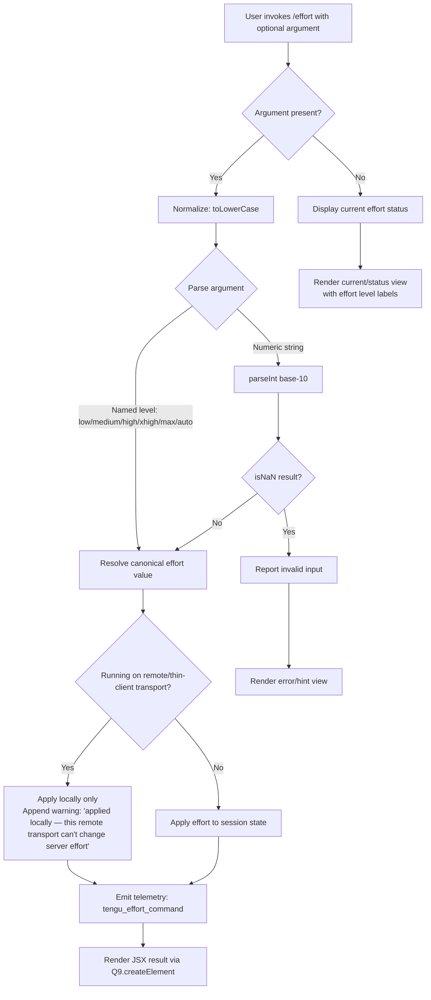

# `/effort`

> Analysis basis: CC v2.1.143 bundle.js (AST extraction + Claude interpretation)
> Minimum version: v2.1.143

---

## Overview

The `/effort` command sets the effort level used by the model during a Claude Code session, controlling the depth and thoroughness of reasoning and implementation. It accepts a named tier (`low`, `medium`, `high`, `xhigh`, `max`, or `auto`) or resolves the value automatically, then applies that setting to the active session state. When running over a remote (thin-client) transport, the setting is applied locally only, as the transport layer cannot propagate effort changes to the server.

---

## Registration

| Field | Value |
|---|---|
| type | `local-jsx` |
| name | `effort` |
| description | Set effort level for model usage |
| argumentHint | `[low\|medium\|high\|xhigh\|max\|auto]` |
| thinClientDispatch | `control-request` |
| module_id | `UEq` |

Analysis basis: CC v2.1.143 bundle.js:+11691417

---

## Input Branching

The command entry point normalises the raw argument string, resolves it to a canonical effort value, then dispatches to one of three outcome paths: display current status, apply a valid level, or report an invalid input.



Analysis basis: CC v2.1.143 bundle.js:+11682018, +11682673, +11682733, +11682844, +11689807

---

## Behavioral Spec

### Argument Normalisation

```
function normaliseArgument(rawArg):
    if rawArg is absent or empty:
        return QUERY_CURRENT          # triggers status display path
    normalised = rawArg.toLowerCase()
    return normalised
```

Analysis basis: CC v2.1.143 bundle.js:+11682673

---

### Effort Value Resolution

The resolver accepts both named string tiers and numeric strings. Numeric parsing uses base-10 `parseInt`; the result is rejected (treated as invalid) when `isNaN` returns true.

```
NAMED_LEVELS = ["low", "medium", "high", "xhigh", "max", "auto"]
UNSET_SENTINEL = "unset"

function resolveEffortValue(normalisedArg):
    if normalisedArg equals "auto":
        return AUTO_VALUE             # runtime-determined effort
    if normalisedArg is in NAMED_LEVELS:
        return normalisedArg
    numeric = parseInt(normalisedArg, 10)
    if isNaN(numeric):
        return INVALID
    return numeric
```

Analysis basis: CC v2.1.143 bundle.js:+4448453, +4448425, +4448146, +4448157, +4448165

---

### Effort Level Descriptors

Each named tier has a fixed human-readable description used in the status and confirmation UI:

| Level | Description |
|---|---|
| `low` | Quick, straightforward implementation with minimal overhead |
| `medium` | Balanced approach with standard implementation and testing |
| `high` | Comprehensive implementation with extensive testing and documentation |
| `xhigh` | <!-- TODO: not found in depth-2 traversal; needs --depth 4 --> |
| `max` | Maximum capability with deepest reasoning |
| `auto` | Runtime-determined; resolved dynamically |

Analysis basis: CC v2.1.143 bundle.js:+4449711, +4449723, +4449789, +4449804, +4449882, +4450046, +4448682, +4448703, +4448717

---

### Session State Application

```
function applyEffortToSession(resolvedValue, sessionContext):
    if sessionContext.transportType equals "ccr":
        # Remote/thin-client transport detected
        suffix = " (applied locally — this remote transport can't change server effort)"
        applyLocally(resolvedValue)
    else:
        applyLocally(resolvedValue)
        suffix = " (this session only)"

    updateUserSettings("userSettings", resolvedValue)
    emitTelemetry("tengu_effort_command")
    return buildConfirmationMessage(resolvedValue, suffix)
```

Analysis basis: CC v2.1.143 bundle.js:+4446448, +11680978, +11681931, +4449054, +11682311

---

### Flag Settings Propagation

After the effort value is written to session state, an `apply_flag_settings` action is dispatched to synchronise all flag-gated settings (including the newly set effort level) with the running session.

```
function propagateFlagSettings(sessionDispatch):
    sessionDispatch(action = "apply_flag_settings")
```

Analysis basis: CC v2.1.143 bundle.js:+11681101

---

### Status Display (No Argument)

When the command is invoked with no argument, the implementation inspects the two display modes registered in the `e7H` list and renders the current effort state.

```
function renderEffortStatus(effortState, displayContext):
    if displayContext is in KNOWN_DISPLAY_MODES:      # e7H.includes check
        show = selectDisplayVariant("current", "status")
        render JSX with:
            current effort level label
            description string for that level
    else:
        render fallback status text
```

Analysis basis: CC v2.1.143 bundle.js:+11689807, +11689845, +11689860, +11689876

---

### Pro-Tier Gate

The `max` effort level (and the deepest reasoning path) checks whether the active account is on the `pro` tier before unlocking the capability. The check is performed via the feature-flag registry (`sMH.has` / `PF.has` / `PF.get`).

```
function checkProGate(featureFlagRegistry, accountContext):
    if accountContext.tier equals "pro":
        return GATE_OPEN
    return GATE_CLOSED
```

Analysis basis: CC v2.1.143 bundle.js:+2928892, +3142184, +3142221, +3142238

---

### Randomised Delay (Render Scheduling)

The JSX render for the effort result uses a randomised `setTimeout` (seeded with `Math.random`, constant multiplier `2`) to stagger UI updates and avoid render collisions.

```
function scheduleRender(renderCallback):
    delay = Math.floor(Math.random() * 2)   # multiplier = 2
    setTimeout(renderCallback, delay)
```

Analysis basis: CC v2.1.143 bundle.js:+12638154, +12638156, +12638193

---

### Telemetry Emission — `tengu_slate_finch`

A secondary telemetry event (`tengu_slate_finch`) is fired from within the feature-flag lookup path (`G6` → `Vf_`), indicating that a flag-gated capability check was evaluated as part of the effort resolution.

```
function emitFlagCheckTelemetry():
    emit("tengu_slate_finch")
```

Analysis basis: CC v2.1.143 bundle.js:+4450169

---

## State & Side Effects

| Item | Detail |
|---|---|
| Telemetry | `tengu_effort_command` (bundle.js:+11682311); `tengu_slate_finch` (bundle.js:+4450169) |
| Hook registration | `thinClientDispatch: "control-request"` — command is forwarded as a control request in remote sessions |
| appState changes | `userSettings` key updated with the resolved effort value; `apply_flag_settings` action dispatched to propagate to session |
| Transport caveat | When transport type is `"ccr"`, effort change is local-only; server effort is unchanged |
| Sound | <!-- TODO: not found in depth-2 traversal; needs --depth 4 --> |

---

## Version History

| Version | Change |
|---|---|
| v2.1.143 | Initial analysis |

---

## Common Mistakes

1. **Passing a bare integer** — numeric strings are accepted via `parseInt` base-10, but any value that fails `isNaN` validation (e.g. `"1.5x"`, `"high2"`) is treated as invalid and no effort change is applied.
2. **Expecting server-side effect on remote sessions** — when Claude Code is connected via the `ccr` remote transport, `/effort` only updates the local client state; the server-side effort remains unchanged, and the confirmation message will contain the caveat suffix.
3. **Assuming `max` is always available** — the `max` tier is gated behind a `pro` account check through the feature-flag registry. Invoking `/effort max` on a non-pro account will not activate maximum reasoning depth.
4. **Omitting the argument to set effort** — invoking `/effort` with no argument does not toggle or cycle effort levels; it renders the current effort status view instead.
5. **Expecting `xhigh` description in UI** — while `xhigh` is a recognised argument hint, its human-readable description string was not reachable at depth-2 traversal; behaviour may differ from the other named tiers in confirmation output.

---

## Appendix — Identifier Mapping

> For bundle debugging only. Identifiers change across versions.

| Identifier | Role |
|---|---|
| `oP8` | Command entry point / top-level handler |
| `Z$` | Session state reader / getter |
| `BjH` | State field accessor (called from session state reader) |
| `bBH` | Session state writer / setter |
| `WC` | Effort value resolver (handles named levels, numeric parse, isNaN check) |
| `sE` | Effort descriptor / label resolver |
| `S3H` | Effort-to-description mapping builder |
| `_TH` | Effort validation helper (calls valid-levels list) |
| `Vf_` | Feature-flag / pro-gate evaluator |
| `neL` | Flag lookup initialiser |
| `JAH` | Pro-tier gate check |
| `G6` | Feature-flag registry query (has/get/add operations) |
| `aP8` | JSX render coordinator / main render function |
| `H` | Randomised render scheduler (Math.random + setTimeout) |
| `hS7` | Effort application dispatcher (apply + telemetry) |
| `pEq` | Transport-type inspector (detects ccr remote transport) |
| `vM6` | userSettings update helper |
| `d` | Session dispatch / action emitter |
| `z1H` | Valid effort levels list checker (Og.includes) |
| `SS7` | Non-remote effort application path |
| `h3H` | State initialiser / default state builder |
| `oN` | State reader with ccr transport annotation |
| `iS7` | Status display renderer (e7H.includes + Q9.createElement) |