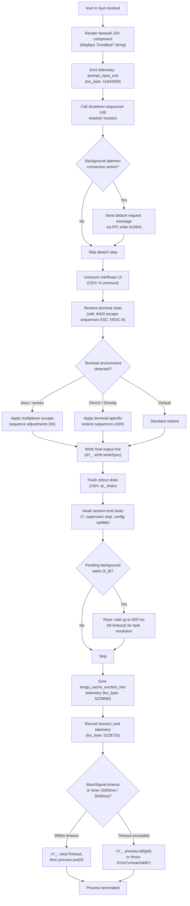

# `/exit`

> Analysis basis: CC v2.1.143 bundle.js (AST extraction + Claude interpretation)
> Minimum version: v2.1.143

---

## Overview

The `/exit` command (also aliased as `/quit`) terminates the Claude Code CLI session. When invoked, it triggers an immediate, graceful shutdown sequence: it renders a farewell message ("Goodbye!"), flushes pending I/O, finalises telemetry, tears down background daemon connections, and calls `process.exit`. The command is registered as a `local-jsx` type and executes immediately upon invocation without requiring further confirmation.

---

## Registration

| Field | Value |
|---|---|
| type | `local-jsx` |
| name | `exit` |
| description | `null` |
| aliases | `["quit"]` |
| immediate | `true` |
| module_id | `bTq` |
| load_inline | `true` |
| loc_byte | `11643921` |
| loc_byte_end | `11644082` |
| loc_line | `7224` |
| arbor_handler.name | `gy7` |
| arbor_handler.fqn | `claude-2.1.143::gy7` |
| arbor_handler.kind | `AsyncFunction` |
| arbor_handler.resolution_path | `module_id` |
| arbor_handler.n_hits | `1` |

Analysis basis: CC v2.1.143 bundle.js:+11643921

---

## Input Branching

The `/exit` handler has more than three distinct execution paths (normal exit, background-daemon interaction, terminal-type branching, process kill/graceful paths). A flowchart is used.



Analysis basis: CC v2.1.143 bundle.js:+11643171, +11643187, +11643204, +11643248, +5229337, +5229616, +5229665, +5229725

---

## Behavioral Spec

### 1. Handler Entry — `exitCommandHandler` (`gy7`)

```
async function exitCommandHandler(context):
    // 1. Acquire app state reference (T1 → cB)
    appState = getAppState()

    // 2. Trigger random animation tick (H: Math.random, setTimeout)
    scheduleRandomAnimationTick()

    // 3. Issue detach-request to background daemon IPC if active (fLH)
    sendDetachRequest(appState)
        // fLH calls: XF6 (IPC channel check), PKq (task state query),
        //            ri (IPC write with message type "detach-request"),
        //            z6H (IPC teardown)

    // 4. Get session configuration reference (rf)
    sessionConfig = getSessionConfig()

    // 5. Build and start scheduled-task drain (lD8)
    scheduledTaskDrainer = buildScheduledTaskDrainer(appState)
        // lD8 calls: ME (task registry), H.push, wz7 (cron parser),
        //            n1 (text layout helper)

    // 6. Render farewell JSX element
    farewell = uB_.createElement(FarewellComponent, {message: "Goodbye!"})
    // "Goodbye!" literal: bundle.js:+11643135

    // 7. Run shutdown sequencer (x9) passing farewell element
    await runShutdownSequencer(farewell, sessionConfig)

    // 8. Emit prompt_input_exit telemetry marker
    emitTelemetry("prompt_input_exit")
    // literal: bundle.js:+11643359
```

Analysis basis: CC v2.1.143 bundle.js:+11643171 – +11643354

---

### 2. Shutdown Sequencer — `shutdownSequencer` (`x9`)

```
async function shutdownSequencer(farewellElement, config):
    // Phase 1 — resolve initial promises
    await Promise.resolve()
    eL_check()          // eL: pre-exit check/lock
    K_resolve()         // K: session key resolution

    // Phase 2 — set unmount timeout
    timer = setTimeout(forcedKillCallback, Math.max(5000, 3500))
    // 5000ms / 3500ms literals: bundle.js:+5229354, +5229361
    HzH.unref(timer)    // prevent timer from blocking Node event loop

    // Phase 3 — perform UI teardown (CEH)
    performUITeardown()
        // CEH: eOH.writeSync (flush), X4.get (terminal handle),
        //      H.unmount (Ink unmount), qS (cursor restore),
        //      za6 (terminal state restore)

    // Phase 4 — write shutdown output (dY_)
    writeShutdownOutput()
        // dY_: EV (env check), sh (shell type), V6, hO6, g3 (path checks),
        //      _.replaceAll (escape "\" → "\\", '"' → '\"'),
        //      W91 (output formatter),
        //      eOH.writeSync (final write),
        //      M6.dim (dim formatting)

    // Phase 5 — forced-kill callback definition (cY_)
    function forcedKillCallback():
        clearTimeout(timer)
        pid = X4.get("pid")
        process.exit(0)          // normal path
        // OR process.kill(pid)  // if exit stalls
        // OR throw Error("unreachable")
        // "unreachable" literal: bundle.js:+5227942

    // Phase 6 — drain stdout (XSH)
    await at_.drain()
    // bundle.js:+57020

    // Phase 7 — race session teardown vs timeout (Y, Promise.race)
    await Promise.race([
        runSessionTeardown(),    // Y
        AbortSignal.timeout(5000)
    ])

    // Phase 8 — wait for background tasks (k_8, Promise.all / Promise.race)
    await waitForBackgroundTasks(timeout=500)
    // 500ms literal: bundle.js:+5228946

    // Phase 9 — emit cache eviction hint telemetry
    emit("tengu_cache_eviction_hint")
    // bundle.js:+5229690

    // Phase 10 — emit session_end telemetry
    emit("session_end")
    // "session_end" literal: bundle.js:+5229725

    // Phase 11 — final stdout flush
    eOH.writeSync(...)
    // bundle.js:+5229794
```

Analysis basis: CC v2.1.143 bundle.js:+5229257 – +5229794

---

### 3. UI Teardown — `performUITeardown` (`CEH`)

```
function performUITeardown():
    // Flush any buffered terminal output
    eOH.writeSync(buffer)

    // Retrieve terminal handle from registry
    handle = X4.get(terminalKey)

    // Unmount the Ink/React component tree
    handle.unmount()

    // Restore cursor and viewport
    qS()     // cursor restore sequence

    // Restore saved terminal state
    za6(handle)
```

`za6` emits ANSI save/restore escape sequences (`ESC 7` / `ESC 8`, literals at bundle.js:+3666220 and +3666231) and applies terminal-specific adjustments:

- **tmux** (`"tmux"` literal, bundle.js:+3324188): applies `ESC ESC` prefix adjustments via `h0`.
- **screen** (`"screen"` literal, bundle.js:+3324261): similar multiplexer handling.
- **Ghostty ≥ 1.2.0** (`"ghostty"` / `"1.2.0"`, bundle.js:+3400011, +3400041): calls `n0H` with terminal-specific logic, using `Ly9.coerce` for version comparison.
- **iTerm.app ≥ 3.6.6** (`"iTerm.app"` / `"3.6.6"`, bundle.js:+3400080, +3400112): similar version-gated path.

Analysis basis: CC v2.1.143 bundle.js:+5227192 – +5227358, +3666087 – +3666290

---

### 4. Session Teardown — `runSessionTeardown` (`Y`)

```
async function runSessionTeardown():
    // Write supervisor stop command
    q.write("supervisor")
    // "supervisor" literal: bundle.js:+14516324

    // Emit session stats (XJH: session data aggregation)
    sessionData = aggregateSessionData()
        // XJH: d1 (store lookup via znL.getStore),
        //      L8 (session timer),
        //      eF_ → tF_ (finalizer),
        //      XH, A1 (string helpers),
        //      Object.keys, K.has

    // Emit session cost summary (cIq)
    emitCostSummary(sessionData)
        // cIq: Object.keys, Math.max, D3 (formatter)

    // Stop all active spinners/timers
    f.get() / T.stop()
    f.delete()
    Z.stop()

    // Update persisted config with session-end state
    Z.updateConfig(sessionData)

    // Restart relevant supervisors for next session init
    Z.start()

    // Fire heartbeat expiry (G_K → Zs)
    expireHeartbeat()
    // "heartbeat" literal: bundle.js:+14515546

    // Store final session record
    f.set(finalRecord)
    V.start()

    // Emit daemon config reload telemetry (d)
    emit("tengu_daemon_config_reload")
    // bundle.js:+14517117
```

Analysis basis: CC v2.1.143 bundle.js:+14516299 – +14517115

---

### 5. Detach-Request to Background Daemon — `sendDetachRequest` (`fLH`)

```
function sendDetachRequest(appState):
    // Check if IPC channel is open (XF6)
    if not ipcChannelOpen():
        return

    // Query pending task count (PKq → bDH, N8)
    pendingTasks = queryPendingTasks()
    // Initial task count value: 0 (bundle.js:+10113079)
    // Task type label: "task" (bundle.js:+10113123)

    // Write detach-request message over IPC (ri → ii.write, hH → JSON.stringify)
    ipcWrite({ type: "detach-request" })
    // "detach-request" literal: bundle.js:+10118455

    // Teardown IPC channel (z6H)
    teardownIPCChannel()
```

Analysis basis: CC v2.1.143 bundle.js:+10118421 – +10118501

---

### 6. Background Task Drain — `buildScheduledTaskDrainer` (`lD8`)

```
function buildScheduledTaskDrainer(appState):
    // Register task in task registry (ME → GV)
    taskId = registerTask()

    // Push task to active queue (H.push)
    taskQueue.push(taskId)

    // Build cron/schedule parser (wz7)
    // wz7 uses: HZ (cron expression parser), SI (schedule interpreter),
    //           GFH (time-slot calculator), Math.max, A.getTime, Date.now,
    //           Hq (time formatter: Math.floor, Math.round)
    scheduler = buildCronParser("scheduled task")
    // "scheduled task" literal: bundle.js:+10112042

    // Attach text layout helper for display (n1)
    // n1 uses: H.indexOf, H.substring, M8 (Bun.stringWidth), o9 (display width helper)
    layoutHelper = buildTextLayout()

    return { taskId, scheduler, layoutHelper }
```

Analysis basis: CC v2.1.143 bundle.js:+10112023 – +10112084

---

### 7. Forced Kill Callback — `forcedKillCallback` (`cY_`)

```
function forcedKillCallback():
    clearTimeout(pendingTimer)

    pid = X4.get("pid")    // retrieve current process PID

    if normalExitPath:
        process.exit(0)
        // bundle.js:+5227869
    else if stalled:
        process.kill(pid)
        // bundle.js:+5227894
    else:
        throw Error("unreachable")
        // "unreachable" literal: bundle.js:+5227942
```

Analysis basis: CC v2.1.143 bundle.js:+5227788 – +5227936

---

## State & Side Effects

| Item | Detail |
|---|---|
| Telemetry (direct) | `prompt_input_exit` (bundle.js:+11643359), `session_end` (bundle.js:+5229725), `tengu_cache_eviction_hint` (bundle.js:+5229690) |
| Telemetry (via call graph) | `tengu_bg_dispatch_sigkill_escalate` (+14503217), `tengu_bg_dispatch_low_mem` (+14503796), `tengu_bg_spare_enable` (+14504411), `tengu_bg_spare_claim` (+14504532), `tengu_bg_spare_claim_fail` (+14504795), `tengu_bg_spare_spawn` (+14502994), `tengu_daemon_config_reload` (+14517117), `tengu_startup_perf` (+211017), `tengu_scroll_summary` (+5228657), `tengu_amber_creek` (+3332572), `tengu_pewter_brook` (+3332480) |
| UI teardown | Unmounts Ink/React component tree via `H.unmount`; restores cursor and terminal viewport state |
| Terminal state | Emits ANSI `ESC 7` / `ESC 8` save/restore sequences; applies tmux, screen, Ghostty, and iTerm2 specific sequences |
| IPC / Daemon | Sends `"detach-request"` message over daemon IPC channel, then closes the channel |
| Background tasks | Races remaining background tasks against a 500 ms timeout before proceeding |
| Process lifecycle | Calls `process.exit(0)` on the normal path; escalates to `process.kill(pid)` if the process stalls before the 5000 ms / 3500 ms forced-kill deadline |
| Supervisor | Stops active supervisors, updates persisted config, restarts supervisors for next session |
| Sound | <!-- TODO: not found in depth-2 traversal; needs --depth 4 --> |
| appState changes | Session timer stopped; session record finalised and stored; heartbeat expired |
| Hook registration | No hook registration detected in depth-2 traversal |

---

## Version History

| Version | Change |
|---|---|
| v2.1.143 | Initial analysis |

---

## Common Mistakes

1. **Expecting a confirmation prompt**: `/exit` is registered with `immediate: true`, meaning it fires without any confirmation dialog. Pressing `/exit` terminates the process immediately.
2. **Not using the alias**: `/quit` is a fully equivalent alias for `/exit` and produces identical behaviour.
3. **Killing the process externally before `/exit` completes**: The command requires up to ~5 seconds to complete its teardown sequence (flush, telemetry, supervisor shutdown). Sending `SIGKILL` externally before that window closes may result in incomplete telemetry or unsaved session state.
4. **Assuming synchronous exit**: The handler is an `AsyncFunction` (`arbor_handler.kind: "AsyncFunction"`). It awaits several async phases (IPC detach, stdout drain, session teardown, background task race) before `process.exit` is actually called.
5. **Confusing `/exit` with Ctrl+C**: Ctrl+C sends `SIGINT` and follows a different abort path; `/exit` follows the graceful teardown path described here.

---

## Appendix — Identifier Mapping

> For bundle debugging only. Identifiers change across versions.

| Identifier | Role |
|---|---|
| `gy7` | Main exit command handler (AsyncFunction; arbor_handler) |
| `T1` | App-state accessor |
| `cB` | App-state store / context object |
| `H` | Random animation tick scheduler (uses `Math.random`, `setTimeout`) |
| `fLH` | Detach-request sender to background daemon IPC |
| `XF6` | IPC channel open-state checker |
| `PKq` | Pending task count query |
| `bDH` | Task state backing store |
| `N8` | Task type / status resolver |
| `ri` | IPC write function (uses `ii.write`) |
| `hH` | JSON serialiser wrapper (uses `JSON.stringify`) |
| `z6H` | IPC channel teardown |
| `rf` | Session configuration accessor |
| `lD8` | Scheduled-task drainer builder |
| `ME` | Task registry registration |
| `GV` | Global registry / ID generator |
| `wz7` | Cron/schedule parser builder |
| `HZ` | Cron expression parser |
| `K` | Session key / cron field resolver |
| `w` | Background daemon process manager |
| `L` | Async task queue wrapper |
| `J` | Process group kill helper |
| `D` | Daemon process descriptor / cleanup |
| `$` | Resource disposal helper |
| `j` | Date/time calculation helper |
| `SI` | Schedule string interpreter |
| `O_4` | Schedule token splitter/parser |
| `A` | String normaliser / push accumulator |
| `GFH` | Time-slot calculator (Date method calls) |
| `_` | Generic utility object / replacer |
| `O` | Date mutation helper |
| `f` | Session record map / closer |
| `q` | File/socket cleanup helper |
| `Hq` | Time duration formatter (floor/round) |
| `n1` | Text layout / substring helper |
| `M8` | Terminal string-width calculator (uses `Bun.stringWidth`) |
| `o9` | Display-width helper |
| `dO` | Display offset helper |
| `Fy7` | Farewell component wrapper |
| `x9` | Shutdown sequencer (main async shutdown pipeline) |
| `CEH` | UI teardown executor (unmount + cursor restore) |
| `qS` | Cursor restore sequence emitter |
| `za6` | Terminal state restore (ANSI ESC-7/ESC-8) |
| `n0H` | Terminal-specific restore logic (Ghostty / iTerm2) |
| `d0H` | Additional terminal restore helper |
| `h0` | Multiplexer escape sequence adjuster (tmux/screen) |
| `xH` | String coercer |
| `dY_` | Final shutdown output writer |
| `EV` | Environment variable reader |
| `sh` | Shell type detector |
| `V6` | Path / value resolver |
| `hO6` | File-path existence checker |
| `CU` | Path canonicaliser |
| `__` | Path utility helper |
| `x6` | Path existence check |
| `g3` | Path + locale resolver |
| `KL` | Locale/encoding helper |
| `W91` | Output line formatter |
| `cY_` | Forced-kill callback (process.exit / process.kill) |
| `XSH` | Stdout drain awaiter (uses `at_.drain`) |
| `Y` | Session teardown runner |
| `XJH` | Session data aggregator |
| `d1` | Async-local-storage store getter |
| `L8` | Session timer |
| `eF_` | Session finaliser dispatcher |
| `XH` | String converter |
| `cIq` | Session cost summary emitter |
| `T` | Keyboard/input event stopper |
| `m` | Input event object |
| `c2` | User-settings accessor |
| `Z` | Supervisor manager (stop/updateConfig/start) |
| `G_K` | Heartbeat expiry trigger |
| `Zs` | Heartbeat state object |
| `V` | Post-session restart handler |
| `d` | Generic dispose / finalise function |
| `I66` | Startup-perf telemetry emitter |
| `wN8` | Performance measurement recorder |
| `px` | `perf_hooks` require wrapper |
| `e6A` | Startup profiling report builder |
| `q8A` | Profiling report formatter |
| `c8H` | Atomic file write helper (open/write/fsync/close) |
| `o6A` | Profiling checkpoint accumulator |
| `v` | Debug log / telemetry dispatcher |
| `N_8` | Scroll summary telemetry emitter |
| `X91` | Scroll state accessor |
| `P91` | Scroll position calculator (Date.now, Math.max/round) |
| `J91` | Scroll summary record builder |
| `rA` | Fullscreen / terminal-mode resolver |
| `VRH` | Terminal capability checker |
| `u1_` | Terminal mode string builder |
| `hl` | Terminal mode key builder |
| `x1_` | Terminal mode Boolean resolver |
| `R_` | Terminal render manager |
| `ybL` | Amber-creek telemetry emitter |
| `G6` | Pewter-brook / internal event emitter |
| `ieH` | Cache eviction hint emitter |
| `k_8` | Background task waiter (Promise.all/race) |
| `r8` | Timed promise wrapper (setTimeout / clearTimeout) |

---

Note: index built via Arbor fallback; some signals (telemetry, literals) may be missing — see arbor-fallback.js.