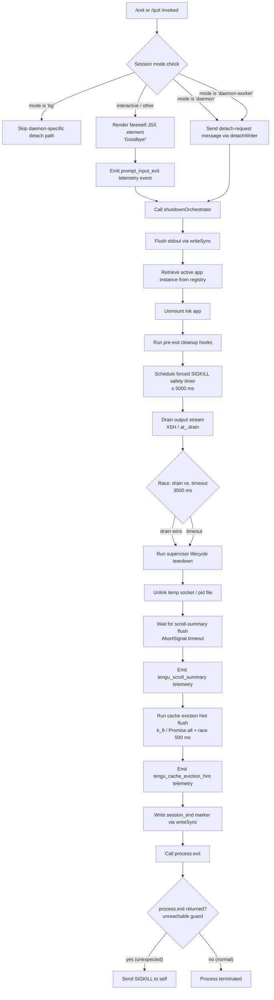

# `/exit`

> Analysis basis: CC v2.1.143 bundle.js (AST extraction + Claude interpretation)
> Minimum version: v2.1.143

---

## Overview

The `/exit` command (also aliased as `/quit`) terminates the Claude Code CLI session. When invoked, it immediately triggers a multi-phase shutdown sequence: displaying a farewell message, flushing any pending output, draining I/O streams, persisting session telemetry, and finally calling `process.exit`. Because the command is registered as `immediate`, no confirmation prompt is shown before shutdown begins.

---

## Registration

| Field | Value |
|---|---|
| type | `local-jsx` |
| name | `exit` |
| description | *(null — no description string registered)* |
| immediate | `true` |
| aliases | `["quit"]` |
| module\_id | `bTq` |

Analysis basis: CC v2.1.143 bundle.js:+11643921

---

## Input Branching

The command entry point (`commandHandler`) performs several checks before and during shutdown. The branching is best captured in the following flowchart.



Analysis basis: CC v2.1.143 bundle.js:+11643171 (entry), +11643354 (shutdown orchestrator call), +5229257 (shutdown orchestrator body), +5227869 (process.exit), +5227894 (SIGKILL fallback)

---

## Behavioral Spec

### 1. Command Entry — Handler Dispatch

```
function commandHandler(context):
    sessionMode = resolveSessionMode(context)   // reads "bg" / "daemon" / "daemon-worker"

    if sessionMode in ["daemon", "daemon-worker"]:
        sendDetachRequest(context)              // writes "detach-request" message
        return

    renderFarewellElement("Goodbye!")           // JSX, local-jsx type
    emitTelemetry("prompt_input_exit")
    shutdownOrchestrator(context)
```

Analysis basis: CC v2.1.143 bundle.js:+11643171, +11643183, +11643187, +11643248, +11643354, +11643359

---

### 2. Session Mode Resolution

```
function resolveSessionMode(context):
    // Checks literals "bg", "daemon", "daemon-worker" against runtime config
    mode = readRuntimeMode(context)
    return mode   // one of: "bg", "daemon", "daemon-worker", or other
```

Literal constants checked: `"bg"` (bundle.js:+2169283), `"daemon"` (bundle.js:+2169293), `"daemon-worker"` (bundle.js:+2169307).

Analysis basis: CC v2.1.143 bundle.js:+2169360

---

### 3. Farewell Rendering

```
function renderFarewellElement(text):
    // text == "Goodbye!"
    element = createJSXElement(text)
    // Rendered inline before shutdown begins; local-jsx type means it
    // is printed directly to the terminal output stream.
    return element
```

Farewell string constant: `"Goodbye!"` (bundle.js:+11643135).

Analysis basis: CC v2.1.143 bundle.js:+11643126, +11643248

---

### 4. Detach Path (Daemon / Daemon-Worker Mode)

```
function sendDetachRequest(context):
    // Writes the literal "detach-request" to the IPC channel
    // so the supervising daemon process handles teardown
    writeDetachMessage(ipcChannel, "detach-request")
    flushDetachWriter()
    // Also schedules a follow-up task notification with type "task"
    notifyTaskCompletion(context, type="task", result=0)
```

Literal constants: `"detach-request"` (bundle.js:+10118455), `"task"` (bundle.js:+10113123), result value `0` (bundle.js:+10113079).

Analysis basis: CC v2.1.143 bundle.js:+10118421, +10118440, +10118446, +10118501

---

### 5. Shutdown Orchestrator

```
async function shutdownOrchestrator(context):
    // Phase 1 — Immediate output flush
    writeSync(stdout, pendingOutput)

    // Phase 2 — Unmount UI
    appInstance = appRegistry.get(instanceKey)
    appInstance.unmount()

    // Phase 3 — Pre-exit cleanup hooks
    runPreExitHooks()
    runAdditionalCleanupCallback()

    // Phase 4 — Safety kill timer (prevents hang)
    safetyTimer = setTimeout(forcedKill, max(5000, 3500))
    safetyTimer.unref()   // must not prevent event-loop exit on its own

    // Phase 5 — Stream drain race
    drainResult = await Promise.race([
        drainOutputStream(),          // XSH / at_.drain
        delay(3500)
    ])

    // Phase 6 — Supervisor lifecycle teardown
    await supervisorTeardown()        // stop / updateConfig / start cycle
    unlinkTempFile()                  // removes socket or pid file

    // Phase 7 — Scroll summary flush
    await flushScrollSummary(AbortSignal.timeout(timeoutMs))
    // emits tengu_scroll_summary

    // Phase 8 — Cache eviction hint flush
    clearTimeout(safetyTimer)
    await Promise.race([
        Promise.all([flushCacheEvictionHints(), ...]),
        delay(500)
    ])
    // emits tengu_cache_eviction_hint

    // Phase 9 — Final marker + exit
    writeSync(stdout, sessionEndMarker)  // "session_end"
    process.exit(0)

    // Unreachable guard — should never be reached
    process.kill(process.pid, "SIGKILL")
    throw new Error("unreachable")
```

Timeout constants:
- Forced safety timer ceiling: **5000 ms** (bundle.js:+5229354)
- Stream drain race timeout: **3500 ms** (bundle.js:+5229361)
- Supervisor / socket cleanup wait: **2000 ms** (bundle.js:+5229539)
- Cache eviction hint race timeout: **500 ms** (bundle.js:+5228946)

Analysis basis: CC v2.1.143 bundle.js:+5229257, +5229287, +5229300, +5229308, +5229325, +5229331, +5229337, +5229345, +5229370, +5229450, +5229474, +5229528, +5229551, +5229599, +5229616, +5229652, +5229665, +5229677, +5229688, +5229768, +5229794

---

### 6. Forced Kill Fallback

```
function forcedKill():
    clearTimeout(safetyTimer)
    appInstance = appRegistry.get(instanceKey)
    process.exit(exitCode)
    // If process.exit does not terminate (e.g., blocked by native addon):
    process.kill(process.pid, "SIGKILL")
    throw new Error("unreachable")
```

Signal constant: `"SIGKILL"` (bundle.js:+5227919).  
Unreachable guard string: `"unreachable"` (bundle.js:+5227942).

Analysis basis: CC v2.1.143 bundle.js:+5227788, +5227821, +5227869, +5227894, +5227936

---

### 7. Scroll Summary Flush

```
async function flushScrollSummary(abortSignal):
    summary = buildScrollSummary(sessionData)     // EV, X91
    applyDimFormatting(summary)                   // M6.dim
    writeSync(stdout, formattedSummary)
    emitTelemetry("tengu_scroll_summary")
    // Records last known scroll position and line counts
```

Analysis basis: CC v2.1.143 bundle.js:+5228643, +5228649, +5228655, +5228657, +5228684, +5228701

---

### 8. Cache Eviction Hint Flush

```
async function flushCacheEvictionHints():
    results = await Promise.all([
        flushPrimaryCache(),
        flushSecondaryCache()
    ])
    // Race against 500 ms deadline ensures no hang if cache layer is unresponsive
    emitTelemetry("tengu_cache_eviction_hint")
```

Analysis basis: CC v2.1.143 bundle.js:+5228799, +5228812, +5228842, +5228883, +5228899, +5228903, +5228914, +5228943

---

### 9. Scheduled Task Persistence (lD8 Path)

```
function persistScheduledTask(context):
    taskRecord = buildTaskRecord("scheduled task", timestamp=Date.now())
    taskRecord.startTime = Math.max(A.getTime(), Date.now())
    appendToTaskQueue(taskRecord)
    parseAndNormalizeTaskEntry(taskRecord)
    // Uses H.indexOf / H.substring for string normalization
```

Literal constant: `"scheduled task"` (bundle.js:+10112042).

Analysis basis: CC v2.1.143 bundle.js:+10112023, +10112028, +10112069, +10112084, +10112155, +10112172, +10112188, +10112247, +10112258, +10112270, +10112304

---

### 10. Random Jitter in Pre-Exit Hook

```
function randomJitterDelay():
    // Generates a random delay between 1 and 2 units
    // Math.random() * 2 gives range [0, 2)
    // Adding 1 shifts to [1, 3)
    jitter = Math.random() * 2 + 1
    setTimeout(callback, jitter)
```

Number constants used: `2` (bundle.js:+12638154), `1` (bundle.js:+12638170).

Analysis basis: CC v2.1.143 bundle.js:+12638156, +12638193

---

### 11. Supervisor Daemon Config Reload

```
async function supervisorTeardown():
    writeToSupervisorChannel("supervisor")
    supervisorProcess.stop()
    supervisorProcess.updateConfig(newConfig)
    supervisorProcess.start()
    emitTelemetry("tengu_daemon_config_reload")
    // Handles running daemon watcher restart if config changed at exit
```

Literal constant: `"supervisor"` (bundle.js:+14516324).

Analysis basis: CC v2.1.143 bundle.js:+14516299, +14516316, +14516518, +14516572, +14516592, +14516601, +14516712, +14516721, +14516739, +14516841, +14516886, +14516897, +14517115, +14517117

---

### 12. Temp File Cleanup

```
function unlinkTempFile():
    fs.unlinkSync(tempFilePath)
    // Removes socket file or pid file written at session start
```

Analysis basis: CC v2.1.143 bundle.js:+14482768

---

## State & Side Effects

| Item | Detail |
|---|---|
| Telemetry — `prompt_input_exit` | Fired immediately upon `/exit` invocation in interactive mode (bundle.js:+11643359) |
| Telemetry — `tengu_scroll_summary` | Fired during scroll summary flush phase of shutdown (bundle.js:+5228657) |
| Telemetry — `tengu_cache_eviction_hint` | Fired after cache eviction hint flush, before `process.exit` (bundle.js:+5229690) |
| Telemetry — `tengu_daemon_config_reload` | Fired during supervisor teardown if daemon config is reloaded on exit (bundle.js:+14517117) |
| Ink app unmount | `H.unmount()` called on the registered app instance to cleanly remove the terminal UI (bundle.js:+5227269) |
| Temp file removal | `fs.unlinkSync` removes the session's socket or PID file (bundle.js:+14482768) |
| Session-end marker write | `"session_end"` string written to stdout via `writeSync` as final output (bundle.js:+5229725, +5229794) |
| Safety timer | A `setTimeout` of up to **5000 ms** is set and unreffed; fires `process.kill(SIGKILL)` if `process.exit` does not terminate cleanly (bundle.js:+5229354, +5229370) |
| IPC detach message | In daemon/daemon-worker modes, `"detach-request"` is written to the IPC channel instead of performing local teardown (bundle.js:+10118455) |
| Supervisor restart | `Z.stop` / `Z.updateConfig` / `Z.start` cycle restarts the supervisor watcher process (bundle.js:+14516712, +14516721, +14516739) |
| Output padding | Column padding applied using `f.padEnd` with two-space constant `"  "` before final write (bundle.js:+14526181, +14526202) |
| Sound | <!-- TODO: not found in depth-2 traversal; needs --depth 4 --> |
| appState changes | <!-- TODO: not found in depth-2 traversal; needs --depth 4 --> |

---

## Version History

| Version | Change |
|---|---|
| v2.1.143 | Initial analysis — full shutdown sequence documented, daemon detach path, SIGKILL fallback, telemetry events confirmed |

---

## Common Mistakes

1. **Expecting a confirmation prompt**: `/exit` is registered with `immediate: true`, meaning it executes without any interactive confirmation. There is no "Are you sure?" step.
2. **Assuming `/quit` behaves differently**: `/quit` is a pure alias registered in the same command object. It runs the exact same handler with no behavioral difference.
3. **Calling `/exit` inside daemon-worker mode and expecting local teardown**: In `daemon` and `daemon-worker` modes, the command writes a `"detach-request"` IPC message and returns early. The shutdown sequence (unmount, drain, telemetry flush) is handled by the supervising process, not locally.
4. **Assuming immediate termination**: The shutdown orchestrator runs multiple async phases totalling up to **5000 ms** before `process.exit` is called. Scripts that `spawn` Claude Code and watch for process exit should account for this delay.
5. **Ignoring the SIGKILL fallback**: If `process.exit` is blocked (e.g., by a native addon or unresolved promise), the process will receive `SIGKILL` from itself after the safety timer fires. This can produce unexpected log truncation.
6. **Relying on `description` being non-null**: The registered `description` field is `null`. Any UI that reads the command registry to display help text for `/exit` will receive an empty value.

---

## Appendix — Identifier Mapping

> For bundle debugging only. Identifiers change across versions.

| Identifier | Role |
|---|---|
| `gy7` | Command handler — top-level entry point for `/exit` |
| `T1` | Session mode resolver — reads runtime mode flag |
| `cB` | Mode flag reader — returns `"bg"`, `"daemon"`, `"daemon-worker"`, or other |
| `H` | Random jitter delay utility — uses `Math.random` + `setTimeout` |
| `fLH` | Daemon detach path dispatcher — sends `"detach-request"` on IPC channel |
| `XF6` | IPC channel writer — low-level write helper for detach message |
| `PKq` | Task completion notifier — notifies daemon with result code |
| `ri` | IPC flush writer — calls `ii.write` to flush IPC buffer |
| `z6H` | Post-detach cleanup — finalizes daemon detach path |
| `rf` | Farewell renderer helper — supports JSX element creation |
| `lD8` | Scheduled task persister — records task entry with timestamp |
| `ME` | Task record builder — constructs task metadata object |
| `wz7` | Task timestamp calculator — computes `Math.max(startTime, Date.now())` |
| `n1` | Task entry string normalizer — uses `indexOf` / `substring` |
| `Fy7` | Farewell message provider — returns `"Goodbye!"` string constant |
| `x9` | Shutdown orchestrator — async multi-phase teardown sequencer |
| `K` | Output column formatter — applies `padEnd` with two-space separator |
| `CEH` | Phase 1–3 handler — stdout flush, app unmount, pre-exit hooks |
| `dY_` | Scroll summary formatter — formats summary with dim styling and escaping |
| `cY_` | Forced kill executor — calls `process.exit` then `process.kill(SIGKILL)` |
| `XSH` | Stream drain wrapper — awaits `at_.drain` |
| `Y` | Supervisor lifecycle teardown — stop / updateConfig / start cycle |
| `q` | Temp file unlinker — calls `fs.unlinkSync` on session socket/pid file |
| `I66` | Telemetry batch emitter — dispatches `wN8` and `e6A` event payloads |
| `N_8` | Scroll summary flush coordinator — orchestrates summary write + telemetry |
| `ieH` | Cache eviction hint collector — gathers hints before final flush |
| `d` | Generic async utility / deferred resolver used across shutdown phases |
| `k_8` | Cache eviction hint flusher — `Promise.all` + `Promise.race` with 500 ms cap |