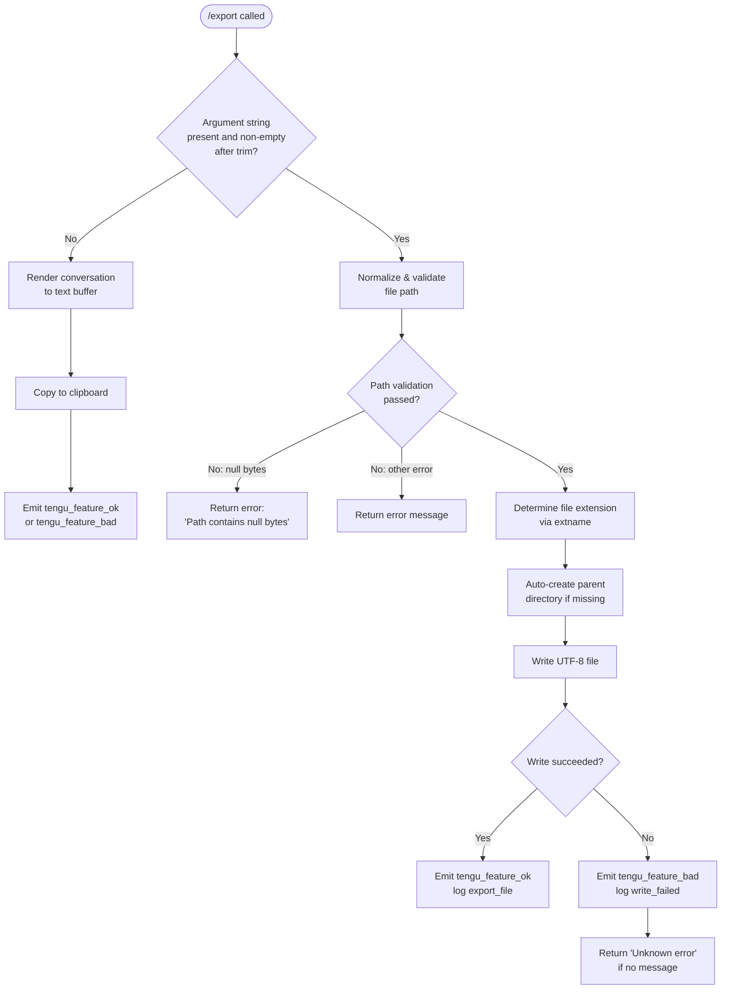

# `/export`

> Analysis basis: CC v2.1.143 bundle.js (AST extraction + Claude interpretation)
> Minimum version: v2.1.143

---

## Overview

The `/export` command serializes the current conversation session — including messages of role `user`, `assistant`, `export`, and `prompt` — into a plain-text representation and either writes it to a named file on disk or copies it to the system clipboard when no filename is supplied. Path resolution applies tilde expansion, null-byte rejection, NFC normalization, and directory auto-creation before the UTF-8 write.

---

## Registration

| Field | Value |
|---|---|
| type | `local-jsx` |
| name | `export` |
| description | Export the current conversation to a file or clipboard |
| argumentHint | `[filename]` |
| module\_id | `sTq` |

Analysis basis: CC v2.1.143 bundle.js:+11659884

---

## Input Branching

The command entry point (`commandEntryPoint`) receives the raw argument string and branches immediately on whether a filename was provided.



Analysis basis: CC v2.1.143 bundle.js:+11659316, +11659356, +11659365, +11659445, +11659526

---

## Behavioral Spec

### 1. Argument Normalization

When the user provides an argument string, the command trims whitespace before any path logic runs.

```
function normalizeArgument(rawArg):
    trimmed = rawArg.trim()
    if trimmed is empty:
        return null          // triggers clipboard path
    return trimmed
```

Analysis basis: CC v2.1.143 bundle.js:+11659325

---

### 2. Conversation Rendering

The render function (`renderConversation`) iterates over the messages in the current session and builds a flat text buffer. Only messages whose role matches recognized role strings are included.

```
function renderConversation(messages):
    lines = []
    for message in messages:
        if message.role not in ["user", "assistant", "export", "prompt"]:
            continue
        if message.type == "message":
            // locate text content blocks
            textBlock = message.content.find(block => block.type == "text")
            if textBlock exists:
                prefix = buildRolePrefix(message.role)
                body   = stripAnsiEscapes(textBlock.text)   // via Bun.stripANSI
                lines.push(prefix + body)
    return lines.join("\n")
```

Role strings in use: `"user"` (bundle.js:+11658819), `"assistant"` (bundle.js:+11657448), `"export"` (bundle.js:+11657994), `"prompt"` (bundle.js:+11658010).
Message type filter: `"message"` (bundle.js:+11657533), content-block type filter: `"text"` (bundle.js:+11658976).

ANSI stripping is performed via `Bun.stripANSI` before text is appended.
Analysis basis: CC v2.1.143 bundle.js:+11658224, +11658290, +11658308, +11658315, +11658335, +3718834

---

### 3. Timestamp Suffix Generation

When the export produces a default filename (no argument supplied), a timestamp suffix is computed from the local wall clock.

```
function buildTimestampSuffix(date):
    year    = String(date.getFullYear())
    month   = String(date.getMonth() + 1).padStart(2, "0")
    day     = String(date.getDate()).padStart(2, "0")
    hours   = String(date.getHours()).padStart(2, "0")
    minutes = String(date.getMinutes()).padStart(2, "0")
    seconds = String(date.getSeconds()).padStart(2, "0")
    return year + month + day + "_" + hours + minutes + seconds
```

Analysis basis: CC v2.1.143 bundle.js:+11658524, +11658542, +11658549, +11658590, +11658628, +11658667, +11658708

---

### 4. Path Validation and Resolution

The path validator (`resolveAndValidatePath`) enforces several security and portability rules before the write is attempted.

```
function resolveAndValidatePath(rawPath):
    if rawPath contains null bytes:
        throw Error("Path contains null bytes")

    trimmed    = rawPath.trim()
    normalized = trimmed.normalize("NFC")        // Unicode NFC normalization

    if platform is "windows":
        // apply Windows-specific path rules via d6 helper
        normalized = applyWindowsPathRules(normalized)

    if normalized starts with "~/":
        home       = os.homedir()
        normalized = path.join(home, normalized.slice(2))

    if path.isAbsolute(normalized):
        return path.resolve(normalized)
    else:
        return path.resolve(process.cwd(), normalized)
```

Literal constants used:
- Null-byte error message: `"Path contains null bytes"` (bundle.js:+996499)
- Unicode normalization form: `"NFC"` (bundle.js:+996581)
- Tilde prefix: `"~/"` (bundle.js:+996653)
- Platform check value: `"windows"` (bundle.js:+996735)

Analysis basis: CC v2.1.143 bundle.js:+996293, +996499, +996533, +996555, +996606, +996640, +996666, +996688, +996735, +996795, +996859

---

### 5. File Write

After the path is resolved, the parent directory is created (recursively, if needed), and the rendered conversation is written as a UTF-8 file.

```
function writeExportFile(resolvedPath, content):
    extension  = path.extname(resolvedPath)   // for format selection if needed
    parentDir  = path.dirname(resolvedPath)
    fs.mkdir(parentDir, { recursive: true })
    fs.writeFile(resolvedPath, content, { encoding: "utf-8" })
```

Encoding constant: `"utf-8"` (bundle.js:+11654882).

Analysis basis: CC v2.1.143 bundle.js:+11654711, +11654807, +11654817, +11654854

---

### 6. Clipboard Path (No Filename)

When no filename argument is present after trimming, the rendered text buffer is written to the system clipboard instead of a file. The clipboard utility (`clipboardWriter`) uses a temporary file internally, cleaning it up via `unlinkSync` on close.

```
function exportToClipboard(content):
    tmpFile = openTempFile()
    try:
        tmpFile.write(content)
        tmpFile.close()
        clipboardProcess = openClipboardProcess()
        clipboardProcess.close()
    finally:
        fs.unlinkSync(tmpFile.path)
```

Analysis basis: CC v2.1.143 bundle.js:+14482768, +14513628, +14513638, +14513778

The active-process tracker (`activeProcessTracker`) adds the process handle on start and removes it on completion, using `Set.add` and `Set.delete`.
Analysis basis: CC v2.1.143 bundle.js:+14507672, +14507681, +14507695

---

### 7. Role-Label Lookup

The display prefix for each message role is resolved through a lookup helper (`findRoleLabel`) that performs a case-insensitive match against a known-roles array.

```
function findRoleLabel(roleString):
    lower = roleString.toLowerCase()
    match = knownRoles.find(entry => entry.key == lower)
    return match ? match.label : roleString
```

Analysis basis: CC v2.1.143 bundle.js:+11659101, +11658798, +11658914

---

### 8. Content Substring Truncation

When rendering a message whose text content exceeds the display limit, the implementation takes a fixed-length substring.

- Substring start offset: `50` characters (bundle.js:+11659037)
- Substring end offset: `49` characters from start (bundle.js:+11659056)

<!-- TODO: full truncation semantics not found in depth-2 traversal; needs --depth 4 -->

Analysis basis: CC v2.1.143 bundle.js:+11659037, +11659056

---

### 9. Error Fallback

If the write operation fails and the caught error object carries no message string, the string `"Unknown error"` is substituted before surfacing to the user.

```
function normalizeErrorMessage(err):
    if err.message is defined and non-empty:
        return err.message
    return "Unknown error"
```

Literal constant: `"Unknown error"` (bundle.js:+11659526).
Telemetry event on failure: `tengu_feature_bad`, logged with key `"write_failed"` (bundle.js:+11659445).

Analysis basis: CC v2.1.143 bundle.js:+11659445, +11659526

---

## State & Side Effects

| Item | Detail |
|---|---|
| Telemetry — success | `tengu_feature_ok` fired on successful file write or clipboard copy (bundle.js:+955068) |
| Telemetry — failure | `tengu_feature_bad` fired on write error, carries `write_failed` key (bundle.js:+955126, +11659445) |
| File-system side effect | Parent directories created recursively via `fs.mkdir` before file write (bundle.js:+11654807) |
| Clipboard side effect | Content written to system clipboard when no filename argument is given; temporary file removed with `unlinkSync` (bundle.js:+14482768) |
| Active-process tracking | Clipboard subprocess handle added to a tracked `Set` on launch and deleted on completion (bundle.js:+14507672, +14507695) |
| appState changes | <!-- TODO: not found in depth-2 traversal; needs --depth 4 --> |
| Sound | <!-- TODO: not found in depth-2 traversal; needs --depth 4 --> |
| Hook registration | Clipboard process subscribes to a `"data"` event via `K.on` (bundle.js:+7549288, +7549293) |

---

## Version History

| Version | Change |
|---|---|
| v2.1.143 | Initial analysis |

---

## Common Mistakes

1. **Omitting the filename causes clipboard export, not an error.** If you intend to write a file, always supply a filename argument; `/export` with no argument silently writes to the clipboard.
2. **Tilde expansion is handled internally — do not pre-expand `~`.** Passing an already-expanded absolute path works, but passing a `~/…` path also works correctly; double-expanding the path manually may produce incorrect results.
3. **Null bytes in the path argument cause an immediate hard error.** Any filename that has been constructed programmatically and may contain `\0` will be rejected with `"Path contains null bytes"` before any I/O is attempted.
4. **The parent directory is created automatically.** There is no need to `mkdir` the destination directory before running `/export`; the command performs a recursive `mkdir` on the parent itself.
5. **ANSI escape codes are stripped from output.** If you need colour-coded or styled output preserved, `/export` is not the right tool — all ANSI sequences are removed via `Bun.stripANSI` before writing.
6. **Role filtering is strict.** Only messages with roles `user`, `assistant`, `export`, and `prompt` appear in the exported file; internal tool-result or system messages are excluded.

---

## Appendix — Identifier Mapping

> For bundle debugging only. Identifiers change across versions.

| Identifier | Role |
|---|---|
| `aTq` | Role-label lookup function (toLowerCase normalization entry point) |
| `oTq` | Conversation message iterator / content extractor |
| `qS7` | Top-level command handler (entry point for `/export`) |
| `AS7` | Export orchestrator (coordinates render → path → write pipeline) |
| `cP8` | Conversation-to-text renderer (assembles lines array and joins) |
| `HS7` | Message-processing core (filters by role and content type) |
| `ty7` | Role-string constant provider |
| `sC` | Session / UI context accessor |
| `dcH` | Clipboard process spawner (registers `data` event, creates React element) |
| `ey7` | Array-guard / content-block validator |
| `O` | Background-session state checker |
| `Q5` | ANSI-strip wrapper around `Bun.stripANSI` |
| `dP8` | File-write coordinator (mkdir + writeFile) |
| `ay7` | File-extension resolver (wraps `path.extname`) |
| `H9` | Path validation and resolution function |
| `S6` | Platform-detection helper |
| `x6` | Windows path normalizer |
| `e4` | Substring / truncation helper (delegates to `m1`) |
| `m1` | Low-level string slicer (indexOf + slice) |
| `_S7` | Timestamp suffix builder (date component formatter) |
| `SH` | Success telemetry emitter (`tengu_feature_ok`) |
| `mH` | Failure telemetry emitter (`tengu_feature_bad`) |
| `d` | Generic telemetry dispatch function |
| `L` | Active-process set manager (add / finally / delete) |