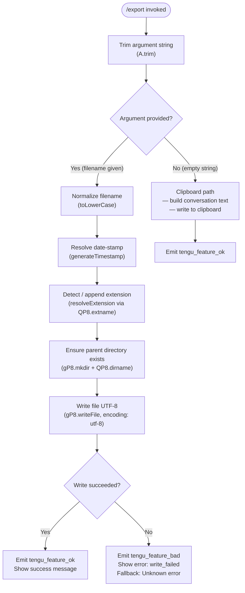

```
---
type: feature-spec
feature: "export"
cc_version: "2.1.143"
updated: "2026-05-18"
tags: ["export", "commands", "slash-commands"]
source: "bundle-analysis"
bundle_verified: true
analysis_basis: "CC v2.1.143 bundle.js (AST extraction + Claude interpretation)"
author: "ryujaeuk <ryujaeuk@gmail.com>"
repository: "https://github.com/MyLittleLuckyDog/cc-gnothi"
license: "AGPL-3.0-only"
---

# `/export`

> Analysis basis: CC v2.1.143 bundle.js (AST extraction + Claude interpretation)
> Minimum version: v2.1.143

---

## Overview

The `/export` command serializes the current conversation session into a structured text representation and either writes it to a file on disk or copies it to the system clipboard. When a `[filename]` argument is supplied the output is persisted via the filesystem; when no argument is given the command falls back to clipboard delivery. The command emits telemetry on both success and failure paths.

---

## Registration

| Field | Value |
|---|---|
| type | `local-jsx` |
| name | `export` |
| description | `Export the current conversation to a file or clipboard` |
| argumentHint | `[filename]` |
| module_id | `sTq` |

Analysis basis: CC v2.1.143 bundle.js:+11659884

---

## Input Branching

The top-level dispatch function (`commandEntryPoint`) inspects the trimmed argument string and routes through four distinct paths:



Analysis basis: CC v2.1.143 bundle.js:+11659325, +11659356, +11659365, +11659445

---

## Behavioral Spec

### Conversation Serialization (`buildConversationText`)

This function iterates over the current message list, filters by role, and concatenates formatted blocks.

```
function buildConversationText(messages):
    lines = []
    for each message in messages:
        if message.role == "user":          // literal "user"
            prefix = "User"
        else:
            prefix = "Assistant"
        contentText = extractTextContent(message.content)  // role "text" extraction
        lines.push(prefix + ": " + contentText)
    return lines.join(separator)
```

- Role filter literal `"user"`: Analysis basis: CC v2.1.143 bundle.js:+11658819
- Content type literal `"text"`: Analysis basis: CC v2.1.143 bundle.js:+11658976
- Array join call: Analysis basis: CC v2.1.143 bundle.js:+11658335

---

### Argument Normalization (`normalizeArgument`)

Lowercases the raw argument token before any further processing.

```
function normalizeArgument(rawArg):
    return rawArg.toLowerCase()
```

Analysis basis: CC v2.1.143 bundle.js:+11659101

---

### Timestamp Generation (`generateTimestamp`)

Constructs a filesystem-safe timestamp string from the current local date/time. Each component is zero-padded to a fixed width by prepending `"0"` and slicing from a fixed offset.

```
function generateTimestamp(now):
    year   = String(now.getFullYear())
    month  = zeroPad(now.getMonth() + 1)   // getMonth is 0-indexed; +1 applied
    day    = zeroPad(now.getDate())
    hour   = zeroPad(now.getHours())
    minute = zeroPad(now.getMinutes())
    second = zeroPad(now.getSeconds())
    return year + month + day + "_" + hour + minute + second

function zeroPad(n):
    s = String(n)
    return ("0" + s).slice(-2)             // always 2 digits
```

- `getFullYear` call: Analysis basis: CC v2.1.143 bundle.js:+11658524
- `getMonth` call: Analysis basis: CC v2.1.143 bundle.js:+11658549
- `getDate` call: Analysis basis: CC v2.1.143 bundle.js:+11658590
- `getHours` call: Analysis basis: CC v2.1.143 bundle.js:+11658628
- `getMinutes` call: Analysis basis: CC v2.1.143 bundle.js:+11658667
- `getSeconds` call: Analysis basis: CC v2.1.143 bundle.js:+11658708
- `String()` coercion: Analysis basis: CC v2.1.143 bundle.js:+11658542

---

### Extension Resolution (`resolveExtension`)

Checks whether the normalized filename already carries a recognized extension; if not, appends a default.

```
function resolveExtension(filename):
    ext = path.extname(filename)           // QP8.extname
    if ext is empty or not recognized:
        return filename + defaultExtension(filename)  // H9 logic
    return filename
```

Analysis basis: CC v2.1.143 bundle.js:+11654711, +11654751

---

### File Write (`writeExportFile`)

Creates the target directory tree if absent, then writes the serialized conversation.

```
function writeExportFile(resolvedPath, content):
    parentDir = path.dirname(resolvedPath)    // QP8.dirname
    fs.mkdirSync(parentDir, { recursive: true })  // gP8.mkdir
    fs.writeFileSync(resolvedPath, content, { encoding: "utf-8" })  // gP8.writeFile
```

- `mkdir` call: Analysis basis: CC v2.1.143 bundle.js:+11654807
- `dirname` call: Analysis basis: CC v2.1.143 bundle.js:+11654817
- `writeFile` call: Analysis basis: CC v2.1.143 bundle.js:+11654854
- Encoding literal `"utf-8"`: Analysis basis: CC v2.1.143 bundle.js:+11654882

---

### Message Lookup / Substring Extraction (`findMessageByIndex`)

Used to locate a specific message within the conversation array and extract a preview substring of up to 50 characters for display purposes.

```
function findMessageByIndex(messages, query):
    match = messages.find(predicate(query))  // A.find
    if match is null:
        return null
    preview = match.content.substring(0, 50)   // q.substring, limit 50
    // trim to 49 chars in display context     // literal 49
    return preview
```

- `Array.isArray` guard: Analysis basis: CC v2.1.143 bundle.js:+11658931
- `find` call: Analysis basis: CC v2.1.143 bundle.js:+11658955
- Substring limit 50: Analysis basis: CC v2.1.143 bundle.js:+11659037
- Display trim to 49: Analysis basis: CC v2.1.143 bundle.js:+11659056
- `substring` call: Analysis basis: CC v2.1.143 bundle.js:+11659042

---

### Clipboard Fallback (`copyToClipboard`)

When no filename is supplied the serialized text is placed on the system clipboard. The implementation uses a randomized token (via `Math.random`) and a short `setTimeout` delay to coordinate the async clipboard write.

```
function copyToClipboard(text):
    token = Math.random() * 2 + 1      // random sentinel in range [1, 3)
    setTimeout(function():
        writeToClipboard(text, token)
    , delay)
```

- `Math.random` call: Analysis basis: CC v2.1.143 bundle.js:+12638156
- `setTimeout` call: Analysis basis: CC v2.1.143 bundle.js:+12638193
- Numeric literals `2` and `1`: Analysis basis: CC v2.1.143 bundle.js:+12638154, +12638170

---

### Temporary File Cleanup (`unlinkTempFile`)

A cleanup edge in the call graph invokes `fs.unlinkSync` via the `q` node, suggesting a temporary file written during clipboard operations is removed after the clipboard write completes.

```
function cleanupTempFile(tempPath):
    fs.unlinkSync(tempPath)    // n8K.unlinkSync
```

Analysis basis: CC v2.1.143 bundle.js:+14482768

---

### Resource Teardown (`closeHandles`)

Two handles (`f` and `q`) are explicitly closed after the export operation finalizes, followed by an `L` callback indicating overall completion.

```
function closeHandles(handleF, handleQ, completionCallback):
    handleF.close()      // index 0 handle
    handleQ.close()
    completionCallback() // L
```

- `f.close` at index 0: Analysis basis: CC v2.1.143 bundle.js:+14513626, +14513628
- `q.close`: Analysis basis: CC v2.1.143 bundle.js:+14513638
- Completion callback `L`: Analysis basis: CC v2.1.143 bundle.js:+14513778

---

### Display Name Normalization (`normalizeDisplayName`)

A secondary lowercase pass is applied to a display-facing string (separate from filename normalization) with a display width cap of 40 characters.

```
function normalizeDisplayName(raw):
    lower = raw.toLowerCase()       // f.toLowerCase
    return lower.slice(0, 40)       // limit 40
```

- `toLowerCase` call: Analysis basis: CC v2.1.143 bundle.js:+14528099
- Limit 40: Analysis basis: CC v2.1.143 bundle.js:+14528173

---

### Path Component Extraction (`extractPathComponent`)

Used during filename resolution to isolate a base path segment by scanning for a separator character index and slicing.

```
function extractPathComponent(fullPath):
    idx = fullPath.indexOf(separator)
    if idx == -1:
        return fullPath
    return fullPath.slice(0, idx)
```

Analysis basis: CC v2.1.143 bundle.js:+190915, +190944

---

## State & Side Effects

| Item | Detail |
|---|---|
| Telemetry — success | `tengu_feature_ok` emitted after successful file write or clipboard copy (Analysis basis: bundle.js:+955068) |
| Telemetry — failure | `tengu_feature_bad` emitted when write fails; error code `"write_failed"` passed as property (Analysis basis: bundle.js:+955126, +11659445) |
| Filesystem — write | Creates parent directories recursively, writes UTF-8 file at resolved path (Analysis basis: bundle.js:+11654807, +11654854) |
| Filesystem — cleanup | Removes temporary file via `unlinkSync` after clipboard operations (Analysis basis: bundle.js:+14482768) |
| Clipboard | Async write via `setTimeout`-deferred operation when no filename argument is given (Analysis basis: bundle.js:+12638193) |
| Error fallback string | `"Unknown error"` used when the caught error object carries no message (Analysis basis: bundle.js:+11659526) |
| appState changes | <!-- TODO: not found in depth-2 traversal; needs --depth 4 --> |
| Hook registration | <!-- TODO: not found in depth-2 traversal; needs --depth 4 --> |
| Sound | <!-- TODO: not found in depth-2 traversal; needs --depth 4 --> |

---

## Version History

| Version | Change |
|---|---|
| v2.1.143 | Initial analysis |

---

## Common Mistakes

1. **Omitting the filename argument and expecting a file on disk** — when no `[filename]` is provided the command routes to the clipboard path exclusively; no file is written.
2. **Providing a path whose parent directory does not exist** — the command creates missing parent directories automatically (`mkdir recursive`), so manual pre-creation is unnecessary and harmless but not required.
3. **Assuming the filename is case-preserved** — the argument is lowercased before use; passing `MyExport.MD` yields `myexport.md` on disk.
4. **Expecting instant clipboard availability** — the clipboard write is deferred via `setTimeout`; pasting immediately after the command returns may race the async operation.
5. **Ignoring the `"write_failed"` error code** — on filesystem permission errors the command surfaces `"write_failed"` with a fallback message of `"Unknown error"` when no OS error string is available; check filesystem permissions on the target path.
6. **Expecting full message content in the confirmation preview** — the displayed preview is capped at 50 characters (trimmed to 49 in some display contexts); the exported file always contains the full conversation.

---

## Appendix — Identifier Mapping

> For bundle debugging only. Identifiers change across versions.

| Identifier | Role |
|---|---|
| `aTq` | Argument normalization function (lowercases raw argument token) |
| `oTq` | Message lookup and substring extraction function |
| `qS7` | Command entry point / top-level dispatch function |
| `AS7` | Intermediate dispatch wrapper called by entry point |
| `cP8` | Conversation serialization function (builds text from message list) |
| `dP8` | File write orchestrator (mkdir + writeFile) |
| `ay7` | Extension resolution function (uses `path.extname`) |
| `_S7` | Timestamp generation function |
| `SH` | Success handler (emits `tengu_feature_ok`) |
| `mH` | Failure handler (emits `tengu_feature_bad`) |
| `e4` | Path component extraction helper |
| `m1` | Index-and-slice utility for path segments |
| `H` | Clipboard async write coordinator (uses `Math.random` + `setTimeout`) |
| `A` | Display name normalization function (toLowerCase + length cap) |
| `f` | First resource handle subject to `.close()` teardown |
| `q` | Second resource handle / temp file reference (`.close()` + `unlinkSync`) |
| `d` | Shared telemetry emission function reached by both `SH` and `mH` |
```