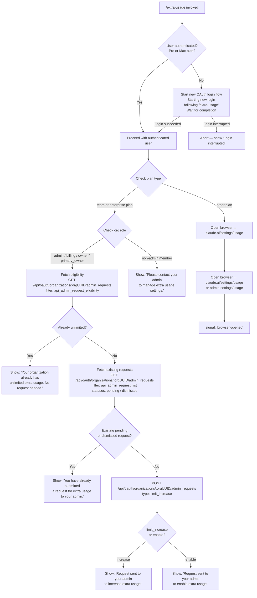

# `/extra-usage`

> Analysis basis: CC v2.1.142 bundle.js (AST extraction + Claude interpretation)
> Minimum version: v2.1.142

---

## Overview

`/extra-usage` is a slash command that helps users configure or request extra usage capacity when they have hit (or are approaching) API usage limits. Depending on the user's subscription plan, organization role, and the current state of any pending admin requests, the command either opens a browser to a usage management page, sends a limit-increase request to an organization admin, or informs the user that no action is required. If the user is not authenticated (no Claude Pro/Max plan detected), the command initiates a fresh OAuth login flow before proceeding.

---

## Registration

| Field | Value |
|---|---|
| type | `local-jsx` |
| name | `extra-usage` |
| description | Configure extra usage to keep working when limits are hit |
| loc_byte | `8204387` |
| loc_byte_end | `8204592` |
| loc_line | `3112` |
| module_id | `ZC1` |
| load_inline | `true` |
| arbor_handler.name | `mJ6` |
| arbor_handler.fqn | `claude-2.1.142::mJ6` |
| arbor_handler.kind | `AsyncFunction` |
| arbor_handler.resolution_path | `module_id` |
| arbor_handler.n_hits | `0` |

Analysis basis: CC v2.1.142 bundle.js:+8204387

---

## Input Branching

The command has five or more distinct outcome branches depending on authentication state, plan type, organization role, and existing admin-request status. A Mermaid flowchart is used below.



Analysis basis: CC v2.1.142 bundle.js:+8203347 (handler entry `mJ6`), +8157963, +8158195, +8158304, +8158540, +8158858, +8158912

---

## Behavioral Spec

### 1. Authentication Gate

When invoked, the handler (`mJ6`) first checks whether the current session holds a valid Pro or Max plan credential.

```
async function extraUsageHandler(context):
    planType = getCurrentPlanType()          // literals: "pro", "max"

    if planType is not "pro" and not "max":
        display("Starting new login following /extra-usage. Exit with Ctrl-C to use existing account.")
        loginResult = await startOAuthLoginFlow()
        if loginResult == "interrupted":
            display("Login interrupted")
            return
        // else: "Login successful" — continue with fresh credentials
        display("Login successful")
        onChangeAPIKey(newKey)
```

Analysis basis: CC v2.1.142 bundle.js:+8203358 (`"pro"`), +8203369 (`"max"`), +8203614 (login message), +8203737 (success), +8203756 (interrupted), +8203714 (`onChangeAPIKey`)

---

### 2. Plan Classification and Route Selection

After confirming authentication, the handler reads the subscription type to decide the execution path.

```
function classifyPlan(subscriptionInfo):
    // Known subscription literals
    if subscriptionInfo.type in ["stripe_subscription",
                                  "stripe_subscription_contracted",
                                  "apple_subscription",
                                  "google_play_subscription"]:
        if subscriptionInfo.planTier in ["team", "enterprise"]:
            return "org-managed"
        else:
            return "individual"
    return "individual"
```

Analysis basis: CC v2.1.142 bundle.js:+2923672, +2923699, +2923737, +2923763, +8157963, +8157975

For **individual** plans (non-org), the command opens the user-facing usage settings URL directly in the system browser and signals `"browser-opened"`.

```
function openIndividualUsagePage():
    url = "https://claude.ai/settings/usage"
    openInBrowser(url)
    signal("browser-opened")
```

Analysis basis: CC v2.1.142 bundle.js:+8159257, +8159324

---

### 3. Organization Role Check

For `team` or `enterprise` plans, the handler reads the current user's role within the organization.

```
function isAdminRole(role):
    adminRoles = ["admin", "billing", "owner", "primary_owner"]
    return role in adminRoles
```

If the user is **not** an admin-class role, the command displays a message directing the user to contact their admin, then exits.

```
    if not isAdminRole(currentUserRole):
        display("Please contact your admin to manage extra usage settings.")
        return
```

Analysis basis: CC v2.1.142 bundle.js:+2020349, +2020357, +2020367, +2020375, +8158368

---

### 4. Eligibility Fetch (`tR1`)

For admin-role org members, the handler queries eligibility via the Anthropic API.

```
async function fetchEligibility(orgUUID, authToken):
    response = await GET(
        url    = "/api/oauth/usage",           // base path
        filter = "api_admin_request_eligibility",
        timeout = 5000,
        headers = { "Content-Type": "application/json" }
    )
    // 401 → refresh token → retry once (suffix " (401→refresh→retry succeeded)")
    // 500-class errors → isAxiosError check → surface detail field
    return response
```

If the response indicates the organization already has **unlimited** extra usage, the command terminates early:

```
    if response.unlimited == true:
        display("Your organization already has unlimited extra usage. No request needed.")
        return
```

Analysis basis: CC v2.1.142 bundle.js:+8156643, +8157186, +8157214, +8157228, +8157243, +8157312, +8157413, +8158211, +8157538, +8157621, +8157827

---

### 5. Existing Request Check (`sR1`)

If the organization is eligible for extra usage but does not already have unlimited access, the handler fetches the list of existing admin requests, filtering by status.

```
async function fetchExistingRequests(orgUUID, authToken):
    response = await GET(
        filter   = "api_admin_request_list",
        statuses = ["pending", "dismissed"]
    )
    return response.data
```

If a request in `pending` or `dismissed` status already exists:

```
    existingRequests = await fetchExistingRequests(orgUUID, authToken)
    if existingRequests.length > 0:
        display("You have already submitted a request for extra usage to your admin.")
        return
```

Analysis basis: CC v2.1.142 bundle.js:+8156292, +8156395, +8158540, +8158550, +8158609

---

### 6. Request Creation (`aR1`)

When no prior request exists, the handler POSTs a new admin request.

```
async function createAdminRequest(orgUUID, authToken, requestType):
    response = await POST(
        url  = "/api/oauth/organizations/:orgUUID/admin_requests",
        body = { type: "limit_increase" }
    )
    return response
```

The confirmation message depends on whether the request is a **limit increase** (quota already exists but is too low) or an **enable** action (usage feature not yet active):

```
    result = await createAdminRequest(orgUUID, authToken, "limit_increase")
    if result.action == "increase":
        display("Request sent to your admin to increase extra usage.")
    else:
        display("Request sent to your admin to enable extra usage.")
```

Analysis basis: CC v2.1.142 bundle.js:+8156027, +8156084, +8158304, +8158858, +8158912

---

### 7. HTTP Client Internals (`qnH` / `bE`)

The internal HTTP helper used for all API calls includes:

- **Cache layer**: responses cached via a map keyed by request identity; TTL constant: 300,000 ms (5 minutes). Analysis basis: CC v2.1.142 bundle.js:+2027164
- **Retry budget**: up to 1 retry on HTTP 401 (token refresh) with exponential back-off using `Math.random` and `setTimeout`. Analysis basis: CC v2.1.142 bundle.js:+2933676, +2933704
- **Revocation detection**: HTTP 403 with body matching `"OAuth token has been revoked"` triggers a hard auth failure. Analysis basis: CC v2.1.142 bundle.js:+2933770
- **No-auth mode**: requests tagged `"no-auth"` bypass credential injection. Analysis basis: CC v2.1.142 bundle.js:+8157312

---

### 8. Browser Opening (`sq` / `D8`)

Platform-specific browser launch:

```
function openBrowser(url):
    if not url.startsWith("http:") and not url.startsWith("https:"):
        throw Error("invalid URL scheme")
    platform = process.platform
    if platform == "darwin":
        spawn("open", [url])
    elif platform == "win32":
        spawn("rundll32", ["url,OpenURL", url])
    else:
        spawn("xdg-open", [url])
    signal("browser-opened")
```

Admin-role org members are directed to the admin settings URL; individual users to the standard settings URL:

- Admin URL: `https://claude.ai/admin-settings/usage` (bundle.js:+8159216)
- User URL: `https://claude.ai/settings/usage` (bundle.js:+8159257)

Analysis basis: CC v2.1.142 bundle.js:+7527992, +7528014, +7528301, +7528317, +7528401, +7528413, +7528475, +7528482, +8159324

---

### 9. Auth Configuration (`z3` / `bw`)

The auth subsystem consulted by the handler supports multiple credential sources and API provider back-ends:

- Environment variable `ANTHROPIC_API_KEY` (bundle.js:+2907371)
- Environment variable `CLAUDE_CODE_OAUTH_TOKEN_FILE_DESCRIPTOR` (bundle.js:+2035695)
- Environment variable `CLAUDE_CODE_API_KEY_FILE_DESCRIPTOR` (bundle.js:+2035838)
- Supported API providers: `bedrock`, `foundry`, `anthropicAws`, `mantle`, `vertex`, `firstParty` (bundle.js:+2017459 – +2017676)
- If neither `ANTHROPIC_API_KEY` nor an OAuth token is present: error `"ANTHROPIC_API_KEY or CLAUDE_CODE_OAUTH_TOKEN env var is required"` (bundle.js:+2907792)

---

### 10. GrowthBook Experiment Integration (`G6` / `Ji6` / `IA_`)

The handler participates in a GrowthBook feature-flag / A/B experiment layer:

```
function resolveFeatureFlag(flagKey, context):
    if flagKey in processedSet:
        return cachedFlagMap.get(flagKey)
    processedSet.add(flagKey)
    experimentResult = evaluateExperiment(flagKey, context)
    // emits event "GrowthbookExperimentEvent" on internal event bus
    // only fires in "production" environment
    // telemetry event: "growthbook_experiment" via Dl.emit
    cachedFlagMap.set(flagKey, experimentResult)
    return experimentResult
```

Analysis basis: CC v2.1.142 bundle.js:+3125999, +3125853, +3126426, +3132445, +3132456

---

## State & Side Effects

| Item | Detail |
|---|---|
| Telemetry | `tengu_ember_latch` (bundle.js:+8203394); `tengu_feature_ok` (bundle.js:+954550); `tengu_feature_bad` (bundle.js:+954608) |
| Browser launch | Opens `https://claude.ai/admin-settings/usage` (admin) or `https://claude.ai/settings/usage` (individual) via platform-specific OS command |
| Signal emitted | `"browser-opened"` string signal after successful browser launch (bundle.js:+8159324) |
| API calls | GET `/api/oauth/usage` (eligibility), GET `/api/oauth/organizations/:orgUUID/admin_requests` (list), POST `/api/oauth/organizations/:orgUUID/admin_requests` (create) |
| API timeout | 5,000 ms per request (bundle.js:+8157214) |
| Response cache TTL | 300,000 ms (5 minutes) (bundle.js:+2027164) |
| OAuth login flow | Triggered when plan is not `"pro"` or `"max"`; displays prompt, then calls `onChangeAPIKey` on success |
| GrowthBook events | `"GrowthbookExperimentEvent"` emitted on internal bus; `"growthbook_experiment"` sent via telemetry emitter in production |
| appState changes | API key updated via `onChangeAPIKey` when login flow completes (bundle.js:+8203714) |
| Sound | <!-- TODO: not found in depth-2 traversal; needs --depth 4 --> |
| Hook registration | <!-- TODO: not found in depth-2 traversal; needs --depth 4 --> |

---

## Version History

| Version | Change |
|---|---|
| v2.1.142 | Initial analysis |

---

## Common Mistakes

1. **Running `/extra-usage` without an active Pro or Max plan** — the command will immediately enter an OAuth login flow rather than showing usage settings. Users who already have credentials but on a free tier will be prompted to re-authenticate.
2. **Non-admin org members expecting to submit requests** — only roles `admin`, `billing`, `owner`, and `primary_owner` can submit limit-increase requests; other members see a redirect-to-admin message.
3. **Expecting immediate limit increase** — the command only *submits* a request to the organization admin; no limit is changed until the admin approves. The confirmation message says "Request sent", not "Limit increased".
4. **Re-submitting when a request is already pending** — the command checks for existing `pending` or `dismissed` requests and will not create a duplicate; it instead shows a "you have already submitted" message.
5. **Using `/extra-usage` on Bedrock, Vertex, or other non-first-party providers** — the OAuth-based extra-usage flow is designed for first-party Anthropic accounts. Behavior on alternative API providers is not guaranteed to proceed past the auth check.

---

## Appendix — Identifier Mapping

> For bundle debugging only. Identifiers change across versions.

| Identifier | Role |
|---|---|
| `mJ6` | Main async handler for `/extra-usage` command (arbor_handler) |
| `qq` | Subscription/plan info resolver |
| `jdA` | Plan info sub-reader A |
| `JdA` | Plan info sub-reader B |
| `bw` | Authentication state builder |
| `OL` | String coercion / option normalizer |
| `bH` | Low-level string/value formatter |
| `QR` | API credentials assembler |
| `RU6` | Auth context initializer |
| `C46` | Credential field formatter |
| `Ja` | OAuth token file descriptor reader |
| `yu` | Flag-settings reader |
| `MP` | Provider type mapper |
| `VA` | Backend provider classifier (bedrock/vertex/etc.) |
| `z3` | Auth configuration resolver |
| `f8_` | API key helper resolver |
| `GV` | Auth validation utility |
| `HH6` | VSCode environment detector |
| `Il8` | API key file descriptor reader |
| `y6` | Session / experiment state recorder |
| `NR` | Credential string slicer (last 20 chars) |
| `dV` | Deferred value / promise holder |
| `G6` | GrowthBook feature-flag evaluator entry |
| `Z76` | Feature-flag key normalizer |
| `V76` | Feature-flag value extractor |
| `ws` | Anthropic API endpoint checker |
| `Ds` | GrowthBook SDK wrapper |
| `Su` | GrowthBook client initializer |
| `Ji6` | Feature-flag cache lookup and populate |
| `IA_` | Experiment evaluation and event emitter |
| `f0H` | GrowthBook attributes builder |
| `hu` | Session ID generator (32-byte hex, random) |
| `RH` | JSON serializer wrapper |
| `nyL` | Experiment payload normalizer |
| `CA_` | Feature-flag result processor |
| `mY9` | Deduplication helper for flag results |
| `m_` | Flag result cache accessor |
| `GE9` | Feature-flag metadata extractor |
| `WRH` | Seen-flag set checker |
| `CMH` | Subscription type classifier (stripe/apple/google) |
| `M5` | Subscription plan tier resolver |
| `AA` | Subscription active-state checker |
| `kB` | Boolean coercion for subscription state |
| `$q` | Telemetry event category selector |
| `NMA` | Telemetry string formatter |
| `kf8` | Extra-usage core flow controller |
| `Mu` | Organization role helper |
| `qnH` | HTTP fetch wrapper with cache and retry |
| `B1` | HTTP base-request builder |
| `_` | URL path builder |
| `SH` | Request header assembler (ok path) |
| `uH` | Request header assembler (error path) |
| `hE` | Response extractor |
| `AAH` | Request timestamp stamper |
| `bE` | HTTP error / retry handler |
| `H` | Exponential back-off with jitter |
| `Du` | Response cache manager (get/delete/set) |
| `v` | HTTP request dispatcher (debug, redact, file logging) |
| `f7K` | Request serializer and file-logging writer |
| `H5` | Log file path builder with redaction |
| `BhH` | HTTP header redactor |
| `O7K` | File-based request logger |
| `tR1` | Admin request eligibility fetcher |
| `sR1` | Admin request list fetcher |
| `A` | HTTP form-data / multipart builder |
| `f` | HTTP connection closer |
| `aR1` | Admin request creator (POST) |
| `HC1` | Axios error classifier for API responses |
| `ZY` | Admin URL selector (admin vs. user settings) |
| `GH` | String coercion for URL |
| `NH` | Notification / message display handler |
| `k_` | Error-to-string converter |
| `JvK` | Notification queue manager (shift/push) |
| `sq` | Cross-platform browser opener |
| `Jb4` | URL scheme validator |
| `IJ` | Browser-open argument builder |
| `D8` | OS-specific process spawner |
| `O_` | Child-process launcher with limits |
| `h6` | Platform-specific open-command resolver |

---

Note: index built via Arbor fallback; some signals (telemetry, literals) may be missing — see arbor-fallback.js.