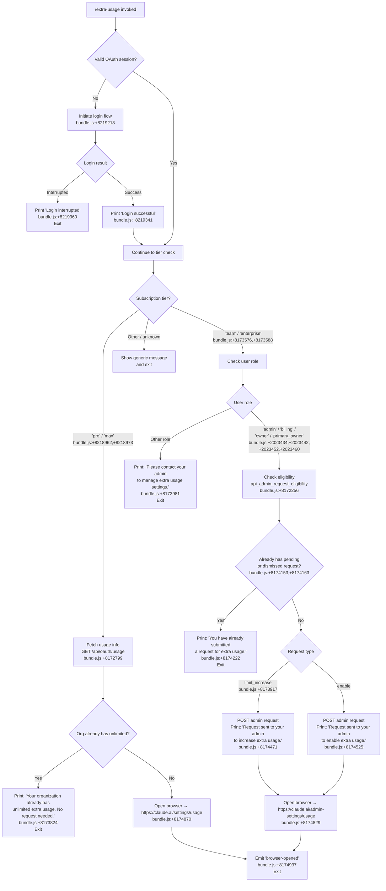

# `/extra-usage`

> Analysis basis: CC v2.1.143 bundle.js (AST extraction + Claude interpretation)
> Minimum version: v2.1.143

---

## Overview

The `/extra-usage` command allows users to configure extra usage capacity so that Claude Code can continue operating after standard rate limits are reached. It inspects the current subscription tier and organizational role, then either opens a browser-based settings page or submits an admin request on the user's behalf. If no valid OAuth session exists, the command initiates a fresh login flow before proceeding.

---

## Registration

| Field | Value |
|---|---|
| type | `local-jsx` |
| name | `extra-usage` |
| description | Configure extra usage to keep working when limits are hit |
| module_id | `Hb1` |
| loc_line | 3116 |

Analysis basis: CC v2.1.143 bundle.js:+8219991

---

## Input Branching

The command entry point (`oJ6`) determines which path to follow based on subscription tier, organizational role, and current request state.



---

## Behavioral Spec

### Authentication Gate

Before any usage-related action, the command verifies that a valid OAuth credential is available. If no credential exists, it starts a new login sequence, printing a notice that the existing account will be bypassed.

```
function authenticationGate(currentState):
    credential = resolveOAuthCredential(currentState)
    if credential is null or expired:
        print("Starting new login following /extra-usage. Exit with Ctrl-C to use existing account.")
        // bundle.js:+8219218
        loginResult = runLoginFlow()
        if loginResult == INTERRUPTED:
            print("Login interrupted")   // bundle.js:+8219360
            return ABORT
        onChangeAPIKey(loginResult.apiKey)  // bundle.js:+8219318
        print("Login successful")           // bundle.js:+8219341
    return CONTINUE
```

Analysis basis: CC v2.1.143 bundle.js:+8219218, +8219341, +8219360, +8219318

---

### Subscription Tier Detection

The command reads the current subscription tier and routes to the appropriate sub-flow.

```
function detectSubscriptionTier(authState):
    tier = authState.subscriptionTier
    // Recognized pro/consumer tiers: "pro", "max"
    // bundle.js:+8218962, +8218973
    if tier in ["pro", "max"]:
        return CONSUMER_FLOW
    // Recognized team/enterprise tiers: "team", "enterprise"
    // bundle.js:+8173576, +8173588
    if tier in ["team", "enterprise"]:
        return ORGANIZATION_FLOW
    return UNKNOWN_FLOW
```

Analysis basis: CC v2.1.143 bundle.js:+8218962, +8218973, +8173576, +8173588

---

### Usage Data Fetch (`/api/oauth/usage`)

For consumer-tier users, current usage data is retrieved from the Anthropic API.

```
function fetchUsageData(oauthToken):
    endpoint = "/api/oauth/usage"    // bundle.js:+8172799
    response = httpGet(
        url       = endpoint,
        headers   = { "Content-Type": "application/json" },  // bundle.js:+8172841, +8172856
        timeout   = 5000,            // bundle.js:+8172827  (milliseconds)
        auth      = oauthToken
    )
    if httpStatus == 401:
        refreshToken()
        retryRequest()               // appends " (401→refresh→retry succeeded)" to log
        // bundle.js:+8173026
    if response.unlimited == true:
        return UNLIMITED
    return response
```

- Request timeout: 5000 ms (bundle.js:+8172827)
- Content-Type header value: `application/json` (bundle.js:+8172856)
- Auth mode falls back to `no-auth` string when token absent (bundle.js:+8172925)
- 401 triggers a token refresh and a single retry (bundle.js:+8173026)

Analysis basis: CC v2.1.143 bundle.js:+8172799, +8172827, +8172841, +8172856, +8172925, +8173026

---

### Unlimited Org Short-Circuit

```
function checkUnlimitedOrg(usageData):
    if usageData == UNLIMITED:
        printMessage("Your organization already has unlimited extra usage. No request needed.")
        // bundle.js:+8173824
        return DONE
    return PROCEED
```

Analysis basis: CC v2.1.143 bundle.js:+8173824

---

### Organization Role Check

For team/enterprise users, the command inspects the authenticated user's role before allowing admin-request submission.

```
function checkOrganizationRole(userProfile):
    privilegedRoles = ["admin", "billing", "owner", "primary_owner"]
    // bundle.js:+2023434, +2023442, +2023452, +2023460
    if userProfile.role in privilegedRoles:
        return PRIVILEGED
    else:
        printMessage("Please contact your admin to manage extra usage settings.")
        // bundle.js:+8173981
        return NON_PRIVILEGED
```

Analysis basis: CC v2.1.143 bundle.js:+2023434, +2023442, +2023452, +2023460, +8173981

---

### Admin Request Eligibility Check

```
function checkAdminRequestEligibility(orgUUID, oauthToken):
    // Calls internal endpoint "api_admin_request_eligibility"
    // bundle.js:+8172256
    eligibility = apiGet("api_admin_request_eligibility", orgUUID, oauthToken)
    // teleport-org header may be injected for org routing
    // bundle.js:+8172404
    return eligibility
```

Analysis basis: CC v2.1.143 bundle.js:+8172256, +8172404

---

### Existing Request Guard

```
function existingRequestGuard(requestList):
    // Fetches via "api_admin_request_list" // bundle.js:+8171905
    // Filter statuses: "pending", "dismissed" // bundle.js:+8174153, +8174163
    existing = requestList.filterByStatuses(["pending", "dismissed"])
    if existing is not empty:
        printMessage("You have already submitted a request for extra usage to your admin.")
        // bundle.js:+8174222
        return ALREADY_SUBMITTED
    return PROCEED
```

Analysis basis: CC v2.1.143 bundle.js:+8171905, +8174153, +8174163, +8174222

---

### Admin Request Submission

```
function submitAdminRequest(orgUUID, requestType, oauthToken):
    // POST to /api/oauth/organizations/:orgUUID/admin_requests
    // bundle.js:+8171697
    // Internal label: "api_admin_request_create" // bundle.js:+8171640
    payload = { type: requestType }
    response = httpPost(
        url     = "/api/oauth/organizations/" + orgUUID + "/admin_requests",
        body    = payload,
        token   = oauthToken
    )
    if requestType == "limit_increase":   // bundle.js:+8173917
        printMessage("Request sent to your admin to increase extra usage.")
        // bundle.js:+8174471
    else:
        printMessage("Request sent to your admin to enable extra usage.")
        // bundle.js:+8174525
```

Analysis basis: CC v2.1.143 bundle.js:+8171640, +8171697, +8173917, +8174471, +8174525

---

### Browser Launch

After completing the relevant action, the command opens a URL in the system browser.

```
function launchBrowser(isAdmin):
    if isAdmin:
        url = "https://claude.ai/admin-settings/usage"   // bundle.js:+8174829
    else:
        url = "https://claude.ai/settings/usage"          // bundle.js:+8174870

    platform = detectPlatform()
    if platform == "darwin":        // bundle.js:+7543375
        exec("open", url)           // bundle.js:+7543549
    else if platform == "win32":    // bundle.js:+7543391
        exec("rundll32", "url,OpenURL", url)  // bundle.js:+7543475, +7543487
    else:
        exec("xdg-open", url)       // bundle.js:+7543556

    emit("browser-opened")          // bundle.js:+8174937
```

- macOS launcher: `open` (bundle.js:+7543549)
- Windows launcher: `rundll32 url,OpenURL` (bundle.js:+7543475, +7543487)
- Linux/other launcher: `xdg-open` (bundle.js:+7543556)
- Only `http:` and `https:` scheme URLs are accepted (bundle.js:+7543066, +7543088)

Analysis basis: CC v2.1.143 bundle.js:+8174829, +8174870, +8174937, +7543375, +7543391, +7543549, +7543475, +7543487, +7543556

---

### Error Handling

```
function handleApiError(error):
    if isAxiosError(error):
        statusCode = error.response.status
        if statusCode == 401:
            // Refresh and retry (see fetchUsageData)
        if statusCode == 403:
            // Treat as permission denied; fall through to non-privileged path
        if statusCode >= 500:          // bundle.js:+8173234
            // Extract error detail field // bundle.js:+8173440
            detail = error.response.data.detail
            logError(detail)
        if statusCode == 429:          // bundle.js:+172585
            // Rate-limited; surface to user
    else:
        logError(error.message)        // bundle.js:+8173808
```

- HTTP 401 triggers token refresh + retry (bundle.js:+2943415)
- HTTP 403 treated as permission denied (bundle.js:+2943443)
- HTTP 5xx logs `detail` field from response body (bundle.js:+8173234, +8173440)
- HTTP 429 recognized as rate-limit error (bundle.js:+172585)
- Revoked OAuth token message: `"OAuth token has been revoked"` (bundle.js:+2943509)

Analysis basis: CC v2.1.143 bundle.js:+2943415, +2943443, +8173234, +8173440, +172585, +2943509

---

### Usage Cache / Refresh Interval

```
function getCachedUsage(cacheStore, fetchFn):
    CACHE_TTL = 300000   // 5 minutes in milliseconds // bundle.js:+2030299
    entry = cacheStore.get(key)
    if entry is null or (Date.now() - entry.timestamp) > CACHE_TTL:
        fresh = fetchFn()
        cacheStore.set(key, { data: fresh, timestamp: Date.now() })
        return fresh
    return entry.data
```

- Cache TTL: 300,000 ms (5 minutes) (bundle.js:+2030299)

Analysis basis: CC v2.1.143 bundle.js:+2030299

---

### Authentication Provider Detection

```
function detectAuthProvider(config):
    providerMap = {
        "bedrock":      ...,   // bundle.js:+2020544
        "foundry":      ...,   // bundle.js:+2020594
        "anthropicAws": ...,   // bundle.js:+2020650
        "mantle":       ...,   // bundle.js:+2020704
        "vertex":       ...,   // bundle.js:+2020752
        "firstParty":   ...    // bundle.js:+2020761
    }
    return providerMap[config.provider] ?? "firstParty"
```

Analysis basis: CC v2.1.143 bundle.js:+2020544, +2020594, +2020650, +2020704, +2020752, +2020761

---

### Subscription Type Recognition

The system recognizes the following subscription type strings when inspecting billing status:

| String | loc_byte |
|---|---|
| `stripe_subscription` | +2928259 |
| `stripe_subscription_contracted` | +2928286 |
| `apple_subscription` | +2928324 |
| `google_play_subscription` | +2928350 |

Analysis basis: CC v2.1.143 bundle.js:+2928259, +2928286, +2928324, +2928350

---

### Feature Flag / Growthbook Integration

```
function resolveFeatureFlag(flagName, config):
    // Reads from flagSettings // bundle.js:+2912903
    // Only active in "production" environment // bundle.js:+3135592
    // Emits event "GrowthbookExperimentEvent" // bundle.js:+3135738
    // Fires "growthbook_experiment" telemetry event // bundle.js:+3136165
    // Uses randomBytes(32).toString("hex") for assignment ID
    // bundle.js:+3167785, +3167798
    if environment != "production":
        return DEFAULT_FLAG_VALUE
    experimentId = randomBytes(32).toString("hex")
    result = growthbook.evaluate(flagName, experimentId)
    emit("GrowthbookExperimentEvent", { flag: flagName, result })
    return result
```

Analysis basis: CC v2.1.143 bundle.js:+2912903, +3135592, +3135738, +3136165, +3167785, +3167798

---

## State & Side Effects

| Item | Detail |
|---|---|
| Telemetry — `tengu_ember_latch` | Fired at command entry from `oJ6` → `G6` edge (bundle.js:+8218998) |
| Telemetry — `tengu_feature_ok` | Fired on successful feature-flag resolution (bundle.js:+955068) |
| Telemetry — `tengu_feature_bad` | Fired on failed feature-flag resolution (bundle.js:+955126) |
| API call — `GET /api/oauth/usage` | Fetches current usage with 5 000 ms timeout; result cached for 300 000 ms (bundle.js:+8172799, +8172827, +2030299) |
| API call — `GET api_admin_request_eligibility` | Checks whether the user may submit an admin request (bundle.js:+8172256) |
| API call — `GET api_admin_request_list` | Retrieves existing admin requests, filtered by `pending`/`dismissed` status (bundle.js:+8171905) |
| API call — `POST /api/oauth/organizations/:orgUUID/admin_requests` | Creates a new limit-increase or enable-extra-usage request (bundle.js:+8171697) |
| OAuth token change | Calls `onChangeAPIKey` when login completes successfully (bundle.js:+8219318) |
| Browser launch | Opens platform-appropriate browser to `claude.ai/settings/usage` or `claude.ai/admin-settings/usage`; emits `browser-opened` (bundle.js:+8174937) |
| Growthbook experiment | Emits `growthbook_experiment` event in production environments (bundle.js:+3136165) |
| Token refresh | On HTTP 401, refreshes OAuth token and retries the failed request once (bundle.js:+8173026) |
| appState changes | `onChangeAPIKey` propagates new credentials into app state (bundle.js:+8219318) |
| Sound | <!-- TODO: not found in depth-2 traversal; needs --depth 4 --> |

---

## Version History

| Version | Change |
|---|---|
| v2.1.143 | Initial analysis |

---

## Common Mistakes

1. **Running `/extra-usage` without an internet connection.** The command must reach `api.anthropic.com` (bundle.js:+3140996) to fetch usage data and submit requests. Offline invocations will fail at the `GET /api/oauth/usage` step with a network error.

2. **Expecting non-admin team/enterprise users to submit requests.** Only users whose role is one of `admin`, `billing`, `owner`, or `primary_owner` can submit admin requests. All other roles receive the "Please contact your admin" message and the command exits without opening a browser (bundle.js:+8173981).

3. **Invoking the command repeatedly to re-submit requests.** If a `pending` or `dismissed` request already exists for the organization, the command prints "You have already submitted a request" and exits without creating a duplicate (bundle.js:+8174222).

4. **Expecting the command to work on unsupported subscription tiers.** Only `pro`, `max`, `team`, and `enterprise` tiers are handled explicitly. Other tier strings fall through to an unhandled path with no meaningful output.

5. **Interrupting the login flow with Ctrl-C and expecting the command to continue.** An interrupted login prints "Login interrupted" and aborts the entire `/extra-usage` flow (bundle.js:+8219360).

6. **Assuming the usage data is always real-time.** Usage data is cached for up to 5 minutes (300 000 ms). A freshly submitted admin request may not be reflected until the cache expires (bundle.js:+2030299).

7. **Using the command in non-first-party API configurations (Bedrock, Vertex, etc.).** The command's OAuth-based admin-request flow is designed for first-party Anthropic authentication. Provider variants such as `bedrock`, `vertex`, `foundry`, `anthropicAws`, or `mantle` may not reach the required endpoints (bundle.js:+2020544 – +2020761).

---

## Appendix — Identifier Mapping

> For bundle debugging only. Identifiers change across versions.

| Identifier | Role |
|---|---|
| `oJ6` | Command entry-point / top-level handler for `/extra-usage` |
| `fq` | Auth-state resolver / credential reader |
| `Cl8` | Credential field accessor #1 |
| `Rl8` | Credential field accessor #2 |
| `Uw` | Auth provider dispatcher |
| `TK` | Token serializer / formatter |
| `xH` | Low-level string conversion utility |
| `SN` | OAuth token validation helper |
| `nU6` | Token field extractor |
| `eAH` | Token integrity checker |
| `gc` | OAuth credential reader (file-descriptor path) |
| `fI` | Flag-settings reader |
| `Sw` | Provider-type detector |
| `DA` | Provider string mapper |
| `j3` | API-key / OAuth-token resolver (environment + helper) |
| `Q46` | Environment variable reader for `ANTHROPIC_API_KEY` |
| `$E` | API-key helper runner |
| `$SH` | VSCode client detector |
| `Oq6` | File-descriptor token reader (`CLAUDE_CODE_API_KEY_FILE_DESCRIPTOR`) |
| `N6` | Credentials store / session record constructor |
| `Qy` | History slice utility (last-20 entries) |
| `lV` | Subscription-tier reader |
| `G6` | Growthbook experiment dispatcher / feature-flag gate |
| `m76` | Growthbook config loader #1 |
| `p76` | Growthbook config loader #2 |
| `Ts` | Growthbook client initializer |
| `jF` | Growthbook feature evaluator |
| `Uu` | Growthbook SDK wrapper |
| `Ci6` | Experiment assignment manager |
| `lA_` | Experiment event emitter |
| `$0H` | Experiment result serializer |
| `pu` | Random experiment-ID generator |
| `hH` | JSON stringify wrapper |
| `EhL` | Experiment log formatter |
| `eA_` | Feature-flag eligibility gate |
| `wD9` | Flag environment checker |
| `R_` | Flag value resolver |
| `aE9` | Flag assignment persister |
| `VRH` | Flag-set membership checker |
| `QMH` | Subscription-type classifier |
| `L5` | Subscription tier + credential combiner |
| `HA` | Subscription-type string validator |
| `SR` | Array membership tester (subscription types) |
| `H` | General-purpose utility / math-random / setTimeout host |
| `zq` | URL string builder / validator |
| `A$A` | URL string normalizer |
| `lf8` | Extra-usage main orchestrator |
| `Pu` | Role-permission checker |
| `LnH` | Usage data fetcher (`/api/oauth/usage`) |
| `F1` | HTTP auth-header builder |
| `_` | HTTP client base instance |
| `SH` | HTTP request helper #1 |
| `mH` | HTTP request helper #2 |
| `yE` | HTTP subscription-array validator |
| `AAH` | Request timestamp stamper |
| `CE` | HTTP error classifier (Axios) |
| `Eu` | Token-refresh-and-retry handler |
| `v` | HTTP transport layer / request executor |
| `G5K` | HTTP client configurator |
| `P7` | URL path builder with redaction |
| `cSH` | Path component sanitizer |
| `Z5K` | File-upload / multipart request builder |
| `hC1` | Admin-request eligibility fetcher |
| `SC1` | Admin-request list fetcher |
| `A` | Multipart form-data builder |
| `f` | Underlying HTTP/socket connection |
| `yC1` | Admin-request creation POSTer |
| `CC1` | Axios error handler for admin requests |
| `NY` | Request-type classifier (`limit_increase` vs enable) |
| `XH` | String coercion helper |
| `NH` | Notification / message output handler |
| `v_` | Error-to-string converter |
| `kNK` | Message queue manager (shift/push) |
| `qK` | Browser-launch orchestrator |
| `ex4` | URL scheme validator (`http:`/`https:`) |
| `hJ` | Platform-specific browser command selector |
| `Y8` | Child-process spawner for browser open |
| `$_` | Process execution wrapper with timeout |
| `S6` | Process exit / signal handler |